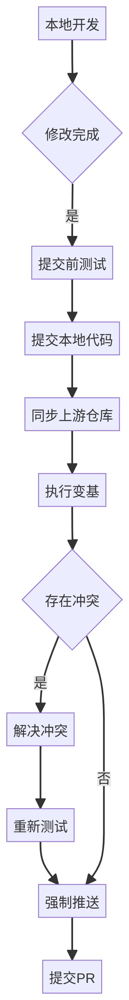

# 为 openvela 做出贡献

\[ [English](CONTRIBUTING.md) | 简体中文 | [繁體中文](CONTRIBUTING_zh-tw.md) \]

openvela 由一支活跃的软件工程师和研究人员团队开发。欢迎你加入 openvela 开源社区，为改进此项目做出任何贡献！

openvela 主要遵循 Apache License 2.0 许可证，具体请参看 LICENSE 文件。

## 一、签署贡献者许可协议 (CLA)

为了参与社区贡献，首次提交代码时，需要签署相应的**贡献者许可协议（Contributor License Agreement, CLA）**。以下是针对不同平台的具体步骤：

- **Gitee 平台**:

    - 请访问 [Gitee CLA 签署页面](https://gitee.com/organizations/open-vela/cla/zs6b7c48u6juka2tsnrnkzx6k88np85e) 完成签署。
    - 您可以通过 [我签署的 CLA](https://gitee.com/profile/clas) 查看签署状态。

- **GitHub 平台**:

    - 在提交新的 Pull Request (PR) 后，系统会提示您完成 CLA 的签署。请根据提示操作以完成签署流程。

## 二、错误报告

如果您认为在 openvela 中发现了错误，请首先确保您已使用了最新版本的 openvela 进行了测试（您的问题可能已得到修复）。

如果未解决，请搜索问题列表，查看是否已有类似的问题。

## 三、功能请求

请提交一个 Issue，描述您希望添加的功能、您需要它的原因以及预期的工作方式。

## 四、提交代码

如果您想给 openvela 增加新功能或者修复一些错误，先确认是否已有类似的问题。如果没有，请您新建一个问题，和大家讨论您的想法。

### 1、分支策略

- **trunk**：**trunk** 分支不接受 pull request。
- **dev**：从 **dev** 分支fork代码，并推送pull request。

### 2、提交代码前准备

在新建 pull request 之前遵循这些提示将加快审核周期。

- 添加适当的单元测试。
- 如果适用，添加集成测试。
- 不属于您更改范围的行不应被编辑（例如，不要格式化未更改的行，不要重新排序现有的导入）。
- 在任何新文件中添加适当的许可证标头。

### 3、提交您的更改  

#### 3.1 测试您的更改
  
请运行测试套件以确保没有出现任何问题。  

#### 3.2 签署贡献者许可协议

**首次提交需完成**：签署贡献者许可协议，请参考[签署贡献者许可协议 (CLA)](#一签署贡献者许可协议-cla)章节。

#### 3.3 提交代码



1. 检查当前状态。

    ```Bash
    # 查看工作区状态
    git status
    ```

2. 暂存更改。

    ```Bash
    # 添加特定文件到暂存区
    git add path/to/changed/file.cpp
    # 或添加所有更改
    git add .
    ```

3. 提交更改。

    ```Bash
    # 创建提交
    git commit -m "简明扼要的提交信息"
    # 或使用详细提交信息
    git commit
    ```

4. 配置上游仓库。

    ```Bash
    # 显示现有远程仓库地址
    git remote -v

    # 添加上游远程仓库引用（仅首次需要执行）
    git remote add upstream https://github.com/open-vela/[repository].git

    # 显示现有远程仓库地址（应包含origin和upstream）
    git remote -v
    ```

5. 获取最新代码并变基。

    ```Bash
    # 获取上游仓库的最新代码
    git fetch upstream

    # 将当前分支变基到最新主分支
    git rebase upstream/dev
    ```

6. 解决冲突（如有）。

    ```Bash
    # 检测冲突状态（推荐）  
    git status                   
    # 编辑冲突文件（如 conflict.cpp），可使用任何编辑器，如nano、vim、VSCode等
    nano conflict.cpp            
    # 标记为已解决  
    git add conflict.cpp  
    ```

7. 完成变基。

    ```Bash
    # 解决所有冲突后继续变基操作
    git rebase --continue

    # 确认变基完成状态
    git status
    ```

8. 强制推送更新：

    ```Bash
    # 强制推送更新后的分支到您的远程仓库
    git push --force origin dev
    ```

#### 3.4 创建合入请求

1. 访问 GitHub 上您的 fork 仓库。

2. 单击 **New pull request** 按钮。

3. 填写合入请求信息。

4. 单击 **Create pull request** 创建合入请求。

#### 3.5 合入请求后续工作

- 保持关注合入请求的评审意见。
- 及时响应评审者的反馈。
- 如需修改，在同一分支上进行更改并推送。
