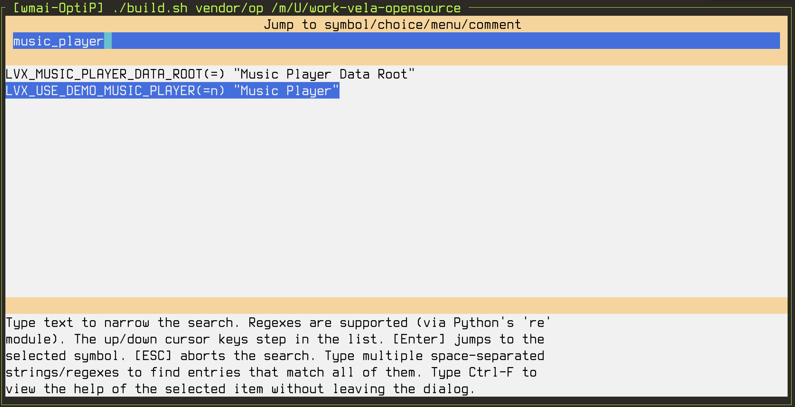
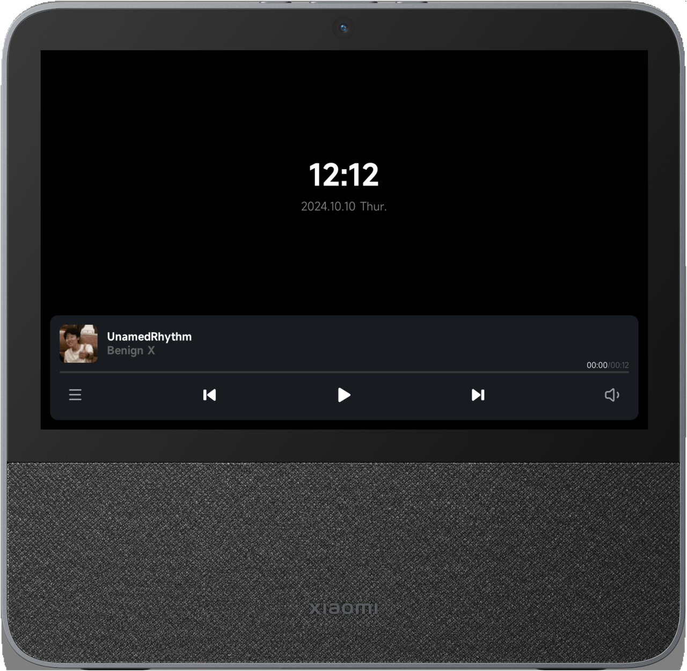

# Music Player Demo

\[ English | [简体中文](Music_Player_Example_zh-cn.md) \]

## Introduction

This article describes how to run the music player demo in openvela Emulator.

## Prerequisites

1. To build a development environment, please refer to [Environment Building](../Getting_Started/Set_up_the_development_environment.md).

2. To download the source code, please refer to [Download openvela source code](../Getting_Started/Download_Vela_sources.md).

## Step 1 Configure the project

1. Switch to the root directory of the openvela repository and execute the following command to configure the music player.
    > The simulator configuration file (defconfig) is in the `vendor/openvela/boards/vela/configs/goldfish-armeabi-v7a-ap/` directory. Use `build.sh` to configure and compile the code of the development board.

    ```Bash
    ./build.sh vendor/openvela/boards/vela/configs/goldfish-armeabi-v7a-ap menuconfig
    ```

    - build.sh: compilation script, used to configure and compile openvela code
    - vendor/openvela/boards/vela/configs/*: configuration path
    - menuconfig: open the menuconfig page and modify the configuration of the project code.

    After execution, the following interface appears:
    

2. Press the `/` key to search and modify the following configurations one by one:

    ```Bash
    LVX_USE_DEMO_MUSIC_PLAYER=y
    LVX_MUSIC_PLAYER_DATA_ROOT="/data"
    ```

    > Take `LVX_MUSIC_PLAYER_DATA_ROOT` as an example, and the modification method of `LVX_USE_DEMO_MUSIC_PLAYER` configuration is the same.

    1. Enter the configuration to be searched `LVX_USE_DEMO_MUSIC_PLAYER`, which supports fuzzy search, such as `music_player`, find the corresponding configuration, and press Enter to enter the configuration.

        

    2. Press the space bar, and `*` appears in `[ ]` to open the configuration.

        

    3. Set `LVX_MUSIC_PLAYER_DATA_ROOT` to `/data`, and press Enter to save the current configuration item after modification.

        

    4. Press the `Q` key to pop up the following exit save interface. 

        

    5. Press the letter `Y` key to save the configuration and exit the configuration modification page.

## Step 2 Compile the project

1. Switch to the root directory of the openvela repository and execute the following commands in the terminal:

    - -j16: Indicates using 16 threads to compile the code in parallel to speed up the compilation speed.

    ```Bash
    # Clean up the build product
    ./build.sh vendor/openvela/boards/vela/configs/goldfish-armeabi-v7a-ap distclean -j16

    # Start building
    ./build.sh vendor/openvela/boards/vela/configs/goldfish-armeabi-v7a-ap -j16
    ```

2. After successful execution, the following files will be obtained:

    ```C++
    ./nuttx
    ├── vela_ap.elf
    ├── vela_ap.bin
    ```

## Step 3 Start the simulator and push resources
The font and image resources used in the music player are located in `apps/packages/demos/music_player/res`. To push these resources to the corresponding file path mounted by the simulator, follow the steps below.

1. Switch to the root directory of the openvela repository and start the emulator:

    ```Bash
    ./emulator.sh vela
    ```

2. Use `ADB` supported by the emulator to push resources to the device. Open a new terminal in the code root directory and enter `adb push` followed by the file path to transfer the resources to the corresponding location.

    ```Bash
    # Install adb
    sudo apt install android-tools-adb

    # Push resources
    adb push apps/packages/demos/music_player/res /data/
    ```

## Step 4 Start the music player

Enter the following command in the simulator's terminal environment `openvela-ap>`:

```Bash
music_player &
```


## Step 5 Exit Demo

Close the simulator and exit Demo, as shown below:


## FAQ

### How to customize the music player

1. Modify the relevant configuration under `apps/packages/demos/music_player/res`, and add new music media files under the `res/musics` directory. The format currently only supports `*.wav`. You can convert media files in formats such as `*.mp3/aac/m4a` to `*.wav` format by yourself. Then modify the `res/musics/manifest.json` file in the directory:

    ```JSON
    {
      "musics": [
        {
          "path": "UnamedRhythm.wav",
          "name": "UnamedRhythm",
          "artist": "Benign X",
          "cover": "UnamedRhythm.png",
          "total_time": 12000,
          "color": "#114514"
        }
      ]
    }
    ```

    | Parameters | Parameter description |
    | :--------- | :--------------------------------------- |
    | path | The file path of the media to be played |
    | name | The name of the media |
    | artist | The name of the artist |
    | cover | The path of the cover. If no cover is provided, the cover will be displayed. |
    | total_time | The total playing time of the media, in `milliseconds`. |
    | color | Theme color, not used yet. |

    Refer to this format and add the media you want to play to the configuration file.

    For example, to add a music file called `Happiness.wav` with a playing duration of `186,507 ms`, you can modify it as follows.

      ```JSON
      {
        "musics": [
          {
            "path": "UnamedRhythm.wav",
            "name": "UnamedRhythm",
            "artist": "Benign X",
            "cover": "UnamedRhythm.png",
            "total_time": 12000,
            "color": "#114514"
          },
          {
            "path": "Happiness.wav",
            "name": "Xin",
            "artist": "Tang",
            "cover": "Good.png",
            "total_time": 186507,
            "color": "#252525"
          },
        ]
      }
      ```

    After modifying the configuration, you need to push the resources again. Execute the following command:

    ```Bash
    # Push resources
    adb push apps/packages/demos/music_player/res /data/
    ```

2. Exit the simulator.

3. Repeat steps 3 and 4.