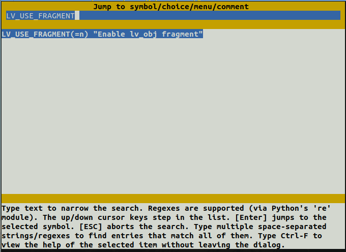

# Bandx Demo

\[ English | [简体中文](Smart_Band_Example_zh-cn.md) \]

## Introduction

Bandx is a smart band demo that incorporates watch dial, launcher, music, heart rate, stopwatch, sleep, sports, settings and flashlight, with a resolution of 194 x 368 pixels.Details about bandx are available in the “apps/packages/demos/bandx/” directory.

This article describes how to run this example on openvela Emulator.

## Prerequisites

1. Set up the development environment. Refer to [Environment Setup](../Getting_Started/Set_up_the_development_environment.md).

2. Download the source code. Refer to [Download openvela source code](../Getting_Started/Download_Vela_sources.md).

## Step 1: Configure the project

1. Switch to the root directory of openvela repository and execute the following command to configure Bandx.

   > The emulator configuration file (defconfig) is in the “vendor/openvela/boards/vela/configs/goldfish-armeabi-v7a-ap/” directory, and the emulator code is configured and compiled using “build.sh”.

    ```Bash
    ./build.sh vendor/openvela/boards/vela/configs/goldfish-armeabi-v7a-ap menuconfig
    ```

   - build.sh: A script for compilation used to configure and compile openvela code.
   - vendor/openvela/boards/vela/configs/goldfish-armeabi-v7a-ap: configuration path
   - menuconfig: Open the menuconfig page to modify the configuration of the project code.

   The following screen appears after execution:

    

2. Press the “/” key to search and modify the following configurations:

   ```Bash
   LV_USE_FRAGMENT = y
   LVX_USE_DEMO_BANDX = y
   BANDX_BASE_PATH = "/data"
   ```

   > Take LV_USE_FRAGMENT as an example for illustration. The other configurations are modified is the same way.

    1. Enter the configuration to be searched.

        

   2. Press “Enter” to go to the configuration page.

        

   3. Press “Enter” to open the configuration, and a \* that appears in [ ] indicates that the configuration is opened.

        

   4. Press the “/” key to continue searching for the remaining configurations, and modify them as described above.

   5. Press the letter Q to bring up the exit Save screen as follows.

        

   6. Press the letter Y to save the configuration and exit the Modify Configuration page.

## Step 2: Compile the project

1. Switch to the root directory of openvela repository and execute the following commands one by one in a terminal:

    ```Bash
    # Clean up build artifacts
    ./build.sh vendor/openvela/boards/vela/configs/goldfish-armeabi-v7a-ap distclean -j$(nproc)

   #Start to build
   ./build.sh vendor/openvela/boards/vela/configs/goldfish-armeabi-v7a-ap -j$(nproc)
   ```

2. After successful execution, you will get the following files:

    ```Bash
    ./nuttx
    ├── vela_ap.elf
    ├── vela_ap.bin
    ```

## Step 3: Launch the emulator and push resources

The font and image resources used in Bandx are located in ‘apps/packages/demos/bandx/resources/’. To push these resources to the corresponding file paths mounted by the emulator, follow the steps below.

1. Switch to the root directory of openvela repository and start the emulator:

    ```bash
    ./emulator.sh vela
    ```

2. Push resources to the device by using emulator-supported ADB. Open a new terminal in the root directory of openvela repository, type “adb push” followed by the file path to transfer the resources to the appropriate location.

    ```bash
    # Install adb
    sudo apt install android-tools-adb

    # Push resources
    adb push apps/packages/demos/bandx/resource/font/assets/* /data/font/
    adb push apps/packages/demos/bandx/resource/image/assets /data/image/
    ```

   > If “BANDX_BASE_PATH” is changed to a non-default value like “/tmp”, the resource files must also be moved to the “/tmp/font/” and “/tmp/image/” directories.Otherwise, a “resource not found” error will occur.

## Step 4: Start Bandx

1. Enter the following command in the emulator's terminal environment “openvela-ap”:

   ```Bash
   bandx &
   ```

    

2. To access the Launcher screen, swipe quickly from right to left.Single-click different icons to navigate to subpages, such as the Heart Rate page shown below.To exit the page, swipe quickly from left to right.

   > Note: The music page is just a UI display, with no access to audio.

    

3. Turn on “Auto-show” in settings to auto-play the entire application. Turn off “Auto-show” to end playing it.

## Step 5: Exit Demo

Shut down the emulator to exit Demo, as shown below:


## FAQ

### 1. adb command not found

#### Reason

The "adb" tool is not installed.

#### Solution

Install “adb” and execute the following command:

``` Bash
sudo apt install android-tools-adb
```

### 2. Garbled text is shown

#### Reason
Font resources are not loaded correctly.

#### Solution

Follow [Step 3](#step-3-launch-the-emulator-and-push-resources) to push resources.
