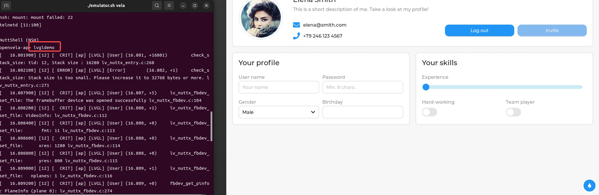

# Running Build Artifacts on openvela Emulator

\[ English | [简体中文](./Run_Vela_on_Vela_Emulator_zh-cn.md) \]

## Overview of openvela Emulator

The openvela Emulator simulates openvela devices on desktop computer so that developers can test application or driver on a variety of devices without needing to have each physical device.

The openvela emulator is extended and enhanced based on the Android emulator. 

The openvela Emulator offers these advantages:

* Exclusive mode for running openvela image, bypasses android-specific setup
* Load openvela specific kernel in openvela mode
* Load openvela specific partitions in openvela mode
* Provide NMEA checksum support for GNSS simulator

The following hosts are already supported:

* Linux x86\_64
* Linux arm64
* macOS x86\_64
* macOS aarch64
* Windows x64

The following target are already supported:

* arm
* arm64
* x86
* x86\_64

The following goldfish specific drivers have been implemented:

* Qemu Pipe
* ADB
* Battery
* Camera
* GNSS
* Graphic
* Sensors

## Run openvela Emulator

1. Switch to the root directory of the openvela repository and start an openvela Emulator instance by passing the `vela` option to emulator.sh.

    ```Bash
    ./emulator.sh vela
    ```

2. After openvela starts and enters `nsh`, run the following command in `openvela-ap>`:
    ```Bash
    lvgldemo &
    ```
    The effect after execution is as follows:
    

3. Exit the openvela Emulator instance, as shown below:

    

## Control openvela Emulator

You can control a running openvela Emulator instance through ADB or console.

* [Android Debug Bridge commands](./Android_Debug_Bridge_commands.md)
* [Send emulator console commands](./Send_emulator_console_commands.md)

## Debugging with openvela Emulator

* [Debugging with openvela Emulator](./Debugging_Vela_with_Vela_Emulator.md)
