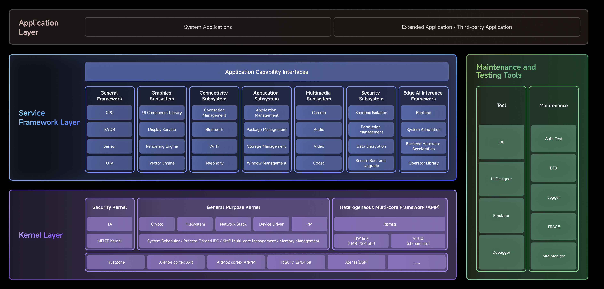

  

<h1 align="center">openvela</h1>

# openvela Open Source Project

\[ English | [简体中文](README_zh-cn.md) ]

## About openvela

openvela is an operating system specifically crafted for the AIoT industry, with a focus on being lightweight, standards-compliant, secure, and highly scalable. It has become the technology of choice for millions of IoT devices and AI gadgets, including smart watches, fitness bands, smart speakers, earbuds, smart appliances, and robotics.

The name "Vela" is originated from the Latin term for "sail," which is also the name of the constellation resembling a sail in the southern sky. We aspire to partner with developers and set sail on a voyage through the AIoT landscape.

## Technical Architecture

- **Kernel Layer**

    The kernel layer provides fundamental operating system functions, including task scheduling, inter-process communication (IPC), and file system management. It also supplies compact, efficient components such as device drivers, a lightweight TCP/IP protocol stack, and power management modules. This layer supports both homogeneous and heterogeneous multi-core architectures, enhancing performance support across diverse hardware platforms.

- **Service Framework Layer**

    The service framework layer is a general-purpose framework designed to extend system services. It includes connectivity subsystem, graphics subsystem, multimedia subsystem, security subsystem, and XPC cross-core communication capabilities. This layer provides flexible support for service expansion, serving as the essential foundation for system functional expansion.

- **Maintenance and Testing Tools**

    Maintenance and testing tools include common utilities and diagnostic frameworks. In addition to standard tools like Logger and Debugger, they feature the Emulator — a high-fidelity device simulator that supports full functional emulation, including CPU instruction-set simulation.  The Emulator currently supports multiple product form factors, including smart panels, smartwatches, smart bands, and smart screen speakers. By leveraging the Emulator’s PC-based debugging tools, developers can perform application development and testing without physical devices, significantly reducing both development and debugging efforts.

## Technical Advantages

- **Highly Scalable**

    openvela has been designed to be modular and scalable, allowing it to easily adapt to a wide range of IoT applications. It can fit in a small BLE module with 32KB RAM, and scale up to a powerful smart display device with 512MB RAM, highly scalable!

- **One-Stop Solution**

    Over the years, openvela has evolved into a powerful platform with comprehensive feature sets, making it a one-stop solution for various IoT applications. We consistently incorporate new functionalities to meet emerging needs. By leveraging openvela, manufacturers can significantly reduce their R&D costs and accelerate their product development cycles.

- **Mature Heterogeneous Computing Support**

    openvela offers top-of-the-line support for heterogeneous multi-core systems, featuring a seamless IPC mechanism between various processing units such as MCU, MPU, DSP, GPU, and NPU. Additionally, openvela provides an advanced RPC framework between openvela, Linux, and Android systems to enable hybrid OS leveraging strength from three systems.

- **Standard Compliant and High Portability**

    openvela Kernel is built upon Apache NuttX,  which is often referred to as "tiny Linux". With this foundation, openvela achieves a high degree of conformity with the POSIX standard. Our team has been continually enhancing its POSIX compatibility, which has now reached an impressive 88%. Because of this standards conformance, software developed under other standard OSs (such as Linux) can be easily ported to openvela with minimum effort.

- **Comprehensive Connectivity Suite**

    openvela offers broad protocol support, including Bluetooth BR/EDR/LE, LE Mesh, WiFi, Matter, IEEE802.15.4, and LTE Cat1, Ethernet, CAN/LIN, etc. Additionally, it seamlessly integrates with Xiaomi HyperConnect protocols.

- **Rich Developer Tools**

    openvela offers a comprehensive suite of developer tools, including system monitoring, performance analysis, debugger, trace, crash dumb, and log analysis tools.

## Hardware Support

- openvela supports a variety of architectures (ARM32, ARM64, RISC-V, Xtensa, MIPS, CEVA, etc.) and platforms.
- Please refer to the [Supported Architectures and Platforms](https://nuttx.apache.org/docs/latest/platforms/index.html) page for a complete list.
- For adaptation cases regarding development boards, please refer to the [Case Documentation](./en/dev_board/Development_Board.md).

## Quick start

### Device Development

If you want to experience openvela, we provide a fully functional emulator that can be used without a hardware platform. For more information, refer to the following guide.

1. [Set up the development environment](./en/quickstart/Set_up_the_development_environment.md)
2. [Download openvela source code](./en/quickstart/Download_Vela_sources.md)
3. [Compile openvela source code](./en/quickstart/Build_Vela_from_sources.md)
4. [Run build artifacts on Emulator](./en/quickstart/Run_Vela_on_Vela_Emulator.md)

### Quick App Development

[Quick App Quick Start](https://iot.mi.com/vela/quickapp/zh/guide/start/use-ide.html)

## Sub-repository List

| Sub-repository Link                            | Description                                                                                                                                                                                                                                                                                                                                                                                                         |
| :--------------------------------------------- | :------------------------------------------------------------------------------------------------------------------------------------------------------------------------------------------------------------------------------------------------------------------------------------------------------------------------------------------------------------------------------------------------------------------ |
| [frameworks](../../../../open-vela/frameworks) | openvela service framework: primarily includes Bluetooth, telephony, graphics, multimedia, application frameworks, security, and system service frameworks (KVDB, OTA, healthd, binder, charger, etc.).                                                                                                                                                                                                             |
| [vendor](../../../../open-vela/vendor)         | Drivers and frameworks provided by the original chip manufacturers.                                                                                                                                                                                                                                                                                                                                                 |
| [nuttx](../../../../open-vela/nuttx)           | A kernel built on the open-source real-time operating system NuttX, providing essential kernel functions, including task scheduling, inter-process communication, file systems, TCP/IP stack, device drivers, and power management, while offering a standard POSIX interface. For more information about the NuttX operating system, you can visit the [Apache NuttX](https://nuttx.apache.org/) official website. |
| [apps](../../../../open-vela/apps)             | `apps` is the application library for the open-source real-time operating system (NuttX), containing a series of applications and utilities designed for NuttX RTOS. These applications and tools include shell command-line tools, file system tools, network tools, etc., which can help developers develop and debug embedded systems based on NuttX RTOS more conveniently.                                     |
| [external](../../../../open-vela/external)     | Third-party libraries introduced by openvela.                                                                                                                                                                                                                                                                                                                                                                       |
| [tests](../../../../open-vela/tests)           | This repository contains interface tests, specifically including core API tests for multimedia, file systems, memory management, and socket communication.                                                                                                                                                                                                                                                          |
| [docs](../../../../open-vela/docs)             | Developer documentation for openvela.                                                                                                                                                                                                                                                                                                                                                                               |

## Developer Documentation

- [Documentation Center](https://doc.openvela.com/document)

## Application Example Center

A collection of native and Quick App examples for developers to learn from.

### Native Apps

Here are some typical native application examples demonstrating the usage of different modules and features.

- [Music Player](./en/demo/Music_Player_Example.md): Demonstrates audio playback, playlist management, and background services.
- [Smart Band](./en/demo/Smart_Band_Example.md): Demonstrates sleep monitoring, heart rate monitoring, music playback, and a stopwatch.
- [Cycling Computer](./en/demo/X_Track.md): Demonstrates GPS positioning, real-time data display, and route tracking.
- [Calculator](../../../../open-vela/packages_demos/blob/dev/calculator/Readme.md): A basic example of UI and logic interaction.
- [Relation Calculator](../../../../open-vela/packages_demos/blob/dev/relation_calculator/Readme.md): Demonstrates complex conditional logic and algorithm implementation.
- [Whack-a-Mole](../../../../open-vela/packages_demos/blob/dev/Whackmole/README.md): Demonstrates a game loop, random number generation, and animation effects.

To see the full list of native apps, please visit the [Native App Examples Repository](../../../packages_demos/blob/dev/README_zh-cn.md).

### Quick Apps

- [Mi Band Weather App](../../.././packages_fe_examples/blob/dev/weather/README.md): Presents a clean and intuitive seven-day weather forecast.
- [Music Player](../../.././packages_fe_examples/blob/dev/player/README.md): Demonstrates a basic music player, including playback, volume control, and playlist viewing.
- [Calendar](../../.././packages_fe_examples/blob/dev/calendar/README.md): Demonstrates a basic calendar.

More Quick App examples are continuously being added. To see all examples, please visit the [Quick App Examples Repository](../../../packages_fe_examples).

## openvela Versioning Strategy

- **dev (Development Branch)**

    Contains the latest features and fixes, and may be unstable. Recommended for developers who wish to experience new features or contribute.

- **trunk (Main Stable Branch)**

    A comprehensively tested, stable version. Stable features from the `dev` branch are merged here. Recommended for most users seeking stability.

- **Release Tags**

    Permanent tags created from the `trunk` branch, representing an official, stable release. We strongly recommend using the latest release tag in **production environments** to ensure maximum stability.

    - **List of Released Versions**:

        - `trunk-5.2`: For detailed changes in this version, please refer to its [v5.2 Release Notes](./en/release_notes/v5.2.md).

    - **Maintenance Policy**:

        Critical bug fixes for a released version will be delivered by releasing a new patch tag (e.g., `trunk-5.2.1`).

## Code contribution

- [Code Contribution Guide](./CONTRIBUTING.md)
- [Documentation Contribution Guide](./en/contribute/process/doc_dev_process.md)

## Licensing

The openvela project consists of multiple independent repositories. Its licensing policy is as follows:

1. Basic Principles

    The openvela project generally adopts the **Apache 2.0** license. However, the specific license for each code repository is determined by the `LICENSE` file located in its respective root directory.

2. Vendor Repositories

    Repositories under the `vendor` directory are provided by third parties (such as chip manufacturers). These repositories follow their own independent licenses (e.g., MIT, BSD, etc.) and are **not** governed by the openvela project's Apache 2.0 license. Please ensure you review and comply with their respective terms before use.

3. Third-Party Dependencies

    For information regarding third-party open source components referenced in the project code and their licenses, please refer to the [Third-Party Open Source Software Notice](./Third_Party_and_Open_Source_Components.md) file.

## Community and Support

We welcome you to interact with and contribute to the openvela community through our various channels.

## Technical Discussions and Contributions

- **Issues**: If you have any questions, suggestions, or find any bugs, submit a new issue on the Issues page. Try to provide detailed information, so that we can understand and solve the problem faster.
- **Pull Requests**: If you find an issue and have fixed it, you are welcome to submit a Pull Request. Please make sure to follow our [Contribution Guide](./CONTRIBUTING.md).
- **Discussions**: If you have a broader topic or discussion, you can start a new discussion on the Discussions page.

### WeChat Official Account

Scan the QR code below to follow the **openvela** official WeChat account for the latest project news, in-depth technical articles, and updates on community events.

