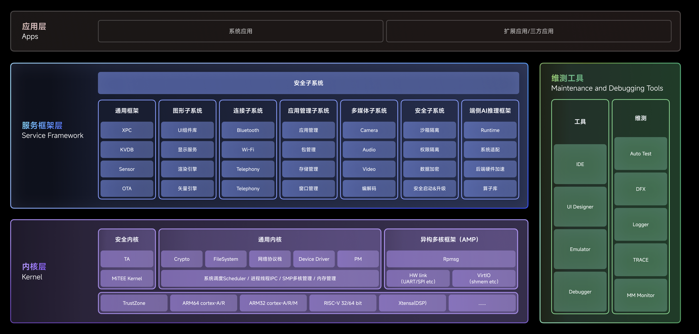

<div align="center">
  
</div>

<h1 align="center">openvela</h1>

# openvela 开源项目

[ [English](README.md) | 简体中文]

## openvela 简介

openvela 操作系统专为 AIoT 领域量身定制，以轻量化、标准兼容、安全性和高度可扩展性为核心特点。openvela 以其卓越的技术优势，已成为众多物联网设备和 AI 硬件的技术首选，涵盖了智能手表、运动手环、智能音箱、耳机、智能家居设备以及机器人等多个领域。

Vela 的命名源自拉丁语中船帆的含义，也是南方星空中船帆星座的名字。我们选择这个名字的意义是希望与开发者一道携手，共同踏上星辰大海的征途。

## 技术架构



- **内核层**

    提供基础的操作系统（OS）功能，包括任务调度、跨进程间通信（IPC）、文件系统管理。此外，还提供设备驱动、轻量级 TCP/IP 协议栈和电源管理等精简高效的组件。同时，内核层支持同构多核和异构多核架构，以提升系统在不同架构下的性能支持能力。

- **服务框架层**

    通用的服务框架，专为扩展系统服务设计，包含连接子系统、图形子系统、多媒体子系统、安全子系统和 XPC 跨核通信能力等。该层提供灵活的服务扩展支持，是系统功能扩展的重要基础。

- **维测工具**

    常用工具和维测框架，除了常见的 Logger 和 Debugger 工具外，还包含 Emulator 这一强大的高仿真设备模拟器工具。Emulator 支持全面功能仿真，同时支持 CPU 指令集仿真。

    目前模拟器已支持多种产品形态，包括智慧面板、手表、手环和智能有屏音箱等。通过 Emulator 开发者可以使用 PC 端丰富的调试工具和信息，无需真实设备即可进行应用开发调试，降低开发和调试难度。

## 技术优势

- **高度可扩展**

    openvela 的设计注重模块化与可扩展性，使其能够灵活适应多样的物联网应用场景。小到仅配备 32KB RAM 的微型 BLE 模组，大到拥有 512MB RAM 的智能有屏音箱，openvela 都能提供高度可扩展的支持。

- **一站式解决方案**

    随着时间的推移，openvela 不断沉淀了各类 AIoT 应用的共性需求，成为一个功能完备的软件平台，为各类物联网解决方案提供了全面的支持。厂商采用 openvela，可以显著降低研发成本并加速产品的上市时间。

- **成熟的异构计算支持**

    openvela 为异构多核系统提供了强大的支持，实现了 MCU、MPU、DSP、GPU 以及 NPU 等不同处理单元间无缝的 IPC 通信机制。此外，openvela 还提供了一个高级的 RPC 框架，简化了 openvela 与 Android 和 Linux 系统的通信，使快速打造一个异构融合操作系统成为可能。

- **标准兼容和高可移植性**

    openvela 内核基于 Apache NuttX ，这个被称为 "Tiny Linux" 的系统为 openvela 提供了高标准的 POSIX 兼容性。通过持续提升其 POSIX 兼容性，openvela 当前已达到 89% 的兼容水平。这种高标准的兼容性意味着在其他标准操作系统（例如 Linux）上开发的软件可以轻松迁移到 openvela，几乎不需要额外的工作。

- **全面的连接套件**

    openvela 提供了广泛的协议支持，包括蓝牙 BR/EDR/LE、LE Mesh、WiFi、Matter、LTE Cat1、以太网、CAN/LIN 等。同时，它还能与小米的 HyperConnect 协议无缝集成，提供了强大的连接能力。

- **丰富的开发者工具**

    openvela 提供了一系列完备的开发者工具，包括系统监控、性能分析、调试器、追踪、崩溃分析和日志分析工具，为开发者提供了强大的支持。

## 硬件支持

- openvela 支持各种不同的架构（ARM32、ARM64、RISC-V、Xtensa、MIPS、CEVA 等）和硬件平台。请在[硬件支持](https://nuttx.apache.org/docs/latest/platforms/index.html)页面上查看完整列表。
- 关于**开发板**的适配案例，请参见[案例文档](./zh-cn/dev_board/Development_Board.md)。

## 最新动态

- 端侧 AI Agent 能力升级：openvela 提供 **[ai_agent](../../../packages_ai_agent/blob/dev-ai-contest-2026/README.md)** AI Agent 框架，支持多 LLM 后端、35+ 内置工具、Skills 技能系统、主动任务与多渠道接入，仅需约 256KB RAM 即可在手表、眼镜、音箱等小型设备上运行端侧智能应用。

- AI 辅助开发体验升级：openvela 推出官方 AI 开发技能集 **[.claude](https://github.com/open-vela/.claude)**，配合 Claude Code 等 AI 编程工具，用自然语言即可完成环境搭建、编译构建、驱动适配与调试，显著降低开发门槛。

- openvela 官方网站正式上线：openvela 现已拥有独立的官方网站，为开发者提供更加便捷的信息获取渠道，包括项目介绍、文档中心、社区动态等。欢迎访问 [openvela 官网](https://openvela.com)。

- openvela 生态迎来重要里程碑：润芯微智能科技股份有限公司自主研发的 **[Gemini-S1](https://rivotek.feishu.cn/wiki/Onndw4lmniFBnEk0Rb7cDbwOnTc)** 开发板成为首款通过 openvela 官方兼容性认证的开发板，标志着 openvela 生态建设迈出了坚实的一步。

- 硬件生态大幅扩展：新增对 **英飞凌 AURIX™ TC4**、**旗芯微 (Flagchip) MCU** 以及 **QEMU-R52 SIL** 平台的适配支持。（查看 [TC4 指南](./zh-cn/quickstart/development_board/tc4d9_evb_guide.md) / [旗芯微指南](./zh-cn/quickstart/development_board/fc7300f8m_evb_guide.md)）

- Ubuntu 开发体验升级：openvela VS Code 插件现已**完美支持 Ubuntu 环境**。Linux 开发者现在也可以享受从项目创建、编译构建到系统调试的一站式流畅体验，开发效率显著提升。即刻体验：[VS Code 插件使用指南](./zh-cn/quickstart/vscode_plugin_usage.md)。

## 版本发布管理 (Version Strategy)

我们基于 `trunk` 分支进行版本发布，通过标签（Tags）管理发布历史，确保生产环境的可追溯性与稳定性。

### 发布标签 (Release Tags)

发布标签是基于 `trunk` 分支创建的不可变标记（Immutable Marker）。每个标签代表一个正式发布的 openvela 版本。

- **生产环境建议**：为了确保系统的最高稳定性和安全性，我们**强烈建议**在生产环境（Production Environment）中使用最新的发布标签，而非直接使用分支代码。

### 已发布版本列表

以下是当前已发布的稳定版本及其变更说明：

- **trunk-5.5**：请查阅 [v5.5 版本发布说明](./zh-cn/release_notes/v5.5.md) 了解详细变更。

- **trunk-5.4**：请查阅 [v5.4 版本发布说明](./zh-cn/release_notes/v5.4.md) 了解详细变更。

- **trunk-5.2**：请查阅 [v5.2 版本发布说明](./zh-cn/release_notes/v5.2.md) 了解详细变更。

### 硬件适配特别说明 (Hardware Adaptation Guide)

为提升适配效率并确保代码稳定性，针对进行硬件移植（Porting）的开发者，我们提供以下建议：

- **推荐基准**：建议**优先基于 openvela 最新发布版本**（即 `trunk` 上的 Release Tag）进行硬件适配开发。
- **大赛参赛者**：参加 openvela AI 硬件大赛的开发者（含新硬件平台适配赛道）请**统一基于大赛分支 `dev-ai-contest-2026`** 进行开发，以上通用建议不适用于大赛场景。
- **风险提示**：当前 **`dev` 分支** 处于快速迭代期，代码更新较为频繁，可能存在底层接口变动或临时性问题，**不推荐**作为硬件适配的基准代码。
- **自测验证**：完成移植后，可参考社区提供的 [xTS 认证测试用例精简集](./zh-cn/test_dev_guide/openvela_xts_test_cases.md) 进行自测，涵盖系统内核、驱动 BSP、文件系统、WiFi、蓝牙、音视频等基础能力，命令可直接拷贝至 nsh 执行，无需从零编写。
- **获取支持**：如有适配需求或在过程中遇到技术疑问，欢迎**提交 Issue** 或者通过**微信社区**与我们取得联系，openvela 团队将提供必要的开发支持。

### 版本维护策略

openvela 遵循严格的版本维护生命周期：

- **补丁更新**：针对已发布版本中发现的关键缺陷（Critical Bugs）或安全漏洞，团队将发布新的补丁版本标签（Patch Release）进行修复。
- **命名规则**：补丁版本将在原版本号基础上递增，例如 `trunk-5.2.1`。

## 代码分支管理 (Branch Strategy)

openvela 采用双分支模型来平衡系统的创新性与稳定性。请根据您的开发需求选择合适的分支。

### dev-ai-contest-2026 (大赛分支)

- **定义**：这是 **首届 openvela AI 硬件全球开发者大赛** 的专用分支，在 openvela 代码基础上集成了大赛所需的示例、工具链与文档。
- **适用人群**：所有大赛参赛者。
- **使用要求**：参赛作品的代码拉取、开发与提交**统一基于本分支**（请勿使用 dev 或 trunk），以确保与大赛环境及评审标准一致。
- **代码拉取**：请参见 [快速入门（Ubuntu）](./zh-cn/quickstart/openvela_ubuntu_quick_start.md)，其中提供 GitHub / Gitee / GitCode 多源的完整 `repo init` 与同步命令。

### dev (开发分支)

- **定义**：这是 openvela 的前沿开发分支，汇集了最新的功能特性与缺陷修复。
- **状态**：代码更新频率高，处于持续集成与快速迭代状态，可能包含尚未完全验证的特性，因此可能存在不稳定性。
- **适用人群**：

    - 希望抢先体验新功能的开发者。
    - 计划向社区提交代码、参与核心功能建设的贡献者。

### trunk (主干稳定分支)

- **定义**：这是经过全面测试的主干分支，代表了当前系统的稳定状态。
- **状态**：`dev` 分支中的功能在经过严格测试验证稳定后，会被合并至此分支。
- **适用人群**：大多数对系统稳定性有较高要求的用户，以及进行标准应用开发的工程师。

## 快速入门

### 设备开发

如果您想要体验 openvela，我们提供一个功能完备的模拟器，无需硬件平台即可使用。有关详细信息，请参阅如下指南。

[快速入门（Ubuntu）](./zh-cn/quickstart/openvela_ubuntu_quick_start.md)

> **AI 辅助搭建**：如果您使用 AI 编程助手，可借助 openvela 官方 AI 技能集快速搭建开发环境，详见下方 [AI 辅助开发](#ai-辅助开发openvela-ai-skills) 一节。

### 快应用开发

[快应用快速入门](https://iot.mi.com/vela/quickapp/zh/guide/start/use-ide.html)

## AI 辅助开发（openvela AI Skills）

[.claude](https://github.com/open-vela/.claude) 是 openvela 官方维护的 AI 开发技能集（Skills），为 AI 编程助手提供 openvela 环境搭建、编译构建、驱动适配、调试优化等专业领域知识，是基于 AI Coding 工作流开发 openvela 的推荐入口。

配合 Claude Code 等 AI 编程工具使用：

```bash
git clone https://github.com/open-vela/.claude.git .claude
```

克隆后，向 AI 描述你的需求（例如"帮我搭建 openvela 开发环境"），AI 即可借助这些 Skills 自动完成环境搭建、编译、调试等任务。

## 子仓库列表

| 子仓库链接                                     | 描述                                                                                                                                                                                                                                                                            |
| :--------------------------------------------- | :------------------------------------------------------------------------------------------------------------------------------------------------------------------------------------------------------------------------------------------------------------------------------ |
| [frameworks](../../../../open-vela/frameworks) | openvela 服务框架：主要包含蓝牙、电话、图形、多媒体、应用框架、安全、系统服务框架（KVDB、OTA、healthd、binder、charger 等）。                                                                                                                                                   |
| [vendor](../../../../open-vela/vendor)         | 芯片原厂的驱动和框架。                                                                                                                                                                                                                                                          |
| [nuttx](../../../../open-vela/nuttx)           | 基于开源实时操作系统 NuttX 打造的内核，提供基础的内核功能，包括任务调度、跨进程通信、文件系统、TCP/IP 协议栈、设备驱动和电源管理等，同时对上提供标准的 POSIX 接口。如果您想要对 NuttX 操作系统有更深入了解，可以在 [Apache NuttX](https://nuttx.apache.org/) 官网查看更多信息。 |
| [apps](../../../../open-vela/apps)             | `apps` 是开源实时操作系统（NuttX）的应用程序库，包含了一系列为 NuttX RTOS 设计的应用程序和实用工具。这些应用程序和工具包括 shell 命令行工具、文件系统工具、网络工具等，它们可以帮助开发者更方便地开发和调试基于 NuttX RTOS 的嵌入式系统。                                       |
| [external](../../../../open-vela/external)     | openvela 引入的三方库。                                                                                                                                                                                                                                                         |
| [tests](../../../../open-vela/tests)           | 该仓库包含接口测试，具体包括多媒体、文件系统、内存管理和 socket 通信等核心 API 的测试。                                                                                                                                                                                         |
| [docs](../../../../open-vela/docs)             | openvela 对应的开发者文档。                                                                                                                                                                                                                                                     |
| [packages](../../../../open-vela/packages)     | openvela 应用与示例包集合，包含 AI Agent 框架（ai_agent）、原生应用与游戏示例（demos）、快应用示例（fe_examples）及快应用框架等。大赛相关的示例与框架主要位于此仓库。                                                                                                            |
| [build](../../../../open-vela/build)           | openvela 编译构建系统，提供 `build.sh`、CMake/Kconfig 构建脚本与编译配置。                                                                                                                                                                                                      |
| [.claude](https://github.com/open-vela/.claude) | openvela 官方 AI 开发技能集（Skills），配合 AI 编程工具辅助环境搭建、编译、驱动适配与调试，详见 [AI 辅助开发](#ai-辅助开发openvela-ai-skills) 一节。                                                                                                                              |

> 说明：`repo sync` 后还会在工作区生成 `prebuilts/` 目录，存放编译工具链、QEMU、模拟器等平台预编译二进制。该目录由 `repo` 按平台自动拉取，无需手动维护或单独建仓。

## 开发者文档

- [文档中心](https://doc.openvela.com/document)
- [API 参考文档](./zh-cn/api/index.md) — 内核接口、网络接口、应用框架 API 完整说明

## 应用示例中心

汇总可供开发者参考学习的原生应用与快应用示例。

### 原生应用 (Native Apps)

以下是一些典型的原生应用示例，展示了不同模块和功能的使用方法。

- [音乐播放器](./zh-cn/demo/Music_Player_Example_zh-cn.md)：演示音频播放、列表管理和后台服务。
- [智能手环](./zh-cn/demo/Smart_Band_Example_zh-cn.md)：演示睡眠监测、心率监测、音乐播放、秒表计时。
- [自行车码表](./zh-cn/demo/X_Track_zh-cn.md)：演示 GPS 定位、实时数据显示和运动轨迹记录。
- [计算器](../../../../open-vela/packages_demos/blob/dev-ai-contest-2026/calculator/Readme.md)：一个基础的 UI 与逻辑交互示例。
- [亲戚计算器](../../../../open-vela/packages_demos/blob/dev-ai-contest-2026/relation_calculator/Readme_zh-cn.md)：演示复杂的条件逻辑与算法实现。
- [打地鼠](../../../../open-vela/packages_demos/blob/dev-ai-contest-2026/Whackmole/README_zh-cn.md)：演示游戏循环、随机数生成和动画效果。

查看完整的原生应用列表，请访问[原生应用示例仓库](../../../packages_demos/blob/dev-ai-contest-2026/README_zh-cn.md)。

### AI Agent 应用

运行在 openvela 上的端侧 AI Agent 框架，支持多 LLM 后端、35+ 内置工具、Skills 技能系统、主动任务与多渠道接入，可在约 256KB RAM 的小型设备上运行。

- [ai_agent](../../../packages_ai_agent/blob/dev-ai-contest-2026/README.md)：AI Agent 框架，提供对话、工具调用、Skills、主动任务、MCP 协议、多设备协作等能力，是 AI 硬件应用开发的核心基座。

### 快应用（Quick Apps）

- [小米手环天气预报应用](../../.././packages_fe_examples/blob/dev-ai-contest-2026/weather/README.md)：提供简洁直观的未来七日天气信息展示。
- [音乐播放器](../../.././packages_fe_examples/blob/dev-ai-contest-2026/player/README.md)：演示一个基础的音乐播放器，包含音乐的播放，音量调节，歌单查看。
- [日历](../../.././packages_fe_examples/blob/dev-ai-contest-2026/calendar/README.md)：演示一个基础的日历。

快应用相关示例正在持续丰富中。查看所有示例，请访问[快应用示例仓库](../../../packages_fe_examples)。

## 参与贡献

- [代码贡献指南](./CONTRIBUTING_zh-cn.md)
- [文档贡献指南](./zh-cn/contribute/process/doc_dev_process.md)

## 许可协议

openvela 项目由多个独立的仓库组成，其许可证策略如下：

1. 基本原则

    openvela 项目整体采用 Apache 2.0 作为主许可证，各代码库的许可证以各仓库根目录下 LICENSE 文件为准。

2. Vendor 仓库

    `vendor` 目录下的仓库由芯片厂商等第三方提供，它们遵循各自独立的许可证（如 MIT, BSD 等），不受 openvela 项目的 Apache 2.0 许可证约束。使用前请务必查阅并遵守其规定。

3. 第三方依赖组件

    项目代码中引用的第三方开源组件及其许可证信息，请参阅[第三方开源组件声明](Third_Party_and_Open_Source_Components_zh-cn.md)文件。

## 社区与支持

我们欢迎您通过多种渠道与 openvela 社区互动和贡献。

### 技术讨论与贡献

- **Issues**: 如果你有任何问题、建议或发现任何 Bug，请在 Issues 页面提交一个新的 Issue。请尽量提供详细的信息，以便我们更快地理解和解决问题。
- **Pull Requests**: 如果你发现了问题并已经修复，欢迎提交 Pull Request。请确保遵循我们的[贡献指南](./CONTRIBUTING_zh-cn.md)。
- **Discussions**: 如果你有更广泛的话题或讨论，可以在 Discussions 页面发起一个新的讨论。

### 微信社区

欢迎加入 **openvela** 社区！扫描下方二维码关注公众号，或添加小助手入群。

|                               官方公众号                                |                     技术交流群                      |
| :---------------------------------------------------------------------: | :-------------------------------------------------: |
|  |  |
|               **关注我们**<br>获取一手资讯与深度技术文章                |            **加入群聊**<br>扫码添加好友             |
