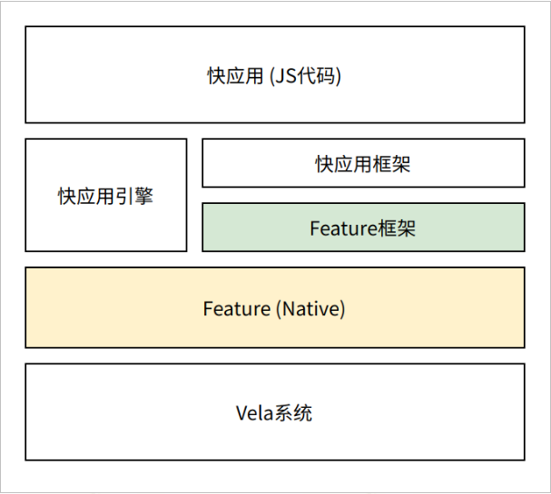

# README

## Feature框架

在快应用开发中, 需要为快应用增加一些新的能力, 这些能力都是通过C/C++语言编写。Feature框架就是一个帮助系统开发者为快应用扩展功能的框架, SDK以及工具集。




## Feature框架能力

由Feature框架提供的运行时框架, API, 以及JIDL语言及工具组成.
- 提供JS层调用Native代码的执行框架
- Feature框架API提供一组Native代码与JS交互的接口
- JIDL则是一个接口描述语言, 用于自动生成JS和Native相互调用的接口.


### Feature的概念模型

#### 静态概念模型

由于Feature是由Native向JS提供的接口, 所以 Feature的概念也遵循JS的概念.

Feature有3层概念:

1. Module: 一个Feature就是一个模块, 它等同于C语言里面的程序模块. 它没有实例, 是全局存在的;
2. Prototype: 原型, 等同于JS中的原型对象, 类似C++里面的类, 但是又有所不同.  一个快应用实例会产生一个Prototype.  所有的Feature上的函数, 属性都是在Prototype上管理的;
3. Instance: 实例, 一个APP内有多个实例 (每Require一次就会产生一个实例), 实例上保存了所有的处理数据.

具体到快应用中:

1. 一个快应用实例只有一个Prototype;
2. 一个快应用页面一般只包含一个Feature的Instance.

从系统角度上看Feature的概念


#### 运行时概念模型

每个Feature都可以关联Native数据, 所关联的内容有所区别;运行时概念模型如下;


#### Feature的生命周期


### Feature框架提供的接口能力

#### 自动生成Feature Prototype和Instance

Feature框架帮助开发者创建Feature的Prototype和Instance. 

1. Feature开发者需要提供一个FeatureDescription: 描述Feature的信息, 包括
   1. Feature的名字
   2. Feature的成员组成
      - Feature支持的方法, 包括方法名, 参数列表, 返回值,以及实现回调函数
      - 属性的名字, 类型, 以及实现函数
      - 其他等
2. 根据FeatureDescription生成FeaturePrototype和FeatureInstance, 并以`FeatureProtoHandle`和`FeatureInstanceHandle`的方式反馈给开发者


#### 提供参数转换

从JS到Native, Feature框架提供参数转换能力, 将JS参数转换为普通参数, 下表提供了基本的转换能力

| **JS类型**     | **C类型**                | **说明**                                                     |
| ------------------ | ------------------------ | ------------------------------------------------------------ |
| number/boolean类型 | Int, float, double, bool | JS的number类型以浮点数形式存在. 根据JIDL的描述, 可以转换成int, float等可兼容类型. 转成int/bool类型会导致小数部分丢失 |
| string             | FtString                 | Const char*的typedef                                         |
| object             | struct 指针FtAny指针     | 如果在JIDL中定义了struct结构, 则会转成对应的C语言struct指针;如果在JIDL中定义为object/any类型, 则直接定义为 |
| array              | FtArray指针              | 转成一个C结构的FtArray                                       |
| function           | FtCallbackId             | 转成一个整数, 表示CallbackId                                 |
| promise            | FtPromiseId              | 转成一个整数, 表示PromiseId                                  |

- 指针对象是自带引用计数, 可以通过`FeatureDupValue`和`FeatureFreeValue`来释放.
- 通过参数传递的指针, 不需要额外释放

下图展示了对Callback和Promise的管理机制


Feature框架通过隐藏细节, 达到两个目的

1. Feature开发者无需关心细节, 也无需管理Callback和Promise的生命周期
2. FeatureInstance提供托底的内存管理方法

#### 异步编程模型

Feature的代码和JS代码运行在同一个uvloop内, Feature开发者需要注意它们调用时长. 在普通函数中不能阻塞.


- 可添加一个任务到worker队列
- 任意线程可以调用`FeaturePost`添加任务到主循环队列

### JIDL提供的接口描述

JIDL用于描述Feature的接口, 下面是一个简单feature文件

```C++
// 模块名称
module test@1.0

callback cb(int a, int b);

void foo(int a, float b, string c);

void goo(int a, cb cb1);

property string name;
property int age;
```

- 类似C++语言的注释风格
- 总是以`module`开头, 包括模块名和版本
- 可以定义属性, 函数, 接口等

文件定义上

1. 文件名以`.jidl`结束
2. 文件名字一般是`<feature名字>_<版本号>.jdil`, 但不强求

模块命名上, 可以使用`.`号, 如`system.fetch`