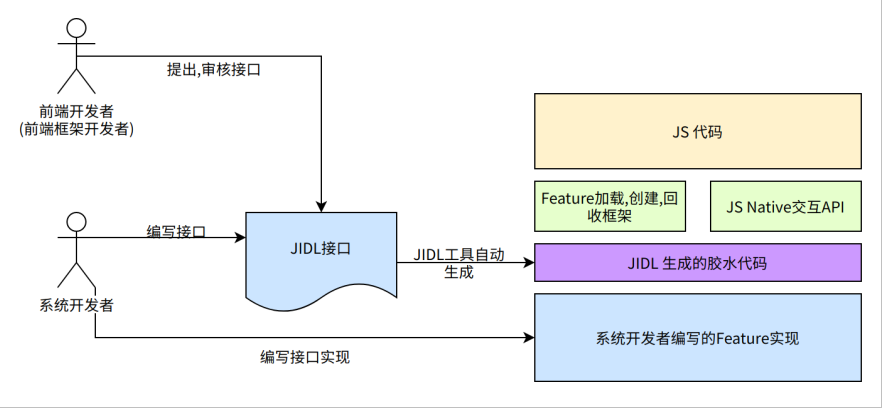
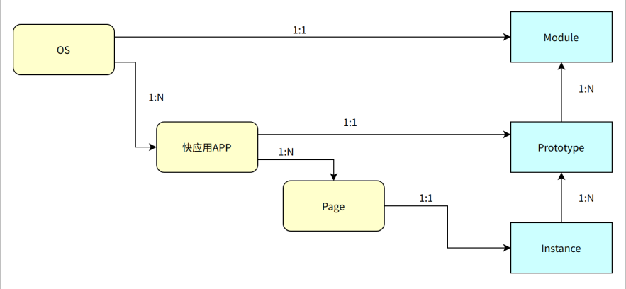
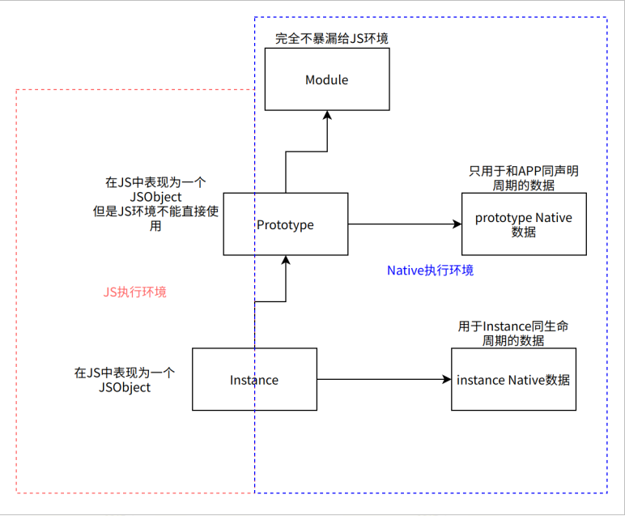
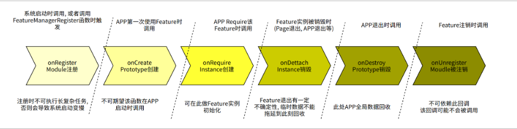
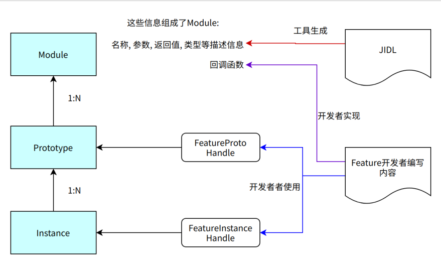
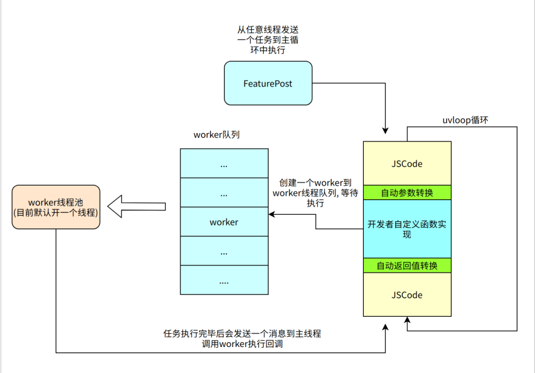

# Feature 框架概述

## 一、Feature 框架简介

在快应用（Quick App）开发中，需要为快应用增加一些新的能力，这些能力通过 C/C++ 语言编写。Feature 框架是一个帮助系统开发者为快应用扩展功能的框架、SDK 以及工具集。


## 二、Feature 框架能力

Feature 框架由运行时框架、API 以及 JIDL 语言及工具组成：

- 提供 JS 层调用 Native 代码的执行框架
- Feature 框架 API 提供一组 Native 代码与 JS 交互的接口
- JIDL 是一个接口描述语言，用于自动生成 JS 和 Native 相互调用的接口



### 1、Feature 的概念模型

#### 静态概念模型

由于 Feature 是由 Native 向 JS 提供的接口，所以 Feature 的概念也遵循 JS 的概念。

Feature 有 3 层概念：

- Module：一个 Feature 就是一个模块，它等同于 C 语言里面的程序模块。它没有实例，是全局存在的；
- Prototype：原型，等同于 JS 中的原型对象，类似 C++ 里面的类，但是又有所不同。一个快应用实例会产生一个 Prototype。所有的 Feature 上的函数、属性都在 Prototype 上管理；
- Instance：实例，一个 APP 内有多个实例（每 Require 一次就会产生一个实例），实例上保存了所有的处理数据。

具体到快应用中：

- 一个快应用实例只有一个 Prototype。
- 一个快应用页面一般只包含一个 Feature 的 Instance。

从系统角度上看 Feature 的概念：



#### 运行时概念模型

每个 Feature 都可以关联 Native 数据，所关联的内容有所区别。运行时概念模型如下：



#### Feature 的生命周期



### 2、Feature 框架提供的接口能力

#### 自动生成 Feature Prototype 和 Instance

Feature 框架帮助开发者创建 Feature 的 Prototype 和 Instance。

1. Feature 开发者需要提供一个 FeatureDescription，描述 Feature 的信息，包括：

    - Feature 的名字
    - Feature 的成员组成
        - Feature 支持的方法，包括方法名、参数列表、返回值以及实现回调函数
        - 属性的名字、类型以及实现函数
        - 其他

2. 根据 FeatureDescription 生成 FeaturePrototype 和 FeatureInstance，并以 `FeatureProtoHandle` 和 `FeatureInstanceHandle` 的方式反馈给开发者。

    

#### 提供参数转换

从 JS 到 Native，Feature 框架提供参数转换能力，将 JS 参数转换为普通参数。下表提供了基本的转换能力：

| JS 类型             | C 类型                   | 说明                                                                                                                          |
| ------------------- | ------------------------ | ----------------------------------------------------------------------------------------------------------------------------- |
| number/boolean 类型 | int, float, double, bool | JS 的 number 类型以浮点数形式存在。根据 JIDL 的描述，可以转换成 int、float 等可兼容类型。转成 int/bool 类型会导致小数部分丢失 |
| string              | FtString                 | `const char*` 的 typedef                                                                                                      |
| object              | struct 指针 / FtAny 指针 | 如果在 JIDL 中定义了 struct 结构，则转成对应的 C 语言 struct 指针；如果在 JIDL 中定义为 object/any 类型，则定义为 FtAny 指针  |
| array               | FtArray 指针             | 转成一个 C 结构的 FtArray                                                                                                     |
| function            | FtCallbackId             | 转成一个整数，表示 CallbackId                                                                                                 |
| promise             | FtPromiseId              | 转成一个整数，表示 PromiseId                                                                                                  |

---

- 指针对象自带引用计数，可以通过 `FeatureDupValue` 和 `FeatureFreeValue` 来释放。
- 通过参数传递的指针，不需要额外释放。

下图展示了对 Callback 和 Promise 的管理机制：


Feature 框架通过隐藏细节，达到两个目的：

- Feature 开发者无需关心细节，也无需管理 Callback 和 Promise 的生命周期。
- FeatureInstance 提供托底的内存管理方法。

#### 异步编程模型

Feature 的代码和 JS 代码运行在同一个 uvloop 内，Feature 开发者需要注意调用时长。在普通函数中不能阻塞。



- 可添加一个任务到 worker 队列。
- 任意线程可以调用 `FeaturePost` 添加任务到主循环队列。

### 3、JIDL 提供的接口描述

JIDL 用于描述 Feature 的接口，下面是一个简单的 Feature 文件：

```C++
// 模块名称
module test@1.0

callback cb(int a, int b);

void foo(int a, float b, string c);

void goo(int a, cb cb1);

property string name;
property int age;
```

- 类似 C++ 语言的注释风格。
- 总是以 `module` 开头，包括模块名和版本。
- 可以定义属性、函数、接口等。

文件定义上：

- 文件名以 `.jidl` 结尾。
- 文件名字一般是 `<feature 名字>_<版本号>.jidl`，但不强制。

模块命名上，可以使用 `.` 号，如 `system.fetch`。
