## feature_framework_context API

虽然Feature框架提供了一组API和工具, 帮助开发者隔离JS环境, 但是毕竟有一些场景下, 需要传递非常复杂的数据结构, 而这些结构很难映射到具体的C/C++结构体或者对象上.为了解决该问题, 我们将对js对象进行包装, 并且有限度地开放一些接口, 方便开发者使用.

### 结构关系

ft_value_t需要一个伴生对象ft_context_t,该对象代表着一个上下文，是ft_value_t必须的;下图是JS层的实现， 但是不同Feature环境的实现是不一样的。


### ft_value_t API的主要构成

ft_value_t的API主要由3部分构成
- 1. C Value 转成 ft_value_t数据
- 2. ft_value_t数据 转成 C Value
- 3. object/array的处理/json操作

### ft_value_t API的使用

#### 获取ft_context_t
第一步是要获取ft_context_t，该对象可以通过feature获取
```c
ft_context_ref FeatureGetContext(FeatureInstanceHandle handle);
```
可以在任意一个Feature接口中调用。
#### ft_value_t的使用
可以参照上面的API，创建ft_value_t对象， 或者做转换。其余省略。
#### ft_value_t的生命周期管理
如果不能正确释放ft_value_t对象，就可能导致内存泄漏。
```c
void ft_free_value(ft_context_ref ft_ctx, ft_value_t ft_val);
```
调用ft_free_value是有要求的，不是所有的场合都需要free，
下列场合不需要free
- 1. 当ft_value_t作为参数传递给feature实现函数时
- 2. 当创建的ft_value_t对象需要返回给js的时候

下列场合需要free：
- 1. 当调用ft_from_xxx系列函数， ft_new_object,创建的对象
- 2. ft_array_at返回对象
- 3. ft_obj_get_property获得的对象
- 4. ft_parse_json获得的对象

字符串需要free，ft_to_string得到的字符串，需要调用ft_free_string来删除。
这两个函数必须成对出现， 而且需要注意： feature框架不保证ft_to_string获取的对象长期有效，如果有需要， 开发者应该及时copy字符串的值。 

```eval_rst

.. doxygenfile:: feature_context.h
  :project: doxygen

```