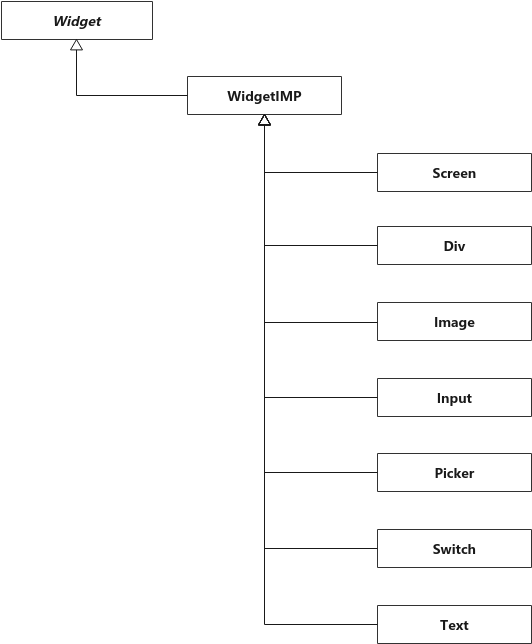

# GUI API

## 一、接口简介
设计QuickApp-LVGL接口的目的是屏蔽底层GUI的差异。如果将来切换到其他图形库，只要在新图形库上实现这些接口，QuickApp就可以无缝移植到新系统，减少app的开发时间。

## 二、代码结构
QuickApp-LVGL的接口使用C++实现，类层次结构如下:


## 三、公共接口
### 1.Wrapper
```eval_rst

.. doxygenfile:: gui_wrapper.h
  :project: doxygen
```

### 2.Widget
```eval_rst

.. doxygenfile:: widget.h
  :project: doxygen
```