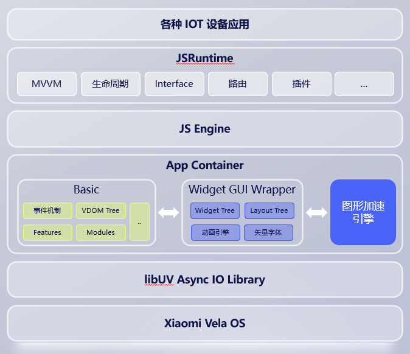

# 快应用框架简介

**Vela快应用框架** （以下简称 *应用框架*），是Vela上的[快应用](https://doc.quickapp.cn/)运行时实现，相较于手机运行时，Vela快应用框架具有如下特点：
* 遵循快应用联盟标准，针对Vela系统重新实现，部分特性/功能有所裁剪。
* 适配RTOS系统，注重运行时性能，低内存消耗下具有较高的执行性能。
* 易于开发和部署，有效缩短应用开发周期。

本文档为应用框架开发文档，旨在介绍应用框架的整体设计，实现思路，技术要点，并不聚焦应用开发本身；对快应用开发感兴趣的开发者可以参考
[小米Vela快应用开发手册](https://iot.mi.com/vela/quickapp/zh/content/intro.html)。


## 整体架构


## 编译配置
应用框架本身的配置项不多，依赖项较多。以来项中渲染器的依赖较多，具体配置请参考图形组提供的文档。
````Kconfig
# 主要配置
CONFIG_QUICKAPP_VAPP=y                      # 快应用主配置
QUICKAPP_VAPP_XMS=y                         # 快应用xms集成版，依赖xms服务框架
CONFIG_QUICKAPP_LOG_LEVEL=1                 # log等级，默认INFO
CONFIG_QUICKAPP_MICRO_FRAMEWORK_MODE=y      # 微框架
CONFIG_QUICKAPP_PRIORITY=100                # 优先级
CONFIG_HAP_APP_PATH="/data"                 # rpk安装路径
CONFIG_QUICKAPP_THREADSTACKSIZE=1048576     # JS线程栈大小
CONFIG_QUICKAPP_JSSTACKSIZE=524288          # JS引擎栈大小
CONFIG_QUICKAPP_JSHEAPSIZE=4194304          # JS引擎堆内存限制，手表设备默认4MB，依据应用复杂度做修改
CONFIG_CURL=y                               # 启用curl支持，框架网络feature需要开启curl
CONFIG_QUICKAPP_RPK_DIR="/resource/package" # ams 应用安装路径
CONFIG_QUICKAPP_BYTECODE_OPTIMIZATION=y     # quickjs字节码优化（字符串合并）
CONFIG_QUICKAPP_FOLME_ANIMENGINE_ADAPTER=n  # folme动效引擎
CONFIG_WIDGET_IMAGE_USE_CACHE_MANAGER=y     # 启用widget image cache manager
# font releated configs
CONFIG_FONT_DEFAULT_NORMAL_NAME="MiSansW_Regular"
CONFIG_FONT_DEFAULT_BOLD_NAME="MiSansW_Demibold"
CONFIG_FONT_DEFAULT_SIZE=30
CONFIG_PROMPT_TOAST_FONT_SIZE=24
CONFIG_PROMPT_DIALOG_TITLE_FONT_SIZE=36
CONFIG_PROMPT_DIALOG_MSG_FONT_SIZE=34


# 调试配置
CONFIG_DOM_TRACE_ENABLE=n                   # vdom树打印
CONFIG_JS_USE_SCHED_NOTE=n                  # 框架启动trace
CONFIG_QUICKAPP_MEMORY_STATUS=n             # 框架JS引擎内存信息打印
CONFIG_WIDGET_LOG_ENANLE=y                  # lvgl widget log
CONFIG_WIDGET_LOG_LEVEL=1                   # widget log level,默认warning
CONFIG_WIDGET_ASSERT_ENABLE=n               # widget assert
CONFIG_WIDGET_TRACE_ENABLE=n                # widget trace check
CONFIG_WIDGET_PERF_ENABLE=n                 # widget performance monitor
CONFIG_WIDGET_DUMP_TREE_ENABLE=n            # dump lvgl widget tree
CONFIG_WIDGET_DUMP_TREE_IN_LAYOUT=n         # dump widget tree in layout task
CONFIG_WIDGET_SHOW_YOGA_NODE_ENABLE=n       # widget show yoga node
CONFIG_WIDGET_DEBUG_DRAW_OUTLINE=n          # widget draw outline for debug
CONFIG_CSS_ATTR_LIST_ENABLE=n               # enable widget get css/attr function


# 依赖项
CONFIG_LIBUV=y
CONFIG_LVGL_EXTENSION=y
CONFIG_LIBUV_EXTENSION=y
CONFIG_LVX_USE_FONT_MANAGER=y
CONFIG_LIB_YOGA=y
CONFIG_PROTOBUF_C=y
CONFIG_LIB_PNG=y
CONFIG_LV_USE_LIBPNG=y
CONFIG_LV_USE_NUTTX_LIBUV=y
CONFIG_USE_QUICKJS=y

````
