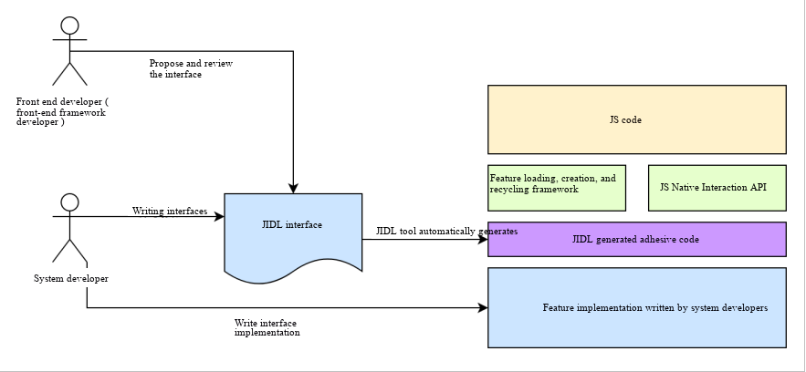
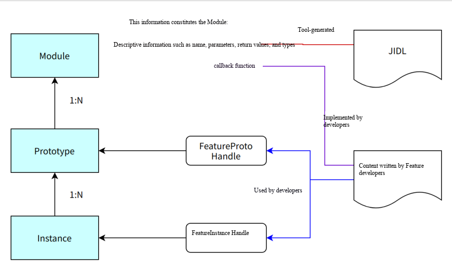
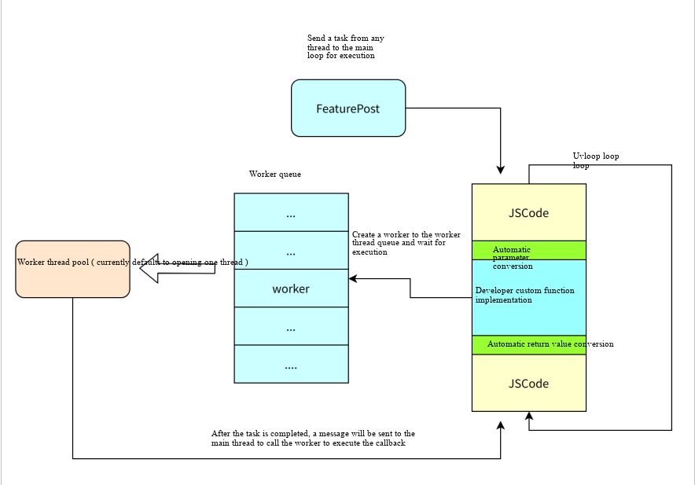

\[ English | [简体中文](../../../../zh-cn/api/framework/feature/feature_framework.md) \]

# Feature Framework Overview

## Feature Framework Introduction

In QuickApp development, new capabilities need to be added to QuickApps, and these capabilities are written in C/C++. The Feature framework is a framework, SDK, and toolset that helps system developers extend functionality for QuickApps.

The overall architecture is organized into the following layers, from top to bottom:

- **JS Layer** — QuickApp (user JS code)
- **Framework Layer** — QuickApp Framework (together with the QuickApp Engine) and Feature Framework
- **Native Layer** — Feature implementations written in C/C++
- **OS Layer** — openvela

## Feature Framework Capabilities

The Feature framework consists of a runtime framework, APIs, and the JIDL language and tools:

- Provides an execution framework for JS layer to call Native code
- The Feature framework API provides a set of interfaces for Native code to interact with JS
- JIDL is an interface description language used to automatically generate interfaces for mutual invocation between JS and Native



### Feature Concept Model

#### Static Concept Model

Since Features provide interfaces from Native to JS, the Feature concepts also follow JS conventions.

Features have 3 conceptual layers:

- Module: A Feature is a module, equivalent to a program module in C. It has no instances and exists globally.
- Prototype: Equivalent to a prototype object in JS, similar to a class in C++ but with differences. One QuickApp instance produces one Prototype. All functions and properties on a Feature are managed on the Prototype.
- Instance: One app contains multiple instances (each `require` produces an instance). Instances hold all processing data.

Specifically in QuickApps:

- A QuickApp instance has only one Prototype.
- A QuickApp page typically contains only one Feature Instance.

From a system perspective, the Feature concepts:


#### Runtime Concept Model

Each Feature can associate Native data, with different associated content:

- **Module** is purely internal to the Native side and is never exposed to the JS environment.
- **Prototype** appears in JS as a `JSObject`, but cannot be used directly from JS. On the Native side, it holds `prototype Native data` whose lifetime matches the app.
- **Instance** also appears in JS as a `JSObject`, and on the Native side holds `instance Native data` whose lifetime matches the instance itself.

#### Feature Lifecycle

The Feature lifecycle consists of six events, listed below in the order they occur:

| Event                                    | Triggered When                                                        | Notes                                                                                            |
| ---------------------------------------- | --------------------------------------------------------------------- | ------------------------------------------------------------------------------------------------ |
| **`onRegister`** (Module Registration)   | When the system starts up, or when `FeatureManagerRegister` is called | Do not perform long / complex tasks during registration, otherwise system startup will slow down |
| **`onCreate`** (Prototype Creation)      | The first time the app uses the Feature                               | Do not expect this function to be called at app startup                                          |
| **`onRequire`** (Instance Creation)      | When the app calls `require` for this Feature                         | Feature instance initialization can be done here                                                 |
| **`onDettach`** (Instance Destruction)   | When a Feature instance is destroyed (page exit, app exit, etc.)      | Feature teardown is non-deterministic; do not defer recycling of temporary data to this point    |
| **`onDestroy`** (Prototype Destruction)  | When the app exits                                                    | App-wide global data is recycled here                                                            |
| **`onUnregister`** (Module Unregistered) | When the Feature is unregistered                                      | Do not rely on this callback; it may never be called                                             |

### Feature Framework Interface Capabilities

#### Automatic Generation of Feature Prototype and Instance

The Feature framework helps developers create Feature Prototypes and Instances.

1. Feature developers need to provide a FeatureDescription that describes the Feature information, including:

    - Feature name
    - Feature member composition
        - Methods supported by the Feature, including method name, parameter list, return value, and implementation callback function
        - Property name, type, and implementation function
        - Others

2. Based on the FeatureDescription, FeaturePrototype and FeatureInstance are generated, and provided to developers as `FeatureProtoHandle` and `FeatureInstanceHandle`.

    

#### Parameter Conversion

From JS to Native, the Feature framework provides parameter conversion capabilities, converting JS parameters to plain parameters. The following table shows the basic conversion capabilities:

| JS Type        | C Type                         | Description                                                                                                                                                                       |
| -------------- | ------------------------------ | --------------------------------------------------------------------------------------------------------------------------------------------------------------------------------- |
| number/boolean | int, float, double, bool       | JS number types exist as floating point. Based on JIDL description, they can be converted to compatible types like int, float. Converting to int/bool causes loss of decimal part |
| string         | FtString                       | `const char*` typedef                                                                                                                                                             |
| object         | struct pointer / FtAny pointer | If a struct is defined in JIDL, converts to the corresponding C struct pointer; if defined as object/any type in JIDL, defined as FtAny pointer                                   |
| array          | FtArray pointer                | Converts to a C structure FtArray                                                                                                                                                 |
| function       | FtCallbackId                   | Converts to an integer representing CallbackId                                                                                                                                    |
| promise        | FtPromiseId                    | Converts to an integer representing PromiseId                                                                                                                                     |

---

- Pointer objects have built-in reference counting and can be released via `FeatureDupValue` and `FeatureFreeValue`.
- Pointers passed through parameters do not need additional release.

The Feature framework internally manages Callback and Promise objects, hiding the implementation details:

- Feature developers receive opaque IDs (`FtCallbackId` / `FtPromiseId`) instead of direct references to JS Function or Promise objects.
- The real JS Function and Promise instances are held inside the Feature framework (not visible to developers), together with reference counting.
- IDs act as indices into the internal tables, and the framework is responsible for reclaiming them.

The Feature framework achieves two goals by hiding details:

- Feature developers do not need to care about details or manage the lifecycle of Callbacks and Promises.
- FeatureInstance provides fallback memory management methods.

#### Asynchronous Programming Model

Feature code and JS code run in the same uvloop. Feature developers need to be mindful of call duration. Blocking is not allowed in regular functions.



- A task can be added to the worker queue.
- Any thread can call `FeaturePost` to add a task to the main loop queue.

### JIDL Interface Description

JIDL is used to describe Feature interfaces. Below is a simple Feature file:

```C++
// Module name
module test@1.0

callback cb(int a, int b);

void foo(int a, float b, string c);

void goo(int a, cb cb1);

property string name;
property int age;
```

- Uses C++-style comments.
- Always starts with `module`, including module name and version.
- Can define properties, functions, interfaces, etc.

File naming conventions:

- File names end with `.jidl`.
- File names are typically `<feature name>_<version>.jidl`, but this is not mandatory.

Module naming allows the use of `.` separator, such as `system.fetch`.
