\[ English | [简体中文](../../../../zh-cn/api/framework/feature/feature_framework_context.md) \]

# Feature Context API

Unified data type and context operation interfaces provided by the Feature framework. By wrapping frontend (QuickJS, WAMR, etc.) native objects through `ft_value_t`, developers can perform type conversion, array/object operations, and memory management without being aware of specific frontend differences.

Header: `#include <feature_context.h>`

## openvela Implementation Notes

- **Core data type `ft_value_t`**: Uniformly wraps frontend JSValue/Wasm objects, using 16-byte or 8-byte storage depending on whether the target platform is 64-bit
- **`ft_context_ref`**: A context object that accompanies `ft_value_t`; all APIs require it to locate the specific frontend runtime
- **Value types vs reference types**:
    - `ft_from_int` / `ft_from_bool` etc. return value types that do not require explicit release
    - `ft_from_string` / `ft_from_buffer` / `ft_new_object` etc. return reference types that must be released via `ft_free_value`
- **Release rules**:
    - **No release needed**: `ft_value_t` parameters received by Feature implementation functions, `ft_value_t` returned to the frontend as return values
    - **Must release**: Objects created by `ft_from_xxx`, objects created by `ft_new_object`, elements retrieved by `ft_array_at`, properties returned by `ft_obj_get_property`, results from `ft_parse_json`
    - Strings: `const char*` returned by `ft_to_string` must be released with `ft_free_string`

## Feature Context and Frontend Runtime

The diagram below shows how the Feature framework uses `ft_value_t` and `ft_context_ref` to uniformly wrap native objects of frontend runtimes (using QuickJS as an example):



- **Feature Framework Interface**: The unified C interface exposed by the Feature framework, consisting of `ft_value_t` (data) and `ft_context_ref` (context).
- **JS Implementation**: The concrete frontend runtime implementation. `ft_value_t` maps to `JSValue`, and `ft_context_ref` maps to `JSContext`, with an N:1 relationship between them (multiple values belong to the same context).
- When switching to another frontend (for example, WAMR), the Feature implementation code does not need to change; only the underlying mapping needs to be replaced.

## Type and Context Access

### ft_context_get_data

```c
void* ft_context_get_data(ft_context_ref ft_ctx);
```

Retrieves the user data pointer associated with the current Feature context. This user data is bound by the Feature manager during initialization.

**Parameters**:

- `ft_ctx` Current Feature context reference.

**Returns**:

Returns the associated user data pointer, or `NULL` if not bound.

### ft_get_type

```c
ft_type ft_get_type(ft_context_ref ft_ctx, ft_value_t ft_val);
```

Gets the type of a given `ft_value_t`.

**Parameters**:

- `ft_ctx` Current Feature context reference.
- `ft_val` The `ft_value_t` whose type is to be queried.

**Returns**:

Returns the type enum `ft_type`:

- `FT_TYPE_NULL`: null
- `FT_TYPE_UNDEF`: undefined
- `FT_TYPE_NONE`: undefined value
- `FT_TYPE_NUMBER`: number
- `FT_TYPE_BOOL`: boolean
- `FT_TYPE_STRING`: string
- `FT_TYPE_ARRAY`: array
- `FT_TYPE_BUFFER`: binary buffer
- `FT_TYPE_TYPED_BUFFER`: typed buffer
- `FT_TYPE_OBJECT`: object

### ft_undefined

```c
ft_value_t ft_undefined(ft_context_ref ft_ctx);
```

Constructs an undefined-type `ft_value_t`. Used to return a "no value" result to the frontend.

**Parameters**:

- `ft_ctx` Current Feature context reference.

**Returns**:

Returns an `ft_value_t` of type `FT_TYPE_UNDEF`. This is a value type and does not require explicit release.

## Type Conversion from Primitive Types (Native to ft_value_t)

The following interfaces convert C native types to `ft_value_t` for passing to the frontend.

### ft_from_int

```c
ft_value_t ft_from_int(ft_context_ref ft_ctx, int32_t val);
```

Converts a 32-bit signed integer to `ft_value_t`. The return value is a value type and does not require release.

**Parameters**:

- `ft_ctx` Current Feature context reference.
- `val` 32-bit signed integer value.

**Returns**:

Returns the corresponding `ft_value_t` (type `FT_TYPE_NUMBER`).

### ft_from_uint

```c
ft_value_t ft_from_uint(ft_context_ref ft_ctx, uint32_t val);
```

Converts a 32-bit unsigned integer to `ft_value_t`.

**Parameters**:

- `ft_ctx` Current Feature context reference.
- `val` 32-bit unsigned integer value.

**Returns**:

Returns the corresponding `ft_value_t`.

### ft_from_int64

```c
ft_value_t ft_from_int64(ft_context_ref ft_ctx, int64_t val);
```

Converts a 64-bit signed integer to `ft_value_t`.

**Parameters**:

- `ft_ctx` Current Feature context reference.
- `val` 64-bit signed integer value.

**Returns**:

Returns the corresponding `ft_value_t`.

### ft_from_uint64

```c
ft_value_t ft_from_uint64(ft_context_ref ft_ctx, uint64_t val);
```

Converts a 64-bit unsigned integer to `ft_value_t`.

**Parameters**:

- `ft_ctx` Current Feature context reference.
- `val` 64-bit unsigned integer value.

**Returns**:

Returns the corresponding `ft_value_t`.

### ft_from_double

```c
ft_value_t ft_from_double(ft_context_ref ft_ctx, double val);
```

Converts a double-precision floating-point number to `ft_value_t`.

**Parameters**:

- `ft_ctx` Current Feature context reference.
- `val` Double-precision floating-point value.

**Returns**:

Returns the corresponding `ft_value_t`.

### ft_from_bool

```c
ft_value_t ft_from_bool(ft_context_ref ft_ctx, bool val);
```

Converts a boolean value to `ft_value_t`.

**Parameters**:

- `ft_ctx` Current Feature context reference.
- `val` Boolean value.

**Returns**:

Returns the corresponding `ft_value_t` (type `FT_TYPE_BOOL`).

### ft_from_string

```c
ft_value_t ft_from_string(ft_context_ref ft_ctx, const char* val);
```

Converts a C string to `ft_value_t`.

**Parameters**:

- `ft_ctx` Current Feature context reference.
- `val` Null-terminated C string.

**Returns**:

Returns the corresponding `ft_value_t` (type `FT_TYPE_STRING`).

**Notes**:

- The returned `ft_value_t` is a reference type and **must** be released via `ft_free_value`.
- The implementation copies the content of `val`; the original pointer can be freed immediately after the call.

## Binary Buffer Conversion

### ft_from_buffer

```c
ft_value_t ft_from_buffer(ft_context_ref ft_ctx, uint8_t* buff, uint32_t size);
```

Wraps a native byte buffer into an `ft_value_t`.

**Parameters**:

- `ft_ctx` Current Feature context reference.
- `buff` Pointer to the start of the byte buffer.
- `size` Number of bytes in the buffer.

**Returns**:

Returns the corresponding `ft_value_t` (type `FT_TYPE_BUFFER`).

**Notes**:

- The returned `ft_value_t` is a reference type and must be released via `ft_free_value`.

### ft_from_typed_buffer

```c
ft_value_t ft_from_typed_buffer(ft_context_ref ft_ctx, uint8_t* buff,
                                uint32_t size, FtTypedArrayType type);
```

Wraps a native buffer into a frontend Typed Array.

**Parameters**:

- `ft_ctx` Current Feature context reference.
- `buff` Pointer to the start of the byte buffer.
- `size` Number of bytes in the buffer.
- `type` Element type of the typed array, see `FtTypedArrayType`:
    - `FT_Int8Array` / `FT_Uint8Array`
    - `FT_Int16Array` / `FT_Uint16Array`
    - `FT_Int32Array` / `FT_Uint32Array`
    - `FT_Float32Array` / `FT_Float64Array`

**Returns**:

Returns the corresponding `ft_value_t` (type `FT_TYPE_TYPED_BUFFER`). Must be released via `ft_free_value`.

**Example**:

```c
uint8_t* buff = ft_to_buffer(ft_ctx, &size, data);
// Process buff
ft_value_t ret = ft_from_typed_buffer(ft_ctx, buff, size, FT_Uint8Array);
```

### ft_parse_json

```c
ft_value_t ft_parse_json(ft_context_ref ft_ctx, const char* buf,
                         size_t buf_len, const char* filename);
```

Parses a JSON string into an `ft_value_t` object.

**Parameters**:

- `ft_ctx` Current Feature context reference.
- `buf` Pointer to the JSON string.
- `buf_len` Length of the JSON string in bytes.
- `filename` Filename used for error location, can be `NULL`.

**Returns**:

Returns the parsed `ft_value_t` on success; returns a value of type `FT_TYPE_UNDEF` on failure.

**Notes**:

- The returned `ft_value_t` is a reference type and must be released via `ft_free_value`.

## Array Type Conversion (Native Array to ft_value_t)

Converts native arrays to `ft_value_t` arrays. All return values are reference types and must be released via `ft_free_value`.

### ft_from_int_array

```c
ft_value_t ft_from_int_array(ft_context_ref ft_ctx, int32_t* val, uint32_t size);
```

Converts an int32 array to `ft_value_t`.

**Parameters**:

- `ft_ctx` Current Feature context reference.
- `val` Source array pointer.
- `size` Number of array elements.

**Returns**:

Returns the corresponding `ft_value_t` (type `FT_TYPE_ARRAY`).

### ft_from_uint_array

```c
ft_value_t ft_from_uint_array(ft_context_ref ft_ctx, uint32_t* val, uint32_t size);
```

Converts a uint32 array to `ft_value_t`.

**Parameters**:

- `ft_ctx` Current Feature context reference.
- `val` Source array pointer.
- `size` Number of array elements.

**Returns**:

Returns the corresponding `ft_value_t`.

### ft_from_int64_array

```c
ft_value_t ft_from_int64_array(ft_context_ref ft_ctx, int64_t* val, uint32_t size);
```

Converts an int64 array to `ft_value_t`.

**Parameters**:

- `ft_ctx` Current Feature context reference.
- `val` Source array pointer.
- `size` Number of array elements.

**Returns**:

Returns the corresponding `ft_value_t`.

### ft_from_uint64_array

```c
ft_value_t ft_from_uint64_array(ft_context_ref ft_ctx, uint64_t* val, uint32_t size);
```

Converts a uint64 array to `ft_value_t`.

**Parameters**:

- `ft_ctx` Current Feature context reference.
- `val` Source array pointer.
- `size` Number of array elements.

**Returns**:

Returns the corresponding `ft_value_t`.

### ft_from_bool_array

```c
ft_value_t ft_from_bool_array(ft_context_ref ft_ctx, bool* val, uint32_t size);
```

Converts a boolean array to `ft_value_t`.

**Parameters**:

- `ft_ctx` Current Feature context reference.
- `val` Source array pointer.
- `size` Number of array elements.

**Returns**:

Returns the corresponding `ft_value_t`.

### ft_from_double_array

```c
ft_value_t ft_from_double_array(ft_context_ref ft_ctx, double* val, uint32_t size);
```

Converts a double array to `ft_value_t`.

**Parameters**:

- `ft_ctx` Current Feature context reference.
- `val` Source array pointer.
- `size` Number of array elements.

**Returns**:

Returns the corresponding `ft_value_t`.

### ft_from_string_array

```c
ft_value_t ft_from_string_array(ft_context_ref ft_ctx, const char** val, uint32_t size);
```

Converts a C string array to `ft_value_t`.

**Parameters**:

- `ft_ctx` Current Feature context reference.
- `val` Array of string pointers.
- `size` Number of array elements.

**Returns**:

Returns the corresponding `ft_value_t`.

## Type Conversion to Primitive Types (ft_value_t to Native)

The following interfaces convert `ft_value_t` passed from the frontend to C native types for use in Feature implementations.

### ft_to_int

```c
bool ft_to_int(ft_context_ref ft_ctx, ft_value_t f_val, int32_t* val);
```

Converts an `ft_value_t` to a 32-bit signed integer.

**Parameters**:

- `ft_ctx` Current Feature context reference.
- `f_val` Source `ft_value_t`, should be a numeric type.
- `val` Pointer to `int32_t` to receive the result.

**Returns**:

Returns `true` on successful conversion, `false` otherwise (typically because `f_val` is not a numeric type).

### ft_to_uint

```c
bool ft_to_uint(ft_context_ref ft_ctx, ft_value_t f_val, uint32_t* val);
```

Converts an `ft_value_t` to a 32-bit unsigned integer.

**Parameters**:

- `ft_ctx` Current Feature context reference.
- `f_val` Source `ft_value_t`.
- `val` Pointer to `uint32_t` to receive the result.

**Returns**:

Returns `true` on success, `false` on failure.

### ft_to_int64

```c
bool ft_to_int64(ft_context_ref ft_ctx, ft_value_t f_val, int64_t* val);
```

Converts an `ft_value_t` to a 64-bit signed integer.

**Parameters**:

- `ft_ctx` Current Feature context reference.
- `f_val` Source `ft_value_t`.
- `val` Pointer to `int64_t` to receive the result.

**Returns**:

Returns `true` on success, `false` on failure.

### ft_to_uint64

```c
bool ft_to_uint64(ft_context_ref ft_ctx, ft_value_t f_val, uint64_t* val);
```

Converts an `ft_value_t` to a 64-bit unsigned integer.

**Parameters**:

- `ft_ctx` Current Feature context reference.
- `f_val` Source `ft_value_t`.
- `val` Pointer to `uint64_t` to receive the result.

**Returns**:

Returns `true` on success, `false` on failure.

### ft_to_double

```c
bool ft_to_double(ft_context_ref ft_ctx, ft_value_t f_val, double* val);
```

Converts an `ft_value_t` to a double-precision floating-point number.

**Parameters**:

- `ft_ctx` Current Feature context reference.
- `f_val` Source `ft_value_t`.
- `val` Pointer to `double` to receive the result.

**Returns**:

Returns `true` on success, `false` on failure.

### ft_to_bool

```c
bool ft_to_bool(ft_context_ref ft_ctx, ft_value_t ft_val, bool* val);
```

Converts an `ft_value_t` to a boolean value.

**Parameters**:

- `ft_ctx` Current Feature context reference.
- `ft_val` Source `ft_value_t`.
- `val` Pointer to `bool` to receive the result.

**Returns**:

Returns `true` on success, `false` on failure.

### ft_to_string

```c
const char* ft_to_string(ft_context_ref ft_ctx, ft_value_t f_val);
```

Converts an `ft_value_t` to a C string.

**Parameters**:

- `ft_ctx` Current Feature context reference.
- `f_val` Source `ft_value_t`, should be a string type.

**Returns**:

Returns the string pointer on success; returns `NULL` on failure.

**Notes**:

- The returned string is managed by the framework and **must** be released via `ft_free_string`.
- The Feature framework does not guarantee the string remains valid long-term; copy it promptly if you need to retain it.

### ft_to_buffer

```c
uint8_t* ft_to_buffer(ft_context_ref ft_ctx, size_t* p_size, ft_value_t f_val);
```

Converts an `ft_value_t` to a binary buffer.

**Parameters**:

- `ft_ctx` Current Feature context reference.
- `p_size` Output parameter that returns the number of bytes in the buffer.
- `f_val` Source `ft_value_t`, should be `FT_TYPE_BUFFER` or `FT_TYPE_TYPED_BUFFER`.

**Returns**:

Returns the buffer start pointer on success; returns `NULL` on failure.

**Notes**:

- The returned pointer is managed by the frontend; do not manually `free` it.

## Array Operations

### ft_array_size

```c
uint32_t ft_array_size(ft_context_ref ft_ctx, const ft_value_t array);
```

Gets the number of elements in an `ft_value_t` array.

**Parameters**:

- `ft_ctx` Current Feature context reference.
- `array` An `ft_value_t` of array type.

**Returns**:

Returns the number of array elements. Returns 0 if `array` is not an array type.

### ft_array_at

```c
ft_value_t ft_array_at(ft_context_ref ft_ctx, const ft_value_t array, uint32_t idx);
```

Accesses an element in an `ft_value_t` array by index.

**Parameters**:

- `ft_ctx` Current Feature context reference.
- `array` An `ft_value_t` of array type.
- `idx` Element index, starting from 0.

**Returns**:

Returns the element `ft_value_t` at the given index on success; returns undefined if out of bounds or `array` is not an array.

**Notes**:

- The returned `ft_value_t` is a reference type and **must** be released via `ft_free_value`.

## Object Operations

### ft_new_object

```c
ft_value_t ft_new_object(ft_context_ref ft_ctx);
```

Creates an empty `ft_value_t` object. Features can attach custom properties to this object.

**Parameters**:

- `ft_ctx` Current Feature context reference.

**Returns**:

Returns the newly created object `ft_value_t` (type `FT_TYPE_OBJECT`).

**Notes**:

- The return value is a reference type and must be released via `ft_free_value`.
- The object supports attaching child properties; child properties are automatically released when the root object is released.

### ft_obj_get_property

```c
ft_value_t ft_obj_get_property(ft_context_ref ft_ctx, ft_value_t ft_val, const char* prop);
```

Reads a property value from an `ft_value_t` object by property name.

**Parameters**:

- `ft_ctx` Current Feature context reference.
- `ft_val` An `ft_value_t` of object type.
- `prop` Property name.

**Returns**:

Returns the property value `ft_value_t` on success; returns undefined if the property does not exist.

**Notes**:

- The returned `ft_value_t` is a reference type and must be released via `ft_free_value`.

### ft_obj_set_property

```c
bool ft_obj_set_property(ft_context_ref ft_ctx, ft_value_t obj,
                         const char* prop, ft_value_t val);
```

Sets a property value on an `ft_value_t` object.

**Parameters**:

- `ft_ctx` Current Feature context reference.
- `obj` Target object `ft_value_t`.
- `prop` Property name.
- `val` Property value to set.

**Returns**:

Returns `true` on success, `false` on failure.

## Memory Management

### ft_free_value

```c
void ft_free_value(ft_context_ref ft_ctx, ft_value_t ft_val);
```

Releases the reference count of an `ft_value_t`.

**Parameters**:

- `ft_ctx` Current Feature context reference.
- `ft_val` The `ft_value_t` to release.

**Notes**:

`ft_value_t` sources that **require release**:

- Objects created by `ft_from_xxx`
- Objects created by `ft_new_object`
- Elements retrieved by `ft_array_at`
- Properties returned by `ft_obj_get_property`
- Objects parsed by `ft_parse_json`

`ft_value_t` sources that **do not require release**:

- Parameters received by Feature implementation functions
- `ft_value_t` returned to the frontend as return values

Failing to properly release reference-type `ft_value_t` will cause memory leaks.

### ft_free_string

```c
void ft_free_string(ft_context_ref ft_ctx, const char* str);
```

Releases a string returned by `ft_to_string`.

**Parameters**:

- `ft_ctx` Current Feature context reference.
- `str` String pointer to release.

**Notes**:

- The Feature framework does not guarantee that strings returned by `ft_to_string` remain valid long-term; call this interface to release them promptly after use.
- Do not use `free()` or `delete` to release; you must use this interface.
