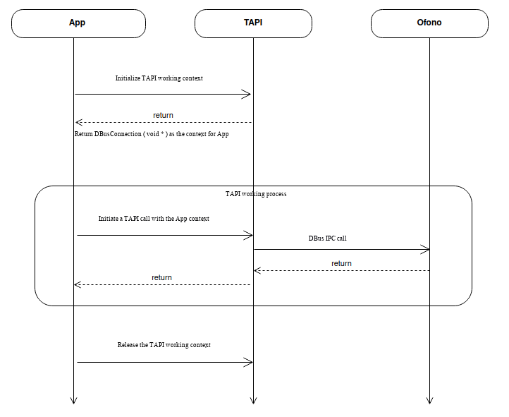

\[ English | [简体中文](../../../../zh-cn/api/framework/telephony/index.md) \]

# Telephony API

Telephony provides cellular communication capabilities. `framework/telephony` is the interface layer that openvela exposes to the application layer for cellular communication, also known as TAPI (Telephony API). The encapsulated interfaces cover cellular communication services: network services, calls, SMS, data, SIM dual-card, and modem configuration management.

TAPI is independent of the openvela telephony core stack. Its internal logic uses DBUS LIB to encapsulate the business logic of the Core Stack, shielding the complexity of D-Bus operations. It provides standardized and unified Telephony API interface definitions in standard C, making it convenient for openvela application layer APPs to use and enabling reuse across openvela system versions.

## openvela Implementation Notes

- **Architecture**: TAPI encapsulates the Telephony Core Stack (oFono) via D-Bus, exposing standard C interfaces externally
- **SIM identification**: Different SIM slots are distinguished via the `slot_id` parameter
- **Asynchronous model**: Most operations return results asynchronously through callback functions

## Module Overview

| Module | Source | API Documentation | Description |
| :--- | :--- | :--- | :--- |
| Unified header file | `tapi.h` | [Common Utilities](telephony.md) | Common type definitions, string/enum conversion utils |
| Radio interface | `tapi_manager.c/h` | [Manager](telephony_manager.md) | Telephony initialization, status query, event registration |
| Call interface | `tapi_call.c/h` | [Call](telephony_call.md) | Voice call control |
| Supplementary Services | `tapi_ss.c/h` | [Supplementary Services (SS)](telephony_ss.md) | Call forwarding/barring/waiting/CLIR/USSD |
| Simplified Phone Service | `tapi_phone.c/h` | [Simplified Phone Service](telephony_phone.md) | Lightweight client wrapper |
| Network interface | `tapi_network.c/h` | [Network](telephony_network.md) | Network registration, signal, operator |
| Data interface | `tapi_data.c/h` | [Data](telephony_data.md) | Cellular data connection |
| SIM interface | `tapi_sim.c/h` | [SIM Card](telephony_sim.md) | SIM card management |
| SIM Toolkit | `tapi_stk.c/h` | [SIM Toolkit](telephony_stk.md) | STK Agent and SIM proactive commands |
| Phonebook | `tapi_phonebook.c/h` | [Phonebook](telephony_phonebook.md) | ADN/FDN phonebook management |
| SMS interface | `tapi_sms.c/h` | [SMS](telephony_sms.md) | SMS message sending and receiving |
| Cell Broadcast | `tapi_cbs.c/h` | [Cell Broadcast (CBS)](telephony_cbs.md) | Cell broadcast messages |
| IMS interface | `tapi_ims.c/h` | [IMS](telephony_ims.md) | VoLTE/VoWiFi |

## TAPI Configuration

A complete Telephony service involves many modules. All modules need to be enabled for full Telephony functionality.

**DBUS Configuration**

```kconfig
CONFIG_DBUS_DAEMON=y
CONFIG_DBUS_MONITOR=y
CONFIG_DBUS_SEND=y
CONFIG_LIB_DBUS=y
```

**GLIB Configuration**

```kconfig
CONFIG_LIB_GLIB=y
```

**OFONO Configuration**

```kconfig
CONFIG_LIB_ELL=y
CONFIG_OFONO=y
CONFIG_OFONO_RILMODEM=y  # modem type selection, choose rilmodem for rild support
CONFIG_OFONO_ATMODEM=y   # choose atmodem for serial/USB support
```

**GDBUS Configuration**

```kconfig
CONFIG_LIB_DBUS=y
```

**Telephony API Configuration**

```kconfig
CONFIG_TELEPHONY=y
CONFIG_TELEPHONY_TOOL=y  # debug tool, optional
```

## TAPI Working Model



## TAPI Usage Examples

### Obtaining the TAPI Working Context

First declare a callback function:

```c
static void on_tapi_client_ready(const char* client_name, void* user_data)
{
    if (client_name != NULL)
        syslog(LOG_DEBUG, "tapi is ready for %s\n", client_name);
    ...
}
```

Then call `tapi_open` to obtain the context. Successful acquisition requires oFono, D-Bus, and other services to be started successfully. The callback function is invoked when ready.

```c
tapi_context context;
char* dbus_name = "vela.telephony.tool";
context = tapi_open(dbus_name, on_tapi_client_ready, NULL);
```

### Releasing the TAPI Working Context

```c
tapi_close(context);
```

### Querying the Current Radio Power State

```c
int slot_id = 0;
bool value = false;
tapi_get_radio_power(context, slot_id, &value);
```
