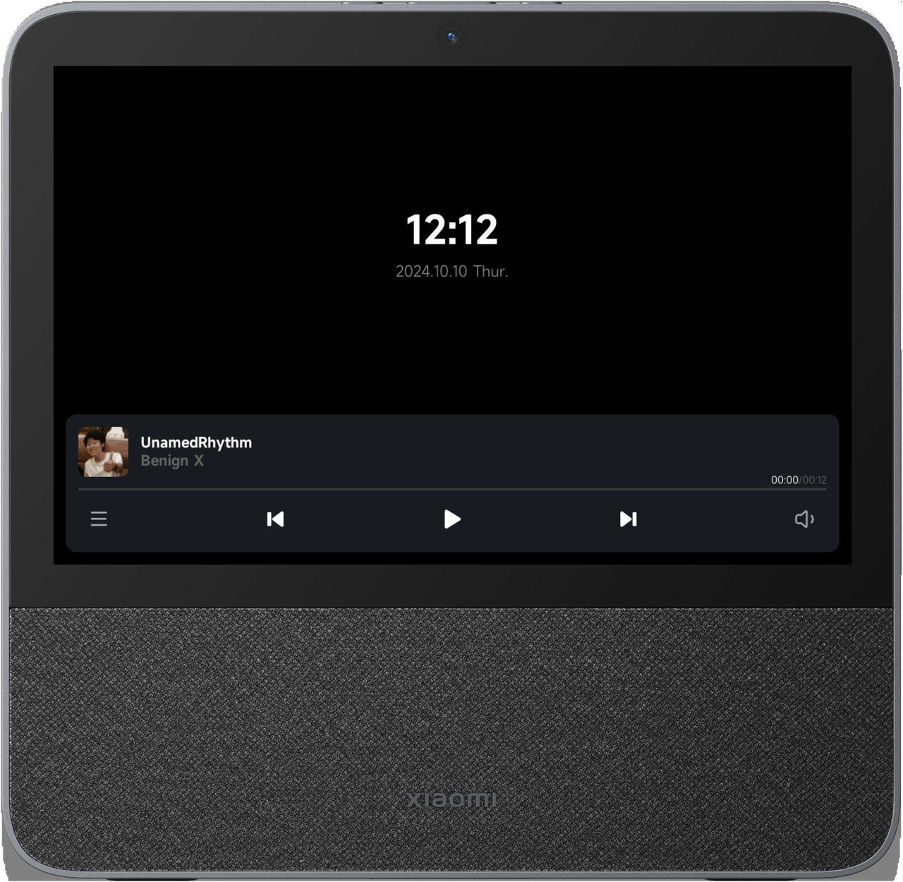
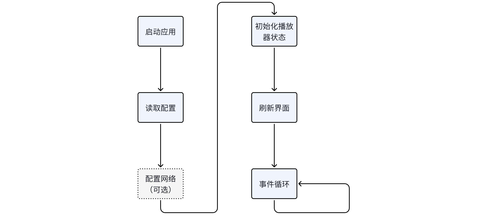
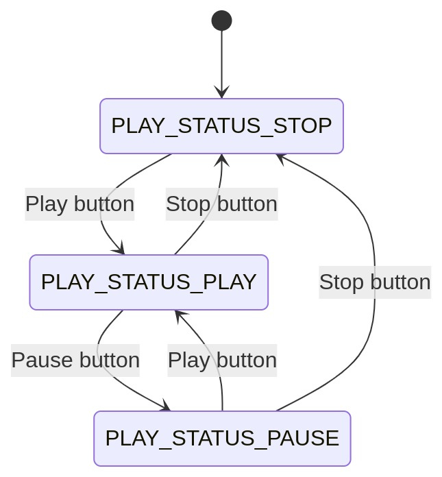
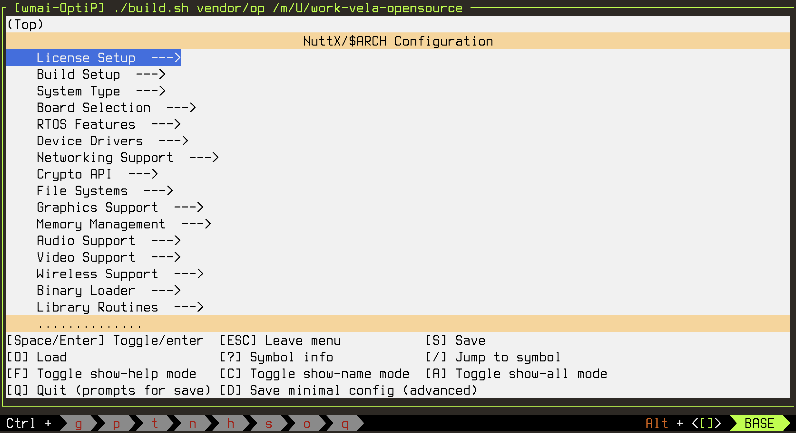
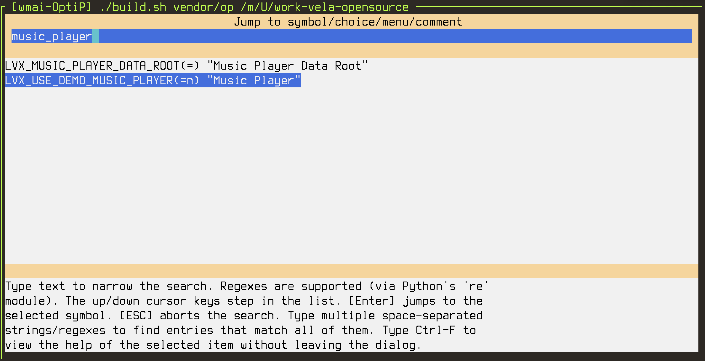
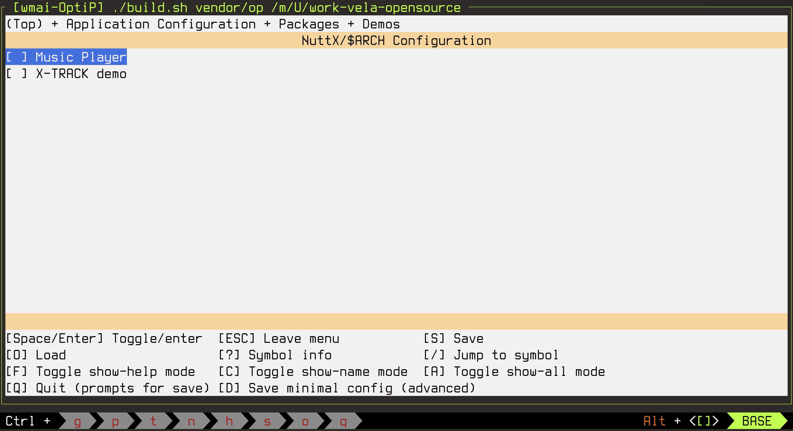
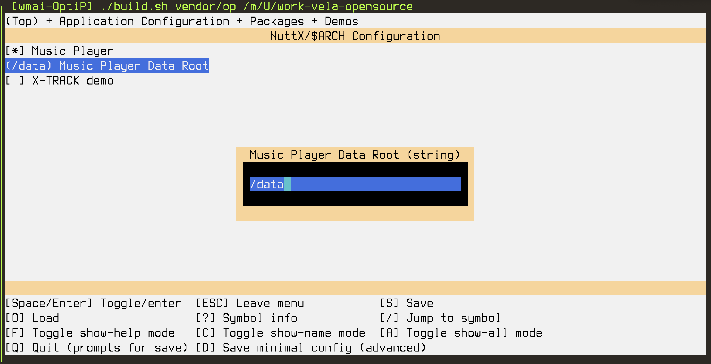
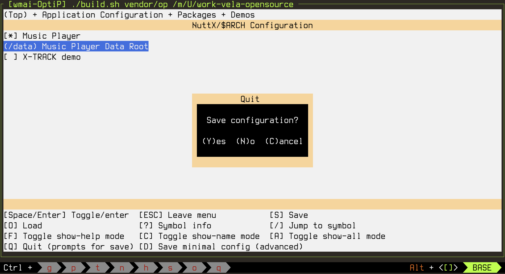
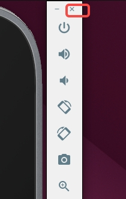

# Developing an openvela UI Application

\[ English | [简体中文](../../../zh-cn/app_dev/system_apps/Dev_UI_App.md) \]

## I. Prerequisites

1. Download the source code. Please refer to [Quick Start](./../../quickstart/openvela_ubuntu_quick_start.md).
2. Before starting this tutorial, please obtain the example code from [music_player](../../../../../../packages_demos/tree/dev-ai-contest-2026/music_player).

## II. Preliminary Concepts

Before starting the tutorial, it is recommended to familiarize yourself with the following basic knowledge and tools to successfully complete the related development tasks:

1. **Makefile**: Understand the basic concepts and usage of Makefile. Makefile is the configuration file used by the build automation tool `make`, commonly used to define project compilation rules and dependency management.

2. **Kconfig**: Learn the basic principles and usages of Kconfig. Kconfig is a commonly used configuration system in Linux kernel and embedded development, helping developers flexibly define and choose software configuration options.

3. **LVGL**: Learn to use the LVGL embedded graphics library. LVGL is an open-source embedded graphics library widely used for developing high-performance user interfaces. Relevant documentation can be found in the [LVGL Official Documentation](https://docs.lvgl.io/).
Understanding these concepts will help you complete the development tasks in the tutorial more efficiently.

## III. Introduction

This article describes how to write a simple music player in Openvela.

## IV. Project Structure

The project's code and resources are neatly organized in various directories and modules for efficient management and development. Below is the directory structure and file composition description of the `music_player` project.

### 1. Directory StructureThe core directory and file structure of the project is as follows:

```C++
packages/demos/music_player
├── res
│  ├── fonts
│  │  ├── MiSans-Normal.ttf
│  │  └── MiSans-Semibold.ttf
│  ├── icons
│  │  ├── album_picture.png
│  │  ├── audio.png
│  │  ├── music.png
│  │  ├── mute.png
│  │  ├── next.png
│  │  ├── nocover.png
│  │  ├── pause.png
│  │  ├── play.png
│  │  ├── playlist.png
│  │  └── previous.png
│  ├── musics
│  │  ├── manifest.json
│  │  ├── UnamedRhythm.png
│  │  └── UnamedRhythm.wav
│  └── config.json
├── audio_ctl.c
├── audio_ctl.h
├── Kconfig
├── Make.defs
├── Makefile
├── music_player.c
├── music_player.h
├── music_player_main.c
├── wifi.c
└── wifi.h
```

### 2. File Composition

The roles of each directory and file are as follows:

1. `res`:

    Resource directory: containing the static resource files required for the project to run:

    - `fonts`: Font file directory, containing the fonts used by the application.
    - `icons`: Icon file directory, containing various icons for interface display.
    - `musics`: Music resource directory, containing audio files and their corresponding configuration information.
    - `config.json`: Global configuration file, which stores the project’s configuration parameters.

2. `audio_ctl.c`/`audio_ctl.h`

    Audio control module, responsible for implementing audio-related functions, including audio input, output, and volume adjustment operations.

3. `wifi.c`/`wifi.h`

    Wi-Fi control module, responsible for implementing Wi-Fi connection management, initialization, and other functionalities.

4. `music_player.c`/`music_player.h`

    Core logic of the music player, defining and implementing the main functionalities of music playback.

5. `music_player_main.c`

    Main entry file of the program, responsible for initializing the music player and starting the main operational logic.

6. `Kconfig`, `Make.defs`, `Makefile` build system files:

    - `Kconfig`: Defines the configuration information and build options for the project.
    - `Make.defs`: Definitions of compilation-related variables and dependency rules.
    - `Makefile`: Defines the build process and dependency management for the project.

## V. UI Application Development

### 1. Overview of UI Structure

The goal is to create a music player interface like this.



The user interface (UI) of the music player is organized into multiple modules in a grouped manner. Below is the complete hierarchy of the UI structure:

```C++
TIME GROUP:
     TIME: 00:00:00
     DATE: 2024/03/21

PLAYER GROUP:
     ALBUM GROUP:
         ALBUM PICTURE
         ALBUM INFO:
             ALBUM NAME
             ALBUM ARTIST
     PROGRESS GROUP:
         CURRENT TIME: 00:00/00:00
         PLAYBACK PROGRESS BAR
     CONTROL GROUP:
         PLAYLIST
         PREVIOUS
         PLAY/PAUSE
         NEXT
         AUDIO

TOP Layer:
     VOLUME BAR
     PLAYLIST GROUP:
         TITLE
         LIST:
             ICON
             ALBUM NAME
             ALBUM ARTIST
```

- TIME GROUP: Time display area.
- PLAYER GROUP: Player core area.
    - ALBUM GROUP: Album information area.
    - PROGRESS GROUP: Playback progress area.
    - CONTROL GROUP: Playback control area.
- TOP Layer: Top interface.
    - VOLUME BAR: Volume control bar.
    - PLAYLIST GROUP: Playlist area.

### 2. Data Structure Design

#### In-App Configuration

In-app configuration is primarily used to initialize necessary environment parameters, such as Wi-Fi network settings. It is important to note that sensitive information, like the Wi-Fi `ssid` (Service Set Identifier) and `psk` (Pre-Shared Key), should not be stored in plaintext. It is recommended to load them using secure methods, such as environment variables or external configuration files.

```cpp
struct conf_s {
#if WIFI_ENABLED
    wifi_conf_t wifi;
#endif
};
```

- If the Wi-Fi feature is enabled (via the `WIFI_ENABLED` macro), it will allow the configuration of the Wi-Fi `ssid` and `psk`.
- Avoid hard-coding the `ssid` and `psk` in the source code. Ensure that sensitive information is configured by referencing external encrypted storage or a dynamic loading mechanism.

#### Runtime State

Runtime state data represents the dynamic content of the application, primarily recording playback control and album information. The relevant data structures are designed as follows:

- Album (`album_info_t`) information.
- Album switching mode (`switch_album_mode_t`).
- Playback status (`play_status_t`).

```c
// Album information
typedef struct _album_info_t {   
    const char* name;                   // Album name
    const char* artist;                 // Artist
    char path[LV_FS_MAX_PATH_LENGTH];   // Audio file path
    char cover[LV_FS_MAX_PATH_LENGTH];  // Album cover path
    uint64_t total_time;                // Total duration (in milliseconds)
    lv_color_t color;                   // Album theme color
} album_info_t;  

// Album switching mode
typedef enum _switch_album_mode_t {   
    SWITCH_ALBUM_MODE_PREV,  // Switch to the previous album
    SWITCH_ALBUM_MODE_NEXT,  // Switch to the next album
} switch_album_mode_t;  

// Playback status
typedef enum _play_status_t {
    PLAY_STATUS_STOP,   // Playback stopped
    PLAY_STATUS_PLAY,   // Playing
    PLAY_STATUS_PAUSE,  // Playback paused
} play_status_t;

// Player runtime state information
struct ctx_s {  
    bool resource_healthy_check;         // System resource health check
    album_info_t* current_album;         // Information of the currently playing album
    lv_obj_t* current_album_related_obj; // UI object associated with the album

    uint16_t volume;                     // Current volume

    play_status_t play_status_prev;      // Previous playback status
    play_status_t play_status;           // Current playback status
    uint64_t current_time;               // Current playback time

    struct {  
        lv_timer_t* volume_bar_countdown;     // Timer for auto-hiding the volume bar
        lv_timer_t* playback_progress_update; // Timer for updating playback progress
    } timers;  

    audioctl_s* audioctl;                // Audio control handle for audio operations
};  
```

#### Component Tree Structure

Based on the UI structure and its grouping design, the `resource_s` data structure will contain all UI controls, fonts, styles, and image resources.

```cpp
struct resource_s {
    struct {
        lv_obj_t* time;                 // Time display
        lv_obj_t* date;                 // Date display
        lv_obj_t* player_group;         // Player container

        lv_obj_t* volume_bar;           // Volume bar
        lv_obj_t* volume_bar_indic;     // Volume indicator
        lv_obj_t* audio;                // Audio object
        lv_obj_t* playlist_base;        // Playlist base area

        lv_obj_t* album_cover;          // Album cover
        lv_obj_t* album_name;           // Album name
        lv_obj_t* album_artist;         // Artist name

        lv_obj_t* play_btn;             // Play button
        lv_obj_t* playback_group;       // Playback progress container
        lv_obj_t* playback_progress;    // Playback progress bar
        lv_span_t* playback_current_time; // Current playback time
        lv_span_t* playback_total_time;   // Total duration

        lv_obj_t* playlist;             // Playlist object
    } ui;  

    struct {   
        struct { lv_font_t* normal; } size_16;   
        struct { lv_font_t* bold; } size_22;   
        struct { lv_font_t* normal; } size_24;   
        struct { lv_font_t* normal; } size_28;   
        struct { lv_font_t* bold; } size_60;   
    } fonts;  

    struct {   
        lv_style_t button_default;              // Default button style
        lv_style_t button_pressed;              // Pressed button style
        lv_style_transition_dsc_t button_transition_dsc; // Button transition effect
        lv_style_transition_dsc_t transition_dsc;        // General transition effect
    } styles;  

    struct {   
        const char* playlist;   // Playlist icon path
        const char* previous;   // Previous icon path
        const char* play;       // Play icon path
        const char* pause;      // Pause icon path
        const char* next;       // Next icon path
        const char* audio;      // Audio icon path
        const char* mute;       // Mute icon path
        const char* music;      // Music icon path
        const char* nocover;    // Placeholder icon for no cover
    } images;  

    album_info_t* albums;     // All album information
    uint8_t album_count;      // Number of albums
};
```

Component Tree Structure Description:

- `ui` module: Defines the properties and hierarchy of all interface controls.
- `fonts` module: Sets fonts of different sizes and weights.
- `styles` module: Encapsulates button effects and styles.
- `images` module: Manages image resources centrally for easy dynamic loading.

### 3. Business Logic Design

#### Main Startup Flow



The `app_create` function is the initialization entry point for the music player application. It is responsible for the following tasks:

- Initialize the resource and runtime context structures.
- Load configuration files.
- Perform component initializations (e.g., resource health check, Wi-Fi connection).
- Create the main interface and set the default state.
- Start necessary background tasks (e.g., date and time update).

Below is the complete implementation and analysis of `app_create`:

```cpp
void app_create(void)
{
    // Initialize resource, context, and config structures
    lv_memzero(&R, sizeof(R));          // Clear the Resource struct
    lv_memzero(&C, sizeof(C));          // Clear the runtime Context struct
    lv_memzero(&CF, sizeof(CF));        // Clear the Config struct
    read_configs();                     // Read the application's configuration files

    #if WIFI_ENABLED
        CF.wifi.conn_delay = 2000000;   // Set Wi-Fi delay (unit: microseconds, 2 seconds)
        wifi_connect(&CF.wifi);         // Connect to Wi-Fi
    #endif

    C.resource_healthy_check = init_resource(); // Check and initialize resources

    if (!C.resource_healthy_check) {    // If resource check fails
        app_create_error_page();        // Create an error page to notify the user
        return;
    }

    app_create_main_page();             // Create the main page
    app_set_play_status(PLAY_STATUS_STOP); // Set the initial play status to "Stopped"
    app_switch_to_album(0);             // Switch to the first album
    app_set_volume(30);                 // Set the default volume to 30

    app_refresh_album_info();           // Update the album info display
    app_refresh_playlist();             // Update the playlist display
    app_refresh_volume_bar();           // Update the volume bar display

    app_start_updating_date_time();     // Start the date and time update task
}
```

#### Runtime State Machine



`app_refresh_play_status` is the core function of the music player's runtime state machine. Its main purpose is to update the UI and the audio controller's state based on the playback status (`PLAY_STATUS_STOP`, `PLAY_STATUS_PLAY`, and `PLAY_STATUS_PAUSE`), thereby handling functions like play, pause, and stop. The following is the complete function and a step-by-step explanation of its key logic:

```cpp
static void app_refresh_play_status(void)
{
    if (C.timers.playback_progress_update == NULL) {
        C.timers.playback_progress_update = lv_timer_create(app_playback_progress_update_timer_cb, 1000, NULL);
    }
    switch (C.play_status) {  
    case PLAY_STATUS_STOP:  
        // Handle stop status
        lv_image_set_src(R.ui.play_btn, R.images.play); // Update play button icon to "play"
        lv_timer_pause(C.timers.playback_progress_update); // Pause the timer
        if (C.audioctl) {  
            audio_ctl_stop(C.audioctl);         // Stop audio playback
            audio_ctl_uninit_nxaudio(C.audioctl); // Deinitialize audio controller resources
            C.audioctl = NULL;                // Clear the audio controller handle
        }  
        break;  
    
    case PLAY_STATUS_PLAY:  
        // Handle play status
        lv_image_set_src(R.ui.play_btn, R.images.pause); // Update play button icon to "pause"
        lv_timer_resume(C.timers.playback_progress_update); // Resume the timer
        if (C.play_status_prev == PLAY_STATUS_PAUSE) {  
            audio_ctl_resume(C.audioctl); // Resume audio playback
        } else if (C.play_status_prev == PLAY_STATUS_STOP) {  
            C.audioctl = audio_ctl_init_nxaudio(C.current_album->path); // Initialize the audio controller
            audio_ctl_start(C.audioctl); // Start playing audio
        }  
        break;  
    
    case PLAY_STATUS_PAUSE:  
        // Handle pause status
        lv_image_set_src(R.ui.play_btn, R.images.play); // Update play button icon to "play"
        lv_timer_pause(C.timers.playback_progress_update); // Pause the timer
        audio_ctl_pause(C.audioctl); // Pause audio playback
        break;  
    
    default:  
        break;  
    }  
}
```

### 4. API Design

1. **Initialization Functions**

    Initialization functions are responsible for tasks such as resource configuration, UI creation, and loading configuration files when the application starts. The main function APIs are:

    ```cpp
    /* Init functions */
    static void read_configs(void);
    static bool init_resource(void);
    static void reload_music_config(void);
    static void app_create_error_page(void);
    static void app_create_main_page(void);
    static void app_create_top_layer(void);
    ```

2. **Timer Start Functions**

    Timer control tasks are used to start background processes that support dynamic UI updates, such as time display and playback progress updates.

    ```cpp
    /* Timer starting functions */
    static void app_start_updating_date_time(void);
    ```

3. **Album Operation APIs**

    Album operations are a core feature of the music player, supporting album sorting, switching, and related playback handling.

    ```cpp
    /* Album operations */
    static int32_t app_get_album_index(album_info_t* album);
    static void app_switch_to_album(int index);
    ```

4. **Player Status APIs**

    Player status APIs are used to set the player's runtime state, such as playing, pausing, changing volume, or adjusting playback time. The following APIs implement these features:

    ```cpp
    /* Player status operations */
    static void app_set_play_status(play_status_t status);
    static void app_set_playback_time(uint32_t current_time);
    static void app_set_volume(uint16_t volume);
    ```

5. **UI Refresh Function APIs**

    UI refresh APIs are responsible for dynamically updating UI components, such as the real-time display of album information, playback status, volume bar, and playback progress.

    ```cpp
    /* UI refresh functions */
    static void app_refresh_album_info(void);
    static void app_refresh_date_time(void);
    static void app_refresh_play_status(void);
    static void app_refresh_playback_progress(void);
    static void app_refresh_playlist(void);
    static void app_refresh_volume_bar(void);
    static void app_refresh_volume_countdown_timer(void);
    ```

6. **Event Handler APIs**

    Event handling is a crucial part of user interaction, responsible for processing events from buttons, playlists, the volume bar, and more.

    ```cpp
    /* Event handler functions */
    static void app_audio_event_handler(lv_event_t* e);
    static void app_play_status_event_handler(lv_event_t* e);
    static void app_playlist_btn_event_handler(lv_event_t* e);
    static void app_playlist_event_handler(lv_event_t* e);
    static void app_switch_album_event_handler(lv_event_t* e);
    static void app_volume_bar_event_handler(lv_event_t* e);
    static void app_playback_progress_bar_event_handler(lv_event_t* e);
    ```

7. **Timer Callback Function APIs**

    Timer-related callback functions are used to trigger tasks at fixed time intervals.

    ```cpp
    /* Timer callback functions */
    static void app_refresh_date_time_timer_cb(lv_timer_t* timer);
    static void app_playback_progress_update_timer_cb(lv_timer_t* timer);
    static void app_volume_bar_countdown_timer_cb(lv_timer_t* timer);
    ```

### 5. Writing Project Configuration Files

- The purpose of configuring the build system files is to compile all source code in the directory into an executable product.
- When a new application is added, it requires new configuration options to determine whether to enable it, how much stack to allocate, its process execution priority, and its name.
- To add the music player, the build system configuration files, including Kconfig, Makefile, and Make.defs, must be updated.

#### Kconfig File

The following is the new Kconfig file for the application project, used to enable the feature and define the music player's data path:

```CMake
config LVX_USE_DEMO_MUSIC_PLAYER
        bool "Music Player"
        default n
        
if LVX_USE_DEMO_MUSIC_PLAYER
        config LVX_MUSIC_PLAYER_DATA_ROOT
                string "Music Player Data Root"
                default "/sdcard"
endif
```

#### Makefile File

The `Makefile` controls the application's compilation rules and resources.

```Makefile
include $(APPDIR)/Make.defs

ifeq ($(CONFIG_LVX_USE_DEMO_MUSIC_PLAYER), y)
PROGNAME = music_player
PRIORITY = 100
STACKSIZE = 32768
MODULE = $(CONFIG_LVX_USE_DEMO_MUSIC_PLAYER)

CSRCS = music_player.c audio_ctl.c wifi.c
MAINSRC = music_player_main.c
endif

include $(APPDIR)/Application.mk
```

#### Make.defs File

The `Make.defs` file adds the new music player module to the system build.

```Makefile
ifneq ($(CONFIG_LVX_USE_DEMO_MUSIC_PLAYER),)
CONFIGURED_APPS += $(APPDIR)/packages/demos/music_player
endif
```

## VI. Compiling and Running

### 1. Configure the Project

1. Navigate to the root directory of the openvela repository and execute the following command to configure the music player.

    The emulator's configuration file (defconfig) is located in `vendor/openvela/boards/vela/configs/goldfish-armeabi-v7a-ap/`. Use `build.sh` to configure and compile the board's code.

    ```Bash
    ./build.sh vendor/openvela/boards/vela/configs/goldfish-armeabi-v7a-ap menuconfig
    ```

    - `build.sh`: A build script used to configure and compile openvela code.
    - `vendor/openvela/boards/vela/configs/*`: The configuration path.
    - `menuconfig`: Opens the menuconfig interface to modify project code configurations.

    After execution, the following interface will appear:

    

2. Press the `/` key to search for and modify the following configurations one by one:

    ```Bash
    LVX_USE_DEMO_MUSIC_PLAYER=y
    LVX_MUSIC_PLAYER_DATA_ROOT="/data"
    ```

    The following steps use `LVX_USE_DEMO_MUSIC_PLAYER` as an example; the process for other configurations is the same.

    1. Enter the configuration to search for, `LVX_USE_DEMO_MUSIC_PLAYER`. Fuzzy search, e.g., `music_player`, is supported. Find the corresponding configuration and press Enter to navigate to it.

        

    2. Press the Spacebar. An asterisk `*` appearing in `[ ]` indicates that the option is enabled.

        

    3. Set `LVX_MUSIC_PLAYER_DATA_ROOT` to `/data`. After modifying, press Enter to save the current configuration item.

        

    4. Press the `Q` key. The following save and exit prompt will appear.

        

    5. Press the `Y` key to save the configuration and exit the configuration interface.

### 2. Compile the Project

1. Navigate to the root directory of the openvela repository and execute the following commands in the terminal:

    ```Bash
    # Clean build artifacts
    ./build.sh vendor/openvela/boards/vela/configs/goldfish-armeabi-v7a-ap distclean -j8

    # Start the build
    ./build.sh vendor/openvela/boards/vela/configs/goldfish-armeabi-v7a-ap -j8
    ```

2. After a successful build, the following files will be generated:

    ```Bash
    ./nuttx
    ├── vela_ap.elf
    ├── vela_ap.bin
    ```

### 3. Start the Emulator and Push Resources

The font and image resources used by the music player are located in `apps/packages/demos/music_player/res`. To push these resources to the corresponding file path mounted by the emulator, follow these steps.

1. Navigate to the root directory of the openvela repository and start the emulator:

    ```Bash
    ./emulator.sh vela
    ```

2. Use the ADB tool supported by the emulator to push resources to the device. Open a new terminal in the root directory of the openvela repository and enter `adb push` followed by the file path to transfer the resources.

    ```Bash
    # Install adb
    sudo apt install android-tools-adb

    # Push resources
    adb push apps/packages/demos/music_player/res /data/
    ```

### 4. Start the Music Player

In the emulator's terminal environment `openvela-ap>`, enter the following command:

```Bash
music_player &
```

### 5. Exit the Demo

Close the emulator to exit the demo, as shown below:



## VII. FAQ

### 1. How to Customize the Music Player

1. Modify the relevant configurations under `apps/packages/demos/music_player/res`. Add new music media files to the `res/musics` directory. Currently, only the `*.wav` format is supported. You can convert media files from other formats like `*.mp3/aac/m4a` to `*.wav` format yourself. Then, modify the `res/musics/manifest.json` file in that directory:

    ```JSON
    {
      "musics": [
        {
          "path": "UnamedRhythm.wav",
          "name": "UnamedRhythm",
          "artist": "Benign X",
          "cover": "UnamedRhythm.png",
          "total_time": 12000,
          "color": "#114514"
        }
      ]
    }
    ```

2. Add a new JSON object to the musics array for each song you want to add. Refer to the parameter descriptions below.

    | Parameter  | Description                                                                  |
    | :--------- | :--------------------------------------------------------------------------- |
    | path       | File path of the media to be played.                                         |
    | name       | Name of the media.                                                           |
    | artist     | Name of the artist.                                                          |
    | cover      | Path to the cover image. If not provided, a default cover will be displayed. |
    | total_time | The total duration of the media, in `milliseconds`.                          |
    | color      | Theme color, currently not in use.                                           |

    Refer to this format to add the media you want to play to this configuration file.

    For example, to add a song named `Happiness.wav` with a duration of `186,507 ms`, you can modify the file as follows:

    ```JSON
    {
      "musics": [
        {
          "path": "UnamedRhythm.wav",
          "name": "UnamedRhythm",
          "artist": "Benign X",
          "cover": "UnamedRhythm.png",
          "total_time": 12000,
          "color": "#114514"
        },
        {
          "path": "Happiness.wav",
          "name": "Xin",
          "artist": "Tang",
          "cover": "Good.png",
          "total_time": 186507,
          "color": "#252525"
        }
      ]
    }
    ```

3. After modifying the configuration, you need to push the resources again. Execute the following command:

    ```Bash
    # Push resources
    adb push apps/packages/demos/music_player/res /data/
    ```

4. Exit the emulator.

5. Re-run the steps from [Start the Emulator and Push Resources](#3-start-the-emulator-and-push-resources) and [Start the Music Player](#4-start-the-music-player).