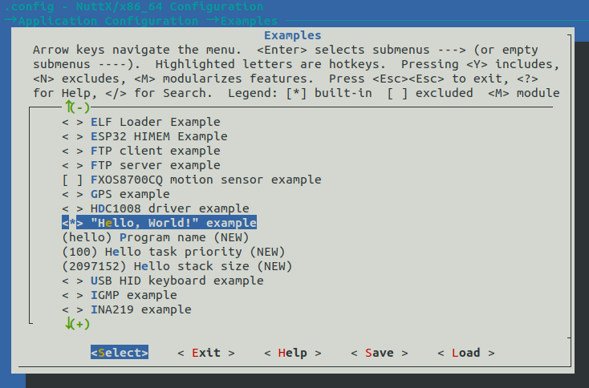
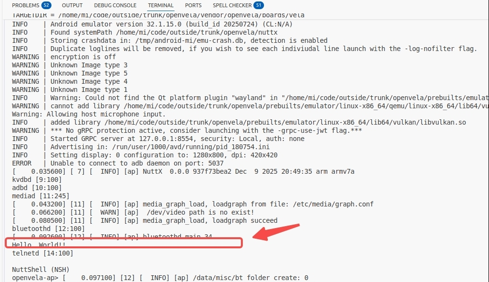

# Running the Hello World Example

[ English | [简体中文](../../../../zh-cn/app_dev/system_apps/hello_world/Hello_World.md) ]

## Overview

This document is intended for developers and aims to provide a detailed introduction to adding, configuring, and running a new user application within the openvela operating system. openvela is built on the NuttX RTOS, and its modular design allows developers to easily integrate custom functions or third-party libraries.

A typical functional module consists of the following parts:

- **System Application:** Part of the built-in system functions, typically stored in the `apps/` directory.
- **Third-Party Library:** Introduced as an external dependency, typically stored in the `external/` directory.

The example directory structure is as follows:

```Bash
└── vela
    ├── apps
    │   └── examples
    │       ├── hello_main_1
    │       └── hello_main_2
    └── external
        ├── libs_1
        └── libs_2
```

This guide will use the `Hello, World!` example application to demonstrate the complete process from coding to building, running, and configuring auto-start.

## Step 1: Reviewing the Hello World Example Framework

This section introduces how to add an example application to openvela, including the main framework, file contents, and relevant build configurations.

### 1. Main Framework

The Hello World example application requires the following core files:

- `hello_main.c`: The source code of the application, containing the `main` function entry point.
- `Kconfig`: The configuration file for the build system, used to provide configurable compilation options in `menuconfig`.
- `CMakeLists.txt`: The CMake build script used to define source code, dependencies, and compilation rules.

The directory structure example is as follows, with Hello World currently added:

```Bash
apps
 └── examples
     └── hello
         ├── hello_main.c
         ├── CMakeLists.txt
         ├── Kconfig
```

### 2. Writing Source Code (hello_main.c)

Examine the `hello_main.c` file, which is the execution logic entry point for the application:

```C
#include <stdio.h>

int main(int argc, char *argv[])
{
    printf("Hello, World!!\n");
    return 0;
}
```

If you need to use C++, please ensure the `main` function uses the `extern "C"` declaration to guarantee C language linkage compatibility, ensuring it can be correctly called by the system:

```C++
#include <iostream>

extern "C" int main(int argc, char *argv[])
{
    std::cout << "Hello, World!!" << endl;
    return 0;
}
```

### 3. Creating the Kconfig Configuration File

Examine the `Kconfig` file, which is used to define the compilation options for the application. These options will appear in the `menuconfig` graphical configuration interface, allowing users to enable or configure your application as needed:

```makefile
config EXAMPLES_HELLO
        tristate "\"Hello, World!\" example"
        default n
        ---help---
                Enable the \"Hello, World!\" example

# The following options are only visible when EXAMPLES_HELLO is enabled
if EXAMPLES_HELLO

# Define the command name for the application in openvela
config EXAMPLES_HELLO_PROGNAME
        string "Program name"
        default "hello"
        ---help---
                This is the name of the program that will be used when the NSH ELF
                program is installed.

# Define the priority of the application task
config EXAMPLES_HELLO_PRIORITY
        int "Hello task priority"
        default 100

# Define the stack size of the application task
config EXAMPLES_HELLO_STACKSIZE
        int "Hello stack size"
        default DEFAULT_TASK_STACKSIZE
        
endif
```

### 4. Creating the CMake Build Script

Examine the `CMakeLists.txt` file. The openvela build system automatically loads all macro definitions from the `.config` file as CMake variables, so you can directly use the configurations defined in `Kconfig`.

```CMake
# Check if 'EXAMPLES_HELLO' is enabled in .config
if(CONFIG_EXAMPLES_HELLO) # If defconfig enables this feature, add it to the build
  
  # Call the nuttx_add_application function to register the app as a built-in program
  nuttx_add_application(
    # NAME: Specify the unique name of the application, usually consistent with PROGNAME in Kconfig
    NAME                                
    ${CONFIG_EXAMPLES_HELLO_PROGNAME}   
    
    # SRCS: Specify the list of source files; the file containing the main function should be first
    SRCS                                
    hello_main.c 
    
    # STACKSIZE: Specify the task stack size                       
    STACKSIZE                           
    ${CONFIG_EXAMPLES_HELLO_STACKSIZE}  
    
    # PRIORITY: Specify the task priority; defaults to SCHED_PRIORITY_DEFAULT if not passed
    PRIORITY                            
    ${CONFIG_EXAMPLES_HELLO_PRIORITY})  
endif()
```

#### `nuttx_add_application()` Function Definition

This CMake function is located in `nuttx/cmake/nuttx_add_application.cmake` and is used to add and configure applications.

```CMake
nuttx/cmake/nuttx_add_application.cmake

 Usage:
   nuttx_add_application( NAME <string> [ PRIORITY <string> ]
     [ STACKSIZE <string> ] [ COMPILE_FLAGS <list> ]
     [ INCLUDE_DIRECTORIES <list> ] [ DEPENDS <string> ]
     [ DEFINITIONS <string> ] [ MODULE <string> ] [ SRCS <list> ] )

 Parameters:
   NAME                : unique name of application
   PRIORITY            : priority
   STACKSIZE           : stack size
   COMPILE_FLAGS       : compile flags
   INCLUDE_DIRECTORIES : include directories
   DEPENDS             : targets which this module depends on
   DEFINITIONS         : optional compile definitions
   MODULE              : if "m", build module (designed to received
                         CONFIG_<app> value)
   SRCS                : source files
   NO_MAIN_ALIAS       : do not add a main=<app>_main alias(*)
```

## Step 2: Verifying the Application

After creating the files, you need to configure, compile, and run your application by following these steps.

### 1. Cleaning the Build Environment (Optional)

If you have modified the Kconfig file or wish to perform a fresh compilation, it is recommended to perform a cleanup operation first:

```Bash
# Use distclean to clean all build artifacts and configurations
./build.sh vendor/openvela/boards/vela/configs/goldfish-armeabi-v7a-ap  --cmake distclean -j$(nproc)
```

Alternatively, delete the CMake artifacts directly:

```bash
# Or directly delete cmake artifacts
rm -rf cmake_out/vela_goldfish-armeabi-v7a-ap
```

### 2. Graphical Configuration (menuconfig)

Launch `menuconfig` to enable your new application in the graphical interface:

```Bash
# Start menuconfig  
./build.sh vendor/openvela/boards/vela/configs/goldfish-armeabi-v7a-ap  --cmake menuconfig -j$(nproc)
```

In the `menuconfig` interface, find and enable your application via the following path: `Application Configuration` ---> `Examples` ---> `[*] "Hello, World!" example`.



### 3. Build and Run

After saving the `menuconfig` configuration, execute the compilation.

```Bash
# Compile the firmware (-j`nproc` uses all CPU cores for parallel compilation)
./build.sh vendor/openvela/boards/vela/configs/goldfish-armeabi-v7a-ap  --cmake -j$(nproc)

# Copy the artifacts
cp cmake_out/vela_goldfish-armeabi-v7a-ap/nuttx* nuttx/ && 
cp cmake_out/vela_goldfish-armeabi-v7a-ap/vela_data.bin nuttx/ && 
cp cmake_out/vela_goldfish-armeabi-v7a-ap/vela_system.bin nuttx/

# Start the emulator to run the firmware
./emulator.sh vela
```

After the system boots, enter the program name you configured in `Kconfig` (default is `hello`) into the NSH command line and press Enter to see the program output:


## Step 3: Configuring Application Auto-Start

openvela supports automatically running specific scripts upon system startup. You can implement application auto-start by editing the startup script.

### 1. Auto-Start Mechanism and Configuration

The startup scripts for openvela are stored in the `/etc` directory. This directory is linked with the openvela binary files in the form of `romfs`. It is automatically mounted by `nshlib` after the system boots. The relevant configuration is as follows.

Ensure your board-level configuration enables the following `Kconfig` options:

```makefile
CONFIG_FS_ROMFS=y
CONFIG_ETC_ROMFS=y
CONFIG_ETC_ROMFSMOUNTPT="/etc"
CONFIG_NSH_SYSINITSCRIPT="init.d/rc.sysinit"
CONFIG_NSH_INITSCRIPT="init.d/rcS"
```

### 2. Startup Script Location

The default user startup script is located in the board-level configuration directory:

```bash
vendor/openvela/boards/vela/src/etc/init.d/rc.sysinit   # System initialization script 
vendor/openvela/boards/vela/src/etc/init.d/rcS          # User script  
```

### 3. Editing the Startup Script

Open the `rcS` file and add the execution command for your application.

```bash
#ifdef CONFIG_FS_HOSTFS
mount -t hostfs -o fs=vendor/openvela/boards/vela/resource /host
#endif

hello &
```

The result after addition is shown in the figure below:


### 4. Recompiling and Running

```bash
# Compile the firmware (-j`nproc` uses all CPU cores for parallel compilation)
./build.sh vendor/openvela/boards/vela/configs/goldfish-armeabi-v7a-ap  --cmake -j$(nproc)

# Copy the artifacts
cp cmake_out/vela_goldfish-armeabi-v7a-ap/nuttx* nuttx/ && 
cp cmake_out/vela_goldfish-armeabi-v7a-ap/vela_data.bin nuttx/ && 
cp cmake_out/vela_goldfish-armeabi-v7a-ap/vela_system.bin nuttx/

# Start the emulator to run the firmware
./emulator.sh vela
```

The result after startup is shown in the figure below:



**Note:**

- **Use POSIX Threads:** Within the application, it is recommended to use `pthread_create()` to create and manage child threads rather than directly calling the lower-level `task_create()`. This ensures better portability and compatibility.
- **Guard the Main Thread:** If your main thread creates child threads, ensure the main thread only exits after all child threads have safely exited. Otherwise, the exit of the main thread may cause the entire process to be reclaimed, forcibly terminating the child threads.
- **Create Background Services:** For services that need to run long-term, you can use `&` in the `rcS` script to run them in the background. Internally, the application typically enters a loop (such as `while(1)`) to handle events or execute periodic tasks.

## References

To help you better understand and add `CMakeLists.txt`, below are reference materials and tool information:

- For the openvela CMake build system, please refer to the [CMake Quick Start](../../../device_dev_guide/build/CMake_quick_start.md).