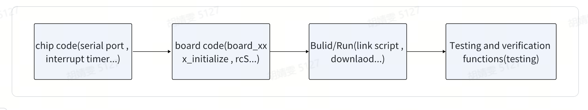

# New Platform Adaptation Guide

\[ English | [简体中文](../../zh-cn/chip_porting/porting_guide.md) \]

This document covers the openvela bringup process and the guide for porting it to new chips and boards.

## I. Overview

openvela is an embedded operating system that supports multiple hardware platforms and is modular and highly scalable. Through layered architecture design, openvela simplifies the adaptation work from processor architecture, chip layer to board-level platform. This document introduces the system architecture, porting steps and related development resources of openvela.

### 1. System Architecture

The design of openvela is divided into three layers of architecture, namely architecture layer (Architecture), chip layer (Chip/SoC) and board layer (Board).


#### Architecture Layer

The architecture layer is the core foundation of the system and defines the CPU architecture, such as mainstream processor architectures such as ARMv7-M, ARMv7-A/R, and RISC-V. openvela already supports a variety of CPU architectures, usually without modification or adaptation.

#### Chip/SoC Layer

The chip layer (System on Chip, SoC for short) is extended based on a specific processor architecture and includes specific logic designs of the chip, such as interrupt control, clock management, general I/O logic, and dedicated peripheral modules. For example, the STM32 with the ARMv7-M processor architecture is a typical SoC.

#### Board Layer

The board layer connects peripherals on the basis of the chip to form a development board with specific functions. For example, the STM32F4 Discovery development board contains the STM32F407 SoC, and integrates external sensors and other auxiliary circuit boards. Board-level adaptation usually includes PIN pin definition, board-level driver, and hardware initialization logic.

During the development process, multiple similar SoCs or development boards can share common code to improve development efficiency and maintenance convenience.

### 2. Supported Platforms and Porting Notes

openvela already supports a variety of mainstream development boards. Please refer to [Supported Platforms](https://nuttx.apache.org/docs/latest/platforms/index.html#) for detailed information.

If you need to port openvela to a new development board, you need to complete the following adaptation work:

1. Make sure the target architecture is supported by openvela.
2. For the new development board, complete the following levels of adaptation:

    - Chip layer (Chip/SoC): Add support for the target chip. The code usually follows a certain architecture directory under `nuttx/arch` (such as armv8-m, risc-v, arm64, etc.).

    - Board layer (Board): Complete the configuration, link script and driver adaptation related to the target development board.

After completing the adaptation process, the following binary products can be generated for deployment to the target hardware:

- **libarch.a**: Architecture layer static library.

- **libboards.a**: Code driver static library.

- **vela_nuttx.bin**: The final running binary file generated by compilation.

### 3. New Platform Porting Workflow

When porting openvela, the following operations need to be completed:

1. Familiar with the code structure. Developers need to be familiar with the basic structure of [Vendor code warehouse](Vendor.md). The `vendor` directory supports the management of vendor customized code through Git warehouse. The directory is usually named after the vendor name, for example, [open-vela/vendor_template](../../../../../vendor_template) is an adaptation template.

2. Configure the Kconfig file.

    - Kconfig: used to define compilation options and module dependencies. Developers need to ensure that the required functions are enabled in Kconfig according to the hardware module and peripheral configuration files. For Kconfig usage, please refer to [Kconfig Usage Guide](../device_dev_guide/build/Kconfig.md).

3. Write Makefile.

    - Makefile uses the tool chain to complete code compilation. It is necessary to ensure that the rules are defined correctly and support the target hardware platform.

4. Complete the chip layer (Chip/SoC) and board layer (Board) code adaptation. According to the template in [open-vela/vendor_template](../../../../../vendor_template), adapt the chip layer and board layer code. It is necessary to update the driver file, board-level configuration file, and complete the hardware initialization logic.

5. Compile and test. Compile and generate the target static library and the final run file to test whether all functions work properly.

### 4. Compilation and Artifact Management

Developers need to pay attention to the following:

- All custom codes are stored in the `vendor` directory, and the core code must not be modified to maintain compatibility with the main repository of openvela.
- The products generated by the compilation step include:

    - **libarch.a**: architecture layer code library.
    - **libboards.a**: board-level code library.
    - **vela_nuttx.bin**: the final binary image for firmware burning.

### 5. Sample flow chart

The following is a flow chart for porting to the new openvela platform, which intuitively shows the development steps and logical sequence:



The following takes the adaptation in the `vendor` directory as an example. The initial source code of all **vendor** repositories is [open-vela/vendor_template](../../../../../vendor_template). This template contains the basic code structure of the operating system, so the adaptation process only needs to open the corresponding file for modification.

## II. Chip layer adaptation

Chip layer adaptation is an important part of supporting hardware platforms in the openvela framework. It mainly completes the entry function based on the operating system, involving the implementation and configuration of the following aspects:

1. Start entry function: define the initial loading logic of the operating system.

2. Architecture (Arch) API implementation: implement the infrastructure interface required for system calls.

3. Interrupt adaptation: configure interrupt handling functions and related registers.
4. Serial port driver: implement serial port input and output, and register the serial port driver.
5. Timer driver: support operating system scheduling and time-related functions.
6. Memory (heap area) initialization: configure the heap area required for dynamic memory allocation.
7. Kconfig and Makefile writing: manage configuration options and code building process.

The chip layer code is located in the `vendor/<vendor_name>/chips` directory. The typical directory structure is as follows:

```Shell
vendor/vendor_name/
├── chips
│ └── <chip_name>
│ ├── chip.h
│ ├── include
│ │ ├── chip.h
│ │ └── irq.h
│ ├── Kconfig
│ ├── Make.defs
│ ├── <vendor_name>_irq.c
│ ├── <vendor_name>_irq.h
│ ├── <vendor_name>_lowputc.c
│ ├── <vendor_name>_lowputc.h
│ ├── <vendor_name>_start.c
│ ├── <vendor_name>_start.h
│ └── <vendor_name>_timeisr.c
```

### 1. Startup entry

#### Overview

In the `nuttx/arch` directory, the system defines an exception vector table (such as `_vectors`) for each architecture (arch) to unify the exception handling process.

Taking [ARMv8-M](https://github.com/open-vela/nuttx/blob/41545a4ca98165813908e5fe25d3ecdbfc5ab19a/arch/arm/src/armv8-m/arm_vectors.c#L94) as an example, when a reset exception occurs, the system will call the `__start` function implemented by different chips.

The specific implementation of the `__start` function is located in the **`<vendor_name>`**`_start.c` file. Developers can refer to typical implementations, such as [stm32_start.c](https://github.com/open-vela/nuttx/blob/41545a4ca98165813908e5fe25d3ecdbfc5ab19a/arch/arm/src/stm32f7/stm32_start.c), to complete the adaptation of the chip platform.

#### Responsibilities of the `__start` function

The `__start` function is the entry function for system reset exceptions, and its main responsibilities include the following aspects:

- Clear the BSS segment:
    - The BSS (Block Started by Symbol) segment is used to store uninitialized global variables and static variables. After the system is reset, it needs to be cleared.
- Copy `.data` and RAM functions to the specified location:
    - Copy the `.data` segment and RAM functions in the read-only memory (such as Flash) to the specified area of ​​the runtime RAM.
- Initialize necessary modules:
    - Configure the system clock (clock).
    - Initialize the serial port (serial).
    - Set environment variables such as stack limit (stack limit).
- Call the operating system startup entry:
    - Load and start the openvela core operating system through the `nx_start()` function.

#### Sample code: `__start` function

The following is a standard `__start` function implementation template, which is used to complete the initialization process of the system reset entry:

```C
/****************************************************************************
* Name: __start
*
* Description:
* This is the reset entry point.
*
****************************************************************************/

void __start(void)
{
/* do something initialize */

...

#ifdef CONFIG_ARCH_PERF_EVENTS
    up_perf_init((void *)STM32_SYSCLK_FREQUENCY);
#endif

/* Perform early serial initialization */

#ifdef USE_EARLYSERIALINIT
    arm_earlyserialinit();
#endif

/* Bring up NuttX */

nx_start();

/* Shouldn't get here */

for (; ; );
}
```

### 2. Serial port

#### Overview

The chip usually contains multiple serial ports, and one serial port is usually selected as the system console (console) for outputting logs and `nsh` interaction. During the system initialization (bringup) process, the normal operation of this serial port is very critical. For details, please refer to [Serial Port Driver Adaptation](../device_dev_guide/driver/bus_driver/UART/UART.md).

#### Code location

- Reference implementation:

    - [stm32_serial.c](https://github.com/open-vela/nuttx/blob/41545a4ca98165813908e5fe25d3ecdbfc5ab19a/arch/arm/src/stm32f7/stm32_serial.c)
    - [stm32_lowputc.c](https://github.com/open-vela/nuttx/blob/41545a4ca98165813908e5fe25d3ecdbfc5ab19a/arch/arm/src/stm32f7/stm32_lowputc.c)

- Serial port related implementations are generally located in:

    - `<vendor_name>_lowputc.c`
    - `<vendor_name>_serial.c`

#### Initialization process

- Serial port initialization usually occurs before `nx_start`.

- Each architecture (arch) provides the `<arch>_earlyserialinit` interface to initialize the serial port registers corresponding to the console, and the `<arch>_lowputc` function can be used to complete log printing later. The following are sample functions for the ARM platform: 

    ```C
    ./arm/src/common/arm_internal.h

    /****************************************************************************
    - Name: arm_earlyserialinit
    -
    - Description:
    - Performs the low level USART initialization early in debug so that the
    - serial console will be available during bootup.  This must be called
    - before arm_serialinit.
    -
     ****************************************************************************/

    #ifdef USE_EARLYSERIALINIT
    void arm_earlyserialinit(void)
    {
    }

    /****************************************************************************
    - Name: arm_lowputc
    -
    - Description:
    - Output one byte on the serial console
    -
     ****************************************************************************/

    void arm_lowputc(char ch)
    {
    }

    ```

#### Serial port access

Operating system code will use the common architecture interfaces `up_putc` and `up_puts` to directly access the serial port, of which `up_putc` needs to be implemented by the manufacturer.

```C
/****************************************************************************
* Name: up_putc
*
* Description:
* Provide priority, low-level access to support OS debug writes
*
****************************************************************************/

void up_putc(int ch)
{
}
```

#### Serial port driver registration

In order for the application to access the physical serial port through standard input/output (`stdin/out/err`), the serial port driver must be registered.

- Each architecture provides the `<arm>_serialinit` interface, which is implemented by the manufacturer.

- Internally call `uart_register` to register the console and other serial port device nodes. The following is an example for the ARM platform:

    ```C

    /************************************************************************
    - Name: arm_serialinit
    -
    - Description:
    - Register serial console and serial ports. This assumes
    - that arm_earlyserialinit was called previously.
    -
    ********************************************************************************/

    void arm_serialinit(void)
    {
    #ifdef CONSOLE_DEV
    uart_register("/dev/console", &CONSOLE_DEV);
    #endif
    ...
    }
    ```

### 3. Timer

#### Overview

Timer is related to the timing and timing of the system. In openvela, two main driver models are provided:

- `arch_alarm`: based on a oneshot timer (oneshot driver).
- `arch_timer`: Based on the regular timer (timer driver).

The main difference between the two drivers is the way to handle the hardware counter after timeout, which directly affects the timing accuracy and error.

#### Driver model differences and applicability

- arch_alarm is suitable for situations where the hardware counter does not need to be cleared after timeout. This model avoids the cumulative error caused by restarting the counter. For more details, please refer to [Arch Alarm Framework Development Guide](../device_dev_guide/driver/timer_driver/timer/Arch_Alarm.md).

- arch_timer is usually adapted to periodic timers such as the system tick timer (`systick`). The hardware counter needs to be cleared and restarted after timeout. For more details, please refer to [Arch Timer Driver Framework Usage Guide](../device_dev_guide/driver/timer_driver/timer/Arch_Timer.md).

#### arch_alarm driver adaptation process

When implementing, manufacturers mainly focus on the following steps:

1. Implement a oneshot timer driver.
2. In the `up_timer_initialize` function, call the driver initialization interface to create a `oneshot_lowerhalf_s` instance.
3. Call `up_alarm_set_lowerhalf` to bind the driver to the system `arch_alarm` model.

Here is the reference implementation of the `up_timer_initialize` function, located in [arm_arch_timer.c](https://github.com/open-vela/nuttx/blob/41545a4ca98165813908e5fe25d3ecdbfc5ab19a/arch/arm/src/armv8-r/arm_arch_timer.c#L377):

```C
/********************************************************************************
* Function: up_timer_initialize
*
* Description:
* This function is called during start-up to initialize the timer
* interrupt.
*
****************************************************************************/

void up_timer_initialize(void)
{
    struct oneshot_lowerhalf_s *lower = xxx_oneshot_initialize();

    up_alarm_set_lowerhalf(lower);
}
```

### 4. Exceptions/interrupts

Each architecture (arch) provides a corresponding interrupt exception vector table, allowing manufacturers to call `irq_attach` to bind the corresponding interrupt processing function.

To implement interrupt initialization, enabling, disabling and priority setting, manufacturers need to implement a series of architecture-related functions starting with `up_`.

- For details, please refer to [Interrupt System Adaptation Guide](./Interrupt_System_Adaptation_Guide.md).
- For relevant code, please refer to [stm32_irq.c](https://github.com/open-vela/nuttx/blob/41545a4ca98165813908e5fe25d3ecdbfc5ab19a/arch/arm/src/stm32f7/stm32_irq.c), and the interrupt implementation is in `<vendor_name>_irq.c`.

### 5. Stack/Heap

#### Overview

In embedded systems, the division of stack and heap is crucial. The memory layout under a flat build is usually as follows:

```C
.data region              Size determined at link time.
.bss region               Size determined at link time.
IDLE thread stack         Size determined by CONFIG_IDLETHREAD_STACKSIZE.
Heap                      Extends to the end of SRAM.
```

The explanation is as follows:

- `.data` region: The size of this region is determined at link time.
- `.bss` region: The size of this region is determined at link time.
- IDLE thread stack: The size is defined by `CONFIG_IDLETHREAD_STACKSIZE`.
- Heap: Extends downward from the end of static random access memory (SRAM).

> Note
>
> The IDLE stack is usually located after the `.bss` segment, and its size is specified by `CONFIG_IDLETHREAD_STACKSIZE`, followed by the heap.

#### Interrupt stack configuration

- Manufacturers can set the interrupt stack size through the configuration item `CONFIG_ARCH_INTERRUPTSTACK`.
- The interrupt stack space is defined by the global variable `g_intstackalloc`.
- Each architecture calls `up_get_intstackbase` through the corresponding initialization function (such as `arm_initialize_stack`) to obtain the bottom address of the interrupt stack, and calculates the top of the stack according to `CONFIG_ARCH_INTERRUPTSTACK`.

#### Heap management

- openvela supports multiple independent heap management. The same heap can contain multiple non-contiguous physical memory areas.
- The system, driver and application apply for heap memory through `kmm_malloc` or the standard `malloc` API.
- Reference code location: [stm32_allocateheap.c](https://github.com/open-vela/nuttx/blob/41545a4ca98165813908e5fe25d3ecdbfc5ab19a/arch/arm/src/stm32f7/stm32_allocateheap.c).

#### Heap size calculation

Usually, the remaining RAM of the system (minus `.data`, `.bss`, and IDLE stack) will be registered as the heap. Therefore, the total size of the heap will vary with the system. The starting address and size of the heap can be calculated using the following method:

- Starting address: `ebss + CONFIG_IDLETHREAD_STACKSIZE`
- Heap size: `RAM end address - starting address`

### 6. Kconfig and Make.defs

#### Overview

Kconfig and Make.defs are two important components for building and configuring the openvela system.

#### Kconfig function

The Kconfig file in the chip directory is used to define chip-related configuration items, including:

- Chip Model
- Chip Features
- Internal Module Settings

For example, the [nuttx/arch/arm/src/stm32f7/Kconfig](https://github.com/open-vela/nuttx/blob/41545a4ca98165813908e5fe25d3ecdbfc5ab19a/arch/arm/src/stm32f7/Kconfig) file defines the relevant configuration of the STM32F7 series chips, supporting different models of flash configuration and on-chip driver configuration.

The following is an example of a Kconfig configuration snippet for the STM32F7 series chip, where both `ARCH_CHIP_STM32F722RC` and `ARCH_CHIP_STM32F722RE` are options that define this chip series, but they have different flash configurations.

```kconfig
if ARCH_CHIP_STM32F7

comment "STM32 F7 Configuration Options"

choice
        prompt "STM32 F7 Chip Selection"
        default ARCH_CHIP_STM32F746NG
        depends on ARCH_CHIP_STM32F7

config ARCH_CHIP_STM32F722RC
        bool "STM32F722RC"
        select STM32F7_STM32F722XX
        select STM32F7_FLASH_CONFIG_C
        select STM32F7_IO_CONFIG_R
        ---help---
                STM32 F7 Cortex M7, 256 FLASH, 256K (176+16+64) Kb SRAM

config ARCH_CHIP_STM32F722RE
        bool "STM32F722RE"
        select STM32F7_STM32F722XX
        select STM32F7_FLASH_CONFIG_E
        select STM32F7_IO_CONFIG_R
        ---help---
                STM32 F7 Cortex M7, 512 FLASH, 256K (176+16+64) Kb SRAM
...
endif
```

- The `choice` node defines the chip selection menu, through which the user can select a specific chip model.
- Each `config` item corresponds to a specific chip model, specifying the corresponding features and resource allocation (such as flash size and IO configuration).
- The `select` keyword is used to automatically select the corresponding configuration sub-item.

The chip's on-chip drivers and various hardware-related configurations can also be defined and managed in this Kconfig file.

#### Make.defs Function

The Make.defs file is used to manage the list of source files involved in the compilation, ensuring that the build system correctly compiles the required code. In the corresponding Make.defs file, you need to add all the source files to be compiled to ensure that the build system can correctly process the code of each module. You can refer to the [nuttx/arch/arm/src/stm32f7/Make.defs](https://github.com/open-vela/nuttx/blob/41545a4ca98165813908e5fe25d3ecdbfc5ab19a/arch/arm/src/stm32f7/Make.defs) example file.

### 7. chip.h and irq.h file description

- `chip.h` file
    - There are two `chip.h` files in the `vendor/vendor_name/chip/chip_name` directory:
        - Local `chip.h`: located in the current directory, defines macros and function declarations related to the chip.
        - Public `chip.h`: located in `include/chip.h`, referenced by `#include <arch/chip/chip.h>`, defines architecture-related macros and functions, and is used by architecture-level common code.

- `irq.h` file
    - Similar structure: there are two levels: local and public.
    - Public `include/irq.h` is responsible for architecture-wide interrupt-related definitions.
    - Local `irq.h` defines interrupts for specific chips.

- Reference suggestions
    - Local files are used for chip-specific code and are referenced using relative paths.
    - Public files are used for architecture-shared code and are referenced through standard include paths.

- Purpose
    - Clearly distinguish between local and public files to avoid confusion and conflicts.
    - Ensure code modularity and unified architecture.

## III. Board-level adaptation

Board-level adaptation mainly completes the following contents:

- Linker Script
- Main `Make.defs`
- `etcramfs` build
- Board Configs
- Board initialization code

The overall code structure is as follows:

```Shell
vendor/vendor_name/
├── boards
│   └── <chip_name>
│       └── <board_name>
│           ├── configs
│           │   └── nsh
│           │       └── defconfig
│           ├── include
│           │   ├── board.h
│           │   └── nsh_romfsimg.h
│           ├── Kconfig
│           ├── scripts
│           │   ├── ld.script
│           │   └── Make.defs
│           └── src
│               ├── board_name.h
│               ├── etc
│               │   ├── group
│               │   ├── init.d
│               │   │   ├── rcS
│               │   │   └── rc.sysinit
│               │   └── passwd
│               ├── Makefile
│               ├── <vendor_name>_appinit.c
│               ├── <vendor_name>_boot.c
│               └── <vendor_name>_bringup.c
```

### 1. Initialization code

#### Phase division

- `board_early_initialize`: Executed before the idle task, early hardware initialization.
- `board_late_initialize`: Executed in the context of the Appbringup thread, regular driver initialization.
- `board_app_initialize`: Executed in the context of nsh task, file system and core services are initialized.
- `board_app_finalinitialize`: Executed in the context of nsh task, application related initialization.

For detailed process, please refer to [boot process](../device_dev_guide/kernal/boot_process.md). Manufacturers need to write to the corresponding function according to the time when the peripheral is initialized.

#### Sample code

Related files include:

- `<vendor_name>_bringup.c`
- `<vendor_name>_appinit.c`
- `<vendor_name>_boot.c`

For sample code, please refer to [nuttx/boards/arm/stm32f7/stm32f746g-disco/src/stm32_boot.c](https://github.com/open-vela/nuttx/blob/41545a4ca98165813908e5fe25d3ecdbfc5ab19a/boards/arm/stm32f7/stm32f746g-disco/src/stm32_boot.c#L99)

```C
#ifdef CONFIG_BOARD_EARLY_INITIALIZE
void board_early_initialize(void)
{

}
#endif

#ifdef CONFIG_BOARD_LATE_INITIALIZE
void board_late_initialize(void)
{

}

int board_app_initialize(uintptr_t arg)
{

}

#ifdef CONFIG_BOARDCTL_FINALINIT
int board_app_finalinitialize(uintptr_t arg)
{

}
#endif
```

### 2. ETCROMFS build

- Function description: The root file system is stored in Flash as a read-only file system (ROMFS).

- Purpose: Store sensitive files such as application configuration files and keys.

- Steps to add files:

    - Add the target file path through `RCRAWS` in `Make.defs`.

    - Trigger incremental compilation after deleting the `etctmp` directory.
    - After booting, the files are accessible via the `/etc/` path.

#### Example `Make.defs` configuration

```Makefile
ifeq ($(CONFIG_ETC_ROMFS),y)
RCSRCS += etc/init.d/rc.sysinit etc/init.d/rcS
RCRAWS += etc/group etc/passwd
RCRAWS += etc/build.prop
RCRAWS += etc/txtable.txt

ifneq ($(CONFIG_UTILS_AVB_VERIFY)$(CONFIG_UTILS_ZIP_VERIFY),)
RCRAWS += etc/key.avb
endif

ifeq ($(CONFIG_ATS3085X_BOOTLOADER),y)
RCRAWS += etc/factory.sh
endif

```

### 3. Linker script

Each board can be configured with a custom linker script, which is specified in `board/Make.defs` by the `LDSCRIPT` keyword. The general linker script is stored in the following path: `vendor/vendor_name/boards/chip_name/board_name/scripts`

For example: [nuttx//boards/arm/stm32f7/stm32f746g-disco/scripts/flash.ld](https://github.com/open-vela/nuttx/blob/41545a4ca98165813908e5fe25d3ecdbfc5ab19a/boards/arm/stm32f7/stm32f746g-disco/scripts/flash.ld)

The requirements for the linker script include:

- Set ENTRY to `_vectors` to support global vector table.
- If backtrace is supported, add `.arm.exidx` section. See [Backtrace](../device_dev_guide/debugging/memory/offline/backtrace.md) for more details.

Linker script example:

```Makefile
MEMORY
{                                                                                       
  flash (rx) : ORIGIN = 0x10000000, LENGTH = 2560K                                      
  sram (rwx) : ORIGIN = 0x01000400, LENGTH = 111K                                       
  psram (rwx) : ORIGIN = 0x18000000, LENGTH = 4M                                        
  dsp_inner_ram (rwx) : ORIGIN = 0x01054000, LENGTH = 16K                           
  share_ram (rwx) : ORIGIN = 0x0106A600, LENGTH = 22K                                   
}        
                                                                               
OUTPUT_ARCH(arm)                                                                        
EXTERN(_vectors)                                                                        
ENTRY(_stext)                                                                           
SECTIONS                                                                                {                                                                                       
    .text : {                                                                           
        . = 0x200;                                                                      
        _stext = ABSOLUTE(.);                                                           
        *(.vectors)                                                                     
        *(.text .text.*)                                                                
        *(.fixup)                                                                       
        *(.gnu.warning)                                                                 
        *(.rodata .rodata.*)                                                            
        *(.gnu.linkonce.t.*)                                                            
        *(.glue_7)                                                                      
        *(.glue_7t)                                                                     
        *(.got)                                                                         
        *(.gcc_except_table)                                                            
        *(.gnu.linkonce.r.*)                                                            
        _etext = ABSOLUTE(.);                                                         
    } > flash    
}
```


### 4. Configuration files

Each board can contain multiple configuration files (config files), usually configured to start the system with `nsh`, which only has basic functions. The configuration location is: `vendor/vendor_name/boards/chip_name/board_name/configs/nsh`.

For example: [nuttx/boards/arm/stm32f7/stm32f746g-disco/configs](https://github.com/open-vela/nuttx/tree/41545a4ca98165813908e5fe25d3ecdbfc5ab19a/boards/arm/stm32f7/stm32f746g-disco/configs)

> Note
>
> openvela recommends not adding too many configuration files to reduce maintenance burden.

### 5. Kconfig, Makefile and Make.defs

- Kconfig: defines the configuration items of board peripherals, including peripheral drivers and board-level configuration. See the [Kconfig](https://github.com/open-vela/nuttx/blob/41545a4ca98165813908e5fe25d3ecdbfc5ab19a/boards/arm/stm32f7/stm32f746g-disco/Kconfig) example for more details.

- Makefile: Adds source files that need to be compiled to the build and eventually generates `libboard.a`. See the [Makefile](https://github.com/open-vela/nuttx/blob/41545a4ca98165813908e5fe25d3ecdbfc5ab19a/boards/arm/stm32f7/stm32f746g-disco/src/Make.defs) example for more details.

- scripts/Make.defs: top-level build configuration, including system configuration `.config`, `Toolchain.defs`, link scripts, and external library references. For details, see the [Make.defs](https://github.com/open-vela/nuttx/blob/41545a4ca98165813908e5fe25d3ecdbfc5ab19a/boards/arm/stm32f7/stm32f746g-disco/scripts/Make.defs) example.

    Example Make.defs snippet:

    ```Makefile

    include $(TOPDIR)/.config 
    include $(TOPDIR)/tools/Config.mk 
    include $(TOPDIR)/arch/arm/src/armv7-m/Toolchain.defs 

    LDSCRIPT = ld.script 

    ARCHSCRIPT += $(BOARD_DIR)$(DELIM)scripts$(DELIM)$(LDSCRIPT) 

    CFLAGS := $(ARCHCFLAGS) $(ARCHOPTIMIZATION) $(ARCHCPUFLAGS) $(ARCHINCLUDES) $(ARCHDEFINES) $(EXTRAFLAGS) -pipe 
    CPICFLAGS = $(ARCHPICFLAGS) $(CFLAGS) 
    CXXFLAGS := $(ARCHCXXFLAGS) $(ARCHOPTIMIZATION) $(ARCHCPUFLAGS) $(ARCHXXINCLUDES) $(ARCHDEFINES) $(EXTRAFLAGS) -pipe 
    CXXPICFLAGS = $(ARCHPICFLAGS) $(CXXFLAGS) 
    CPPFLAGS := $(ARCHINCLUDES) $(ARCHDEFINES) $(EXTRAFLAGS) 
    AFLAGS := $(CFLAGS) -D__ASSEMBLY__ 

    EXTRA_LIBS += $(wildcard $(shell readlink -f $(TOPDIR)/$(CONFIG_ARCH_BOARD_CUSTOM_DIR)/libs/$(CONFIG_ARCH_BOARD_CUSTOM_NAME))/*.a) 
    EXTRA_LIBS += $(wildcard $(shell readlink -f $(TOPDIR)/$(CONFIG_ARCH_BOARD_CUSTOM_DIR)/libmedia/*.a)) 
    ```

### 6. board.h and nsh_romfsimg.h

- `board.h`: Mainly used to define macros or function declarations related to peripheral drivers and board-level configuration, introduced through `<arch/board/board.h>`. Please refer to [nuttx/boards/arm/stm32f7/stm32f746g-disco/include/board.h](https://github.com/open-vela/nuttx/blob/41545a4ca98165813908e5fe25d3ecdbfc5ab19a/boards/arm/stm32f7/stm32f746g-disco/include/board.h) for examples.
- `nsh_romfsimg.h`: Automatically generated root file system content, manual modification is not recommended.

### 7. Toolchain

Vendors can import custom toolchains, usually stored in `vendor/vendor_name/prebuilt`. The compiler, linker tool path, etc. can be configured through `board/scripts/Make.defs`.

## IV. Build and run

openvela supports two compilation methods: CMake and Make.

It is recommended to use the following CMake command for building:

```Makefile
./build.sh vendor/vendor_name/board/chip_name/configs/nsh --cmake -j8
```

After executing the above command, the `vela_ap.bin` file will be generated, and the manufacturer can use the corresponding burning method for operation verification.

## V. Test verification

After the manufacturer completes the adaptation, it needs to be tested through the access test, which mainly includes the following aspects:

- Functional test
- Stability test
- Performance test

To help developers quickly perform self-validation, the openvela community provides a ready-to-use [xTS Test Case Collection (Chinese)](../../zh-cn/test_dev_guide/openvela_xts_test_cases.md) that covers standard test cases for system kernel, driver BSP, filesystem, WiFi, Bluetooth, audio/video and other fundamental capabilities. Commands can be copied directly into nsh for execution without writing tests from scratch.

Test cases are divided into two categories:

- **General self-tests** (mandatory): cover fundamental capabilities such as memory, scheduling, GPIO, I2C/SPI, UART, RTC, Watchdog. All developers porting a new platform are recommended to run them.
- **Category-specific self-tests** (optional): selected based on product characteristics, including WiFi, Bluetooth, LCD, Audio, filesystem, OTA, etc.

Once the basic tests pass, the results can serve as the acceptance criteria for the new platform port. If a test case does not apply to your platform or you have questions about the steps, please [file an issue on open-vela/docs](https://github.com/open-vela/docs/issues) — the community maintainers review feedback regularly.
