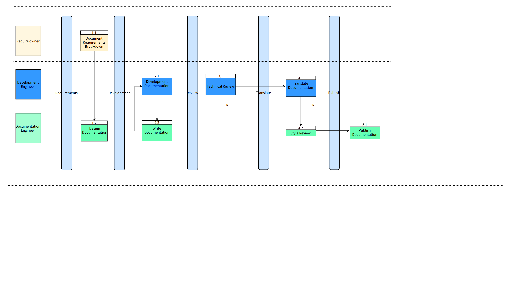

# openvela Documentation Development Process

[ English | [简体中文](../../../zh-cn/contribute/process/doc_dev_process.md) ]

## Flowchart

## I. What Development Engineers Should Do

### 1. Develop Documentation  

If you are responsible for developing a particular feature, you need to collaborate with the documentation team to ensure that the corresponding documentation for the feature is completed before the version is released. Otherwise, features without accompanying documentation might be removed during release.

1. Contact the [documentation team's technical writer](./doc_reviewer.md) to discuss documentation design.  
2. Refer to the [documentation templates](../template/) to write the accompanying documentation.
3. Draft detailed documentation for the feature, submit a PR, and include links to the relevant requirement `Issue` in the PR description.  

### 2. Submit PR for Review

- After submitting a PR, technical experts and documentation specialists will be automatically assigned for review.  
- Technical experts will provide an `Approve` decision after review.  
- Documentation specialists will add a `DocsApprove` comment after review.  

### 3. Submit for Testing  

- After the documentation is enters the testing phase with the version release, documentation engineers will test the documentation.  
- Issues identified during testing will be logged as `Issue` in the docs repository. The author must fully confirm and resolve these issues by updating the documentation.

### 4. Submit for Translation  

- Self-translation is recommended.
- To request translation support from the documentation team, submit a translation request after the Chinese documentation is finalized (post-review and testing). Include the following:  

    - Add new terms to the [Glossary](../../overview/glossary.md).  
    - Provide English screenshots.  

## II. What Documentation Engineers Should Do

### 1. Review Documentation

#### Content Clarity

- Ensure logical accuracy and consistent terminology.  
- Provide clear step-by-step instructions to guide developers in task implementation.  
- Use visuals (e.g., diagrams) to complement text and avoid lengthy prose.  

#### Information Architecture

- When adding a new Markdown page:  

    - Use the appropriate content template.  

- When modifying an existing Markdown page:  

    - Verify that changes do not break links to other community content (local checks recommended).  

### 2. Test Documentation

Documentation engineers will test the documentation. Issues identified during testing will be tracked as `Issue` entries, and the author must address them promptly.  

### 3. Translate Documentation

Complete translations for core documentation.
