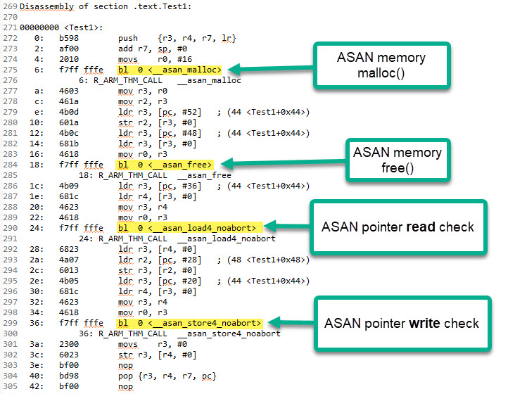

# Debugging Memory Errors with AddressSanitizer

\[ English | [简体中文](./../../../../../zh-cn/debugging_tools/crash/memory/heap/ASan.md) \]

AddressSanitizer (ASan) is a compiler-based, high-performance memory error detection tool that helps developers accurately find and diagnose various memory issues at runtime. This guide details how to enable and use ASan on the openvela `simulator` platform.

**Note**: The AddressSanitizer feature is currently supported only on the `simulator` platform.

## I. Overview

AddressSanitizer (ASan) is a part of the [Google Sanitizer Tools](https://github.com/google/sanitizers). It works by instrumenting code at compile time and linking a dedicated runtime library. This mechanism allows it to efficiently capture a wide range of memory errors with a moderate performance overhead.

ASan can detect the following common issues:

- **Out-of-Bounds Access**: Accessing heap, stack, or global variables beyond their legal boundaries.
- **Use-after-Free**: Accessing memory that has already been deallocated by `free()` or `delete`.
- **Use-after-Return**: Accessing local variables on a function's stack frame after the function has returned.
- **Use-after-Scope**: Accessing a local variable whose lifetime has ended within its scope (`{}`).
- **Double-Free**: Calling `free()` twice on the same memory block.
- **Invalid-Free**: Freeing an invalid or unallocated memory address.
- **Memory Leaks**: Detected by the integrated LeakSanitizer (LSan), which finds memory that has been allocated but is no longer accessible.
- **Initialization-Order-Fiasco**: Detects C++ global variable initialization order issues across different translation units.

## II. How ASan Works

ASan primarily relies on two components working together: the **compiler instrumentation** module and the **runtime library**.

### 1. Compiler Instrumentation

When ASan is enabled, the compiler automatically inserts check code before and after every memory access (read/write) in the program to verify its validity. The effect is illustrated below:



### 2. Runtime Library

The ASan runtime library (`libasan`) intercepts standard memory management functions (like `malloc` and `free`) and introduces **Shadow Memory** and **Memory Poisoning** mechanisms.

- **Shadow Memory**: ASan reserves a portion of the virtual address space as shadow memory. Each byte in the shadow memory describes the state of the corresponding 8 bytes in the main application memory (e.g., inaccessible, fully accessible, or partially accessible).

- **Memory Poisoning**:

    - **On Allocation**: When `malloc` is called to allocate memory, the ASan runtime library allocates extra "Redzones" around the requested memory region. These redzones, along with any padding bytes from alignment, are marked as "poisoned." Any access to them is immediately reported as an error.
    - **On Deallocation**: When `free` is called, the entire memory region (including the original valid area and the redzones) is marked as "poisoned" and placed in a quarantine queue. This memory is not immediately reused, which effectively detects "use-after-free" errors.


### 3. Detection Algorithm

For each memory access, the compiler-inserted check code executes the following pseudo-code logic:

1. Calculates the corresponding shadow memory address `ShadowAddr` based on the access address `Addr`.
2. Reads the value of the shadow byte `k`, which describes the state of the 8-byte aligned block containing `Addr`.
3. Checks if the access is valid:

    - If `k` is `0`, all 8 bytes are accessible.
    - If `k` is negative, the entire 8-byte block is inaccessible (e.g., a redzone or freed memory).
    - If `k` is positive (`1` to `7`), the first `k` bytes are accessible.
    - If the access crosses the boundary defined by `k`, it is flagged as a memory error.

```C
// Pseudo-code for the detection logic
ShadowAddr = (Addr >> 3) + Offset; // Calculate shadow address
k = *ShadowAddr;                   // Read the shadow byte
if (k != 0 && ((Addr & 7) + AccessSize > k)) {
    ReportAndCrash(Addr);            // If the access is invalid, report an error and crash
}
```

## III. How to Use ASan in openvela

Enabling ASan on the `simulator` platform is a simple three-step process.

### Step 1: Enable the ASan Configuration

Enable the following Kconfig option via `menuconfig` or by directly modifying the `.config` file:

```Makefile
# Enable Address Sanitizer for the sim platform
CONFIG_SIM_ASAN=y
```

**Note**: Enabling this option automatically adds the `-fsanitize=address` flag to the compiler and linker. To get clearer stack traces, the `-fno-omit-frame-pointer` flag is also typically included.

### Step 2: Compile and Run

Follow the standard compilation process, then start the `simulator` to run your application.

```Bash
# Example of running the simulator
./emulator.sh vela
```

### Step 3: Analyze the Error Report

If ASan detects a memory error, the program will terminate immediately and print a detailed report. A typical ASan report contains the following key information:

```Bash
# 1. Error Summary: Indicates the error type (heap-use-after-free) and the illegal access address.
==9901==ERROR: AddressSanitizer: heap-use-after-free on address 0x60700000dfb5

# 2. Access Details and Stack Trace: Shows the illegal memory operation (READ of size 1) and where it occurred.
READ of size 1 at 0x60700000dfb5 thread T0
    #0 0x45917a in main use-after-free.c:5
    #1 0x7fce9f25e76c in __libc_start_main ...

# 3. Memory Location Description: Explains which memory region the illegal address is in.
0x60700000dfb5 is located 5 bytes inside of 80-byte region [0x60700000dfb0,0x60700000e000)

# 4. Deallocation Stack Trace: (If applicable) Shows where the memory block was freed.
freed by thread T0 here:
    #0 0x4441ee in __interceptor_free ...
    #1 0x45914a in main use-after-free.c:4

# 5. Allocation Stack Trace: Shows where the memory block was originally allocated.
previously allocated by thread T0 here:
    #0 0x44436e in __interceptor_malloc ...
    #1 0x45913f in main use-after-free.c:3

# 6. Final Summary: A concise summary of the entire error.
SUMMARY: AddressSanitizer: heap-use-after-free use-after-free.c:5 main
```

## IV. Common Error Types and Examples

The following are several typical memory errors that ASan can detect.

### 1. Heap-Use-after-Free

**Scenario**: Accessing heap memory that has already been deallocated by `free` or `delete`.

**Example Code**:

```C
  5 int main (int argc, char** argv)
  6 {
  7     int* array = new int[100];
  8     delete []array;
  9     return array[1];  // <-- ERROR: Accessing freed memory
 10 }
```

**Error Report Summary**:

```Bash
==3189==ERROR: AddressSanitizer: heap-use-after-free on address 0x61400000fe44
...
freed by thread T0 here:
    #1 0x4008b5 in main /home/ron/dev/as/use_after_free.cpp:8
previously allocated by thread T0 here:
    #1 0x40089e in main /home/ron/dev/as/use_after_free.cpp:7
```

### 2. Heap-Buffer-Overflow

**Scenario**: Accessing a heap-allocated memory region beyond its boundaries.

**Example Code**:

```C
  2 int main (int argc, char** argv)
  3 {
  4     int* array = new int[100];
  5     int res = array[100];    // <-- ERROR: Accessing the 101st element, out of bounds
  6     delete [] array;
  7     return res;
  8 } 
```

**Error Report Summary**:

```Bash
==3322==ERROR: AddressSanitizer: heap-buffer-overflow on address 0x61400000ffd0
...
0x61400000ffd0 is located 0 bytes to the right of 400-byte region [0x61400000fe40,0x61400000ffd0)
allocated by thread T0 here:
    #1 0x40089e in main /home/ron/dev/as/heap_buf_overflow.cpp:4
```

### 3. Stack-Buffer-Overflow

**Scenario**: Accessing a stack-allocated local variable beyond its boundaries.

**Example Code**:

```C
  2 int main (int argc, char** argv)
  3 {
  4     int array[100];
  5     return array[100];  // <-- ERROR: Accessing the 101st element, out of bounds
  6 }
```

**Error Report Summary**:

```Bash
==3389==ERROR: AddressSanitizer: stack-buffer-overflow on address 0x7ffd061fa4a0
...
Address 0x7ffd061fa4a0 is located in stack of thread T0 at offset 432 in frame
    #0 0x400935 in main /home/ron/dev/as/stack_buf_overflow.cpp:3
  This frame has 1 object(s):
    [32, 432) 'array' <== Memory access at offset 432 overflows this variable
```

### 4. Global-Buffer-Overflow

**Scenario**: Accessing a global or static variable beyond its boundaries.

**Example Code**:

```C
  2 int array[100];
  3 
  4 int main (int argc, char** argv)
  5 {
  6     return array[100];  // <-- ERROR: Accessing the 101st element, out of bounds
  7 }
```

**Error Report Summary**:

```Bash
==3499==ERROR: AddressSanitizer: global-buffer-overflow on address 0x000000601270
...
0x000000601270 is located 0 bytes to the right of global variable 'array' defined in '...'
```

### 5. Use-after-Return

**Scenario**: After a function returns, its stack frame is destroyed, but the program still accesses a local variable on that stack via a pointer.

**Example Code**:

```C
int *ptr;
__attribute__((noinline))
void FunctionThatEscapesLocalObject() {
  int local[100];
  ptr = &local[0];  // ptr points to a local variable that is about to be destroyed
}

int main(int argc, char **argv) {
  FunctionThatEscapesLocalObject();
  return ptr[argc];  // <-- ERROR: Accessing invalid stack memory
}
```

**Error Report Summary**:

```Bash
==6268== ERROR: AddressSanitizer: stack-use-after-return on address 0x7fa19a8fc024
```

### 6. Use-after-Scope

**Scenario**: A variable's lifetime ends within a scope (`{...}`), but it is still accessed from outside that scope.

**Example Code**:

```C
volatile int *p = 0;

int main() {
  {
    int x = 0;
    p = &x;
  }             // The scope of x ends here
  *p = 5;       // <-- ERROR: Accessing invalid stack memory
  return 0;
}
```

**Error Report Summary**:

```Bash
==58237==ERROR: AddressSanitizer: stack-use-after-scope on address 0x7ffc4d830880
```

### 7. Initialization-Order-Fiasco

**Scenario**: This issue occurs mainly in C++. It happens when the initialization of a global variable in one translation unit (`.cpp` file) depends on another global variable in a different unit that has not yet been initialized.

**Example**:

```C++
// a.cc
extern int extern_global;
int x = extern_global + 1; // <-- ERROR: Reading extern_global before it is initialized
```

```C++
// b.cc
int extern_global = 42;
```

**Error Report Summary**:

```Bash
==ERROR: AddressSanitizer: initialization-order-fiasco on address 0x...
READ of size 4 at 0x...
... is located 0 bytes inside of global variable 'extern_global' from 'b.cc'
```

### 8. Memory Leak

**Scenario**: Heap memory allocated (via `malloc` or `new`) is not properly deallocated when no longer needed, leading to a gradual increase in memory consumption. This feature is provided by LeakSanitizer (LSan), which is integrated with ASan by default.

**Example Code**:

```C
  4 void* p;
  5 
  6 int main ()
  7 {
  8     p = malloc (7);
  9     p = 0;           // <-- ERROR: The original pointer is lost, leaking 7 bytes of memory
 10     return 0;
 11 }
```

**Error Report Summary**:

```Bash
==4088==ERROR: LeakSanitizer: detected memory leaks

Direct leak of 7 byte(s) in 1 object(s) allocated from:
    #0 0x7ff9ae510602 in malloc (...)
    #1 0x4008d3 in main /home/ron/dev/as/mem_leak.cpp:8
```

**Note on Memory Leak Detection in RTOS Environments**

- In an RTOS like openvela, when a task exits, the memory it dynamically allocated is typically not automatically reclaimed by the system. This differs from the behavior of processes in desktop operating systems.

- LeakSanitizer detects leaks by tracking whether a pointer is lost. If a pointer is still reachable when the task ends, LSan may not report it as a leak, even if the memory has not been freed.

- Therefore, developers must ensure that all dynamically allocated memory is explicitly freed when it is no longer needed.

## V. Advanced Debugging with GDB

When ASan detects an error and terminates the program, you might want to perform interactive debugging at the exact point of failure. To do this, you can set a breakpoint on ASan's reporting function in GDB. Use the following command in GDB:

```C
# Set a breakpoint at ASan's error reporting function
b __asan::ReportGenericError
```

When the program triggers a memory error, execution will halt at the breakpoint. At this point, you can use standard GDB commands (like `bt`, `p`, and `info locals`) to inspect the call stack, variable values, and program state, allowing for a more in-depth analysis of the problem's root cause.

## VI. References

- **Google Sanitizers Project Wiki**: [https://github.com/google/sanitizers/wiki/AddressSanitizer](https://github.com/google/sanitizers/wiki/AddressSanitizer)
- **Clang Documentation on AddressSanitizer**: [https://clang.llvm.org/docs/AddressSanitizer.html](https://clang.llvm.org/docs/AddressSanitizer.html)
