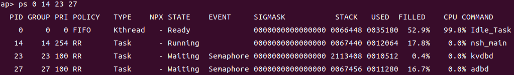
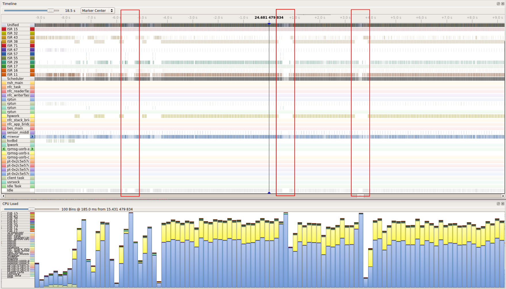

# Analyzing CPU Load with cpuload

\[ English | [简体中文](./../../../../zh-cn/debugging_tools/performance/analysis/cpuload.md) \]

In embedded systems development, analyzing CPU load is a critical step for identifying performance bottlenecks, optimizing task scheduling, and managing power consumption. This document details how to configure and use the `cpuload` feature in the openvela OS and how to perform in-depth performance analysis using advanced tools.

## I. cpuload Configuration Methods

openvela provides three different modes for CPU load statistics. Developers can choose the most suitable option based on precision requirements and available hardware resources.

### Method 1: System Clock-Based Sampling (Default)

This mode utilizes the system tick timer interrupt to sample the currently running task at each clock tick, thereby estimating CPU usage.

- **Principle**: Accumulates the execution time of the active task within the system clock's interrupt service routine.
- **Pros and Cons**:

    - **Pros**: Simplest to configure and has no dependency on extra hardware timers.
    - **Cons**: Statistical precision is limited by the system clock frequency and may fail to accurately capture short-running tasks.

- **Configuration Option**:

    ```Makefile
    CONFIG_SCHED_CPULOAD_SYSCLK=y
    ```

### Method 2: External High-Precision Timer-Based Sampling (Recommended)

This mode uses a separate hardware timer (External Timer) to sample tasks at a higher frequency, providing more accurate CPU load data than the system clock method.

- **Principle**: Configures a dedicated hardware timer to trigger interrupts at a frequency higher than the system clock, sampling the active task within the interrupt service routine.
- **Pros and Cons**:

    - **Pros**: Higher statistical precision, providing a more accurate reflection of a task's instantaneous CPU usage.
    - **Cons**: Requires an additional hardware timer and corresponding driver adaptation in the Board Support Package (BSP).

- **Configuration Option**:

    ```Makefile
    CONFIG_SCHED_CPULOAD_EXTCLK=y
    ```

### Method 3: High-Precision Calculation Based on Actual Task Execution Time (Recommended)

This mode, the most accurate of the three, uses the `SCHED_CRITMONITOR` module to precisely record the start and stop timestamps of each task to calculate its exact cumulative execution time.

- **Principle**: Leverages the Performance Monitor to log the precise moments of context switches, calculating CPU usage by accumulating the actual execution duration of each task.
- **Pros and Cons**:

    - **Pros**: Highest statistical precision, independent of sampling frequency, and truly reflects the CPU consumption of each task.
    - **Cons**: Introduces slight performance overhead due to the extra time-stamping required during context switches.

- **Configuration Options**:

    **Note**: Before using this mode, you must ensure that the Board Support Package (BSP) has correctly implemented the performance counter and that it has been initialized by calling the `up_perf_init()` function.

    ```Makefile
    CONFIG_SCHED_CRITMONITOR=y
    CONFIG_SCHED_CPULOAD_CRITMONITOR=y
    ```

## II. Viewing and Accessing CPU Load Data

Once any `cpuload` configuration is enabled, you can retrieve CPU load information in several ways.

### 1. Using the ps Command

在 shell 终端中执行 `ps` 命令，可以直接查看到每个线程 (thread) 的 CPU 占用率（`CPU` 列）。

Executing the `ps` command in the shell terminal directly displays the CPU usage (`CPU` column) for each thread.


If you only want to view information for specific threads, you can pass one or more thread IDs (PIDs) to the `ps` command.

```Bash
# Example: View information for threads with PIDs 14 and 23
ps 14 23
```



### 2. Accessing Through Programming Interfaces

#### Userspace

Applications can obtain CPU load data by reading virtual files in the `/proc` filesystem.

- **To get the total system load**: `/proc/cpuload`
- **To get the load of a specific thread**: `/proc/${pid}/cpuload`

#### Kernel Space

In kernel-space code, you can directly call the following API function to get CPU load information for a specific thread.

```C
#include <nuttx/clock.h>

int clock_cpuload(int pid, FAR struct cpuload_s *cpuload)
```

## III. Analysis with Advanced Tools

For scenarios requiring more detailed and visual performance analysis, the `ps` command may not be sufficient. In such cases, professional system analysis tools can be used.

### 1. Using SEGGER SystemView

SystemView is a powerful visual trace and diagnostics tool. Through a J-Link debugger, it can capture and display detailed openvela kernel scheduling events in real time, including context switches, interrupts, and API calls.

Compared to the `ps` command, SystemView provides higher time resolution and richer contextual information, enabling you to:

- Precisely measure the execution time of each thread's individual time slice.
- Visually observe interactions and preemption relationships between tasks.
- Analyze the overall system load within specific time frames.


