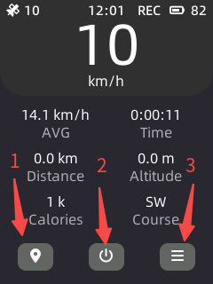
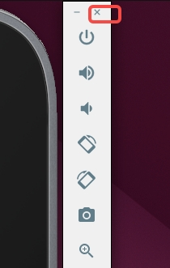

# Example of bike computer

\[ English | [简体中文](../../zh-cn/demo/X_Track_zh-cn.md) \]

## Introduction

“X-TRACK Demo” comes from the open source project [X-TRACK](https://github.com/FASTSHIFT/X-TRACK). Thanks to the original author of X-TRACK, FASTSHIFT, the migration is completed.

It’s a bike computer with features like speed display, distance statistics and real-time track display, with a display resolution of 240x320 pixels, using touch screen interaction.

The code directory is located at: “apps/packages/demos/x_track”

This article describes how to run the example on openvela Emulator.

## Prerequisites

1. Set up the development environment. Refer to [Environment Setup](./../quickstart/Set_up_the_development_environment.md).

2. Download the source code. Refer to [Download openvela source code](./../quickstart/Download_Vela_sources.md).

## Step 1: Configure the project

1. Switch to the root directory of openvela repository and run the following command to start compiling and configuring the project:

    ```Bash
    ./build.sh vendor/openvela/boards/vela/configs/goldfish-armeabi-v7a-ap menuconfig
    ```

2. Modify the following configurations in order.

    ```Bash
    LIB_PNG = y
    LV_USE_LIBPNG = y
    NETUTILS_CJSON = y
    UIKIT = y
    UIKIT_FONT_MANAGER = y
    LVX_USE_DEMO_X_TRACK = y
    ```

   > How to enable “LIB_PNG” configuration is shown as an example. Other configuration operations are the same.

   1. Press the “/” button on the keyboard to enter the search mode, type “LIB_PNG” in the search field, use the arrow keys to move the cursor to “LIB_PNG”, and press Enter to confirm.

        

   2. Press the “space bar” for the “Enable libpng” option to turn this option on, and a \* that appears in [ ] indicates that this configuration is turned on.

        

   3. The other configurations are turned on in the same way.

## Step 2: Start to compile

1. Run the following command to start compiling.

    ```Bash
    # Clean up build artifacts
    ./build.sh vendor/openvela/boards/vela/configs/goldfish-armeabi-v7a-ap distclean -j$(nproc)

    # Start to build
    ./build.sh vendor/openvela/boards/vela/configs/goldfish-armeabi-v7a-ap -j$(nproc)
    ```

2. After successful compilation, the following files are generated in the "nuttx" directory.

    ```Bash
    ./nuttx
    ├── vela_ap.elf
    ├── vela_ap.bin
    ```

## Step 3: Launch the emulator and push resources

1. Switch to the root directory of openvela repository and start the emulator:

    ```Bash
    ./emulator.sh vela
    ```

2. Push resources to the device by using emulator-supported ADB. Open a new terminal in the root directory of openvela repository, type “adb push” followed by the file path to transfer the resources to the appropriate location.

    ```Bash
    # Install adb
    sudo apt install android-tools-adb

    # Push resources
    adb push apps/packages/demos/x_track/resource/font /data
    adb push apps/packages/demos/x_track/resource/images /data
    adb push apps/packages/demos/x_track/resource/track /data
    ```

## Start 4: Start

### 1. Startup page

1. To enable the “X-TRACK” program, enter the following command in the emulator's terminal environment “openvela-ap”:
   ```Bash
   x_track &
   ```

2. This happens after execution:

    

### 2 Main interface



The three function buttons below are used for jumping to different function pages:

1. Motion tracking page

   The bottom left corner of this page shows the general information of the current movement. The middle part shows the current movement direction and the past trajectory. You can swipe right to return to the previous page.

    

2. Shutdown page

   This page mimics the shutdown page of a mobile phone. Hold and drag the yellow scroll bar up to the end and then release it to turn off the machine. Click somewhere or swipe right to return to the previous page.

    

3. System information page

   This page shows detailed system information. Swipe up or down or click the corresponding icons to see different information. Swipe right to return to the previous page.

    

## Step 5: Exit

Shut down the emulator to exit Demo, as shown below:



## FAQ

### 1. adb command not found

#### Reason

The "adb" tool is not installed.

#### Solution

Install “adb” and execute the following command:

```bash
sudo apt install android-tools-adb
```

### 2. Garbled text is shown

#### Reason
Font resources are not loaded correctly.

#### Solution

Follow [Step 3](#step-3-launch-the-emulator-and-push-resources) to push resources.

### 3. Why is there no map display?

#### Reason

Due to the copyright issues for commercial maps, maps can’t be provided. Only the track display function is available.

### 4. Why is it different from the original UI?

#### Reason

With significant adjustments to the code of the original version, this demo is somewhat different in respect of function and display.

### 5. Why does the battery level in the status bar at the top right corner keep jumping?

#### Reason

This is normal because the battery level on an emulator is just randomly simulated.

### 6. Is this trajectory simulated?

#### Reason
Yes. It accesses a [GPX](https://en.wikipedia.org/wiki/GPS_Exchange_Format) file for track replay and simulates GNSS to generate data.

### 7. How to replace the track file that shows my track?

#### Solution

Rename your track file (GPX format) as “TRK_EXAMPLE.gpx”, and push it to the “/data/Track” directory with the “adb” tool.
