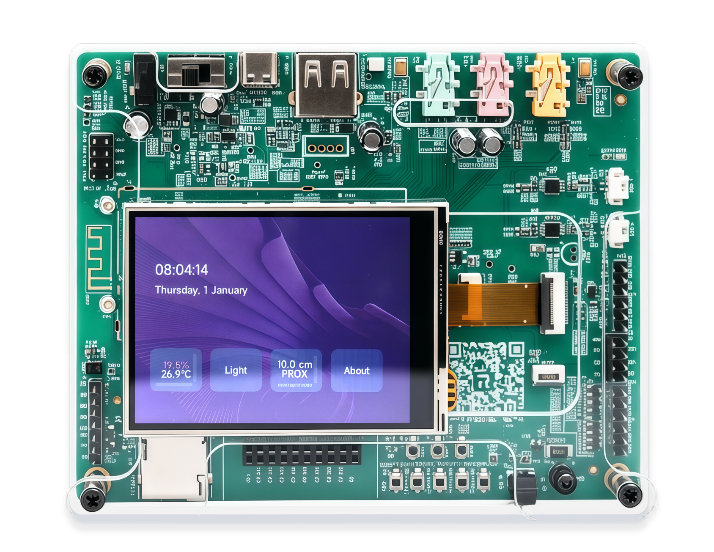
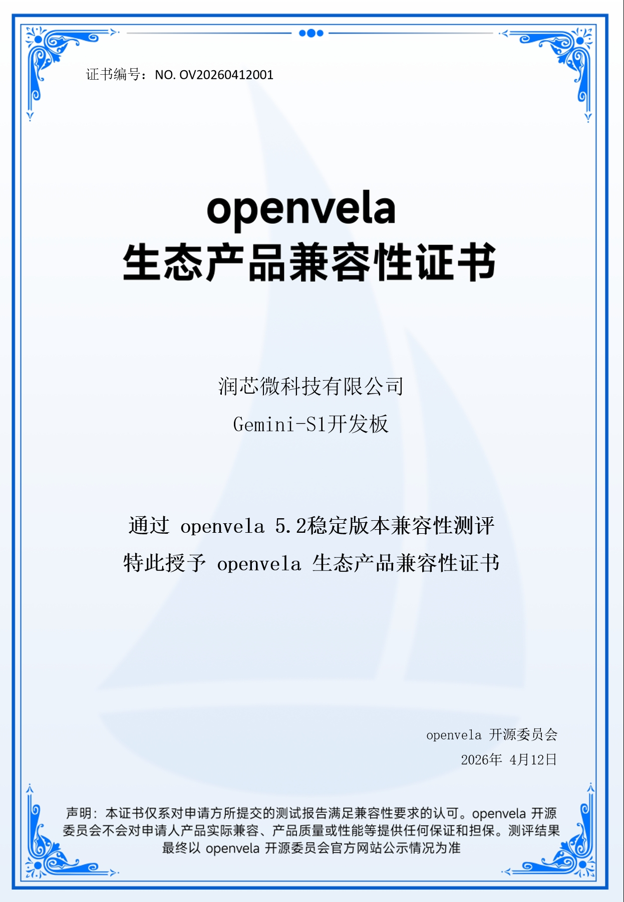

# openvela Compatibility-Certified Boards

[ English | [简体中文](../../zh-cn/dev_board/Certified_Board.md) ]

> This page lists the boards / products that have passed openvela official compatibility certification (XTS). For uncertified development board porting examples, see [openvela Development Board Examples](./Development_Board.md).

| Board                                                                                                    | Manufacturer | Chip Model                           | Certified Version | Porting Guide                                                                                                       | Certificate                                                                                                                                                                                                            |
| -------------------------------------------------------------------------------------------------------- | ------------ | ------------------------------------ | ----------------- | ------------------------------------------------------------------------------------------------------------------- | ---------------------------------------------------------------------------------------------------------------------------------------------------------------------------------------------------------------------- |
|  Gemini-S1 | Rivotek      | Allwinner R528 (dual-core Cortex-A7) | openvela 5.2      | [Board README](../../../../../vendor_allwinnertech/blob/dev-ai-contest-2026/boards/r528/r528s3-gemini-s1/README.md) |  No. OV20260412 |
