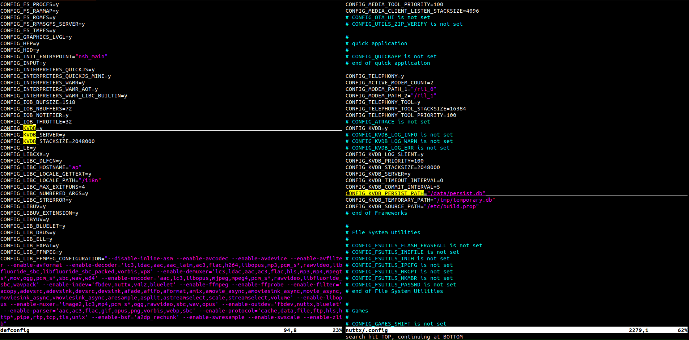
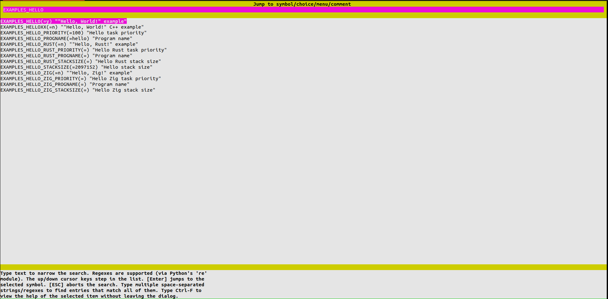
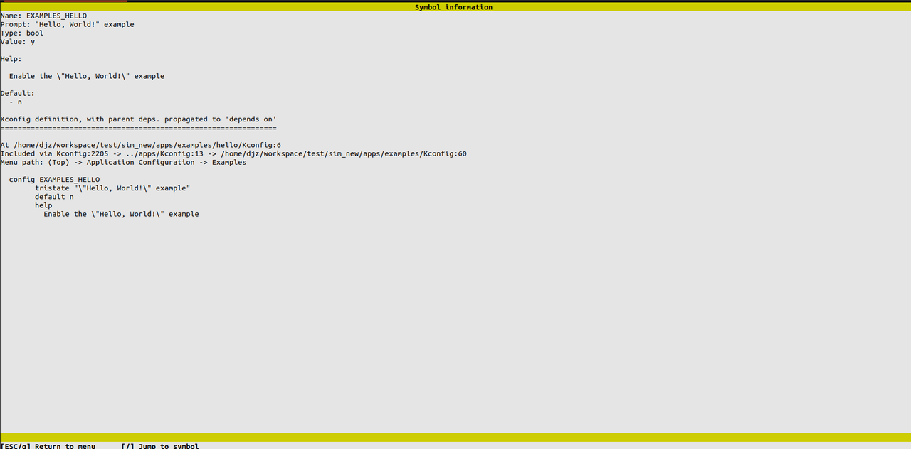
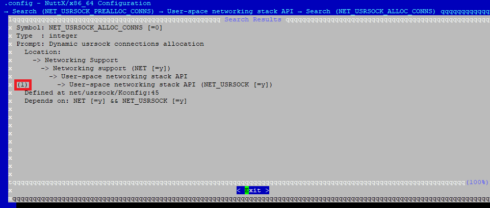
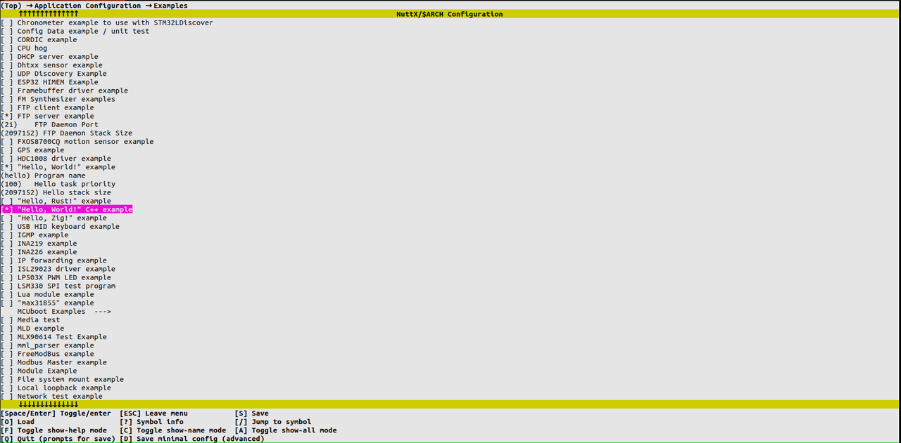

# Kconfig User Guide  

## 一、Overview  

`Kconfig` provides a mechanism for configuring projects during the build process and supports various types of configuration options, such as integers, strings, and Boolean values. Using `Kconfig` files, developers can define dependencies among options, default values, and how options are combined. For detailed information about the `Kconfig` language, see [Kconfig Documentation](https://www.kernel.org/doc/Documentation/kbuild/kconfig-language.txt).  

Similar to most large operating systems, openvela uses `Kconfig` to manage project configurations. Developers can use the visual interface provided by `menuconfig` to configure, build, and tailor the openvela system with ease.  

## 二、Usage Examples  

In project configuration, if you need to set a specific configuration option, follow these steps to check and configure it:  

1. **Check the configuration status.**  
   You can check the `.config` file to see if the configuration has already been set and whether its value meets expectations. If it does, you can use it directly. Otherwise, it is recommended to modify it using the `menuconfig` tool.  

2. **Example: Configure the KVDB storage path.**  
   Take the configuration of the database storage path `CONFIG_KVDB_PERSIST_PATH` for `KVDB` as an example:  

   - By default, the configuration option uses its default value, so it does not appear in the `defconfig` file.  
   - In the `.config` file, you can see its default value is `"/data/persist.db"`. If you need a different value, you can find and set the corresponding option using `menuconfig`.  
       

3. **Example: Enable the `FTL_WRITEBUFFER` configuration.**  
   To enable the `FTL_WRITEBUFFER` configuration, follow these steps:  

   1. Check the `.config` file to confirm whether the configuration exists. If it does not, it is recommended to enable it using `menuconfig`. **Do not** manually add `CONFIG_FTL_WRITEBUFFER=y` directly to the `defconfig` file, as this configuration depends on other options.  

        

   2. `CONFIG_FTL_WRITEBUFFER` depends on `CONFIG_DRVR_WRITEBUFFER`. If `CONFIG_DRVR_WRITEBUFFER` is not enabled simultaneously, manually modifying the `defconfig` file will not take effect.  

   3. Use `menuconfig` to automatically handle all dependencies and update the `defconfig` file. The updated configuration will appear as follows:  

      ```Plain  
      CONFIG_FTL_WRITEBUFFER=y  
      CONFIG_DRVR_WRITEBUFFER=y  
      ```  

> **Note**  
> Using the `menuconfig` tool ensures that all configuration dependencies are complete and correct.  

## 三、File Functions  

When openvela is built for the first time, it uses the specified `arch` and `board` parameters to locate the corresponding project’s `defconfig` as the system's initial configuration. Based on this file, the system expands and combines configurations to eventually generate the complete `.config` file. The generated `.config` file is then copied to `config.h`, providing support for conditional compilation and runtime usage in the code.  

#### 1、Detailed Description of Each File  

1. **`defconfig`**  
   - This file contains the minimal set of system configurations, used to specify the default basic settings. The system uses this file along with the dependencies between configuration options to generate the complete `.config` file.  
   - All options in the `defconfig` file are arranged in alphabetical order. It is recommended to use the `menuconfig` tool to add or delete configuration options. Directly editing the `defconfig` file may lead to redundant configurations or an inconsistent option order.  

2. **`.config`**  
   - The `.config` file is a complete configuration file generated from the `defconfig` file, containing all expanded and combined configuration options.  
   - `menuconfig` reads the local `.config` file and allows users to modify settings as needed. Once the configuration is adjusted, the tool automatically synchronizes the changes in `.config` back to the `defconfig` file.  

3. **`config.h`**  
   - The `config.h` file is generated from the `.config` file and contains all configuration details. This file provides support for conditional compilation and runtime behavior in the code.  

#### 2、Compilation Process Example  

The following is a typical compilation configuration process diagram:  

  

Use the following commands to complete the compilation process:  

```bash  
./build.sh vendor/sim/boards/openvela/config/openvela menuconfig  
./build.sh vendor/sim/boards/openvela/config/openvela -j8  
```

#### 3、File Path Examples  

In the openvela simulator environment, the typical paths for each file are as follows:  

- **`defconfig` file path**: `vendor/sim/boards/openvela/configs/openvela/defconfig`  
- **`.config` file path**: `nuttx/.config`  
- **`config.h` file path**: `nuttx/include/config.h`  

## Four: Usage Methods  

Below are some useful configuration and operation tips when using openvela:  

1. **Disabling a Kconfig feature**  

   Before disabling (disable) a Kconfig configuration feature, ensure it is not indirectly selected by other configuration options using the `select` keyword. If there is a dependency, the dependency needs to be resolved first.  

2. **Opening the visual configuration interface**  

   Open the visual configuration using the `menuconfig` tool as follows:  

   ```bash  
   ./build.sh vendor/sim/boards/openvela/configs/openvela menuconfig  
   ```

   

3. **Quickly search for configuration items**  

   In the `menuconfig` interface, press the `/` key followed by the configuration keyword to search. For example, searching for `EXAMPLES_HELLO`:  

   > **Note**  
   > If the search result shows `depends on`, press `?` to continue exploring the dependencies and enable them as required.  

     

4. **Navigate and select configuration items**  

   Use the arrow keys to move up and down, and press the `Enter` key to select the corresponding option.  
     

5. **View configuration details**  

   After selecting a configuration item, press `Shift` + `?` to view a detailed description of the configuration and its location in the file.  
     

6. **Select specific options**  

   Based on the configuration prompt, such as selecting the option number highlighted in red (e.g., “1”), navigate further into the sub-option menu.  
     

7. **Modify configuration values**  

   For a selected configuration item, set its value based on its type:  
   - **Integer (int):** Input a specific integer value.  
   - **Boolean (bool):** Toggle the state by pressing `y` (to enable) or using the spacebar.  
       
   - **String:** Directly type in a string as the configuration value.  

8. **Save changes or exit**  

   - Press the `ESC` key to exit the configuration interface, and press `y` to save modifications when prompted.  
   - To force an exit, use `Ctrl` + `C`. However, unsaved changes may be lost.  

## 五、Related Documentation  

The following links provide additional details about using Kconfig:  

- [Zephyr Project - Kconfig Tips](https://docs.zephyrproject.org/latest/build/kconfig/tips.html)  
- [Zephyr Project - Kconfig Extensions](https://docs.zephyrproject.org/latest/build/kconfig/extensions.html)  
- [Kernel Documentation - Kconfig Language](https://www.kernel.org/doc/html/latest/kbuild/kconfig-language.html)  
