# Makefile Build System  

\[ English | [简体中文](../../../zh-cn/device_dev_guide/build/Makefile_guide.md) \]

## I. Overview  

In the current version, **openvela** uses `Makefile` to organize the build process. The main entry point for the build process is located in the `nuttx/Makefile` file. Depending on the host platform, different core build files are executed:  

- For Windows platforms, `nuttx/tools/Win.mk` is executed.  
- For Unix-like platforms, `nuttx/tools/Unix.mk` is executed.  

The `nuttx/tools/` directory contains the necessary scripts and C programs required during the build process.  

### 1. Key Files and Configurations  

In addition to the core build files, the following key files and configurations are required to build **openvela**:  

1. Board-level macros and build options file.

    - Location: `nuttx/Make.defs`.  
    - Source: Copied from the template file located at `nuttx/board/${arch}/${chip}/${board}/${config}/scripts/Make.defs`.  

2. Conditional build configuration file.

    - Location: `configs/defconfig` in the root directory.  
    - Function: Copied as `.config` and serves as the base configuration file for **openvela**, supporting highly customizable and modular configurations.  
    - Implementation: Achieved via per-module `kernel Kconfig` files located in each module directory.  

### 2. Key Points in the Build Process  

1. Configuring the Host Build Environment.

    Use the `nuttx/tools/configure.sh` script to select the appropriate configuration for the build host.  

2. Key File Inclusions.
    In the `Make.defs` file, the following two critical files are included and passed to different stages of the `Makefile` process:  

    - `nuttx/.config`: The build configuration file.  
    - `nuttx/tools/Config.mk`: A file containing common macro definitions.  

3. File Generation and Invocation:

    - File Generation.

        - At various stages of the `Makefile` execution, the `Makefile`, `Make.defs`, and `Make.dep` files in the `nuttx/` and `apps/` directories and their subdirectories are either generated or invoked.  
        - `Make.dep`: Generated using the `tools/mkdep` tool during the build process. Internally, it utilizes the `gcc -M` command to create dependency statements in a format compliant with `Makefile` build targets.  

    - File Invocation.

        - `Makefile` files in subdirectories include the board-level macros configuration file `nuttx/Make.defs` at the top.  

By organizing the build system in this way, **openvela** achieves a flexible build process that supports multi-platform builds and highly modular configurations.  

## II. Build Dependency Tree  

The following section summarizes the build target dependency tree based on the **FlatMode sim:nsh** board configuration.  

  

### 1. Overview of the Dependency Tree  

The nodes in the dependency tree represent an overview of various targets in the build process. The specific commands executed for most targets are not shown in the diagram. Detailed execution instructions will be explained in the "Key Targets" section later.  

### 2. How the Dependency Tree is Resolved  

- Dependency Resolution: The `Makefile` resolves dependencies and begins execution from the build targets of child nodes.  

- Leaf Node Annotation: Dashed boxes in the dependency tree depict the actions executed as part of the `Makefile`’s leaf node targets.  

- Efficient Execution: This dependency tree structure enables the `Makefile` to efficiently parse and execute build targets, ensuring an orderly and modular compilation process.  

## III. Key Targets

### 1. `context` Target  

The `context` target is used to define the context environment of the build targets. It primarily achieves the following:  

- Generate essential configuration header files: `config.h` and `version.h`.  
- Execute `make context` within each build target to ensure the correctness of the lower-level build environment.  
- Create symbolic links (`ln`) for specific configuration directories, which are used to locate resources during subsequent `Makefile` execution.  

Makefile Example:

```Makefile
# context
#
# The context target is invoked on each target build to assure that NuttX is
# properly configured.  The basic configuration steps include creation of the
# the config.h and version.h header files in the include/nuttx directory and
# the establishment of symbolic links to configured directories.
```

```Makefile
## tools/Unix.mk: Core Makefile

%.context: include/nuttx/config.h .dirlinks
        $(Q) $(MAKE) -C $(patsubst %.context,%,$@) TOPDIR="$(TOPDIR)" context
        $(Q) touch $@
```

Special Case: `context` in the `apps` Directory

- In most directories, the `context` target does not perform any additional actions.  
- In the critical `apps` directory, the `context` target executes `register-all`. This target further invokes the `register` target in the configured `buildin` app directories.  
- During this process, `.bdat` and `.pdat` files are generated. These files are used to create the final header files for the `buildin` library.  

### 2. `tools/mkdep` Target  

The `tools/mkdep` target is a critical part of the build system and is used to generate dependency configurations for source files. It utilizes the `mkdeps` tool during the `depend` stage to automatically produce dependency files compliant with `Makefile` syntax.  

Functionality:

- The `mkdeps` tool is built from the source file `tools/mkdeps.c`.  
- It uses the `gcc -M` command to generate dependency information and outputs it in `Makefile` format.  
- `Make.dep` files for subdirectories are automatically created by the `mkdeps` tool during the `depend` target's execution and are later included in subsequent build steps.  

Makefile Example:

Below is the core `Makefile` configuration for `tools/mkdep`:  

```makefile  
## tools/Unix.mk Core Makefile File  

tools/mkdeps$(HOSTEXEEXT):  
        $(Q) $(MAKE) -C tools -f Makefile.host mkdeps$(HOSTEXEEXT)  
```

### 3. `pass2dep` Target  

The `pass2dep` target uses the `mkdep` tool to generate dependency files across all build directories. It traverses through the configured directories, invokes the `depend` target in each, and ensures all dependencies are correctly established.  

Functionality:

- The `pass2dep` target depends on the `context` and `tools/mkdeps` targets.  
- It iterates over all kernel dependency directories (`KERNDEPDIRS`) and invokes the `depend` target in each directory.  
- The generated dependency files are automatically incorporated into subsequent build processes.  

Makefile Example:

Below is the core `Makefile` configuration for `pass2dep`:  

```makefile  
## tools/Unix.mk Core Makefile File  
pass2dep: context tools/mkdeps$(HOSTEXEEXT) tools/cnvwindeps$(HOSTEXEEXT)  
        $(Q) for dir in $(KERNDEPDIRS) ; do \
                $(MAKE) -C $$dir EXTRAFLAGS="$(KDEFINE) $(EXTRAFLAGS)" depend || exit; \
        done
```

#### Dependency Generation Using `apps` as an Example  

In the `apps` directory, the `pass2dep` target generates dependency files and incorporates them into the build process.  

**Makefile Configuration in the `apps` Directory**

The following is the dependency generation logic in the `nuttx-apps/Makefile`:  

```Makefile
.depdirs: $(foreach SDIR, $(CONFIGURED_APPS), $(SDIR)_depend)

.depend: Makefile .depdirs
        $(Q) touch $@

depend: .depend
```

**Execute Within Configured Apps**

The dependency generation logic for each app is defined in the `Application.mk` file. Below is the specific Makefile configuration:  

```Makefile
## nuttx-apps/Application.mk, which is the Makefile executed for each app  

.depend: Makefile $(wildcard $(foreach SRC, $(SRCS), $(addsuffix /$(SRC), $(subst :, ,$(VPATH))))) $(DEPCONFIG)
        $(Q) $(MKDEP) $(DEPPATH) --obj-suffix .c$(SUFFIX)$(OBJEXT) "$(CC)" -- $(CFLAGS) -- $(filter %.c,$^) >Make.dep
        $(Q) $(MKDEP) $(DEPPATH) --obj-suffix .S$(SUFFIX)$(OBJEXT) "$(CC)" -- $(CFLAGS) -- $(filter %.S,$^) >>Make.dep
        $(Q) $(MKDEP) $(DEPPATH) --obj-suffix $(CXXEXT)$(SUFFIX)$(OBJEXT) "$(CXX)" -- $(CXXFLAGS) -- $(filter %$(CXXEXT),$^) >>Make.dep
        $(Q) touch $@

depend:: .depend
```

**Final Effect**

- The generated `Make.dep` file will be automatically included in the build process by `Application.mk`.  
- This process ensures that the dependencies of each app are accurate and correctly established.  

### 4. Generating and Using Static Libraries (`lib.a`)  

In the build system, static libraries (`lib.a`) are a core part of modular construction. Each module, such as `sched` or `apps`, generates a corresponding static library file, which is integrated into the executable during the final linking stage. The following provides a detailed description of the process for generating static libraries and their role in the build process.  

#### Generating Static Libraries: Using `sched` as an Example  

The static library for the `sched` module is generated based on the logic defined in the `Makefile` located in the `sched/` directory. Below are its main functionalities and configurations.  

**Functional Description**

- Assemble source files (`.S`) and C source files (`.c`) into object files (`.o`).  
- Package all object files into a static library file (`libsched.a`).  
- Simplify the build process by using generic build rules (such as `ASSEMBLE` and `COMPILE`).  

**Makefile Example**

The top-level file `tools/LibTargets.mk` defines the build targets and installation rules for the `sched` module:  

```Makefile
# tools/LibTargets.mk

sched$(DELIM)libsched$(LIBEXT): pass2dep
        $(Q) $(MAKE) -C sched libsched$(LIBEXT) EXTRAFLAGS="$(KDEFINE) $(EXTRAFLAGS)"

staging$(DELIM)libsched$(LIBEXT): sched$(DELIM)libsched$(LIBEXT)
        $(Q) $(call INSTALL_LIB,$<,$@)
```

In the `Makefile` file under the `sched/` directory, the logic for generating static libraries is defined:  

```makefile
## Makefile in the sched/ directory  

# Define object files  
AOBJS = $(ASRCS:.S=$(OBJEXT))  
COBJS = $(CSRCS:.c=$(OBJEXT))  

# Define source files and the final target  
SRCS = $(ASRCS) $(CSRCS)  
OBJS = $(AOBJS) $(COBJS)  
BIN = libsched$(LIBEXT)  

# Default target  
all: $(BIN)  

# Assembly file compilation rule  
$(AOBJS): %$(OBJEXT): %.S  
        $(call ASSEMBLE, $<, $@)  

# C file compilation rule  
$(COBJS): %$(OBJEXT): %.c  
        $(call COMPILE, $<, $@)  

# Static library generation rule  
$(BIN): $(OBJS)  
        $(call ARCHIVE, $@, $(OBJS))  
```

Key Points:  

1. Generation of Object Files:  

    - Assembly files (`.S`) are compiled into object files using the `ASSEMBLE` rule.  
    - C files (`.c`) are compiled into object files using the `COMPILE` rule.  

2. Static Library Packaging:  

    - All object files are packaged into a static library file (`libsched.a`) using the `ARCHIVE` rule.  

3. Modular Build:  

    - Each module generates its static library independently, facilitating subsequent linking and management.  

#### Static Library Generation: Using `apps` as an Example  

The static library generation logic for the `apps` module is defined in the `nuttx-apps/Makefile` file. Unlike `sched`, the `apps` module requires compiling each configured application separately and finally linking them into a unified static library (`libapps.a`).  

**Functional Description**

- Iterate through all configured application directories (`CONFIGURED_APPS`).  
- Execute the `archive` target in each application directory to generate the corresponding object files.  
- Link all object files into a single static library file (`libapps.a`).  

**Makefile Example**

The following static library generation rules are defined in the `nuttx-apps/Makefile` file:  

```Makefile
## nuttx-apps/Makefile

## BIN is the target libapps.a

$(BIN): $(foreach SDIR, $(CONFIGURED_APPS), $(SDIR)_all)
        $(Q) for app in ${CONFIGURED_APPS}; do \
                $(MAKE) -C "$${app}" archive ; \
        done
```

Key Points:  

1. Iterating Through Application Directories:  

    - Use `foreach` to iterate through all configured application directories (`CONFIGURED_APPS`).  
    - Each application directory is handled individually to ensure modular building.  

2. Independent Compilation:  

    - Execute the `archive` target in each application directory to generate the corresponding object files.  
    - Each application's object files are compiled separately, making it easier for subsequent unified packaging.  

3. Unified Packaging:  

    - Link all object files from the applications into a single static library file (`libapps.a`).  
    - The unified static library file facilitates subsequent linking and management.  

#### Compilation Rules for Application Directories  

In each application directory, the implementation logic for the `archive` target is defined in the `nuttx-apps/Application.mk` file. The following outlines its main functionality and configuration.  

**Makefile Example**

```makefile  
## nuttx-apps/Application.mk file, which serves as the Makefile executed for each app  

## The generation of each OBJ is handled by calling ELFCOMPILE  
OBJS = $(RAOBJS) $(CAOBJS) $(COBJS) $(CXXOBJS) $(RUSTOBJS) $(ZIGOBJS)  
all:: $(OBJS)  

archive:  
        $(call ARCHIVE_ADD, $(call CONVERT_  
        PATH,$(BIN)), $(OBJS))  
```

Key Points Analysis

1. Generation of Object Files:  

    - Source files in various languages (e.g., C, C++, Rust, Zig) are compiled into object files (`OBJS`).  
    - The generation of object files is automatically handled by the build system.  

2. Static Library Packaging:  

    - The `archive` target calls the `ARCHIVE_ADD` macro, which adds the object files to the static library.  

3. Macro Definition:  

    - The `ARCHIVE_ADD` macro is defined in the `Config.mk` file, with the following implementation:  

        ```makefile  
        ## Config.mk file  

        define ARCHIVE_ADD  
                $(ECHO_BEGIN)"AR (add): ${shell basename $(1)} "  
                $(Q) $(AR) \$1 \$2  
                $(ECHO_END)  
        endef  
        ```  

        This macro uses the `ar` tool to add object files to the static library and outputs build logs.

### 5. Generation of the `nuttx` Binary File  

In the build system, `${BIN}` is a placeholder for the final executable file `nuttx`. As the core output of the build process, `nuttx` includes the linking results of all modules. The following provides a detailed description of the `nuttx` generation process, including the linking rules for different architectures and the subsequent binary file creation.  

#### Build Process Overview  

After all leaf-node dependency targets (e.g., static libraries `lib`) are generated, the build system performs the final linking step to create the `nuttx` executable file. Using `flatbuild` as an example, the core command is as follows:  

```Makefile
## tools/Unix.mk Core Makefile File
$(Q) $(MAKE) -C $(ARCH_SRC) EXTRA_OBJS="$(EXTRA_OBJS)" LINKLIBS="$(LINKLIBS)" APPDIR="$(APPDIR)" EXTRAFLAGS="$(KDEFINE) $(EXTRAFLAGS)" $(BIN)
```

- `${ARCH_SRC}`: Depending on the CPU architecture, points to the `nuttx/arch/**/src` directory.  
- `${BIN}`: The final executable file `nuttx`.  

#### Linking Rules for Different Architectures  

**`sim` Architecture**

For the `sim` architecture, the linking rules are defined in the `arch/sim/src/Makefile` file. The main linking logic is as follows:  

```Makefile
## arch/sim/src Makefile  

nuttx$(EXEEXT): libarch$(LIBEXT) board/libboard$(LIBEXT) $(HEADOBJ) $(LINKOBJS) $(HOSTOBJS) nuttx-names.dat
        $(Q) echo "LD:  nuttx$(EXEEXT)"
        $(Q) $(LD) -r $(LDLINKFLAGS) $(RELPATHS) $(EXTRA_LIBPATHS) $(EXTRALINKCMDS) \
             -o nuttx.rel $(REQUIREDOBJS) $(LDSTARTGROUP) $(RELLIBS) $(EXTRA_LIBS) $(LDENDGROUP)
ifneq ($(CONFIG_HOST_MACOS),y)
        $(Q) $(OBJCOPY) --redefine-syms=nuttx-names.dat nuttx.rel
        $(Q) $(CC) $(CFLAGS) -Wl,-verbose 2>&1 | \
             sed -e '/====/,/====/!d;//d' -e 's/__executable_start/_stext/g' \
                 -e 's/^\(\s\+\)\(\.init_array\)/\1\2 : { }\n\1.sinit/g' \
                 -e 's/^\(\s\+\)\(\.fini_array\)/\1\2 : { }\n\1.einit/g' \
                 -e 's/__init_array_start/_sinit/g' -e 's/__init_array_end/_einit/g' \
                 -e 's/__fini_array_start/_sfini/g' -e 's/__fini_array_end/_efini/g' >nuttx.ld
        $(Q) echo "__init_array_start = .; __init_array_end = .; __fini_array_start = .; __fini_array_end = .;" >>nuttx.ld
endif
ifneq ($(CONFIG_ALLSYMS),y)
        $(if $(CONFIG_HAVE_CXX),\
        $(Q) "$(CXX)" $(CFLAGS) $(LDFLAGS) -o $(TOPDIR)/$@ $(HEADOBJ) nuttx.rel $(HOSTOBJS) $(STDLIBS),\
        $(Q) "$(CC)" $(CFLAGS) $(LDFLAGS) -o $(TOPDIR)/$@ $(HEADOBJ) nuttx.rel $(HOSTOBJS) $(STDLIBS))
else
        $(Q) # Link and generate default table
        $(Q) $(if $(wildcard $(shell echo $(NUTTX))),,$(call LINK_ALLSYMS, $@))
        $(Q) # Extract all symbols
        $(Q) $(call LINK_ALLSYMS, $^)
        $(Q) # Extract again since the table offset may changed
        $(Q) $(call LINK_ALLSYMS, $^)
endif
        $(Q) $(NM) $(TOPDIR)/$@ | \
                grep -v '\(compiled\)\|\(\.o$$\)\|\( [aUw] \)\|\(\.\.ng$$\)\|\(LASH[RL]DI\)' | \
                sort > $(TOPDIR)/System.map
```

Key Points

- Intermediate File Generation: Produces the `nuttx.rel` file as an intermediate result of the link process.  
- Symbol Table Processing: Uses `OBJCOPY` and `sed` to modify the symbol table, ensuring symbol names conform to requirements.  
- Final Linking: Depending on whether `CONFIG_ALLSYMS` is enabled, different linking processes are used.  
- Symbol Table File Generation: Uses the `nm` tool to generate the `System.map` file.  

**`arm` Architecture**

For the `arm` architecture, the linking rules are defined in the `arch/arm/src/Makefile` file. The main linking logic is as follows:  

```Makefile
## arch/arm/src Makefile File  

nuttx$(EXEEXT): $(HEAD_OBJ) board$(DELIM)libboard$(LIBEXT) $(addsuffix .tmp,$(ARCHSCRIPT))
        $(Q) echo "LD: nuttx"
ifneq ($(CONFIG_ALLSYMS),y)
        $(Q) $(LD) --entry=__start $(LDFLAGS) $(LIBPATHS) $(EXTRA_LIBPATHS) \
                -o $(NUTTX) $(HEAD_OBJ) $(EXTRA_OBJS) \
                $(LDSTARTGROUP) $(LDLIBS) $(EXTRA_LIBS) $(LDENDGROUP)
else
        $(Q) # Link and generate default table
        $(Q) $(if $(wildcard $(shell echo $(NUTTX))),,$(call LINK_ALLSYMS,$^))
        $(Q) # Extract all symbols
        $(Q) $(call LINK_ALLSYMS, $^)
        $(Q) # Extract again since the table offset may changed
        $(Q) $(call LINK_ALLSYMS, $^)
endif
ifneq ($(CONFIG_WINDOWS_NATIVE),y)
        $(Q) $(NM) $(NUTTX) | \
        grep -v '\(compiled\)\|\(\$(OBJEXT)$$\)\|\( [aUw] \)\|\(\.\.ng$$\)\|\(LASH[RL]DI\)' | \
        sort > $(TOPDIR)$(DELIM)System.map
endif
        $(Q) $(call DELFILE, $(addsuffix .tmp,$(ARCHSCRIPT)))
```

Key Points:  

- Entry Point Configuration: Use `--entry=__start` to specify the program entry point.  
- Symbol Table Generation: Generate the `System.map` file on non-Windows platforms.  
- Temporary File Cleanup: Delete intermediate `.tmp` files.  

#### Binary File Generation  

After creating the `nuttx` executable file, different binary formats (such as `.bin`, `.hex`, `.srec`, etc.) are generated based on requirements. The logic for generating these files is defined in the `tools/Unix.mk` file.  

```Makefile
## tools/Unix.mk Core Makefile File 

ifeq ($(CONFIG_INTELHEX_BINARY),y)
        @echo "CP: nuttx.hex"
        $(Q) $(OBJCOPY) $(OBJCOPYARGS) -O ihex $(BIN) nuttx.hex
        $(Q) echo nuttx.hex >> nuttx.manifest
endif
ifeq ($(CONFIG_MOTOROLA_SREC),y)
        @echo "CP: nuttx.srec"
        $(Q) $(OBJCOPY) $(OBJCOPYARGS) -O srec $(BIN) nuttx.srec
        $(Q) echo nuttx.srec >> nuttx.manifest
endif
ifeq ($(CONFIG_RAW_BINARY),y)
        @echo "CP: nuttx.bin"
        $(Q) $(OBJCOPY) $(OBJCOPYARGS) -O binary $(BIN) nuttx.bin
        $(Q) echo nuttx.bin >> nuttx.manifest
endif
ifeq ($(CONFIG_UBOOT_UIMAGE),y)
        @echo "MKIMAGE: uImage"
        $(Q) mkimage -A $(CONFIG_ARCH) -O linux -C none -T kernel -a $(CONFIG_UIMAGE_LOAD_ADDRESS) \
                -e $(CONFIG_UIMAGE_ENTRY_POINT) -n $(BIN) -d nuttx.bin uImage
        $(Q) if [ -w /tftpboot ] ; then \
                cp -f uImage /tftpboot/uImage; \
        fi
        $(Q) echo "uImage" >> nuttx.manifest
endif
        $(call POSTBUILD, $(TOPDIR))
```

Key Points:

- Multi-format support: Generate `.hex`, `.srec`, `.bin`, and `uImage` files based on configuration options.  
- U-Boot image generation: Use the `mkimage` tool to create the `uImage` file, with support for automatically copying it to the TFTP directory.  
- Post-build processing: Invoke the `POSTBUILD` hook to execute additional post-build processing tasks.  

At this point, the build process is complete.
