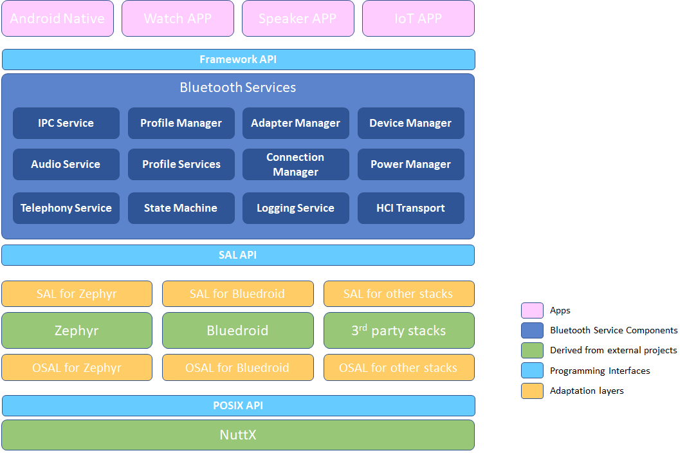
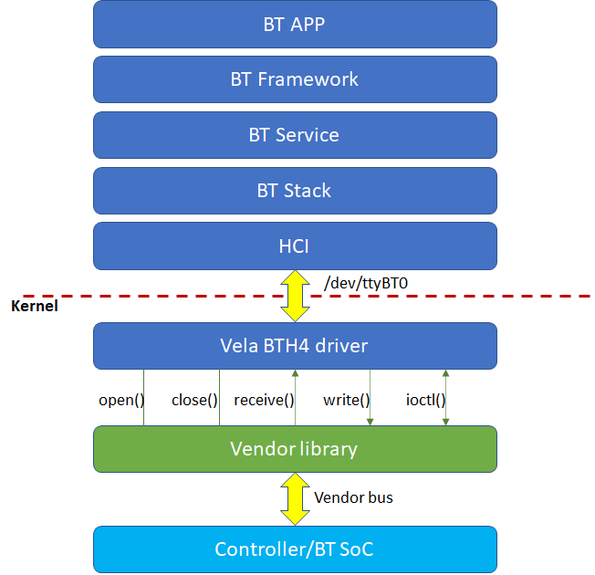

# Bluetooth Overview

\[ English | [简体中文](../../../../zh-cn/device_dev_guide/connection/bluetooth/Bluetooth_Overview.md) \]

## I. Introduction

openvela Bluetooth is certified for Bluetooth 5.4. Supported Bluetooth capabilities include:

- Core  
    - BR/EDR/BLE  
    - GAP  
    - L2CAP  
    - GATT Client/Server  
- A2DP SRC/SNK  
- AVRCP CT/TG  
- HFP AG/HF  
- PAN  
- SPP  
- HID  
- HOGP  
- LEA  
    - TMAP  
    - CAP  
    - BAP/ASCS/PACS/BASS  
    - CSIP/CSIS  
    - MCP/MCS  
    - CCP/TBS  
    - VCP/VCS  
- Mesh  

openvela Bluetooth also supports various open‑source and proprietary stacks, such as Zephyr, BlueZ, Bluedroid, Barrot, etc.

## II. Architecture Diagram



- The openvela Bluetooth Framework provides a unified programming API for `Android Native`, wearables, speakers, IoT, and other applications.  
- These APIs cover Bluetooth operations such as power on/off, scanning, connecting, and pairing, all implemented by a comprehensive set of Bluetooth service components.  
- To support multiple stacks, the Bluetooth Framework defines a unified Stack Abstraction Layer interface (`SAL API`), allowing third‑party stacks to integrate easily with openvela. When integrating a new stack, in addition to adapting the `SAL API`, you must also adapt NuttX’s `POSIX APIs` so that the stack runs efficiently on `NuttX`.

## III. Code Directory

After cloning the [frameworks_bluetooth](../../../../../../../frameworks_bluetooth/) repository, it maps to the `frameworks/connectivity/bluetooth` folder. The directory structure is as follows:

```bash
├── Android.bp                     * Android build configuration *
├── CMakeLists.txt                 * CMake build configuration *
├── feature                        * Directory: QuickApp Feature API *
│   ├── include
│   ├── jidl
│   └── src
├── framework                      * Directory: Bluetooth Framework API *
│   ├── api
│   ├── binder
│   ├── common
│   ├── dbus
│   ├── include                    ** Bluetooth Framework API declarations (for app use) **
│   └── socket
├── frameworkBluetooth.go          * Go file for Android build *
├── img                            * Image files used by README.md *
├── Kconfig                        * Build configuration description *
├── LICENSE                        * License file *
├── Make.defs                      * Adds Bluetooth Framework to NuttX *
├── Make.dep                       * Build dependencies *
├── Makefile                       * Build rules *
├── Makefile.host                  * Host build rules *
├── README.md                      * Repository documentation (English) *
├── README_zh-cn.md                * Repository documentation (Chinese) *
├── service                        * Directory: Bluetooth Services *
│   ├── common
│   ├── ipc
│   ├── profiles
│   ├── src
│   ├── stacks
│   ├── utils
│   ├── vendor
│   └── vhal
├── tests                          * Directory: sample test code *
└── tools                          * Directory: bttool utility code *
```

## IV. Development Guide

### 1. Bluetooth Application Development

Third‑party application developers can use the openvela QuickApp Feature, a set of C++ APIs built on the QuickJS engine, to access system Bluetooth capabilities. For more details, see [Bluetooth API](https://doc.quickapp.cn/features/system/bluetooth.html).

Additionally, the Bluetooth Framework provides NDK interfaces to access all Bluetooth system capabilities. Refer to the headers in `framework/include` for more information.

### 2. Bluetooth Driver Development

openvela Bluetooth supports multiple driver architectures. Below is an example using the common BTH4 driver architecture to implement and register a Bluetooth driver.

#### Implementing the Driver

Chip vendors implement a variable of type **struct bt_driver_s** and initialize the following member functions:

- `CODE int (*open)(FAR struct bt_driver_s *btdev)`
- `CODE int (*send)(FAR struct bt_driver_s *btdev, enum bt_buf_type_e type, FAR void *data, size_t len)`
- `CODE int (*ioctl)(FAR struct bt_driver_s *btdev, int cmd, unsigned long arg)`
- `CODE void (*close)(FAR struct bt_driver_s *btdev)`

These functions depend on the HCI transport between the Host and Controller.

#### Registering the Driver

After implementing the structure, register the driver instance via the API `bt_driver_register()`:

- `int bt_driver_register**(FAR struct bt_driver_s *drv)`

See the type definition in `nuttx/include/nuttx/wireless/bluetooth/bt_driver.h`. The call flow is shown below:



#### Note

Vendors do not need to define the `receive()` member; the BTH4 driver initializes it:

- `CODE int (*receive)(FAR struct bt_driver_s *btdev, enum bt_buf_type_e type, FAR void *data, size_t len)`

When HCI data arrives from the chip, simply call `bt_netdev_receive()`, which invokes `receive()` to enqueue the data.

## V. Related Repositories

- [frameworks_bluetooth](../../../../../../../frameworks_bluetooth): Provides rich Bluetooth application programming interfaces for developers, including API layers, service components, SAL abstraction, and HAL layers. The repo also includes tools like [bttool](../bluetooth/functionality_test/bttool_cmd.md) for testing Bluetooth features and sample API usage.  
- [external_zblue](../../../../../../../external_zblue): Based on Zephyr’s stack, enhanced by openvela.  
- [docs](../../../../../../../docs): Contains additional technical documentation for the Bluetooth module.
