<!-- title: How to Analyze Bluetooth Issues -->

<!-- omit from toc -->
# Table of Contents

\[ English | [简体中文](../../../../zh-cn/device_dev_guide/connection/bluetooth/how_to_analyze_bluetooth_issues.md) \]

- [Bluetooth Startup Issues](#bluetooth-startup-issues)
  - [Analysis Methods](#analysis-methods)
    - [Method: Check if the Bluetooth Service Thread Exists](#method-check-if-the-bluetooth-service-thread-exists)
    - [Method: Check syslog to Determine if the Bluetooth Service is Running](#method-check-syslog-to-determine-if-the-bluetooth-service-is-running)
    - [Method: Check if the Bluetooth Driver Node is Successfully Created](#method-check-if-the-bluetooth-driver-node-is-successfully-created)
        - [2. Analysis Method When `bluetoothd` Does Not Exist:](#2-analysis-method-when-bluetoothd-does-not-exist)
        - [3. Analysis Method When `bluetoothd` Exists:](#3-analysis-method-when-bluetoothd-exists)
    - [Method: Check if the Bluetooth Driver Node is Successfully Created](#method-check-if-the-bluetooth-driver-node-is-successfully-created-1)
  - [Typical Issues](#typical-issues)
    - [Issue: Failure to Create Bluetooth Instance](#issue-failure-to-create-bluetooth-instance)
        - [Special Scenario: APP Creates Instance When `bluetoothd` Is Not Initialized](#special-scenario-app-creates-instance-when-bluetoothd-is-not-initialized)
        - [Initial Judgment of Bluetooth Adapter State:](#initial-judgment-of-bluetooth-adapter-state)
        - [2. Handling After Confirming State Machine Abnormality:](#2-handling-after-confirming-state-machine-abnormality)
        - [3. Special Scenario: Bluetooth Driver Abnormality Causes Enable Failure:](#3-special-scenario-bluetooth-driver-abnormality-causes-enable-failure)
- [Discovery, Connection, and Pairing Issues](#discovery-connection-and-pairing-issues)
  - [Issue 1: CTKD BLE LTK Generating BR LinkKey Failure](#issue-1-ctkd-ble-ltk-generating-br-linkkey-failure)
    - [Step 1: Enable Protocol Stack Debug Function](#step-1-enable-protocol-stack-debug-function)
    - [Step 2: Reproduce the Issue](#step-2-reproduce-the-issue)
    - [Step 3: Log Interpretation](#step-3-log-interpretation)
  - [Issue 2: Analysis of Other BLE Pairing-Related Issues](#issue-2-analysis-of-other-ble-pairing-related-issues)
    - [BLE Pairing State Machine and Flowchart](#ble-pairing-state-machine-and-flowchart)
    - [Vela Device Using RPA Address for Pairing](#vela-device-using-rpa-address-for-pairing)
      - [Case 1: Device Establishes Connection via RPA Address Broadcast](#case-1-device-establishes-connection-via-rpa-address-broadcast)
      - [Case 2: Confirm BLE Pairing Completion](#case-2-confirm-ble-pairing-completion)
      - [Case 3: Confirm Successful IRK Exchange](#case-3-confirm-successful-irk-exchange)
      - [Case 4: Confirm Establishing a BR/EDR Connection via Identity Address](#case-4-confirm-establishing-a-bredr-connection-via-identity-address)
      - [Case 5: Reconnection After Disconnection/Reboot](#case-5-reconnection-after-disconnectionreboot)
    - [Vela Device Using Public Address for Pairing](#vela-device-using-public-address-for-pairing)
  - [Discovery and Connection Issue Analysis Methods](#discovery-and-connection-issue-analysis-methods)
    - [Method: Check if the Remote Device Has Not Enabled Connectable Mode](#method-check-if-the-remote-device-has-not-enabled-connectable-mode)
      - [1. Check Connection Success via Third-Party Device](#1-check-connection-success-via-third-party-device)
      - [2. Check Page Success via Air Interface Logs](#2-check-page-success-via-air-interface-logs)
      - [3. Check Page Success via Protocol Stack Syslog](#3-check-page-success-via-protocol-stack-syslog)
      - [4. Check Page Success via HCI Logs](#4-check-page-success-via-hci-logs)
    - [Method: Check if ACL Connection Times Out and Disconnects (Connection Timeout)](#method-check-if-acl-connection-times-out-and-disconnects-connection-timeout)
      - [1. Check Timeout Disconnection via Bluetooth Service Logs](#1-check-timeout-disconnection-via-bluetooth-service-logs)
      - [2. Check ACL Connection Timeout Disconnection via Air Interface Logs](#2-check-acl-connection-timeout-disconnection-via-air-interface-logs)
      - [3. Check Timeout Disconnection via Snoop Logs](#3-check-timeout-disconnection-via-snoop-logs)
    - [Method: Check if Binding Was Successful but No Profile Connection Exists, Leading to ACL Disconnection](#method-check-if-binding-was-successful-but-no-profile-connection-exists-leading-to-acl-disconnection)
      - [1. Check for Profile Connection in Bluetooth Service Logs](#1-check-for-profile-connection-in-bluetooth-service-logs)
      - [2. Check for Profile Connection in HCI Logs](#2-check-for-profile-connection-in-hci-logs)
      - [3. Check for Profile Connection in Air Interface Logs](#3-check-for-profile-connection-in-air-interface-logs)
    - [Method: Check if Local Pairing Information Is Invalid (Linkey Missing)](#method-check-if-local-pairing-information-is-invalid-linkey-missing)
      - [1. Check HCI Logs: Local Pairing Information on the Watch is Invalid, but the Phone Retains Previous Pairing Information](#1-check-hci-logs-local-pairing-information-on-the-watch-is-invalid-but-the-phone-retains-previous-pairing-information)
      - [2. Check Air Interface Logs: Local Pairing Information on the Watch is Invalid, but the Phone Retains Previous Pairing Information](#2-check-air-interface-logs-local-pairing-information-on-the-watch-is-invalid-but-the-phone-retains-previous-pairing-information)
      - [3. Check Protocol Stack Logs: Local Pairing Information on the Watch is Invalid, but the Phone Retains Previous Pairing Information](#3-check-protocol-stack-logs-local-pairing-information-on-the-watch-is-invalid-but-the-phone-retains-previous-pairing-information)
    - [Method: Check if Remote Pairing Information Is Invalid (Linkey Missing)](#method-check-if-remote-pairing-information-is-invalid-linkey-missing)
      - [1. Check HCI Logs: Phone Pairing Information is Invalid, but Local Pairing Information is Valid](#1-check-hci-logs-phone-pairing-information-is-invalid-but-local-pairing-information-is-valid)
      - [2. Check Air Interface Logs: Phone Pairing Information is Invalid, but Local Pairing Information is Valid](#2-check-air-interface-logs-phone-pairing-information-is-invalid-but-local-pairing-information-is-valid)
    - [Method: Check if Local Device is in Connectable Mode](#method-check-if-local-device-is-in-connectable-mode)
      - [1. Check Watch Entering Bluetooth Headset Connectable Mode](#1-check-watch-entering-bluetooth-headset-connectable-mode)
      - [2. Check miwear syslog: Watch Entering Connectable Mode](#2-check-miwear-syslog-watch-entering-connectable-mode)
      - [3. Check snoop logs, air logs, etc., to confirm the watch enters connectable mode](#3-check-snoop-logs-air-logs-etc-to-confirm-the-watch-enters-connectable-mode)
    - [Method: Check if Remote Device Initiates Reconnection](#method-check-if-remote-device-initiates-reconnection)
      - [1. Check Bluetooth Service syslog: Headset Initiates Reconnection](#1-check-bluetooth-service-syslog-headset-initiates-reconnection)
      - [2. Check snoop logs: Headset Initiates Reconnection](#2-check-snoop-logs-headset-initiates-reconnection)
      - [3. Check air interface logs: Headset Initiates Reconnection](#3-check-air-interface-logs-headset-initiates-reconnection)
    - [Method: Check if Local Device Receives ACL Connection Request](#method-check-if-local-device-receives-acl-connection-request)
      - [1. Check syslog: Whether the Local Bluetooth Application Receives an ACL Connection Request](#1-check-syslog-whether-the-local-bluetooth-application-receives-an-acl-connection-request)
    - [Method: Check if Local Device Accepts ACL Connection Request](#method-check-if-local-device-accepts-acl-connection-request)
      - [1. Check Bluetooth Service syslog: Whether the Local Bluetooth Application Accepts the ACL Connection Request](#1-check-bluetooth-service-syslog-whether-the-local-bluetooth-application-accepts-the-acl-connection-request)
      - [2. Check Remote Device snoop logs: Confirm Whether the Local Device Accepts the ACL Connection Request](#2-check-remote-device-snoop-logs-confirm-whether-the-local-device-accepts-the-acl-connection-request)
    - [Method: Check if Scanning Was Successfully Initiated](#method-check-if-scanning-was-successfully-initiated)
      - [1. Check Bluetooth syslog: Whether the Device Successfully Initiated Scanning](#1-check-bluetooth-syslog-whether-the-device-successfully-initiated-scanning)
      - [2. Check HCI Logs: Whether the HCI CMD Was Successfully Sent and Whether the HCI EVT Returned a Normal Status](#2-check-hci-logs-whether-the-hci-cmd-was-successfully-sent-and-whether-the-hci-evt-returned-a-normal-status)
    - [Method: Confirm the Remote Device Has the Corresponding SPP Service](#method-confirm-the-remote-device-has-the-corresponding-spp-service)
      - [1. Check Remote Device snoop logs: Confirm Whether the Remote Device Has the Corresponding SPP Service](#1-check-remote-device-snoop-logs-confirm-whether-the-remote-device-has-the-corresponding-spp-service)
    - [Method: Confirm SPP Connection Status and Disconnection Initiator](#method-confirm-spp-connection-status-and-disconnection-initiator)
      - [1. Check syslog: Confirm the Initiator of Disconnection](#1-check-syslog-confirm-the-initiator-of-disconnection)
      - [2. Check snoop logs to confirm the initiator of disconnection](#2-check-snoop-logs-to-confirm-the-initiator-of-disconnection)
      - [3. Check air logs to confirm the initiator of disconnection](#3-check-air-logs-to-confirm-the-initiator-of-disconnection)
  - [Typical Issues](#typical-issues-1)
    - [Issue: Classic Bluetooth Device Fails to Bind to Remote Device](#issue-classic-bluetooth-device-fails-to-bind-to-remote-device)
    - [Issue: Headphones Fail to Reconnect to Watch After Disconnection](#issue-headphones-fail-to-reconnect-to-watch-after-disconnection)
    - [Issue: Classic Bluetooth Device Is Not Successfully Connected by Remote Device](#issue-classic-bluetooth-device-is-not-successfully-connected-by-remote-device)
    - [Issue: Low-Power Bluetooth Fails to Scan Remote Device](#issue-low-power-bluetooth-fails-to-scan-remote-device)
- [Issue: SPP Active Connection Failure](#issue-spp-active-connection-failure)
- [Audio Transmission Issues](#audio-transmission-issues)
  - [Analysis Methods](#analysis-methods-1)
    - [Method: Check if the Transport Between Bluetooth and Media is Correctly Established](#method-check-if-the-transport-between-bluetooth-and-media-is-correctly-established)
    - [Method: Check if the AVDTP Signaling Connection is Established](#method-check-if-the-avdtp-signaling-connection-is-established)
      - [1. Check if the AVDTP Signaling Connection is Established via Snoop Logs, and Observe Possible Failure Reasons](#1-check-if-the-avdtp-signaling-connection-is-established-via-snoop-logs-and-observe-possible-failure-reasons)
    - [Method: Check if the AVDTP Media Connection is Established](#method-check-if-the-avdtp-media-connection-is-established)
      - [1. Check if the AVDTP Media Connection is Established via Snoop Logs, and Observe Possible Failure Reasons](#1-check-if-the-avdtp-media-connection-is-established-via-snoop-logs-and-observe-possible-failure-reasons)
        - [1.1 AVDTP Discovery](#11-avdtp-discovery)
        - [1.2 AVDTP Get Capabilities](#12-avdtp-get-capabilities)
        - [1.3 AVDTP Set Configuration](#13-avdtp-set-configuration)
        - [1.4 AVDTP Stream Establishment](#14-avdtp-stream-establishment)
        - [1.5 AVDTP Media Connection Success](#15-avdtp-media-connection-success)
      - [2. Check if the AVDTP Media Connection is Established via Syslog, and Observe Possible Failure Reasons](#2-check-if-the-avdtp-media-connection-is-established-via-syslog-and-observe-possible-failure-reasons)
    - [Method: Check if Media Has Successfully Configured the Codec](#method-check-if-media-has-successfully-configured-the-codec)
    - [Method: Check if A2DP SRC Has Started Playing Music](#method-check-if-a2dp-src-has-started-playing-music)
      - [1. Check if A2DP SRC Has Started Playing Music via Syslog](#1-check-if-a2dp-src-has-started-playing-music-via-syslog)
      - [2. Check if A2DP SRC Has Started Playing Music via Air Logs](#2-check-if-a2dp-src-has-started-playing-music-via-air-logs)
    - [Method: Check if A2DP SRC Has Stopped Transmitting Audio Packets](#method-check-if-a2dp-src-has-stopped-transmitting-audio-packets)
      - [1. Check if A2DP SRC Has Stopped Transmitting Audio Packets via Syslog](#1-check-if-a2dp-src-has-stopped-transmitting-audio-packets-via-syslog)
      - [1. Check if A2DP SRC Has Stopped Transmitting Audio Packets via Snoop Logs](#1-check-if-a2dp-src-has-stopped-transmitting-audio-packets-via-snoop-logs)
    - [Method: Check if the AVDTP Signaling Connection is Disconnected](#method-check-if-the-avdtp-signaling-connection-is-disconnected)
      - [1. Check if the AVDTP Signaling Connection is Disconnected via Syslog](#1-check-if-the-avdtp-signaling-connection-is-disconnected-via-syslog)
      - [2. Check if the AVDTP Signaling Connection is Disconnected via Snoop Logs, and Observe Possible Failure Reasons](#2-check-if-the-avdtp-signaling-connection-is-disconnected-via-snoop-logs-and-observe-possible-failure-reasons)
    - [Method: Check if the Audio Packet Sequence Number is Continuous](#method-check-if-the-audio-packet-sequence-number-is-continuous)
    - [Method: Check the Number of Audio Data Sample Points Sent in 1 Second in the Air Log](#method-check-the-number-of-audio-data-sample-points-sent-in-1-second-in-the-air-log)
    - [Method: Check for Audio Data Retransmission in the Air Log](#method-check-for-audio-data-retransmission-in-the-air-log)
  - [Typical Issues](#typical-issues-2)
    - [Issue: Headphones Connected but No Sound](#issue-headphones-connected-but-no-sound)
    - [Issue: Audio File Playback with Missing Header When Headphones are Connected](#issue-audio-file-playback-with-missing-header-when-headphones-are-connected)
    - [Issue: Pop Sound at the End of Voice Announcements](#issue-pop-sound-at-the-end-of-voice-announcements)
    - [Issue: Disconnection and No Sound When Connecting Two Pairs of Headphones](#issue-disconnection-and-no-sound-when-connecting-two-pairs-of-headphones)
- [Music Playback Control Issues](#music-playback-control-issues)
  - [Analysis Methods](#analysis-methods-2)
    - [Method: Check if the AVRCP Connection is Established](#method-check-if-the-avrcp-connection-is-established)
      - [1. Check if the AVRCP Connection is Established via Syslog](#1-check-if-the-avrcp-connection-is-established-via-syslog)
      - [2. Check if the AVRCP Connection is Established via Snoop Logs, and Observe Possible Failure Reasons](#2-check-if-the-avrcp-connection-is-established-via-snoop-logs-and-observe-possible-failure-reasons)
      - [3. Check if the AVRCP Connection is Established via Air Logs, and Observe Possible Failure Reasons](#3-check-if-the-avrcp-connection-is-established-via-air-logs-and-observe-possible-failure-reasons)
    - [Method: Check if the Device Supports AVRCP](#method-check-if-the-device-supports-avrcp)
      - [1. Check if the Local Device has Enabled AVRCP Services via Syslog](#1-check-if-the-local-device-has-enabled-avrcp-services-via-syslog)
      - [2. Check if Both Devices Support AVRCP via Snoop Logs or Air Logs](#2-check-if-both-devices-support-avrcp-via-snoop-logs-or-air-logs)
    - [Method: Check if Play or Pause Requests are Sent](#method-check-if-play-or-pause-requests-are-sent)
      - [1. Check if Play or Pause Requests are Sent via Syslog](#1-check-if-play-or-pause-requests-are-sent-via-syslog)
      - [2. Check if Play or Pause Requests are Sent via Snoop Logs or Air Logs](#2-check-if-play-or-pause-requests-are-sent-via-snoop-logs-or-air-logs)
    - [Method: Check if Notification is Registered](#method-check-if-notification-is-registered)
      - [1. Check if Notification is Registered via Syslog](#1-check-if-notification-is-registered-via-syslog)
      - [2. Check if Notification is Registered via Snoop Logs or Air Logs](#2-check-if-notification-is-registered-via-snoop-logs-or-air-logs)
    - [Method: Check if Playback Status is Correctly Reported](#method-check-if-playback-status-is-correctly-reported)
      - [1. Check if Playback Status is Correctly Reported via Syslog](#1-check-if-playback-status-is-correctly-reported-via-syslog)
      - [2. Check if Notification is Registered via Snoop Logs or Air Logs](#2-check-if-notification-is-registered-via-snoop-logs-or-air-logs-1)
    - [Method: Check if Playback Status Changes are Caused by Bluetooth](#method-check-if-playback-status-changes-are-caused-by-bluetooth)
    - [Method: Check if Absolute Volume is Used](#method-check-if-absolute-volume-is-used)
      - [1. Check if Absolute Volume is Supported via Syslog](#1-check-if-absolute-volume-is-supported-via-syslog)
      - [2. Check if Absolute Volume is Supported via Snoop Logs](#2-check-if-absolute-volume-is-supported-via-snoop-logs)
    - [Method: Check if the Music Source Device (Phone) has Set Absolute Volume](#method-check-if-the-music-source-device-phone-has-set-absolute-volume)
      - [1. Check if the Phone has Set Absolute Volume via Snoop Logs or Air Logs](#1-check-if-the-phone-has-set-absolute-volume-via-snoop-logs-or-air-logs)
    - [Method: Check if the Local Device has Set Absolute Volume](#method-check-if-the-local-device-has-set-absolute-volume)
      - [1. Check if the Local Device has Set Absolute Volume via Syslog](#1-check-if-the-local-device-has-set-absolute-volume-via-syslog)
    - [Method: Check if the Music Source Device (Phone) has Changed the Audio Amplitude](#method-check-if-the-music-source-device-phone-has-changed-the-audio-amplitude)
      - [1. Check if the Music Source Device (Phone) has Changed the Audio Amplitude via the Audio Source File](#1-check-if-the-music-source-device-phone-has-changed-the-audio-amplitude-via-the-audio-source-file)
      - [2. Check if the Music Source Device (Phone) has Changed the Audio Amplitude via Air Logs](#2-check-if-the-music-source-device-phone-has-changed-the-audio-amplitude-via-air-logs)
    - [Method: Check if AVRCP Configuration is Enabled](#method-check-if-avrcp-configuration-is-enabled)
    - [Method: Check if Volume Changes are Caused by Bluetooth](#method-check-if-volume-changes-are-caused-by-bluetooth)
    - [Method: Check if Volume Changes are Controlled by AVRCP or HFP](#method-check-if-volume-changes-are-controlled-by-avrcp-or-hfp)
      - [1. Check if Volume Changes are Controlled by AVRCP or HFP via Snoop Logs](#1-check-if-volume-changes-are-controlled-by-avrcp-or-hfp-via-snoop-logs)
  - [Typical Issues](#typical-issues-3)
    - [Issue: Unable to Control Play/Pause](#issue-unable-to-control-playpause)
    - [Issue: Unable to Be Controlled for Play/Pause](#issue-unable-to-be-controlled-for-playpause)
    - [Issue: Unexpected Play/Pause](#issue-unexpected-playpause)
    - [Issue: Unable to Adjust Volume via Music Source Device (Phone)](#issue-unable-to-adjust-volume-via-music-source-device-phone)
    - [Issue: Abnormal Volume Changes](#issue-abnormal-volume-changes)
- [Call Issues](#call-issues)
  - [Analysis Methods](#analysis-methods-3)
    - [Method: Check if the HFP Connection is Established](#method-check-if-the-hfp-connection-is-established)
      - [1. Check if the HFP Connection is Established via Syslog](#1-check-if-the-hfp-connection-is-established-via-syslog)
      - [2. Check if the HFP Connection is Established via Snoop Logs, and Observe Possible Failure Reasons](#2-check-if-the-hfp-connection-is-established-via-snoop-logs-and-observe-possible-failure-reasons)
    - [Method: Check if the Device Supports HFP](#method-check-if-the-device-supports-hfp)
      - [1. Check if the Device Supports HFP via Syslog](#1-check-if-the-device-supports-hfp-via-syslog)
      - [2. Check if Both Devices Support HFP via Snoop Logs or Air Logs](#2-check-if-both-devices-support-hfp-via-snoop-logs-or-air-logs)
    - [Method: Check if the SCO Connection is Established](#method-check-if-the-sco-connection-is-established)
      - [1. Check if the SCO Connection is Established via Syslog](#1-check-if-the-sco-connection-is-established-via-syslog)
    - [Method: Check if SCO Audio Parameters are Set for Media](#method-check-if-sco-audio-parameters-are-set-for-media)
    - [Check if the AG Received the HF's Answer Request](#check-if-the-ag-received-the-hfs-answer-request)
      - [1. Check if AG Received HF Answer Request via Syslog](#1-check-if-ag-received-hf-answer-request-via-syslog)
      - [2. Check if AG Received HF Answer Request via Snoop Logs](#2-check-if-ag-received-hf-answer-request-via-snoop-logs)
    - [Method: Check if the HF Received the AG's Incoming Call Notification](#method-check-if-the-hf-received-the-ags-incoming-call-notification)
      - [1. Check if HF Received AG Incoming Call Notification via Syslog](#1-check-if-hf-received-ag-incoming-call-notification-via-syslog)
    - [Method: Check if the HF Notified the Application of an Incoming Call from the AG](#method-check-if-the-hf-notified-the-application-of-an-incoming-call-from-the-ag)
      - [1. Check if HF Notified the Application of the AG's Incoming Call via Syslog](#1-check-if-hf-notified-the-application-of-the-ags-incoming-call-via-syslog)
- [Typical Issues](#typical-issues-4)
    - [Issue: AG Answers Call, but HF Has No Voice](#issue-ag-answers-call-but-hf-has-no-voice)
    - [Issue: HF Answers Call, but HF Has No Voice](#issue-hf-answers-call-but-hf-has-no-voice)
    - [Issue: As AG, Cannot Answer Calls Controlled by HF](#issue-as-ag-cannot-answer-calls-controlled-by-hf)
    - [Issue: As HF, AG Incoming Call, but HF Has No Incoming Call Display](#issue-as-hf-ag-incoming-call-but-hf-has-no-incoming-call-display)
- [Data Transmission Issues](#data-transmission-issues)
  - [Analysis Methods](#analysis-methods-4)
    - [Method: Check if the Client Device Initiated the Exchange\_MTU Procedure](#method-check-if-the-client-device-initiated-the-exchange_mtu-procedure)
      - [1. Check if the Client Device Initiated the Exchange\_MTU Procedure via Syslog](#1-check-if-the-client-device-initiated-the-exchange_mtu-procedure-via-syslog)
      - [2. Check if the Client Device Initiated the Exchange\_MTU Procedure via Snoop Log](#2-check-if-the-client-device-initiated-the-exchange_mtu-procedure-via-snoop-log)
    - [Method: Check if the Current Air Interface Environment is Complex](#method-check-if-the-current-air-interface-environment-is-complex)
      - [1. Check if the Current Air Interface Environment is Complex via Snoop Log](#1-check-if-the-current-air-interface-environment-is-complex-via-snoop-log)
  - [Typical Issues](#typical-issues-5)
    - [Issue: Low GATT Data Throughput](#issue-low-gatt-data-throughput)
- [Camera Control Issues](#camera-control-issues)
  - [Analysis Methods](#analysis-methods-5)
    - [Method: Check if the HID Channel Connection is Successful](#method-check-if-the-hid-channel-connection-is-successful)
      - [1. Check if the HID Channel Connection is Successful via Syslog](#1-check-if-the-hid-channel-connection-is-successful-via-syslog)
      - [2. Check if the HID Control L2CAP Channel is Connected via Airlog or Snoop Log](#2-check-if-the-hid-control-l2cap-channel-is-connected-via-airlog-or-snoop-log)
      - [3. Check if the HID Interrupt L2CAP Channel is Connected via Airlog or Snoop Log](#3-check-if-the-hid-interrupt-l2cap-channel-is-connected-via-airlog-or-snoop-log)
    - [Method: Check if the HID Channel is Disconnected by the Watch or Phone](#method-check-if-the-hid-channel-is-disconnected-by-the-watch-or-phone)
      - [1. Check if the Remote Party Disconnected the HID Control or Interrupt L2CAP Channel via Airlog or Snoop Log](#1-check-if-the-remote-party-disconnected-the-hid-control-or-interrupt-l2cap-channel-via-airlog-or-snoop-log)
    - [Method: Check if the Number of Paired Bluetooth Devices on the Phone Exceeds 7](#method-check-if-the-number-of-paired-bluetooth-devices-on-the-phone-exceeds-7)
  - [Typical Issues](#typical-issues-6)
    - [Issue: Watch Cannot Control Phone Camera](#issue-watch-cannot-control-phone-camera)

---

# Bluetooth Startup Issues

<a id="bluetooth-startup-issue-analysis-methods"></a>

## Analysis Methods

<a id="method-check-if-the-bluetooth-service-thread-exists"></a>

### Method: Check if the Bluetooth Service Thread Exists

Use the `ps` command to check if the Bluetooth service thread exists. Normal output information will show a thread named `bluetoothd`.

```text
  PID GROUP PRI POLICY   TYPE    NPX STATE    EVENT     SIGMASK             STACK    USED FILLED COMMAND
    0     0   0 FIFO     Kthread   - Ready              0000000000000000  0001968 0000824  41.8%  Idle_Task
    1     0 192 RR       Kthread   - Waiting  Semaphore 0000000000000000  0003968 0000480  12.0%  hpwork 0x4020f954 0x4020f978
    2     0 100 RR       Kthread   - Waiting  Semaphore 0000000000000000  0003968 0000752  18.9%  lpwork 0x4020f91c 0x4020f940
    4     0 100 RR       Kthread   - Ready              0000000000000000  0003968 0000496  12.5%  goldfish_gpu_fb_thread 0x4024c930
    5     0 100 RR       Kthread   - Waiting  Semaphore 0000000000000000  0003968 0000864  21.7%  goldfish_gnss_thread 0x406d4b30
    6     0 100 RR       Kthread   - Waiting  Semaphore 0000000000000000  0003968 0000904  22.7%  goldfish_sensor_thread 0x402e20a0
    7     7 100 RR       Task      - Running            0000000000000000   0003992 0002048  51.3%  nsh_main
    9     9 100 RR       Task      - Waiting  Semaphore 0000000000000000  0004000 0003096  77.4%  kvdbd
   10    10 100 RR       Task      - Waiting  Semaphore 0000000000000000  0004000 0002192  54.8%  adbd
   11    11 103 RR       Task      - Waiting  Semaphore 0000000000000000  0008088 0003340  41.2%  bluetoothd
   12    12 100 RR       Task      - Waiting  Semaphore 0000000000020000  0004000 0001232  30.8%  telnetd
   13    11 110 FIFO     pthread   - Waiting  Semaphore 0000000000000000  0004016 0000600  14.9%  sysworkq 0x71ffa5 0x40700350
```

<a id="method-check-syslog-to-determine-if-the-bluetooth-service-is-running"></a>

### Method: Check syslog to Determine if the Bluetooth Service is Running

Check the Bluetooth service syslog to verify if the Bluetooth service has started. The standard startup log is as follows:

```text
[    0.054300] [11] [  INFO] [ap] bluetoothd main 34
[    0.074000] [11] [  INFO] [ap] /data/misc/bt folder create: 0
[    0.084300] [11] [ ALERT] [ap] Framework log level: 7, Stack:0, mask:00000000, Snoop: 0
[    0.084800] [11] [ DEBUG] [ap] [195][storage]: bt_storage_init successed
[    0.085100] [11] [ DEBUG] [ap] [129][service_manager]: A2DP-Sink service register success
[    0.085300] [11] [ DEBUG] [ap] [129][service_manager]: AVRCP-CT service register success
[    0.085800] [11] [ DEBUG] [ap] [201][adapter-stm]: Enter, PrevState=(null) ---> NewState=Off
[    0.087400] [11] [  INFO] [ap] [32][stack_manager]: Stack Info: Zblue Ver:5.4 Sal:2
[    0.088100] [11] [  INFO] [ap] <inf> [h4_init] <406>: Bluetooth H4 driver
[    0.088600] [11] [ DEBUG] [ap] [45][stack_manager]: stack_manager_init done
[    0.088700] [11] [ DEBUG] [ap] [257][bt_service]: bt_service_init done
[    0.089100] [11] [ DEBUG] [ap] [260][service_loop]: service loop running now !!!
[    0.089300] [11] [ DEBUG] [ap] [134][service_loop]: service_schedule_loop:0x40288958, async:0x4024d1b4
[    0.090100] [11] [ DEBUG] [ap] [81][service_loop]: set_ready
```
<a id="method-check-if-the-bluetooth-driver-node-is-successfully-created"></a>

### Method: Check if the Bluetooth Driver Node is Successfully Created

Use the `ps` command to view the process list and confirm whether the `bluetoothd` process exists.

- **If it does not exist**: Proceed to **"Analysis Method When `bluetoothd` Does Not Exist"**.
- **If it exists**: Proceed to **"Analysis Method When `bluetoothd` Exists"**.

##### 2. Analysis Method When `bluetoothd` Does Not Exist:

**Key Log Check:**

  **Possible Causes:**

  - **Framework Initialization Failure**:

    ```c
    [service_manager]: A2DP-Src service register success
    [storage]: bt_storage_init successed
    [audio_transport]: audio_transport_open path{4}[sco_ctrl] success
    ```

    Check the logs for abnormalities in the above modules.
  - **Stack Initialization Failure**:

    ```c
    [stack_manager]: stack_manager_init done
    ```

    Confirm whether the stack has been successfully initialized.
  - **HCI Driver Read Channel Establishment Failure**:

    ```c
    [bluelet]: hci_add_recv
    ```

    Check whether the HCI driver read channel has been successfully established.
  - **libuv Service Loop Exception**:

    ```c
    [bt_service]: bt_service_init done
    [service_loop]: service loop running now !!!
    ```

    Confirm whether the `service_loop` has been successfully initialized.

##### 3. Analysis Method When `bluetoothd` Exists:

**Possible Causes:**

  - **Socket Establishment Failure**: For cross-core applications (APP and `bluetoothd` are not on the same core), prioritize checking **Rpmsg channel issues**, refer to system documentation: *Rpmsg HCI* and *Rpmsg Socket*.
  - **APP Not Configured with Loop Environment**: Ensure the APP uses `uv_loop` or `thread while (1)` type loop. Refer to *How to Develop a Bluetooth Application*.

### Method: Check if the Bluetooth Driver Node is Successfully Created

  ```c
  [72][h4]: bt_sal_hci_transport_init: g_tlfd = 16
  ```

  - If `fd = -1`: Bluetooth driver failed to open, refer to the *Bluetooth Driver Open Failure Analysis* chapter.
  - If `fd > 0`: Driver is successful, but `bluetoothd` initialization failed, further analysis is needed:

Use the `ls /dev` command to check if the Bluetooth driver node has been successfully created. Normal output information will show a Bluetooth driver node named `ttyHCI0`.

```text
openvela-ap> ls /dev
/dev:
 audio/
 binder
 ...... 
 ttyHCI0
 ...... 
 uorb/
 ...... 
 ```

<a id="method-typical-issues-for-bluetooth-startup"></a>

## Typical Issues

### Issue: Failure to Create Bluetooth Instance

##### Special Scenario: APP Creates Instance When `bluetoothd` Is Not Initialized

**Issue Manifestation:**
The APP fails to create an instance after `bluetoothd` initialization times out (default 1 second).

**Localization Method:**
Trace the Bluetooth initialization process to locate the timeout position.

**Sample Log:**

```c
[03-10 20:23:11.549][03/09 17:29:15] [15] [cp] [270][BT]: [VelaBT], bt_log_server_init 270
[03-10 20:23:15.852][03/09 17:29:19] [19] [cp] [BT] bts_adapter_init: create bt instance failed
[03-10 20:23:17.027][03/09 17:29:20] [15] [cp] [278][BT]: [VelaBT], bt_log_server_init 278
```

**Resolution Recommendation:**
Check the system logs during `bluetoothd` initialization to identify the timeout cause (internal delay or external event interference).

##### Initial Judgment of Bluetooth Adapter State:

**Key Logs:**

```c
[ap] on_adapter_state_changed_cb: state = 1. ...
[ap] on_adapter_state_changed_cb: state = 2...
```

| State Value | Meaning                   |
| ----------- | ------------------------- |
| `0`         | Bluetooth is Off          |
| `1`         | Enabling BLE Function     |
| `2`         | BLE Function Enabled      |
| `3`         | Enabling BR/EDR Function  |
| `4`         | BR/EDR Function Enabled   |
| `5`         | Disabling BR/EDR Function |
| `6`         | Disabling BLE Function    |

**Alternative Method to Obtain State:**
Use the `state` subcommand of `bttool` to actively query the adapter state.

##### 2. Handling After Confirming State Machine Abnormality:

- **Attempt to Restart or Re-enable**:
  Execute `bttool disable` followed by `enable`, and observe if the issue reproduces.
- **If the Issue Persists**:
  Enable stack logs for analysis:
  ```c
  bttool> log enable stack
  bttool> log mask 1 2
  bttool> q
  ```

##### 3. Special Scenario: Bluetooth Driver Abnormality Causes Enable Failure:

**Information to Capture:**

- **Bluetooth State Machine Value**: Confirm the current state (e.g., `state=1` or `state=3`).
- **Lower-Level Bluetooth Driver Logs**: Confirm if the driver layer is functioning normally.
- **Stack Logs**: Follow the steps above to enable and provide key timeline logs.

**Sample Logs:**

```c
[48] [ap] on_adapter_state_changed_cb: state = 1.
[48] [ap] on_adapter_state_changed_cb: state = 2.
[48] [ap] on_adapter_state_changed_cb: state = 3.
[48] [ap] on_adapter_state_changed_cb: state = 4.
```

**Notes:**
If the issue remains unresolved, submit the stack logs and key timeline information to the Vela Bluetooth team.

**Summary:**

* [Method: Check if the Bluetooth Service Thread Exists](#method-check-if-the-bluetooth-service-thread-exists)
  * If the Bluetooth service thread exists, provide the complete system startup syslog to the Vela BT team for support.
  * Otherwise, proceed with further troubleshooting as follows.

* [Method: Check syslog to Determine if the Bluetooth Service Framework is Running](#method-check-syslog-to-determine-if-the-bluetooth-service-is-running)
  * If the Bluetooth service startup log is not found, confirm whether the current system defconfig is configured with `CONFIG_BLUETOOTH_SERVER` and whether `bluetoothd &` is configured in Rcs.
  * If the startup process encounters a folder creation failure `folder create fail`, seek system technical support.
  * If the startup process encounters H4 driver abnormalities, check whether the driver node exists as follows.

* [Method: Check if the Bluetooth Driver Node is Successfully Created](#method-check-if-the-bluetooth-driver-node-is-successfully-created)
  * If the driver node does not exist, refer to *How to Add a Bluetooth Driver* to resolve the issue.
  * Otherwise, provide the complete system startup syslog to the Vela BT team for support.

# Discovery, Connection, and Pairing Issues

This section introduces methods for analyzing issues that may arise during BLE discovery, connection, and pairing processes.

<a id="discovery-connection-and-pairing-analysis-methods"></a>

## Issue 1: CTKD BLE LTK Generating BR LinkKey Failure

**Note:**

* The vela CTKD process is completed on the Host side, and capturing OTA/HCI logs can confirm whether the BLE pairing process is normal.
* In-depth analysis of CTKD issues requires coordination with vela stack logs.

### Step 1: Enable Protocol Stack Debug Function

```c
log enable stack
logmask 1 2 7
```

For specific mask definitions, refer to the *bttool Usage Documentation* - *log Subcommand*.

> If you need to enable other protocol stack debug logs in addition to masks 1 and 2, please contact vela Bluetooth developers to enable the corresponding macro configurations and recompile the protocol stack static library.

### Step 2: Reproduce the Issue

Reproduce the issue according to the specific scenario and record relevant logs.

### Step 3: Log Interpretation

* Perform a global search for keywords `SMP` or `CTKD` in the logs.
* If the log shows `CTKD LE2BR OFF [LESC disabled]`, it means the CTKD function from BLE to BR direction is disabled because LESC is not enabled.
* If the log shows `[BR2LE OFF] [Disabled]`, it indicates that the CTKD function from LinkKey to LTK direction is disabled by the APP.

- Perform a global search for keywords `SMP` or `CTKD` in the captured logs.
- If the log shows `CTKD LE2BR OFF [LESC disabled]`, it means the CTKD function from BLE to BR direction has been disabled, the reason being that the LESC feature is not enabled;
- If the log shows `[BR2LE OFF] [Disabled]`, it indicates that the CTKD function from LinkKey to LTK direction has been disabled by the APP.


**How to Confirm Whether the Current LinkKey Was Generated by CTKD?**

In the following log example, `state:2` and `ctkd:1` indicate that the device has been bonded and that CTKD was used to generate the LinkKey:

```text
[ap] [bt] bind_manager_bond_state_change_handler: [D4:68:AA:16:xx:xx] state:2 ctkd:1
[ap] [bt] bind_manager_send_event: ----> State[START] Event[12:EVENT_BT_CTKD_BONDED_SUCCESS]
```

---

## Issue 2: Analysis of Other BLE Pairing-Related Issues

Observe the BLE pairing process through air interface logs to see if it meets expectations.

### BLE Pairing State Machine and Flowchart

- BLE Pairing State Machine:

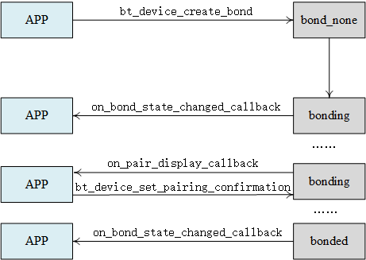

- BLE Pairing Flowchart:

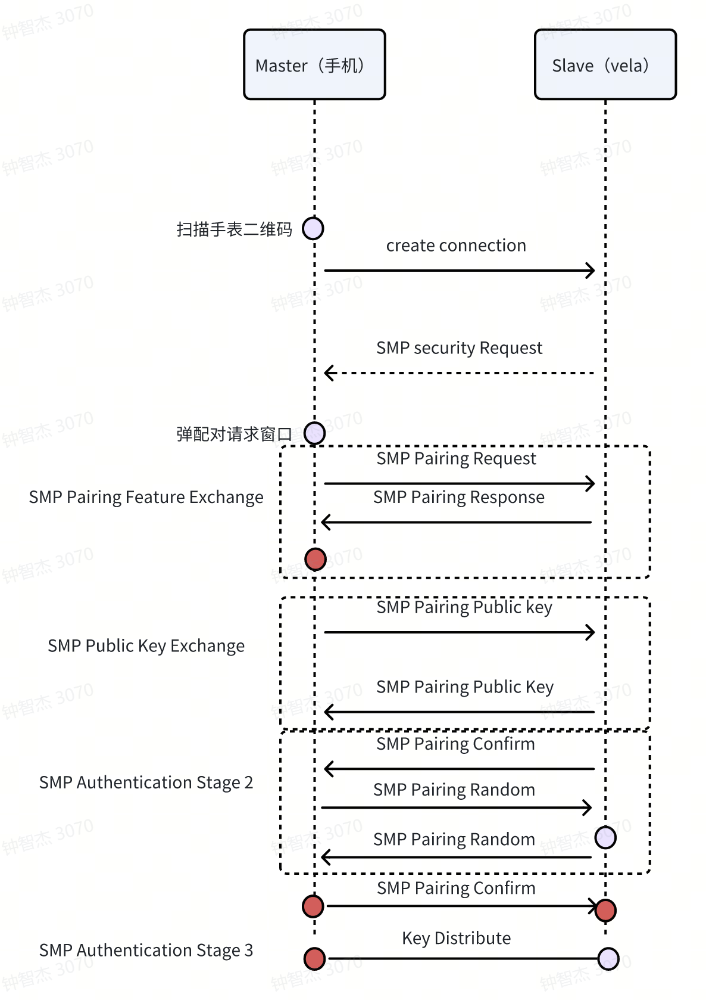

### Vela Device Using RPA Address for Pairing

#### Case 1: Device Establishes Connection via RPA Address Broadcast

- Filter only the RPA addresses of the watch and iPhone in the Ellisys air interface logs:

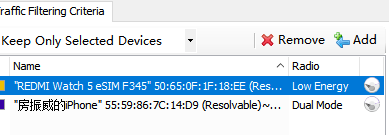

- The watch sends a Connectable broadcast via RPA address:


- The iPhone sends a Scan Request, the watch replies with a Scan Response, and then the iPhone sends a Connection Indication Packet to complete the connection:

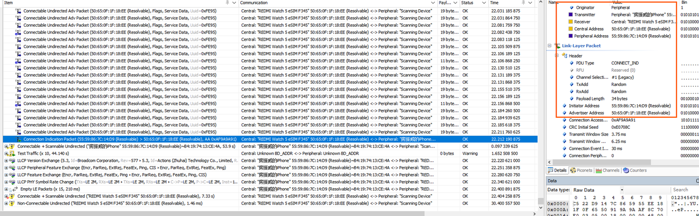

#### Case 2: Confirm BLE Pairing Completion

- The SMP pairing process is successfully completed, both parties support LESC, the IdKey is distributed normally, and the LinkKey flag is set to 1:

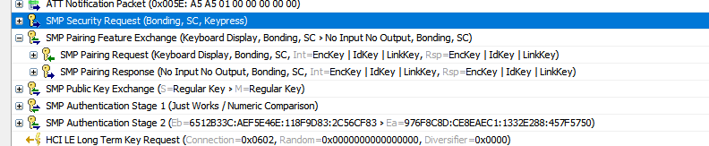

#### Case 3: Confirm Successful IRK Exchange

- After the IRK is successfully exchanged, it is stored in the Resolving List:

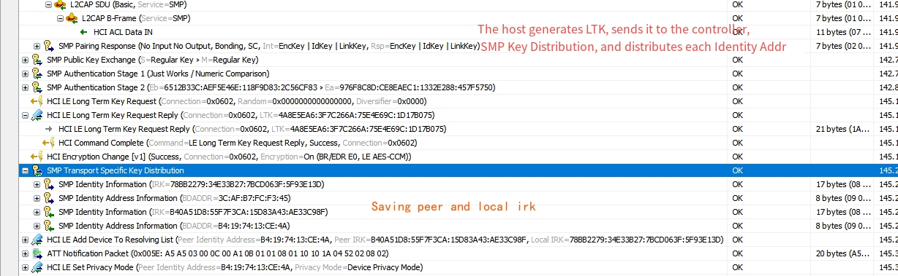

#### Case 4: Confirm Establishing a BR/EDR Connection via Identity Address

- The Controller actively requests the LinkKey from the Host, and after verification, no BR/EDR pairing is required again:


- Further confirm the success of the LinkKey verification from the air interface logs:


#### Case 5: Reconnection After Disconnection/Reboot

Device information reference:

| Device Name             | Address                        | Mode       | Description        |
| ----------------------- | ------------------------------ | ---------- | ------------------ |
| REDMI Watch 5 eSIM F345 | 46:E3:3F:E2:8D:2E (Resolvable) | Low Energy | REDMI Watch 5 eSIM |
| REDMI Watch 5 eSIM F345 | 3C:AF:B7:FC:F3:45              | Dual Mode  | REDMI Watch 5 eSIM |
| xxx's iPhone            | B4:19:74:13:CE:4A              | Dual Mode  | xxx's iPhone       |
| xxx's iPhone            | 6B:FC:EE:54:F0:9E (Resolvable) | Dual Mode  | xxx's iPhone       |

- After device reboot, the Resolving List needs to be updated to the Controller to re-establish the connection:


- Normal disconnection and reconnection scenario:


### Vela Device Using Public Address for Pairing

- When pairing with a Public address, no IRK is generated or distributed, and there is no IdKey bit:


- BR/EDR LinkKey is normally generated:


## Discovery and Connection Issue Analysis Methods

<a id="method-check-if-the-remote-device-has-not-enabled-connectable-mode"></a>

### Method: Check if the Remote Device Has Not Enabled Connectable Mode

Typically, you can observe whether the remote device is in connectable mode through third-party devices, air interface logs, protocol stack syslog, snoop logs, etc.

#### 1. Check Connection Success via Third-Party Device

Use a third-party device to initiate the bonding process in the Bluetooth settings interface and observe whether it can successfully bond with the remote device, thereby eliminating the possibility that the remote device is not in connectable mode.

#### 2. Check Page Success via Air Interface Logs

Observe the air interface logs to check if the remote device responds to the Page process ID packet. The standard spec process is as follows:


According to the spec process, after the link layer Page ID packet is sent, if the remote device does not respond with an ID, it indicates that the remote device is not in connectable mode, as shown in the following air interface log:

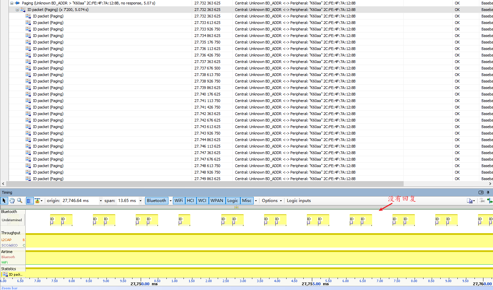

#### 3. Check Page Success via Protocol Stack Syslog

Observe the protocol stack syslog to check for PageTimeout errors, corresponding to error code 04.

```text
[08/09 19:26:38.620200] [28] [ap] ---->[HCI][CMDN][P:1,$:1][-Create_Connection][status:PAGE TIMEOUT | 04]
[08/09 19:26:38.621300] [28] [ap]      [Connection_Complete][T:0x200ed280]
[08/09 19:26:38.622400] [28] [ap] GAP_IND_CONNECTION_EVENT: <addr: 28:02:2e:82:b9:22.0><type: 2><status: 0><error: 4>
```

#### 4. Check Page Success via HCI Logs

As shown below, observe the HCI logs to see if the Create Connection corresponding HCI Connection Complete event indicates a Page timeout, which means the remote device is not in connectable mode.


<a id="method-check-if-acl-connection-times-out-and-disconnects"></a>

### Method: Check if ACL Connection Times Out and Disconnects (Connection Timeout)

Typically, you can observe whether the remote device abnormally times out and disconnects through Bluetooth service logs, air interface protocol flows, protocol stack syslog flows, snoop logs, etc.

#### 1. Check Timeout Disconnection via Bluetooth Service Logs

As shown below, you can observe the log event CONNECTION_STATE_DISCONNECTED from btservice, where error code 08 indicates a connection timeout disconnection error.

```text
[2024-12-31 20:04:31] [06/04 03:10:58.173500] [26] [ap] [660][adapter-svc]: ACL connection state changed, addr:28:02:2E:82:B9:22, link:0, state:CONNECTION_STATE_DISCONNECTED, status:0, reason:8
```

#### 2. Check ACL Connection Timeout Disconnection via Air Interface Logs

As shown below, you can observe from the air interface logs that the connection packets are retried multiple times until eventually timing out and disconnecting.


#### 3. Check Timeout Disconnection via Snoop Logs

As shown below, observe the snoop logs for the Bluetooth disconnection event HCI Disconnect Complete, corresponding to reason connection timeout.

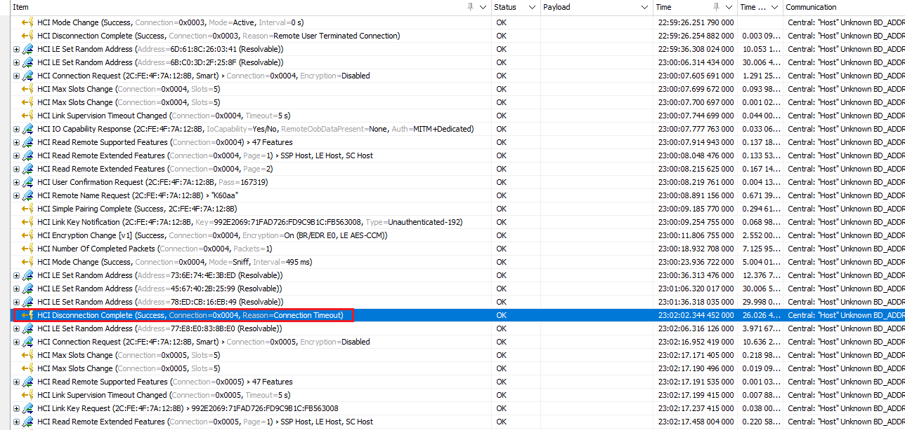

<a id="method-check-if-binding-was-successful-but-no-profile-connection-exists-leading-to-acl-disconnection"></a>

### Method: Check if Binding Was Successful but No Profile Connection Exists, Leading to ACL Disconnection

Typically, you can observe whether there is a Profile connection between both parties through Bluetooth service logs, air interface protocol flows, protocol stack syslog flows, snoop logs, etc., which may cause the connection to disconnect.

#### 1. Check for Profile Connection in Bluetooth Service Logs

Observe the local btservice logs; after successful device binding, if there is no A2DP, SPP, etc., Profile connection, the ACL connection will disconnect after a period of time. As shown below, from the btservice logs, the ACL connection is established successfully, and after SDP completion, there is no other Profile connection, and the disconnection error code reason:19 indicates that the remote party actively disconnected.


#### 2. Check for Profile Connection in HCI Logs

As shown below, from the HCI logs, after the ACL connection is successful, the SDP service discovery is completed, and no other Profile is connected, and the device eventually disconnects with Remote User Terminated Connection (the figure shows the remote party actively disconnecting, but it is also possible that the local stack actively disconnected).

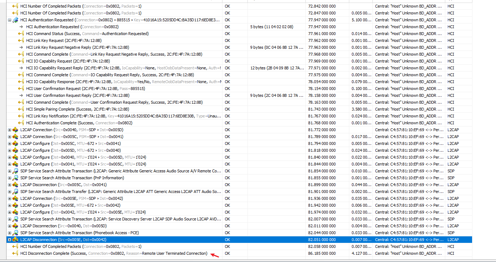

#### 3. Check for Profile Connection in Air Interface Logs

As shown below, from the air interface logs, after the ACL connection is successful, the SDP service discovery is completed, and no other Profile is connected, and the device eventually detaches (the figure shows the remote party actively disconnecting, but it is also possible that the local stack actively disconnected).


<a id="method-check-if-local-pairing-information-is-invalid"></a>

### Method: Check if Local Pairing Information Is Invalid (Linkey Missing)

#### 1. Check HCI Logs: Local Pairing Information on the Watch is Invalid, but the Phone Retains Previous Pairing Information

As shown below, the HCI logs show that the local linkkey is empty. When initiating pairing, the Host responds with a Negative Reply, then restarts the pairing process, and ultimately, during the Simple Pairing Complete phase, it indicates Authentication Fail and disconnects.


#### 2. Check Air Interface Logs: Local Pairing Information on the Watch is Invalid, but the Phone Retains Previous Pairing Information

As shown below, from the air interface logs, the local pairing information on the watch is invalid, but the phone retains previous pairing information, prompting DH Key Check failure.


#### 3. Check Protocol Stack Logs: Local Pairing Information on the Watch is Invalid, but the Phone Retains Previous Pairing Information

As shown below, observe the protocol stack logs. The local pairing information on the watch is invalid, but the phone retains previous pairing information. From the HCI logs of the protocol stack, during Authentication_Complete, it receives PIN OR KEY MISSING, ultimately resulting in pairing failure.

```text
[ 1103.523193] [13] [cp]    ->[L2CAP,PSM:3][Out][Request:][RequestNum:0]
[ 1103.526428] [13] [cp] ---->[HCISEC][Go][Link_Bondable][Link_Bonded][Node_Encrypt]
[ 1103.526916] [13] [cp]    ->[Link:P256,LinkKey,Bonded,Bondable[key_type:Unauthenticated Combination Key generated from P256 | 07]
[ 1103.527282] [13] [cp]    ->[SSP_Enable][SC_Enable][SSP:OK][LinkKey_Good]
[ 1103.527526] [13] [cp]    ->[Local_Bondable:General]
[ 1103.528625] [13] [cp] ---->[HCI][CMDN][P:0,$:2][+Authentication_Requested]
[ 1103.532348] [13] [cp] ---->[HCI][*Send][AID:0,PLen:2][Authentication_Requested]
[ 1103.532653] [13] [cp]    ->[connection_handle:0129 | 81,00]
[ 1103.537719] [13] [cp] 
------>FSM Func Start<------
[ 1103.538024] [13] [cp] ---->[HCI][*Recv][AID:0,PLen:4][Command_Status]
[ 1103.538269] [13] [cp]    ->[status:OK | 00]
[ 1103.538574] [13] [cp]    ->[num_hci_command_packets:05 | 05]
[ 1103.538818] [13] [cp]    ->[command_opcode:Authentication_Requested]
[ 1103.542419] [13] [cp] 
------>FSM Func Start<------
[ 1103.542785] [13] [cp] ---->[HCI][*Recv][AID:0,PLen:6][Link_Key_Request]
[ 1103.543029] [13] [cp]    ->[bd:3c,13,5a,d5,a3,f6]
[ 1103.544311] [13] [cp] ---->[HCI][CMDN][P:1,$:2][+Link_Key_Request_Reply]
[ 1103.550903] [13] [cp] ---->[HCI][*Send][AID:0,PLen:22][Link_Key_Request_Reply]
[ 1103.551330] [13] [cp]    ->[bd:3c,13,5a,d5,a3,f6]
[ 1103.551635] [13] [cp]    ->[link_key:22,04,a4,2b,af,19,c3,ac,bc,02,f5,63,19,46,59,8d]
[ 1103.557250] [13] [cp] 
------>FSM Func Start<------
[ 1103.557617] [13] [cp] ---->[HCI][*Recv][AID:0,PLen:10][Command_Complete]
[ 1103.557861] [13] [cp]    ->[num_hci_command_packets:05 | 05]
[ 1103.558166] [13] [cp]    ->[command_opcode:Link_Key_Request_Reply]
[ 1103.558410] [13] [cp]    ->[status:OK | 00]
[ 1103.558654] [13] [cp]    ->[bd:3c,13,5a,d5,a3,f6]
[ 1103.560180] [13] [cp] ---->[HCI][CMDN][P:2,$:2][-Link_Key_Request_Reply][status:OK | 00]
[ 1103.560607] [13] [cp]    ->[COMMAND_COMPLETE][T:0x205658c0]
[ 1103.579223] [13] [cp] 
------>FSM Func Start<------
[ 1103.579528] [13] [cp] ---->[HCI][*Recv][AID:0,PLen:3][Authentication_Complete]
[ 1103.579833] [13] [cp]    ->[status:PIN OR KEY MISSING | 06]
[ 1103.580078] [13] [cp]    ->[connection_handle:0129 | 81,00]
[ 1103.581848] [13] [cp] ---->[HCI][CMDN][P:1,$:2][-Authentication_Requested][status:PIN OR KEY MISSING | 06]
[ 1103.582275] [13] [cp]    ->[Authentication_Complete][T:0x205680e0]
[ 1103.583557] [13] [cp] ---->[HCISEC][ResultEv][Failed:0x6][Ev:Authenticate]
------>FSM Func Start<------
[ 1104.618957] [13] [cp] ---->[HCI][Link][ACL][IdleExpire]
[ 1104.619201] [13] [cp]    ->[Local:[Identity:82,77,16,b2,4e,7b,Pub]]
[ 1104.619506] [13] [cp]    ->[Remote:[BREDR][Identity:3c,13,5a,d5,a3,f6,Pub][LELink:3c,13,5a,d5,a3,f6,Pub]]
[ 1104.619934] [13] [cp]    ->[HDL:0x81][Sending:0][Recv:N:0][Initiator][Connection_Completed][Master][Ref:0][READY_OK][LinkMode:Active]
[ 1104.621215] [13] [cp] ---->[HCI][CMDN][P:0,$:2][+Disconnect]
[ 1104.625915] [13] [cp] ---->[HCI][*Send][AID:0,PLen:3][Disconnect]
[ 1104.626281] [13] [cp]    ->[connection_handle:0129 | 81,00]
[ 1104.626586] [13] [cp]    ->[reason:REMOTE USER TERMINATED CONNECTION | 13]
```

<a id="method-check-if-remote-pairing-information-is-invalid"></a>

### Method: Check if Remote Pairing Information Is Invalid (Linkey Missing)

#### 1. Check HCI Logs: Phone Pairing Information is Invalid, but Local Pairing Information is Valid

As shown below, the snoop logs show that during the local bonding process, the hci Authentication completed event is reported with the corresponding reason being PIN Or Key Missing.


#### 2. Check Air Interface Logs: Phone Pairing Information is Invalid, but Local Pairing Information is Valid

As shown below, from the air logs, during the LMP Authentication process, it prompts LMP Not Accepted, with the reason being PIN Or Key Missing.


<a id="method-check-if-local-device-is-in-connectable-mode"></a>

### Method: Check if Local Device is in Connectable Mode

#### 1. Check Watch Entering Bluetooth Headset Connectable Mode

As shown below, enter the Bluetooth headset search and connection page to put the watch into connectable mode.


#### 2. Check miwear syslog: Watch Entering Connectable Mode

As shown below, observe the miwear syslog to confirm that the watch's scan mode enters CONNECTABLE mode.

```text
[42] [ap] [bt] bind_manager_set_visibility: scan mode: [CONNECTABLE DISCOVERABLE]
```

#### 3. Check snoop logs, air logs, etc., to confirm the watch enters connectable mode

Refer to the above [Check if the Remote Device Has Not Enabled Connectable Mode](#method-check-if-the-remote-device-has-not-enabled-connectable-mode) to confirm that the watch's scan mode enters CONNECTABLE mode.

<a id="method-check-if-remote-device-initiates-reconnection"></a>

### Method: Check if Remote Device Initiates Reconnection

#### 1. Check Bluetooth Service syslog: Headset Initiates Reconnection

As shown below, through the Bluetooth service syslog, observe whether the remote device initiates a reconnection request.

```text
[27] [ap] [723][adapter-svc]: ACL connection state changed, addr:XX:XX:XX:XX:2E:43, link:1, state:CONNECTION_STATE_CONNECTING, status:0, reason:0
[27] [ap] [723][adapter-svc]: ACL connection state changed, addr:XX:XX:XX:XX:2E:43, link:1, state:CONNECTION_STATE_CONNECTING, status:0, reason:0
[27] [ap] [688][adapter-svc]: ACL Connect Request from :XX:XX:XX:XX:2E:43
```

#### 2. Check snoop logs: Headset Initiates Reconnection

As shown below, the snoop logs show the headset initiating a reconnection, which is ultimately successful.

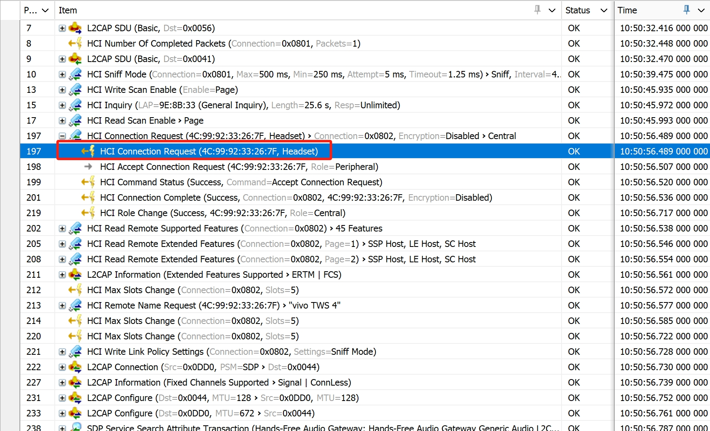

#### 3. Check air interface logs: Headset Initiates Reconnection

As shown below, the air interface logs show the phone initiating a reconnection, which is ultimately successful.

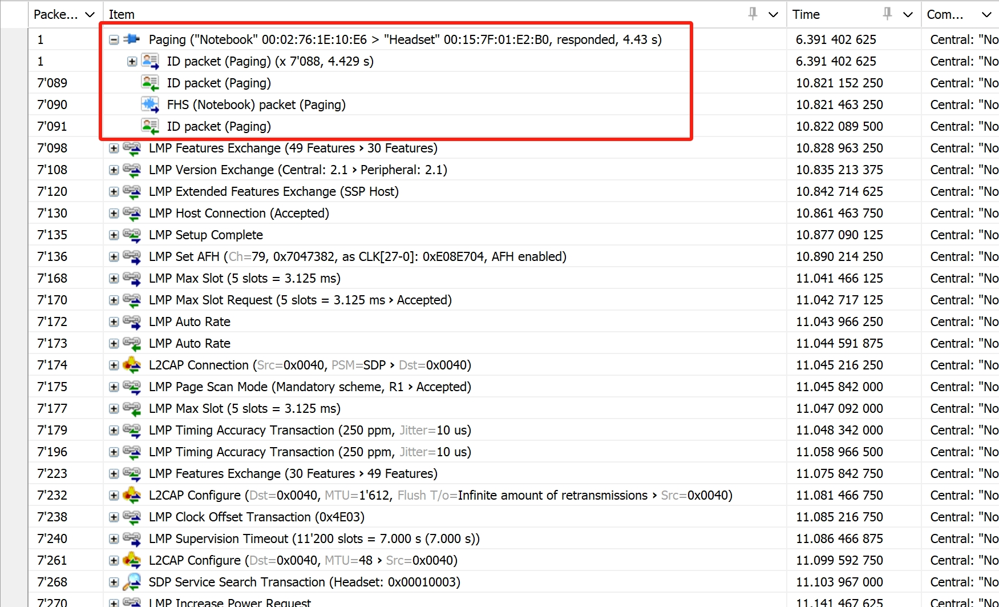

<a id="method-check-if-local-device-receives-acl-connection-request"></a>

### Method: Check if Local Device Receives ACL Connection Request

#### 1. Check syslog: Whether the Local Bluetooth Application Receives an ACL Connection Request

Both the Bluetooth service and the Bluetooth application can receive ACL connection requests, with logs as follows.

```text
[15] [cp] [723][adapter-svc]: ACL connection state changed, addr:XX:XX:XX:XX:2E:43, link:1, state:CONNECTION_STATE_CONNECTING, status:0, reason:0
[15] [cp] [688][adapter-svc]: ACL Connect Request from :XX:XX:XX:XX:2E:43
[19] [cp] [BT] gap_connection_state_changed_callback: --->Device [XX:XX:XX:XX:2E:43][BREDR] State: CONNECTING
```

When the application does not receive an ACL connection request, it cannot respond, and the following ACL connection failure logs can be observed, with Error Code 16, indicating Connection Accept Timeout Exceeded.

```text
[19] [cp] [109][bluelet]: sal_status_translate maybe hcierror code: 16
[14] [cp] [723][adapter-svc]: ACL connection state changed, addr:A4:E2:87:D7:2E:18, link:1, state:CONNECTION_STATE_DISCONNECTED, status:47, reason:0
```

<a id="method-check-if-local-device-accepts-acl-connection-request"></a>

### Method: Check if Local Device Accepts ACL Connection Request

#### 1. Check Bluetooth Service syslog: Whether the Local Bluetooth Application Accepts the ACL Connection Request

If the application does not accept the ACL connection request, the following ACL connection failure logs can be observed, with ACL status 55, indicating that the local end rejected the ACL connection request.

```text
[15] [cp] [723][adapter-svc]: ACL connection state changed, addr:XX:XX:XX:XX:2E:43, link:1, state:CONNECTION_STATE_CONNECTING, status:0, reason:0
[15] [cp] [688][adapter-svc]: ACL Connect Request from :XX:XX:XX:XX:2E:43
......
[15] [cp] [723][adapter-svc]: ACL connection state changed, addr:XX:XX:XX:XX:2E:43, link:1, state:CONNECTION_STATE_DISCONNECTED, status:55, reason:0
```

#### 2. Check Remote Device snoop logs: Confirm Whether the Local Device Accepts the ACL Connection Request

The following logs can be seen, indicating that the ACL connection was rejected, with the message Connection Rejected Due To Limited Resources.

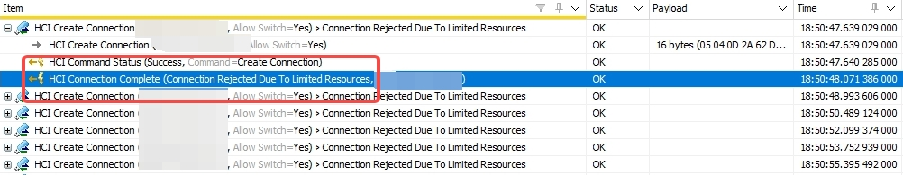

### Method: Check if Scanning Was Successfully Initiated

#### 1. Check Bluetooth syslog: Whether the Device Successfully Initiated Scanning

A status of 0 indicates successful initiation of scanning, while a status of 1 indicates scanning was turned off.

```text
bttool> [bttool] on_scan_start_status_cb, scanner:0xdf7943b0, status:0
[   24.055800] [20] [ DEBUG] [446][scanner]: scan_on_state_changed, state:0
```

#### 2. Check HCI Logs: Whether the HCI CMD Was Successfully Sent and Whether the HCI EVT Returned a Normal Status

As shown below, the HCI logs indicate that the device successfully initiated scanning, with the final status returned as normal.


<a id="method-confirm-remote-device-has-corresponding-spp-service"></a>

### Method: Confirm the Remote Device Has the Corresponding SPP Service

#### 1. Check Remote Device snoop logs: Confirm Whether the Remote Device Has the Corresponding SPP Service

When the SPP client initiates an SPP connection, it needs to obtain the SPP service information of the remote device. You can confirm whether the desired SPP service exists through the snoop logs of the remote device.

Sample logs for failed service query:

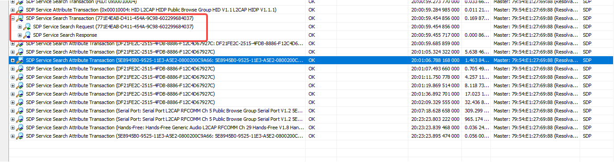

<a id="method-confirm-spp-connection-status-and-disconnection-initiator"></a>

### Method: Confirm SPP Connection Status and Disconnection Initiator

#### 1. Check syslog: Confirm the Initiator of Disconnection

The log transitions for actively disconnecting an SPP connection differ from those for passively disconnecting.

When actively disconnecting an SPP connection, the connection status transitions from connected (2) to disconnecting (3) and then to disconnected (4). Typical logs are as follows:

```text
[15] [cp] [732][spp]: spp_on_connection_state_chaneged, addr: XX:XX:XX:XX:2E:43, scn: 5, port: 0, state: 1
[15] [cp] [732][spp]: spp_on_connection_state_chaneged, addr: XX:XX:XX:XX:2E:43, scn: 5, port: 0, state: 2
......
[15] [cp] [732][spp]: spp_on_connection_state_chaneged, addr: XX:XX:XX:XX:2E:43, scn: 5, port: 0, state: 3
......
[15] [cp] [732][spp]: spp_on_connection_state_chaneged, addr: XX:XX:XX:XX:2E:43, scn: 5, port: 0, state: 0
```

When passively disconnecting an SPP connection, the connection status transitions directly from connected (2) to disconnected (0). Typical logs are as follows:

```text
[15] [cp] [732][spp]: spp_on_connection_state_chaneged, addr: XX:XX:XX:XX:2E:43, scn: 5, port: 0, state: 1
[15] [cp] [732][spp]: spp_on_connection_state_chaneged, addr: XX:XX:XX:XX:2E:43, scn: 5, port: 0, state: 2
......
[15] [cp] [732][spp]: spp_on_connection_state_chaneged, addr: XX:XX:XX:XX:2E:43, scn: 5, port: 0, state: 0
```

#### 2. Check snoop logs to confirm the initiator of disconnection

#### 3. Check air logs to confirm the initiator of disconnection

<a id="discovery-connection-pairing-typical-issues"></a>

## Typical Issues

<a id="issue-classic-bluetooth-device-fails-to-bind-to-remote-device"></a>

### Issue: Classic Bluetooth Device Fails to Bind to Remote Device

If the device fails to bind actively, further root cause analysis can be conducted using the following methods.

* [Check if the Remote Device Has Not Enabled Connectable Mode](#method-check-if-the-remote-device-has-not-enabled-connectable-mode)
  * If the remote device has not enabled connectable mode, it is recommended to investigate why the phone is not in connectable mode.
  * Otherwise, proceed with further analysis as follows.

* [Check if the Remote Device Has Not Enabled Connectable Mode (Page Timeout)](#method-check-if-the-remote-device-has-not-enabled-connectable-mode)
  * If the remote device has not enabled connectable mode, it is recommended to investigate why the phone is not in connectable mode.
  * Otherwise, proceed with further analysis as follows.

* [Check if ACL Connection Times Out and Disconnects (Connection Timeout)](#method-check-if-acl-connection-times-out-and-disconnects)
  * If a link layer connection timeout occurs within the effective communication range, please provide air interface logs and HCI logs. Generally, further confirmation of the Bluetooth Controller behavior is required from the chip vendor.
  * Otherwise, proceed with further analysis as follows.

* [Check if Binding Was Successful but No Profile Connection Exists, Leading to ACL Disconnection](#method-check-if-binding-was-successful-but-no-profile-connection-exists-leading-to-acl-disconnection)
  * If the ACL connection is successful but no A2DP, HID, etc., Profile is connected, the device will disconnect as expected.
  * Otherwise, proceed with further analysis as follows.

* [Check if Local Pairing Information Is Invalid (Linkey Missing)](#method-check-if-local-pairing-information-is-invalid)
  * If the local Linkey is invalid or lost (offline unpairing), and the remote binding information is valid, the watch may fail to initiate pairing, which is expected.
  * Otherwise, proceed with further analysis as follows.

* [Check if Remote Pairing Information Is Invalid (Linkey Missing)](#method-check-if-remote-pairing-information-is-invalid)
  * If the remote Linkey is invalid or lost (offline unpairing), and the local binding information is valid, the watch may fail to initiate pairing, which is expected.
  * Otherwise, it is recommended to upload Bluetooth service logs, protocol stack logs, air interface logs, and phone snoop logs for further analysis.

<a id="issue-headphones-fail-to-reconnect-to-watch-after-disconnection"></a>

### Issue: Headphones Fail to Reconnect to Watch After Disconnection

The behavior of headphones reconnecting to the watch is initiated by the headphones and requires the watch to be in discoverable and connectable mode. Further root cause analysis can be conducted using the following methods.

* [Check if Local Device Is in Connectable Mode](#method-check-if-local-device-is-in-connectable-mode)
  * If the watch device is not in connectable mode, it is recommended to keep the watch on the headphone connection settings page to ensure it enters discoverable and connectable mode.
  * Otherwise, proceed with further analysis as follows.

* [Check if Remote Device Initiates Reconnection](#method-check-if-remote-device-initiates-reconnection)
  * If the headphones do not actively initiate a reconnection request, further analysis is needed on the headphone side.
  * Otherwise, upload Bluetooth service logs, protocol stack logs, air interface logs, and phone snoop logs for further analysis on the watch side.

<a id="issue-classic-bluetooth-device-is-not-successfully-connected-by-remote-device"></a>

### Issue: Classic Bluetooth Device Is Not Successfully Connected by Remote Device

If the remote device fails to connect actively, further root cause analysis can be conducted using the following methods.

* [Check if Local Device Is in Connectable Mode](#method-check-if-local-device-is-in-connectable-mode)
  * If the device is not in connectable mode, check the Bluetooth application's scan mode settings.
  * Otherwise, proceed with further analysis as follows.

* [Check if Local Device Successfully Receives ACL Connection Request](#method-check-if-local-device-receives-acl-connection-request)
  * If the Bluetooth service does not output connection request information, confirm whether the Bluetooth device is within Bluetooth communication range.
  * Furthermore, air interface logs can be captured to confirm RF and link issues, and support can be sought from the Controller vendor.
  * Otherwise, proceed with further analysis as follows.

* [Check if Local Device Accepts ACL Connection Request](#method-check-if-local-device-accepts-acl-connection-request)
  * If the Bluetooth application does not accept the connection request, confirm whether the application's logic for rejecting connections is as expected.
  * Otherwise, upload Bluetooth service logs and protocol stack logs for further analysis.

### Issue: Low-Power Bluetooth Fails to Scan Remote Device

The scanning process for low-power Bluetooth is typically initiated by the central device, which receives broadcasts from the remote device. Further root cause analysis can be conducted using the following methods.

* [Check if Scanning Was Successfully Initiated](#method-check-if-scanning-was-successfully-initiated)
  * If scanning was successful, ensure that the scan interval and scan window are appropriate, and confirm that there is no audio business or other high-throughput business occupying bandwidth resources at this time.
  * Otherwise, upload syslog, protocol stack logs, and snoop logs with the broadcast packets of the broadcasting device for further analysis and confirmation.
  
# Issue: SPP Active Connection Failure

For SPP active connection failures, first follow the analysis methods in the "Discovery, Connection, and Pairing Issues" chapter to confirm whether the ACL connection is established properly. After confirming the normal establishment of the ACL connection, further analysis can be conducted using the following methods.

* [Confirm the Remote Device Has the Corresponding SPP Service](#method-confirm-the-remote-device-has-the-corresponding-spp-service)
  * If the remote device has not registered the corresponding SPP service, further analysis of the remote device is required.
  * Otherwise, proceed with the following steps for further analysis.

* [Confirm SPP Connection Status and Disconnection Initiator](#method-confirm-spp-connection-status-and-disconnection-initiator)
  * If the previous SPP connection has not been disconnected, confirm whether either side of the SPP connection has initiated a disconnection.
  * Otherwise, upload Bluetooth service logs, protocol stack logs, air interface logs, and phone snoop logs for further analysis.

# Audio Transmission Issues

This chapter introduces common analysis and troubleshooting methods for issues related to the Advanced Audio Distribution Profile (A2DP) and Audio/Video Distribution Transport Protocol (AVDTP). AVDTP controls the audio/video transmission process, while A2DP defines the encoding and transmission specifications for audio data. By working together, these protocols enable high-quality audio transmission between Bluetooth devices.
A2DP is a Bluetooth audio distribution configuration protocol, featuring two roles: Source (SRC) and Sink (SNK). Typically, SRC is the audio source, and SNK is the audio receiver. In the Vela Bluetooth service framework, Bluetooth music source devices (e.g., phones/watches) can act as A2DP-SRC, while Bluetooth music output devices (e.g., speakers/headphones/car systems) can act as A2DP-SNK.
AVDTP is a Bluetooth audio transport control protocol. It defines processes such as Stream End Point (SEP) Discovery, Get Capabilities/Get All Capabilities, Stream Configuration, Stream Establishment, Stream Start, and Stream Suspend. The initiator of AVDTP signaling is called Initiator (INT), and the receiver is called Acceptor (ACP). When transmitting audio between two Bluetooth devices, two AVDTP connections need to be established in advance. The first is the AVDTP signaling connection, used for codec parameter negotiation and media connection control. After negotiation, a second AVDTP connection is established, known as the AVDTP media connection, for transmitting audio data.
Above the Vela Bluetooth stack, the Vela Bluetooth subsystem also provides an A2DP service layer. There are multiple transport channels between A2DP services and the Media services in the multimedia subsystem. These transport channels can be divided into two categories: control channels for transmitting control signaling and data channels for transmitting audio data.

## Analysis Methods

<a id="method-check-if-the-transport-between-bluetooth-and-media-is-correctly-established"></a>

### Method: Check if the Transport Between Bluetooth and Media is Correctly Established

During the initialization of the Bluetooth subsystem, the A2DP service creates a socket server. Subsequently, the Media service acts as a socket client to establish a connection with Bluetooth, allowing control signaling and audio data to be transmitted between the two subsystems. Typically, the correct establishment of control channels and data channels between Bluetooth and Media can be observed through syslog.

Typical logs are as follows:

* Correct establishment of a transport channel between A2DP SRC and Media
```text
[a2dp_control]: a2dp_ctrl_cb, path:[a2dp_source_ctrl], event:TRANSPORT_OPEN_EVT
[a2dp_control]: a2dp_data_cb, path:[a2dp_source_data], event:TRANSPORT_OPEN_EVT
```

* Correct establishment of a transport channel between A2DP SNK and Media
```text
[a2dp_control]: a2dp_ctrl_cb, path:[a2dp_sink_ctrl], event:TRANSPORT_OPEN_EVT
[a2dp_control]: a2dp_data_cb, path:[a2dp_sink_data], event:TRANSPORT_OPEN_EVT
```

<a id="method-check-if-the-avdtp-signaling-connection-is-established"></a>

### Method: Check if the AVDTP Signaling Connection is Established

Establishing an AVDTP signaling connection is a necessary step for audio connections between two Bluetooth devices. Typically, whether an AVDTP signaling connection has been established can be observed through snoop logs or air interface logs.

#### 1. Check if the AVDTP Signaling Connection is Established via Snoop Logs, and Observe Possible Failure Reasons

Typical logs for a successful AVDTP signaling connection are as follows:


AVDTP connections are a type of L2CAP connection, identified by the PSM. The first AVDTP connection established between two devices automatically becomes the AVDTP signaling connection.

<a id="method-check-if-the-avdtp-media-connection-is-established"></a>

### Method: Check if the AVDTP Media Connection is Established

Before establishing an AVDTP media connection, processes such as Discovery, Get (ALL) Capabilities, Set/Get Configuration, and Stream Establishment may occur. Among these, the Set Configuration and Stream Establishment processes are essential. Typically, whether an AVDTP media connection has been established can be observed through syslog, snoop logs, or air interface logs.

#### 1. Check if the AVDTP Media Connection is Established via Snoop Logs, and Observe Possible Failure Reasons

The following examples illustrate the process of two devices establishing an AVDTP media connection.

##### 1.1 AVDTP Discovery

Optionally, before establishing an AVDTP media connection, an AVDTP Discovery process can be initiated to discover available Stream End Points (SEPs) on the remote device. Typically, the device initiating the AVDTP signaling connection will initiate this process. Typical logs are as follows:


The logs show that the ACP's sequence number ranges from 1 to 6, indicating that the device has at least 6 SEPs.

##### 1.2 AVDTP Get Capabilities

Optionally, before establishing an AVDTP media connection, Get Capabilities or Get All Capabilities can be used to obtain specific information about the remote device's SEP. Typically, the device initiating the AVDTP signaling connection will initiate this process. Typical logs are as follows:


The logs show the process of obtaining specific information about SEP number 1, where the encoding format is SBC, and the sampling rate is 44.1kHz.

##### 1.3 AVDTP Set Configuration

Before establishing an AVDTP media connection, the Set Configuration process must be used to specify the SEPs and codec parameters for both parties. Typically, the device initiating the AVDTP signaling connection should initiate this process. Typical logs are as follows:


The logs show that the initiating party requests to establish a connection using SEP number 1 and the remote device's SEP number 1.

##### 1.4 AVDTP Stream Establishment

Before establishing an AVDTP media connection, the Open process must be initiated to open the SEPs on both parties. Typically, the device initiating the AVDTP signaling connection should initiate this process. Typical logs are as follows:


##### 1.5 AVDTP Media Connection Success

After completing the Set Configuration and Stream Establishment processes, a second AVDTP connection, known as the AVDTP media connection, needs to be established. Typically, the device initiating the AVDTP signaling connection should initiate this process. Typical logs are as follows:

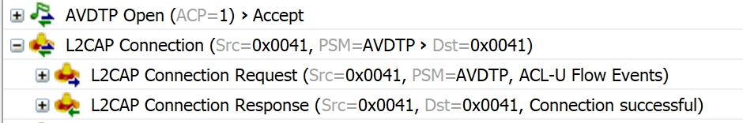

Typically, after the AVDTP Open is completed, the subsequently established L2CAP (PSM=AVDTP) is the AVDTP media connection.

#### 2. Check if the AVDTP Media Connection is Established via Syslog, and Observe Possible Failure Reasons

Typical logs are as follows:

* Local device is connected
```text
[a2dp_stm]: ProcessEvent, State=Idle, Peer=[11:22:33:44:55:66], Event=CONNECTED_EVT
[a2dp_stm]: Enter State=Opened, Peer=[11:22:33:44:55:66]
```

* Local device actively connects to the remote device
```text
[a2dp_stm]: ProcessEvent, State=Opening, Peer=[11:22:33:44:55:66], Event=CONNECTED_EVT
[a2dp_stm]: Enter State=Opened, Peer=[11:22:33:44:55:66]
```

<a id="method-check-if-media-has-successfully-configured-the-codec"></a>

### Method: Check if Media Has Successfully Configured the Codec

Before transmitting or playing music, codec parameters need to be set in the Media subsystem. Whether Media has successfully configured the codec can be observed through syslog.

Typical logs are as follows:
```text
[a2dp_control]: a2dp_recv_ctrl_data: a2dp-ctrl-cmd : A2DP_CTRL_CMD_CONFIG_DONE
```

<a id="method-check-if-a2dp-src-has-started-playing-music"></a>

### Method: Check if A2DP SRC Has Started Playing Music

Typically, whether the A2DP SRC has started playing music can be observed through syslog, snoop logs, or air interface logs.

#### 1. Check if A2DP SRC Has Started Playing Music via Syslog

On the A2DP SRC side, the process of the Vela Bluetooth service starting to play music is triggered by a command from Media. Typical logs are as follows:
```text
[a2dp_control]: a2dp_recv_ctrl_data: a2dp-ctrl-cmd : A2DP_CTRL_CMD_START
```

When the Bluetooth service receives the command to start playing music, it initiates the AVDTP Stream Start process and enters the Started state after the process is successfully completed. Typical logs are as follows:
```text
[a2dp_stm]: ProcessEvent, State=Opened, Peer=[11:22:33:44:55:66], Event=STREAM_START_REQ
[a2dp_stm]: ProcessEvent, State=Opened, Peer=[11:22:33:44:55:66], Event=STREAM_STARTED_EVT
[a2dp_stm]: Exit State=Opened, Peer=[11:22:33:44:55:66]
[a2dp_stm]: Enter State=Started, Peer=[11:22:33:44:55:66]
```

#### 2. Check if A2DP SRC Has Started Playing Music via Air Logs

Before the audio stream begins transmission, the A2DP SRC initiates the Stream Start process. During the audio stream transmission, the A2DP SRC sends media packets to the SNK. Typical logs are as follows:

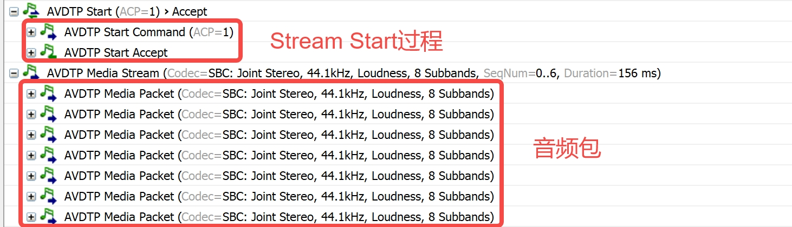

<a id="method-check-if-a2dp-src-has-stopped-transmitting-audio-packets"></a>

### Method: Check if A2DP SRC Has Stopped Transmitting Audio Packets

Typically, whether the A2DP SRC has stopped transmitting audio packets can be observed through syslog, snoop logs, or air interface logs.

#### 1. Check if A2DP SRC Has Stopped Transmitting Audio Packets via Syslog

When the Vela device is the A2DP SRC, the Bluetooth service has two ways to terminate the transmission of audio data.

* When receiving a STOP command from Media.

* When it fails to obtain audio data from Media for two consecutive seconds.

When the Bluetooth service receives a STOP command from Media, typical logs are as follows:
```text
[a2dp_control]: a2dp_recv_ctrl_data: a2dp-ctrl-cmd : A2DP_CTRL_CMD_STOP
```

When the Bluetooth service fails to read data from Media for two seconds, the following log is printed in syslog, and this condition lasts for approximately two seconds:
```text
[src_sbc]: a2dp_sbc_send_frames, underflow :6
```

Typical logs for the Bluetooth service initiating the Stream Suspend process are as follows:
```text
[a2dp_stm]: ProcessEvent, State=Started, Peer=[11:22:33:44:55:66], Event=STREAM_SUSPEND_REQ
[a2dp_stm]: ProcessEvent, State=Started, Peer=[11:22:33:44:55:66], Event=STREAM_SUSPENDED_EVT
[a2dp_stm]: Exit State=Started, Peer=[11:22:33:44:55:66]
[a2dp_stm]: Enter State=Opened, Peer=[11:22:33:44:55:66]
```

#### 1. Check if A2DP SRC Has Stopped Transmitting Audio Packets via Snoop Logs

Typical logs are as follows:


### Method: Check if the AVDTP Signaling Connection is Disconnected

Reasons for the disconnection of the AVDTP signaling connection include the following: the application requests the Vela Bluetooth subsystem to disconnect the A2DP connection, the Bluetooth stack actively disconnects, or the remote device requests a disconnection. Typically, whether the AVDTP signaling connection is disconnected can be observed through syslog, snoop logs, or air interface logs.

#### 1. Check if the AVDTP Signaling Connection is Disconnected via Syslog

When the application requests to disconnect the A2DP connection, the A2DP state machine receives DISCONNECT_REQ and subsequently disconnects the AVDTP signaling connection. Typical logs are as follows:
```text
[a2dp_stm]: ProcessEvent, State=Opened, Peer=[11:22:33:44:55:66], Event=DISCONNECT_REQ
```

Typical logs when the disconnection is completed are as follows:
```text
[a2dp_stm]: ProcessEvent, State=Closing, Peer=[11:22:33:44:55:66], Event=DISCONNECTED_EVT
[a2dp_stm]: Exit State=Closing, Peer=[11:22:33:44:55:66]
[a2dp_stm]: Enter State=Idle, Peer=[11:22:33:44:55:66]
```

#### 2. Check if the AVDTP Signaling Connection is Disconnected via Snoop Logs, and Observe Possible Failure Reasons

In snoop logs, there are two reasons for the disconnection of the AVDTP signaling connection: the local device actively disconnects, or the remote device requests a disconnection. Typical logs are as follows:


<a id="method-check-if-the-audio-packet-sequence-number-is-continuous"></a>

### Method: Check if the Audio Packet Sequence Number is Continuous

The AVDTP Media Packet header contains a field called Sequence Number. This field is the sequence number of the audio packet and increments with each AVDTP Media Packet sent. After each Stream Start process begins, the Sequence Number starts from 0 and increments by 1 with each AVDTP Media Packet sent. When this sequence number is interrupted or jumps, it usually indicates missing audio data.

Typical logs are as follows:

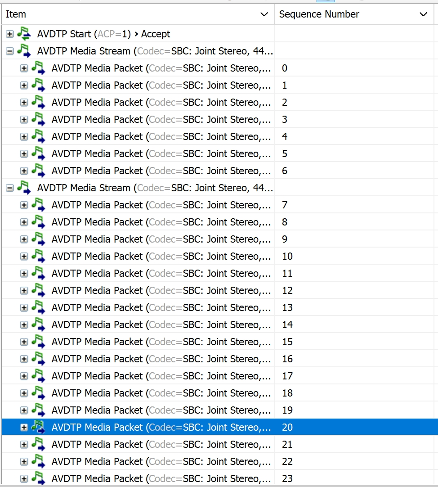

<a id="method-check-the-number-of-audio-data-sample-points-sent-in-1-second-in-the-air-log"></a>

### Method: Check the Number of Audio Data Sample Points Sent in 1 Second in the Air Log

The AVDTP Media Packet header contains a field called Time Stamp. This field indicates the sampling time of the audio packet, i.e., the number of the first sample point in the audio data packet.

In the air log, capture audio packets within 1 second. The difference in Time Stamp between the starting and ending audio packets is the number of audio data sample points transmitted during that time.

Typically, the number of audio data sample points transmitted within a 1-second time window should equal or be close to the sampling rate. Typical logs are as follows:

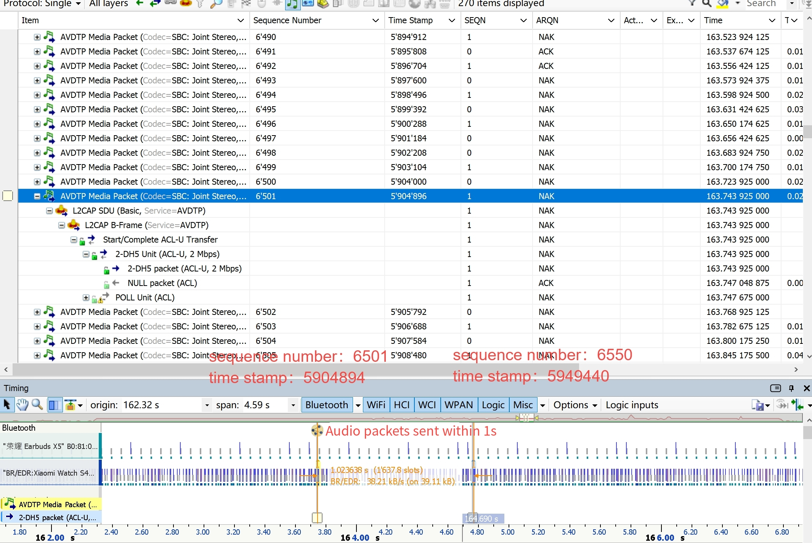

In the above logs, the actual number of sample points transmitted is: 5949440 - 5904896 = 44546. Since the current sampling rate is set to 44.1kHz, the actual number of sample points transmitted is close to the expected value.

When the number of audio data sample points transmitted within 1 second is much higher than the sampling rate, the air log typically shows packets that are more densely packed than normal. Typical logs are as follows:

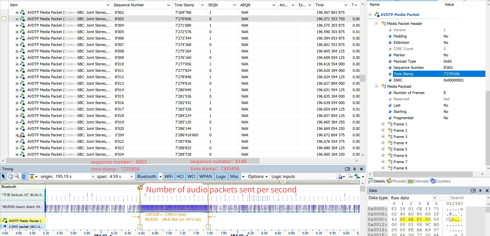

In the above logs, the actual number of sample points transmitted within approximately 1 second is: 7395456 - 7270656 = 124800, which far exceeds expectations.

<a id="method-check-for-audio-data-retransmission-in-the-air-log"></a>

### Method: Check for Audio Data Retransmission in the Air Log

There are two parameters in the air log that can be used to determine whether a packet has been retransmitted: SEQN and ARQN. Under normal circumstances, the value of SEQN alternates between 0 and 1. The remote device replies with ARQN as ACK. If retransmission occurs, the value of SEQN in the baseband packet remains the same as the previous packet.

There are two reasons for retransmission over the air interface:

* The device did not receive a reply from the remote device for the sent packet.

* The device received a reply from the remote device, but the ARQN value was NAK.

When the device sends a packet but does not receive a reply from the remote device, typical logs are as follows:


In the above logs, the device sent three 2-DH5 packets. The first two transmissions did not receive a reply from the remote device, hence the retransmission with the SEQN value remaining unchanged. The third transmission received a reply from the remote device, and the ARQN was ACK, ending the retransmission. Upon sending new data, a change in SEQN can be observed.

When the device sends a packet and receives a reply from the remote device, but the ARQN is NAK, typical logs are as follows:


In the above logs, the device sent two 2-DH5 packets. The first transmission received a reply from the remote device, but the ARQN was NAK, with the SEQN value remaining unchanged. The second transmission received a reply from the remote device, and the ARQN was ACK, ending the retransmission.

## Typical Issues

### Issue: Headphones Connected but No Sound

* [Check if the AVDTP Signaling Connection is Established](#method-check-if-the-avdtp-signaling-connection-is-established)

  * If the two devices fail to establish the AVDTP signaling connection correctly, compare it with typical logs to identify any abnormalities during the establishment process.

  * If the two devices establish the AVDTP signaling connection correctly, proceed to [Check if the AVDTP Media Connection is Established](#method-check-if-the-avdtp-media-connection-is-established).

* [Check if the AVDTP Media Connection is Established](#method-check-if-the-avdtp-media-connection-is-established)

  * If the two devices fail to establish the AVDTP media connection correctly, compare it with typical logs to identify any abnormalities during the establishment process.

  * If the two devices establish the AVDTP media connection correctly, proceed to [Check if Media Has Successfully Configured the Codec](#method-check-if-media-has-successfully-configured-the-codec).

* [Check if Media Has Successfully Configured the Codec](#method-check-if-media-has-successfully-configured-the-codec)

  * If Vela Media fails to configure the codec, investigate the reason within the Vela Media module.

  * If Vela Media successfully configures the codec, proceed to [Check if A2DP SRC Has Started Playing Music](#method-check-if-a2dp-src-has-started-playing-music).

* [Check if Music Playback Has Started](#method-check-if-a2dp-src-has-started-playing-music)

  * If the local device is the A2DP SRC and Vela Media fails to send the music playback command, investigate the reason within the Vela Media module.

  * If the local device is the A2DP SRC and Vela Media sends the music playback command but the headphones have no sound, compare it with typical logs to identify any abnormalities in the playback process.

### Issue: Audio File Playback with Missing Header When Headphones are Connected

* [Check if the Audio Packet Sequence Number is Continuous](#method-check-if-the-audio-packet-sequence-number-is-continuous)

  * If the air log shows non-continuous sequence numbers in the problematic audio stream, investigate the reason for the non-continuous sequence numbers in the audio stream on the Vela Bluetooth side.

  * If the audio packet sequence numbers are continuous, check whether the audio packets sent from the Vela Media side are complete.

### Issue: Pop Sound at the End of Voice Announcements

### Issue: Disconnection and No Sound When Connecting Two Pairs of Headphones

Vela A2DP SRC currently does not support multi-device connections. A typical example is a watch connecting to a pair of headphones. When the watch needs to connect to another pair of headphones, it must first disconnect from the previous pair. For silent issues caused by multi-device switching, troubleshooting can be performed in the following order:

* [Check if the First Pair of Headphones is Disconnected](#method-check-if-the-avdtp-signaling-connection-is-disconnected)

  * If the application fails to send a disconnection request for the first pair of headphones, investigate the reason on the App side.

  * If the application sends a disconnection request for the first pair of headphones but it fails to disconnect, compare it with typical logs to identify any abnormalities in the disconnection process.

  * If the application correctly disconnects the first pair of headphones before connecting to the second pair, proceed to [Check if the Second Pair of Headphones is Connected](#method-check-if-the-avdtp-media-connection-is-established).

* [Check if the Second Pair of Headphones is Connected](#method-check-if-the-avdtp-media-connection-is-established)

  * If the application fails to send a connection request for the second pair of headphones, investigate the reason on the App side.

  * If the application sends a connection request for the second pair of headphones but fails to establish the AVDTP signaling connection, compare it with typical logs to identify any abnormalities in the signaling connection establishment process.

  * If the AVDTP signaling connection between the two devices is successfully established but the AVDTP media connection fails to establish, compare it with typical logs to identify any abnormalities in the media connection establishment process.

  * If the AVDTP media connection between the two devices is successfully established, proceed to [Check if Media Has Successfully Configured the Codec](#method-check-if-media-has-successfully-configured-the-codec).

* [Check if Media Has Successfully Configured the Codec](#method-check-if-media-has-successfully-configured-the-codec)

  * If Vela Media fails to configure the codec, investigate the reason within the Vela Media module.

  * If Vela Media successfully configures the codec, proceed to [Check if Music Playback Has Started](#method-check-if-a2dp-src-has-started-playing-music).

* [Check if Music Playback Has Started](#method-check-if-a2dp-src-has-started-playing-music)

  * If Vela Media fails to send the music playback command, investigate the reason within the Vela Media module.

  * If Vela Media sends the music playback command but the headphones have no sound, compare it with typical logs to identify any abnormalities in the playback process.

# Music Playback Control Issues

This chapter introduces common analysis and troubleshooting methods for issues related to the Audio/Video Remote Control Profile (AVRCP). AVRCP is a Bluetooth audio/video remote control protocol featuring two roles: Controller (CT) and Target (TG). Typically, CT is the controller, and TG is the controlled device. In the Vela Bluetooth service framework, Bluetooth music output devices (e.g., speakers/headphones/car systems) can act as AVRCP-CT, while Bluetooth music source devices (e.g., phones/watches/fitness bands) can act as AVRCP-TG.

## Analysis Methods

<a id="method-check-if-the-avrcp-connection-is-established"></a>

### Method: Check if the AVRCP Connection is Established

Typically, whether an AVRCP connection has been established can be observed through syslog, snoop logs, or air interface logs.

#### 1. Check if the AVRCP Connection is Established via Syslog

Typical logs are as follows:

* Successful connection of AVRCP CT to the remote device (AVRCP TG)
```text
[avrcp_controller]: avrc ct connnection --> device:[AA:AA:AA:AA:AA:AA], state: 2
```

* Successful connection of AVRCP TG to the remote device (AVRCP CT)
```text
[avrcp_target]: avrc tg connnection --> device:[AA:AA:AA:AA:AA:AA], state: 2
```

#### 2. Check if the AVRCP Connection is Established via Snoop Logs, and Observe Possible Failure Reasons

Typical logs are as follows:


#### 3. Check if the AVRCP Connection is Established via Air Logs, and Observe Possible Failure Reasons

Typical logs are as follows:

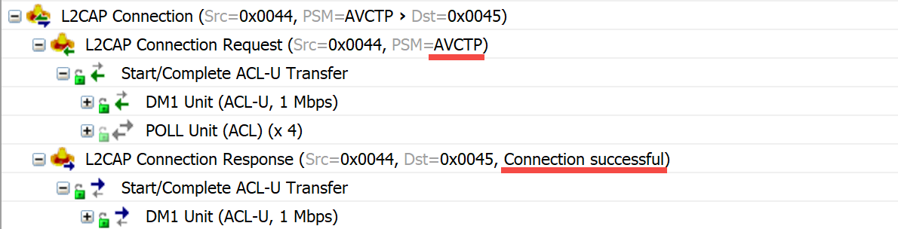

<a id="method-check-if-the-device-supports-avrcp"></a>

### Method: Check if the Device Supports AVRCP

When neither device initiates an AVRCP connection, it is recommended to check whether both devices support AVRCP. Typically, whether a device supports AVRCP can be observed through syslog, snoop logs, or air interface logs.

#### 1. Check if the Local Device has Enabled AVRCP Services via Syslog

Typical logs are as follows:

* Successful registration of AVRCP CT service
```text
[service_manager]: AVRCP-CT service register success
```

* Successful startup of AVRCP CT service
```text
[service_manager]: service_on_startup {AVRCP-CT} start ret:1
```

* Successful registration of AVRCP TG service
```text
[service_manager]: AVRCP-TG service register success
```

* Successful startup of AVRCP TG service
```text
[service_manager]: service_on_startup {AVRCP-TG} start ret:1
```

#### 2. Check if Both Devices Support AVRCP via Snoop Logs or Air Logs

Typical logs are as follows:

* SDP declares support for AVRCP-CT role

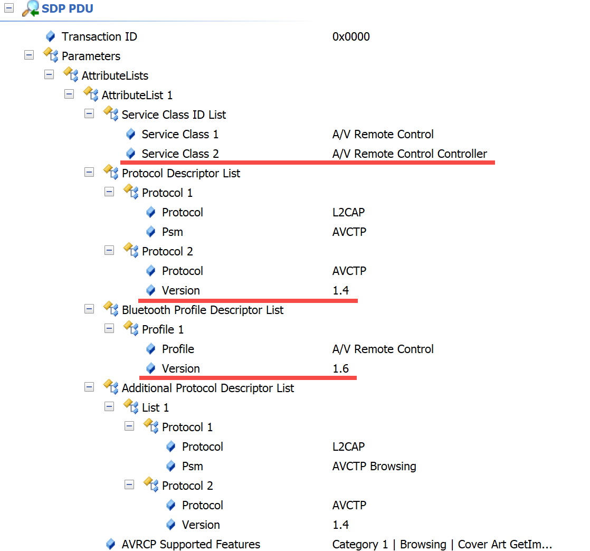

* SDP declares support for AVRCP-TG role

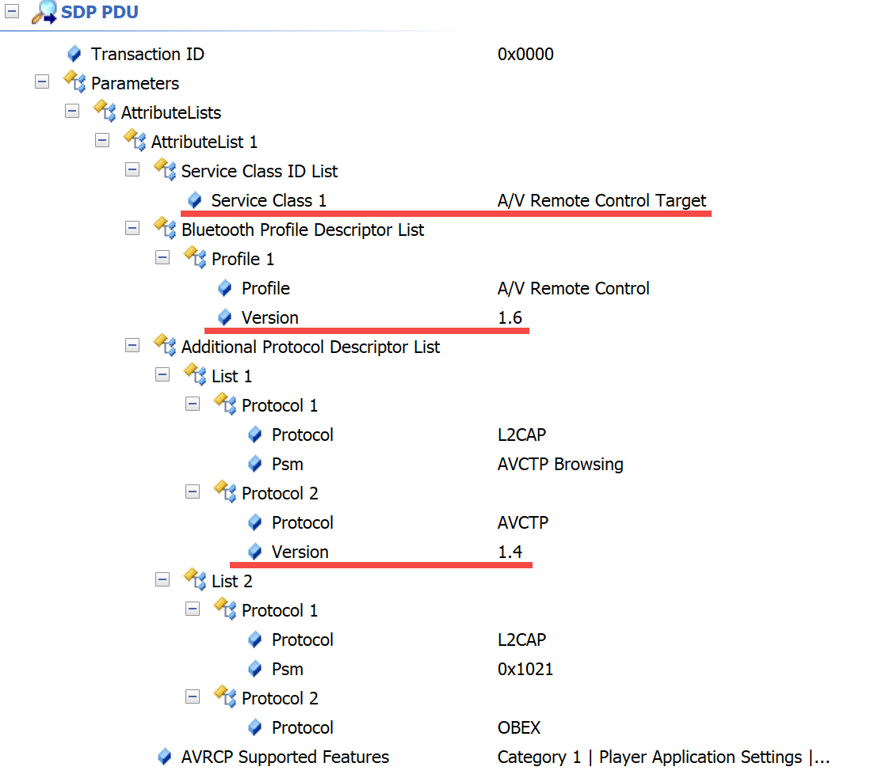

<a id="method-check-if-play-or-pause-requests-are-sent"></a>

### Method: Check if Play or Pause Requests are Sent

Whether play or pause requests are sent can be observed through syslog, snoop logs, or air interface logs.

#### 1. Check if Play or Pause Requests are Sent via Syslog

Typical logs are as follows:

* The local device sends play or pause requests
```text
[avrcp_controller]: avrcp_ct_on_play
[avrcp_controller]: avrcp_ct_on_pause
```

* The remote device presses or releases the play button, or presses or releases the pause button
```text
[avrcp_target]: passthrough cmd: 40, state: 0
[avrcp_target]: passthrough cmd: 40, state: 1
[avrcp_target]: passthrough cmd: 42, state: 0
[avrcp_target]: passthrough cmd: 42, state: 1
```

#### 2. Check if Play or Pause Requests are Sent via Snoop Logs or Air Logs

Typical logs are as follows:


<a id="method-check-if-notification-is-registered"></a>

### Method: Check if Notification is Registered

Whether notification is registered can be observed through syslog, snoop logs, or air interface logs.

#### 1. Check if Notification is Registered via Syslog

Typical logs are as follows:

* The local device registers notification to observe the playback status of the remote device
```text
[avrcp_controller]: capability support event: 1
```

* The remote device registers notification to observe the playback status of the local device
```text
[avrcp_target]: register notification event: 1
```

Similarly, different event numbers represent different notification events, and the syslog content can be interpreted in the same way.

#### 2. Check if Notification is Registered via Snoop Logs or Air Logs

Taking playback status notification as an example, typical logs are as follows:

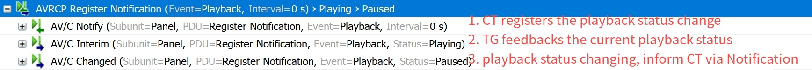

<a id="method-check-if-playback-status-is-correctly-reported"></a>

### Method: Check if Playback Status is Correctly Reported

After the CT registers for playback status changes with the TG, the TG can feedback playback status changes to the CT. Whether the TG correctly reports playback status changes to the CT can be observed through syslog, snoop logs, or air interface logs.

#### 1. Check if Playback Status is Correctly Reported via Syslog

Typical logs are as follows:

* The local device reports playback status changes to the remote device
```text
[avrcp_target]: send playstatus notification --> STOPPED
```

* The remote device reports playback status changes to the local device
```text
[avrcp_controller]: register_notification evt: 1
[avrcp_controller]: playback status changed: PAUSED, get status now...
```

#### 2. Check if Notification is Registered via Snoop Logs or Air Logs

Taking playback status notification as an example, typical logs are as follows:


<a id="method-check-if-playback-status-changes-are-caused-by-bluetooth"></a>

### Method: Check if Playback Status Changes are Caused by Bluetooth

Typically, when the playback status of the Bluetooth music player changes abnormally, the same scenario can be tested by disconnecting the Bluetooth connection to see if the playback status still changes. If it does, the change is usually unrelated to the Bluetooth connection.

<a id="method-check-if-absolute-volume-is-used"></a>

### Method: Check if Absolute Volume is Used

The prerequisite for AVRCP-CT and AVRCP-TG to use absolute volume is that both parties support the absolute volume feature.

#### 1. Check if Absolute Volume is Supported via Syslog

The remote device requests to register for volume changed notification (EventID = 0x0D), indicating that both parties support absolute volume:
```text
[avrcp_controller]: register notification event: 13
```

#### 2. Check if Absolute Volume is Supported via Snoop Logs

For absolute volume functionality, the music source device (phone) needs to declare support for the AVRCP-CT role in SDP, and the music playback device (headphones) needs to declare support for the AVRCP-TG role in SDP. Typical logs are as follows:


Additionally, the music source device (phone) registers for volume change events with the music playback device (headphones), indicating that both parties support absolute volume. Typical logs are as follows:


<a id="method-check-if-the-phone-has-set-absolute-volume"></a>

### Method: Check if the Music Source Device (Phone) has Set Absolute Volume

When both parties support absolute volume, the music source device (phone) needs to send set absolute volume to change the volume of the music playback device (headphones). Whether the phone has set the absolute volume can be observed through snoop logs or air logs.

#### 1. Check if the Phone has Set Absolute Volume via Snoop Logs or Air Logs

Typical logs are as follows:


<a id="method-check-if-the-local-device-has-set-absolute-volume"></a>

### Method: Check if the Local Device has Set Absolute Volume

If the music source device (phone) correctly sets the absolute volume but it does not take effect locally, the reason for the failure needs to be investigated. Whether the local device has successfully set the absolute volume can be observed through syslog.

#### 1. Check if the Local Device has Set Absolute Volume via Syslog

Typical logs are as follows:
```text
[avrcp_controller]: set absolute volume rsp: status: 0, volume: 50
```

<a id="method-check-if-the-phone-has-changed-the-audio-amplitude"></a>

### Method: Check if the Music Source Device (Phone) has Changed the Audio Amplitude

#### 1. Check if the Music Source Device (Phone) has Changed the Audio Amplitude via the Audio Source File

Typically, audio can be exported from air logs, and the amplitude of the music file can be analyzed to observe amplitude changes. A typical Bluetooth audio file is as follows:

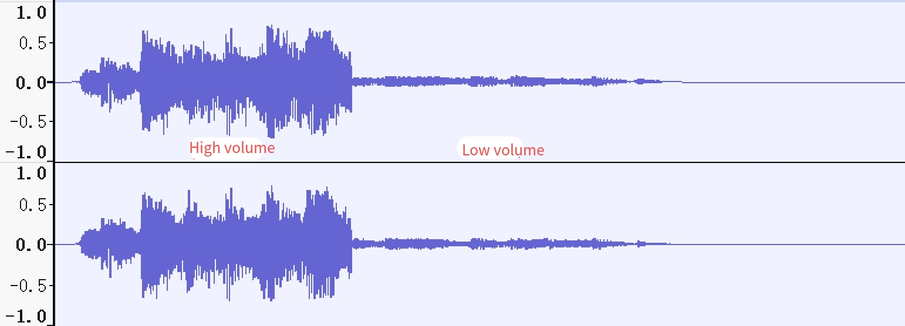

#### 2. Check if the Music Source Device (Phone) has Changed the Audio Amplitude via Air Logs

For SBC and AAC encoded audio, the volume can be roughly determined in the following ways, though not accurately. More often, this method can be used to determine if the audio is muted.

For SBC encoded audio, the volume can be determined by the Scale Factor in the Media Payload. Typical logs are as follows:


For AAC encoded audio, the volume can be determined by the encoded frame length. Typical logs are as follows:

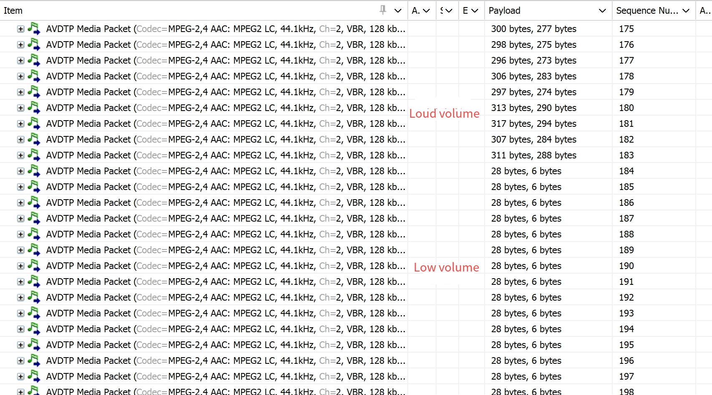

<a id="method-check-if-avrcp-configuration-is-enabled"></a>

### Method: Check if AVRCP Configuration is Enabled

Typically, whether AVRCP configuration is enabled can be checked in the .config file. In the compilation output, the .config file is located in the path of the Bluetooth service core, for example:
```text
image/sim-vela/vela/.config
image/qemu-vela/goldfish-armeabi-v7a-ap/.config
```
AVRCP related configurations are as follows:
```text
CONFIG_BLUETOOTH_AVRCP_TARGET=y
CONFIG_BLUETOOTH_AVRCP_CONTROL=y
```

<a id="method-check-if-volume-changes-are-caused-by-bluetooth"></a>

### Method: Check if Volume Changes are Caused by Bluetooth

Typically, when the volume of a Bluetooth device changes abnormally, the same scenario can be tested by disconnecting the Bluetooth connection to see if the volume still changes. If it does, the volume change is usually unrelated to the Bluetooth connection.

<a id="method-check-if-volume-changes-are-controlled-by-avrcp-or-hfp"></a>

### Method: Check if Volume Changes are Controlled by AVRCP or HFP

In Bluetooth specifications, both AVRCP and HFP can control the volume. Typically, the path of volume control can be determined through snoop logs.

#### 1. Check if Volume Changes are Controlled by AVRCP or HFP via Snoop Logs

During Bluetooth calls, volume changes are typically controlled by the HFP protocol. In other scenarios, volume changes are typically controlled by the AVRCP protocol.

When both devices support AVRCP absolute volume control, the AVRCP TG (phone) device can actively set the absolute volume, typical logs are as follows:


When both devices support AVRCP absolute volume control, the AVRCP CT (headphones) device can actively feedback absolute volume changes, typical logs are as follows:


The HFP AG (phone) device can actively set the call volume, typical logs are as follows:


The HFP HF (headphones) device can actively set the call volume, typical logs are as follows:


## Typical Issues

<a id="issue-unable-to-control-play-pause"></a>

### Issue: Unable to Control Play/Pause

If the local device cannot control the playback on the remote device, there may be several reasons. Consider the following troubleshooting methods:

* [Check if the AVRCP Connection is Established](#method-check-if-the-avrcp-connection-is-established)

  * If at least one of the devices initiates a connection but it fails, compare it with typical logs to analyze the reason for the connection failure.

  * If neither device initiates the above connection, proceed to [Check if Both Devices Support AVRCP](#method-check-if-the-device-supports-avrcp).

  * If the AVRCP connection is successful, proceed to [Check if Play/Pause Requests are Sent](#method-check-if-play-or-pause-requests-are-sent).

* [Check if Both Devices Support AVRCP](#method-check-if-the-device-supports-avrcp)

  * If the music source device (A2DP-SRC) does not support AVRCP-TG or the music playback device (A2DP-SNK) does not support AVRCP-CT, proceed to [Check if the Corresponding Configuration is Enabled](#method-check-if-avrcp-configuration-is-enabled).

  * If the music source device (A2DP-SRC) fails to properly register or start the AVRCP-TG service, or the music playback device (A2DP-SNK) fails to properly register or start the AVRCP-CT service, investigate the reason based on syslog.

  * If the music source device (A2DP-SRC) supports AVRCP-TG and the music playback device (A2DP-SNK) supports AVRCP-CT, both parties should initiate a connection. If neither initiates a connection, first investigate why the music playback device (A2DP-SNK) does not initiate an AVRCP connection.

* [Check if Play/Pause Requests are Sent](#method-check-if-play-or-pause-requests-are-sent)

  * If the local device fails to send play/pause requests, investigate on the App side whether the Media Session related interfaces are called.

  * If the local device sends play/pause requests, investigate the reason for the abnormal behavior on the phone side.

<a id="issue-unable-to-be-controlled-for-play-pause"></a>

### Issue: Unable to Be Controlled for Play/Pause

If the local device cannot be controlled for playback by the remote device, there may be several reasons. Consider the following troubleshooting methods:

* [Check if the AVRCP Connection is Established](#method-check-if-the-avrcp-connection-is-established)

  * If at least one of the devices initiates a connection but it fails, compare it with typical logs to analyze the reason for the connection failure.

  * If neither device initiates the above connection, proceed to [Check if Both Devices Support AVRCP](#method-check-if-the-device-supports-avrcp).

  * If the AVRCP connection is successful, proceed to [Check if Play/Pause Requests are Sent](#method-check-if-play-or-pause-requests-are-sent).

* [Check if Both Devices Support AVRCP](#method-check-if-the-device-supports-avrcp)

  * If the music source device (A2DP-SRC) does not support AVRCP-TG or the music playback device (A2DP-SNK) does not support AVRCP-CT, proceed to [Check if the Corresponding Configuration is Enabled](#method-check-if-avrcp-configuration-is-enabled).

  * If the music source device (A2DP-SRC) fails to properly register or start the AVRCP-TG service, or the music playback device (A2DP-SNK) fails to properly register or start the AVRCP-CT service, investigate the reason based on syslog.

  * If the music source device (A2DP-SRC) supports AVRCP-TG and the music playback device (A2DP-SNK) supports AVRCP-CT, both parties should initiate a connection. If neither initiates a connection, first investigate why the music playback device (A2DP-SNK) does not initiate an AVRCP connection.

* [Check if Play/Pause Requests are Sent](#method-check-if-play-or-pause-requests-are-sent)

  * If the remote device fails to send play/pause requests, proceed to [Check if Notification is Registered](#method-check-if-notification-is-registered).

  * If the remote device sends incorrect play/pause requests (e.g., it should request play but sends pause instead), proceed to [Check if Playback Status is Correctly Reported](#method-check-if-playback-status-is-correctly-reported).

  * If the remote device correctly sends play/pause requests and the local device correctly receives them, investigate the reason for the failure to execute correctly on the Vela Media or App side.

* [Check if Notification is Registered](#method-check-if-notification-is-registered)

  * If the remote device fails to register for notification, compare it with typical logs to analyze the reason for the abnormal behavior of the remote device.

* [Check if Playback Status is Correctly Reported](#method-check-if-playback-status-is-correctly-reported)

  * If the local device fails to correctly report playback status, investigate the reason on the Vela Media or App side.

<a id="Issue: Unexpected Play/Pause"></a>

### Issue: Unexpected Play/Pause

When the music player unexpectedly plays or pauses, the following methods can be used to narrow down the scope and troubleshoot the issue:

* [Check if Playback Status Changes are Caused by Bluetooth](#method-check-if-playback-status-changes-are-caused-by-bluetooth)

  * If the playback status change is not caused by the Bluetooth connection, investigate the reason on the device where the music player is located (typically the phone). If the device is a Vela device, investigate the reason on the Vela App side.

  * If the volume change may be caused by the Bluetooth connection, proceed to [Check if Play/Pause Requests are Sent](#method-check-if-play-or-pause-requests-are-sent).

* [Check if Play/Pause Requests are Sent](#method-check-if-play-or-pause-requests-are-sent)

  * If the CT device fails to send play/pause requests, investigate the reason on the TG device's App side.

  * If the CT device sends play/pause requests, investigate the reason on the CT device's App side.

<a id="issue-unable-to-adjust-volume-via-music-source-device-phone"></a>

### Issue: Unable to Adjust Volume via Music Source Device (Phone)

When encountering unexpected volume changes in Bluetooth devices, the following methods can be used to narrow down the scope and troubleshoot the issue:

* [Check if Volume Changes are Caused by Bluetooth](#method-check-if-volume-changes-are-caused-by-bluetooth)

  * If the volume change is not caused by the Bluetooth connection, investigate the reason on the device where the volume change occurs. If the device is a Vela device, investigate the reason on the Vela Media side.

  * If the volume change may be caused by the Bluetooth connection, proceed to [Check if Volume Changes are Controlled by AVRCP or HFP](#method-check-if-volume-changes-are-controlled-by-avrcp-or-hfp).

* [Check if Volume Changes are Controlled by AVRCP or HFP](#method-check-if-volume-changes-are-controlled-by-avrcp-or-hfp)

  * If the volume change is controlled by AVRCP, investigate the reason for the change initiated by the controlling party (CT or TG). If the device is a Vela device, investigate the reason on the Vela App or Media side.

  * If the volume change is controlled by HFP, investigate the reason for the change initiated by the controlling party (AG or HF). If the device is a Vela device, investigate the reason on the Vela App side.

<a id="issue-abnormal-volume-changes"></a>

### Issue: Abnormal Volume Changes

When encountering abnormal volume changes in Bluetooth devices, the following methods can be used to narrow down the scope and troubleshoot the issue:

* [Check if Volume Changes are Caused by Bluetooth](#method-check-if-volume-changes-are-caused-by-bluetooth)

  * If the volume change is not caused by the Bluetooth connection, investigate the reason on the device where the volume change occurs. If the device is a Vela device, investigate the reason on the Vela Media side.

  * If the volume change may be caused by the Bluetooth connection, proceed to [Check if Volume Changes are Controlled by AVRCP or HFP](#method-check-if-volume-changes-are-controlled-by-avrcp-or-hfp).

* [Check if Volume Changes are Controlled by AVRCP or HFP](#method-check-if-volume-changes-are-controlled-by-avrcp-or-hfp)

  * If the volume change is controlled by AVRCP, investigate the reason for the change initiated by the controlling party (CT or TG). If the device is a Vela device, investigate the reason on the Vela App or Media side.

  * If the volume change is controlled by HFP, investigate the reason for the change initiated by the controlling party (AG or HF). If the device is a Vela device, investigate the reason on the Vela App side.

# Call Issues

This chapter introduces common analysis and troubleshooting methods for issues related to the Hands-Free Profile (HFP). HFP is a Bluetooth calling protocol featuring two roles: Audio Gateway (AG) and Hands-Free unit (HF). Typically, AG is the audio gateway responsible for audio input and output, usually a phone, while HF is the remote audio input/output device of the audio gateway, typically headphones.

## Analysis Methods

<a id="method-check-if-the-hfp-connection-is-established"></a>

### Method: Check if the HFP Connection is Established

Typically, whether an HFP connection has been established can be observed through syslog, snoop logs, or air interface logs.

#### 1. Check if the HFP Connection is Established via Syslog

Typical logs are as follows:

* Successful connection of HFP HF to the remote device (HFP AG)
```text
[hf_stm]: Enter State=Connected, Peer=[AA:AA:AA:AA:AA:AA]
```

* Successful connection of HFP AG to the remote device (HFP HF)
```text
[ag_stm]: Enter State=Connected, Peer=[AA:AA:AA:AA:AA:AA]
```

#### 2. Check if the HFP Connection is Established via Snoop Logs, and Observe Possible Failure Reasons

Typical logs are as follows:

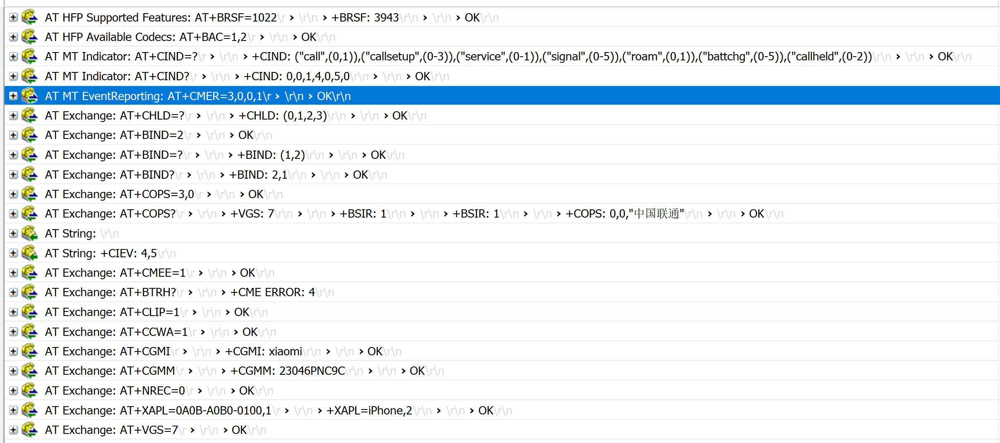

The interaction of CMER commands marks the completion of SLC establishment. Refer to the SLC establishment process in the spec, where solid lines represent mandatory operations, and others are optional.


<a id="method-check-if-the-device-supports-hfp"></a>

### Method: Check if the Device Supports HFP

When neither device initiates an HFP connection, it is recommended to check whether both devices support HFP. Typically, whether a device supports HFP can be observed through syslog, snoop logs, or air interface logs.

#### 1. Check if the Device Supports HFP via Syslog

Typical logs are as follows:

* Successful registration of HFP HF service
```text
[service_manager]: HFP-HF service register success
```

* Successful startup of HFP HF service
```text
[service_manager]: service_on_startup {HFP-HF} start ret:1
```

* Successful registration of HFP AG service
```text
[service_manager]: HFP-AG service register success
```

* Successful startup of HFP AG service
```text
[service_manager]: service_on_startup {HFP-AG} start ret:1
```

#### 2. Check if Both Devices Support HFP via Snoop Logs or Air Logs

Typical logs are as follows:

* SDP declares support for HFP-HF role

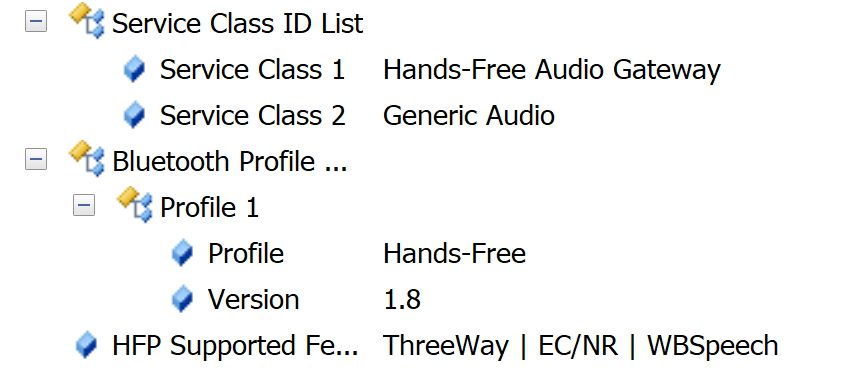

* SDP declares support for HFP-AG role

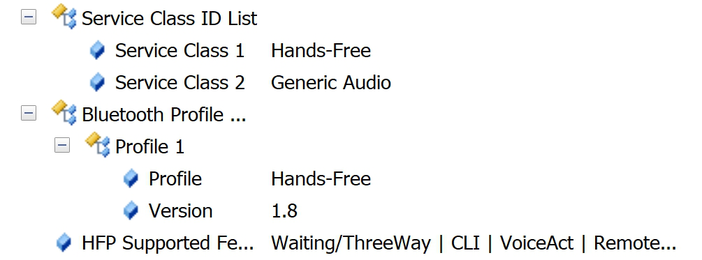

<a id="method-check-if-the-sco-connection-is-established"></a>

### Method: Check if the SCO Connection is Established

Establishing a SCO connection is required for transmitting voice during a call between two devices. Typically, whether the SCO connection is successfully established can be observed through syslog, snoop logs, or air interface logs.

#### 1. Check if the SCO Connection is Established via Syslog

* HFP HF SCO establishment complete and notification to Media
```text
[hf_stm]: Enter State=AudioOn, Peer=[AA:AA:AA:AA:AA:AA]
```

* HFP AG SCO establishment complete and notification to Media
```text
[ag_stm]: Enter State=AudioOn, Peer=[AA:AA:AA:AA:AA:AA]
```

<a id="method-check-if-sco-audio-parameters-are-set-for-media"></a>

### Method: Check if SCO Audio Parameters are Set for Media

Both AG and HF need to set SCO audio parameters for Media after the SCO connection is established. Typical logs are as follows:
```text
[Media_proxy_once:430] policy:audio:0x20556fd4 HFPSampleRate set_int 16000 _ ret:0 resp:0
[Media_proxy_once:430] policy:audio:0x20556fec AvailableDevices include sco apply ret:0 resp:0
```

<a id="method-check-if-ag-received-hf-answer-request"></a>

### Check if the AG Received the HF's Answer Request

After the HF initiates an Answer request, it needs to send an ATA command to the AG. Typically, whether the AG received the HF's Answer request can be observed through syslog, snoop logs, or air interface logs.

#### 1. Check if AG Received HF Answer Request via Syslog

```text
[hfp_ag]: ag_service_notify_call_answered
```

#### 2. Check if AG Received HF Answer Request via Snoop Logs


<a id="method-check-if-the-hf-received-the-ag-s-incoming-call-notification"></a>

### Method: Check if the HF Received the AG's Incoming Call Notification

When the AG receives an incoming call, it needs to send +CIEV and RING commands to the HF. The AG also needs to describe the incoming call details in +CLCC. Typically, whether the HF received the AG's incoming call notification can be observed through syslog, snoop logs, or air interface logs.

#### 1. Check if HF Received AG Incoming Call Notification via Syslog

```text
[hf_stm]: ProcessEvent, State=Connected, Peer=[AA:AA:AA:AA:AA:AA], Event=HF_STACK_EVENT_CALLSETUP
[hf_stm]: ProcessEvent, State=Connected, Peer=[AA:AA:AA:AA:AA:AA], Event=HF_STACK_EVENT_RING_INDICATION
[hf_stm]: ProcessEvent, State=Connected, Peer=[AA:AA:AA:AA:AA:AA], Event=HF_STACK_EVENT_CURRENT_CALLS
```

<a id="method-check-if-hf-notified-the-application-of-an-incoming-call-from-ag"></a>

### Method: Check if the HF Notified the Application of an Incoming Call from the AG

After the HF receives the AG's incoming call notification, it needs to notify the application of the call status. Typically, whether the HF notified the application of the AG's incoming call can be observed through syslog.

#### 1. Check if HF Notified the Application of the AG's Incoming Call via Syslog

```text
[hfp_hf]: hf_service_notify_callsetup
[hfp_hf]: hf_service_notify_call_state_changed
```

# Typical Issues

### Issue: AG Answers Call, but HF Has No Voice

The issue of the AG answering a call but the HF having no voice can be caused by multiple reasons. Consider the following troubleshooting methods:

* [Check if the HFP Connection is Established](#method-check-if-the-hfp-connection-is-established)

  * If at least one of the devices initiates a connection but it fails, compare it with typical logs to analyze the reason for the connection failure.

  * If neither device initiates the above connection, proceed to [Check if Both Devices Support HFP](#method-check-if-the-device-supports-hfp).

* [Check if Both Devices Have Established an SCO Connection](#method-check-if-the-sco-connection-is-established)

  * If the HFP connection is successful, observe whether both devices have established an SCO connection. Typically, the AG device should initiate the SCO connection, and on the AG side, the App usually initiates the SCO connection. (In some scenarios, the stack initiates it on its own, which requires source code analysis.)

  * If neither party initiates the SCO connection, check why the AG-side App did not initiate the SCO connection.

  * If the SCO connection is initiated but fails, compare it with typical logs to analyze the reason for the failure.

  * If the SCO connection is successfully established, proceed to [Check if SCO Audio Parameters are Set for Media](#method-check-if-sco-audio-parameters-are-set-for-media).

* [Check if SCO Audio Parameters are Set for Media](#method-check-if-sco-audio-parameters-are-set-for-media)

  * If the Bluetooth successfully sets the SCO audio parameters, the necessary process for audio transmission on the Bluetooth side is complete. Investigate the reason for no sound on the Vela Media side.

  * If the SCO audio parameters are not set, check whether the Bluetooth did not send them to Media or whether they were sent but got stuck in the inter-process communication with Media.

### Issue: HF Answers Call, but HF Has No Voice

* [Check if the AG Received the HF's Answer Request](#method-check-if-ag-received-hf-answer-request)

  * If the AG did not receive the HF's Answer request, analyze the reason by checking syslog, snoop, or air interface logs.

  * If the AG received the HF's Answer request, refer to [Issue: AG Answers Call, but HF Has No Voice](#issue-ag-answers-call-but-hf-has-no-voice) to analyze the reason for no sound on the HF side.

### Issue: As AG, Cannot Answer Calls Controlled by HF

* [Check if the AG Received the HF's Answer Request](#method-check-if-ag-received-hf-answer-request)

  * If the AG did not receive the Answer request, analyze the reason by checking the remote device.

  * If the AG received the HF's Answer request, the Telephony module needs to assist in the analysis.

  * If the AG's syslog did not receive the HF's Answer request, but the snoop log did, open the stack log and analyze the reason for the Answer failure based on the stack code.

### Issue: As HF, AG Incoming Call, but HF Has No Incoming Call Display

* [Check if the HFP Connection is Established](#method-check-if-the-hfp-connection-is-established)

  * If at least one of the devices initiates a connection but it fails, compare it with typical logs to analyze the reason for the connection failure.

  * If neither device initiates the above connection, proceed to [Check if Both Devices Support HFP](#method-check-if-the-device-supports-hfp).

* [Check if the HF Received the AG's Incoming Call Notification](#method-check-if-hf-received-ag-incoming-call-notification)

  * If the HF did not receive the AG's incoming call notification, analyze the reason by checking syslog, snoop, or air interface logs.

  * If the HF received the AG's incoming call notification, proceed to [Check if the HF Notified the Application of an Incoming Call from the AG](#method-check-if-hf-notified-the-application-of-an-incoming-call-from-ag).

* [Check if the HF Notified the Application of an Incoming Call from the AG](#method-check-if-hf-notified-the-application-of-an-incoming-call-from-ag)

  * If the HF did not report the call status, analyze the reason by checking syslog, snoop, or air interface logs.

  * If the HF reported the call status, the Telephony module needs to assist in the analysis.

# Data Transmission Issues

This chapter introduces common analysis and troubleshooting methods for issues related to high-throughput data transmission (GATT, SPP).

GATT is the Generic Attribute Profile for Bluetooth Low Energy, featuring two roles: client and server. Typically, the device that initiates the connection is the client, and the device that passively accepts the connection is the server. A device can act as both a client and a server. GATT is mainly applied in high-throughput scenarios such as iOS OTA data transmission.

## Analysis Methods

<a id="method-check-if-client-initiated-exchange-mtu"></a>

### Method: Check if the Client Device Initiated the Exchange_MTU Procedure

#### 1. Check if the Client Device Initiated the Exchange_MTU Procedure via Syslog

After the connection is established, the client usually initiates the exchange_mtu procedure. Typical syslog is as follows:
```text
[bttool] gatts_mtu_changed_callback, addr:AA:AA:AA:AA:AA:AA, mtu:514
```
If the MTU is 20, it indicates that the client did not initiate the exchange_mtu procedure, as shown in the syslog:
```text
[bttool] gatts_mtu_changed_callback, addr:AA:AA:AA:AA:AA:AA, mtu:20
```

#### 2. Check if the Client Device Initiated the Exchange_MTU Procedure via Snoop Log

Typical log is as follows:

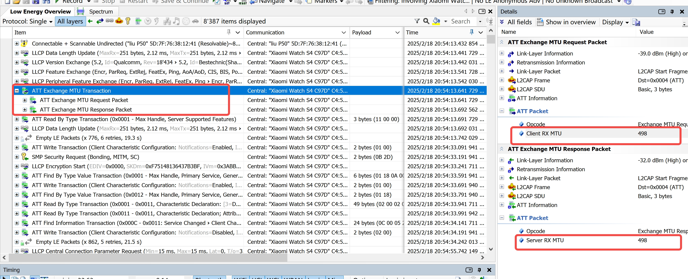

<a id="method-check-if-air-interface-is-complex"></a>

### Method: Check if the Current Air Interface Environment is Complex

The 2.4GHz ISM band used by Bluetooth (2400-2483.5MHz) is an unlicensed public band widely used by devices such as Wi-Fi, microwave ovens, ZigBee, and wireless cameras. Simultaneous operation of these devices can cause co-channel interference, leading to packet corruption or loss, ultimately resulting in a high retransmission rate in the air interface environment.

#### 1. Check if the Current Air Interface Environment is Complex via Snoop Log

The pink bars in the figure show the retransmission rate throughout the transmission process. The following indicates acceptable channel quality:


## Typical Issues

<a id="Issue: Low GATT Data Throughput"></a>

### Issue: Low GATT Data Throughput

Low GATT data throughput can be caused by multiple reasons. Consider the following troubleshooting methods:

* [Check if the Client Device Initiated the Exchange_MTU Procedure](#method-check-if-client-initiated-exchange-mtu)

  * If both devices have not negotiated the MTU, ensure the client initiates the exchange MTU process.

* [Check if the Current Air Interface Environment is Complex](#method-check-if-air-interface-is-complex)

  * If the current air interface environment is poor, leading to a high retransmission rate, consider changing the environment for testing.

# Camera Control Issues

## Analysis Methods

<a id="method-check-if-hid-channel-connection-is-successful"></a>

### Method: Check if the HID Channel Connection is Successful

#### 1. Check if the HID Channel Connection is Successful via Syslog

The following is a typical syslog, where the state field indicates a successful HID channel connection. A state value of 1 indicates connecting, and 2 indicates a successful connection.

```text
[bttool> hidd connect a4:cc:b3:xx:xx:xx
[[bttool] HID device connect host, address:a4:cc:b3:xx:xx:xx
bttool> [bttool] hidd_connection_state_cb, addr:a4:cc:b3:xx:xx:xx, transport: br, state:1
[bttool] hidd_connection_state_cb, addr:a4:cc:b3:xx:xx:xx, transport: br, state:2
```

#### 2. Check if the HID Control L2CAP Channel is Connected via Airlog or Snoop Log

The following is a typical snoop log, where the blue bars indicate a successful connection of the HID Control L2CAP Channel. The L2CAP Connection Request and L2CAP Connection Response correspond to the connection events of the Channels:

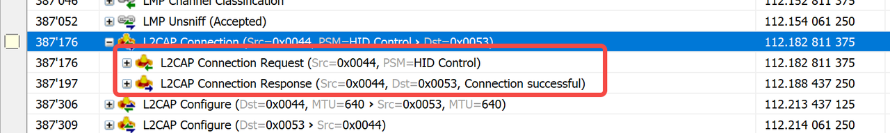

#### 3. Check if the HID Interrupt L2CAP Channel is Connected via Airlog or Snoop Log

The following is a typical snoop log, where the blue bars indicate a successful connection of the HID Interrupt L2CAP Channel. The L2CAP Connection Request and L2CAP Connection Response correspond to the connection events of the Channels:

<a id="method-check-if-hid-channel-is-disconnected-by-watch-or-phone"></a>

### Method: Check if the HID Channel is Disconnected by the Watch or Phone

#### 1. Check if the Remote Party Disconnected the HID Control or Interrupt L2CAP Channel via Airlog or Snoop Log

The following is a typical snoop log, where the blue bars indicate a disconnection of the HID L2CAP Channel. The L2CAP Disconnection Request and L2CAP Disconnection Response correspond to the disconnection events of the Channels:

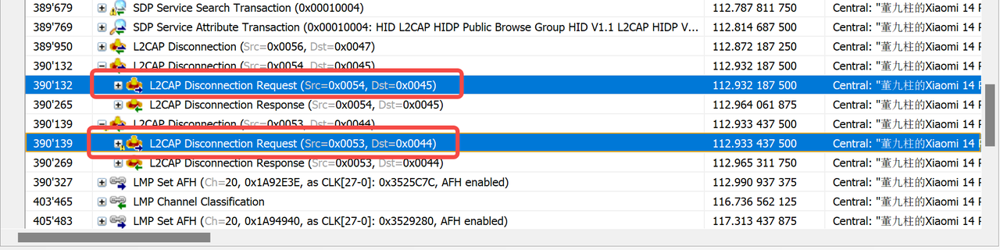

It can be seen that the HID L2CAP Channel connection is disconnected, with the phone side actively initiating the disconnection of the L2CAP channel.

<a id="method-check-if-number-of-paired-bluetooth-devices-exceeds-7"></a>

### Method: Check if the Number of Paired Bluetooth Devices on the Phone Exceeds 7

Go to Settings -> Bluetooth -> Paired Bluetooth Devices and check if the number of paired Bluetooth devices on the phone exceeds 7. If so, unpair some Bluetooth devices on the phone.

## Typical Issues

### Issue: Watch Cannot Control Phone Camera

Typically, the following methods can be used to observe whether there is an ACL connection or HID L2CAP connection between both parties, which may prevent the watch from controlling the phone camera:

* [Check if the HID Channel Connection is Successful](#method-check-if-hid-channel-connection-is-successful)

  * If the HID L2CAP channel is not connected, open the stack syslog to further confirm whether the watch initiated the HID control channel establishment process.
  * If the HID L2CAP channel is connected, further confirm whether the phone side actively disconnected.

* [Check if the HID Channel is Disconnected by the Watch or Phone](#method-check-if-hid-channel-is-disconnected-by-watch-or-phone)

  * If the watch side disconnected, open the stack syslog for further investigation.
  * If the phone side disconnected, check if the number of paired Bluetooth devices on the phone exceeds 7.

* [Check if the Number of Paired Bluetooth Devices on the Phone Exceeds 7](#method-check-if-number-of-paired-bluetooth-devices-exceeds-7)

  * If the number of paired Bluetooth devices on the phone exceeds 7, unpair some Bluetooth devices on the phone.
  * Otherwise, check if the phone supports HID and have the phone team further analyze the issue.
  