# Network Driver Adaptation Guide

\[ English | [简体中文](../../../../../zh-cn/device_dev_guide/connection/network/driver/net_driver_guide.md) \]

## I. Introduction to Network Driver

openvela has a built-in lightweight **TCP/IP** **protocol stack** and provides a network driver framework. Through this framework, the built-in TCP/IP protocol stack can interact with chip drivers to implement network packet transmission and reception.

In the network driver architecture, openvela provides a generic **Upper Half implementation**, and manufacturers only need to implement the **LowerHalf** of the driver to complete the adaptation work, thereby giving openvela the ability to access the internet.

## II. Configuration Instructions

openvela uses the Kconfig tool for feature configuration. Below are the main network-related configuration options:

### 1. Network Protocol Stack Configuration

Enable required network protocols based on needs:

```Makefile
/* Network protocol stack configuration, enable required protocols as needed */
CONFIG_NET
CONFIG_NET_TCP
CONFIG_NET_UDP
CONFIG_NET_ICMP
CONFIG_NET_IGMP
CONFIG_NET_IPv4
CONFIG_NET_IPv6
CONFIG_NET_MLD
CONFIG_NET_ROUTE
CONFIG_NET_ETHERNET
```

### 2. Driver-Related Configuration

The following options are used to configure network driver functionality:

```Makefile
/* Network Driver Configuration */
CONFIG_NETDEVICES
CONFIG_NETDEV_IOCTL
CONFIG_NETDEV_WIRELESS_HANDLER
```

## III. Data Transmission and Reception Flow

### 1. Sending process



### 2. Receiving process



## IV. Driver Adaptation Interface Description

This section introduces the design and implementation of openvela network driver adaptation interfaces, primarily based on the `nuttx/net/netdev_lowerhalf.h` file. Through these interfaces, developers can implement network device driver adaptation.

### 1. Driver Interface

#### Driver Interface Definition

The following defines the network device operation interface, including device startup, shutdown, data transmission and reception, MAC address management, and other functions.

```C
struct netdev_ops_s
{
  CODE int (*ifup)(FAR struct netdev_lowerhalf_s *dev);
  CODE int (*ifdown)(FAR struct netdev_lowerhalf_s *dev);

  CODE int (*transmit)(FAR struct netdev_lowerhalf_s *dev, FAR netpkt_t *pkt);
  CODE FAR netpkt_t (*receive)(FAR struct netdev_lowerhalf_s *dev);

  CODE int (*addmac)(FAR struct netdev_lowerhalf_s *dev, FAR const uint8_t *mac);
  CODE int (*rmmac)(FAR struct netdev_lowerhalf_s *dev, FAR const uint8_t *mac);
  CODE int (*ioctl)(FAR struct netdev_lowerhalf_s *dev, int cmd, unsigned long arg);

  CODE void (*reclaim)(FAR struct netdev_lowerhalf_s *dev);
}
```

#### Wireless Network Operation Interface

The operation interface definition for wireless network devices is as follows, supporting wireless network connection, disconnection, and related parameter read/write operations.

```C
struct wireless_ops_s
{
  CODE int (*connect)(FAR struct netdev_lowerhalf_s *dev);
  CODE int (*disconnect)(FAR struct netdev_lowerhalf_s *dev);

  iw_handler_rw essid;
  iw_handler_rw bssid;
  iw_handler_rw passwd;
  iw_handler_rw mode;
  iw_handler_rw auth;
  iw_handler_rw freq;
  iw_handler_rw bitrate;
  iw_handler_rw txpower;
  iw_handler_rw country;
  iw_handler_rw sensitivity;
  iw_handler_rw scan;
  iw_handler_ro range;
};
```

#### Network Device Structure

The core structure of a network device, `netdev_lowerhalf_s`, is defined as follows:

```C
struct netdev_lowerhalf_s
{
  FAR const struct netdev_ops_s *ops;
  FAR const struct wireless_ops_s *iw_ops;
  atomic_int quota[NETPKT_TYPENUM]; /* Max # of buffer held by driver */

  ...
};
```

#### Driver Adaptation API

Here are the main APIs for network device adaptation:

```C
int netdev_lower_register(FAR struct netdev_lowerhalf_s *dev,
                          enum net_lltype_e lltype);
int netdev_lower_unregister(FAR struct netdev_lowerhalf_s *dev);
void netdev_lower_carrier_on(FAR struct netdev_lowerhalf_s *dev);
void netdev_lower_carrier_off(FAR struct netdev_lowerhalf_s *dev);

void netdev_lower_rxready(FAR struct netdev_lowerhalf_s *dev);
void netdev_lower_txdone(FAR struct netdev_lowerhalf_s *dev);
```

#### Network Device Operation Description

Here's an API description of network device operations:

- `ifup()`: Start the network device.
- `ifdown()`: Shut down the network device.
- `transmit()`: Notify the driver to send a data packet, and the driver returns the sending result.
- `receive()`: Get received data packets from the driver, and the driver returns the reception result (packet).
- `addmac()` (optional): Add a MAC address for receiving multicast to the network device. If the device does not involve MAC address filtering, this need not be implemented.
- `rmmac()` (optional): Remove a MAC address for receiving multicast from the network device. If the device does not involve MAC address filtering, this need not be implemented.
- `ioctl()` (optional): Implement other control commands, mainly used for wireless network-related commands (can be implemented alternatively with `wireless_ops_s`).
- `reclaim()` (optional): Used for resource recovery. When the transmit buffer (TX Quota) is exhausted, the upper layer will call this interface. Mainly used for auxiliary device polling mode resource recovery. If the device can release the buffer in time and call `TX Done`, it does not need to be implemented.

### 2. NetPKT Interface

NetPKT is a data structure used by the `transmit` and `receive` interfaces to exchange network packets with the upper layer. This section will introduce the NetPKT related interfaces and their usage.

#### NetPKT Buffer Structure



- reserved: Reserved field, which might be used by the driver.
- base: The starting address of the buffer.
- data: The starting address of the data.
- free: The free part of the buffer.
- datalen: The length of the current data.
- data end: The end address of the buffer.
- next: Pointer to the next buffer (used for linked structure).

#### Buffer Interface

The following defines interfaces related to NetPKT Buffer operations:

```C
#define NETPKT_BUFLEN 1518 /* Configuration varies on different products, from 128 to 1600 */

enum netpkt_type_e
{
  NETPKT_TX,
  NETPKT_RX,
  NETPKT_TYPENUM
};

FAR netpkt_t *netpkt_alloc(FAR struct netdev_lowerhalf_s *dev,
                           enum netpkt_type_e type);
void netpkt_free(FAR struct netdev_lowerhalf_s *dev, FAR netpkt_t *pkt,
                 enum netpkt_type_e type);

/* Copy data to and from pkt buffer, usable in any scenario without concerning internal buffer structure */
int netpkt_copyin(FAR struct netdev_lowerhalf_s *dev, FAR netpkt_t *pkt,
                  FAR const uint8_t *src, unsigned int len, int offset);
int netpkt_copyout(FAR struct netdev_lowerhalf_s *dev, FAR uint8_t *dest,
                   FAR const netpkt_t *pkt, unsigned int len, int offset);

/* Get addresses directly from the buffer (used to reduce one copy operation) */
FAR uint8_t *netpkt_getdata(FAR struct netdev_lowerhalf_s *dev,
                            FAR netpkt_t *pkt);
FAR uint8_t *netpkt_getbase(FAR netpkt_t *pkt);

/* Current data length */
void netpkt_setdatalen(FAR struct netdev_lowerhalf_s *dev,
                       FAR netpkt_t *pkt, unsigned int len);
unsigned int netpkt_getdatalen(FAR struct netdev_lowerhalf_s *dev,
                               FAR netpkt_t *pkt);

/* Reset data starting point */
void netpkt_reset_reserved(FAR struct netdev_lowerhalf_s *dev,
                           FAR netpkt_t *pkt, unsigned int len);
/* Check if continuous (data in one or multiple buffers) */
bool netpkt_is_fragmented(FAR netpkt_t *pkt);
```

#### TX Buffer Layout

In openvela's network driver, the TX Buffer (Transmit Buffer) is used to store data that is about to be sent. Below is the layout structure of the TX Buffer and related explanation.


The layout structure of TX Buffer is as follows:

- reserved: Reserved field, which might be used by the driver.
- tx data: The starting address of the transmit data.
- base: The starting address of the buffer.
- data: The starting address of the data.
- free: The free part of the buffer.
- datalen: The length of the current data.
- data end: The end address of the buffer.

Note: `TX_RESERVED = LL_GUARDSIZE - LL_HDRLEN`

#### RX Buffer Layout

In openvela's network driver, the RX Buffer (Receive Buffer) is used to store received data. Below is the layout structure of the RX Buffer and related explanation.


The layout structure of RX Buffer is as follows:

- rx head: The head information of the received data.
- rx data: The starting address of the received data.
- base: The starting address of the buffer.
- data: The starting address of the data.
- free: The free part of the buffer.
- datalen: The length of the current data.
- data end: The end address of the buffer.
- reserved: Reserved field.

### 3. Other Interfaces

- `wdog`:

    - A kernel-implemented timing mechanism that can be used for timed callback of functions. For example, the execution of timed tasks.
    - Reference documentation: [System Time and Clock — NuttX latest documentation (apache.org)](https://nuttx.apache.org/docs/latest/reference/os/time_clock.html#watchdog-timer-interfaces)

- `work_queue`: An asynchronous execution mechanism implemented by the kernel using independent threads, similar to Linux's work queue, which can be used for asynchronous task processing. For example:

    - Network packet transmission and reception processing
    - Lower half processing of interrupts
    - Reference: [Work Queue Development Guide](../../../kernel/IPC/work_queue.md)

- `ninfo`, `nwarn`, `nerr`: Used to print logs of different levels for debugging network modules. To enable logging for the network module, the following configuration options need to be enabled:

    ```Makefile
    CONFIG_DEBUG_NET
    CONFIG_DEBUG_NET_ERROR
    CONFIG_DEBUG_WARN
    CONFIG_DEBUG_NET_WARN
    CONFIG_DEBUG_INFO
    CONFIG_DEBUG_NET_INFO
    ```

## V. Driver Implementation

This section introduces key parts of openvela driver implementation, including driver data structures, and methods for implementing network packet transmission and reception. The example code is based on `arch/sim/src/sim/sim_netdriver.c`.

### 1. Driver Data Structure

Here's the definition and initialization method of the driver data structure:

```C
struct <chip>_priv_s
{
  /* This holds the information visible to the Vela network */
  struct netdev_lowerhalf_s dev;

  ...
};

static const struct netdev_ops_s g_ops =
{
  .ifup     = <chip>_ifup,
  .ifdown   = <chip>_ifdown,
  .transmit = <chip>_transmit,
  .receive  = <chip>_receive,
  .addmac   = <chip>_addmac,
  .rmmac    = <chip>_rmmac,
  .ioctl    = <chip>_ioctl,
  .reclaim  = <chip>_reclaim
};

/* Wi-Fi driver registration function can be implemented as follows, <chip> refers to the chip name
 * netdev_lower_register() is the network device interface provided by vela, used to register network device drivers
 */

int <chip>_netdev_init(FAR struct <chip>_priv_s *priv)
{
    FAR struct netdev_lowerhalf_s *dev = &priv->dev;

    dev->ops = &g_ops;

    /* The maximum number of buffers the current driver can hold simultaneously
     * Transmit: Whenever the upper layer transmits a pkt to the driver, it's as if the driver is holding a pkt, reducing the tx quota.
     *   When the tx quota is used up, the upper layer will not call transmit anymore; the quota is restored after the driver releases the pkt via netpkt_free, and transmit continues
     * Receive: Whenever the driver gets a pkt via netpkt_alloc, it's as if the driver is holding a pkt, reducing the rx quota.
     *   When the rx quota is used up, netpkt_alloc will fail; the quota can be restored by submitting the pkt to the upper layer via the receive interface
     *   (can be triggered by calling netdev_lower_rxready)
     * If the driver processes each packet individually (releases immediately after use), it can be set to 1
     */
    dev->quota[NETPKT_TX] = 1;
    dev->quota[NETPKT_RX] = 1;

    return netdev_lower_register(dev, NET_LL_ETHERNET);
}
```

### 2. Network Packet Transmission

#### Data Transmission Process

1. Upper Half: Call the `transmit` interface to send data packets.
2. Lower Half: The driver processes the packets and completes the transmission.
3. Transmission Completion Notification: Notify the upper layer of the completion of transmission via `txdone`.




#### Data Transmission Code Example

```C
struct <chip>_txhead_s; /* Assuming hardware needs some headers before data */

static int <chip>_transmit(FAR struct netdev_lowerhalf_s *dev, FAR netpkt_t *pkt)
{
  FAR struct <chip>_priv_s *priv = (FAR struct <chip>_priv_s *)dev;
  unsigned int len = netpkt_getdatalen(dev, pkt);
  
  if (netpkt_is_fragmented(pkt))
    {
      /* Memory is not continuous, need to copy L2 data directly into devbuf */
      uint8_t devbuf[1600];
      netpkt_copyout(dev, devbuf + sizeof(struct <chip>_txhead_s), pkt, len, 0);

      /* Transmit */
    }
  else
    {
      /* In case of continuous memory, can also use buffer directly (optional, can always use the copy branch above) */
      FAR uint8_t *databuf = netpkt_getdata(dev, pkt);
      FAR uint8_t *devbuf  = databuf - sizeof(struct <chip>_txhead_s);

      /* Check for out-of-bounds or hardware alignment requirements (depends on NIC hardware requirements, can be omitted) */
      if (devbuf < netpkt_getbase(pkt) || check_align(devbuf) != OK)
        {
          /* Fail or fallback to copyout */
        }

      /* Transmit */
    }

  return OK;
}

static void <chip>_txdone_interrupt(FAR struct <chip>_priv_s *priv)
{
  FAR struct netdev_lowerhalf_s *dev = &priv->dev;
  
  /* Driver does some processing (if needed) */
  
  /* Release buffer and notify upper layer */
  netpkt_free(dev, pkt, NETPKT_TX);
  netdev_lower_txdone(dev);
}
```

### 3. Network Packet Reception

This section introduces the implementation process of network packet reception, including interrupt handling and the specific implementation of packet reception.




```C
struct <chip>_rxhead_s;

/* Interrupt handling */
static void <chip>_rxready_interrupt(FAR struct <chip>_priv_s *priv)
{
  FAR struct netdev_lowerhalf_s *dev = &priv->dev;
  netdev_lower_rxready(dev);
}

/* Packet reception */
static FAR netpkt_t *<chip>_receive(FAR struct netdev_lowerhalf_s *dev)
{
 /* Can also pre-allocate pkt, receive data first and then call rxready and return via receive */
  FAR netpkt_t *pkt = netpkt_alloc(dev, NETPKT_RX);

  if (pkt)
    {
#if NETPKT_BUFLEN < 15xx
      uint8_t devbuf[1600];

      /* Copy from src, len corresponds to the complete L2 data length */
      len = receive_data_into(devbuf);
      netpkt_copyin(dev, pkt, devbuf + sizeof(struct <chip>_rxhead_s), len, 0);
#else
      /* Write directly into the buffer corresponding to pkt, len corresponds to the complete L2 data length */
      len = receive_data_into(netpkt_getbase(pkt));
      netpkt_resetreserved(&priv->dev, pkt, sizeof(struct <chip>_rxhead_s));
      netpkt_setdatalen(&priv->dev, pkt, len);
#endif
    }

  return pkt;
}
```

### 4. WAPI Command Integration

WAPI (Wireless Application Protocol Interface) commands rely on the driver's `ioctl()` interface implementation. The upper layer sets or gets Wi-Fi parameters through WAPI commands to control Wi-Fi behavior. Common functions have been abstracted as interfaces; just set them to `dev->iw_ops` during initialization.

#### WAPI Interface Definition

```C
typedef int (*iw_handler_rw)(FAR struct netdev_lowerhalf_s *dev,
                             FAR struct iwreq *iwr, bool set);
typedef int (*iw_handler_ro)(FAR struct netdev_lowerhalf_s *dev,
                             FAR struct iwreq *iwr);

struct wireless_ops_s
{
  /* Connect / disconnect operation, should exist if essid or bssid exists */

  int (*connect)(FAR struct netdev_lowerhalf_s *dev);
  int (*disconnect)(FAR struct netdev_lowerhalf_s *dev);

  /* The following attributes need both set and get. */

  iw_handler_rw essid;
  iw_handler_rw bssid;
  iw_handler_rw passwd;
  iw_handler_rw mode;
  iw_handler_rw auth;
  iw_handler_rw freq;
  iw_handler_rw bitrate;
  iw_handler_rw txpower;
  iw_handler_rw country;
  iw_handler_rw sensitivity;

  /* Scan operation: start scan (set=1) / get scan result (set=0). */
  iw_handler_rw scan;

  /* Get-only attributes. */
  iw_handler_ro range;
};
```

#### WAPI Command List

The driver needs to complete the adaptation of all WAPI commands in the list; after completing these interfaces, WAPI commands can be used for verification.

| **No.** | **Item**                 | **Usage**                                             | **Results**                                                                                                                                                                     |
| :------ | :----------------------- | :---------------------------------------------------- | :------------------------------------------------------------------------------------------------------------------------------------------------------------------------------ |
| 1       | Show info                | `wapi show <ifname>`                                  | Print information about the network card corresponding to `ifname`.                                                                                                             |
| 2       | Scan                     | `wapi scan <ifname>`                                  | Print information about scanned AP.                                                                                                                                             |
| 3       | Scan SSID                | `wapi scan <ifname> <essid>`                          | Print scan information for the specified ESSID.                                                                                                                                 |
| 4       | Set channel or frequency | `wapi freq <ifname> <frequency/channel> <index/flag>` | Specify the channel in scenarios where multiple APs have the same SSID but different channels.                                                                                  |
| 5       | Set ESSID                | `wapi essid <ifname> <essid> <index/flag>`            | Set ESSID and complete network configuration. <br> Flag explanation: <br> 0: Disconnect <br> 1: Connect <br> 2: Set ESSID, but do not connect yet; connect after setting BSSID. |
| 6       | Set PSK                  | `wapi psk <ifname> <passphrase> <index/flag>`         | Set AP password and encryption type (this command is not required for open networks). <br> Flag explanation: <br> 1: WEP <br> 2: TKIP <br> 3: CCMP                              |
| 7       | Disconnect               | `wapi disconnect <ifname>`                            | Disconnect the current wireless connection (STA/AP mode); network communication will be interrupted after disconnection.                                                        |
| 8       | Set mode (STA/AP)        | `wapi mode <ifname> <index/mode>`                     | Set the working mode of the wireless network. <br> Mode explanation: <br> 2: STA mode <br> 3: AP mode                                                                           |
| 9       | Set BSSID                | `wapi ap <ifname> <MAC address>`                      | Connect to the specified BSSID (Basic Service Set Identifier) to prevent router APs from modifying the ESSID.                                                                   |
| 10      | Save config to wapi.conf | `wapi save_config <ifname>`                           | Save the current network information to the /data/wapi.conf file.                                                                                                               |
| 11      | Reconnect from wapi.conf | `wapi reconnect <ifname>`                             | Load configuration from `/data/wapi.conf` and reconnect to the network.                                                                                                         |
| 12      | Set Country Code         | `wapi country <ifname> <country code>`                | Set the country code.码。                                                                                                                                                       |
| 13      | Sensitivity(RSSI)        | `wapi sense <ifname>`                                 | Get the signal strength (RSSI, Received Signal Strength Indication) of the current connection.                                                                                  |

#### WAPI Command Usage Examples

Below are common usage scenarios for WAPI commands:

**AP Mode**

```Bash
wapi disconnect wlan0
ifup wlan0
wapi mode wlan0 3
wapi psk wlan0 <psk> 3
wapi essid wlan0 <ssid> 1
dhcpd wlan0 &
```

**STA Mode**

1. Connect via ESSID:

    ```Bash
    ifup wlan0
    wapi mode wlan0 2
    wapi psk wlan0 <psk> 3
    wapi freq wlan0 1 1
    wapi essid wlan0 <ssid> 1
    renew wlan0
    ```

2. Connect via BSSID:

    ```Bash
    ifup wlan0
    wapi mode wlan0 2
    wapi psk wlan0 <psk> 3
    wapi freq wlan0 1 1
    wapi ap wlan0 <bssid>
    renew wlan0
    ```

**Configuration Saving and Loading**

```Bash
wapi save_config wlan0   # Save the current configuration to wapi.conf
wapi reconnect wlan0     # Load the configuration from wapi.conf and reconnect
```

### 5. How to Implement Dual Network Cards (AP/STA)

In openvela's Wi-Fi framework, coexistence of AP (Access Point) and STA (Station) modes is supported. By enumerating two network card instances (such as `wlan0` and `wlan1`) during driver initialization, they can be fixed as STA mode and AP mode respectively.

#### Dual Network Card Mode Feature Description

1. Dual Functionality Support: The module can both connect to wireless hotspots in the environment (STA mode) and allow external wireless terminals to connect (AP mode).

2. DHCP Function Support:
    - On the `wlan0` interface, DHCP Client functionality is supported to dynamically obtain IP addresses from external wireless hotspots.
    - On the `wlan1` interface, DHCP Server functionality is supported to dynamically assign IP addresses to external wireless terminals.

3. Interface Independence: The STA and AP network interfaces work independently without interfering with each other:
    - When the UP/DOWN status of one interface changes, the other interface is not affected.
    - When a Wi-Fi connection is established or released on one interface, Wi-Fi connections on the other interface are not affected.

#### Driver Implementation Notes

1. Deprecated Methods:
    - The WAPI_ESSID_DELAY_ON method has been deprecated.

2. New Connection Logic:

    - When setting the MAC address of an AP, if ESSID (Extended Service Set Identifier) has not been set, no action will be triggered.
    - When setting ESSID, a connection operation will be triggered.
    - If ESSID has been set previously, setting the MAC address of the AP will also trigger a new connection.

#### Reference Implementation Code

Below are links to related implementations in Linux for reference:

- [wext-sme.c](https://elixir.bootlin.com/linux/latest/source/net/wireless/wext-sme.c#L43)（(Specific implementation)
- [wext-compat.c](https://elixir.bootlin.com/linux/latest/source/net/wireless/wext-compat.c#L1463)（(Compatibility implementation)

## VI. Testing Tools

openvela provides multiple network testing tools for driver migration and network throughput debugging. Below are descriptions and usage of relevant tools.

### 1. ping (Packet Internet Groper)

#### Function Description

- Purpose of ping: Used to test network connectivity and response time.
- Configuration Enablement: Ping functionality can be enabled by configuring the CONFIG_NETUTILS_PING option.

#### Usage Method

```Bash
Usage: ping [-c <count>] [-i <interval>] [-W <timeout>] [-s <size>] <hostname>
       ping -h

Where:
  <hostname> is either an IPv4 address or the name of the remote host
   that is requested the ICMPv4 ECHO reply.
  -c <count> determines the number of pings.  Default 10.
  -i <interval> is the default delay between pings (milliseconds).
    Default 1000.
  -W <timeout> is the timeout for wait response (milliseconds).
    Default 1000.
  -s <size> specifies the number of data bytes to be sent.  Default 56.
  -h shows this text and exits.

> r //This command sends 50 packets with 1400 bytes of data each to www.xiaomi.com at 100ms intervals, with a response timeout of 200ms
```

### 2. iperf2/3

For detailed usage instructions for iperf2 and iperf3, please refer to the following documents:

- [iperf2](../network_tools/iperf2.md)
- [iperf3](../network_tools/iperf3.md)

### 3. tcpdump

For detailed usage instructions for tcpdump, please refer to the following document:

- [tcpdump](../network_tools/tcpdump.md)
