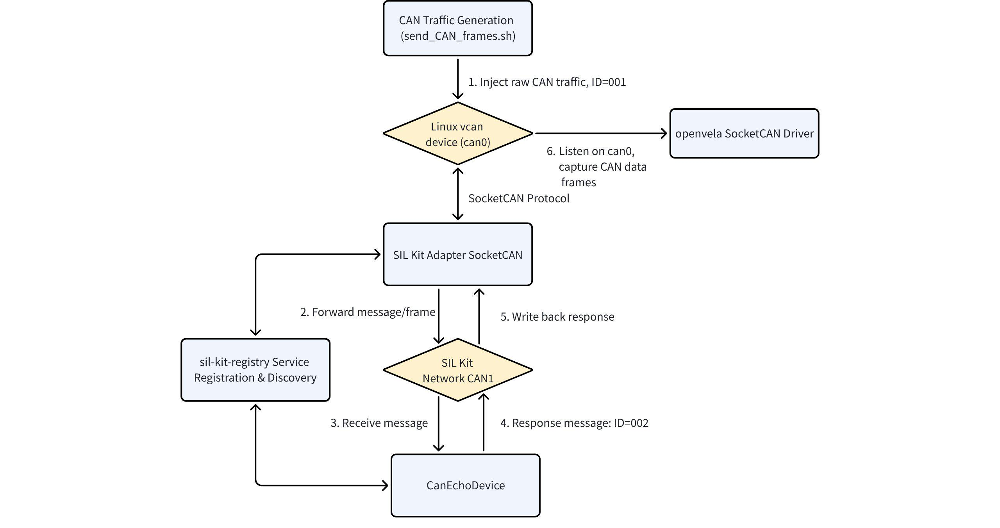
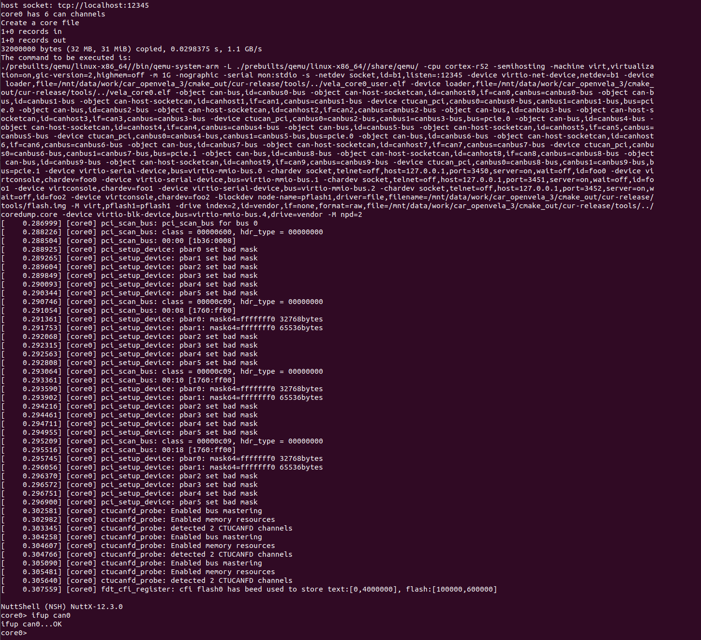
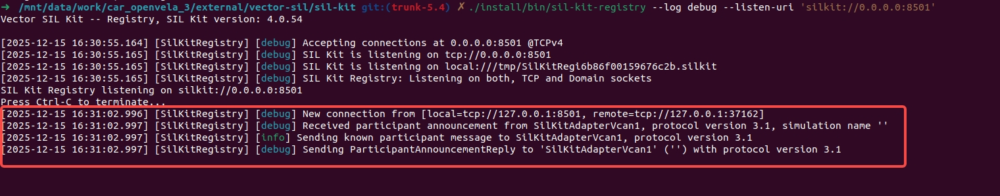
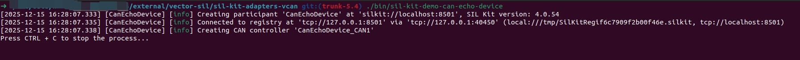
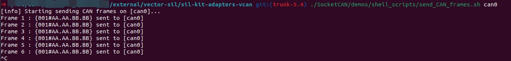
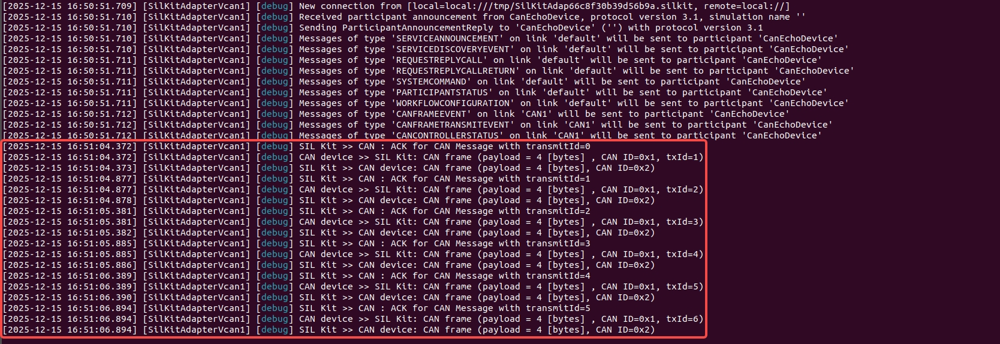

# SIL SocketCAN Functional Testing Guide

[ English | [简体中文](../../../../../zh-cn/device_dev_guide/connection/network/socketcan/sil_socketcan_test.md) ]

## I. Overview

This guide aims to demonstrate how to perform SocketCAN functional testing using openvela in a Software-in-the-Loop (SIL) environment.

Through this example, you will build and run the Vector SIL Kit toolchain, bridging the Linux host's virtual CAN interface (vcan) with the openvela simulation target to achieve CAN message transmission, reception, and loopback response testing.

## II. Test Architecture and Principles

Before executing specific operations, it is crucial to understand the relationships between components and the data flow.

### 1. Core Component Description

This test scenario involves four core components that together form a closed-loop test environment:

| **Component Name**   | **Type**        | **Functional Description**                                                                                                                                                                             |
| :------------------- | :-------------- | :----------------------------------------------------------------------------------------------------------------------------------------------------------------------------------------------------- |
| **openvela**         | OS              | The embedded operating system (System Under Test) running in the simulation environment, monitoring network traffic via the SocketCAN interface.                                                       |
| **SIL Kit Registry** | Infrastructure  | The "Command Tower" of the SIL Kit network, responsible for service discovery and coordinating connections between Participants.                                                                       |
| **SIL Kit Adapter**  | Bridge          | **The Connector**. One end connects to the Linux kernel vcan device `can0`, and the other connects to the virtual SIL Kit network, enabling message forwarding between two heterogeneous networks.     |
| **Echo Device**      | Simulation Node | **The Test Node**. A virtual device running on the SIL Kit network used to simulate an external ECU. It automatically responds to received messages to verify if the communication link is functional. |

### 2. Architecture and Data Flow Diagram



**Data Flow Analysis:**

1. **Injection**: The script sends a raw message with ID `001` to the Linux `can0`.
2. **Bridging**: The `SIL Kit Adapter` captures this message from `can0`, encapsulates it, and forwards it to the SIL Kit virtual bus.
3. **Processing**: The `Echo Device` receives the message from the virtual bus and processes it (ID+1, data bit shift).
4. **Response**: The `Echo Device` sends the processed message with ID `002` back to the virtual bus.
5. **Write-back**: The `SIL Kit Adapter` receives the response message, unpacks it, and writes it to the Linux `can0`.
6. **Verification**: Since `openvela` is constantly listening to `can0`, it captures both the original message (001) and the response message (002).

## III. Prerequisites

Before starting, please ensure your development host (Ubuntu) meets the following requirements.

### 1. Basic Environment Setup

Please refer to the official documentation [Quick Start (Ubuntu)](../quickstart/openvela_ubuntu_quick_start.md) to complete the setup of the openvela basic development environment and source code download.

### 2. SocketCAN Functional Verification

Please refer to the official documentation [SocketCAN Usage Guide](./socketcan_guide.md) to complete the execution of SocketCAN functions, ensuring you are familiar with enabling SocketCAN functionality in openvela.

## IV. Component Construction

This section will guide you through compiling the Vector SIL Kit and its adapter components.

### 1. Compiling the SIL Kit Core Library

Vector SIL Kit is an open-source library used to connect Software-in-the-Loop components.

> **Reference**: For an introduction to the SIL Kit, please visit: [GitHub - vectorgrp/sil-kit](https://github.com/vectorgrp/sil-kit)

Please execute the following commands in the `openvela` source root directory:

```Bash
# 1. Enter the dependency directory
cd ./external/vector-sil

# 2. Initialize and compile SIL Kit
cd ./sil-kit
git submodule update --init --recursive 

# Configure CMake (disable documentation and tests to speed up compilation)
cmake -S. -Bbuild -DSILKIT_BUILD_DOCS=OFF -DCMAKE_INSTALL_PREFIX=./install -DSILKIT_BUILD_TESTS=OFF

# Execute installation
cmake --build build --target install -j16
```

### 2. Compiling the SocketCAN Adapter

The adapter is used to bridge the SIL Kit network with the Linux SocketCAN device.

```Bash
# 1. Enter the adapter directory
cd ../sil-kit-adapters-vcan

# 2. Initialize and compile the adapter
git submodule update --init --recursive

# Configure CMake (specify the SIL Kit installation path)
cmake -S. -Bbuild -DSILKIT_PACKAGE_DIR=../sil-kit/install -DCMAKE_BUILD_TYPE=Debug 

# Execute compilation
cmake --build build --parallel
```

## V. Executing the Test

This test requires opening **5 independent terminal windows** to run different components respectively. Please follow the order below.

### Step 1: Start the openvela Simulation Platform (Terminal 1)

Refer to the instructions in the "Prerequisites" section to start the openvela simulator.

1. After a successful startup, the terminal will display the NSH (NuttShell) interface as follows:

    

2. Execute the following command in NSH to start the CAN device:

    ```Bash
    ifup can0
    ```

**Expected Output:**

`ifup can0...OK` indicates that the can0 device started successfully.

### Step 2: Start the SIL Kit Registry (Terminal 2)

Execute the following command in the `openvela/external/vector-sil/sil-kit/` directory:

```Bash
./install/bin/sil-kit-registry --log debug --listen-uri 'silkit://0.0.0.0:8501'
```

**Expected Output:**

Upon success, the service starts and listens on port 8501.


### Step 3: Start the vcan Adapter (Terminal 3)

This step bridges the SIL Kit virtual network `CAN1` with the Linux host's `can0` interface.

Execute the following command in the `openvela/external/vector-sil/sil-kit-adapters-vcan` directory:

```Bash
./bin/sil-kit-adapter-vcan --name SilKitAdapterVcan1 --registry-uri silkit://localhost:8501 --can-name can0 --network CAN1 --log Debug 
```

**Expected Output**: The adapter successfully connects to the registry and begins bridging the `can0` and `CAN1` networks.


At this point, **Terminal 2 (Registry)** will also refresh its log, showing that a new connection has been detected:



### Step 4: Start the Echo Demo Device (Terminal 4)

Create a `CanEchoDevice` connected to the SIL Kit CAN1 network. The `CanEchoDevice` responds to received data (CAN ID increments by one, data shifts left by one byte) and sends the response to the SIL Kit CAN1 network.

Execute the following command in the `openvela/external/vector-sil/sil-kit-adapters-vcan` directory:

```Bash
./bin/sil-kit-demo-can-echo-device
```

**Expected Output:**



**Terminal 2 (Registry)** will show that the Echo device is connected:


### Step 5: Monitor Data and Inject Traffic

1. Enable Monitoring (Terminal 1).

    Return to the terminal running openvela and enable CAN data dump monitoring in NSH:

    ```Bash
    candump can0
    ```

2. Inject Traffic (Terminal 5).

    Run the script on the Linux host to send test messages to the `can0` interface.

    Execute the following command in the `openvela/external/vector-sil/sil-kit-adapters-vcan` directory:

    ```Bash
    ./SocketCAN/demos/shell_scripts/send_CAN_frames.sh can0
    ```

    This continuously generates CAN messages (CAN ID = 001, Data=AAAABBBB) and sends them to the vcan device CAN0.

    

## VI. Result Verification and Analysis

### 1. Data Flow Analysis

After the test starts, the data flow is as follows:

1. **Terminal 5** sends raw message (ID: 001) -> Linux `can0`.
2. **Terminal 3** (Adapter) reads message from `can0` -> Forwards to SIL Kit network `CAN1`.
3. **Terminal 4** (Echo Device) receives message -> Processes (ID+1, Shift Left) -> Sends response message (ID: 002) to `CAN1`.
4. **Terminal 3** (Adapter) receives response from `CAN1` -> Writes to Linux `can0`.
5. **Terminal 1** (openvela) reads both the raw message and the response message via `candump`.

### 2. Verification Results

**Terminal 1 (openvela NSH) Output:**

In Terminal 1, the complete traffic interaction is monitored:


**Terminal 3 (Adapter) Log:**

The adapter records the message conversion process in detail:



**Conclusion**:

- The CAN frame with CAN ID 001 is the data injected into the vcan device can0 by the script `send_CAN_frames.sh`.
- The CAN frame with CAN ID 002 is the response to the message from `sil-kit-demo-can-echo-device`, where the CAN ID is incremented by 1 and the data is shifted left by 1 byte.
- openvela successfully monitored the complete interaction process via the SocketCAN interface, completing a simple test of SocketCAN communication functionality in a SIL environment.

Furthermore, other test software such as CANoe can be connected to the SIL Kit as participants to complete more comprehensive testing of SocketCAN functionality.
