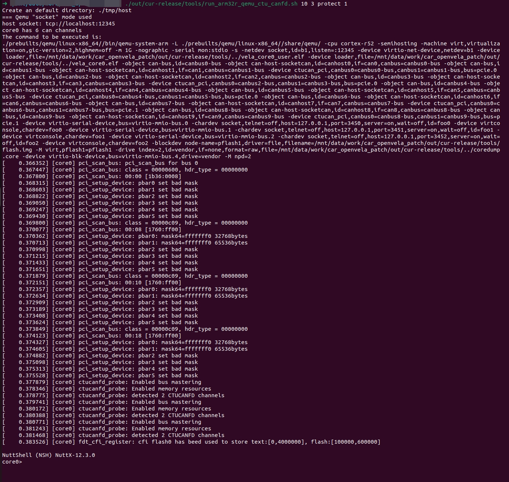

# SocketCAN User Guide

[ English | [简体中文](../../../../../zh-cn/device_dev_guide/connection/network/socketcan/socketcan_guide.md) ]

## I. Introduction to SocketCAN

**SocketCAN** is an open-source driver and network stack developed for the CAN (Controller Area Network) protocol within the Linux kernel. Unlike traditional character device drivers, SocketCAN utilizes the Berkeley Socket API network programming interface, abstracting the CAN bus as a network interface (e.g., `can0`). This makes CAN protocol development highly similar to Ethernet programming.

Introducing SocketCAN support in the openvela operating system offers the following significant advantages:

- **Standardized Interfaces**: The application layer can access the CAN bus via standard `socket`, `bind`, `write`, and `read` system calls.
- **Multiplexing**: Supports multiple applications accessing the same CAN interface simultaneously without the need to handle complex concurrency locks.
- **Tool Ecosystem**: Natively compatible with powerful standard Linux debugging tools such as `can-utils` (e.g., `candump`, `cansend`).

This guide will lead you through configuring and using this powerful functionality within the openvela SIL (Software-in-the-Loop) simulation environment.

## II. Overview

This experiment aims to establish a virtual CAN network between a Linux host and an openvela instance using the QEMU emulator to verify the feasibility of bidirectional data communication.

**Upon completing this experiment, you will achieve the following objectives:**

1. Successfully build and launch the openvela system with the SocketCAN protocol stack supported.
2. Master the methods for exchanging CAN data frames between the host and openvela.

## III. Prerequisites

Please complete the following software installation and source code preparation on the development host (Ubuntu environment).

### 1. Build Basic Development Environment

Please first refer to the official documentation [Quick Start (Ubuntu)](../quickstart/openvela_ubuntu_quick_start.md) to complete the setup of the openvela compilation environment and the downloading of source code.

### 2. Install CAN Debugging Tools

Execute the following command in the host terminal to install the `can-utils` toolkit, which is used for CAN data debugging on the Linux side:

```bash
sudo apt-get install can-utils
```

## IV. System Configuration and Build

This chapter takes the `openvela sil` platform as an example to guide you on enabling core SocketCAN functionality.

### 1. Configure Function Options (Menuconfig)

Execute the following command to enter the configuration interface for `core0`:

```bash
./build.sh vendor/openvela/boards/sil/configs/ksil_arm32r_nsh_core0 --cmake menuconfig
```

Please locate and enable the following key configuration items in the configuration menu (or confirm that the `.config` file contains the following):

```Makefile
# CAN Controller Support
CONFIG_CAN_CTUCANFD=y
CONFIG_CAN_CTUCANFD_SOCKET=y

# PCI & Bus Support
CONFIG_PCI=y
CONFIG_PCI_MSIX=y

# Networking Support
CONFIG_NET=y
CONFIG_NET_CAN=y
CONFIG_NET_SOCKOPTS=y
CONFIG_NETDEV_LATEINIT=y
CONFIG_NETDEV_IFINDEX=y

# BSD Compatibility
CONFIG_ALLOW_BSD_COMPONENTS=y

# CAN Utilities (NuttX side)
CONFIG_CANUTILS_LIBCANUTILS=y
CONFIG_CANUTILS_CANSEND=y
CONFIG_CANUTILS_CANDUMP=y

# Disable unrelated CAN drivers to avoid conflicts
CONFIG_CAN=n
CONFIG_CAN_KVASER=n
```

### 2. Compile Project

Use `protect` mode to build the Bootloader (BL) and the Core System (Core0) separately.

#### Step 1: Execute Compilation Commands

```Bash
# Build BL
./build.sh vendor/openvela/boards/sil/configs/ksil_arm32r_nsh_bl --cmake -j8

# Build Core0
./build.sh vendor/openvela/boards/sil/configs/ksil_arm32r_nsh_core0 --cmake -j8
```

#### Step 2: Deploy Build Artifacts

Create the release directory and move the ELF image files:

```Bash
mkdir ./cmake_out/cur-release/

# Copy build artifacts
cp ./cmake_out/sil_ksil_arm32r_nsh_core0/vela_core0.elf ./cmake_out/cur-release/ &&
cp ./cmake_out/sil_ksil_arm32r_nsh_core0/vela_core0_user.elf ./cmake_out/cur-release/
```

## V. Running the Simulation Environment

### 1. Create Virtual CAN Network

Execute the following commands in the **Host (Ubuntu) terminal** to load the `vcan` module and create virtual CAN nodes.

**Note**: This step requires `sudo` privileges.

```Bash
cp -r ./vendor/openvela/boards/sil/tools ./cmake_out/cur-release 

# Creation of virtual CAN nodes, creating 10 vcan nodes
sudo modprobe vcan; \
for i in {0..9}; do \
        sudo ip link add dev can$i type vcan; \
        sudo ip link set up can$i; \
done
# After adding, you can execute ifconfig to check if these interfaces exist and are running
```

### 2. Start openvela Simulation

Execute the startup script to run the QEMU environment:

```Bash
./cmake_out/cur-release/tools/run_arm32r_qemu_ctu_canfd.sh 10 3 protect 1
```

**Parameter Explanation**:

- `10`: The number of mapped CAN devices (must match the number of vcan nodes created in the previous step).
- `3`: The number of serial devices.
- `protect`: The boot mode.
- `1`: The number of startup cores.

After the system starts successfully, the terminal will display the `core0>` prompt:



## VI. Functionality Verification Experiment

This section verifies bidirectional communication between the host and openvela.

### Scenario 1: openvela Receives CAN Data

#### Step 1: Target Setup (openvela)

Start the CAN interface and listen for data in the `openvela` NSH terminal:

```Bash
ifup can0
candump can0
```

#### Step 2: Host Send (Ubuntu)

Open a new Ubuntu terminal window and send test data to `can0`:

```Bash
# Send standard frame (ID: 123, Data: 12 34 56 78)
cansend can0 123#12345678

# Send standard frame (ID: 123, Data: deadbeef)
cansend can0 123#deadbeef

# Send remote request frame (RTR)
cansend can0 123#R
```

#### Step 3: Verify Results

Observe the openvela terminal; it should display the received data frames:


### Scenario 2: openvela Sends CAN Data

#### Step 1: Host Listen (Ubuntu)

Execute the listening command in the Ubuntu terminal:

```bash
candump can0
```

#### Step 2: Target Send (openvela)

Execute the send command in the openvela NSH terminal:

```Bash
# Ensure the interface is up
ifup can0

# Send test data
cansend can0 123#12345678
cansend can0 123#deadbeef
cansend can0 123#R
```

#### Step 3: Verify Results

Observe the Ubuntu terminal; it should receive the data frames from openvela:

