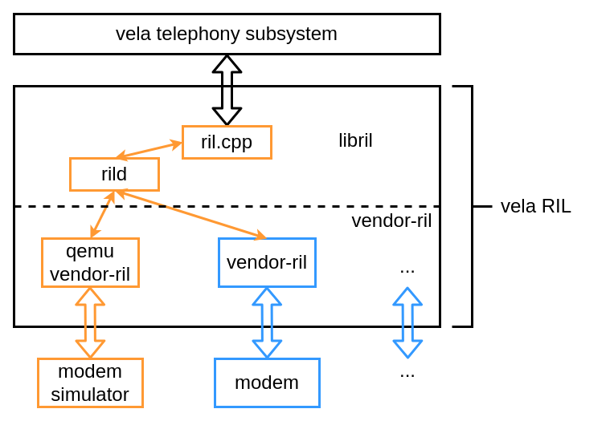

# RIL Adaptation Guide

\[ English | [Chinese (Simplified)](../../../../zh-cn/device_dev_guide/connection/telephony/ril_adaptation_guide.md) \]

This guide details the architecture of the openvela Radio Interface Layer (RIL) and provides Modem vendors with a complete workflow and technical requirements for adapting and integrating their `vendor-ril` into the openvela system.

## I. Overview

The openvela Radio Interface Layer (RIL) is a comprehensive Telephony solution heavily inspired by the Android RIL architecture. It was initially developed for the openvela QEMU emulator and has since been extended to physical hardware products.

This section introduces the core architecture of openvela RIL, the responsibilities of its components, and the collaboration model for vendor adaptation.

### 1. RIL Architecture and Components

The openvela RIL architecture consists of three core components that work together to connect the upper-level Telephony framework with the underlying Modem hardware.

- **`libril`**: An interface library that receives socket requests from the upper-level Telephony framework (oFono) and forwards them to the `rild` daemon. Its implementation is based on Android 7.0.
- **`rild`**: The core daemon that acts as a bridge between `libril` and `vendor-ril`. It manages the communication link between them and dispatches requests to `vendor-ril` for processing.
- **`vendor-ril`**: The vendor-specific implementation that directly interacts with the underlying Modem hardware or QEMU emulator (`modem_simulator`) to perform concrete communication operations. The reference implementation (`reference-ril`) provided by openvela is primarily based on Android 13 code.



### 2. Collaboration Model and Adaptation Strategy

To simplify the adaptation effort across different hardware platforms, openvela RIL adopts a strategy that separates standardization from customization, clearly defining the division of responsibilities between openvela and Modem chip vendors.

- **Common Components (Maintained by openvela)**: openvela is responsible for maintaining and providing the common `libril` library and `rild` daemon. These components remain consistent across all products running openvela and should not be modified by vendors.
- **Custom Module (`vendor-ril`) (Developed by Modem Vendors)**: Modem chip vendors only need to focus on developing and implementing the `vendor-ril` that is compatible with their hardware. This part of the code handles the specific chip's hardware interfaces, AT command set, communication protocols, and control logic.

This collaboration model, by standardizing common components and isolating custom modules, aims to significantly reduce the adaptation costs for Modem vendors and accelerate the integration of their products into the openvela ecosystem.

## II. Codebase Structure

### 1. Code Directory Introduction

The source code for openvela RIL is located in the `external/ril` repository, with its core code residing in the `external/ril/ril` subdirectory.

#### Codebase Path

```Bash
vela_source_code/external/ril
```

The top-level `external/ril` directory primarily contains the project's top-level build configuration files, while the actual core source code is located in the `external/ril/ril` subdirectory.

#### Core Directory Structure

```Bash
.
├── include         # Public RIL headers defining core data structures and interfaces
├── libril          # Common libril library implementation for communicating with the upper-level framework
├── librilutils     # Common RIL utility function library
├── reference-ril   # Reference implementation for the QEMU emulator (should not be modified by vendors)
└── rild            # Main program entry point for the RIL daemon (rild)
```

### 2. Role and Modular Design of `reference-ril`

The `reference-ril` directory provides an AT command-based RIL reference implementation. Its **sole purpose is to serve as an example** to demonstrate the basic structure of a `vendor-ril`, its interface specifications, and its interaction logic with `rild`. In the current codebase, this implementation is tailored for the QEMU emulator (`modem_simulator`) environment.

> **Note:**
>
> `reference-ril` is **not** intended to be the location for a vendor's final product code.

To improve code readability and maintainability, `reference-ril` is split into functional modules, which primarily include:

- `at_call.c`: Handles AT commands related to Calls.
- `at_data.c`: Handles AT commands related to Data services.
- `at_modem.c`: Handles AT commands related to Modem control.
- `at_network.c`: Handles AT commands related to the Network.
- `at_sim.c`: Handles AT commands related to the SIM card.
- `at_sms.c`: Handles AT commands related to SMS.
- `at_ril.c`: Handles RIL request dispatching and main logic.
- `atchannel.c`: Manages the AT command sending and receiving channel.

This modular design uses dispatch functions like `on_request_*` and `try_handle_unsol_*` to route RIL requests and unsolicited responses to the appropriate module files for processing.

> **Development Recommendation:**
>
> When developing their own `vendor-ril`, Modem vendors should follow this modular structure. This ensures that the code logic is clear and responsibilities are well-defined, greatly facilitating subsequent development, debugging, and long-term maintenance.

## III. Vendor RIL Adaptation Workflow

The core of the adaptation work is to correctly integrate the vendor-specific `vendor-ril` into the openvela build system. Please follow these steps strictly.

### Step 1: Create a Directory

> **Note:**
>
> **Do not** modify, delete, or replace any content within the `external/ril/ril/reference-ril` directory in any way.

It is recommended that you create a new `vendor-ril` directory under your chip-specific `vendor` directory to store your custom RIL code.

#### Example Directory Path

```Bash
vendor/<vendor_name>/<chip_platform_name>/<vendor-ril>/
```

### Step 2: Deploy Code and Build Scripts

Copy all your developed `vendor-ril` source files into the directory created in the previous step. At the same time, add the corresponding build system configuration files (e.g., Kconfig or `CMakeLists.txt`) in this directory to ensure the build system can correctly compile and link your code.

#### Example Directory Files

```CMake
$ tree sample_vendor_ril/
sample_vendor_ril/
├── CMakeLists.txt
├── Kconfig
└── sample_vendor_ril
    ├── at_call.c
    ├── at_call.h
    ├── atchannel.c
    ├── atchannel.h
    ├── at_data.c
    ├── at_data.h
    ├── at_modem.c
    ├── at_modem.h
    ├── at_network.c
    ├── at_network.h
    ├── at_ril.c
    ├── at_ril.h
    ├── at_sim.c
    ├── at_sim.h
    ├── at_sms.c
    ├── at_sms.h
    ├── at_tok.c
    ├── at_tok.h
    ├── misc.c
    ├── misc.h
    ├── MODULE_LICENSE_APACHE2
    └── NOTICE

1 directory, 24 files
```

### Step 3: Integrate into the openvela Build System

You need to integrate your `vendor-ril` into the system build process using `Kconfig` and `CMakeLists.txt`. The build system will automatically compile and link the common `libril` and `rild` with your `vendor-ril`, ultimately generating an `rild` daemon adapted for the target hardware.

#### 3.1 Disable the Simulator RIL

First, **disable** the default QEMU simulator RIL (`CONFIG_GOLDFISH_RIL`) through the Kconfig configuration system.

#### 3.2 Add a Kconfig Option

At the top level of your `vendor` directory, create a `Kconfig` file to add an enable option for your RIL.

**Kconfig Example (`vendor/<vendor>/<platform>/Kconfig`):**

```Makefile
#
# For a description of the syntax of this configuration file,
# see the file kconfig-language.txt in the NuttX tools repository.
#

config SAMPLE_VENDOR_RIL
        tristate "Enable SAMPLE_VENDOR_RIL"
        default n
        depends on RILD
        ---help---
                Enable sample vendor ril
```

#### 3.3 Create a `CMakeLists.txt` for `vendor-ril`

In your `vendor-ril` directory (`vendor/<vendor>/<platform>/vendor-ril/`), create a `CMakeLists.txt` file to describe how to compile your source code. This `CMakeLists.txt` only needs to focus on the source files of the `vendor-ril` itself.

**CMakeLists.txt Example (`vendor/<xxx>/<platform>/<sample_vendor_ril>/CMakeLists.txt`):**

```CMake
#
# Copyright (C) 2021 Xiaomi Corporation
#
# Licensed under the Apache License, Version 2.0 (the "License"); you may not
# use this file except in compliance with the License. You may obtain a copy of
# the License at
#
# http://www.apache.org/licenses/LICENSE-2.0
#
# Unless required by applicable law or agreed to in writing, software
# distributed under the License is distributed on an "AS IS" BASIS, WITHOUT
# WARRANTIES OR CONDITIONS OF ANY KIND, either express or implied. See the
# License for the specific language governing permissions and limitations under
# the License.
#

if(CONFIG_SAMPLE_VENDOR_RIL)
  set(SAMPLE_VENDOR_RIL_DIR ${CMAKE_CURRENT_LIST_DIR}/sample_vendor_ril)
  file(GLOB CSRCS ${SAMPLE_VENDOR_RIL_DIR}/*.c)
  set(INCDIR ${SAMPLE_VENDOR_RIL_DIR})
  set(CFLAGS -Wno-format)

  nuttx_add_library(sample_vendor_ril STATIC)

  target_compile_options(sample_vendor_ril PRIVATE ${CFLAGS})
  target_sources(sample_vendor_ril PRIVATE ${CSRCS})
  target_include_directories(sample_vendor_ril PRIVATE ${INCDIR})

endif()
```

## IV. Development Guidelines and Recommendations

### 1. Key Considerations

- **Differences Between Simulator and Physical Hardware**: `reference-ril` is designed for a limited QEMU emulator environment. When porting to physical hardware, you must account for more complex real-world scenarios, such as more comprehensive error handling, dynamic changes in signal strength, and network switching logic.
- **Remove Simulator-Specific Code**: `reference-ril` contains some code specific to the emulator (e.g., the `ENABLE_MODEM` macro). You must identify and remove this code when adapting it to your hardware.
- **Robust State Management**: To simplify its implementation, `reference-ril` uses some global variables to maintain state. In a production product, this practice can lead to race conditions and system instability. We strongly recommend that you adopt a more robust state management mechanism (e.g., a context-based struct) in your `vendor-ril`.

### 2. Development Recommendations

- **Limit a-Scope of Modifications**: Please strictly confine your code modifications to your own `vendor-ril` directory. `libril` and `rild` are common components shared across platforms. If you must modify common code, please create a patch and submit it to the developers for review and merging.
- **Implement Hardware-Specific Functions**: Some functions in `reference-ril` are simulated for the emulator (e.g., `enable modem`). You need to implement the complete logic for these functions in your `vendor-ril` based on the behavior of your actual hardware.
- **Adapt the Device Node**: The device node opened by `reference-ril` is `/dev/ttyV0`, which is a virtual serial port provided by the Goldfish emulator. You must change this to the actual device node for your Modem hardware in the system (e.g., `/dev/ttyS1` or `/dev/ttyUSB0`).

## V. Interface Requirements

Your `vendor-ril` implementation must adhere to the openvela Telephony interface specifications.

- **Request Categories**: RIL requests are divided into **mandatory** and **optional** categories. Your implementation **must** support all mandatory requests and is **recommended** to support optional requests.
- **Documentation-First Principle**: If there is a discrepancy between the `reference-ril` implementation and the interface documentation, **always follow the interface documentation**.

    - For example, the `requestSetPreferredNetworkType` function in `reference-ril`'s `at_network.c` might follow the native Android implementation instead of adhering to the `RIL_PreferredNetworkType` enum required by the documentation. In such cases, you should refer to the documentation for correct development.

## VI. RIL Adaptation Acceptance Testing

After completing the `vendor-ril` adaptation, you can use the `RILTEST` tool to perform acceptance testing and verify the correctness of your implementation.

### 1. Test Steps

1. **Disable oFono**: The `RILTEST` tool conflicts with the `oFono` service and they cannot run simultaneously. Please **disable** the `CONFIG_OFONO` option in Kconfig.

2. **Enable RILTEST**: **Enable** the `CONFIG_RIL_TEST` option in Kconfig.

3. **Rebuild the System**: Perform a full build process to generate the firmware containing `RILTEST` and flash it to the device.

4. **Push the Test Script**: Push the [run_testcase.sh](./run_testcase.sh) script to the device's data partition via `adb`.

    ```bash
    adb push run_testcase.sh /data/
    ```

5. **Run the Test**: Log in to the device via `adb shell` and run the test script.

    ```bash
    adb shell "sh /data/run_testcase.sh"
    ```

    The test tool will automatically execute a series of RIL commands and verify the Modem's responses, helping you to quickly locate and fix issues in your implementation.