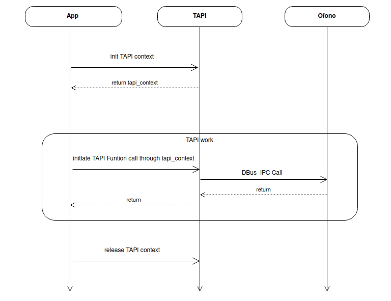

# Telephony API Developer Guide

\[ English | [简体中文](../../../../zh-cn/device_dev_guide/connection/telephony/tapi_developer_guide.md) \]

This document provides a detailed guide for application developers on using the Telephony Application Programming Interface (TAPI) on the openvela operating system.

## I. Overview

Telephony is the framework and API collection within the openvela operating system for handling communication functions. `Framework/telephony` is the interface layer that openvela provides to the application layer, also known as TAPI (Telephony API). TAPI offers a rich set of tools and interfaces designed so that application developers can easily obtain Telephony-related information and build applications by simply calling APIs, without needing to understand the internal business logic of the Telephony service (which is implemented by oFono). Additionally, Telephony supports flexible extension and customization to meet evolving communication needs.

### 1. Core Functional Modules

The series of APIs provided by Telephony includes:

- **Common Management (Common)**: Provides the master control interface for the Telephony service, responsible for initializing and managing communication functions. This is a prerequisite for using all other Telephony services.
- **Call Management (Call)**: Enables applications to implement call functions such as dialing, answering, hanging up, holding, displaying caller information, and switching between multiple calls.
- **Supplementary Service (SS)**: Allows applications to implement supplementary services provided by carriers, such as call barring, call forwarding, and call waiting.
- **Short Message Service (SMS)**: Enables applications to send and receive SMS messages, as well as manage the Short Message Service Center (SMSC) address.
- **Network**: Allows applications to query current registered network information, such as network service status and signal strength.
- **Data**: Cellular data is a wireless communication technology standard that uses packet switching for both data transmission and exchange, providing mobile devices with voice, data, and multimedia services.
- **SIM Card (SIM)**: Allows applications to retrieve SIM card status, operator name, Integrated Circuit Card Identifier (ICCID), and other information.
- **IP Multimedia Subsystem (IMS)**: Provides applications with multimedia communication capabilities, including audio/video calls, instant messaging, and conference collaboration. By calling this API, developers can access IMS services, implement High-Definition Voice (VoLTE), manage network status, and configure IMS capabilities.

### 2. Debugging and Testing

Telephony also provides a command-line debugging tool and a unit testing solution:

- **Telephony Command-Line Tool**: A tool specifically designed for developing and debugging Telephony-related functions. It wraps TAPI interfaces into commands, allowing users to perform operations like dialing, answering, hanging up, and sending SMS messages via the `telephonytool` command. For details, refer to the [Telephonytool Command](./telephonytool/telephonytool_cmd_desc.md).
- **Telephony Unit Testing Solution**: A highly reliable test suite built on the CMocka testing framework. It verifies the functionality, performance, and stability of the core Telephony code by simulating real-world scenarios such as SIM card states, network signaling, and abnormal signals, covering the entire communication link from physical layer interaction to protocol stack processing.

## II. How It Works

TAPI operates on an asynchronous, event-driven model, communicating with the underlying system Telephony service via D-Bus. Its workflow follows a standard **Initialize -> Invoke -> Release** lifecycle.

1. **Initialization**: The application calls `tapi_open()` to initialize the TAPI client, establishing a connection with the system service and obtaining a context handle (`tapi_context`).
2. **Invocation**: The application uses this handle to call the APIs of various functional modules. Most of these operations are asynchronous, with results delivered through registered callback functions.
3. **Release**: When the application exits or no longer needs communication functions, it calls `tapi_close()` to release the handle and associated resources.



## III. Prerequisites

### 1. System Build Configuration

Before you begin development, you must enable the following options in your project's `Kconfig` file to compile the Telephony framework and its dependencies into the system.

```Makefile
CONFIG_ALLOW_MIT_COMPONENTS=y
# Enable D-Bus support, which TAPI relies on for inter-process communication
CONFIG_LIB_DBUS=y
# Enable the Telephony core framework
CONFIG_TELEPHONY=y
```

### 2. Include Header Files

Include the main TAPI header file in your C source files to import all API declarations and data types.

```C
#include "tapi.h"
```

## IV. Core Development Steps

This section details the standard procedure for application developers to integrate the TAPI service.

### Step 1: Initialize the TAPI Context

Before using any TAPI function, you must call `tapi_open()` to initialize the Telephony library and obtain a context handle. This handle is required for all subsequent TAPI calls.

#### Function Prototype

```C
tapi_context tapi_open(const char* client_name, 
                       tapi_client_ready_function callback, 
                       void* user_data);
```

#### Description

Initializes the TAPI client and establishes a D-Bus connection with the system's Telephony service. This is an asynchronous process. When the service is ready, the system will invoke the `callback` function you provide.

#### Parameters

| **Parameter** | **Type**                     | **Description**                                                                                                                                                           |
| :------------ | :--------------------------- | :------------------------------------------------------------------------------------------------------------------------------------------------------------------------ |
| `client_name` | `const char*`                | A unique name for the client.<br>Must conform to D-Bus naming conventions (e.g., `com.yourcompany.yourapp`).                                                              |
| `callback`    | `tapi_client_ready_function` | The callback function to be invoked when the TAPI service is ready.<br>Defined as `typedef void (*tapi_client_ready_function)(const char* client_name, void* user_data);` |
| `user_data`   | `void*`                      | User-defined data to be passed to the `callback` function.                                                                                                                |

#### Return Value

| **Return Value** | **Description**                                                 |
| :--------------- | :-------------------------------------------------------------- |
| `tapi_context`   | On success, returns a non-`NULL` TAPI context handle `(void*)`. |
| `NULL`           | Initialization failed.                                          |

#### Code Example

```C++
#include "tapi.h"

// TAPI service-ready callback function
static void on_tapi_client_ready(const char* client_name, void* user_data)
{
    if (client_name != NULL) {
        info("tapi is ready for %s\n", client_name);
    }
        
    // After this callback is invoked, you can safely call other TAPI service APIs
}

// Initialize TAPI
static bool init_tapi(void)
{
    tapi_context t_context =
        tapi_open("telephone.tapi_test", on_tapi_client_ready, NULL);
    if (t_context == NULL) {
        return false;
    }

    return true;
}
```

### Step 2: Call Telephony Module APIs

After successful initialization, you can use the obtained `tapi_context` handle to call the APIs of various functional modules. Most operations are asynchronous, with results returned through callback functions.

#### Asynchronous Operations and Callbacks

Most TAPI operations are executed asynchronously, and their results are returned via callback functions. The callback for every asynchronous API receives a pointer to a `tapi_async_result` struct, which carries the result of the operation.

```C++
typedef struct {
    int msg_id;                  // Event ID passed by the caller, used to distinguish requests in the callback
    tapi_message_type msg_type;  // Message type (currently unused)
    int status;                  // Operation result status: 0 for success, negative for failure
    int arg1;                    // Generic parameter 1 (e.g., slot_id)
    int arg2;                    // Generic parameter 2
    void* data;                  // Pointer to returned data (e.g., a call_id string)
    void* user_obj;              // User-defined object (currently unused)
} tapi_async_result;
```

> **Note**: The specific meaning of the `arg1`, `arg2`, and `data` members depends on the API being called.

#### Example 1: Enable the Modem

The modem is the hardware foundation for all cellular services (calls, SMS, data) and must be enabled before use.

##### Function Prototype

```C
int tapi_enable_modem(tapi_context context, 
                      int slot_id, 
                      int event_id, 
                      bool enable, 
                      tapi_async_function p_handle);
```

##### Description

Asynchronously enables or disables the modem for the specified slot (`slot_id`).

##### Parameters

| **Parameter** | **Type**              | **Description**                                                                                        |
| :------------ | :-------------------- | :----------------------------------------------------------------------------------------------------- |
| `context`     | `tapi_context`        | The context handle returned by `tapi_open()`.                                                          |
| `slot_id`     | `int`                 | The slot ID (usually 0).                                                                               |
| `event_id`    | `int`                 | A user-defined event ID that will be returned in the callback.                                         |
| `enable`      | `bool`                | `true` to enable, `false` to disable.                                                                  |
| `p_handle`    | `tapi_async_function` | A pointer to the callback function. The result is passed in the `status` field of `tapi_async_result`. |

##### Asynchronous Callback

In the `p_handle` function, the `tapi_async_result` struct members are interpreted as follows:

- `status`: The operation result. `0` indicates success.
- `arg1`: The `slot_id` of the operation.

##### Code Example

You can optionally call `tapi_get_modem_status` to check the current modem status.

```C
#define EVENT_MODEM_ENABLE_DONE 101

// Callback function for the modem enable/disable operation
static void on_modem_enable_done(tapi_async_result* result)
{
    if (result->msg_id == EVENT_MODEM_ENABLE_DONE) {
        if (result->status == 0) {
            printf("Enable modem on slot %d succeeded.\n", result->arg1);
        } else {
            printf("Enable modem on slot %d failed.\n", result->arg1);
        }
    }
}

// Call the API to enable the modem
int enable_modem(void)
{
    if (g_tapi_context == NULL) {
        return -1;
    }
    // Enable the modem on slot 0
    return tapi_enable_modem(g_tapi_context, 0, EVENT_MODEM_ENABLE_DONE, true, on_modem_enable_done);
}
```

#### Example 2: Dial a Call

Dialing a call is a core function of the Call Management module.

##### Function Prototype

```C
int tapi_call_dial(tapi_context context,
                   int slot_id,
                   const char* number,
                   int hide_callerid,
                   int event_id,
                   tapi_async_function p_handle);
```

##### Description

Initiates a phone call using the specified slot.

##### Parameters

| **Parameter**   | **Type**              | **Description**                                                                                                                                                                                                                                            |
| :-------------- | :-------------------- | :--------------------------------------------------------------------------------------------------------------------------------------------------------------------------------------------------------------------------------------------------------- |
| `context`       | `tapi_context`        | The context handle.                                                                                                                                                                                                                                        |
| `slot_id`       | `int`                 | The slot ID.                                                                                                                                                                                                                                               |
| `number`        | `const char*`         | The phone number to dial.                                                                                                                                                                                                                                  |
| `hide_callerid` | `int`                 | Sets the Calling Line Identification Restriction (CLIR).<br>`0`: Default (uses the subscription's default setting)<br>`1`: Enabled (restricts CLI presentation, i.e., hides the number)<br>`2`: Disabled (allows CLI presentation, i.e., shows the number) |
| `event_id`      | `int`                 | A user-defined event ID.                                                                                                                                                                                                                                   |
| `p_handle`      | `tapi_async_function` | The callback function to receive the operation result.                                                                                                                                                                                                     |

---

| **Call Status**                | **Description**                            |
| :----------------------------- | :----------------------------------------- |
| `CALL_STATUS_UNKNOW = -1`      | Unknown or abnormal state                  |
| `CALL_STATUS_ACTIVE = 0`       | Active (in a call)                         |
| `CALL_STATUS_HELD = 1`         | Call is on hold                            |
| `CALL_STATUS_DIALING = 2`      | Dialing                                    |
| `CALL_STATUS_ALERTING = 3`     | Remote party is ringing                    |
| `CALL_STATUS_INCOMING = 4`     | Incoming call with no other active calls   |
| `CALL_STATUS_WAITING = 5`      | Incoming call while another call is active |
| `CALL_STATUS_DISCONNECTED = 6` | Call is disconnected                       |

##### Asynchronous Callback

In the `p_handle` function, the `tapi_async_result` struct members are interpreted as follows:

- `status`: The operation result. `0` indicates success.
- `arg1`: The `slot_id` of the operation.
- `data`: A `(char*)` pointer to the unique call identifier (`call_id`), such as `/ril_0/voicecall01`. 

    **Note**: This `call_id` is required for subsequent operations on this call, like hanging up.

##### Code Example

Call the `tapi_call_dial` API to make a call. The `call_id` is obtained in the callback and can be used for subsequent call operations.

```C
#define EVENT_REQUEST_DIAL_DONE 1

// Buffer to store the call ID
static char g_call_id[64] = {0};

// Callback function for the dial operation
static void on_dial_done(tapi_async_result* result)
{
    if (result->msg_id == EVENT_REQUEST_DIAL_DONE) {
        if (result->status == 0 && result->data != NULL) {
            printf("Dialing succeeded. Call ID: %s\n", (char*)result->data);
            // Save the call_id for subsequent operations (e.g., hanging up)
            strncpy(g_call_id, (char*)result->data, sizeof(g_call_id) - 1);
        } else {
            printf("Dialing failed.\n");
        }
    }
}

// Call the API to start a call
int start_call(const char* phone_number)
{
    if (g_tapi_context == NULL || phone_number == NULL) {
        return -1;
    }
    return tapi_call_dial(g_tapi_context, 0, phone_number, 0,
                          EVENT_REQUEST_DIAL_DONE, on_dial_done);
}

// Example usage
// start_call("10010");
```

#### Example 3: Set Call Waiting

Call Waiting allows a user to be notified of a new incoming call while already in an active call and provides the option to answer or reject the new call without disconnecting the current one.

##### Function Prototype

```C
int tapi_ss_set_call_waiting(tapi_context context,
                             int slot_id,
                             int event_id,
                             bool enable,
                             tapi_async_function p_handle);
```

##### Description

Asynchronously enables or disables the call waiting feature.

##### Parameters

| **Parameter** | **Type**              | **Description**                                        |
| :------------ | :-------------------- | :----------------------------------------------------- |
| `context`     | `tapi_context`        | The context handle.                                    |
| `slot_id`     | `int`                 | The slot ID.                                           |
| `event_id`    | `int`                 | The event identifier.                                  |
| `enable`      | `bool`                | `true` to enable, `false` to disable.                  |
| `p_handle`    | `tapi_async_function` | The callback function to receive the operation result. |

##### Asynchronous Callback

- `status`: The operation result. `0` indicates success.

##### Code Example

```C
#define EVENT_SET_CALL_WAITING_DONE 2

// Callback function for setting call waiting
static void on_set_call_waiting_done(tapi_async_result* result)
{
    if (result->msg_id == EVENT_SET_CALL_WAITING_DONE) {
        if (result->status == 0) {
            printf("Set call waiting succeeded.\n");
        } else {
            printf("Set call waiting failed.\n");
        }
    }
}

// Call the API to set the call waiting service
int set_call_waiting_service(int slot_id, bool enable)
{
    if (g_tapi_context == NULL) {
        return -1;
    }
    return tapi_ss_set_call_waiting(g_tapi_context, slot_id,
                EVENT_SET_CALL_WAITING_DONE, enable, on_set_call_waiting_done);
}
```

#### Example 4: Send an SMS

After activating an eSIM service and enabling cellular communication, developers can send SMS messages by calling APIs from the `Sms` module.

##### Function Prototype

```C
int tapi_sms_send_message(tapi_context context,
                          int slot_id,
                          int sms_id,
                          const char* number,
                          const char* text,
                          int event_id,
                          tapi_async_function p_handle);
```

##### Description

Sends a text-based SMS message.

##### Parameters

| **Parameter** | **Type**              | **Description**                                        |
| :------------ | :-------------------- | :----------------------------------------------------- |
| `context`     | `tapi_context`        | The context handle.                                    |
| `slot_id`     | `int`                 | The slot ID.                                           |
| `sms_id`      | `int`                 | An identifier for the SMS.                             |
| `number`      | `const char*`         | The recipient's phone number.                          |
| `text`        | `const char*`         | The content of the SMS message.                        |
| `event_id`    | `int`                 | A user-defined event ID.                               |
| `p_handle`    | `tapi_async_function` | The callback function to receive the operation result. |

##### Asynchronous Callback

In the `p_handle` function, the `tapi_async_result` struct members are interpreted as follows:

- `status`: The operation result. `0` indicates success.
- `data`: A `(char*)` pointer to the unique identifier (UUID) of the SMS.

##### Code Example

```C
#define EVENT_SEND_MESSAGE_DONE 3

// Callback function for the SMS send operation
static void on_send_sms_done(tapi_async_result* result)
{
    if (result->msg_id == EVENT_SEND_MESSAGE_DONE) {
        if (result->status == 0 && result->data != NULL) {
            printf("Send message succeeded. UUID: %s\n", (char*)result->data);
        } else {
            printf("Send message failed.\n");
        }
    }
}

// Call the API to send an SMS
int send_sms(const char* recipient, const char* message)
{
    if (g_tapi_context == NULL || recipient == NULL || message == NULL) {
        return -1;
    }
    return tapi_sms_send_message(g_tapi_context, 0, 0, recipient, message,
                                 EVENT_SEND_MESSAGE_DONE, on_send_sms_done);
}
```

#### Example 5: Enable Cellular Data

The device supports standalone 4G connectivity (independent of Bluetooth/Wi-Fi relay), but mobile data must be enabled manually to access internet services like maps, music streaming, and social apps.

##### Function Prototype

```C
int tapi_data_enable_data(tapi_context context, bool enabled);
```

##### Description

Synchronously enables or disables cellular data. This is a synchronous API that blocks until the operation is complete.

##### Parameters

| **Parameter** | **Type**       | **Description**                       |
| :------------ | :------------- | :------------------------------------ |
| `context`     | `tapi_context` | The context handle.                   |
| `enabled`     | `bool`         | `true` to enable, `false` to disable. |

##### Return Value

| **Return Value** | **Description**                    |
| :--------------- | :--------------------------------- |
| `0`              | Success.                           |
| Negative value   | Failure, indicating an error code. |

##### Code Example

```C
bool set_data_connection(bool enable)
{
    if (g_tapi_context == NULL) {
        return false;
    }

    int ret = tapi_data_enable_data(g_tapi_context, enable);
    if (ret == 0) {
        printf("Data connection status set to %s successfully.\n", enable ? "enabled" : "disabled");
        return true;
    } else {
        printf("Failed to set data connection status.\n");
        return false;
    }
}
```

### Step 3: Release the TAPI Context

When the application no longer needs the Telephony service, call `tapi_close()` to disconnect and release resources, preventing memory and D-Bus connection leaks.

#### Function Prototype

```C
int tapi_close(tapi_context context);
```

#### Code Example

```C
static void tapi_close_test()
{
    if (t_context != NULL) {
        tapi_close(t_context);
        t_context = NULL;
    }
}
```

## V. Debugging Tool

`telephonytool` is an interactive command-line tool that allows you to call TAPI functions directly on the device for rapid debugging and verification.

### 1. Configuration

Enable the following option in `Kconfig` to build `telephonytool`:

```C
CONFIG_TELEPHONY_TOOL=y
```

> **Runtime Environment**: It is recommended to run `telephonytool` in the openvela Emulator environment, as it requires the Modem Simulator. Please refer to [Emulator documentation](../../../quickstart/Set_up_the_development_environment.md) to set up the environment.

### 2. Usage Instructions

1. Enter `telephonytool` in the system's NSH command line to start the tool:

    ```Bash
    goldfish-armv7a-ap> telephonytool
    [   39.370900] [29] [ DEBUG] [ap] tapi is ready for vela.telephony.tool
    ...
    telephonytool>
    ```

2. Once inside the `telephonytool`, you can use the `help` command to view detailed command descriptions:

    ```Bash
    telephonytool> help
    =========  Telephony Tool Manual  =========
    ***** 1: Radio TAPI Instruction       *****
    ***** 2: Call TAPI Instruction        *****
    ***** 3: Data TAPI Instruction        *****
    ***** 4: SIM TAPI Instruction         *****
    ***** 5: SMS & CBS TAPI Instruction   *****
    ***** 6: Network TAPI Instruction     *****
    ***** 7: SS TAPI Instruction          *****
    ***** 8: IMS TAPI Instruction         *****
    ***** 9: Phonebook TAPI Instruction   *****
    ***** 10: TAPI open&close Instruction *****
    ***** 11: Quit                        *****
    ***** 12: Help                        *****
    Please enter your choice: (1~11)
    ```

3. Select a module number to view its specific commands. For example, enter `2` to see commands related to Call:

    ```Shell
    Please enter your choice: (1~11)
    2
    
    listen-call                         call manger event callback (enter example : listen-call 0 1 [event_id]
    unlisten-call                       call unlisten event callback (enter example : unlisten-call [watch_id] [watch_id, one uint value returned from "listen-call"]
    listen-call-slot-change             register call slot change callback (enter example : listen-call-slot-change)
    dial                                Dial (enter example : dial 0 10086 0 [slot_id][number][hide_call_id, 0:show 1:hide])
    
    ...
    ```

## VI. Testing Tool

The Telephony module provides a unit test suite based on the CMocka framework for automated testing of the core code.

### 1. Configuration

Enable the following options in `Kconfig` to build the test code:

```Bash
CONFIG_TELEPHONY=y
CONFIG_TESTING_CMOCKA=y
CONFIG_TELEPHONY_TEST=y
```

### 2. Running Tests

Execute the following command in the NSH command line to run all Telephony-related unit test cases:

```Bash
goldfish-armv7a-ap> cmocka_telephony_test
```

After you enter the command, all Telephony-related test cases will run automatically, and the results will be displayed at the end:

```Bash
[ 3728.347500] [48] [  INFO] [ap] [ RUN      ] TestTeleFunc_CallDialingThirdCall
[ 3728.348000] [48] [  INFO] [ap] [       OK ] TestTeleFunc_CallDialingThirdCall
[ 3728.348100] [48] [  INFO] [ap] [==========] CallTestSuites: 91 test(s) run.
[ 3728.348200] [48] [  INFO] [ap] [  PASSED  ] 91 test(s).
```
