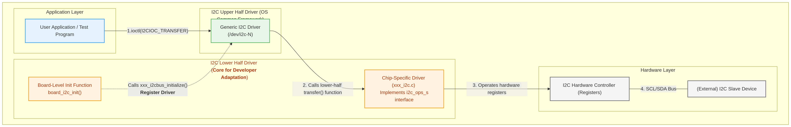

# Starting I2C Driver Adaptation

[ English | [简体中文](../../../../../zh-cn/device_dev_guide/driver/bus_driver/I2C/i2c_overview.md) ]

This guide serves as the central hub for I2C driver development in openvela. It is designed to provide a clear, comprehensive learning path for both driver developers and application engineers. Whether you need to port a new I2C controller to the openvela kernel or want to communicate with I2C devices from the application layer, you will find the necessary guidance here.

## I. Basic Concepts

Before diving into the details of driver adaptation, this chapter introduces the fundamental principles of the I2C bus and the general layered model of I2C drivers in the openvela system. This will help you quickly build a holistic understanding.

### 1. I2C Bus Introduction

I2C (Inter-Integrated Circuit) is a simple, bidirectional, half-duplex serial bus originally designed by Philips (now NXP). It requires only two signal lines for inter-device communication, making it widely used in embedded systems for connecting microcontrollers (MCUs) to peripheral devices (e.g., sensors, EEPROMs, RTCs).

**Key Features:**

- **Two-Wire System**:

    - `SCL` (Serial Clock): The serial clock line, generated by the master device to synchronize data transfers.
    - `SDA` (Serial Data): The serial data line, used for transmitting data.

- **Master-Slave Architecture**:

    - **Master**: Responsible for initiating communication, generating the SCL clock, and controlling the bus.
    - **Slave**: Passively responds to the master; each slave device has a unique address on the bus.

- **Multi-Device Support**: A single I2C bus can support multiple slave devices and even multiple master devices (multi-master mode).
- **Open-Drain Output and Pull-Up Resistors**: Both SCL and SDA lines on an I2C bus are open-drain outputs. This means that devices on the bus can only pull the signal lines low and cannot actively drive them high. Therefore, **it is mandatory to connect a pull-up resistor on both the SCL and SDA lines to VCC**. This ensures the bus is in a high state when idle. This is a critical part of I2C hardware design and a common source of issues.

### 2. openvela I2C Driver Framework Model

openvela adopts the standard **Upper/Lower Half** driver model to decouple general-purpose logic from hardware-specific implementations. This makes the driver adaptation process clear and efficient.

**The I2C driver framework is divided into three layers, each with distinct responsibilities:**

| **Layer**                 | **Role**                  | **Core Responsibilities**                                                                                                                                                                                                                                                         | **Developer's Focus**                                                                                                                             |
| :------------------------ | :------------------------ | :-------------------------------------------------------------------------------------------------------------------------------------------------------------------------------------------------------------------------------------------------------------------------------- | :------------------------------------------------------------------------------------------------------------------------------------------------ |
| **Application Layer**     | Driver User               | Accesses I2C devices through standard POSIX file interfaces (e.g., `open`, `ioctl`).                                                                                                                                                                                              | How to call `ioctl` to send the `I2CIOC_TRANSFER` command for communicating with slave devices.                                                   |
| **I2C Upper Half Driver** | Provided by the OS Kernel | Implements the generic logic for the `/dev/i2c-N` character device driver. It parses `ioctl` requests from the application layer, converts them into standard I2C messages, and calls the `transfer` function of the lower-half driver.                                           | **Developers do not need to modify this layer.**                                                                                                  |
| **I2C Lower Half Driver** | **Driver Developer**      | **This is the core part you need to adapt.** Responsible for implementing chip-specific hardware operations, such as initializing the I2C controller, configuring clocks/GPIOs, handling interrupts, and ultimately performing data transfers by manipulating hardware registers. | Implement the `struct i2c_ops_s` interface, especially the `transfer` function, and provide an `xxx_i2cbus_initialize()` initialization function. |

In short, your development work consists of writing the **lower-half driver** and registering its standard handle (`struct i2c_master_s *`) with the **upper-half driver**. This allows the **application layer** to access the I2C bus through a device node.

## II. Driver Development Guide Navigation

Based on your development goals, please choose from the following guides to learn more:

- [Adapting an I2C Master Driver](./i2c_master_guide.md)

    - Learn how to adapt a standard I2C Master driver for your chip, enabling it to actively communicate with slave devices. This is the most common development scenario.

- [Adapting an I2C Slave Driver](./i2c_slave_guide.md)

    - Learn how to configure the chip's I2C peripheral in Slave mode, allowing it to act as a peripheral and passively respond to requests from a Master.

- [Adapting an I2C Bit-Banging Driver](./i2c_bitbang_guide.md)

    - Learn how to use general-purpose GPIO pins to simulate the I2C protocol when a hardware I2C controller is not available.

- [Verifying and Debugging an I2C Driver](./i2c_verification_guide.md)

    - Learn how to verify driver functionality using a BMI160 sensor and how to troubleshoot issues with `i2ctool`, simulators, and a logic analyzer.
