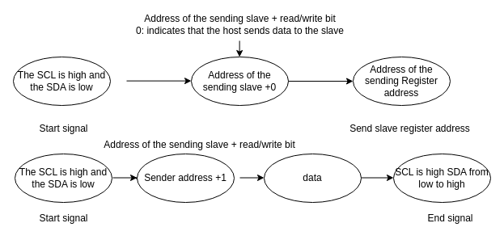
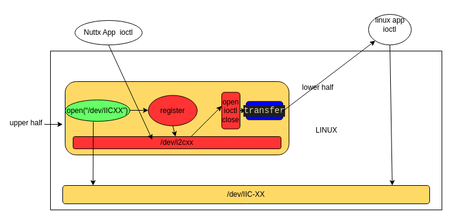

# I2C Driver Verification and Debugging

[ English | [简体中文](../../../../../zh-cn/device_dev_guide/driver/bus_driver/I2C/i2c_verification_guide.md) ]

## I. I2C Functionality Verification

This section explains how to verify the correctness of an I2C driver (whether it's a hardware driver or a bit-bang driver) by communicating with a real sensor.

We use the **BMI160** six-axis inertial sensor as the standard test device. If your development board has other integrated I2C sensors, openvela also accepts testing with that sensor, but you will need to provide the complete test cases and operating instructions accordingly.

### 1. Test Preparation

#### Hardware Preparation

- **Development Board**: I2C lower-half adaptation completed.
- **BMI160 Sensor Module**: Can be purchased from online channels, for example, via [this link](https://item.m.jd.com/product/10031826295758.html).

#### Hardware Connection

Please connect the BMI160 module to the development board correctly according to the GPIO pins you selected for the I2C bus. Refer to the wiring diagram below:

```Plain
                        VCC   GND                      
┌────────────────┐      ─┬─   ─┬─     ┌───────────────┐
│             VCC├───────┘     │      │               │
│                │             │      │               │
│             3V3├───          │      │               │
│                │             │      │               │
│             GND├─────────────┘      │               │
│BMI60           │                    │               │
│             SCL├────────────────────┤SCL  Host      │
│I2C Test Wire   │                    │               │
│             SDA├────────────────────┤SDA            │
│                │                    │               │
│SA0:          CS├─                   │               │
│  LOW  0x68     │                    │               │
│  HIGH 0x69  SA0├────────────────────┤SA0            │
└────────────────┘                    └───────────────┘
 
 0x68 BMI160_I2C_ADDR_68=y                             
 0x69 BMI160_I2C_ADDR_69=y                             
 
 BMI   Host
 SCL -- SCL
 SDA -- SDA
 SA0 -- SA0
```

#### Board-Level Code Adaptation

In the board-level startup file (e.g., `boards/.../<board>/src/xxx_bringup.c`), add the code to initialize the I2C bus and register the BMI160 sensor. This action will create a device node at `/dev/accel0`.

- Reference Code: `sim/boards/vela/src/ap.c`

<details>
<summary>Click to expand code</summary>

```C
#ifdef CONFIG_SIM_I2CBUS
  /* 1. Initialize the I2C Master bus (call the hardware or bit-bang initialization function based on your adaptation) */
  i2cbus = sim_i2cbus_initialize(CONFIG_SIM_I2CBUS_ID);
  if (i2cbus == NULL)
    {
      syslog(LOG_ERR, "ERROR: sim_i2cbus_initialize failed.\n");
    }
  else
    {
      /* 2. Register the I2C Master as /dev/i2c-0 for easy debugging */
      ret = i2c_register(i2cbus, 0);
      if (ret < 0)
        {
          syslog(LOG_ERR, "ERROR: Failed to register I2C%d driver: %d\n",
                 0, ret);
          sim_i2cbus_uninitialize(i2cbus);
        }
#if defined(CONFIG_SENSORS_BMI160) && defined(CONFIG_SENSORS_BMI160_I2C)
      else
        {
          /* 3. Register the BMI160 sensor driver */
          bmi160_register("/dev/accel0", i2cbus);
        }
#endif
    }

#endif 
```

</details>

### 2. Test Execution

#### Kconfig Configuration

Ensure the following configuration options are enabled:

<details>
<summary>Click to expand code</summary>

```Makefile
# Basic I2C configuration
CONFIG_I2C=y
CONFIG_I2C_DRIVER=y

# BMI160 sensor driver configuration
CONFIG_SENSORS_BMI160=y
CONFIG_SENSORS_BMI160_I2C=y

# BMI160 slave address configuration (choose one based on your SA0 wiring)
0x68 BMI160_I2C_ADDR_68=y                             
# 0x69 BMI160_I2C_ADDR_69=y 

# Cmocka test framework configuration
TESTING_CMOCKA=y
TESTING_DRIVER_TEST=y
```

</details>

#### Running the Test

After compiling and flashing the firmware, execute the following command in the NSH command line:

```Bash
nsh> cmocka_driver_i2c_spi
```

This test case (located at `apps/testing/drivertest/drivertest_i2c_spi.c`) will attempt to open `/dev/accel0` and read sensor data.

**Expected Result**: The test passes and prints the read sensor data. If you execute the command multiple times, you should see the data (such as acceleration values) change.

### 3. Common Troubleshooting

#### Problem 1: Device node /dev/accel0 is not created or bmi160_register fails

1. Check if the BMI160 initialization code has been added.
2. Check the hardware connection: Ensure VCC/GND/SCL/SDA are connected firmly and correctly.
3. Check the slave address: The `bmi160_register` function attempts to read the sensor's CHIP_ID (`0xD1`) during initialization. If this read fails, registration will fail. Make sure the wiring of the `SA0` pin exactly matches the slave address (`0x68` or `0x69`) configured in Kconfig.
4. Use I2C tools for debugging: If `CONFIG_SYSTEM_I2CTOOL` is enabled, you can use the `i2c` command in NSH to manually probe the bus and confirm if the sensor can be detected.

#### Problem 2: Abnormal I2C Waveform

Check if the lower-half adaptation interface, slave address, and read/write data are consistent with what is passed from the upper half.

## II. Appendix: Debugging Tools and Reference Materials

### 1. Standard I2C Communication Waveform Reference

When using a logic analyzer to capture I2C waveforms for debugging, it is crucial to understand the sequence of standard read and write operations. The following examples, using communication with a BMI160 (slave address `0x68`), illustrate the waveform sequences for two typical operations.

#### Composite Read: Reading the CHIP_ID Register (0x00)

This operation first writes the address of the register to be read, followed by a **Repeated Start signal**, and then reads the data.

- Slave Address: 0x68
- Register Address: 0x00




#### Master Write: Writing Data to a Register

This operation is used to write one byte of data to a specific register of the slave. The example below shows writing to register `0x6c`.

- Slave Address: 0x68
- Register Address: 0x6c


### 2. Simulator Support

The openvela simulation environment (Simulator) supports mapping a host machine's (e.g., a Linux PC) physical I2C bus (`/dev/i2c-*`) into the openvela simulation instance. This allows developers to connect real sensors for driver development and debugging without a physical development board.

- Implementation Framework

    

- Kconfig Configuration:

    ```Makefile
    CONFIG_I2C_DRIVER=y
    CONFIG_SIM_I2CBUS=y         # Enable SIM I2C functionality
    CONFIG_SIM_I2CBUS_LINUX=y   # Use the Linux host's I2C bus
    CONFIG_SIM_I2CBUS_ID=0      # Specify the host I2C bus number to use (e.g., corresponding to /dev/i2c-0)
    ```

### 3. Command-Line Debugging Tool: i2ctool

openvela provides a powerful command-line tool, `i2ctool`, which allows developers to interact directly with I2C devices from the NSH terminal. It is an excellent tool for troubleshooting hardware and driver issues.

- Reference Link: [i2c](https://github.com/apache/nuttx-apps/tree/master/system/i2c)

#### Kconfig Configuration

```Makefile
CONFIG_I2C=y
CONFIG_I2C_DRIVER=y    # must be defined as yes, prerequesite for i2c tools
CONFIG_SYSTEM_I2CTOOL=y

CONFIG_I2C_SLAVE=y     # I2C slave if needed
CONFIG_I2C_BITBANG=y   # bit-bang I2C if needed
CONFIG_I2C_RESET=y     # if needed
```

#### Usage Example

1. Scan the bus to confirm the device's presence.
This is the most basic first step to verify that the I2C bus itself is working correctly and that the sensor is recognized by the hardware.

    ```Bash
    # Scan I2C bus 0
    nsh> i2c dev -b 0
    ```

    <details>
    <summary>Click to expand code</summary>

    ```Bash
    nsh> i2c
    Usage: i2c <cmd> [arguments]
    Where <cmd> is one of:
    
    Show help     : ?
    List buses    : bus
    List devices  : dev [OPTIONS] <first> <last>
    Read register : get [OPTIONS] [<repetitions>]
    Dump register : dump [OPTIONS] [<num bytes>]
    Show help     : help
    Write register: set [OPTIONS] <value> [<repetitions>]
    Verify access : verf [OPTIONS] [<value>] [<repetitions>]
    
    Where common "sticky" OPTIONS include:
    [-a addr] is the I2C device address (hex).  Default: 03 Current: 03
    [-b bus] is the I2C bus number (decimal).  Default: 0 Current: 0
    [-w width] is the data width (8 or 16 decimal).  Default: 8 Current: 8
    [-s|n], send/don't send start between command and data.  Default: -n Current: -n
    [-i|j], Auto increment|don't increment regaddr on repetitions.  Default: NO Current: NO
    [-f freq] I2C frequency.  Default: 400000 Current: 400000
    
    Special non-sticky options:
    [-r regaddr] is the I2C device register index (hex).  Default: not used/sent
    
    NOTES:
    o An environment variable like $PATH may be used for any argument.
    o Arguments are "sticky". For example, once the I2C address is
    specified, that address will be re-used until it is changed.
    
    WARNING:
    o The I2C dev command may have bad side effects on your I2C devices.
    Use only at your own risk.
    nsh>
    ```

    </details>

2. Read a register to verify communication. 
    Use the `get` command to read the BMI160's CHIP_ID register (address `0x00`), whose value should be `0xD1`.

    ```Bash
    server> i2c get -b 0 -a 0x68 -r 0x00
    READ Bus: 0 Addr: 68 Subaddr: 00 Value: d1
    ```

    **Parameter Description**:

    - **-b**: Bus number
    - **-a**: Address (slave address)
    - **-r**: Register address
