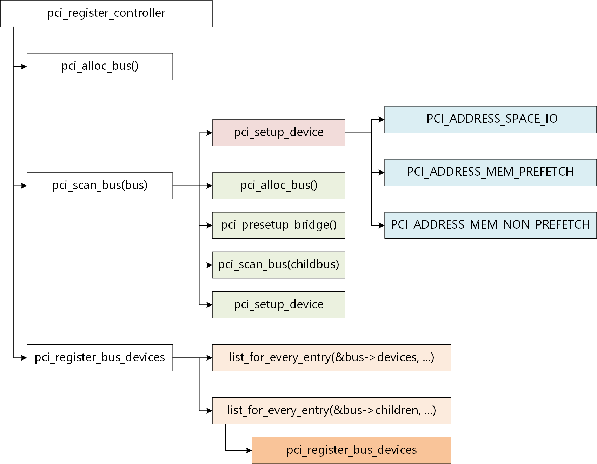
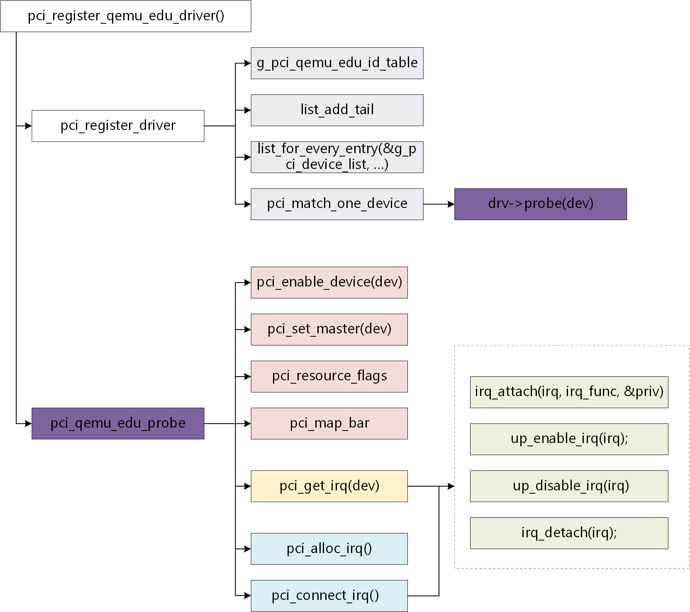
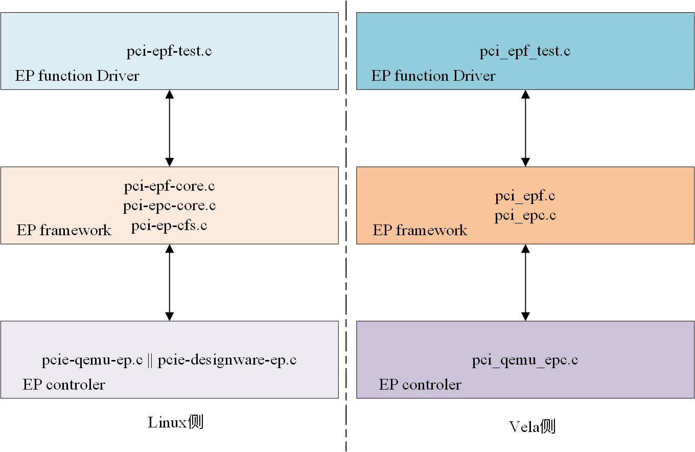
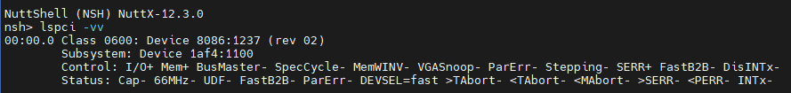
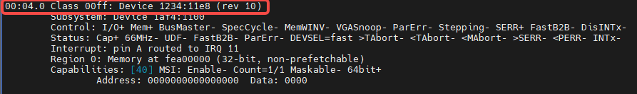

# PCI Subsystem: A Technical Deep Dive

\[ English | [简体中文](../../../../../zh-cn/device_dev_guide/driver/bus_driver/PCI/pci.md) \]

## I. PCI Subsystem Framework Overview

The PCI (Peripheral Component Interconnect) subsystem in the openvela operating system closely follows the mature model of the Linux PCI subsystem. Therefore, developers familiar with the Linux kernel can quickly grasp its core concepts.

The openvela PCI framework is mainly composed of the following three core parts:

- **PCI Controller Initialization and Bus Enumeration**: Responsible for scanning the PCI bus at system startup, discovering all connected devices, and allocating resources.
- **PCI RC (Root Complex) Driver Registration**: Manages drivers for RC-facing devices, handling the matching and initialization of devices and drivers.
- **PCI EPC (Endpoint Controller) Framework**: Supports configuring the system as a PCI Endpoint device and manages its functions.

## II. PCI Controller Initialization and Bus Enumeration

### 1. Initialization Process

After the system powers on, the PCI Host Bridge driver calls the `pci_register_controller()` function to start the initialization of the PCI subsystem. The entire process follows the standard PCI Bus Enumeration procedure.



The detailed steps are as follows:

1. **Initialize the root bus**:

    The system requests resources for the root bus (Bus 0) and initializes the relevant list structures. This includes adding the bus node to the global bus list `g_pci_buses` and initializing its `children` (subordinate buses) and `devices` lists.

2. **Depth-first traversal of devices**:

    This includes PCI-to-PCI bridges and Endpoint devices. The system calls `pci_alloc_device` to request a corresponding `struct pci_device_s` for each device and populates its data structure members.

    - **For a PCI-to-PCI bridge device:** A new PCI subordinate bus (the `child_bus` of the original bus) is requested and added to the current bus's `children` list. Next, the scan continues downward from the bridge device to its `childbus` to complete the traversal of the subordinate bus. The bridge device's configuration space is then populated, which mainly includes three parts: the I/O `base` and `limit`, the memory address `base` and `start`, and the prefetchable memory address `start` and `limit`.

    - **For a PCI Endpoint device**: The system calls `pci_alloc_device()` to allocate a `struct pci_device_s` instance for it and fills in information such as the BDF (Bus/Device/Function) number. Subsequently, the system allocates a corresponding PCI domain address for it based on the BAR (Base Address Register) space type (I/O, prefetchable memory, non-prefetchable memory). Finally, the device is added to the `devices` list of its bus, preparing it for the subsequent driver matching process.

3. **Registering Devices with the System**:

    After traversing and allocating resources for the PCI subsystem, the `pci_register_bus_devices(bus)` function is called. This function iterates through the `devices` and `children` lists on the bus and calls `pci_register_device(dev)` to register the devices from these lists with the system. If a matching driver has already been registered, the system will automatically call that driver's `probe` callback function; otherwise, the device will only be registered on the bus, awaiting the future loading of a driver.

### 2. Core Data Structures

#### `struct pci_controller_s`

This structure defines the resource pool and operations of a PCI controller.

```C
/* PCI controller resource configuration data */
struct pci_controller_s 
{
  struct pci_resource_s io;                /* I/O type PCI resources */
  struct pci_resource_s mem;               /* Non-prefetchable Mem type PCI resources */
  struct pci_resource_s mem_pref;          /* Prefetchable Mem type PCI resources */
  FAR const struct pci_ops_s *ops;

  FAR struct pci_bus_s *bus;               /* Points to the root bus */
  uint8_t busno;                           /* PCI root bus number */
  struct list_node node;                   /* Node in the global list of PCI controllers */
};
```

#### `struct pci_ops_s`

This structure defines the hook functions that the low-level hardware controller needs to implement to abstract hardware operations.

```C
/* Hook functions for the PCI controller */
struct pci_ops_s
{
  CODE int (*read)(FAR struct pci_bus_s *bus, uint32_t devfn, int where,
                   int size, FAR uint32_t *val);
  CODE int (*write)(FAR struct pci_bus_s *bus, uint32_t devfn, int where,
                    int size, uint32_t val);

  /* Return memory address for pci resource */

  CODE uintptr_t (*map)(FAR struct pci_bus_s *bus, uintptr_t start,
                        uintptr_t end);
  CODE int (*read_io)(FAR struct pci_bus_s *bus, uintptr_t addr,
                      int size, FAR uint32_t *val);
  CODE int (*write_io)(FAR struct pci_bus_s *bus, uintptr_t addr,
                       int size, uint32_t val);

  /* Get interrupt number associated with a given INTx line */

  CODE int (*get_irq)(FAR struct pci_bus_s *bus, uint32_t devfn,
                      uint8_t line, uint8_t pin);

  /* Allocate interrupt for MSI/MSI-X */

  CODE int (*alloc_irq)(FAR struct pci_bus_s *bus, uint32_t devfn,
                        FAR int *irq, int num);

  CODE void (*release_irq)(FAR struct pci_bus_s *bus, FAR int *irq, int num);

  /* Connect interrupt for MSI/MSI-X */

  CODE int (*connect_irq)(FAR struct pci_bus_s *bus, FAR int *irq,
                          int num, FAR uintptr_t *mar, FAR uint32_t *mdr);
};
```

#### `struct pci_bus_s`

This structure represents a PCI bus.

```C
/* PCI bus data structure */
struct pci_bus_s
{
  FAR struct pci_controller_s *ctrl;     /* Associated host controller */
  FAR struct pci_bus_s *parent_bus;  /* Parent bus */

  struct list_node node;     /* Node in list of buses */
  struct list_node children; /* List of child buses */
  struct list_node devices;  /* List of devices on this bus */

  uint8_t number;             /* Bus number */
};
```

### 3. Core APIs

The core of PCI subsystem initialization is registering the PCI controller:

| **Function Prototype**                                           | **Description**                                                    |
| :--------------------------------------------------------------- | :----------------------------------------------------------------- |
| `int pci_register_controller(FAR struct pci_controller_s *ctrl)` | Registers a PCI controller and starts the bus enumeration process. |
| `int pci_register_device(FAR struct pci_device_s *dev)`          | Registers a PCI device with the PCI core layer.                    |

## III. PCI RC (Root Complex) Device Driver Registration

After PCI devices and their drivers are registered with the PCI bus, the PCI core layer attempts to match each device with a suitable driver. Upon a successful match, the system calls the driver's provided `probe` callback function to initiate device initialization.

Using the PCI EDU (Educational) virtual device driver as an example, the standard process is as follows:



1. **Register the driver**:

    The driver developer implements `struct pci_driver_s`, fills in the device ID table (`id_table`) and callback functions like `probe`, and then calls `pci_register_driver()` to register the driver with the global device list.

2. **Match the device and driver**:

    When a device in the device list is successfully matched with a driver, the driver's `probe` function is called for initial configuration.

3. **Execute the `probe` function**:

    After a successful match, the system calls the driver's `probe` function, passing a `pci_device_s` instance as a parameter. The driver performs device initialization within this function, which mainly includes:

    - Calling `pci_enable_device()` to enable the device.
    - Calling `pci_set_master()` to set up the configuration space, allowing the device to act as a bus master to initiate I/O and memory access.
    - Using `pci_map_bar()` to map the BAR (Base Address Register) space, obtaining a virtual address accessible by the CPU.

4. **Configure interrupts**:

    - **Legacy INTx Interrupts**: Call `pci_get_irq()` to get the interrupt number, then register an Interrupt Service Routine (ISR) and enable the interrupt.
    - **Message Signaled Interrupts (MSI/MSI-X)**: Call `pci_alloc_irq()` to request interrupt resources, then configure the Capability register via `pci_connect_irq()`. Similarly, after obtaining the interrupt number, an ISR must be registered and the interrupt enabled.

### 1. Core Data Structures

#### `struct pci_driver_s`

This structure defines a PCI device driver.

```C
/* PCI driver data members */
struct pci_driver_s
{
  FAR const struct pci_device_id_s *id_table;           // PCI device ID table

  /* New device inserted */

  CODE int (*probe)(FAR struct pci_device_s *dev);      // probe hook function

  /* Device removed (NULL if not a hot-plug capable driver) */

  CODE void (*remove)(FAR struct pci_device_s *dev);    // remove hook function

  struct list_node node;                                // Node in the global list of drivers
};
```

#### `struct pci_device_s`

This structure represents a PCI device.

```C
/* PCI device data members */
struct pci_device_s
{
  struct list_node node;               /* Node in the global pci_device list */
  struct list_node bus_list;           /* Node in per-bus list, added to dev->bus->devices list */
  FAR struct pci_bus_s *bus;           /* Bus this device is on */
  FAR struct pci_bus_s *subordinate;   /* Bus this device bridges to (points to subordinate bus) */

  uint32_t devfn;  /* Encoded device & function index */
  uint16_t vendor; /* Vendor id */
  uint16_t device; /* Device id */
  uint16_t subsystem_vendor;
  uint16_t subsystem_device;
  uint32_t class;   /* 3 bytes: (base,sub,prog-if) */
  uint8_t revision; /* PCI revision, low byte of class word */
  uint8_t hdr_type; /* PCI header type ('multi' flag masked out) */

  /* I/O and memory regions + expansion ROMs */

  struct pci_resource_s resource[PCI_NUM_RESOURCES];

  FAR struct pci_driver_s *drv;
  FAR void *priv;                                 /* Used by pci driver */
};
```

### 2. Core APIs

| **Function Prototype**                                                      | **Description**                                                           |
| :-------------------------------------------------------------------------- | :------------------------------------------------------------------------ |
| `int pci_register_driver(FAR struct pci_driver_s *drv)`                     | Registers a PCI device driver.                                            |
| `int pci_enable_device(FAR struct pci_device_s *dev)`                       | Enables a PCI device and allocates I/O and memory resources.              |
| `void pci_set_master(FAR struct pci_device_s *dev)`                         | Enables the PCI device's control over memory and I/O read/write requests. |
| `void *pci_map_bar(FAR struct pci_device_s *dev, int bar)`                  | Maps a specified BAR space to the CPU address space.                      |
| `int pci_get_irq(FAR struct pci_device_s *dev)`                             | Gets the PCI Legacy interrupt number used by the device.                  |
| `void pci_enable_irq(FAR struct pci_device_s *dev, int irq)`                | Enables the specified PCI Legacy interrupt number.                        |
| `void pci_disable_irq(FAR struct pci_device_s *dev)`                        | Disables the PCI Legacy interrupt.                                        |
| `int pci_alloc_irq(FAR struct pci_device_s *dev, FAR int *irq, int num)`    | Allocates MSI/MSI-X interrupts.                                           |
| `void pci_release_irq(FAR struct pci_device_s *dev, FAR int *irq, int num)` | Releases allocated MSI/MSI-X interrupts.                                  |
| `int pci_connect_irq(FAR struct pci_device_s *dev, FAR int *irq, int num)`  | Configures the MSI/MSI-X interrupt Capability register.                   |

### 3. Hands-on: Booting a PCI EDU Device with QEMU

The EDU (Educational) device is a virtual PCI device provided by QEMU, making it ideal for learning and debugging PCI driver development. You can easily test your drivers in a QEMU environment.

**Example Boot Command:**

```bash
sudo qemu-system-aarch64 \
    -m 32g \
    -cpu cortex-a53 \
    -machine virt,virtualization=on,gic-version=2 \
    -kernel /path/to/your/nuttx \
    -nographic \
    -chardev stdio,id=con,mux=on \
    -serial chardev:con \
    -mon chardev=con,mode=readline \
    -device edu \
    -D ./nuttx_edu.log
```

> **Note**:
>
> Please modify the local path `/path/to/your/nuttx` in the command according to your actual environment.

## IV. PCI EPC (Endpoint Controller) Framework

The PCI EPC (Endpoint Controller) allows a system to act as an Endpoint device on the PCI bus. Its design is also inspired by Linux's three-layer model, which, from top to bottom, consists of:

1. **Endpoint Function (EPF) Driver Layer**: The driver that implements the specific functionality of the device.
2. **Endpoint Core Framework Layer**: Provides a unified interface to connect function drivers with controller drivers.
3. **Endpoint Controller (EPC) Driver Layer**: The low-level driver that interacts directly with the hardware.



### 1. EPF (Endpoint Function) Driver Flow

1. **Create the EPC device**:

    The EP Controller is a PCI device. The EPC driver acts as a standard PCI device driver. When the system detects the EP Controller hardware, its `probe` function is called. In this function, in addition to performing regular PCI initialization, `pci_epc_create()` is called to create an EPC device, which is then added to the global list `g_pci_epc_device_list`.

2. **Register the EPF device and driver**:

    A PCI EPF device is registered via `pci_epf_device_register()`, and a PCI EPF driver is registered via `pci_epf_register_driver()`. After a successful match, the corresponding driver's `probe` function is called.

3. **Bind the EPF to the EPC**:

    When an EPF device and driver are successfully matched, the core layer calls `pci_epf_bind()`. This function triggers the driver's `bind` callback. In the `bind` callback, the EPF driver associates itself with a specific EPC device and initializes the configuration space and BAR spaces.

4. **Start the EPF**:

    After the `bind` is complete, an upper-level application can initiate a `start` request, which ultimately calls the EPC driver's `start` callback function.

5. **Configure the hardware**:

    In the `start` callback, the EPC driver configures relevant hardware registers based on the EPF's features (such as MSI/MSI-X support) and enables the PCI Link.

### 2. Core Data Structures

#### `struct pci_epc_ctrl_s`

This structure represents an Endpoint Controller.

```C
/* PCI EPC control data members */
struct pci_epc_ctrl_s
{
  struct list_node epf;                               // List of EP functions; EPF will be added to this list
  FAR const struct pci_epc_ops_s *ops;
  FAR struct pci_epc_mem_s *mem;                      // EPC address space
  unsigned int num_windows;                           // Number of outbound address maps
  uint8_t max_functions;                             // Max functions (8)
  struct list_node node;                             // Node added to the global pci_epc_device list
  
  /* Mutex to protect against concurrent access of EP controller */
  mutex_t lock;
  unsigned long funcno_map;                                       // Bitmap for function numbers
  FAR void *priv;
  char name[0];
};

/* Hook functions defined by epc_ops */
static const struct pci_epc_ops_s g_qemu_epc_ops =
{
  .write_header = qemu_epc_write_header,
  .set_bar      = qemu_epc_set_bar,
  .clear_bar    = qemu_epc_clear_bar,
  .map_addr     = qemu_epc_map_addr,
  .unmap_addr   = qemu_epc_unmap_addr,
  .raise_irq    = qemu_epc_raise_irq,
  .start        = qemu_epc_start,
  .get_features = qemu_epc_get_features,
  .set_msi      = qemu_epc_set_msi,
  .get_msi      = qemu_epc_get_msi,
  .set_msix     = qemu_epc_set_msix,
  .get_msix     = qemu_epc_get_msix,
};
```

#### `struct pci_epf_driver_s`

This structure defines an Endpoint Function driver.

```C
/* PCI EPF driver data members */
struct pci_epf_driver_s
{
  CODE int (*probe)(FAR struct pci_epf_device_s *epf);
  CODE void (*remove)(FAR struct pci_epf_device_s *epf);

  struct list_node node;                               // Node in the global pci_epf_device list
  FAR struct pci_epf_ops_s *ops;                       // See g_pci_epf_test_ops below 
  FAR const struct pci_epf_device_id_s *id_table;      // See g_pci_epf_test_id_table below
};

static const struct pci_epf_ops_s g_pci_epf_test_ops =
{
  .unbind = pci_epf_test_unbind,
  .bind   = pci_epf_test_bind,
};

static const struct pci_epf_device_id_s g_pci_epf_test_id_table[] =
{
  {.name = "pci_epf_test_0", },
  {.name = "pci_epf_test_1", },
  {}
};
```

### 3. Core APIs

| **Function Prototype**                                 | **Description**                                         |
| :----------------------------------------------------- | :------------------------------------------------------ |
| `FAR struct pci_epc_ctrl_s *pci_epc_create(...)`       | Creates an Endpoint Controller device.                  |
| `void pci_epc_destroy(FAR struct pci_epc_ctrl_s *epc)` | Unregisters and releases an Endpoint Controller device. |
| `int pci_epc_start(FAR struct pci_epc_ctrl_s *epc)`    | Starts the EPC and enables the PCI Link.                |
| `void pci_epc_stop(FAR struct pci_epc_ctrl_s *epc)`    | Stops the EPC and disables the PCI Link.                |
| `int pci_epc_raise_irq(...)`                           | Raises an interrupt (INTx, MSI, MSI-X) via the EPC.     |
| `int pci_epc_set_bar(...)`                             | Configures the BAR space for a specified Function.      |
| `int pci_epc_add_epf(...)`                             | Associates an EPF device with an EPC.                   |
| `int pci_epf_device_register(...)`                     | Registers an EPF device.                                |
| `int pci_epf_register_driver(...)`                     | Registers an EPF driver.                                |

## V. Debugging Tools: pciutils

- **Code Path**: `external/pciutils`
- **Compilation**: Enable `CONFIG_PCIUTILS=y` in menuconfig.

**Usage Example (`lspci`):**





## VI. Testing Tools: pcitest

`pcitest` is a PCI Endpoint test application integrated into the `apps/testing` directory. It needs to be used in conjunction with the `pci_ep_test.c` driver to verify communication between the RC and the EP.

- **Application Path**: `apps/testing/pcitest`
- **Build Configuration**:

    - Enable `CONFIG_TESTING_PCITEST=y` to compile the `pcitest` application.
    - Enable `CONFIG_EP_TEST=y` to compile the `pci_ep_test.c` driver.

**Execution Example:**

- `pcitest` output on the RC side:

    

- Test output on the EP side:

    
