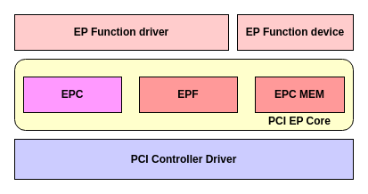
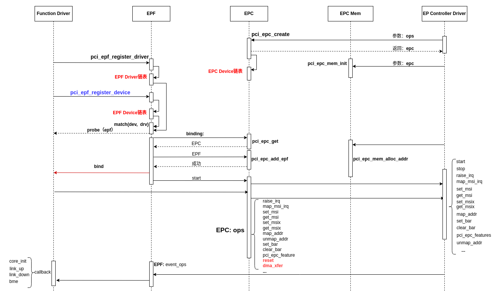

# In-Depth Analysis of the PCI Endpoint (EPC) Framework

[ English | [简体中文](../../../../../zh-cn/device_dev_guide/driver/bus_driver/PCI/pci_epc_framework.md) ]

This document provides an in-depth analysis of the PCI Endpoint Controller (EPC) framework in the openvela operating system. It covers its architectural design, core responsibilities, workflow, key data structures, and APIs, offering a comprehensive guide for developers.

## I. Glossary

| **Term/Abbreviation** | **Full English Name** | **Definition**                                                                                                                                                 |
| :-------------------- | :-------------------- | :------------------------------------------------------------------------------------------------------------------------------------------------------------- |
| **EPC**               | Endpoint Controller   | **Endpoint Controller**.<br> The low-level controller responsible for directly managing the PCI Endpoint hardware.                                             |
| **EPF**               | Endpoint Function     | **Endpoint Function**.<br> A specific PCI function implemented on an Endpoint device, such as a network or storage function.                                   |
| **BME**               | Bus Master Enable     | **Bus Master Enable**.<br> A control bit in the PCI configuration space that enables a device's ability to initiate bus transactions (e.g., DMA reads/writes). |

## II. Architectural Design and Core Responsibilities

The openvela PCI Endpoint framework uses a layered design, consisting of three main parts: the **Endpoint Controller Driver (EPC Driver)**, the **Endpoint Core Layer (Endpoint Core)**, and the **Endpoint Function Driver (EPF Driver)**.



### PCI Endpoint Core Layer

The Endpoint Core Layer is the central hub of the entire framework, and its core responsibilities are to achieve decoupling and resource management.

1. Decouple the Endpoint Device and the Endpoint Controller.

    The core layer isolates the upper-level functions from direct dependencies on the underlying hardware through two standardized sets of callback function interfaces:

    - The Endpoint Controller registers a callback function set, **`pci_epc_ops_s`**, with the PCI Endpoint Core. The Endpoint Device uses this interface to perform operations related to the Endpoint Controller.
    - The Endpoint Device registers a callback function set, **`pci_epc_event_ops_s`**, with the PCI Endpoint Core. The Endpoint Controller uses this interface to perform operations related to the EPF.

2. Manage PCI address space.

    The core layer is responsible for managing and allocating the PCI address space initialized by the low-level hardware driver.

    - The PCI address domain is typically initialized by an IP driver specific to the SoC.

    - The page size (`page_size`) of an address window (`pci_epc_mem_window_s`) is usually designed to be a multiple of 4KB to match the page size of the system's Memory Management Unit (MMU).

        ```C++
        struct pci_epc_mem_window_s
        {
          uintptr_t phys_base; //pci physical
          size_t    size;      // pci windows size
          size_t    page_size; //windows page size
        };
        ```

## III. Initialization and Binding Process

When the system is configured in PCI Endpoint mode, the initialization, driver loading, and function binding process follows these steps:



1. **Register the Endpoint Controller (EPC):**

    The EPC driver calls the `pci_epc_create()` function to register an EPC instance with the core layer and provide its set of low-level operation functions.

2. **Register the Endpoint Function Driver (EPF Driver):**

    The EPF driver, which implements a specific device function, calls `pci_epf_register_driver()` to register itself with the core layer.

3. **Register the Endpoint Function Device (EPF Device):**

    The EPF device, representing a logical function, is registered via `pci_epf_device_register()`.

4. **Match the EPF Device with its Driver:**

    The core layer matches registered EPF devices with compatible EPF drivers based on the `id_table`.

5. **Execute the EPF Driver's `probe`:**

    After a successful match, the core layer calls the EPF driver's `probe` callback function to perform initial function-level initialization.

6. **Match the EPF with the EPC:**

    Within the `probe` function, the EPF finds the corresponding EPC instance based on its `name`.

7. **Perform Binding:**

    Once the EPF and EPC are matched, the core layer begins the binding process and calls the EPF driver's `bind` callback, notifying the driver that it has been associated with the underlying hardware controller.

8. **Start the EPC:**

    After binding is complete, the upper-level logic calls `pci_epc_start()`. This triggers the EPC driver's `start` callback, which completes the final hardware register configuration and enables the PCI Link, making the device visible to the host on the PCI bus.

> **Note:** The `dma_xfer` callback in the EPC operations set provides an optional system-level DMA transfer capability. This functionality can also be implemented independently within a specific EPF driver.

## IV. Core Data Structures

### 1. `struct pci_epc_ctrl_s`: Endpoint Controller

This structure represents a physical Endpoint Controller hardware device.

```C
/* Defines the data structure for a PCI Endpoint Controller (EPC) */
struct pci_epc_ctrl_s
{
  FAR const char *name;                      /* Unique name of the EPC instance, used for binding with an EPF */
  struct list_node pci_epf;                  /* List of EPFs attached to this EPC */
  mutex_t list_lock;                         /* Mutex to protect the pci_epf list */
  FAR const struct pci_epc_ops_s *ops;       /* Set of low-level EPC operation functions */
  FAR struct pci_epc_mem_s **windows;        /* Array of address space windows for the EPC */
  FAR struct pci_epc_mem_s *mem;             /* Convenience pointer to the first address space window */
  unsigned int num_windows;                  /* Number of supported address windows */
  uint8_t max_functions;                     /* Maximum number of supported PCI Functions */
  struct list_node node;                     /* Node for linking into the global EPC list */
  mutex_t lock;                              /* Mutex to protect EPC operations */
  unsigned long function_num_map;            /* Bitmap for managing physical Function numbers */
};
```

### 2. `struct pci_epc_ops_s`: EPC Operation Callbacks

This structure defines the set of low-level hardware operation functions implemented by the EPC driver and called by upper layers.

```C
/* Defines the set of low-level operation callbacks for the EPC */
struct pci_epc_ops_s
{
  /* Configuration Space and BAR Operations */
  CODE int (*write_header)(...);
  CODE int (*set_bar)(...);
  CODE void (*clear_bar)(...);

  /* Address Mapping Operations */
  CODE int (*map_addr)(...);
  CODE void (*unmap_addr)(...);

  /* Interrupt Operations */
  CODE int (*raise_irq)(...);
  CODE int (*set_msi)(...);
  CODE int (*get_msi)(...);
  CODE int (*set_msix)(...);
  CODE int (*get_msix)(...);
  CODE int (*map_msi_irq)(...);
  
  /* Link and Feature Management */
  CODE int (*start)(...);
  CODE void (*stop)(...);
  CODE FAR const struct pci_epc_features_s *(*get_features)(...);

  /* DMA Operation (Optional) */
  CODE int (*dma_xfer)(...);
};
```

**Key Callback Function Descriptions:**

| **Callback Function**  | **Description**                                                                             |
| :--------------------- | :------------------------------------------------------------------------------------------ |
| `write_header`         | Populates the PCI configuration space header for a specified Function.                      |
| `set_bar`              | Configures the BAR (Base Address Register) for a specified Function.                        |
| `clear_bar`            | Operation to reset the BAR.                                                                 |
| `map_addr`             | Maps a local CPU address to a PCI bus address.                                              |
| `unmap_addr`           | Unmaps the mapping between a CPU address and a PCI bus address.                             |
| `set_msi` / `set_msix` | Sets the requested number of MSI / MSI-X interrupts in the capability register.             |
| `get_msi` / `get_msix` | Gets the number of MSI / MSI-X interrupts allocated by the RC from the capability register. |
| `raise_irq`            | Raises a Legacy, MSI, or MSI-X interrupt.                                                   |
| `map_msi_irq`          | Maps a physical address to an MSI address and returns the MSI data.                         |
| `start`                | Starts the PCI Link, making the device visible on the bus.                                  |
| `stop`                 | Stops the PCI Link.                                                                         |
| `get_features`         | Gets the features supported by the EPC hardware (e.g., interrupt modes, BAR sizes).         |
| `dma_xfer`             | Transfers data between host memory and local device memory using a system-level DMA.        |

### 3. `struct pci_epf_driver_s`: Endpoint Function Driver

This structure defines an EPF driver, including matching information and core callback functions.

```C
/* Defines the data structure for a PCI Endpoint Function (EPF) driver */
struct pci_epf_driver_s
{
  CODE int (*probe)(FAR struct pci_epf_device_s *epf);
  CODE void (*remove)(FAR struct pci_epf_device_s *epf);

  struct list_node node;
  FAR struct pci_epf_ops_s *ops;                   /* EPF operation callbacks (e.g., bind/unbind) */
  FAR const struct pci_epf_device_id_s *id_table;  /* EPF device ID table for device-driver matching */
};

/* Defines the matching ID for an EPF driver */
struct pci_epf_device_id_s
{
  char name[PCI_EPF_NAME_SIZE];
  unsigned long driver_data;
};
```

- **`id_table`**: Identifies the EPF devices supported by this driver. The core layer uses this table to match devices with drivers.
- **`ops`**: A set of callback functions implemented by the EPF driver (e.g., `bind` and `unbind`) to respond to bind/unbind events from the core layer.

### 4. `struct pci_epf_device_s`: Endpoint Function Device

This structure represents a logical Endpoint Function, defining its resource requirements and state.

```C
/* Defines the data structure for a PCI Endpoint Function (EPF) device */
struct pci_epf_device_s
{
  FAR const char *name;                      /* Unique name of the EPF device */
  FAR struct pci_epf_header_s *header;       /* Pointer to the standard configuration space header */
  struct pci_epf_bar_s bar[6];               /* BAR configuration required by the EPF */
  uint8_t msi_interrupts;                    /* Number of requested MSI interrupts */
  uint16_t msix_interrupts;                  /* Number of requested MSI-X interrupts */
  uint8_t func_no;                           /* Unique physical Function number within the EPC */

  FAR struct pci_epc_ctrl_s *epc;            /* Pointer to the bound EPC */
  FAR struct pci_epf_driver_s *driver;       /* Pointer to the bound EPF driver */
  FAR const struct pci_epf_device_id_s *id;  /* Pointer to the device ID */
  struct list_node node;                     /* Node for linking into the EPC's pci_epf list */
  
  mutex_t lock;                              /* Mutex to protect EPF operations */
  unsigned int is_bound;                     /* Flag to indicate if the bind callback has been called */
  FAR const struct pci_epc_event_ops_s *event_ops; /* Callback set for receiving EPC events */
};
```

## V. Core API Descriptions

### 1. EPC Core Layer Interfaces (`pci-epc-core.c`, `pci-epc-mem.c`)

These APIs are primarily called by the EPC driver and internally by the Endpoint Core Layer.

| **Function Prototype**     | **Description**                                                                                                                                         |
| :------------------------- | :------------------------------------------------------------------------------------------------------------------------------------------------------ |
| `pci_epc_create()`         | Creates, initializes, and registers an EPC device instance with the EPC core layer.                                                                     |
| `pci_epc_destroy()`        | Unregisters and destroys a previously created EPC device instance.                                                                                      |
| `pci_epc_start()`          | Triggers the startup sequence of the EPC hardware, enabling the PCI Link.                                                                               |
| `pci_epc_raise_irq()`      | After the EP side completes a write/read operation, triggers a Legacy, MSI, or MSI-X interrupt to the RC (Root Complex) to notify it of the completion. |
| `pci_epc_add_epf()`        | Associates (binds) an EPF device with a specified EPC.                                                                                                  |
| `pci_epc_linkup()`         | Notifies the EPF device that the EPC has established a PCI Link with the RC.                                                                            |
| `pci_epc_init_notify()`    | Notifies that the EPC has completed initialization.                                                                                                     |
| `pci_epc_bme_notify()`     | Notifies the EPF device after the EPC device receives a BME (Bus Master Enable) event.                                                                  |
| `pci_epc_mem_init()`       | Initializes the memory address space for a PCI Endpoint Controller device.                                                                              |
| `pci_epc_mem_alloc_addr()` | Allocates a block of memory from the EPC's address space for mapping from the Memory domain to the PCI domain.                                          |
| `pci_epc_set_bar()`        | Configures the data for a specific BAR in an Endpoint device.                                                                                           |
| `pci_epc_map_addr()`       | Maps CPU address space to PCI domain address space, used for allocating BAR address space.                                                              |
| `pci_epc_map_msi_irq()`    | Maps a physical address to an MSI address.                                                                                                              |

### 2. EPF Core Layer Interfaces (`pci-epf-core.c`)

These APIs are primarily called by EPF drivers.

| **Function Prototype**      | **Description**                                                                              |
| :-------------------------- | :------------------------------------------------------------------------------------------- |
| `pci_epf_register_driver()` | Registers an EPF driver.                                                                     |
| `pci_epf_device_register()` | Registers an EPF device instance.                                                            |
| `pci_epf_alloc_space()`     | Allocates a memory region for an EPF to be used for BAR mapping.                             |
| `pci_epf_bind()`            | Binds an EPF with a matching EPC, typically called within the EPF driver's `probe` function. |

## VI. Summary and Key Features

1. **Physical Device Support:**

    The current framework focuses on physical hardware and does not support virtualized EPF (Virtual EPF) or EPC (Virtual EPC).

2. **Multi-Function Device Support:**

    The framework supports binding multiple different EPFs to a single physical EPC, thereby enabling multi-function devices.

3. **Flexible Testing and Verification:**

    Developers can register multiple EPF device instances via the `pci_epf_device_register` API to facilitate the development, testing, and verification of multi-function devices.
