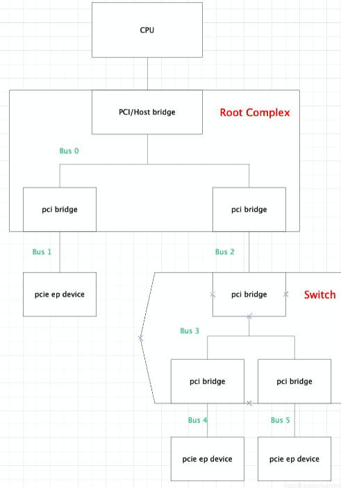
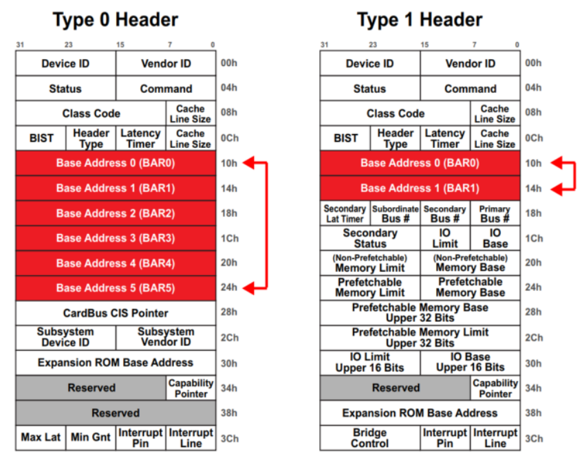
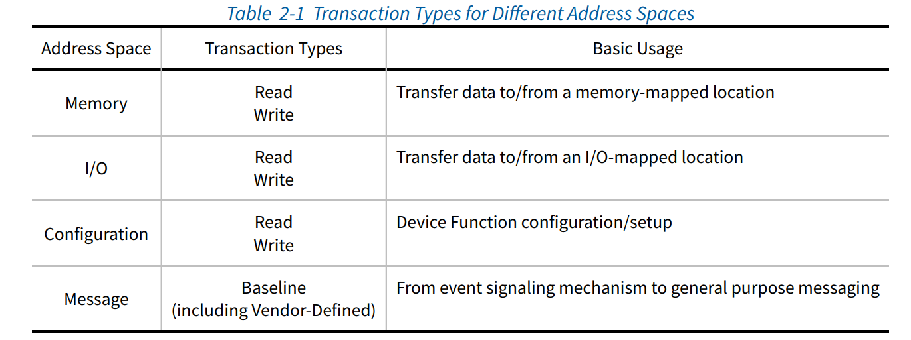
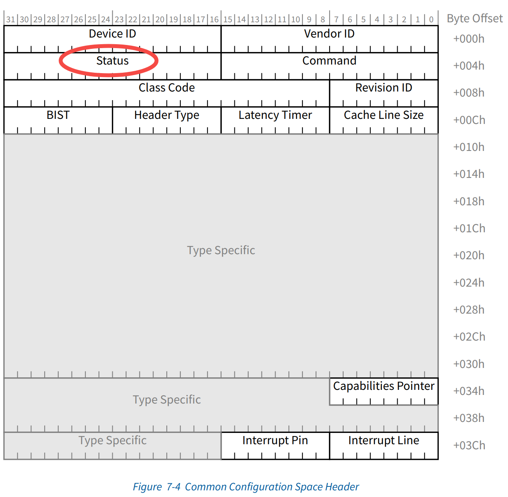
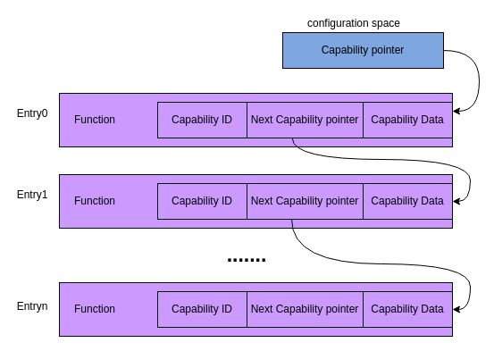
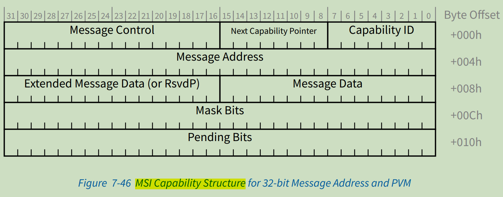
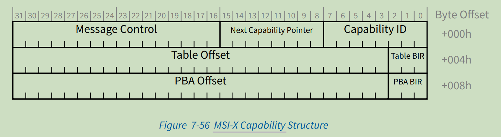
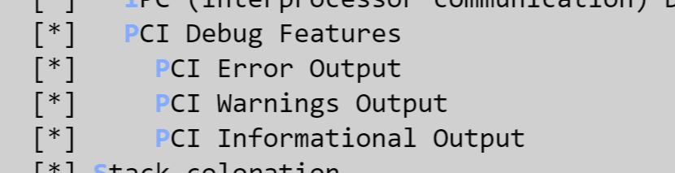

# PCI/PCIe Host Driver Framework Development Guide

\[ English | [简体中文](../../../../../zh-cn/device_dev_guide/driver/bus_driver/PCI/pci_host.md) \]

This document serves as a comprehensive development guide for the PCI/PCIe host framework in openvela, intended to provide a clear and complete reference for driver developers and system engineers. It covers the entire process, from core PCI/PCIe concepts to the software architecture in the operating system, driver development APIs, platform configuration, and QEMU practical examples.

## I. Overview

The Peripheral Component Interconnect (PCI) standard was designed as a replacement for the ISA standard with three core objectives:

- **Enhanced Performance**: To achieve higher data transfer rates between the host and peripherals.
- **Platform Independence**: To minimize dependency on specific hardware platforms.
- **Simplified Expansion**: To streamline the process of adding and removing peripherals.

PCI devices feature a jumperless design and are configured automatically during system boot. Each PCI function is uniquely identified by a triplet consisting of a **Bus Number**, **Device Number**, and **Function Number** (BDF). A system can connect multiple buses through PCI bridges to build a complex device topology.

## II. Terminology

| **Term/Abbreviation** | **Full English Name**                   | **Description**                                                          |
| :-------------------- | :-------------------------------------- | :----------------------------------------------------------------------- |
| **PCI**               | Peripheral Component Interconnect       | A local computer bus for attaching hardware devices in a computer.       |
| **PCIe**              | PCI Express                             | A high-speed serial computer expansion bus standard, a successor to PCI. |
| **RC**                | Root Complex                            | The core component that connects the CPU to the PCIe bus system.         |
| **EP**                | Endpoint                                | A peripheral device, such as a network card or graphics card.            |
| **BAR**               | Base Address Register                   | A register used to map a device's memory or I/O space.                   |
| **MSI**               | Message Signaled Interrupt              | A modern interrupt mechanism.                                            |
| **MSI-X**             | MSI-Extended                            | An extension of MSI that supports more non-contiguous interrupt vectors. |
| **CAM**               | Configuration Access Mechanism          | The PCI-compatible configuration access mechanism.                       |
| **ECAM**              | Enhanced Configuration Access Mechanism | The PCIe enhanced configuration access mechanism.                        |
| **BDF**               | Bus, Device, Function                   | A triplet that uniquely identifies a PCI function.                       |

## III. PCI Framework Design and Initialization Flow

The openvela PCI framework is responsible for initializing the PCI controller at system startup, enumerating all devices on the bus, and completing the matching and binding of devices to their drivers. The entire process is divided into two main stages: **Controller Initialization and Bus Enumeration** and **Device and Driver Matching and Probing**.


### 1. Controller Initialization and Bus Enumeration

This stage is triggered early in the system startup by the PCI Controller Driver and aims to complete low-level hardware initialization and device discovery.

1. **Initialize Resources:**

    The controller driver first configures and initializes the required address spaces for the PCI subsystem, including I/O space, non-prefetchable memory space, and prefetchable memory space.

2. **Enumerate the PCI Bus Tree:**

    The system starts from the root bus (Bus 0) and recursively scans all PCI buses to discover connected devices.

    - The system iterates through each device on a bus, assigning it a unique BDF (Bus, Device, Function) identifier.
    - The system identifies the device type (Endpoint or Bridge) and initializes its BARs (Base Address Registers).
    - The system adds the discovered device (Bridge or Endpoint) to the device list (`devices`) of its parent bus.
    - If a Bridge device is found, the system recursively enters the secondary bus beneath it to continue scanning until the entire bus tree is traversed.

3. **Build the Global Device List:**

    After bus enumeration is complete, the system iterates through the device lists of all buses. It then calls the `pci_register_device` interface to register each discovered device into the global device list `g_pci_device_list`.

### 2. Device and Driver Matching and Probing

openvela uses a dynamic matching mechanism to ensure that a device can be correctly bound to its corresponding driver, regardless of when it is registered. This process primarily occurs in two scenarios:

#### Scenario 1: Driver Already Exists When Device Is Registered

This is a common scenario during system startup, where drivers are usually registered before devices.

1. In the `pci_register_device` function, after a new device is added to `g_pci_device_list`, the system immediately traverses the global driver list `g_pci_driver_list`.
2. The system performs matching by comparing the `vendorID` and `deviceID` of the device and driver.
3. Once the first matching driver is found, the system immediately calls that driver's `probe` function to initialize the device.
4. If the `probe` function succeeds, the matching process terminates, and the `pci_register_device` function returns successfully.

#### Scenario 2: Device Already Exists When Driver Is Registered

This scenario applies to dynamically loadable driver modules, where devices may already exist in the global device list.

1. When a new driver is registered into `g_pci_driver_list` via the `pci_register_driver` interface, the system immediately traverses the global device list `g_pci_device_list`.
2. The system again performs matching using `vendorID` and `deviceID`.
3. If a matching device is found, the system calls the new driver's `probe` function for that device.
4. Unlike Scenario 1, the system continues to traverse the entire device list to ensure that all existing, eligible devices are claimed by this driver.

### 3. Driver Takeover and Device Control

Once a device and driver are successfully matched and the `probe` function has completed, the driver obtains a valid pointer to a `struct pci_device_s`. Using this pointer, the driver can fully control the PCI device, for example, by calling `pci_set_master()` to enable bus mastering or by communicating with the device through its BAR-mapped address space.

## IV. PCIe Core Concepts


### 1. Features

- **High-Speed Serial Communication**: PCIe uses point-to-point serial connections and differential signaling to achieve full-duplex communication at speeds far exceeding parallel buses.
- **Topological Core**: The PCIe Host driver corresponds to the Root Complex in the topology, with functionality similar to a traditional PCI Host Bridge.

### 2. System Components

A typical PCIe system is composed of the following key devices:

- **Root Complex (RC):**

    The RC acts as the interface between the CPU and the PCIe bus system. It sits at the "root" of the topology tree, generates the PCIe bus domain, and communicates with downstream devices through its Root Ports. An RC may consist of several components (processor interface, DRAM interface, etc.) and may even span multiple chips. Broadly, the RC can be understood as the **interface** between the **system CPU** and the **PCIe topology**. PCIe ports are marked as **Root Ports** in the configuration space.

- **Bridge:**

    A bridge provides an interface between the PCIe bus and other buses (such as PCI, PCI-X, or even another PCIe bus).

        - **Forward Bridge**: Allows older PCI/PCI-X devices to be connected to a new PCIe system.
        - **Reverse Bridge**: Allows new PCIe devices to be connected to an old PCI/PCI-X system.

- **Switch:** Provides expansion or aggregation capabilities, allowing more devices to connect to a single PCIe port. They act as packet routers, identifying which path a given packet should take based on its address or other routing information. A switch is a type of PCIe-to-PCIe bridge.

- **Endpoint (EP):** An EP is a device at the leaf of the PCIe topology and is the ultimate initiator or completer of I/O operations. Examples include PCIe network cards and NVMe SSDs. An Endpoint can only accept packets from an upstream component or send packets to an upstream component.

### 3. PCIe Topology

A PCIe system presents an inverted tree-like topology.



- **Root Complex (RC)**: As the root of the tree, it implements a Host Bridge to translate between the CPU address domain and the PCI address domain. The RC also generates the internal bus (Bus 0) and expands downward through multiple Root Ports (which are essentially PCI-to-PCI Bridges). PCI Bridges are used for system expansion and do not perform address translation.
- **Switch**: As a branch of the tree, it is used for further bus expansion. Each switch contains one upstream port and multiple downstream ports, with each port being equivalent to a PCI-to-PCI Bridge.
- **Endpoint (EP)**: As a leaf node of the tree, it is the final functional device, such as a PCIe network card, graphics card, or NVMe drive.

### 4. PCIe Configuration Access Mechanism

PCIe supports two configuration space access mechanisms:

- **PCI-compatible Configuration Access Mechanism (CAM)**: A legacy access method compatible with traditional PCI, using I/O ports `0xCF8` and `0xCFC`.
- **PCI Express Enhanced Configuration Access Mechanism (ECAM)**: An enhanced access mechanism that maps the configuration spaces of all devices into a contiguous block of memory, allowing the CPU to read and write them directly via Memory-Mapped I/O (MMIO).

### 5. PCIe Base Address Register (BAR)

#### Function and Role

Base Address Registers (BARs) are the key mechanism through which a PCIe device presents its internal resource requirements to the system software.

1. **Resource Discovery**: The device declares its required address space size, type (memory or I/O), and attributes (e.g., prefetchable) to the system software via its BARs.
2. **Address Allocation**: After reading the BAR information, the system software allocates a contiguous address range from the available system address pool and writes the base address of that range back into the BAR.
3. **Address Mapping**: Once configured, the CPU can communicate with the device by accessing this mapped address range.

#### BAR Space Size Calculation

System software determines the space required by a BAR using the following standard procedure:

1. Write all `1`s (`0xFFFFFFFF`) to the target BAR register.
2. Read the value back from the register. Since only the address mask bits are writable, the hardware returns a value like `0xFFFFF000` (lower bits are hardwired).
3. Invert the read-back value bitwise and add 1 to get the size of the address space requested by the BAR. For example, `~0xFFFFF000 + 1 = 0x1000`, indicating a 4KB space is required.
4. The register also defines the access type for this address space (Memory or I/O).

#### BAR Field Parsing

A Base Address Register (BAR) is a 32-bit register whose bitfields collectively define the type and attributes of the resources a device needs and are used to determine the required address space size. During device configuration, the system software first reads this information and then writes the allocated base address back to the register.

The following table details the function of each bitfield in a BAR register:

| **Bitfield**                                 | **Field Name**               | **Description**                                                                                                                                                                                                                                                                                                     |
| :------------------------------------------- | :--------------------------- | :------------------------------------------------------------------------------------------------------------------------------------------------------------------------------------------------------------------------------------------------------------------------------------------------------------------ |
| **Bit 0**                                    | **Resource Type**            | **Read-Only**. Identifies the resource as either memory space or I/O space. <br>- `0`: Indicates this BAR maps **Memory Space**. <br>- `1`: Indicates this BAR maps **I/O Space**.                                                                                                                                  |
| **Bits 2:1**                                 | **Memory Space Type**        | Valid only when **Bit 0 is `0`**. **Read-Only**. <br>- `00b`: 32-bit address. The BAR can be mapped to any memory address below 4GB. <br>- `10b`: 64-bit address. The BAR can be mapped to a memory address above 4GB. It uses the next adjacent BAR to form a 64-bit base address.                                 |
| **Bit 3**                                    | **Prefetchable**             | Valid only when **Bit 0 is `0`**. **Read-Only**. <br>- `0`: Non-prefetchable. Reading this region may have side effects, and the system should not perform speculative reads. <br>- `1`: Prefetchable. This memory region has no read side effects, and the system can safely prefetch data to improve performance. |
| **Bits 31:4** (Memory) **Bits 31:2** (I/O)** | **Base Address / Size Mask** | This field has a dual role: <br>1. **Sizing Phase**: These read/write bits act as a mask to calculate the space required by the device. <br>2. **Configuration Phase**: After the size is determined, the system software writes the allocated memory or I/O base address into these bits.                          |

#### Header Type and BAR Layout

A PCIe device's configuration space has two different header layouts depending on its role in the topology: **Type 0 Header** and **Type 1 Header**. These two layouts differ significantly in the number and function of the Base Address Registers (BARs) they support.



- Type 0 Header:

    - Applicable Devices: Endpoints, such as network cards, graphics cards, and other non-bridge devices.
    - Number of BARs: Supports up to **6** 32-bit BARs, providing ample address space mapping capabilities for the device.

- Type 1 Header:

    - Applicable Devices: Bridge devices, including the Root Ports of a Root Complex (RC) and the ports of a Switch.
    - Number of BARs: Supports only **2** 32-bit BARs.
    - Key Routing Registers: In addition to BARs, a Type 1 Header contains key registers for bus enumeration and transaction routing, as shown in the table below.

    | **Register Name**          | **Full English Name**  | **Description**                                                                         |
    | :------------------------- | :--------------------- | :-------------------------------------------------------------------------------------- |
    | **Primary Bus Number**     | Primary Bus Number     | The number of the upstream bus to which the bridge is connected.                        |
    | **Secondary Bus Number**   | Secondary Bus Number   | The number of the bus directly connected downstream of the bridge.                      |
    | **Subordinate Bus Number** | Subordinate Bus Number | The highest bus number reachable downstream of this bridge (including all sub-bridges). |

### 6. PCIe Address Spaces

The PCIe specification defines four physical address spaces, which are fully compatible with PCI:

- **Configuration Space**: Used for device discovery, configuration, and resource allocation.
- **Memory Space**: Used to map device memory, which the CPU can access with memory read/write instructions.
- **I/O Space**: Used to map device I/O registers, which the CPU must access with special-purpose I/O instructions.
- **Message Transactions**



### 7. PCIe Interrupt Mechanism and Capabilities

For backward compatibility, PCIe inherits the interrupt mechanism of PCI, but the implementation is different. To reduce the number of physical pins, PCIe converts all interrupt signals into **Message Transactions** transmitted over the serial bus. According to the specification, all PCIe devices **must** support either the MSI or MSI-X interrupt mechanism.


#### Legacy Interrupts

INTx is the legacy interrupt mechanism defined by PCI, triggered via four independent **sideband signal** physical pins on the PCI bus: `INTA#`, `INTB#`, `INTC#`, and `INTD#`.

In the PCIe architecture, to maintain compatibility while reducing pins, the physical INTx signals are eliminated. Instead, when a device needs to trigger a legacy interrupt, it sends a specific type of **message transaction** (e.g., `Assert_INTA`). This message travels up the bus to the Root Complex (RC), which finally converts it into a legacy interrupt signal that the system can recognize. This is an **in-band emulation** of the legacy mechanism.


#### MSI/MSI-X Message Signaled Interrupts

Message Signaled Interrupts (MSI/MSI-X) are the recommended and widely used interrupt mechanism for modern PCIe devices. They completely eliminate sideband signals, triggering an interrupt directly by writing a specific data value to a specific memory address.

- **How it Works**: The device sends a **Memory Write TLP** (Transaction Layer Packet) over the bus. When the Root Complex (RC) receives this write transaction, it parses the target address and data and routes it to the appropriate CPU interrupt controller, thereby triggering an interrupt.
- **MSI vs. MSI-X Comparison**:

    - **MSI**: Supports up to 32 interrupt vectors, which must be physically contiguous.
    - **MSI-X**: An enhanced and more powerful extension of MSI. It supports up to 2048 interrupt vectors, which do not need to be contiguous. Each interrupt can have its own independent address and data, providing great flexibility for driver developers.



#### PCI Capability Structure

How does system software know which advanced features (like MSI/MSI-X, power management, etc.) a device supports? The answer is through the **Capability linked list**.

PCI/PCIe devices declare their supported capabilities by implementing a singly-linked list in their configuration space.

- **Capabilities Pointer**: Located at offset `0x34` in the configuration space header, this is a pointer to the first Capability structure in the list. A value of 0 indicates that the device does not support any capabilities.
- **Capability Structure**: Each node in the list is a Capability structure. It contains at least two fields:

    - **Capability ID**: An 8-bit ID that uniquely identifies the type of capability (e.g., `0x05` for MSI).
    - **Next Capability Pointer**: An 8-bit pointer to the next Capability structure in the list. The last node in the list has a pointer value of 0.



#### MSI Capability Structure

When the system finds a node with Capability ID `0x05` in the list, it has discovered the MSI capability. The subsequent registers define the specific MSI configuration. The MSI Capability supports 4 different structures:





#### MSI-X Capability Structure

Similarly, a node with ID `0x11` represents the MSI-X capability. Its structure points to a separate MSI-X Table, which provides a more flexible configuration method.



## V. PCI Driver Framework and Interfaces

This chapter aims to introduce the software architecture, core APIs, and platform configuration methods of the PCI/PCIe driver framework in openvela.

### 1. Core Software Architecture: Model and Components

The PCI framework is built around four core data structures, forming a well-layered model:

| **Core Structure** | **English**        | **Role and Responsibilities**                                                                                                                                      | **Key Registration Function** |
| :----------------- | :----------------- | :----------------------------------------------------------------------------------------------------------------------------------------------------------------- | :---------------------------- |
| **Controller**     | `pci_controller_s` | Represents a PCI Host Bridge/RC. Manages bus numbers, I/O and memory address space resources, and provides low-level read/write access to the configuration space. | `pci_register_controller()`   |
| **Bus**            | `pci_bus_s`        | Represents a PCI bus. Forms a tree structure with bus 0 as the root, and new sub-buses branch off from each bridge device.                                         | `pci_scan_bus`                |
| **Device**         | `pci_device_s`     | Represents a PCI/PCIe device (Endpoint or Bridge). Contains its Vendor/Device ID, configuration space information, BAR resources, etc.                             | `pci_register_device()`       |
| **Driver**         | `pci_driver_s`     | A software logic unit. Drives a class of or a specific PCI device. Binds to a device via the `probe` function and unbinds via the `remove` function.               | `pci_register_driver()`       |

**Initialization and Enumeration Flow:**

1. **Controller Registration**: During platform startup, platform-specific code like `pci_ecam.c` calls `pci_register_controller()` to register a PCI host controller based on Device Tree (DTS) information.
2. **Bus Scan**: After the controller is successfully registered, the framework internally calls `pci_scan_bus()` to perform a depth-first scan (enumeration) of devices, starting from bus 0.
3. **Device Discovery and Configuration**: During the scan, a `pci_device_s` structure is created for each discovered device (Endpoint or Bridge), and `pci_setup_device()` is called to allocate BAR resources.
4. **Driver Matching and Binding**: For each discovered device, the framework iterates through the list of registered drivers (registered via `pci_register_driver()`) and performs matching based on Vendor/Device ID. On a successful match, the driver's `probe` function is called to bind the device to the driver.

### 2. Device Driver Development API

The framework provides a standard set of APIs for device driver developers to interact with devices.

#### Device Enablement and Resource Management

| **Function/Macro**            | **Description**                                                               |
| :---------------------------- | :---------------------------------------------------------------------------- |
| `int pci_enable_device(dev)`  | Enables capabilities like I/O or Memory in the PCI device's command register. |
| `void pci_set_master(dev)`    | Enables the device's ability to initiate Memory and I/O read/write requests.  |
| `void *pci_map_bar(dev, bar)` | Performs address mapping for a BAR in a PCI device.                           |
| `pci_select_bars`             | Gets the BAR mask data for a specific resource type of a PCI device.          |

#### Configuration Space Access

| **Function/Macro**                                     | **Description**                                                            |
| :----------------------------------------------------- | :------------------------------------------------------------------------- |
| `pci_read/write_config_xxx`<br>`pci_read/write_io_xxx` | Macros for reading from and writing to the PCI device configuration space. |
| `uint8_t pci_find_capability(dev, cap)`                | Gets the specified `cap` (capability) of a PCI device.                     |

#### Resource Information Retrieval

| **Macro**                      | **Description**                                                                    |
| :----------------------------- | :--------------------------------------------------------------------------------- |
| `pci_resource_start(dev, bar)` | Gets the physical start address of a specified BAR.                                |
| `pci_resource_end(dev, bar)`   | Gets the physical end address of a specified BAR.                                  |
| `pci_resource_len(dev, bar)`   | Gets the size of the space of a specified BAR.                                     |
| `pci_resource_flags(dev, bar)` | Gets the resource type flags of a specified BAR (e.g., I/O, Memory, Prefetchable). |

### 5. Key Source File Overview

| **Filename**      | **Description**                                                                                                                                                                                                              |
| ----------------- | ---------------------------------------------------------------------------------------------------------------------------------------------------------------------------------------------------------------------------- |
| `pci.c`           | **Framework Core**. Implements the models for PCI bus, device, and driver, as well as the generic logic for bus scanning and driver matching.                                                                                |
| `pci_ecam.c`      | A base for one type of PCI configuration space, including initialization of the configuration space address, read/write operations, and implementation of `generic` read/write functions.                                    |
| `pci_drivers.c`   | **Driver Registration Entry Point**. Uses macro-based conditional compilation to call the registration functions of different virtual device drivers (e.g., `ivshmem`, `qemu-test`, `qemu-edu`).                             |
| `pci_qemu_test.c` | A specific **device driver example** for matching the `pci-testdev` virtual device provided by QEMU (VID: `1b36`, DID: `0005`). See the [QEMU website](https://www.qemu.org/docs/master/specs/pci-testdev.html) for details. |
| `pci_qemu_edu.c`  | Another **device driver example** for matching QEMU's `edu` educational virtual device (VID: `1234`, DID: `11e8`). See the [QEMU official documentation](https://www.qemu.org/docs/master/specs/edu.html) for details.       |
| `pci_ids.h`       | Standardized macro definitions for Vendor IDs, Device IDs, Class Codes, etc.                                                                                                                                                 |
| `pci_regs.h`      | Standardized macro definitions for PCI configuration space register offsets and Capability IDs.                                                                                                                              |

### 6. Platform Integration: Device Tree (DTS) Configuration

The PCI Host Controller needs to describe its hardware resources and features to the operating system via the Device Tree. This is a prerequisite for the correct initialization of the PCI driver framework.

The following is a typical DTS configuration node for a PCIe host controller under the `aarch64` architecture in the QEMU `virt` machine.


#### Key Property Analysis

| **DTS Property**                | **Example Value**                  | **Function and Explanation**                                                                                                                                                                                                                                                                                                                                                                                                                                                                                             |
| :------------------------------ | :--------------------------------- | :----------------------------------------------------------------------------------------------------------------------------------------------------------------------------------------------------------------------------------------------------------------------------------------------------------------------------------------------------------------------------------------------------------------------------------------------------------------------------------------------------------------------- |
| `compatible`                    | `pci-host-ecam-generic`            | **Declares the controller type**. <br>`ecam` indicates this is a generic PCI host controller that uses the ECAM method to access configuration space. The OS will select the driver logic in `pci_ecam.c` based on this.                                                                                                                                                                                                                                                                                                 |
| `reg`                           | `<0x40 0x10000000 0x0 0x10000000>` | **Defines the ECAM configuration space**. <br>It tells the system that the memory window for accessing all PCI device configuration headers is located at physical address `0x4010000000` and is `0x10000000` (256MB) in size.                                                                                                                                                                                                                                                                                           |
| `ranges`                        | `...`                              | **Defines address space mapping**. <br>This is the most critical property. It establishes the translation between PCI bus addresses and CPU physical addresses. This example defines three types of mappings: <br>1. **I/O Space**: Maps PCI I/O addresses to CPU physical addresses. <br>2. **32-bit Non-Prefetchable Memory**: Maps 32-bit PCI memory addresses to CPU physical addresses. <br>3. **64-bit Prefetchable Memory**: Maps 64-bit prefetchable (cacheable) PCI memory addresses to CPU physical addresses. |
| `bus-range`                     | `<0x00 0xff>`                      | **Declares the bus number range**. <br>Indicates that this controller manages PCI bus numbers from 0 to 255.                                                                                                                                                                                                                                                                                                                                                                                                             |
| `#address-cells`, `#size-cells` | `<3>`, `<2>`                       | **Defines the address encoding format**. <br>Specifies that the addresses of child nodes (i.e., PCI devices) require 3 `u32`s (96 bits) to represent, and their sizes require 2 `u32`s (64 bits). This is a standard requirement of PCIe DT-Binding.                                                                                                                                                                                                                                                                     |

### Example Analysis

```Plain
A. PCIe Address Mapping:

ranges = <0x01000000 0x00000000 0x00000000 0x00000000 0x3eff0000 0x00000000 0x00010000
          0x02000000 0x00000000 0x10000000 0x00000000 0x10000000 0x00000000 0x2eff0000
          0x03000000 0x00000080 0x00000000 0x00000080 0x00000000 0x00000080 0x00000000
         >;

The first group is: I/O space
The second group is: 32 bit memory space
The third group is: 64 bit memory space

The child node address of PCIe is divided into three parts:
phys.hi: npt000ss bbbbbbbb dddddfff rrrrrrrr
phys.mid: hhhhhhhh hhhhhhhh hhhhhhhh hhhhhhhh
phys.low: llllllll llllllll llllllll llllllll

The total length of a PCIe address is 64 bits, located in phys.mid and phys.low, while the bits in phys.hi have special meanings:
n: is 0 if the address is relocatable, 1 otherwise (doesn’t play a role here)
p: is 1 if prefetchable (cacheable) region flag
t: is 1 if the address is aliased (for non-relocatable I/O), below 1 MB (for Memory), or below 64 KB (for relocatable I/O)
ss: space code
00: configuration space
01: I/O space
10: 32 bit memory space
11: 64 bit memory space

B. PCIe Configuration Space

reg = <0x00000040 0x10000000 0x00000000 0x10000000>;

address region: 0x00000040 0x10000000 => 0x0000004010000000
address region size: 0x00000000 0x10000000 => 0x0000000010000000 => 0x10000000

C. bus-range
bus-range = <0x00000000 0x000000ff>;

The first cell records the bus number assigned to this bus, the second cell is the maximum bus number of its subordinate PCI buses.
```

## VI. Practical Guide: QEMU Simulation and Testing

This framework supports functional verification with virtual PCI devices in a QEMU environment. Taking the `ivshmem` (Inter-VM Shared Memory) device as an example, here are the complete steps:

### Step 1: Prepare the Environment (Host Machine)

Start the `ivshmem-server` on the host machine. It provides the backend shared memory service for the `ivshmem` virtual device in QEMU.

```Bash
# Create a shared memory server that can be connected by 2 clients
# "-n 2" means at most two QEMU instances can share this memory
sudo ivshmem-server -n 2
```

> **Note**: You need to keep this service running in the foreground or background.

### Step 2: System Configuration and Compilation

In the project's menuconfig, ensure that PCIe support and related test drivers are enabled.

1. Enter the configuration menu and enable logging:

    ```Bash
    ./build.sh vendor/qemu/boards/vela/configs/qemu-arm64-v8a-ap/ menuconfig
    ```

    

2. Compile the system:

    ```Bash
    ./build.sh vendor/qemu/boards/vela/configs/qemu-arm64-v8a-ap/ -j8
    ```

### Step 3: Run QEMU

In the QEMU launch command, use the `-device` parameter to dynamically add a virtual PCI device.

```Bash
qemu-system-aarch64 \
  -cpu cortex-a53 \
  -machine virt,virtualization=on,gic-version=3 \
  -nographic -net none \
  -kernel path/to/your/nuttx \
  \
  # --- Key parameters: Add ivshmem PCI device ---
  # 1. Create an ivshmem-doorbell virtual device and name it "ivshmem"
  -device ivshmem-doorbell,chardev=ivshmem \
  # 2. Create a socket character device backend and connect it to the previously started server
  -chardev socket,path=/tmp/ivshmem_socket,id=ivshmem
```

After the system boots, you should see the PCI bus scan process in the console log, as well as messages indicating that the `ivshmem` device was successfully identified and probed by its driver.

## VII. References

To facilitate deeper research into PCI/PCIe technology and related implementations, the following core reference materials have been compiled.

1. Official Core Specifications (PCI-SIG): This is the authoritative source for PCI/PCIe technology and the fundamental basis for all hardware design and software driver development.

    - **[PCI Express® Base Specification](https://pcisig.com/specifications/pciexpress)**
    - **Description**: The official base specification released by the PCI-SIG (PCI Special Interest Group). It defines the physical layer, data link layer, and transaction layer of PCIe and is an essential document for understanding the protocol.

2. Open Source Project Implementation References: Studying mature open source implementations can greatly help in understanding driver framework design patterns.

    - **[Zephyr RTOS: PCIe Host Driver](https://github.com/zephyrproject-rtos/zephyr/tree/main/drivers/pcie/host)**
    - **Description**: The PCIe host controller driver in the Zephyr project. Its code structure is clear and supports multiple controllers, making it an excellent object for learning and reference, especially in device enumeration, resource allocation, and interrupt handling.

3. Technical Articles and Blogs: The following articles provide excellent supplementary information for understanding specific PCIe concepts like address spaces.

    - **[PCI and PCIe Basics (in Chinese)](http://blog.chinaaet.com/justlxy/p/5100053251)**
