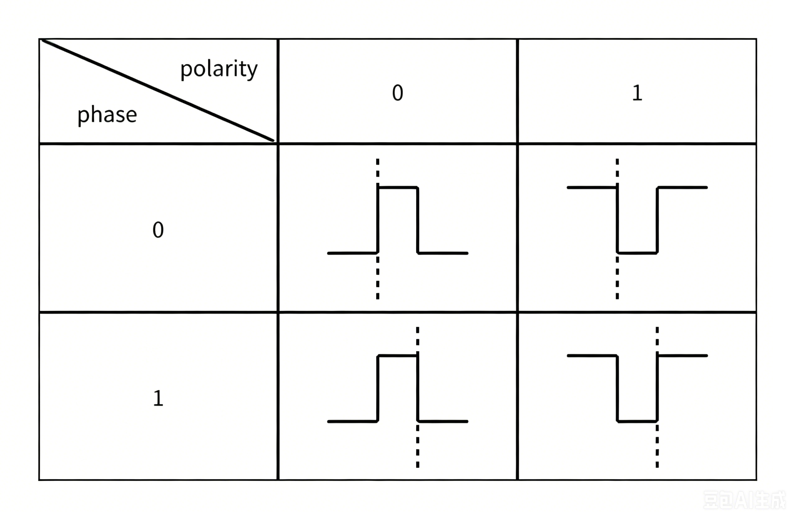

# SPI Driver Adaptation and Usage Guide

\[ English | [简体中文](../../../../../zh-cn/device_dev_guide/driver/bus_driver/SPI/SPI.md) \]

## I. Overview

SPI (Serial Peripheral Interface) is a common synchronous serial communication protocol, mainly used for communication between a processor and various peripheral devices. It uses a fixed set of signal lines to transfer data between a master and slave devices:

- **SCLK (Serial Clock)**: Clock signal line, provided by the master, used to synchronize data transfers.
- **MOSI (Master Output, Slave Input)**: Master output, slave input. The master sends data to the slave over this line.
- **MISO (Master Input, Slave Output)**: Master input, slave output. The slave sends data to the master over this line.
- **SS/CS (Slave Select/Chip Select)**: Slave select signal line. The master enables a particular slave by pulling its SS/CS pin low. If there are multiple slaves, each slave needs its own independent SS/CS pin.

SPI has the following transfer characteristics:

- **Master-slave architecture**: SPI uses a master-slave model. There is only one master on the bus, but multiple slaves can be connected.
- **Full-duplex communication**: Data can be transferred bidirectionally between master and slave at the same time.
- **High-speed transfer**: SPI communication rates are usually high, reaching several megabits per second (Mbps), suitable for scenarios with high data-rate requirements.
- **High flexibility**: By configuring the clock polarity and phase (CPOL and CPHA), SPI can work with devices in four different modes. CPOL determines the idle state of the clock line: if 0, the clock line is low when the SPI bus is idle; if 1, the clock line is high when the SPI bus is idle. CPHA determines the sampling moment: if 0, sampling occurs on the first edge of SCLK; if 1, sampling occurs on the second edge of SCLK.



openvela provides two SPI driver frameworks, one for the SPI master and one for the SPI slave. The following sections introduce each framework and its adaptation process.

## II. SPI master

The openvela SPI master framework merely abstracts the control and transfer operations of the SPI master. Understanding the definition of each interface function is enough to know how to operate or adapt an SPI master controller.

### 1. Driver Framework Layers

Before getting hands-on with adaptation, first build an understanding of the overall framework. openvela uses an Upper/Lower Half model to decouple the SPI master. A complete adaptation usually involves three layers:

| Layer | Location | Responsibility | Adapter's focus |
| :--- | :--- | :--- | :--- |
| Driver layer (Lower Half / Southbound) | `arch/<arch>/src/<chip>/<chip>_spi.c` | Implements chip-specific SPI register operations, fills in `struct spi_ops_s`, and exposes the initialization entry `<chip>_spibus_initialize()` | **Core of adaptation**: implement the callbacks in `spi_ops_s` |
| Board layer | `boards/<arch>/<chip>/<board>/src/<board>_bringup.c` | At system startup, calls `<chip>_spibus_initialize()` to obtain the bus handle; implements board-wiring-specific chip select (CS) and status callbacks; calls `spi_register()` as needed to register the character device | Configure CS pins, register the handle as `/dev/spiN` or pass it directly to an upper-layer driver |
| Application layer | Application / kernel upper-layer driver | Accesses the SPI device through the `/dev/spiN` character device (with the SPI tool) or by directly holding the `spi_dev_s` handle | Perform data transfers via the SPI tool or an upper-layer driver |

The data flow between layers is: application layer (or upper-layer driver) → framework access macro (such as `SPI_EXCHANGE`) → the `spi_ops_s` callbacks implemented by the driver layer → operate the SPI controller hardware. The framework itself contains no hardware logic; it only forwards the unified interface macros to the vendor-implemented `ops`.

> Note: Chip select (`select`) and status (`status`) are strongly tied to the GPIO wiring of a specific board. Many chip families (such as STM32, i.MX RT, Kinetis, etc.) place the common SPI logic in the `arch` shared driver and require the **board** to provide `<chip>_spiNselect()` / `<chip>_spiNstatus()` callbacks; some simpler drivers (such as bl602) operate the CS directly inside the driver-layer `select`. This is determined by how the chip driver is implemented; follow the convention of the chosen chip's shared driver during adaptation.

### 2. Access Interfaces

openvela defines the following access interfaces (macros) for SPI master bus control and data transfer. The table below summarizes each interface's purpose and usage notes; the full macro definitions and parameter comments are in the header `include/nuttx/spi/spi.h`.

| Interface | Purpose | Usage notes |
| :--- | :--- | :--- |
| `SPI_LOCK(d,l)` | Lock/unlock the SPI bus | When multiple slaves share a bus, `lock` before access and `unlock` after, to ensure exclusive use |
| `SPI_SELECT(d,id,s)` | Select/deselect a slave | `id` is built by `SPIDEV_ID(type,index)`; see the device ID note below |
| `SPI_SETFREQUENCY(d,f)` | Set the SCLK frequency | Must be called before a transfer; returns the actual effective frequency |
| `SPI_SETDELAY(d,a,b,c,i)` | Configure CS/CLK/inter-frame delays | Requires `CONFIG_SPI_DELAY_CONTROL`; available when the hardware supports it |
| `SPI_SETMODE(d,m)` | Set the mode (CPOL/CPHA) | Values in `spi_mode_e` below; must match the peer slave |
| `SPI_SETBITS(d,b)` | Set the bit width of one word | Determines the unit size of subsequent transfers |
| `SPI_HWFEATURES(d,f)` | Enable hardware-specific features | Requires `CONFIG_SPI_HWFEATURES`; flags listed below |
| `SPI_STATUS(d,id)` | Query slave (MMC/SD) status | Targets the slave, not the controller; status bits below |
| `SPI_CMDDATA(d,id,cmd)` | Switch CMD/DATA state | Targets the slave; requires `CONFIG_SPI_CMDDATA`, common for 9-bit displays |
| `SPI_SEND(d,wd)` | Transfer one word | Word length set by `SPI_SETBITS`; bits beyond the width are ignored |
| `SPI_EXCHANGE(d,t,r,l)` | Bidirectional transfer of a block | Requires `CONFIG_SPI_EXCHANGE`; common for 4-wire full duplex |
| `SPI_SNDBLOCK(d,b,l)` | Send a block of data | Backed by exchange when `CONFIG_SPI_EXCHANGE` is on, otherwise implement sndblock |
| `SPI_RECVBLOCK(d,b,l)` | Receive a block of data | Same as above; 3-wire half-duplex needs separate sndblock/recvblock |
| `SPI_REGISTERCALLBACK(d,c,a)` | Register a media-change callback | Mainly for media devices; callback type `spi_mediachange_t` |
| `SPI_TRIGGER(d)` | Trigger a configured DMA transfer | Requires `CONFIG_SPI_TRIGGER` and the deferred-trigger hardware feature |

> For the data-transfer interfaces, the length unit is the word; the word width is set by `SPI_SETBITS`. If nbits ≤ 8 the data is packed into `uint8_t`; if nbits > 8 it is packed into `uint16_t`.

The constants referenced by some interfaces are described below.

**SPI device ID (the `id` parameter of `SPI_SELECT`)**: the high 16 bits are the device type, the low 16 bits are the index of a device of the same type.

```c
#define SPIDEV_ID(type,index) ((((uint32_t)(type)  & 0xffff) << 16) | \
                                ((uint32_t)(index) & 0xffff))
#define SPIDEVID_TYPE(devid)   (((uint32_t)(devid) >> 16) & 0xffff)
#define SPIDEVID_INDEX(devid)  ((uint32_t)(devid)        & 0xffff)
```

Device types are defined by a set of `SPIDEV_xxx(n)` macros (such as `SPIDEV_FLASH(n)`, `SPIDEV_DISPLAY(n)`, `SPIDEV_MMCSD(n)`, etc.); see `enum spi_devtype_e` in `include/nuttx/spi/spi.h` for the full list.

**Working mode (the `m` parameter of `SPI_SETMODE`)**:

```c
enum spi_mode_e
{
  SPIDEV_MODE0 = 0,     /* CPOL=0 CPHA=0 */
  SPIDEV_MODE1,         /* CPOL=0 CPHA=1 */
  SPIDEV_MODE2,         /* CPOL=1 CPHA=0 */
  SPIDEV_MODE3,         /* CPOL=1 CPHA=1 */
  SPIDEV_MODETI,        /* CPOL=0 CPHA=1 TI Synchronous Serial Frame Format */
};
```

**Hardware feature flags (the `f` parameter of `SPI_HWFEATURES`)**:

```c
Bit 0: HWFEAT_CRCGENERATION                    // Hardware CRC generation (must be disabled by default)
Bit 1: HWFEAT_FORCE_CS_INACTIVE_AFTER_TRANSFER // CS rises after every transfer, even if new data is provided immediately
Bit 2: HWFEAT_FORCE_CS_ACTIVE_AFTER_TRANSFER   // CS does not rise automatically after a transfer, even with no data for a long time
Bit 3: HWFEAT_ESCAPE_LASTXFER                  // Currently a hardware capability flag used for SAMV7
Bit 4: HWFEAT_AUTO_CS_CONTROL                  // CS is automatically controlled by the hardware controller with programmable timings
Bit 5: HWFEAT_INVERT_CS_LEVEL                  // Invert the CS level (active high)
Bit 6: HWFEAT_LSBFIRST                         // Transfer LSB first (default is MSB first)
Bit 7: Deferred trigger mode on/off            // Mainly for DMA; once set, the transfer must be fired by SPI_TRIGGER
```

**Status bits (the return value of `SPI_STATUS`)**:

```c
#define SPI_STATUS_PRESENT     0x01 /* Bit 0=1: MMC/SD card present */
#define SPI_STATUS_WRPROTECTED 0x02 /* Bit 1=1: MMC/SD card write protected */
```

### 3. Driver Adaptation

The openvela SPI framework is only an abstraction of common interfaces. Underneath, it directly calls the vendor-implemented `struct spi_ops_s`. The vendor adapts according to this structure. The meaning of each function is described in the previous section:

```c
//include/nuttx/spi/spi.h

struct spi_ops_s
{
  CODE int      (*lock)(FAR struct spi_dev_s *dev, bool lock);
  CODE void     (*select)(FAR struct spi_dev_s *dev, uint32_t devid,
                  bool selected);
  CODE uint32_t (*setfrequency)(FAR struct spi_dev_s *dev,
                  uint32_t frequency);
#ifdef CONFIG_SPI_DELAY_CONTROL
  CODE int      (*setdelay)(FAR struct spi_dev_s *dev, uint32_t a,
                  uint32_t b, uint32_t c, uint32_t i);
#endif
  CODE void     (*setmode)(FAR struct spi_dev_s *dev, enum spi_mode_e mode);
  CODE void     (*setbits)(FAR struct spi_dev_s *dev, int nbits);
#ifdef CONFIG_SPI_HWFEATURES
  CODE int      (*hwfeatures)(FAR struct spi_dev_s *dev,
                  spi_hwfeatures_t features);
#endif
  CODE uint8_t  (*status)(FAR struct spi_dev_s *dev, uint32_t devid);
#ifdef CONFIG_SPI_CMDDATA
  CODE int      (*cmddata)(FAR struct spi_dev_s *dev, uint32_t devid,
                  bool cmd);
#endif
  CODE uint32_t (*send)(FAR struct spi_dev_s *dev, uint32_t wd);
#ifdef CONFIG_SPI_EXCHANGE
  CODE void     (*exchange)(FAR struct spi_dev_s *dev,
                  FAR const void *txbuffer, FAR void *rxbuffer,
                  size_t nwords);
#else
  CODE void     (*sndblock)(FAR struct spi_dev_s *dev,
                  FAR const void *buffer, size_t nwords);
  CODE void     (*recvblock)(FAR struct spi_dev_s *dev, FAR void *buffer,
                  size_t nwords);
#endif
#ifdef CONFIG_SPI_TRIGGER
  CODE int      (*trigger)(FAR struct spi_dev_s *dev);
#endif
  CODE int      (*registercallback)(FAR struct spi_dev_s *dev,
                  spi_mediachange_t callback, void *arg);
};

struct spi_dev_s
{
  FAR const struct spi_ops_s *ops;
};
```

The following uses a chip named `<chip>` as an example to demonstrate step by step how to adapt an SPI master controller driver from scratch. The example code is modeled on existing drivers in the repository (such as `arch/risc-v/src/bl602/bl602_spi.c`). Replace it with the register operations of your target chip during actual adaptation.

#### Step 1: Implement the callbacks

In the chip driver file `arch/<arch>/src/<chip>/<chip>_spi.c`, implement each callback according to the prototypes in `spi_ops_s`. Among them, `lock`, `select`, `setfrequency`, and `send` are required; the rest are implemented as needed based on hardware capability and enabled configuration. The work each callback must do is as follows:

| Callback | Required | Main work |
| :--- | :--- | :--- |
| `lock` | Yes | Acquire/release the bus mutex to guarantee exclusive access when multiple devices share the bus |
| `select` | Yes | Pull the corresponding slave's CS low/high (some chips implement this at the board layer, see the framework layers note) |
| `setfrequency` | Yes | Configure the SCLK frequency and return the actual effective frequency |
| `setmode` | No | Configure the CPOL/CPHA working mode |
| `setbits` | No | Configure the bit width of one word |
| `send` | Yes | Transfer one word (returns the received word while sending) |
| `exchange` | Conditional | Implemented when `CONFIG_SPI_EXCHANGE` is enabled; performs a bidirectional transfer of a block of data |
| `sndblock`/`recvblock` | Conditional | Implemented when `CONFIG_SPI_EXCHANGE` is not enabled; performs unidirectional send/receive |

```c
/* arch/<arch>/src/<chip>/<chip>_spi.c */

static int      <chip>_spi_lock(FAR struct spi_dev_s *dev, bool lock);
static void     <chip>_spi_select(FAR struct spi_dev_s *dev,
                                  uint32_t devid, bool selected);
static uint32_t <chip>_spi_setfrequency(FAR struct spi_dev_s *dev,
                                        uint32_t frequency);
static void     <chip>_spi_setmode(FAR struct spi_dev_s *dev,
                                   enum spi_mode_e mode);
static void     <chip>_spi_setbits(FAR struct spi_dev_s *dev, int nbits);
static uint32_t <chip>_spi_send(FAR struct spi_dev_s *dev, uint32_t wd);
static void     <chip>_spi_exchange(FAR struct spi_dev_s *dev,
                                    FAR const void *txbuffer,
                                    FAR void *rxbuffer, size_t nwords);

static uint32_t <chip>_spi_setfrequency(FAR struct spi_dev_s *dev,
                                        uint32_t frequency)
{
  FAR struct <chip>_spi_priv_s *priv = (FAR struct <chip>_spi_priv_s *)dev;

  /* Compute and write the divider register based on the input frequency,
   * then return the actual effective frequency.
   */

  ...
  return actual_frequency;
}

/* The remaining callbacks are omitted; all operate this chip's SPI registers */
```

#### Step 2: Fill in the ops table and define the device instance

Attach the implemented callbacks to a `spi_ops_s` table, then use it to initialize `spi_dev_s` (typically embedded as the first member of the chip private structure `<chip>_spi_priv_s`, so that callbacks can reach the private data via a pointer cast):

```c
static const struct spi_ops_s <chip>_spi_ops =
{
  .lock         = <chip>_spi_lock,
  .select       = <chip>_spi_select,
  .setfrequency = <chip>_spi_setfrequency,
  .setmode      = <chip>_spi_setmode,
  .setbits      = <chip>_spi_setbits,
#ifdef CONFIG_SPI_HWFEATURES
  .hwfeatures   = <chip>_spi_hwfeatures,
#endif
  .status       = <chip>_spi_status,
  .send         = <chip>_spi_send,
#ifdef CONFIG_SPI_EXCHANGE
  .exchange     = <chip>_spi_exchange,
#else
  .sndblock     = <chip>_spi_sndblock,
  .recvblock    = <chip>_spi_recvblock,
#endif
  .registercallback = NULL,
};

struct <chip>_spi_priv_s
{
  struct spi_dev_s spi_dev;   /* Must be the first member */
  /* The following is chip private data */
  uint32_t base;              /* Register base address */
  ...
};

static struct <chip>_spi_priv_s <chip>_spi_priv =
{
  .spi_dev =
  {
    .ops = &<chip>_spi_ops
  },
  ...
};
```

#### Step 3: Provide the initialization entry

Expose an initialization function, conventionally named `<chip>_spibus_initialize()`, which takes a bus/port number, performs hardware initialization, and returns the `spi_dev_s` handle for upper layers:

```c
/****************************************************************************
 * Name: <chip>_spibus_initialize
 *
 * Description:
 *   Initialize the specified SPI bus and return the SPI device handle.
 ****************************************************************************/

FAR struct spi_dev_s *<chip>_spibus_initialize(int port)
{
  FAR struct <chip>_spi_priv_s *priv = &<chip>_spi_priv;

  /* Enable clocks, configure pin mux, reset the controller, set the default
   * frequency/mode/bit width, etc.
   */

  ...

  return (FAR struct spi_dev_s *)priv;
}
```

#### Step 4: Register in the board bringup

In the board file `boards/<arch>/<chip>/<board>/src/<board>_bringup.c`, call the initialization entry to obtain the handle and register it as a character device as needed. If the bus is used exclusively by other kernel drivers (such as an onboard FLASH or sensor), you may skip registering the character device and pass the handle directly to that driver's registration function:

```c
#ifdef CONFIG_SPI_DRIVER
  FAR struct spi_dev_s *spi;

  spi = <chip>_spibus_initialize(0);
  if (spi == NULL)
    {
      return -ENODEV;
    }

  ret = spi_register(spi, 0);   /* Register as /dev/spi0 */
  if (ret < 0)
    {
      spierr("ERROR: spi_register failed: %d\n", ret);
    }
#endif
```

At this point an SPI master controller driver is adapted, and you can proceed to the configuration and testing in the next section.

### 4. Usage

#### 1. Enable the configuration

```c
CONFIG_SPI=y
```

Besides enabling the basic configuration, when the hardware supports other hardware features, enable the corresponding macros as needed, such as `CONFIG_SPI_EXCHANGE`.

#### 2. Driver testing

openvela provides an SPI tool at the application layer to test the SPI master driver adaptation. This tool accesses the SPI device as a file node and performs data transfers. openvela provides a driver in the kernel layer that registers a character device in the file system, so that applications can access the SPI device as a file. To use this test program:

1. Configuration

```c
CONFIG_SPI_DRIVER=y
CONFIG_SPI_EXCHANGE=y // SPI_DRIVER depends on CONFIG_SPI_EXCHANGE, i.e. the driver must adapt the SPI_EXCHANGE interface
CONFIG_SYSTEM_SPITOOL=y
```

2. Registration

After the SPI driver is initialized, call the following interface to register it into the file system:

```c
#ifdef CONFIG_SPI_DRIVER
int spi_register(FAR struct spi_dev_s *spi, int bus);
#endif

/* Parameters
 * spi : spi device
 * bus : The SPI bus number.  This will be used as the SPI device minor
 *     number.  The SPI character device will be registered as /dev/spiN
 *     where N is the minor number
 */
```

3. Usage

Once the related configuration is enabled, the SPI tool runs as a command in nsh. Its usage can be queried with `spi help`:

```bash
nsh> spi
nsh> Usage: spi <cmd> [arguments]

Where <cmd> is one of:

  Show help     : ?
  List buses    : bus
  SPI Exchange  : exch [OPTIONS] [<hex senddata>]
  Show help     : help

Where common _sticky_ OPTIONS include:
  [-b bus] is the SPI bus number (decimal).  Default: 0 Current: 2 // bus number
  [-f freq] SPI frequency.  Default: 4000000 Current: 4000000 // frequency
  [-m mode] Mode for transfer.  Default: 0 Current: 0 // SPI mode, 4 modes
  [-u udelay] Delay after transfer in uS.  Default: 0 Current: 0 // delay after each transfer
  [-w width] Width of bus.  Default: 8 Current: 8 // word width, default 8 bits
  [-x count] Words to exchange.  Default: 1 Current: 4  // transfer length
nsh>
```

This tool's test coverage can basically include all the access interfaces, except for `SPI_STATUS`, `SPI_TRIGGER`, and `SPI_REGISTERCALLBACK`, which are associated with the slave device.

## III. SPI slave

Given the master-slave nature of the SPI bus, a device working as an SPI slave can only passively receive and send data. openvela divides the SPI slave driver framework into two layers: the controller layer and the device layer:


The device layer calls the controller-layer interfaces to send and query data, and the controller layer reads the data it received into the device layer through the device-layer interfaces. A driver based on an SPI slave controller needs to adapt the controller layer, and a device driver built on top of it needs to adapt the device layer.

### 1. Driver Framework Layers

The SPI slave layering differs slightly from the master; it consists of two mutually bound interfaces. Understanding "who calls whom" is the key to adapting an SPI slave:

| Layer | Implemented by | Provided interface | Role |
| :--- | :--- | :--- | :--- |
| Controller layer | The lower-half driver of the SPI slave controller, located at `arch/<arch>/src/<chip>/<chip>_spi_slave.c` | `struct spi_slave_ctrlrops_s` (`bind`/`unbind`/`enqueue`/`qfull`/`qflush`/`qpoll`) | Directly operates the SPI slave controller hardware, responsible for the actual sending/receiving of data |
| Device layer | The device driver built on top of the slave (such as the character device `spi_slave_driver.c`, or a custom protocol device) | `struct spi_slave_devops_s` (`select`/`cmddata`/`getdata`/`receive`/`notify`/`getrecvbuf`) | Invoked as callbacks by the controller layer to process received data and provide data to be sent |

The call direction between the two layers is **bidirectional**:

- **Device layer → controller layer**: The device driver hands data to be sent to the controller via `SPIS_CTRLR_ENQUEUE`, and drives the controller to flush received data back to itself via `SPIS_CTRLR_QPOLL`.
- **Controller layer → device layer**: When the controller detects chip select, receives data, or completes a transfer, it in turn calls back the device layer's `select`/`receive`/`notify` methods.

The binding is established via `SPIS_CTRLR_BIND`: when the device driver initializes, it passes its own `spi_slave_dev_s` to the controller. Once bound, the controller is "armed" and ready to respond at any time to a transfer initiated by the peer master.

> Tip: The controller layer and the device layer usually need to be adapted **together**. If you only want to verify whether the controller-layer driver works, you can directly reuse openvela's built-in character-device device-layer driver (`CONFIG_SPI_SLAVE_DRIVER`, see the "Usage" section of this chapter), without implementing the device layer yourself.

### 2. Controller-Layer Interfaces

Implemented by the controller-layer driver and called by the device layer; full macro definitions are in `include/nuttx/spi/slave.h`:

| Interface | Purpose | Usage notes |
| :--- | :--- | :--- |
| `SPIS_CTRLR_BIND(c,d,m,n)` | Bind device with controller and configure/enable it | Configures mode/nbits/MSB-LSB internally; `m`, `n` must match the peer master; `n>0` means MSB first, `n<0` means LSB first |
| `SPIS_CTRLR_UNBIND(c)` | Unbind the controller | The controller should be disabled on unbind |
| `SPIS_CTRLR_ENQUEUE(c,v,l)` | Put data to send into the transmit queue | Sent by the controller on the next master-initiated transfer |
| `SPIS_CTRLR_QFULL(c)` | Query whether the transmit queue is full | Useful before enqueuing |
| `SPIS_CTRLR_QFLUSH(c)` | Flush the transmit queue | Discards data not yet sent |
| `SPIS_CTRLR_QPOLL(c)` | Drive the controller to hand received data to the device layer | See the note below |

> The handling of `SPIS_CTRLR_QPOLL` is built into the controller implementation: after it is called, the controller repeatedly calls back the device layer's `SPIS_DEV_RECEIVE` to hand over the received-buffer data, until the buffer is empty or the device layer can accept no more (`receive` returns less than the offered length). There is no need to call `QPOLL` first and then `RECEIVE` separately.

### 3. Device-Layer Interfaces

Implemented by the device-layer driver and invoked as callbacks by the controller layer; full macro definitions are in `include/nuttx/spi/slave.h`:

| Interface | Purpose | Usage notes |
| :--- | :--- | :--- |
| `SPIS_DEV_RECEIVE(d,v,n)` | Hand controller-received data to the device layer | `v` points to the controller receive buffer, `n` is the valid length; returns the number of units actually accepted (less than `n` means the device layer can take no more); length unit is the nbits set by `BIND` |
| `SPIS_DEV_GETDATA(d,v)` | Fetch the next data to send from the device layer | Sent out on the next master clock |
| `SPIS_DEV_GETRECVBUF(d,b)` | Get a zero-copy (nocopy) receive buffer | When the returned buffer pointer is non-NULL, enqueued data is written directly into it; returns the number of receivable units |
| `SPIS_DEV_NOTIFY(d,s)` | Notify that a receive/send has completed | State `s` is of type `spi_slave_state_t`, see below |
| `SPIS_DEV_SELECT(d,s)` | Notify the device layer of a chip-select event | `s` indicates whether the chip select is active |
| `SPIS_DEV_CMDDATA(d,i)` | Notify a CMD/DATA state switch | `i` True means Data, False means Cmd |

The state values of `SPIS_DEV_NOTIFY`:

```c
typedef enum
{
  SPISLAVE_RX_COMPLETE = 0,
  SPISLAVE_TX_COMPLETE,
  SPISLAVE_TRANSFER_FAILED
} spi_slave_state_t;
```

### 4. Driver Adaptation

SPI slave driver adaptation generally refers to the controller layer, which is responsible for SPI data transfer. The device driver built on top of the SPI slave needs to adapt the device layer. The two are often tightly coupled and need to be adapted together; implement them according to the interfaces provided by the SPI slave. The vtables each layer must implement are as follows:

```c
//include/nuttx/spi/slave.h

struct spi_slave_ctrlrops_s
{
  CODE void     (*bind)(FAR struct spi_slave_ctrlr_s *ctrlr,
                        FAR struct spi_slave_dev_s *sdev,
                        enum spi_slave_mode_e mode, int nbits);
  CODE void     (*unbind)(FAR struct spi_slave_ctrlr_s *ctrlr);
  CODE int      (*enqueue)(FAR struct spi_slave_ctrlr_s *ctrlr,
                           FAR const void *data, size_t nwords);
  CODE bool     (*qfull)(FAR struct spi_slave_ctrlr_s *ctrlr);
  CODE void     (*qflush)(FAR struct spi_slave_ctrlr_s *ctrlr);
  CODE size_t   (*qpoll)(FAR struct spi_slave_ctrlr_s *ctrlr);
};

struct spi_slave_devops_s
{
  CODE void     (*select)(FAR struct spi_slave_dev_s *sdev, bool selected);
  CODE void     (*cmddata)(FAR struct spi_slave_dev_s *sdev, bool data);
  CODE size_t   (*getdata)(FAR struct spi_slave_dev_s *sdev,
                           FAR const void **data);
  CODE size_t   (*receive)(FAR struct spi_slave_dev_s *sdev,
                           FAR const void *data, size_t nwords);
  CODE void     (*notify)(FAR struct spi_slave_dev_s *sdev,
                          spi_slave_state_t state);
  CODE size_t   (*getrecvbuf)(FAR struct spi_slave_dev_s *sdev,
                              FAR void **buffer);
};
```

The following uses a chip named `<chip>` as an example to demonstrate controller-layer adaptation step by step. The example is modeled on existing slave controller drivers in the repository (such as `arch/risc-v/src/common/espressif/esp_spi_slave.c` and `arch/arm/src/samv7/sam_spi_slave.c`). Replace it with the register operations of your target chip during actual adaptation.

#### Step 1: Implement the controller-layer callbacks

In `arch/<arch>/src/<chip>/<chip>_spi_slave.c`, implement each callback according to the prototypes in `spi_slave_ctrlrops_s`. The work each callback must do is as follows:

| Callback | Main work |
| :--- | :--- |
| `bind` | Save the device-layer handle `sdev`, complete the mode, nbits, and MSB/LSB hardware configuration per the arguments and enable the controller; usually call the device-layer `getdata` once here to prefetch the first word to send |
| `unbind` | Release the binding with the device layer, disable the controller, and restore the initial state |
| `enqueue` | Write the data to send provided by the device layer into the transmit queue/buffer, returning the number of data units successfully enqueued |
| `qfull` | Return whether the transmit queue is full |
| `qflush` | Clear the data in the transmit queue that has not yet been sent |
| `qpoll` | Hand the data in the receive buffer back to the device layer by calling its `receive`, returning the number of data units remaining in the queue |

```c
/* arch/<arch>/src/<chip>/<chip>_spi_slave.c */

static void   <chip>_spislave_bind(FAR struct spi_slave_ctrlr_s *ctrlr,
                                   FAR struct spi_slave_dev_s *sdev,
                                   enum spi_slave_mode_e mode, int nbits);
static void   <chip>_spislave_unbind(FAR struct spi_slave_ctrlr_s *ctrlr);
static int    <chip>_spislave_enqueue(FAR struct spi_slave_ctrlr_s *ctrlr,
                                      FAR const void *data, size_t nwords);
static bool   <chip>_spislave_qfull(FAR struct spi_slave_ctrlr_s *ctrlr);
static void   <chip>_spislave_qflush(FAR struct spi_slave_ctrlr_s *ctrlr);
static size_t <chip>_spislave_qpoll(FAR struct spi_slave_ctrlr_s *ctrlr);

static void <chip>_spislave_bind(FAR struct spi_slave_ctrlr_s *ctrlr,
                                 FAR struct spi_slave_dev_s *sdev,
                                 enum spi_slave_mode_e mode, int nbits)
{
  FAR struct <chip>_spislave_priv_s *priv =
    (FAR struct <chip>_spislave_priv_s *)ctrlr;
  FAR const void *data = NULL;

  priv->sdev = sdev;            /* Save the device-layer handle for later callbacks */

  /* Configure the hardware mode/bit width, enable controller interrupts, etc. */

  ...

  /* Prefetch the first word to send, "prime the pump" */

  SPIS_DEV_SELECT(sdev, true);
  SPIS_DEV_GETDATA(sdev, &data);
  ...
}

/* The remaining callbacks are omitted; all operate this chip's SPI slave registers */
```

When the controller receives data in an interrupt, detects a chip-select change, or completes a transfer, it needs to call back the device-layer interfaces. The commonly used ones are: `SPIS_DEV_SELECT` (chip-select change), `SPIS_DEV_RECEIVE` (hand back received data), and `SPIS_DEV_NOTIFY` (notify transfer completion).

#### Step 2: Fill in the ops table and define the controller instance

Attach the callbacks to a `spi_slave_ctrlrops_s` table and embed it in the controller private structure (`spi_slave_ctrlr_s` must be the first member):

```c
static const struct spi_slave_ctrlrops_s <chip>_spislave_ops =
{
  .bind    = <chip>_spislave_bind,
  .unbind  = <chip>_spislave_unbind,
  .enqueue = <chip>_spislave_enqueue,
  .qfull   = <chip>_spislave_qfull,
  .qflush  = <chip>_spislave_qflush,
  .qpoll   = <chip>_spislave_qpoll,
};

struct <chip>_spislave_priv_s
{
  struct spi_slave_ctrlr_s ctrlr;          /* Must be the first member */
  FAR struct spi_slave_dev_s *sdev;        /* Device-layer handle saved at bind */
  /* The following is chip private data: register base, tx/rx buffers, etc. */
  ...
};

static struct <chip>_spislave_priv_s <chip>_spislave_priv =
{
  .ctrlr = { .ops = &<chip>_spislave_ops },
  ...
};
```

#### Step 3: Provide the controller initialization entry

Expose an initialization function, conventionally named `<chip>_spislave_ctrlr_initialize()`, which takes a port number and returns a `spi_slave_ctrlr_s` handle:

```c
/****************************************************************************
 * Name: <chip>_spislave_ctrlr_initialize
 *
 * Description:
 *   Initialize the specified SPI slave controller and return the controller
 *   handle.
 ****************************************************************************/

FAR struct spi_slave_ctrlr_s *<chip>_spislave_ctrlr_initialize(int port)
{
  FAR struct <chip>_spislave_priv_s *priv = &<chip>_spislave_priv;

  /* Enable clocks, configure pin mux, reset the controller, register
   * interrupts, etc.
   */

  ...

  return (FAR struct spi_slave_ctrlr_s *)priv;
}
```

#### Step 4: Register in the board bringup

In the board file, call the initialization entry to obtain the controller handle, then call `spi_slave_register()` to bind the built-in character-device device layer and register it as `/dev/spislvN`:

```c
#ifdef CONFIG_SPI_SLAVE_DRIVER
  FAR struct spi_slave_ctrlr_s *ctrlr;

  ctrlr = <chip>_spislave_ctrlr_initialize(0);
  if (ctrlr == NULL)
    {
      return -ENODEV;
    }

  ret = spi_slave_register(ctrlr, 0);   /* Register as /dev/spislv0 */
  if (ret < 0)
    {
      spierr("ERROR: spi_slave_register failed: %d\n", ret);
    }
#endif
```

To interface with a custom device layer (rather than the built-in character device), have your device driver construct a `spi_slave_dev_s` and call `SPIS_CTRLR_BIND` to bind with the controller.

### 5. Usage

#### 1. Enable the configuration

```c
CONFIG_SPI_SLAVE=y
```

#### 2. Driver testing

openvela provides a device-layer driver that registers a character device in the file system, so that applications can access the SPI slave device as a file, allowing simple testing of the controller-layer driver. To use this test program:

1. Configuration

```c
CONFIG_SPI_SLAVE_DRIVER=y
CONFIG_SPI_SLAVE_DRIVER_MODE=0  // The working mode of the SPI slave, can be configured as 0/1/2/3 as needed
CONFIG_SPI_SLAVE_DRIVER_WIDTH=8 // The nbits of the SPI slave, also configured as needed
CONFIG_SPI_SLAVE_DRIVER_BUFFER_SIZE // The receive buffer size of the SPI character device, allocated as needed
```

2. Registration

After the SPI slave driver is initialized, call the following interface to register it into the file system. The registered character device node is `/dev/spislvN` (N is the minor number):

```c
#ifdef CONFIG_SPI_SLAVE_DRIVER
int spi_slave_register(FAR struct spi_slave_ctrlr_s *ctrlr, int bus);
#endif
```
