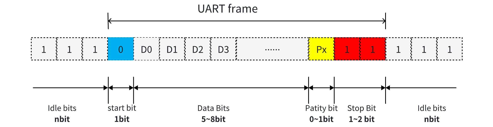
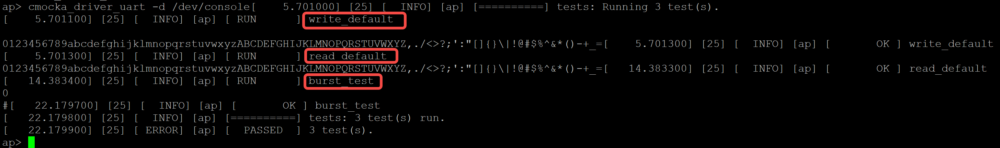

# UART Driver Adaptation and Usage Guide

\[ English | [简体中文](../../../../../zh-cn/device_dev_guide/driver/bus_driver/UART/UART.md) \]

## I. Overview

### 1. Introduction

UART (Universal Asynchronous Receiver/Transmitter), also known as Serial (serial communication interface) or simply serial port, is a technology that enables simplex, half-duplex, or full-duplex communication between two devices. UART communication is based on serial data transmission, where data is sent or received bit by bit, differing from parallel communication (which transfers multiple bits at a time).

The asynchronous characteristic of UART means that the communicating parties do not need to share a clock signal (Clock) but maintain synchronization by pre-agreeing on consistent communication parameters. The basic signals required for UART communication are:

- TX (Transmit): Used to send data.
- RX (Receive): Used to receive data.
- Ground: Used to maintain a common reference potential between the two devices.

### 2. Parameters

When using UART communication, both parties must pre-configure the following main parameters to be the same; otherwise, communication cannot proceed normally:

1. Baud Rate: The communication rate, i.e., the number of bits transmitted per second (such as 9600 bps).
2. Start Bit: A signal marking the start of a data frame.
3. Data Bits: The effective data length for transmission, commonly 8 or 9 bits.
4. Parity Bit: Used for error detection, which can be set to no parity, even parity, or odd parity.
5. Stop Bit: Marks the end of each data frame, typically 1 or 2 bits.

The following figure shows the data frame structure containing these parameters:



### 3. Implementation

In openvela, when an upper-layer application opens a serial port device, the following processes are involved:

1. Upper Half Interface Call:

    The application calls the `uart_open` function to open the serial port.

2. Lower Half Adaptation Layer Processing:

    - `setup` function: Configures UART parameters (such as baud rate, data bits, etc.).
    - `attach` function: Sets up hardware interrupt handling.

3. Chip Manufacturer Adaptation Requirements:

    Chip manufacturers need to adapt the relevant southbound interfaces (Lower Half) to support the correct execution of the `setup` and `attach` functions. After completing the chip driver adaptation, upper-layer applications can control the serial port functions through the northbound interfaces (Upper Half) provided by openvela.

## II. Driver Adaptation

This chapter describes how to complete UART driver adaptation on openvela, including necessary steps and interface descriptions.

### 1. Adaptation Steps

The main steps for UART driver adaptation are as follows:

1. Enable Configuration:

    - Ensure that the `CONFIG_SERIAL` configuration option is enabled.
    - The definition of the UART interface is located in `nuttx/include/nuttx/serial/serial.h`.

2. Implement UART Driver Operation Interfaces:

    - Define and implement the `struct uart_ops_s` structure.

3. Driver Registration:

    - Call `xxx_serialinit` in the `up_initialize` function, where `xxx` usually represents the architecture (such as `arm`).
    - Call `uart_register(FAR const char *path, FAR uart_dev_t *dev)` in the `xxx_serialinit` function to register the UART driver with the system.

4. Implement Device Data Structure:

    - Chip manufacturers need to implement the `struct uart_dev_s` data structure, where `ops` is a pointer member to the previously implemented `struct uart_ops_s`.
    - If the chip supports DMA (Direct Memory Access), further adaptation of DMA-related structures is required.

5. Buffer Configuration:

    - In `struct uart_dev_s`, implement `xmit` (transmit buffer) and `recv` (receive buffer) instances to describe the context of data exchange.

### 2. Data Structures

#### `struct uart_dev_s`

`uart_dev_s` is the context data structure of the UART device, typically provided by the Lower Half, used to describe the status and functions of the serial port hardware. Its core definition is as follows:

```C
struct uart_dev_s
{
  /* State data */

  uint8_t              open_count;   /* Number of times the device has been opened */
  volatile bool        xmitwaiting;  /* true: User waiting for space in xmit.buffer */
  volatile bool        recvwaiting;  /* true: User waiting for data in recv.buffer */
#ifdef CONFIG_SERIAL_REMOVABLE
  volatile bool        disconnected; /* true: Removable device is not connected */
#endif
  bool                 isconsole;    /* true: This is the serial console */

#if defined(CONFIG_TTY_SIGINT) || defined(CONFIG_TTY_SIGTSTP) || \
    defined(CONFIG_TTY_FORCE_PANIC) || defined(CONFIG_TTY_LAUNCH)
  pid_t                pid;          /* Thread PID to receive signals (-1 if none) */
#endif

#ifdef CONFIG_SERIAL_TERMIOS
  /* Terminal control flags */

  tcflag_t             tc_iflag;     /* Input modes */
  tcflag_t             tc_oflag;     /* Output modes */
  tcflag_t             tc_lflag;     /* Local modes */
#endif

  /* Semaphores & mutex */

  sem_t                xmitsem;      /* Wakeup user waiting for space in xmit.buffer */
  sem_t                recvsem;      /* Wakeup user waiting for data in recv.buffer */
  mutex_t              closelock;    /* Locks out new open while close is in progress */
  mutex_t              polllock;     /* Manages exclusive access to fds[] */

  /* I/O buffers */

  struct uart_buffer_s xmit;         /* Describes transmit buffer */
  struct uart_buffer_s recv;         /* Describes receive buffer */

  /* DMA transfers */

#ifdef CONFIG_SERIAL_TXDMA
  struct uart_dmaxfer_s dmatx;       /* Describes transmit DMA transfer */
#endif
#ifdef CONFIG_SERIAL_RXDMA
  struct uart_dmaxfer_s dmarx;       /* Describes receive DMA transfer */
#endif

  /* Driver interface */

  FAR const struct uart_ops_s *ops;  /* Arch-specific operations */
  FAR void            *priv;         /* Used by the arch-specific logic */

  /* The following is a list if poll structures of threads waiting for
   * driver events. The 'struct pollfd' reference for each open is also
   * retained in the f_priv field of the 'struct file'.
   */

  struct pollfd *fds[CONFIG_SERIAL_NPOLLWAITERS];
};
```

Explanations of key fields:

- `ops`:

    A pointer to `struct uart_ops_s` that defines the operation set of the UART driver. For example:

        - `setup()` configures hardware parameters.
        - `send()` writes data to the serial port transmit buffer.
        - `receive()` reads received data.

- `priv`:

    The UART private data area, used by the UART hardware driver to store specific information (such as hardware addresses, FIFO buffer pointers, etc.).

- `xmit` and `recv`:

    `xmit` describes the transmit buffer, and `recv` describes the receive buffer. These two fields are the core structures for data interaction between the serial port hardware and upper-layer applications.

#### `struct uart_ops_s`

`struct uart_ops_s` describes the underlying operation interfaces of the UART and is the core part of adaptation. The following is a list of the main methods of the interface:

```C
struct uart_ops_s
{
  /* Configure the UART baud, bits, parity, fifos, etc. This method is called
   * the first time that the serial port is opened. For the serial console,
   * this will occur very early in initialization; for other serial ports
   * this will occur when the port is first opened. This setup does not
   * include attaching or enabling interrupts. That portion of the UART setup
   * is performed when the attach() method is called.
   */

  CODE int (*setup)(FAR struct uart_dev_s *dev);

  /* Disable the UART.  This method is called when the serial port is closed.
   * This method reverses the operation the setup method.
   * NOTE that the serial console is never shutdown.
   */

  CODE void (*shutdown)(FAR struct uart_dev_s *dev);

  /* Configure the UART to operation in interrupt driven mode. This method is
   * called when the serial port is opened. Normally, this is just after the
   * the setup() method is called, however, the serial console may operate in
   * a non-interrupt driven mode during the boot phase.
   *
   * RX and TX interrupts are not enabled when by the attach method (unless
   * the hardware supports multiple levels of interrupt enabling). The RX
   * and TX interrupts are not enabled until the txint() and rxint() methods
   * are called.
   */

  CODE int (*attach)(FAR struct uart_dev_s *dev);

  /* Detach UART interrupts. This method is called when the serial port is
   * closed normally just before the shutdown method is called.
   * The exception is the serial console which is never shutdown.
   */

  CODE void (*detach)(FAR struct uart_dev_s *dev);

  /* All ioctl calls will be routed through this method */

  CODE int (*ioctl)(FAR struct file *filep, int cmd, unsigned long arg);

  /* Called (usually) from the interrupt level to receive one character from
   * the UART.  Error bits associated with the receipt are provided in the
   * the return 'status'.
   */

  CODE int (*receive)(FAR struct uart_dev_s *dev, FAR unsigned int *status);

  /* Call to enable or disable RX interrupts */

  CODE void (*rxint)(FAR struct uart_dev_s *dev, bool enable);

  /* Return true if the receive data is available */

  CODE bool (*rxavailable)(FAR struct uart_dev_s *dev);

#ifdef CONFIG_SERIAL_IFLOWCONTROL
  /* Return true if UART activated RX flow control to block more incoming
   * data.
   */

  CODE bool (*rxflowcontrol)(FAR struct uart_dev_s *dev,
                             unsigned int nbuffered, bool upper);
#endif

#ifdef CONFIG_SERIAL_TXDMA
  /* Start transfer bytes from the TX circular buffer using DMA */

  CODE void (*dmasend)(FAR struct uart_dev_s *dev);
#endif

#ifdef CONFIG_SERIAL_RXDMA
  /* Start transfer bytes from the TX circular buffer using DMA */

  CODE void (*dmareceive)(FAR struct uart_dev_s *dev);

  /* Notify DMA that there is free space in the RX buffer */

  CODE void (*dmarxfree)(FAR struct uart_dev_s *dev);
#endif

#ifdef CONFIG_SERIAL_TXDMA
  /* Notify DMA that there is data to be transferred in the TX buffer */

  CODE void (*dmatxavail)(FAR struct uart_dev_s *dev);
#endif

  /* This method will send one byte on the UART */

  CODE void (*send)(FAR struct uart_dev_s *dev, int ch);

  /* Call to enable or disable TX interrupts */

  CODE void (*txint)(FAR struct uart_dev_s *dev, bool enable);

  /* Return true if the tranmsit hardware is ready to send another byte.
   * This is used to determine if send() method can be called.
   */

  CODE bool (*txready)(FAR struct uart_dev_s *dev);

  /* Return true if all characters have been sent.  If for example, the UART
   * hardware implements FIFOs, then this would mean the transmit FIFO is
   * empty.  This method is called when the driver needs to make sure that
   * all characters are "drained" from the TX hardware.
   */

  CODE bool (*txempty)(FAR struct uart_dev_s *dev);
};
```

Interface methods and function descriptions:

- `setup()`

    - Function: Initializes the hardware serial port, including configuring basic parameters such as baud rate, data bits, and parity.
    - Application scenario: Called when the device first opens the serial port.

- `shutdown()`

    - Function: Disables the current serial port and releases hardware resources.
    - Application scenario: Called when the device closes the serial port.

- `attach()`

    - Function: Binds the interrupt service function of the serial port to create an association for hardware interrupt driving.
    - Application scenario: Called when the serial port needs to support interrupts.

- `detach()`

    - Function: Unbinds the interrupt service function of the serial port and解除 the association between hardware and interrupts.
    - Application scenario: Called when stopping interrupt-driven operation.

- `ioctl()`

    - Function: Executes the serial port operation specified by the command (cmd), providing a flexible configuration and control interface.
    - Application scenario: Various non-standard special operations.

- `receive()`

    - Function: Receives data from the serial port hardware and returns the current data status.
    - Application scenario: Used in data transmission APIs to read bytes from the device.

- `rxint()`

    - Function: Enables or disables the receive interrupt of the serial port.
    - Application scenario: Called when needing to receive data through an interrupt mechanism.

- `rxavailable()`

    - Function: Checks if there is data readable in the serial port receive buffer.
    - Application scenario: Determines whether to call `.receive()` to read data.

- `rxflowcontrol()`

    - Function: Controls the receive hardware flow, enabling or disabling receive flow control when the buffer status meets specific requirements.
    - Application scenario: Scenarios with hardware flow control.

DMA-related interfaces (if hardware supports DMA):

- `dmasend()`

    - Function: Uses DMA to extract and send data from the circular buffer to the serial port hardware.
    - Application scenario: Improves efficiency in large-scale or high-performance data transmission.

- `dmareceive()`

    - Function: Uses DMA to receive data from the serial port hardware and store it in the circular buffer.
    - Application scenario: In high-throughput data writing scenarios.

- `dmarxfree()`

    - Function: Notifies the DMA receive module that there is remaining space in the buffer.
    - Application scenario: Informs DMA when there is a buffer overflow or traffic interruption.

- `dmatxavail()`

    - Function: Notifies the DMA module that there is data to be sent, allowing a transfer operation to be executed.
    - Application scenario: Called when efficiently sending large data blocks.

Data sending-related interfaces:

- `send()`

    - Function: Sends data to the serial port, typically writing one byte to the transmit buffer.
    - Application scenario: Core operation in the data output process.

- `txint()`

    - Function: Enables or disables the transmit interrupt of the serial port.
    - Application scenario: Used to handle the interrupt mechanism of the serial port transmit queue.

- `txready()`

    - Function: Checks if the serial port is ready to send new data.
    - Application scenario: Status query before sending data.

- `txempty()`

    - Function: Checks if the serial port hardware has completed all data transmission, including buffer data transfer.
    - Application scenario: Ensures all sending tasks are completed before performing other operations (such as closing the serial port).

For actual code, refer to `nuttx/arch/arm/src/stm32/stm32_serial.c`.

## III. Using UART Character Device Driver

This chapter describes how to use the UART character device driver in the openvela system, including key processes such as registration, opening, reading/writing, polling, and closing.

### 1. `uart_register`

`uart_register` is a wrapper for `register_driver` and is used to register the UART driver as a system device node.

```C
int register_driver(FAR const char *path,
                    FAR const struct file_operations *fops,
                    mode_t mode, FAR void *priv)
```

The main functions of `register_driver` include the following three aspects:

1. Find or create a device node: According to the incoming path `path`, check if the corresponding `inode` exists. If not, create a new `inode` for this path.
2. Bind the driver file operation set: Write the specific driver's file operation structure `struct file_operations fops` into the `inode` associated with the path `path`.
3. Set private data: Set the private data `priv` into the `inode` corresponding to the path `path`. In the UART driver, this `priv` is typically `uart_dev_t *`.

The corresponding simplified flow chart is as follows:


### 2. `struct file_operations`

In the UART driver, the typical implementation of the file operation structure `struct file_operations` is as follows:

```C
static const struct file_operations g_serialops =
{
  uart_open,  /* open */
  uart_close, /* close */
  uart_read,  /* read */
  uart_write, /* write */
  0,          /* seek */
  uart_ioctl, /* ioctl */
  uart_poll   /* poll */
#ifndef CONFIG_DISABLE_PSEUDOFS_OPERATIONS
  , NULL      /* unlink */
#endif
};
```

### 3. `uart_open`

The main role of the `uart_open` function is to initialize the serial port device by calling `uart_setup` and bind the interrupt service function simultaneously, preparing the device for normal operation.

```C
fs/vfs/fs_open.c
|_ nx_vopen
   |_ file_vopen
      |_ inode->u.i_mops->open(filep, desc.relpath, oflags, mode) == uart_open
         |_ uart_setup == dev->ops->setup    // setup is called here
         |_ uart_attach  == esp32c3_attach   // attach interrupt handler
            |_ irq_attach(priv->irq, uart_handler, dev);
         |_ uart_dmarxfree(dev)  //Enable DMA for receive buffer (if applicable)
```

1. Hardware initialization: Calls `uart_setup` to complete hardware parameter configuration, such as baud rate, data bits, and parity.
2. Bind interrupts: Calls `uart_attach` to bind the interrupt service function, ensuring the serial port device supports interrupt-driven operation.
3. DMA configuration: If receive DMA is enabled, further calls `uart_dmarxfree` to provide support.

### 4. `uart_read`

The main function of the `uart_read` function is to read data from the receive buffer `dev->recv->buff` and return it to the upper-layer caller. If the buffer is empty, data is obtained through blocking or DMA.

```C
fs/vfs/fs_read.c
|_ nx_read
   |_ file_read
      |_ inode->u.i_ops->read == uart_read(filep, buffer, buflen)
         |_ if (rxbuf->head != tail) // If there is data in the read buffer, it is directly read out
            |_ ch = rxbuf->buffer[tail];
            |_ *buffer++ = ch;
         |_ else
            |_ uart_dmarxfree/uart_enablerxint // If read DMA exists, trigger this operation; otherwise, enable the read interrupt
            |_ dev->recvwaiting = true;
            |_ ret = nxsem_wait(&dev->recvsem);  // Blocking read
         |_ uart_enablerxint   // == dev->ops->rxint , Location where rxint is called
         |_ uart_dmarxfree(dev);  // After the read operation is complete, there must be space in the buffer. If read DMA is enabled, trigger this operation
```

1. Direct data reading: If the buffer has data, return it directly.
2. Buffer empty handling:

    - If DMA is enabled, call `uart_dmarxfree` to extract data.
    - If DMA is not enabled, call `uart_enablerxint` to enable the receive interrupt.

3. Blocking read: Call `nxsem_wait(&dev->recvsem)` to block the current process until the data is ready.

### 5. `uart_write`

`uart_write` is used to write data to the transmit buffer (`dev->xmit->buffer`) of the serial port device, implemented by calling the `uart_putxmitchar` function to write the specific data and trigger interrupt or DMA operations as needed.

```C
fs/vfs/fs_write.c
|_ nx_write
   |_ file_write
      |_ inode->u.i_ops->write(filep, buf, nbytes) == uart_write
         |_ uart_disabletxint  // Location where txint is called
         |_ uart_putxmitchar(dev, ch, oktoblock); // Put data into the buffer. This function also checks if write DMA should be used for transmission via uart_dmatxavail
            |_ if (nexthead != dev->xmit.tail) // If there is space in the write buffer, put the data into it and return
            |_ else // Enable the interrupt and wait for the interrupt to free up space in the write buffer to wake itself up
               |_ uart_enabletxint(dev);  // Location where txint is called
               |_ nxsem_wait(&dev->xmitsem);
         #ifdef CONFIG_SERIAL_TXDMA
         |_ uart_dmatxavail(dev); // If write DMA is available, use DMA to complete the transmission
         #endif
         |_ uart_enabletxint(dev) == esp32c3_txint  // If the above DMA is used, this function will return directly without triggering data transmission actions
```

1. Disable transmit interrupt: Ensure no interrupt interference occurs during writing.
2. Write data to the buffer: Call `uart_putxmitchar(dev, ch, oktoblock)` to put the data into the locked transmit buffer and determine whether to block the write operation.
3. (Optional) Use DMA: If DMA is enabled, trigger DMA for efficient transmission through `uart_dmatxavail`.
4. Enable transmit interrupt: Call `uart_enabletxint` to ensure that after the write operation is completed, the transmit buffer data is controlled by the interrupt mechanism.

### 6. `uart_poll`

`uart_poll` provides a non-blocking mode for asynchronous operations, used to monitor the readable and writable events of the device. In the UART driver, the waiting, notification, and wake-up mechanisms of `uart_poll` are important functions.

#### `uart_poll` Waiting Mechanism

Through `poll`, applications can monitor changes in the device's status (such as whether the device is readable or writable) in non-blocking mode.

```text
fs/vfs/fs_poll
|_ poll_setup(kfds, nfds, &sem);
   |_ poll_fdsetup(fds[i].fd, &fds[i], true)
      |_ file_poll(filep, fds, setup);
         |_ inode->u.i_ops->poll(filep, fds, setup); == uart_poll
   |_ if(timeout<0) 
      |_ nxsem_wait(&sem);
```

1. Initialize the polling state:

    Call the `poll_setup()` function to initialize the `pollfd` list, recording the monitored file descriptors and their concerned events (such as `POLLIN` or `POLLOUT`).

2. Associate the driver's `poll` method:

    Call the specific implementation corresponding to `uart_poll` through the `inode` file node to monitor the device's readable/writable status.

3. (Optional) Blocking wait:

    If a timeout period (the `timeout` parameter) is set, `poll` will block the thread until the timeout period expires or the event is triggered.

#### `uart_poll` Wake-up Mechanism

When the serial port hardware undergoes a status change (new data is received or buffer space is released), the wake-up mechanism is triggered by an interrupt event. The following is the typical interrupt handling process for `uart_poll`:

```text
arch/risc-v/src/esp32c3/esp32c3_serial.c
|_ int_status = getreg32(UART_INT_ST_REG(priv->id));
|_ if (int_status & tx_mask)
   |_ uart_xmitchars
      |_ while (dev->xmit.head != dev->xmit.tail && uart_txready(dev))// Location where txready is called
         |_ uart_send(dev, dev->xmit.buffer[dev->xmit.tail])  // Location where send is called to transmit all data in the buffer
         |_ uart_datasent
            |_ poll_notify(dev->fds, CONFIG_SERIAL_NPOLLWAITERS, POLLOUT)// Wake up writers waiting in poll
            |_ nxsem_post(&dev->xmitsem)// Wake up writers waiting in write
|_ if (int_status & rx_mask)
   |_ uart_recvchars
      |_ uart_rxavailable(dev)            // Location where rxavailable is called
      |_ uart_rxflowcontrol               // Location where rxflowcontrol is called
      |_ ch = uart_receive(dev, &status)  // Location where receive is called
      |_ uart_check_special(dev, &ch, 1)  // Location where control characters are processed
      |_ uart_datareceived(dev)          
         |_ poll_notify(dev->fds, CONFIG_SERIAL_NPOLLWAITERS, POLLIN); 
            |_ fds->cb(fds); == poll_default_cb
               |_ nxsem_post(pollsem)    // If there are blocked poll operations, wake them up
         |_ nxsem_post(&dev->recvsem);   // If there are blocked read operations, wake them up
      |_ nxsig_kill(dev->pid, signo);   // Location where a signal is sent if signo != 0
```

##### Write Event Handling Process

1. Trigger condition:

    When all data in the transmit buffer is transmitted, the hardware triggers a write interrupt (`tx_mask`).

2. Interrupt operations:

    - Call the `uart_xmitchars` function to write data from the transmit buffer to the hardware FIFO.
    - Notify the application of a writable event (`POLLOUT`) through `poll_notify` to wake up the thread or task waiting for writing.
    - If the thread is blocked on the write operation, call `nxsem_post(&dev->xmitsem)` to wake up the thread.

##### Read Event Handling Process

1. Trigger condition:

    When the hardware receives data, a read interrupt (`rx_mask`) is triggered.

2. Interrupt operations:

    - Call the `uart_recvchars` function to read data from the hardware receive buffer.
    - Call `poll_notify` to notify the application of a readable event (`POLLIN`) to wake up the thread or task waiting for reading.
    - If the thread is blocked on the read operation, call `nxsem_post(&dev->recvsem)` to wake up the thread.

### 7. `uart_close`

The `uart_close` function is used to release the UART device and related system resources. In the openvela system, `uart_close` is the core operation of the device closing process, including disabling interrupts, clearing the transmit buffer, and reclaiming hardware resources.

```plaintext
 fs/inode/fs_files.c
 int close(int fd)
 |_ nx_close(fd)
    |_ file_close(&file)
       |_ inode->u.i_ops->close(filep)  //== uart_close
          |_ uart_disablerxint(dev)
          |_ if ((filep->f_oflags & O_NONBLOCK) == 0)
             |_ uart_tcdrain  // Transmit all data in both the TX buffer and hardware FIFO
                |_ uart_txempty // Location where txempty is called
          |_ uart_detach(dev)       // Location where detach is called
          |_ if (!dev->isconsole)
             |_ uart_shutdown(dev)  // Location where shutdown is called
          |_ uart_datareceived(dev)
```

1. Disable receive interrupt:

    The `uart_disablerxint` is called to disable the receive interrupt of the serial port device, avoiding unstable behavior caused by interrupts after the device is released.

2. Clear the transmit buffer:

    If the file operation is not set to non-blocking mode (`filep->f_oflags & O_NONBLOCK == 0`), `uart_tcdrain` ensures that all data in the transmit buffer and hardware FIFO is sent. The `uart_txempty` is called to determine if data transmission is complete.

3. Unbind the interrupt service:

    Call `uart_detach` to unbind the association between the serial port device and the interrupt service, ensuring that interrupt resources are completely released.

4. Release hardware resources:

    If the device is not a console (`!dev->isconsole`), call `uart_shutdown` to complete the回收 and release of hardware resources.

5. Other cleanup operations:

    After closing the device, call methods such as `uart_datareceived` to process remaining buffer data and avoid resource leaks.

## IV. Operating UART Device Nodes

This chapter describes how to operate UART device nodes in openvela. The provided serial communication interfaces fully comply with POSIX standards, including common operations such as opening, reading/writing, polling events, and control. Developers can refer to this document and the `man` manual pages to achieve efficient access and configuration of UART nodes.

### 1. Interface Operations for UART Device Nodes

Users can operate UART device nodes, such as `/dev/console` or `/dev/ttyS0`, through the following POSIX standard interfaces.

The following are common file operation interfaces and examples:

```C
int fd = open("/dev/console", O_RDWR);
int ret = read(fd, buf, count);
int ret  = write(fd, buf, count);
int poll(struct pollfd *fds, nfds_t nfds, int timeout);  
// Events that can be polled are defined in sys/poll.h. Common ones include POLLIN/POLLOUT
int ioctl(int fd, unsigned long request, ...);
// Available ioctl commands are defined in include/nuttx/serial/tioctl.h, which contains detailed definitions for each command
close(fd); 
 
```

- `open` and `close`: Responsible for opening and closing device nodes.
- `read` and `write`: Used to read data from or write data to the UART device.
- `poll`: Detects UART events in non-blocking mode, such as readable (`POLLIN`) and writable (`POLLOUT`). Event types can be referenced in the `sys/poll.h` file.
- `ioctl`: Provides detailed control parameters for the UART, such as setting baud rate, data bits, etc. Supported operation commands are defined in `include/nuttx/serial/tioctl.h`.

### 2. Configuring UART Parameters Using `ioctl`

All parameters configurable via `ioctl` are defined in the `struct termios` structure. For specific parameter meanings and values, refer to the `termios.h` file or view the `man termios` manual page. The `struct termios` structure is defined as follows:

```C
nuttx/include/termios.h

struct termios
{
  /* Exposed fields defined by POSIX */

  tcflag_t  c_iflag;        /* Input modes */
  tcflag_t  c_oflag;        /* Output modes */
  tcflag_t  c_cflag;        /* Control modes */
  tcflag_t  c_lflag;        /* Local modes */
  cc_t      c_cc[NCCS];     /* Control chars */

  /* Implementation specific fields.  For portability reasons, these fields
   * should not be accessed directly, but rather through only through the
   * cf[set|get][o|i]speed() POSIX interfaces.
   */

  speed_t c_speed;          /* Input/output speed (non-POSIX) */
};
```

- `c_speed`: Represents the hardware baud rate parameter, which needs to operate hardware registers.
- `c_cc`: Represents control character parameters, which are related to software and do not require operating hardware.

#### Example: Setting UART to RAW mode

```C
tcgetattr(ctx->recvfd, &term);
cfmakeraw(&term);
tcsetattr(ctx->recvfd, TCSANOW, &term);
```

or

```C
file_ioctl(&cmux->filep, TCGETS, &term);
cfmakeraw(&term);
file_ioctl(&cmux->filep, TCSETS, &term);
```

#### Example: Setting UART Baud Rate

The following code shows how to set the UART baud rate through the `termios` structure and `ioctl` interface.

```C
ioctl(fd, TCGETS, termios);// Retrieve the current parameters
int cfsetspeed(FAR struct termios *termios, speed_t speed);// Configure the termios structure. Valid values for speed can be found in termios.h
ioctl(fd, TCSETS, termios);// Apply the modified settings. How the lower half (driver) handles termios->c_speed depends on the vendor's implementation
```

#### Example: Kernel Driver Access to UART Device Nodes

At the kernel layer, driver programs can access UART device nodes through interfaces such as `file_open`. The following are the operation methods corresponding to common interfaces:

```C
int file_open(FAR struct file *filep, FAR const char *path, int oflags, ...);
int file_close(FAR struct file *filep);
ssize_t file_read(FAR struct file *filep, FAR void *buf, size_t nbytes);
ssize_t file_write(FAR struct file *filep, FAR const void *buf,
                   size_t nbytes);
int file_ioctl(FAR struct file *filep, int req, ...);
```

These interfaces can be used to access the UART's node file, enabling low-level manipulation of the UART device.

## V. Test Cases

This chapter introduces the usage of the UART driver test program in the openvela system and provides a detailed analysis of the core implementation and operation steps of the test cases. Through these guidelines, developers can verify the correctness of the UART driver in various operations (such as reading, writing, and multi-data transmission).

### 1. Test Program Path

In the openvela system, the source code of the UART driver test program is in the `apps/testing/drivertest` directory, and the compiled test program is `cmocka_driver_uart`.

### 2. Enable Configuration Options

To successfully compile and run this test program, the following three configuration options need to be enabled:

```Makefile
CONFIG_TESTING_CMOCKA=y
CONFIG_TESTING_DRIVER_TEST=y
CONFIG_TESTING_DRIVER_TEST_SIMPLE=y
```

### 3. Test Cases



In the UART driver test program, the following three core test cases are defined:

1. `write_default`: Writes the character sequence `0-9-a-z` to the specified UART device (such as `/dev/console`) to verify whether the device's writing function is normal.
2. `read_default`: Reads data from the device and verifies whether the same character sequence as the written content can be correctly read. If the read and written data do not match, this test fails.
3. `burst_test`: Simulates a fast input scenario, and the test process includes the following steps:

    - Enter the number `0` and press Enter.
    - Enter the symbol `#` and press Enter to confirm.
    - The test is complete, and the input is verified for compliance with expectations.

After running the above tests, if successful, the program will output `[  PASSED  ] 3 test(s)`.

### 4. Test Program Main Function

The following is the main code structure of the UART test program, which uses the CMocka framework for testing.

```C
int main(int argc, FAR char *argv[])
{
  struct test_confs_s confs =
  {
    .dev_path = CONFIG_TESTING_DRIVER_TEST_UART_DEVICE
  };

  parse_args(argc, argv, &confs);

  const struct CMUnitTest tests[] =
    {
      cmocka_unit_test_prestate_setup_teardown(write_default, setup,
                                               teardown, &confs),
      cmocka_unit_test_prestate_setup_teardown(read_default, setup,
                                               teardown, &confs),
      cmocka_unit_test_prestate_setup_teardown(burst_test, setup,
                                               teardown, &confs),
    };

  return cmocka_run_group_tests(tests, NULL, NULL);
}
```

## VI. Reference Materials

The following resources provide further explanations about the UART driver and TTY working principles:

- [NuttX RTOS for PinePhone: UART Driver](https://lupyuen.github.io/articles/uart)
- [The TTY Demystified](https://www.linusakesson.net/programming/tty/)