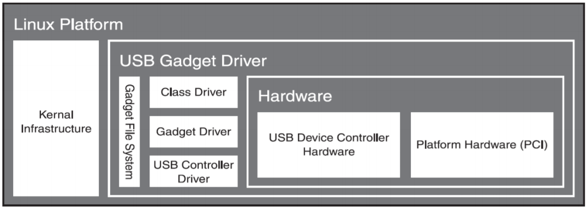
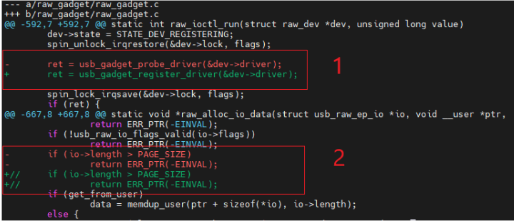

# USB Device Simulation (SIM) Driver Guide

\[ English | [简体中文](../../../../../../zh-cn/device_dev_guide/driver/bus_driver/USB/sim/usb_device_sim_guide.md) \]

This document provides a detailed introduction to the openvela USB Device Simulation (SIM) driver. This driver allows you to simulate a fully functional USB device in a development environment without physical USB hardware. This mechanism is crucial for the development, testing, and validation of USB functionalities on a host machine (currently, only Linux is supported).

## I. Architecture

The architecture of the SIM USB driver is divided into two core parts:

- The **SIM-side Driver (SIM USB Device Driver)**, which runs in the openvela simulator.
- The **Host-side Driver (Host USB Device Driver)**, which runs on the Linux host machine.


### 1. SIM-side Driver (SIM USB Device Driver)

This part runs in the openvela simulation environment, and its main responsibilities are:

- **Implement Standard Interfaces**: Implements the standard `usbdev` and `usbdev_ep` operation interfaces of openvela, allowing upper-layer USB class drivers (like CDC/ACM, ADB) to run transparently.
- **Abstract Host Interface**: Provides an abstract host USB driver interface to forward USB requests to different host operating systems (such as Linux), enhancing the system's portability.

#### Composite Device Configuration

By default, the USB device in the SIM environment exists as a composite device, supporting various combinations of device functions. You can use the `boardctl` command to dynamically select and activate different configurations.

| **Configuration** | **Combined Functions**                                |
| :---------------- | :---------------------------------------------------- |
| `config1`         | ADB (Android Debug Bridge) + RNDIS                    |
| `config2`         | CDC/ACM (Virtual Serial Port) + CDC/ECM (Virtual NIC) |
| `config3`         | CDC/NCM                                               |
| `config4`         | CDC-MBIM                                              |

**Note**: For detailed implementation of the composite device configuration, you can refer to the source code file `nuttx/boards/sim/sim/sim/src/sim_composite.c`.

### 2. Linux Host-side Driver (Linux USB Device Driver)

The host-side driver utilizes the Linux kernel's **USB Gadget** framework to simulate real USB hardware. It provides a standard set of APIs, which are implemented by a USB Device Controller (UDC) driver. The framework diagram is as follows:



Since the SIM environment does not have a real USB Device Controller (UDC), we use the following two kernel modules to build a pure software-based simulation solution:

- **Dummy UDC**: A software-simulated UDC that creates a virtual USB device controller in the kernel.
- **Raw Gadget**: A special Gadget driver that does not implement any specific USB function (like Mass Storage or CDC/ACM). Instead, it passes all low-level USB events and data requests from the Dummy UDC directly to the user-space openvela application for processing.

This approach allows the openvela application to have full control over the USB device enumeration process and data transfers, thereby achieving a high-fidelity simulation of real USB hardware behavior.

#### Raw Gadget Driver

Raw Gadget is a Gadget driver provided by Linux for user-space applications to interact with the underlying controller. It has the same interfaces as other Gadget drivers, but it does not process any USB functions internally. Instead, it passes interactions with the USB controller through to user-space.

- **Manual Binding**: Raw Gadget requires manual selection of the UDC to bind to, allowing us to create multiple Raw Gadget instances bound to different UDCs.
- **Synchronous Operations**: In the current software version of Raw Gadget, endpoint read and write operations only support synchronous mode, meaning the function will not return until the read or write operation is fully completed.
- **Control Interface (`ioctl`)**: Raw Gadget manages the USB device lifecycle through a series of `ioctl` commands.

The `ioctl` commands currently supported by Raw Gadget are as follows:

| IOCTL                         | Description                                                                                                                                                                          |
| ----------------------------- | ------------------------------------------------------------------------------------------------------------------------------------------------------------------------------------ |
| `USB_RAW_IOCTL_INIT`          | Initializes a Raw Gadget instance.                                                                                                                                                   |
| `USB_RAW_IOCTL_RUN`           | Starts the Raw Gadget, binding it to the UDC and beginning USB device enumeration.                                                                                                   |
| `USB_RAW_IOCTL_EVENT_FETCH`   | Fetches Raw Gadget events in a blocking manner. Currently supported event types are: <br>`USB_RAW_EVENT_INVALID` = 0 <br>`USB_RAW_EVENT_CONNECT` = 1 <br>`USB_RAW_EVENT_CONTROL` = 2 |
| `USB_RAW_IOCTL_EP0_WRITE`     | Performs a write request (IN transaction) on EP0.                                                                                                                                    |
| `USB_RAW_IOCTL_EP0_READ`      | Performs a read request (OUT transaction) on EP0.                                                                                                                                    |
| `USB_RAW_IOCTL_EP_ENABLE`     | Enables a specified endpoint. Fails if the endpoint does not match the descriptor.                                                                                                   |
| `USB_RAW_IOCTL_EP_DISABLE`    | Disables a specified endpoint.                                                                                                                                                       |
| `USB_RAW_IOCTL_EP_WRITE`      | Performs a write request (IN transaction) on an endpoint.                                                                                                                            |
| `USB_RAW_IOCTL_EP_READ`       | Performs a read request (OUT transaction) on an endpoint.                                                                                                                            |
| `USB_RAW_IOCTL_CONFIGURE`     | Switches the Raw Gadget to the configured state.                                                                                                                                     |
| `USB_RAW_IOCTL_VBUS_DRAW`     | Limits the power drawn from the UDC VBUS.                                                                                                                                            |
| `USB_RAW_IOCTL_EPS_INFO`      | Gets endpoint information for the currently bound UDC.                                                                                                                               |
| `USB_RAW_IOCTL_EP0_STALL`     | Sets EP0 to the STALL state.                                                                                                                                                         |
| `USB_RAW_IOCTL_EP_SET_HALT`   | Halts a specified endpoint.                                                                                                                                                          |
| `USB_RAW_IOCTL_EP_CLEAR_HALT` | Clears the halt state of a specified endpoint.                                                                                                                                       |
| `USB_RAW_IOCTL_EP_SET_WEDGE`  | Sets an endpoint wedge.                                                                                                                                                              |

#### Dummy UDC Driver

Dummy UDC is a software-simulated UDC driver provided by Linux. This driver includes both Host Controller and Device Controller components, enabling Host-to-Device transfers on the same machine.

The following is a list of all supported endpoints in Dummy UDC. When configuring endpoints, you should select appropriate ones based on this information.

```C
  /* everyone has ep0 */
  EP_INFO(ep0name,
    USB_EP_CAPS(USB_EP_CAPS_TYPE_CONTROL, USB_EP_CAPS_DIR_ALL)),
  /* act like a pxa250: fifteen fixed function endpoints */
  EP_INFO("ep1in-bulk",
    USB_EP_CAPS(USB_EP_CAPS_TYPE_BULK, USB_EP_CAPS_DIR_IN)),
  EP_INFO("ep2out-bulk",
    USB_EP_CAPS(USB_EP_CAPS_TYPE_BULK, USB_EP_CAPS_DIR_OUT)),
  ...

  /* or like sa1100: two fixed function endpoints */
  EP_INFO("ep1out-bulk",
    USB_EP_CAPS(USB_EP_CAPS_TYPE_BULK, USB_EP_CAPS_DIR_OUT)),
  EP_INFO("ep2in-bulk",
    USB_EP_CAPS(USB_EP_CAPS_TYPE_BULK, USB_EP_CAPS_DIR_IN)),

  /* and now some generic EPs so we have enough in multi config */
  EP_INFO("ep-aout",
    USB_EP_CAPS(TYPE_BULK_OR_INT, USB_EP_CAPS_DIR_OUT)),
  EP_INFO("ep-bin",
    USB_EP_CAPS(TYPE_BULK_OR_INT, USB_EP_CAPS_DIR_IN)),
  ...
```

## II. Environment Setup and Configuration

Before using the SIM USB functionality, you need to complete the necessary environment setup on your Linux host.

### 1. Install the Host-side Kernel Module (Raw Gadget)

The Linux kernel has natively included the Raw Gadget feature since version 5.7. If your kernel version is older than 5.7, you will need to manually download, compile, and install the relevant modules. The steps are as follows:

1. Download the Raw Gadget code:

    ```Bash
    git clone https://github.com/xairy/raw-gadget
    ```

2. Modify the Code (As Needed):

    You may need to adapt the code based on your host's kernel version.

    

    - **Modification 1**: Adapt the Gadget driver registration interface for different kernel versions. Newer kernels use `usb_gadget_register_driver`, while older ones might use `usb_gadget_probe_driver`. If compilation fails, refer to this point.

    - **Modification 2**: Adjust the packet size limit. To support USB classes that require large packet transfers, such as NCM (Network Control Model), it is recommended to remove or comment out the check for `PAGE_SIZE` to avoid communication issues.

3. Compile and install Raw Gadget:

    ```Bash
    $ cd dummy_hcd
    $ make
    $ ./insmod.sh
    
    $ cd raw_gadget
    $ make
    $ ./insmod.sh
    ```

#### Troubleshooting

- **Problem**: `insmod: ERROR: could not insert module ./dummy_hcd.ko: Operation not permitted`
  
    

    **Solution**: This issue is typically caused by the **Secure Boot** option in BIOS/UEFI, which prohibits loading unsigned kernel modules. Please enter your BIOS/UEFI settings and temporarily disable Secure Boot.

- **Problem**: `insmod: ERROR: could not insert module ./dummy_hcd.ko: Invalid module format` 

    **Solution**: This error indicates that the module is incompatible with the currently running kernel. Try running the project's update script (e.g., `update.sh`), then recompile and reinstall.

## III. Usage Guide: USB Functionality Testing

Once the environment is configured, you can start testing specific USB functions. The following steps demonstrate how to configure and use ADB, RNDIS, CDC/ACM, and CDC/ECM.

### 1. Using ADB (Android Debug Bridge)

#### Step 1: Add a udev Rule on the Host

```bash
sudo vi /etc/udev/rules.d/51-android.rules

# Add the following content. The idVendor and idProduct must match those configured in openvela.
# This example uses 1630 and 0042.
SUBSYSTEM=="usb", ATTR{idVendor}=="1630", ATTR{idProduct}=="0042", MODE="0666", GROUP="plugdev"

# Use lsusb to check the output. In the example below, 18d1 is the idVendor and 4e11 is the idProduct.
# lsusb
# Bus 001 Device 058: ID 18d1:4e11 Google Inc. Nexus One
```

After saving, re-plug the device for the rule to take effect.

#### Step 2: Compile and Start the adbd Service on the openvela side

1. Enable Kconfig options:

    ```Makefile
    CONFIG_USBDEV_COMPOSITE=y
    CONFIG_USBADB=y
    CONFIG_USBADB_COMPOSITE=y
    CONFIG_SYSTEM_ADBD=y
    CONFIG_ADBD_USB_SERVER=y
    CONFIG_ADBD_FILE_SERVICE=y
    CONFIG_ADBD_FILE_SYMLINK=y
    CONFIG_ADBD_SHELL_SERVICE=y
    ```

2. Compile and run `usbdev`. Note that it requires root privileges:

    ```Bash
    ./build.sh sim:usbdev -j8
    sudo ./nuttx/nuttx
    ```

3. Connect to composite device 0 and start `adbd`:

    ```Bash
    NuttShell (NSH) NuttX-12.0.0-RC0
    nsh> adbd &
    ```

#### Step 3: Connect and Test the Device on the Host

1. Check the device list:

    ```Bash
    adb devices
    
    List of devices attached
    * daemon not running; starting now at tcp:5037
    * daemon started successfully
    0101        device
    ```

    If you see the `device` status as shown above, the connection is successful.

2. Use `adb` commands:

    ```Bash
    # Enter the device's shell
    adb shell
    
    nsh> help
    help usage:  help [-v] [<cmd>]
    
    .         cp        env       insmod    mkrd      readlink  test      uptime    
    [         cmp       exec      kill      mount     rm        time      usleep    
    ?         dirname   exit      ln        mv        rmdir     true      xd        
    basename  dd        false     ls        poweroff  rmmod     truncate  
    break     df        free      lsmod     printf    set       uname     
    cat       dmesg     help      mkdir     ps        sleep     umount    
    cd        echo      hexdump   mkfifo    pwd       source    unset     
    
    Builtin Apps:
    adbd    ostest  sh      nsh 
    nsh> exit
    
    # Push a file from the host to the device
    adb push ./Make.defs /tmp
    ./Make.defs: 1 file pushed. 0.0 MB/s (6999 bytes in 0.467s)
    
    # Pull a file from the device to the host
    adb pull /tmp/Make.defs ./Make.defs.recv
    /tmp/Make.defs: 1 file pulled. 0.0 MB/s (6999 bytes in 0.361s)
    ```

### 2. Using RNDIS (Virtual NIC)

#### Step 1: Configure RNDIS on the openvela Side

1. Enable Kconfig build options:

    ```Makefile
    CONFIG_USBDEV_COMPOSITE=y
    CONFIG_RNDIS=y
    CONFIG_RNDIS_COMPOSITE=y
    CONFIG_EXAMPLES_DHCPD=y
    CONFIG_NETUTILS_DHCPD=y
    
    Enable Kconfig build options:
    CONFIG_NET_ICMP=y
    CONFIG_NET_ICMP_SOCKET=y
    CONFIG_SYSTEM_PING=y
    ```

2. Compile and run `usbdev`. This requires root privileges:

    ```Bash
    ./build.sh sim:usbdev -j8
    sudo ./nuttx/nuttx
    ```

#### Step 2: Configure the Network on the Host

Run the script provided by openvela. It will create a virtual network card named `nuttx0` and configure routing.

```Bash
# eno1 is the name of your host's network card used for external network access. Please modify it according to your actual situation.
sudo nuttx/tools/simhostroute.sh eno1 on
```

After execution, you can use `ifconfig nuttx0` to check. The IP address of this network card should be `10.0.1.1`.

```Bash
nuttx0: flags=4099<UP,BROADCAST,MULTICAST>  mtu 1500
        inet 10.0.1.1  netmask 255.255.255.0  broadcast 0.0.0.0
```

#### Step 3: Connect to Composite Device 0 on the openvela Side

Execute in the NSH command line:

```Bash
# Connect to composite device configuration 0 (ADB+RNDIS)
nsh> conn 0 
```

After a successful connection, a network interface named `eth0` will be created inside openvela, with a default IP address of `10.0.1.2`. You can confirm this with the `ifconfig` command.

```Bash
nsh> ifconfig
eth0        Link encap:Ethernet HWaddr 42:00:d7:82:13:6b at RUNNING mtu 1500
        inet addr:10.0.1.2 DRaddr:10.0.1.1 Mask:255.255.255.0
        inet6 addr: fe80::4000:d7ff:fe82:136b/64
        inet6 DRaddr: ::
```

#### Step 4: Verify Network Connectivity

- Ping the host from the openvela side:

    ```Bash
    nsh> ping 10.0.1.1
    PING 10.0.1.1 56 bytes of data
    56 bytes from 10.0.1.1: icmp_seq=0 time=0.0 ms
    ...
    ```

- Ping openvela from the host side:

    ```Bash
    ping 10.0.1.2
    PING 10.0.1.2 (10.0.1.2) 56(84) bytes of data.
    64 bytes from 10.0.1.2: icmp_seq=1 ttl=64 time=0.512 ms
    ...
    ```

- Using Telnet:

    ```Bash
    # Enable Telnet configuration
    CONFIG_NETUTILS_TELNETC=y
    CONFIG_NETUTILS_TELNETD=y

    # Start the telnetd service on the openvela side
    nsh> telnetd &

    # Connect from the host side
    telnet 10.0.1.2
    ```

### Using CDC/ACM (Virtual Serial Port)

1. Enable build options:

    ```Makefile
    CONFIG_USBDEV_COMPOSITE=y
    CONFIG_CDCACM=y
    CONFIG_CDCACM_COMPOSITE=y
    ```

2. Compile and run `usbdev`. This requires root privileges:

    ```Bash
    ./build.sh sim:usbdev -j8
    sudo ./nuttx/nuttx
    ```

3. Connect to USB composite device 1

    ```Bash
    # Connect to composite device configuration 1 (CDC/ACM + CDC/ECM)
    nsh> conn 1
    ```

    Upon success, a device node named `/dev/ttyACM0` will appear on both the openvela and host sides.

    ```Bash
    nsh> ls /dev
    /dev:
    console
    log
    null
    oneshot
    ptmx
    ttyACM0
    ```

4. Verify Communication

    - Send data from the openvela side:

        ```Bash
        nsh> echo hello > /dev/ttyACM0
        ```

    - Receive data on the host side:

        ```Bash
        cat /dev/ttyACM0
        hello
        ```

### 4. Using CDC/ECM (Virtual NIC)

1. Enable build options:

    ```Makefile
    CONFIG_USBDEV_COMPOSITE=y
    CONFIG_NET_CDCECM=y
    CONFIG_CDCECM_COMPOSITE=y
    CONFIG_EXAMPLES_DHCPD=y
    CONFIG_NETUTILS_DHCPD=y
    ```

2. Compile and run `usbdev`. This requires root privileges:

    ```Bash
    ./build.sh sim:usbdev -j8
    sudo ./nuttx/nuttx
    ```

3. Connect to USB composite device 1:

    ```Bash
    NuttShell (NSH) NuttX-12.0.0-RC0
    nsh> ifconfig
    eth0        Link encap:Ethernet HWaddr 00:00:00:00:00:00 at RUNNING mtu 1504
            inet addr:10.0.1.2 DRaddr:10.0.1.1 Mask:255.255.255.0
            inet6 addr: fe80::200:ff:fe00:0/64
            inet6 DRaddr: ::
    
    # Connect to composite device configuration 1
    nsh> conn 1
    conn_main: Performing architecture-specific initialization
    conn_main: Exiting
    
    # After connecting, a new eth1 network card will be added. Use dhcpd to assign an IP to it.
    nsh> ifconfig
    eth0        Link encap:Ethernet HWaddr 00:00:00:00:00:00 at RUNNING mtu 1504
            inet addr:10.0.1.2 DRaddr:10.0.1.1 Mask:255.255.255.0
            inet6 addr: fe80::200:ff:fe00:0/64
            inet6 DRaddr: ::
    
    eth1        Link encap:Ethernet HWaddr 00:e0:de:ad:be:ef at UP mtu 1504
            inet addr:0.0.0.0 DRaddr:0.0.0.0 Mask:0.0.0.0
            inet6 addr: ::/0
            inet6 DRaddr: ::
    ```

4. Assign an IP address to `eth1` via `dhcpd`:

    ```Bash
    nsh> dhcpd_start eth1
    nsh> ifconfig
    eth0        Link encap:Ethernet HWaddr 00:00:00:00:00:00 at RUNNING mtu 1504
            inet addr:10.0.1.2 DRaddr:10.0.1.1 Mask:255.255.255.0
            inet6 addr: fe80::200:ff:fe00:0/64
            inet6 DRaddr: ::
    
    eth1        Link encap:Ethernet HWaddr 00:e0:de:ad:be:ef at UP mtu 1504
            inet addr:10.0.0.1 DRaddr:0.0.0.0 Mask:255.255.255.0
            inet6 addr: ::/0
            inet6 DRaddr: ::
    ```

5. On the host, use `ifconfig` to check for a network card named `enx020000112233`. If its IP is `10.0.0.2`, it is ready to use.

    ```Bash
    $ ifconfig
    enx020000112233: flags=4163<UP,BROADCAST,RUNNING,MULTICAST>  mtu 576
            inet 10.0.0.2  netmask 255.255.255.0  broadcast 10.0.0.255
            ether 02:00:00:11:22:33  txqueuelen 1000  (以太网)
            RX packets 0  bytes 0 (0.0 B)
            RX errors 0  dropped 0  overruns 0  frame 0
            TX packets 58  bytes 9143 (9.1 KB)
            TX errors 0  dropped 0 overruns 0  carrier 0  collisions 0
    ```

6. You can use `ping` and `telnet` to verify network connectivity, just like with RNDIS.

## IV. References

- For specific driver development details, you can refer to [USB Device Driver Development Guide](./../usb_driver_dev_guide.md).
