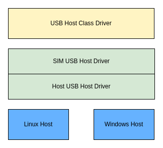

# USB Host Simulation (SIM) Driver Guide

\[ English | [简体中文](../../../../../../zh-cn/device_dev_guide/driver/bus_driver/USB/sim/usb_host_sim_guide.md) \]

This document provides a detailed overview of the architecture and usage of the USB Host driver in the **openvela** simulation (SIM) environment.

## I. Architecture

The driver uses a layered design composed of two cooperating parts:

- **openvela SIM-Side Driver (SIM USB Host Driver)**: Runs in the openvela simulation environment and is responsible for implementing the upper-level interfaces.
- **Host-Side Driver (Host USB Host Driver)**: Runs on the development host (e.g., Linux) and uses `libusb` to simulate hardware behavior.

This architecture decouples the openvela USB host protocol stack from the underlying hardware simulation, enhancing the driver's portability.



### 1. SIM-Side Driver (SIM USB Host Driver)

This driver runs inside the openvela simulation environment and is primarily responsible for the following functions:

- **Implement Core USB Host Interfaces**: Implements the `usbhost` and `usbhost connect` operation interfaces for use by openvela's USB host class drivers.
- **Abstract Low-Level Driver Interface**: Defines a standard set of interfaces for communicating with the **Host-Side Driver** running on the external development host. This design allows for easy adaptation to different development host operating systems (such as Linux or Windows).

By default, the driver supports CDC-ACM (Communications Device Class - Abstract Control Model) composite devices, allowing for direct connection and debugging with an openvela SIM USB Device.

### 2. Host-Side Driver (Host USB Host Driver)

This driver runs on the development host and communicates with physical or virtual USB devices via the `libusb` library, thereby simulating a real USB host controller. Its core functions include:

- **Manage Connection Status**: Uses `libusb` interfaces to get the connection and disconnection status of a specified USB device.
- **Manage Descriptor Information**: Uses `libusb` interfaces to get the configuration, interface, endpoint, and other descriptor information of a specified USB device.
- **Simulate USB Device Enumeration**: Simulates the USB device enumeration process. The current version only supports the `SetConfiguration` request.
- **Simulate Endpoint Transfers**: Simulates different types of endpoint data transfers. The current version supports Interrupt and Bulk transfers.

#### Introduction to the `libusb` Library

`libusb` is an open-source library that provides a user-space API, allowing applications to interact directly with USB devices without writing kernel-level drivers.

- **`libusb_init`**: Initializes a `libusb` context. This function must be called before any other `libusb` function.

    ```C
    int libusb_init(libusb_context ** ctx)
    ```

- **`libusb_open`**: Opens a specified USB device and returns a device handle for subsequent operations.

    ```C
    int libusb_open(libusb_device * dev, libusb_device_handle ** dev_handle)
    ```

- **`libusb_get_config_descriptor`**: Gets the configuration descriptor for a specified USB device.

    ```C
    int libusb_get_config_descriptor(libusb_device * dev,
                                     uint8_t config_index,
                                     struct libusb_config_descriptor ** config)
    ```

- **`libusb_control_transfer`**: Sends a control packet to a specified USB device.

    ```C
    int libusb_control_transfer(libusb_device_handle * dev_handle,
                                uint8_t bmRequestType,
                                uint8_t bRequest,
                                uint16_t wValue,
                                uint16_t wIndex,
                                unsigned char * data,
                                uint16_t wLength,
                                unsigned int timeout)
    ```

- **`libusb_bulk_transfer`**: Sends a bulk packet to a specified USB device.

    ```C
    int libusb_bulk_transfer(libusb_device_handle * dev_handle,
                             unsigned char endpoint,
                             unsigned char * data,
                             int length,
                             int * transferred,
                             unsigned int timeout)
    ```

For more information on the libusb 1.0 API, please refer to the [official libusb API documentation](https://libusb.sourceforge.io/api-1.0/index.html).

## II. Usage Guide

### 1. Prerequisite: Install libusb

On your development host (using Ubuntu as an example), install the `libusb-1.0` development library with the following command:

```Bash
sudo apt-get -y install libusb-1.0-0-dev
```

After installation, the header file is typically located at `/usr/include/libusb-1.0/libusb.h`.

### 2. Procedure

#### Step 1: Compile and Run the USB Host Simulation Environment

Execute the following commands to compile and start the USB Host simulation program. Note that this program requires root privileges to access USB devices.

```Bash
# Compile
./build.sh sim:usbhost -j8
# Run with root privileges
sudo ./nuttx/nuttx
```

#### Step 2: Compile and Run the USB Device Simulation Environment

In a separate terminal window, compile and run the USB Device simulation program.

```Bash
# Compile
./build.sh sim:usbdev -j8
# Run
sudo ./nuttx/nuttx
```

For more details on the USB Device, please refer to the [USB Device Simulation (SIM) Driver Guide](./usb_device_sim_guide.md).

#### Step 3: Establish the Connection and Enable the Device

In the NSH terminal of the **USB Device** simulation environment, execute the `conn 1` command to enable the CDC-ACM device:

```Bash
# Execute in the USB Device terminal
NuttShell (NSH) NuttX-10.3.0
nsh> conn 1
```

At this point, you should see a message in the **USB Host** simulation terminal indicating that the device has been successfully registered, and a device node named `/dev/ttyACM0` has been created.

```Bash
# Expected output in the USB Host terminal
usbhost_connect: Register device: /dev/ttyACM0
usbhost_classbind: Returning: 0
```

#### Step 4: Verify Data Communication

You can now perform bidirectional communication between the Host and Device via the `/dev/ttyACM0` device node.

- **Send data from the Device to the Host.**

    In the **Device** terminal, use the `echo` command to write data to the device node:

    ```Bash
    # Device terminal
    nsh> echo hello > /dev/ttyACM0
    ```

- **Receive data on the Host.**

    In the **Host** terminal, use the `cat` command to read from the device node. You will see the "hello" string sent from the Device.

    ```Bash
    # Host terminal
    nsh> cat /dev/ttyACM0 &
    sh [7:100]
    nsh> usbhost_setup: Entry
    hello
    ```

    At this point, you have successfully verified communication between the USB Host and Device in the simulation environment.
