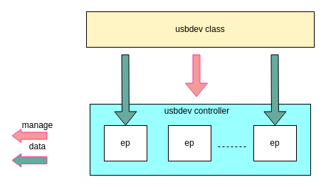
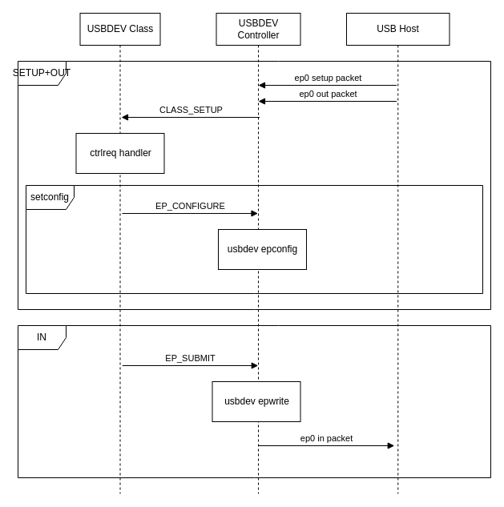
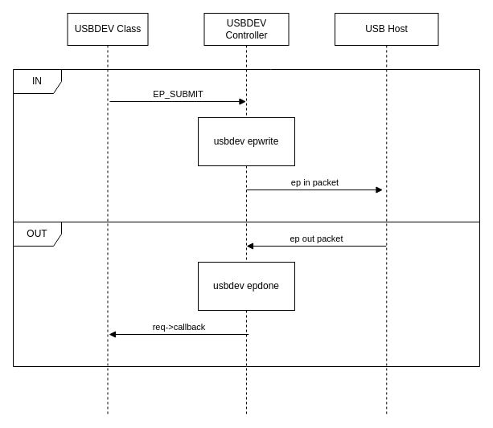

# USB Device Driver Development Guide

\[ English | [简体中文](../../../../../zh-cn/device_dev_guide/driver/bus_driver/USB/usb_driver_dev_guide.md) \]

## I. Architecture Overview

The openvela USB device driver framework uses a layered architecture, mainly composed of the **USB Device Controller Driver (`usbdev_controller`)** and the **USB Device Class Driver (`usbdev_class`)**.



- **USB Device Controller Driver (`usbdev_controller`)**

    This is the hardware-related low-level driver, which must be implemented by the **chip vendor**. It interacts directly with the USB device controller hardware, and its main responsibilities include:

    - **Endpoint Management**: Configure or disable hardware endpoints.
    - **Resource Management**: Allocate and release endpoint resources.
    - **Data Transfer**: Submit or cancel an I/O request, i.e., `struct usbdev_req_s`.
    - **State Management**: Stall or Resume a specified endpoint.
    - **Power Management**: Handle features like Self-powered and Wakeup.
    - **Specific I/O Control**: Handle device-specific `ioctl` commands.
    - Handling of other special I/O commands.

- **USB Device Class Driver (`usbdev_class`)**

    This is the hardware-agnostic upper-level driver, usually provided by openvela, used to implement standard USB class specifications. Its responsibilities include:

    - **Configuration**: Responsible for binding and unbinding the class driver with the `usbdev_controller`.
    - **I/O Resource Management**: Allocate I/O request resources for use by `usbdev_ep`.
    - **I/O Resource Management**: Allocate IPR resources for use by USB endpoints.
    - **Descriptor Management**: Receive and send descriptor information.
    - **Power Management**: Respond to suspend or wakeup events from the USB host.

Currently, openvela supports the following USB device classes:

- Android Debug Bridge (ADB)
- Communication Device Class (CDC-ACM)
- Communication Device Class (CDC-ECM)
- Media Transfer Protocol (MTP)
- PL2303 (USB-to-Serial)
- Remote Network Driver Interface Specification (RNDIS)
- Mass Storage Device
- Composite Device

## II. API Reference

All core structures and interface functions of the USB device driver framework are defined in the header file `/include/nuttx/usb/usbdev.h`. This section will detail these interfaces in two parts.

### 1. USB Device Controller Driver (`usbdev_controller`) - To be Implemented by Vendor

Vendors need to implement the following structures and their associated operation functions to adapt to a specific USB controller.

#### `struct usbdev_s`

Each USB device controller driver must instantiate a `struct usbdev_s` object. This structure represents a low-level USB device. The interface information to be implemented is as follows:

```C++
struct usbdev_s
{
  FAR const struct usbdev_ops_s *ops; /* Access to hardware specific features */
  FAR struct usbdev_ep_s *ep0;        /* Endpoint zero */
  uint8_t speed;                      /* Current speed of the host connection */
  uint8_t dualspeed:1;                /* 1:supports high and full speed operation */
};
```

Its core logic is implemented through the function pointers in `struct usbdev_ops_s`.

- `allocep`: Allocates a hardware endpoint instance based on the physical endpoint number, direction, and type.

    ```C
    CODE FAR struct usbdev_ep_s *(*allocep)(FAR struct usbdev_s *dev,
                                            uint8_t epphy, bool in,
                                            uint8_t eptype);
    ```

- `freeep`: Releases a previously allocated endpoint instance.

    ```C
    CODE void (*freeep)(FAR struct usbdev_s *dev, FAR struct usbdev_ep_s *ep);
    ```

- `getframe`: Gets the current USB frame number.

    ```C
    CODE int (*getframe)(FAR struct usbdev_s *dev);
    ```

- `wakeup`: Wakes up the USB device.

    ```C
    CODE int (*wakeup)(FAR struct usbdev_s *dev);
    ```

- `selfpowered`: Configures whether the device supports being self-powered.

    ```C
    CODE int (*selfpowered)(FAR struct usbdev_s *dev, bool selfpowered);
    ```

- `pullup`: Indicates a connection to or disconnection from the USB host.

    ```C
    CODE int (*pullup)(FAR struct usbdev_s *dev, bool enable);
    ```

- `ioctl`: Executes USB device-specific I/O commands.

    ```C
    CODE int (*ioctl)(FAR struct usbdev_s *dev, unsigned code,
                        unsigned long param);
    ```

#### `struct usbdev_ep_s`

Each USB endpoint must include this instance. The interface information to be implemented is as follows:

```C++
struct usbdev_ep_s
{
  FAR const struct usbdev_epops_s *ops; /* Endpoint operations */
  uint8_t  eplog;                       /* Logical endpoint address */
  uint16_t maxpacket;                   /* Maximum packet size for this endpoint */
  FAR void *priv;                       /* For use by class driver */
  FAR void *fs;                         /* USB fs device this ep belongs */
};
```

The specific operations for an endpoint are defined in `struct usbdev_epops_s`:

- `configure`: Configures an endpoint based on its descriptor information. The endpoint can only be used after it has been successfully configured.

    ```C
    CODE int (*configure)(FAR struct usbdev_ep_s *ep,
                            FAR const struct usb_epdesc_s *desc, bool last);
    ```

- `disable`: Disables the specified endpoint and all transfers on it.

    ```C
    CODE int (*disable)(FAR struct usbdev_ep_s *ep);
    ```

- `allocreq`: Allocates an I/O request structure (`struct usbdev_req_s`) for this endpoint.

    ```C
    CODE FAR struct usbdev_req_s *(*allocreq)(FAR struct usbdev_ep_s *ep);
    ```

- `freereq`: Releases a previously allocated I/O request structure.

    ```C
    CODE void (*freereq)(FAR struct usbdev_ep_s *ep,
                           FAR struct usbdev_req_s *req);
    ```

- `allocbuffer`: Allocates a data buffer for an I/O request. This interface is typically used for hardware that supports DMA.

    ```C
    CODE FAR void *(*allocbuffer)(FAR struct usbdev_ep_s *ep, uint16_t nbytes);
    ```

- `freebuffer`: Releases a previously allocated data buffer. Used in pair with `allocbuffer`.

    ```C
    CODE void (*freebuffer)(FAR struct usbdev_ep_s *ep, FAR void *buf);
    ```

- `submit`: Submits the specified I/O request.

    ```C
    CODE int (*submit)(FAR struct usbdev_ep_s *ep,
                         FAR struct usbdev_req_s *req);
    ```

- `cancel`: Cancels an I/O request currently in progress on the specified endpoint.

    ```C
    CODE int (*cancel)(FAR struct usbdev_ep_s *ep,
                           FAR struct usbdev_req_s *req);
    ```

#### `usbdev register`

This function registers a USB device class driver with the system and binds it to the underlying USB device controller driver by calling the class driver's `bind()` method.

```C
int usbdev_register(struct usbdevclass_driver_s *driver)
```

Reference Implementation:

> **Note**: The `xxx_` and `g_xx_` prefixes in the following code examples are generic placeholders. In actual development, vendors should replace them with chip- or platform-specific names (e.g., `dwc_` or `stm32_`).

```C++
****************************************************************************
 * Name: usbdev_register
 *
 * Description:
 *   Register a USB device class driver. The class driver's bind() method
 *   will be called to bind it to a USB device driver.
 *
 ****************************************************************************/
 
int usbdev_register(struct usbdevclass_driver_s *driver)
{
  /* priv point to vendor usb controller struct */
  struct xxx_usbdev_s *priv = &g_xx_usbdev;
  int ret;

  usbtrace(TRACE_DEVREGISTER, 0);
  
#ifdef CONFIG_DEBUG_FEATURES
  if (!driver || !driver->ops->bind || !driver->ops->unbind ||
      !driver->ops->disconnect || !driver->ops->setup)
    {
      usbtrace(TRACE_DEVERROR(BES_TRACEERR_INVALIDPARMS), 0);
      return -EINVAL;
    }

  if (priv->driver)
    {
      usbtrace(TRACE_DEVERROR(BES_TRACEERR_DRIVER), 0);
      return -EBUSY;
    }
#endif

  /* First hook up the driver */
  priv->driver = driver;

  /* Then bind the class driver */
  ret = CLASS_BIND(driver, &priv->usbdev);
  if (ret)
    {
      usbtrace(TRACE_DEVERROR(SIM_TRACEERR_BINDFAILED), (uint16_t) - ret);
      priv->driver = NULL;
    }
  else
    {
      /* add you code */
      /* Enable USB controller interrupts or pull up usb */
    }

  return ret;
}
```

#### `usbdev_unregister`

This function unregisters a USB device class driver. If the device is connected to a host, it will first disconnect, then call the class driver's `unbind()` method to clean up resources.

```C++
/****************************************************************************
 * Name: usbdev_unregister
 *
 * Description:
 *   Un-register usbdev class driver.If the USB device is connected to a
 *   USB host, it will first disconnect().  The driver is also requested to
 *   unbind() and clean up any device state, before this procedure finally
 *   returns.
 *
 ****************************************************************************/

int usbdev_unregister(struct usbdevclass_driver_s *driver)
{
  /* At present, there is only a single OTG FS device support. Hence it is
   * pre-allocated as g_otgfsdev.  However, in most code, the private data
   * structure will be referenced using the 'priv' pointer (rather than the
   * global data) in order to simplify any future support for multiple
   * devices.
   */

    FAR struct xxx_usbdev_s *priv = &g_xx_usbdev;
    irqstate_t flags;

    usbtrace(TRACE_DEVUNREGISTER, 0);

#ifdef CONFIG_DEBUG_FEATURES
    if (driver != priv->driver) {
        usbtrace(TRACE_DEVERROR(DWC2_TRACEERR_INVALIDPARMS), 0);
        return -EINVAL;
    }
#endif

  /* Reset the hardware and cancel all requests.  All requests must be
   * canceled while the class driver is still bound.
   */

    flags = enter_critical_section();
    xxx_usbreset(priv);
    leave_critical_section(flags);
    
    CLASS_DISCONNECT(driver, &priv->usbdev);

    /* Unbind the class driver */

    CLASS_UNBIND(driver, &priv->usbdev);

    /* Disable USB controller interrupts */

    flags = enter_critical_section();
    up_disable_irq(XXX_IRQ);

    /* Disconnect device */

    xxx_pullup(&priv->usbdev, false);

    /* Unhook the driver */

    priv->driver = NULL;
    leave_critical_section(flags);

    return OK;
}
```

### 2. USB Device Class Driver (`usbdev_class`)

A USB device class driver must implement the `struct usbdevclass_driver_s` interface to be integrated into the USB device stack.

#### `struct usbdevclass_driver_s`

This structure defines a class driver and the highest speed it supports.

```C++
struct usbdevclass_driver_s
{
  FAR const struct usbdevclass_driverops_s *ops;
  uint8_t speed;                  /* Highest speed that the driver handles */
};
```

The specific behavior of the class driver is defined by the function pointers in `struct usbdevclass_driverops_s`, which includes the following interfaces:

- `bind`: Binds the class driver to a specified USB device controller.

    ```C
    CODE int  (*bind)(FAR struct usbdevclass_driver_s *driver,
                      FAR struct usbdev_s *dev);
    ```

- `unbind`: Unbinds the class driver from the USB device controller and releases related resources.

    ```C
    CODE void (*unbind)(FAR struct usbdevclass_driver_s *driver,
                        FAR struct usbdev_s *dev);
    ```

- `setup`: Handles standard and class-specific requests sent to endpoint EP0.

    ```C
    CODE int  (*setup)(FAR struct usbdevclass_driver_s *driver,
                       FAR struct usbdev_s *dev, FAR const struct usb_ctrlreq_s *ctrl,
                       FAR uint8_t *dataout, size_t outlen);
    ```

- `disconnect`: Notifies the class driver that the device has disconnected from the host.

    ```C
    CODE void (*disconnect)(FAR struct usbdevclass_driver_s *driver,
                            FAR struct usbdev_s *dev);
    ```

- `suspend`: Notifies the class driver that the USB bus has entered the suspend state.

    ```C
    CODE void (*suspend)(FAR struct usbdevclass_driver_s *driver,
                         FAR struct usbdev_s *dev);
    ```

- `resume`: Notifies the class driver that the USB bus has resumed from the suspend state.

    ```C
    CODE void (*resume)(FAR struct usbdevclass_driver_s *driver,
                        FAR struct usbdev_s *dev);
    ```

## III. Main Workflows

The following sections describe several key processes for a USB device.

### 1. Initialization Flow

After the system powers on, the USB device needs to be initialized. This includes device hardware initialization, binding the `usbdev_class` driver, and registering the `usbdev_controller` driver.


### 2. Endpoint ep0 Transfer Flow

After initialization, the USB host enumerates the device by communicating with endpoint ep0. This flow handles control transfers:



### 3. Data Endpoint ep Transfer Flow

Once the device is enumerated and configured, data endpoints can be used for communication. This flow shows how data is transferred between the class driver and the USB host through the controller driver.



## IV. Driver Adaptation Guide: SIM Driver Example

This section uses openvela's simulation (SIM) USB driver as an example to demonstrate how to adapt a `usbdev_controller` driver. The SIM driver is a pure software implementation that does not involve specific hardware, making it an excellent reference for understanding the driver framework.

For detailed configuration and usage of the SIM driver, please refer to the [USB Device Simulation (SIM) Driver Guide](./usb_sim_guide.md) documentation.

To enable detailed USB log output, set the following options in your configuration:

```Bash
CONFIG_DEBUG_USB=y
CONFIG_DEBUG_USB_ERROR=y
CONFIG_DEBUG_USB_WARN=y
CONFIG_DEBUG_USB_INFO=y
```

### 1. Initialization Adaptation (Vendor Implementation)

Two functions need to be implemented for the initialization process:

- `sim_usbdev_initialize()`: Called during the early system startup phase (in the `up_initialize()` process) before the OS scheduler starts. It is mainly responsible for configuring pins, clocks, and initializing the USB device controller hardware. Since the SIM driver does not operate on physical hardware, this function body is empty.
- `usbdev_register()`: Called by the `usbdev_class_initialize` function after the OS scheduler starts. It is responsible for initializing `usbdev` software resources and binding the class driver.

The following is the implementation example from the SIM driver:

```C
/****************************************************************************
 * Name: sim_usbdev_initialize
 *
 * Description:
 *   Initialize the USB driver
 *
 ****************************************************************************/

void sim_usbdev_initialize(void)
{
}

/****************************************************************************
 * Name: usbdev_register
 *
 * Description:
 *   Register a USB device class driver. The class driver's bind() method
 *   will be called to bind it to a USB device driver.
 *
 ****************************************************************************/
 
int usbdev_register(struct usbdevclass_driver_s *driver)
{
  struct sim_usbdev_s *priv = &g_sim_usbdev;
  int ret;

  usbtrace(TRACE_DEVREGISTER, 0);

  /* First hook up the driver */
  sim_usbdev_devinit(priv);
  priv->driver = driver;

  /* Then bind the class driver */
  ret = CLASS_BIND(driver, &priv->usbdev);
  if (ret)
    {
      usbtrace(TRACE_DEVERROR(SIM_TRACEERR_BINDFAILED), (uint16_t) - ret);
    }
  else
    {
      /* Setup the USB host controller */
#ifdef CONFIG_USBDEV_DUALSPEED
      host_usbdev_init(SIM_USB_SPEED);
#else
      host_usbdev_init(USB_SPEED_FULL);
#endif
    }

  return ret;
}

/****************************************************************************
 * Name: usbdev_unregister
 *
 * Description:
 *   Un-register usbdev class driver.If the USB device is connected to a USB
 *   host, it will first disconnect().  The driver is also requested to
 *   unbind() and clean up any device state, before this procedure finally
 *   returns.
 *
 ****************************************************************************/

int usbdev_unregister(struct usbdevclass_driver_s *driver)
{
  /* At present, there is only a single OTG FS device support. Hence it is
   * pre-allocated as g_otgfsdev.  However, in most code, the private data
   * structure will be referenced using the 'priv' pointer (rather than the
   * global data) in order to simplify any future support for multiple
   * devices.
   */
  struct sim_usbdev_s *priv = &g_sim_usbdev;
  irqstate_t flags;

  usbtrace(TRACE_DEVUNREGISTER, 0);

  /* Reset the hardware and cancel all requests.  All requests must be
   * canceled while the class driver is still bound.
   */
  flags = enter_critical_section();
  host_usbdev_deinit();
  leave_critical_section(flags);

  /* Unbind the class driver */
  CLASS_UNBIND(driver, &priv->usbdev);

  /* Disable USB controller interrupts */
  flags = enter_critical_section();

  /* Disconnect device */
  host_usbdev_pullup(false);

  /* Unhook the driver */
  priv->driver = NULL;
  leave_critical_section(flags);

  return OK;
}
```

### 2. Implementing `operations` Callbacks

The core functionality of the controller driver is provided by implementing the `usbdev_ops_s` and `usbdev_epops_s` callback structures. The code is as follows:

```C
static const struct usbdev_epops_s g_epops =
{
  .configure   = sim_ep_configure,
  .disable     = sim_ep_disable,
  .allocreq    = sim_ep_allocreq,
  .freereq     = sim_ep_freereq,
  .submit      = sim_ep_submit,
  .stall       = sim_ep_stall,
  .cancel      = sim_ep_cancel,
};

static const struct usbdev_ops_s g_devops =
{
  .allocep     = sim_usbdev_allocep,
  .freeep      = sim_usbdev_freeep,
  .selfpowered = sim_usbdev_selfpowered,
  .pullup      = sim_usbdev_pullup,
  .getframe    = sim_usbdev_getframe,
  .wakeup      = sim_usbdev_wakeup,
};
```

### 3. Using `boardctl` for Dynamic Initialization

If you need to implement dynamic initialization or hot-plug functionality, you can use the `boardctl` command. This feature currently supports classes like ADB, CDC-ACM, PL2303, MSC, and Composite Device. The following example uses ADB for illustration:

- First, enable `boardctl` support in Kconfig:

    ```makefile
    CONFIG_BOARDCTL=y
    CONFIG_BOARDCTL_USBDEVCTRL=y
    ```

- Device Initialization (ADB Example)

    ```C++
    #include <sys/boardctl.h>
    
    FAR void *g_adb_handle = NULL;
    
    void adb_board_init(void)
    {
    struct boardioc_usbdev_ctrl_s ctrl;

    /* Perform architecture-specific initialization */
    ctrl.usbdev   = BOARDIOC_USBDEV_ADB;
    ctrl.action   = BOARDIOC_USBDEV_INITIALIZE;
    ctrl.instance = 0;
    ctrl.config   = 0;
    ctrl.handle   = NULL;

    boardctl(BOARDIOC_USBDEV_CONTROL, (uintptr_t)&ctrl);

    /* Initialize the USB composite device device */
    ctrl.usbdev   = BOARDIOC_USBDEV_ADB;
    ctrl.action   = BOARDIOC_USBDEV_CONNECT;
    ctrl.instance = 0;
    ctrl.config   = 0;
    ctrl.handle   = &g_adb_handle;

    boardctl(BOARDIOC_USBDEV_CONTROL, (uintptr_t)&ctrl);
    }
    ```

- Device De-initialization (ADB Example)

    ```C++
    void adb_board_uninit(void)
    {
    struct boardioc_usbdev_ctrl_s ctrl;
    
    ctrl.usbdev   = BOARDIOC_USBDEV_ADB;
    ctrl.action   = BOARDIOC_USBDEV_DISCONNECT;
    ctrl.instance = 0;
    ctrl.config   = 0;
    ctrl.handle   = &g_adb_handle;

    boardctl(BOARDIOC_USBDEV_CONTROL, (uintptr_t)&ctrl);
    }
    ```

## V. References

- [USB Device Simulation (SIM) Driver Guide](./usb_sim_guide.md)