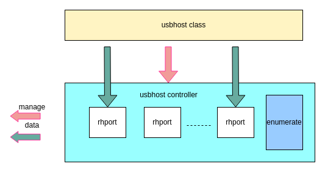
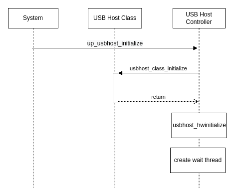
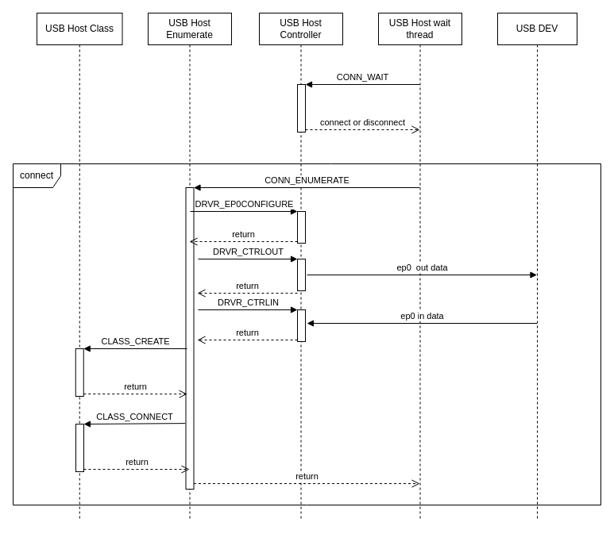
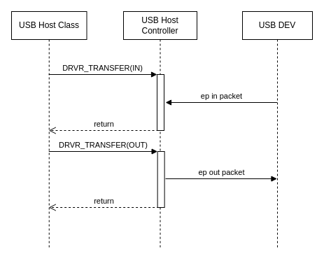

# USB Host Driver Development Guide

\[ English | [简体中文](../../../../../zh-cn/device_dev_guide/driver/bus_driver/USB/usb_driver_host_guide.md) \]

This document provides a detailed guide for developers on how to develop and port USB Host drivers in the **openvela** system.

## I. Architecture Overview

The openvela USB Host driver framework follows a layered design, clearly dividing the driver into two core parts:

- **USB Host Controller Driver (`usbhost_controller`)**: This is the low-level driver, tightly coupled with the hardware. Developers need to implement this layer based on the specific USB Host controller chip (e.g., EHCI, OHCI, xHCI). Its primary responsibilities include:

    - **Endpoint 0 (EP0) Configuration**: Manages the default endpoint used for device enumeration and control transfers.
    - **Resource Management**: Handles the allocation and release of Endpoints and I/O buffers.
    - **Data Transfer**: Manages transfers on the control endpoint and other endpoints, including receive, send, and stop transfer functions.
    - **Connection Management**: Manages the connection and disconnection process of USB devices.

- **USB Host Class Driver (`usbhost_class`)**: This is the hardware-independent upper-layer driver used to implement support for specific USB device classes (e.g., Mass Storage, CDC-ACM, HID). The openvela system already provides a variety of standard class drivers. Its primary responsibility is:

    - **Connection Management**: Handles the connection and disconnection of a USB device to and from the class driver.

The following diagram illustrates the relationship between these two layers:



## II. Core API Reference

The openvela USB Host driver interfaces are all defined in the header file `include/nuttx/usb/usbhost.h`. To port USB Host functionality for new hardware, you primarily need to implement the interfaces related to the **USB Host Controller Driver**.

### 1. USB Host Controller Driver Layer Interface

You need to implement a USB Host Controller Driver (`usbhost_controller`) for your hardware, which mainly involves populating the function pointers in two core structures: `struct usbhost_driver_s` and `struct usbhost_connection_s`.

#### Port Instance (`struct usbhost_hubport_s`)

This structure is an abstract representation of each port in the USB Host stack. Each USB host controller driver must implement this instance. The required interface information is as follows:

```C++
struct usbhost_hubport_s
{
  /* Pointer to the low-level controller driver interface */
  FAR struct usbhost_driver_s *drvr;
#ifdef CONFIG_USBHOST_HUB
  /* Pointer to the parent Hub, NULL if it's a Root Hub */
  FAR struct usbhost_hubport_s *parent;
#endif
  /* Pointer to the bound upper-layer class driver instance */
  FAR struct usbhost_class_s *devclass;
  /* Handle for the control endpoint, EP0 */
  usbhost_ep_t ep0;
  /* Connection status flag */
  bool connected;
  /* Port number */
  uint8_t port;
  /* Device function address */
  uint8_t funcaddr;
  /* Device speed (USB_SPEED_*) */
  uint8_t speed;
};
```

#### Controller Driver Interface (`struct usbhost_driver_s`)

This structure defines a series of callback functions for the USB Host core logic to call to operate on the underlying hardware.

| **Function Pointer** | **Description**                                                                                                                                                                         |
| :------------------- | :-------------------------------------------------------------------------------------------------------------------------------------------------------------------------------------- |
| `ep0configure`       | Configures the default control endpoint (EP0), including `speed` and the maximum packet size for EP0. Called before device enumeration.                                                 |
| `epalloc`            | Allocates and configures an Endpoint. Called when a class driver binds to a device.                                                                                                     |
| `epfree`             | Frees an allocated endpoint.                                                                                                                                                            |
| `alloc` / `free`     | Allocates/frees data buffers.<br>If the hardware provides a special cache, this interface should be implemented; otherwise, it can directly call `kmm_malloc`/`kmm_free`.               |
| `ioalloc` / `iofree` | Allocates/frees buffers for I/O operations.<br>If the hardware provides a special cache, this interface should be implemented; otherwise, it can directly call `kmm_malloc`/`kmm_free`. |
| `ctrlin`             | Performs a blocking control read (IN) transfer.                                                                                                                                         |
| `ctrlout`            | Performs a blocking control write (OUT) transfer.                                                                                                                                       |
| `transfer`           | Performs a blocking transfer.                                                                                                                                                           |
| `asynch`             | Initiates an asynchronous transfer.<br>The function returns immediately, and completion is notified via a callback. Requires `CONFIG_USBHOST_ASYNCH` to be enabled.                     |
| `cancel`             | Cancels an ongoing synchronous or asynchronous transfer on a specified endpoint.                                                                                                        |
| `connect`            | (Only if `CONFIG_USBHOST_HUB` is enabled) Notifies that a new USB device has been connected to the Hub.                                                                                 |
| `disconnect`         | Called when a USB device is disconnected or a class driver error occurs, notifying the controller driver that the device has been disconnected.                                         |

#### Connection Management Interface (`struct usbhost_connection_s`)

This structure is the interface for connection management and device enumeration logic. It is implemented by the controller driver and called by the upper-layer monitor thread. The interfaces to be implemented are as follows:

| **Function Pointer** | **Description**                                                                                                    |
| :------------------- | :----------------------------------------------------------------------------------------------------------------- |
| `wait`               | Blocks and waits until a USB device connects or disconnects.<br>Returns the affected `usbhost_hubport_s` instance. |
| `enumerate`          | Performs enumeration on a newly connected device on the specified port.                                            |

### 2. USB Host Class Driver Layer Interface

#### Class Driver Registry (`struct usbhost_registry_s`)

Each class driver uses this structure to register itself with the system and provide a `create` function. When a device's VID/PID matches an ID in the registry, the system calls this `create` function to instantiate the class driver.

```C++
struct usbhost_registry_s
{
  /* Used to link multiple class driver registrations into a singly-linked list */
  FAR struct usbhost_registry_s *flink;

  /*
   * The factory function for the class driver. When a device matches,
   * the system calls this function to create a class driver instance
   * and bind it to the device session.
   */
  CODE FAR struct usbhost_class_s *(*create)
                                  (FAR struct usbhost_hubport_s *hub,
                                  FAR const struct usbhost_id_s *id);
  /* Describes the list of device IDs (VID/PID) supported by this class driver */
  uint8_t nids;
  FAR const struct usbhost_id_s *id;
};
```

- `create`: Creates a new instance of the USB host class state and binds the USB host driver **session** to the class instance.

    ```C
    CCODE FAR struct usbhost_class_s *(*create)
                                      (FAR struct usbhost_hubport_s *hub,
                                      FAR const struct usbhost_id_s *id);
    ```

#### Class Driver Instance (`struct usbhost_class_s`)

Each USB Host class driver must implement this instance. The interfaces to be implemented are as follows:

| **Function Pointer** | **Description**                                                                                                                                                                                     |
| :------------------- | :-------------------------------------------------------------------------------------------------------------------------------------------------------------------------------------------------- |
| `connect`            | When a USB device is connected, this provides the configuration descriptor information to the class driver, which is used to request and configure endpoints and perform class-specific operations. |
| `disconnected`       | Notifies the class driver that the corresponding USB device has been disconnected.                                                                                                                  |

## III. Core Workflows

The operation of the USB Host driver involves three main processes: **Initialization**, **Enumeration**, and **Data Transfer**. These are explained below.

### 1. Initialization Process

After the system powers on, the USB Host driver needs to be initialized. This includes:

- Initialization of the host controller hardware.
- Initialization of class drivers.
- Creation of a monitor task to wait for device connections.



### 2. Enumeration Process

When the monitor thread detects a device connection via the `wait` function, it starts the enumeration process. This process involves configuring endpoint 0, getting device descriptors, and finally binding the device to a matching class driver through the `create` and `connect` callbacks.



### 3. Data Transfer Process

After a USB device is successfully enumerated and bound to a class driver, the upper-layer application can perform data reads and writes through the interface provided by the class driver (e.g., the file system node `/dev/sda`). These operations ultimately call the `transfer` function implemented by the controller driver to perform the physical data transfer. The following diagram illustrates the synchronous transfer process:



## IV. Driver Porting Guide (SIM Example)

This section uses the USB Host driver for the openvela simulator (SIM) as an example to demonstrate how to port a new Host controller. For detailed configuration and usage of the SIM USB Host, please refer to the [USB Host Simulation (SIM) Driver Guide](./sim/usb_host_sim_guide.md).

### 1. Implement the Initialization Function

You need to implement the `sim_usbhost_initialize()` initialization function. This function serves as the entry point for porting the driver and is responsible for the following tasks:

- **Initialize upper-layer class drivers**: Call `usbhost_*_initialize()` to register all required class drivers.
- **Populate the driver's operation set**: Assign your implemented hardware operation functions to the various function pointers of the `struct usbhost_driver_s` instance.
- **Initialize port and address management**: Configure the `struct usbhost_hubport_s` instance and initialize the device address generator.
- **Initialize the hardware controller**: Call low-level functions to complete the reset and basic configuration of the controller hardware.
- **Create the monitor thread**: Start a new thread to wait for and handle device connection/disconnection events.

```C
int sim_usbhost_initialize(void)
{
  struct sim_usbhost_s *priv = &g_sim_usbhost;
  struct usbhost_hubport_s *hport;
  int ret;

  /* 1. Initialize the required class drivers */
#ifdef CONFIG_USBHOST_CDCACM
  ret = usbhost_cdcacm_initialize();
#endif

  /* 2. Populate the controller driver's operation function set */
  priv->drvr.ep0configure   = sim_usbhost_ep0configure;
  priv->drvr.epalloc        = sim_usbhost_epalloc;
  priv->drvr.epfree         = sim_usbhost_epfree;
  priv->drvr.alloc          = sim_usbhost_alloc;
  priv->drvr.free           = sim_usbhost_free;
  priv->drvr.ioalloc        = sim_usbhost_ioalloc;
  priv->drvr.iofree         = sim_usbhost_iofree;
  priv->drvr.ctrlin         = sim_usbhost_ctrlin;
  priv->drvr.ctrlout        = sim_usbhost_ctrlout;
  priv->drvr.transfer       = sim_usbhost_transfer;
  priv->drvr.cancel         = sim_usbhost_cancel;
  priv->drvr.disconnect     = sim_usbhost_disconnect;
#ifdef CONFIG_USBHOST_ASYNCH
  priv->drvr.asynch         = sim_usbhost_asynch;
#endif

  /* 3. Initialize the port instance */
  hport                       = &priv->hport.hport;
  hport->drvr                 = &priv->drvr;
  hport->ep0                  = &priv->ep0;
  hport->port                 = 0;
  hport->speed                = USB_SPEED_HIGH;

  usbhost_devaddr_initialize(&priv->devgen);
  priv->hport.pdevgen = &priv->devgen;

  /* 4. Initialize hardware and create the monitor thread */
  host_usbhost_init();
  priv->state = USB_HOST_DETACHED;
  ret = kthread_create("usbhost monitor", CONFIG_SIM_USB_PRIO,
                       CONFIG_SIM_USB_STACKSIZE,
                       sim_usbhost_waittask, NULL);
  if (ret < 0)
    {
      uerr("ERROR: Failed to create sim_usbhost_waittask: %d\n", ret);
      return -ENODEV;
    }

  return OK;
}
```

### 2. Implement the Driver Operation Function Set

You need to implement all the callback functions defined in `struct usbhost_driver_s` and `struct usbhost_connection_s`.

The function pointers for `struct usbhost_driver_s` have already been assigned in `sim_usbhost_initialize()` above.

Additionally, you must define a static instance of `struct usbhost_connection_s` to provide the entry points for connection detection and enumeration.

```C
/*
 * Implement the wait and enumerate functions and bind them to g_sim_usbconn.
 * The upper-layer monitor thread will interact with your driver
 * through this instance.
 */
static struct usbhost_connection_s g_sim_usbconn =
{
  .wait      = sim_usbhost_wait,
  .enumerate = sim_usbhost_enumerate,
};
```
