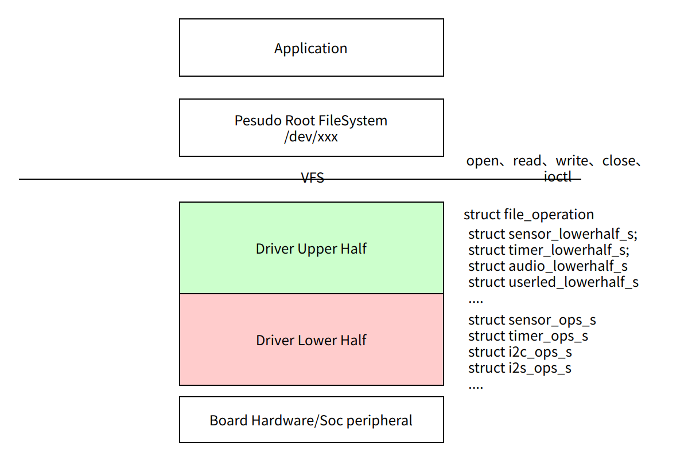
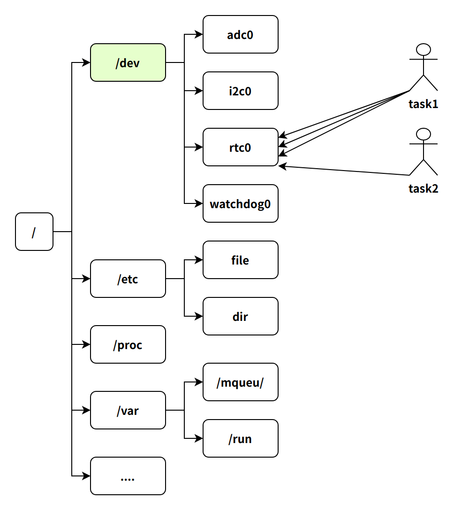
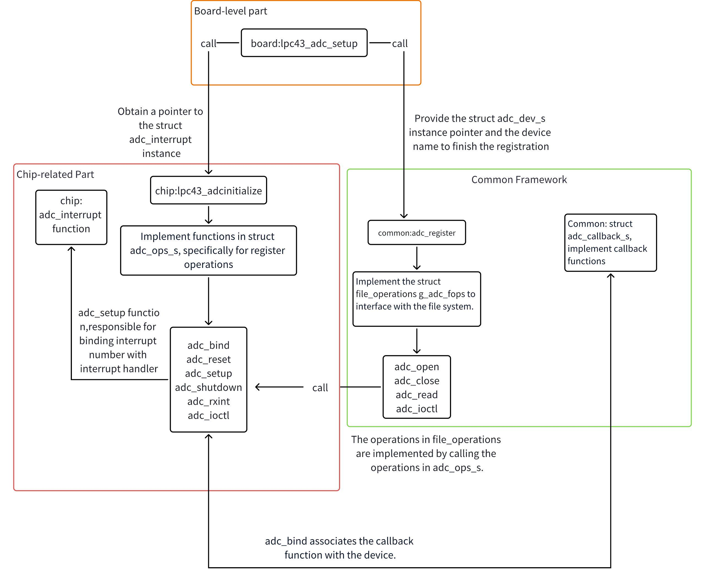
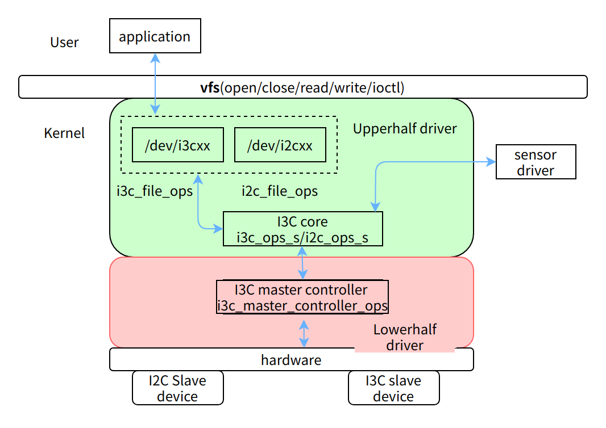
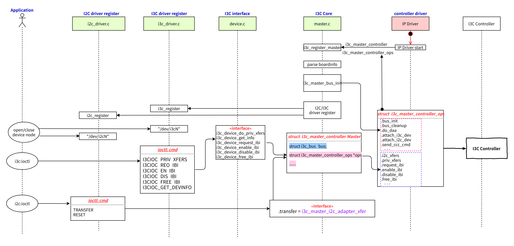
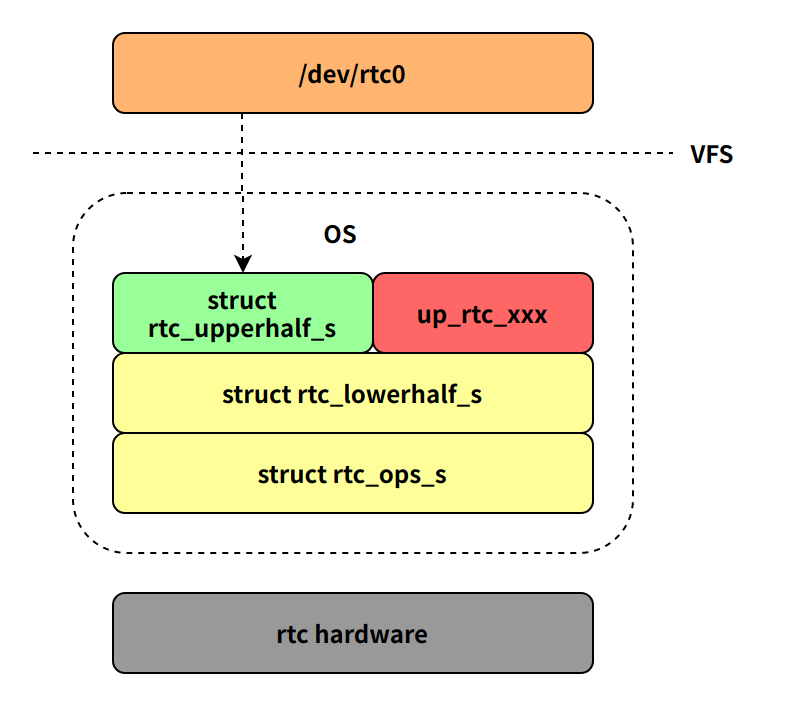
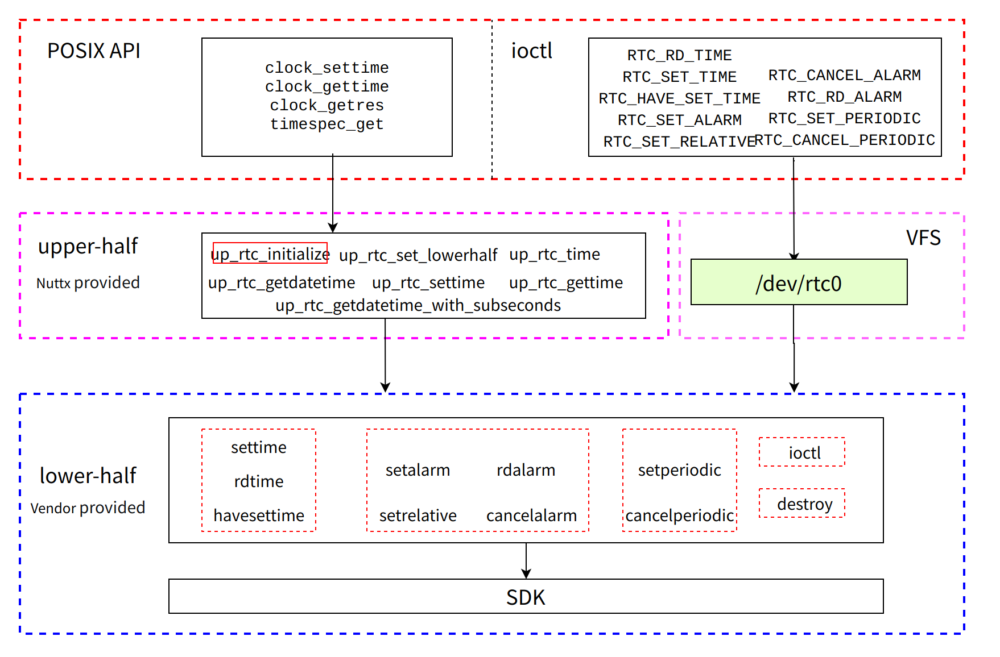
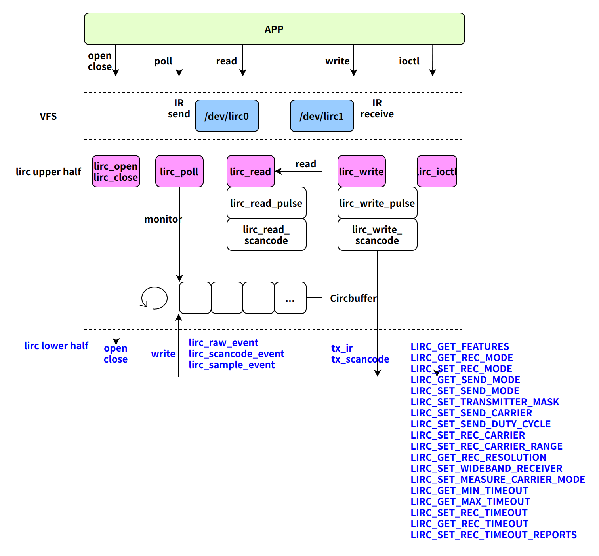

# Driver Development

\[ English | [简体中文](../../../zh-cn/device_dev_guide/driver/driver_development.md) \]

## I. Driver Internal Structure

The driver framework of openvela is relatively simple and does not provide a complex driver model like that in the Linux system (such as Device, Driver, Bus, Class, etc.). Compared with Linux, the driver framework of openvela has the following characteristics:

- Driver registration interface: Register the driver with the VFS (Virtual File System) through a simple driver registration interface.
- Implementation of function set: Implement the `file_operations` operation function set for upper-layer calls.
- System call support: Upper-layer applications indirectly call underlying drivers to complete device operations through standard system calls.

This simplified design makes the driver framework of openvela easier to understand and implement.

### 1. Driver Types and Hierarchical Structure

openvela supports multiple device drivers, which are mainly divided into the following types:

- Character device drivers: zero, null, sensor, adc, etc.
- Block device drivers: emmc, sd card, bch, etc.
- Special device drivers: mtd, ptp, timer, netdev, etc.

The following is the workflow diagram of openvela drivers, showing the complete path from the application program to the hardware:



Among them, drivers are divided into two layers according to functions:

1. Upper Half (provided by openvela)

    - The driver registers itself with the openvela system through `register_driver` or `register_blockdriver`.
    - Provide high-level system call interfaces (such as `read`, `write`, `close`, etc.).
    - Interact with the Lower Half through the operation set functions.

2. Lower Half (implemented by driver developers)

    - Responsible for implementing interactions with hardware devices and architectures.
    - Involves specific operations of underlying hardware such as buses and peripherals.
    - Defines the core operation logic of the device driver, and driver developers need to implement the corresponding interfaces according to specific devices.

### 2. Characteristics of the Driver Model

Compared with the Linux device driver model, the driver model of openvela is more simplified and has the following characteristics:

- No matching and probing mechanisms: There is no matching and probing process of `bus`, `device`, and `driver` in openvela.
- No device types and device numbers: The concepts of device types or device numbers (major/minor) are not used.
- No module_init initialization function: The driver initialization function needs to be explicitly called in the board code for initialization.
- Device node registration: In openvela, there are no interfaces like `cdev_add` or `device_create`, and the driver is registered through the `register_driver()` or `register_blockdriver()` interface.

This design significantly reduces the complexity of the driver model, making openvela more suitable for resource-constrained MCU (Microcontroller Unit) environments.

### 3. Pseudo Root File System

The device drivers of openvela rely on the Pseudo Root File System, similar to `/dev` (`devtmpfs`) in Linux. However, it differs from Linux in the following aspects:

- RAM-only usage: Does not depend on storage media or block device drivers.
- Device nodes are not actual files: Device nodes are just entries of devices in the root file system, indicating that the devices have been initialized and are available for use.

In other words, only device drivers can create device nodes, and the existence of device nodes indicates that the devices have been registered and are ready.



### 4. Driver Directory Structure

According to the types of drivers, openvela places driver code in different directories:

- Shareable drivers: Stored in the `drivers` directory, suitable for general device drivers.
- Custom drivers: Stored in the board-level directory `nuttx/boards/<arch>/<chip>/<board>/src`.

### 5. Non-standard Interface: `boardctl`

In addition to character device drivers, openvela provides a non-standard OS interface `boardctl` for application programs to control board-level logic through the `ioctl` method. Common functions include:

- Board-level initialization: `board_app_init`, `board_app_finalinit`
- Power management: `board_poweroff`, `board_pmctl`
- System reset: `board_reset`

**Note**: Under normal circumstances, application programs should control board-level logic through the `ioctl` interface of character device drivers instead of directly calling `boardctl`.

## II. Data Structures and Interfaces  

### 1. Data Structures

In openvela, the application layer accesses drivers through system calls, with the calling process as follows:  

**System call -> VFS (Virtual File System) -> Driver**.  

To understand how drivers are registered with the file system, it is necessary to first understand the relevant data structures. The definitions of these data structures are located in the [include/nuttx/fs/fs.h](../../../../../../nuttx/blob/dev-ai-contest-2026/include/nuttx/fs/fs.h) file.  

#### Driver Registration and `inode`  

When a driver is registered with the file system, an `inode` is created and associated with the device file. The inode is the core data structure in the file system used to represent files or devices. The following describes the key fields and operation function sets related to driver registration.  

```c
struct inode
{
  FAR struct inode *i_parent;   /* Link to parent level inode */
  FAR struct inode *i_peer;     /* Link to same level inode */
  FAR struct inode *i_child;    /* Link to lower level inode */
  atomic_short      i_crefs;    /* References to inode */
  uint16_t          i_flags;    /* Flags for inode */
  union inode_ops_u u;          /* Inode operations */
  ino_t             i_ino;      /* Inode serial number */
#if defined(CONFIG_PSEUDOFS_FILE) || defined(CONFIG_FS_SHMFS)
  size_t            i_size;     /* The size of per inode driver */
#endif
#ifdef CONFIG_PSEUDOFS_ATTRIBUTES
  mode_t            i_mode;     /* Access mode flags */
  uid_t             i_owner;    /* Owner */
  gid_t             i_group;    /* Group */
  struct timespec   i_atime;    /* Time of last access */
  struct timespec   i_mtime;    /* Time of last modification */
  struct timespec   i_ctime;    /* Time of last status change */
#endif
  FAR void         *i_private;  /* Per inode driver private data */
  char              i_name[1];  /* Name of inode (variable) */
};
```  

#### `i_flags` Field

The `i_flags` field in the `struct inode` structure marks the file type of the `inode`, such as a driver file or message queue. To set or determine whether `i_flags` represents a driver file, the following macro definitions are provided:  

```c
#define INODE_IS_DRIVER(i)    INODE_IS_TYPE(i,FSNODEFLAG_TYPE_DRIVER)

#define INODE_SET_DRIVER(i)   INODE_SET_TYPE(i,FSNODEFLAG_TYPE_DRIVER)
```  

- `INODE_IS_DRIVER`: Determines whether the specified `inode` is a driver file.  
- `INODE_SET_DRIVER`: Marks the specified `inode` as a driver file.  

#### `inode_ops_u` Field

The `inode_ops_u` field in the `struct inode` structure is a union used to describe operation function sets. Depending on the type of `inode`, this field can contain one of the following operation function sets:  

- Character device driver operation function set.  
- Block device driver operation function set.  
- Mount point operation function set.  

```cpp
union inode_ops_u
{
  FAR const struct file_operations     *i_ops;    /* Driver operations for inode */
#ifndef CONFIG_DISABLE_MOUNTPOINT
  FAR const struct block_operations    *i_bops;   /* Block driver operations */
  FAR struct mtd_dev_s                 *i_mtd;    /* MTD device driver */
  FAR const struct mountpt_operations  *i_mops;   /* Operations on a mountpoint */
#endif
#ifdef CONFIG_FS_NAMED_SEMAPHORES
  FAR struct nsem_inode_s              *i_nsem;   /* Named semaphore */
#endif
#ifdef CONFIG_FS_NAMED_EVENTS
  FAR struct nevent_inode_s            *i_nevent; /* Named event */
#endif
#ifdef CONFIG_PSEUDOFS_SOFTLINKS
  FAR char                             *i_link;   /* Full path to link target */
#endif
};
```  

#### Driver Operation Function Set

The operation function set for character device drivers is defined by `struct file_operations`, with the following structure:

```c
struct file_operations
{
  /* The device driver open method differs from the mountpoint open method */

  CODE int     (*open)(FAR struct file *filep);

  /* The following methods must be identical in signature and position
   * because the struct file_operations and struct mountpt_operations are
   * treated like unions.
   */

  CODE int     (*close)(FAR struct file *filep);
  CODE ssize_t (*read)(FAR struct file *filep, FAR char *buffer,
                       size_t buflen);
  CODE ssize_t (*write)(FAR struct file *filep, FAR const char *buffer,
                        size_t buflen);
  CODE off_t   (*seek)(FAR struct file *filep, off_t offset, int whence);
  CODE int     (*ioctl)(FAR struct file *filep, int cmd, unsigned long arg);
  CODE int     (*mmap)(FAR struct file *filep,
                       FAR struct mm_map_entry_s *map);
  CODE int     (*truncate)(FAR struct file *filep, off_t length);

  CODE int     (*poll)(FAR struct file *filep, FAR struct pollfd *fds,
                       bool setup);
  CODE ssize_t (*readv)(FAR struct file *filep, FAR const struct uio *uio);
  CODE ssize_t (*writev)(FAR struct file *filep, FAR const struct uio *uio);

  /* The two structures need not be common after this point */

#ifndef CONFIG_DISABLE_PSEUDOFS_OPERATIONS
  CODE int     (*unlink)(FAR struct inode *inode);
#endif
};
```  

- Lower-level drivers need to implement functions in `struct file_operations`, such as `open`, `read`, `write`, etc., which define the specific operational behavior of device files.  
- The driver's operation function set is set in the inode corresponding to the device file.  
- When a system call operates on a device file, it finds and calls the corresponding function based on the inode of the device file.  

### 2. `register_driver` Interface

#### Code Implementation

When registering a driver, the `register_driver()` interface is called. The following is the code implementation of the `register_driver` interface:  

```c
/****************************************************************************
 * Name: register_driver
 *
 * Description:
 *   Register a character driver inode the pseudo file system.
 *
 * Input parameters:
 *   path - The path to the inode to create
 *   fops - The file operations structure
 *   mode - inmode priviledges (not used)
 *   priv - Private, user data that will be associated with the inode.
 *
 * Returned Value:
 *   Zero on success (with the inode point in 'inode'); A negated errno
 *   value is returned on a failure (all error values returned by
 *   inode_reserve):
 *
 *   EINVAL - 'path' is invalid for this operation
 *   EEXIST - An inode already exists at 'path'
 *   ENOMEM - Failed to allocate in-memory resources for the operation
 *
 ****************************************************************************/

int register_driver(FAR const char *path, FAR const struct file_operations *fops,
                    mode_t mode, FAR void *priv)
{
  FAR struct inode *node;
  int ret;

  /* Insert a dummy node -- we need to hold the inode semaphore because we
   * will have a momentarily bad structure.
   */

  inode_semtake();
  ret = inode_reserve(path, &node);
  if (ret >= 0)
    {
      /* We have it, now populate it with driver specific information.
       * NOTE that the initial reference count on the new inode is zero.
       */

      INODE_SET_DRIVER(node);

      node->u.i_ops   = fops;
#ifdef CONFIG_FILE_MODE
      node->i_mode    = mode;
#endif
      node->i_private = priv;
      ret             = OK;
    }

  inode_semgive();
  return ret;
}
```  

#### Functional Description

The main function of the `register_driver` interface is to register character device drivers with the pseudo file system. It performs the following key operations:

1. Create or find an inode.  

    - According to the passed `path` parameter (usually corresponding to the device file path, such as `/dev/xxxx`), check if a corresponding inode exists.  
    - If not, create a new inode for the path.  

2. Update the inode's driver information.  

    - Update the actual driver-implemented `struct file_operations` (i.e., `fops`) into the inode.  
    - If permission configuration (`CONFIG_FILE_MODE`) is enabled, set the inode's permission information.  

3. Set private data.  

    - Store `priv` data in the inode's private field.  
    - This field is typically used to store the driver's private data, such as hardware-related context information.

## III. Example: ADC Driver Process Analysis  

In the driver code of openvela, drivers are typically divided into two parts: Upper half and Lower half. The following takes the ADC driver as an example to analyze its implementation process.  

### 1. Driver Hierarchical Design  

1. Upper Half

    - Provide general interfaces for application programs, mainly implementing the function set in `file_operations`.  
    - For the ADC driver, the `drivers/analog/adc.c` file describes the operation logic of the Upper Half.  
    - The implementation of the Upper Half is generic, suitable for all ADC devices, and does not require modification for specific hardware.  

2. Lower Half

    - Hardware driver programs based on specific platforms, responsible for implementing hardware-level control, such as register operations.  
    - Implementations for specific hardware, such as the `arch/arm/src/lpc43xx/lpc43_adc.c` file, describe the ADC hardware driver for the LPC43xx platform.  

### 2. Driver Framework  

The overall driver framework is shown in the following figure:  

  

1. Chip-related (Lower Half): <span style="color:red">Red part (driver developer)</span>  

    - Responsible for actual hardware operations, such as register reading/writing and interrupt handling.  
    - In the interrupt handling function, it will callback the Upper Half interface, such as notifying the upper-layer application that data is ready through a message queue.  

2. Generic Framework (Upper Half): <span style="color:green">Green part (provided by Vela)</span>  

    - Provide system call interfaces, such as `open`, `read`, etc.  
    - When implementing the `file_operations` function set, it will call the Lower Half interface to complete specific operations.  

3. Board-level part: <span style="color:orange">Orange part (driver developer)</span>  

    - Responsible for binding the Upper Half and Lower Half together, establishing connections, and registering them with the file system.  
    - Interfaces in this part are typically called during the system boot phase.  

### 3. Implementation of Other Drivers  

The implementation mechanisms of other drivers in openvela are similar to the ADC driver, all adopting hierarchical design:

- Upper Half: Docks with application system calls and provides general interfaces.  
- Lower Half: Implements hardware-level operations and adapts to specific platforms.  

This hierarchical design is a reasonable approach with the following advantages:

- Universality: The Upper Half, as a generic framework, does not need to be modified and is suitable for all similar devices.  
- Flexibility: The Lower Half implements specific operation interfaces for different hardware, facilitating adaptation to multiple platforms.  
- Modularity: The separation of responsibilities between the upper and lower halves reduces coupling, making code maintenance and extension easier.  

Through this hierarchical design, openvela's driver development can meet hardware adaptation requirements while maintaining code universality and maintainability.  

#### I3C Driver Framework  

I3C is more complex than I2C. In addition to hardware improvements, it is reflected in the following aspects at the functional level:  

- Addressing and access based on dynamic addresses.
- Support for CCC (Common Command Codes) commands, enabling extension of business requirements.
- Support for data transmission and reception based on I3C devices.
- Compatibility with data transmission and reception for I2C devices.

  

  

#### RTC Driver Framework  

- **Driver Model**

    - **Lower Half:** This layer is hardware-specific and interfaces directly with the RTC chip. The primary task for a driver developer is to implement the `struct rtc_ops_s`. This structure defines a standard set of operations (e.g., `initialize`, `read_time`, `set_time`) that abstract the underlying hardware behavior.
    - **Upper Half:** This is the generic, hardware-agnostic logic layer provided by openvela. It is responsible for creating a standard character device node (e.g., `/dev/rtc0`) and translating user-space VFS (Virtual File System) file operations, such as `ioctl`, into calls to the lower-half `rtc_ops_s` interface.

- **Access Paths**

    - **User-space Access (Application Level)**

        - Applications interact with the RTC through its device node, `/dev/rtc0`.
        - All communication is handled via standard C library file operations, for example, by using `ioctl()` to send commands like `RTC_RD_TIME` or `RTC_SET_TIME`.

    - **Kernel-space Access (Kernel Level)**

        - The kernel or other board-specific code can interact directly with the RTC using the `up_rtc_...` API family.
        - These APIs provide a direct path that bypasses the VFS layer, allowing for direct calls to the lower-half driver operations. This approach is typically used during system initialization or in performance-critical scenarios. It works by acquiring a handle to the lower-half driver to operate on the hardware directly.

  

  

#### IR Driver Framework  

The IR driver framework adopts an industry-standard **layered architecture**, dividing the driver into an **Upper Half** and a **Lower Half**. This design decouples the hardware-agnostic generic logic from the hardware-specific implementation, greatly enhancing code portability and reusability.

1. Upper Half: The Generic Logic Layer

    The Upper Half is responsible for implementing the hardware-independent core driver logic, providing a standard interface for the kernel and user-space applications. Its primary responsibilities include:

    - Device Registration: Registers the driver as a standard character device (e.g., `/dev/lirc0`), making it accessible from user-space.
    - File Operations Interface: Implements the standard `file_operations` set (e.g., `open`, `read`, `ioctl`) to respond to system calls from user-space.
    - Data Buffering: Features a built-in Ring Buffer to temporarily store infrared data reported by the Lower Half. This effectively prevents data loss and decouples the real-time intensive hardware interrupts from user-space read operations.
    - Polling Mechanism: Provides a `poll` mechanism, allowing applications to wait for new data efficiently and avoid inefficient CPU polling.

2. Lower Half: The Hardware Abstraction Layer

    The Lower Half communicates directly with the physical infrared controller hardware, acting as the bridge between the generic logic of the Upper Half and the physical hardware. Its core tasks are:

    - Hardware Interaction and Data Reporting: Responsible for receiving and decoding infrared signals from the hardware, then pushing the data to the Upper Half's ring buffer through a designated interface (e.g., `lirc_xxx_event`).
    - Hardware Transmission: Provides a transmission interface (e.g., `tx_xxx`) that can be called by the Upper Half to send infrared signals via the hardware.
    - Hardware Control Interface: Implements a set of hardware-specific `operations`. These operations are exposed to user-space through `ioctl` commands, allowing applications to perform low-level configuration and control of the hardware.

  

### 4. Driver Registration Example

```c
ap> ls -l 
/dev:
ap> ls -l 
/dev:
 brw-rw-rw-   314572800 app
 dr--r--r--           0 audio/
 cr--r--r--           0 batt_id
 crw-rw-rw-           0 binder
 cr--r--r--           0 board_id
 crw-rw-rw-           0 buttons
 dr--r--r--           0 charge/
 crw-rw-rw-           0 console
 brw-rw-rw-   104857600 coredump
 brw-rw-rw-  2340421632 data
 cr--r--r--           0 droidstatus0
 dr--r--r--           0 dsi0/
 crw-rw-rw-           0 fb0
 brw-rw-rw-    52428800 font
 brw-rw-rw-    52428800 i18n
 crw-rw-rw-           0 i2c0
 crw-rw-rw-           0 i2c1
 crw-rw-rw-           0 i2c3
 crw-rw-rw-           0 i2c4
 crw-rw-rw-           0 input0
 crw-rw-rw-           0 kmsg
 c-w--w--w-           0 log
 c---------           0 logrpmsg
 crw-rw-rw-           0 loop
 c-w--w--w-           0 lra0
 brw-rw-rw-   104857600 misc
 brw-rw-rw-  3825205248 mmcsd0
 brw-rw-rw-     4194304 mmcsd0boot0
 brw-rw-rw-     4194304 mmcsd0boot1
 brw-rw-rw-     4194304 mmcsd0rpmb
 crw-rw-rw-           0 mouse0
 dr--r--r--           0 net/
 crw-rw-rw-           0 null
 brw-rw-rw-    10485760 nv
 c---------           0 nvflash0
 crw-rw-rw-           0 oneshot
 crw-rw-rw-           0 ptmx
 brw-rw-rw-   157286400 quickapp
 brw-rw-rw-      242688 ram0
 cr--r--r--           0 random
 dr--r--r--           0 rpmsg/
 dr--r--r--           0 rptun/
 crw-rw-rw-           0 rtc0
 brw-rw-rw-    52428800 store
 brw-rw-rw-   157286400 system
 c---------           0 tee0
 cr--r--r--           0 temp_internal
 cr--r--r--           0 temp_shell
 cr--r--r--           0 temp_skin
 cr--r--r--           0 temp_sub
 crw-rw-rw-           0 ttyAUDIO
```

## IV. References

- Accessing hardware from user-space, Bootlin, https://bootlin.com/doc/legacy/accessing-hardware/accessing-hardware.pdf