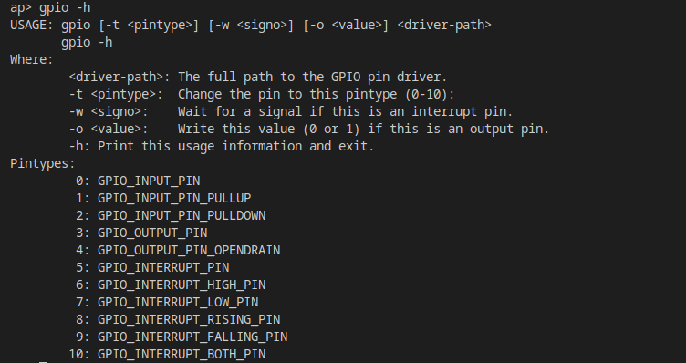

# GPIO Application Development Guide

[ English | [简体中文](../../../../../zh-cn/device_dev_guide/driver/peripheral_driver/gpio/gpio_app_development_guide.md) ]

This guide is for **application developers**. It explains in detail how to use General-Purpose Input/Output (GPIO) functionality in the openvela real-time operating system through standard POSIX interfaces. After reading this guide, you will know how to control LEDs, read button states, and more by reading from and writing to device files.

Following the "everything is a file" design philosophy, this document is organized as follows:

- **Basic Concepts**: Explains GPIO and its core features in simple terms, providing a theoretical foundation for subsequent operations.
- **Northbound Interface (Application Layer)**: Focuses on how to interact with GPIO device files using functions like `open`, `read`, `write`, and `ioctl`.
- **Verification and Testing**: Provides a ready-to-use user-space testing tool to help you quickly verify GPIO functionality.

## I. Basic Concepts

Before diving into technical details, let's understand some of the most fundamental concepts in GPIO development.

### 1. What is a Pin?

You can think of a chip (like a CPU or microcontroller) as a tiny brain, and a **pin** is like a "tentacle" or "antenna" extending from this brain. Physically, it is one of the tiny metal legs or pads arranged along the chip's edge.

- **Purpose**: A pin is the bridge that provides an electrical connection between the chip's internal digital world and the external physical world. All data and control signals flow into or out of the chip through these pins.
- **Analogy**: If a chip is a large building, then the pins are all the "doors and windows" of that building. Each door and window has a unique number and is responsible for the flow of specific "people" (signals) in and out.

### 2. What is GPIO?

**GPIO** is an acronym for "General-Purpose Input/Output." It is a special, flexible type of pin.

- **General-Purpose**: This means the pin's function is not fixed. A developer can dynamically define its function through programming, much like assigning a specific task to a multi-purpose tool.
- **Input**: When configured in input mode, a GPIO can "sense" or "read" the state of the external world. It acts like the chip's "eyes" or "ears."
    - **Example**: Connecting a button and reading the GPIO's high or low voltage level to determine if the button is pressed.
- **Output**: When configured in output mode, a GPIO can "control" or "drive" an external device. It acts like the chip's "hands."
    - **Example**: Connecting an LED and lighting it up by outputting a high level, or turning it off by outputting a low level.

In short, **GPIO is a programmable digital interface on a chip that can act as both "eyes" and "hands,"** allowing a program to perform the most basic interactions with the hardware world.

### 3. Core Features of GPIO

Besides basic input/output, understanding the following features is crucial for GPIO development:

#### Pin Multiplexing

The pins on modern chips are often "multi-purpose." The same pin, in addition to being a general-purpose GPIO, can be configured for other dedicated peripheral functions, such as:

- `UART_TX` (Serial Transmit)
- `I2C_SCL` (I2C Clock Line)
- `SPI_MOSI` (SPI Master Out Slave In)
- `PWM_OUT` (Pulse-Width Modulation Output)

This mechanism is called **pin multiplexing** (or Alternate Function, AF). Therefore, before using a pin as a GPIO, you typically need to programmatically ensure it has been correctly configured for "GPIO" functionality and not for another peripheral function.

#### Input Modes: Floating, Pull-up, and Pull-down

When a GPIO is configured in input mode, if it is not connected to any valid signal source (e.g., a button that is not pressed), its voltage level is indeterminate. This is known as a **Floating State**. This indeterminate state can cause the program to read an incorrect level.

To solve this problem, chips usually provide internal **pull-up resistors** and **pull-down resistors** for GPIOs:

- **Pull-up**: An internal resistor connects the pin to a high voltage level (VCC). When the pin is floating, this resistor "pulls" it to a high level, giving it a definite default state.
- **Pull-down**: The opposite of a pull-up, it connects the pin to ground (GND) through a resistor, making its default state low when floating.

> **Analogy**: You can think of pull-ups/pull-downs as a spring-loaded door. A pull-up spring always keeps the door in the "open" position, while a pull-down spring always keeps it in the "closed" position, unless an external force (an external signal) pushes it.

#### Input Mode: Interrupt

Besides having the CPU actively "read" the pin's state (known as **Polling**), GPIO offers a more efficient method: **Interrupt**.

You can configure a GPIO to actively send a "notification" signal to the CPU when a specific event occurs (such as the level changing from low to high, high to low, or both). When the CPU receives this signal, it immediately suspends its current task to handle the GPIO event.

> **Analogy**: Polling is like checking the peephole every few seconds to see if a visitor has arrived. An interrupt is like installing a doorbell; you only need to answer the door when a guest presses it. Clearly, interrupts are more efficient.

## II. GPIO Northbound Interface (Application Layer)

openvela abstracts each GPIO pin as a character device file. Applications control the hardware pins by performing standard POSIX file operations (such as `open`, `read`, `write`, and `ioctl`) on the corresponding device files in the `/dev/` directory (e.g., `/dev/gpio0`). This interface can be used to drive peripherals like LEDs, buzzers, relays, and fans. The following sections detail the GPIO northbound interface provided in openvela.


### 1. Enabling the GPIO Driver Framework

You must enable this option for the GPIO module code to be compiled. Otherwise, any attempts to control GPIO devices will fail.

```Makefile
CONFIG_DEV_GPIO=y
```

### 2. POSIX API Reference

#### open

Use the `open()` function to open a GPIO device. It returns a file descriptor on success or -1 on failure, setting `errno`.

```C
#include <sys/types.h>
#include <sys/stat.h>
#include <fcntl.h>
int open (const char *devname, int flags);
```

- **`devname`**: The path to the GPIO device file, e.g., `"/dev/gpio0"`.
- **`flags`**: Must include one of `O_RDONLY`, `O_WRONLY`, or `O_RDWR` to specify opening the device in read-only, write-only, or read-write mode, respectively. You can bitwise-OR this parameter with other flags to modify `open()`'s behavior. For more information, refer to the [POSIX open documentation](https://pubs.opengroup.org/onlinepubs/9699919799.2013edition/functions/open.html).

**Example:** Open a GPIO device in read-only mode.

```C
int fd;
fd = open("/dev/gpio0", O_RDONLY);
if (fd == -1)
    /* error */
```

> **Note**: The process must have sufficient permissions to open the device file.

#### read/write

Use `read()` and `write()` to interact with an opened GPIO device.

- **`read()`**

    ```C
    #include <unistd.h>
    ssize_t read(int fd, void *buf, size_t nbytes);
    ```

    This function reads `nbytes` from the file descriptor `fd` into the buffer `buf`. For a GPIO device, it will only read 1 byte (`'0'` or `'1'`) even if `nbytes` is greater than 1. The file position advances after each `read()` operation. **To ensure you always read from the beginning, you must reset the file position to 0 using `lseek()` before calling `read()`.**

- **`write()`**

    ```C
    #include <unistd.h>
    ssize_t write(int fd, const void *buf, size_t nbytes);
    ```

    This function writes `nbytes` from the buffer `buf` to the file descriptor `fd`. Similarly, it will only write 1 byte (`'0'` or `'1'`) to set the pin level, even if `nbytes` is greater than 1.

#### lseek

Use the `lseek()` function to set the file read/write position.

```C
#include <sys/types.h>
#include <unistd.h>
off_t lseek(int fd, off_t offset, int whence)
```

For GPIO devices in openvela, `lseek()` only supports the following specific operation:

- **`whence`**: Must be `SEEK_SET`.
- **`offset`**: Must be `0`.

**Example:** Reset the file position.

```C
off_t ret;
ret = lseek(fd, 0, SEEK_SET);
if (ret == (off_t) -1)
    /* error */
```

#### ioctl

Use the `ioctl()` function to perform special device control commands that cannot be handled by standard file operations.

```C
#include <sys/ioctl.h>
#include <nuttx/ioexpander/gpio.h>
int ioctl (int fd, int cmd, ...);
```

- **`fd`**: The file descriptor of the target device.
- **`cmd`**: The device control command code, defined in `nuttx/ioexpander/gpio.h`.
- **`...`**: An optional argument, typically an `unsigned long` integer or a pointer.

The following are common GPIO `ioctl` commands:

| **Command**        | **Description**                                                                                                 | **Example**                                                                                                                                               |
| :----------------- | :-------------------------------------------------------------------------------------------------------------- | :-------------------------------------------------------------------------------------------------------------------------------------------------------- |
| `GPIOC_WRITE`      | Writes to the file referenced by `fd`.                                                                          | `bool out_val = true;` `ret = ioctl(fd, GPIOC_WRITE, (unsigned long)out_val);`                                                                            |
| `GPIOC_READ`       | Reads from the file referenced by `fd`.                                                                         | `bool in_val;` `ret = ioctl(fd, GPIOC_READ, (unsigned long)((uintptr_t)&in_val));`                                                                        |
| `GPIOC_PINTYPE`    | Gets the pin type of the current GPIO.                                                                          | `enum gpio_pintype_e type;` `ret = ioctl(fd, GPIOC_PINTYPE, (unsigned long)((uintptr_t)&type));`                                                          |
| `GPIOC_SETPINTYPE` | Sets the pin type of the current GPIO.                                                                          | `enum gpio_pintype_e new_type = GPIO_OUTPUT_PIN;` `ret = ioctl(fd, GPIOC_SETPINTYPE, (unsigned long)new_type);`                                           |
| `GPIOC_REGISTER`   | Registers an interrupt signal for the pin.                                                                      | `struct sigevent notify;` `notify.sigev_notify = SIGEV_SIGNAL;` `notify.sigev_signo = SIGINT;` `ret = ioctl(fd, GPIOC_REGISTER, (unsigned long)&notify);` |
| `GPIOC_UNREGISTER` | Unregisters an interrupt signal, preventing a process signal from being triggered when a GPIO interrupt occurs. | `ioctl(fd, GPIOC_UNREGISTER, 0);`                                                                                                                         |

**About `GPIOC_REGISTER`:** This command associates a POSIX signal with a GPIO interrupt. When the hardware interrupt is triggered, the kernel sends this signal to the specified process. You can use this feature to test interrupt functionality. For example, by registering the `SIGINT` signal, the process will terminate by default (equivalent to Ctrl+C) when the interrupt occurs, if no custom signal handler is defined. For custom handling, refer to the [POSIX signal documentation](https://pubs.opengroup.org/onlinepubs/9699919799/functions/signal.html).

### 3. Example Code

openvela provides an example program, `gpio_main.c`, in the NuttX apps repository to demonstrate the northbound interface and verify GPIO functionality.

- **Source Code**: [apps/examples/gpio/gpio_main.c](https://github.com/apache/nuttx-apps/blob/master/examples/gpio/gpio_main.c)

### 4. Important Notes

1. **`read()` Operation**: Before calling `read()`, you must call `lseek(fd, 0, SEEK_SET)` to reset the file offset to 0. Otherwise, you will not be able to read any data. The `ioctl()` command `GPIOC_READ` does not have this limitation.
2. **`read()`/`write()` Data Format**: These functions read and write the characters `'0'` or `'1'` (ASCII values), not the boolean values `true`/`false` or the integers `0`/`1`.
3. **Interrupt Registration**: To successfully use `GPIOC_REGISTER` and `GPIOC_UNREGISTER`, the pin must first be configured as an interrupt-capable type (e.g., `GPIO_INTERRUPT_PIN`).

## III. Verification and Testing

openvela provides a user-space test program, [examples/gpio](https://github.com/apache/nuttx-apps/tree/master/examples/gpio), to verify the correctness of the GPIO driver. This program depends on GPIO device files being successfully registered in the user space.

### 1. Enabling the Test Program

Enable the following option in your system configuration to compile the GPIO test program into the firmware:

```Bash
CONFIG_EXAMPLES_GPIO=y
```

### 2. Usage

In the target device's shell, run the `gpio` command to see the help information.



The tool supports setting the pin type, reading/writing the pin level, and configuring interrupt signals. All examples below assume operations on the `/dev/gpiox` device.

#### Pin Write Test

Use the `-o` parameter to set the level of an output pin.

```Bash
# Command: Set the pin to a high level
gpio -o 1 /dev/gpiox

# Example Output:
Driver: /dev/gpiox
  Output pin:    Value=1
  Writing:       Value=1
  Verify:        Value=1
```

#### Pin Read Test

Although there is no dedicated parameter for reading, the tool allows you to use the `-o` parameter to trigger a read and display the current state when the pin is configured in **input mode**.

```Bash
# Prerequisite: The pin has been set to input mode
# Command: Read the pin level
gpio -o 0 /dev/gpiox

# Example Output:
Driver: /dev/gpiox
  Input pin:     Value=1
```

#### Pin Type Setting Test

Use the `-t` parameter and the corresponding type ID to set the pin mode.

```Bash
# Command: Set the pin to input mode (ID 0)
gpio -t 0 /dev/gpiox

# Example Output:
Driver: /dev/gpiox
```

#### Interrupt Test

Interrupt functionality is verified using POSIX signals. The basic idea is to configure a GPIO interrupt and associate it with a signal (like `SIGINT`). When the hardware interrupt triggers, the kernel sends that signal to the waiting `gpio` process. If the signal is `SIGINT`, the process's default behavior is to terminate (equivalent to pressing Ctrl+C).

Here are the test steps:

```Bash
# 1. Set the pin to trigger on a falling edge interrupt (ID 9)
gpio -t 9 /dev/gpiox

# 2. Register the interrupt to send a SIGINT signal (signal number 2) to the current process when triggered.
#    The -w parameter is used to register the interrupt signal.
gpio -w 2 /dev/gpiox

# 3. At this point, the gpio process will block and wait for the signal.
#    Externally trigger a hardware falling edge interrupt (e.g., by pulling the pin level from high to low).
#    If the gpio process exits immediately, the interrupt functionality is working correctly.
```

## IV. What's Next

You have now mastered all the necessary knowledge for GPIO application development in openvela.

If you are interested in the underlying implementation of the GPIO driver and want to learn how to adapt a GPIO driver for a new chip or board, please continue to our advanced guide: [GPIO Driver Development Guide](./gpio_driver_development_guide.md).
