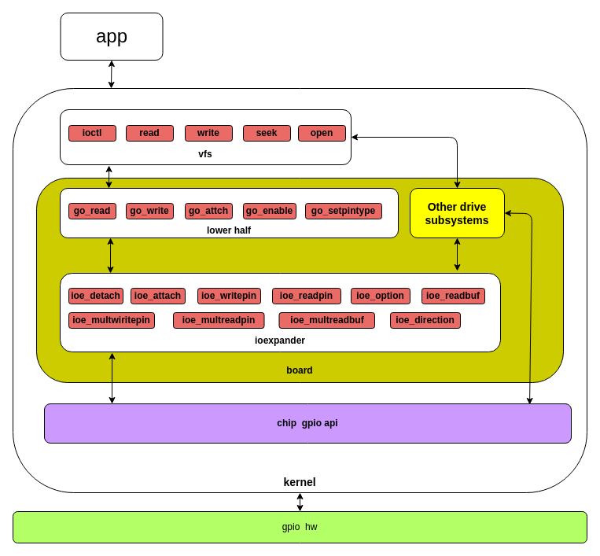
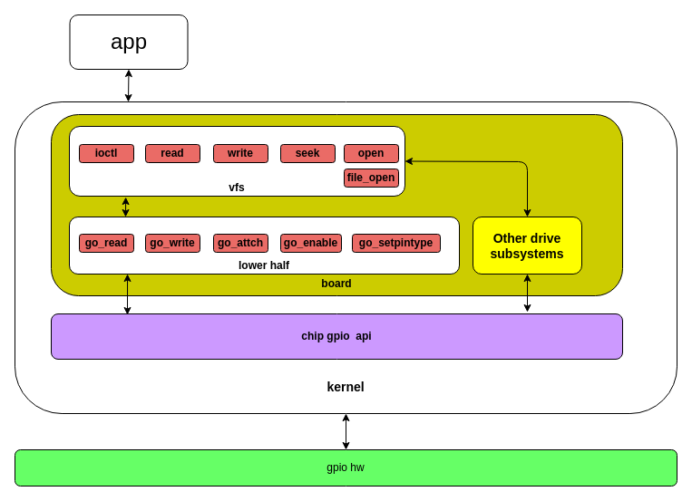

# GPIO Driver Development Guide

[ English | [简体中文](../../../../../zh-cn/device_dev_guide/driver/peripheral_driver/gpio/gpio_driver_development_guide.md) ]

This guide is for **driver developers and BSP (Board Support Package) engineers**. It provides a detailed introduction to the openvela GPIO driver framework and explains how to integrate low-level hardware GPIO functionality into the openvela kernel.

Before reading this document, we assume you are familiar with the basic concepts and northbound interface of GPIO. If you are not, please first read the [GPIO Application Development Guide](./gpio_app_development_guide.md).

This document delves into the implementation details of the driver layer, organized as follows:

- **Southbound Interface (Driver Layer)**: Details the two driver implementation methods, `ioexpander` and `lower_half`, and their differences.
- **Chip-level API**: Explains the responsibilities of the lowest-level hardware abstraction layer.
- **Development and Practice**: Provides file organization standards and a comparison with other operating systems.

## I. GPIO Southbound Interface (Driver Layer)

The southbound interface is responsible for connecting the low-level chip or board GPIO functionality to openvela's Virtual File System (VFS) or other driver subsystems. Developers need to implement a standard set of operation functions to be called by the northbound interface.

openvela provides two ways to implement the southbound interface:

- **`ioexpander` framework**: A general-purpose I/O abstraction framework, recommended for managing a large number of or multiplexed I/O resources.
- **`lower_half` method**: A direct, lightweight implementation, usually tightly coupled with specific board-level code.

> **Recommendation**: When porting an SOC (System on a Chip), we recommend using the `ioexpander` method. It can uniformly manage all I/O resources and effectively reduce the amount of porting code.

### 1. `ioexpander` Framework

`ioexpander` is a general-purpose I/O expander driver framework suitable for scenarios that require unified management of a large number of GPIOs. Using this method, you need to implement a standard set of callback functions for the `ioexpander` framework.

An `ioexpander` driver instance can not only be called directly and efficiently by other drivers in the kernel to access different pins, or even multiple pins simultaneously, but it can also register each pin as a user-space visible `/dev/gpiox` device through the `gpio_lower_half()` interface.

The kernel implements the bridge between `ioexpander` and the VFS through the code in [drivers/ioexpander/gpio_lower_half.c](https://github.com/apache/nuttx/blob/master/drivers/ioexpander/gpio_lower_half.c). This bridge layer calls the `IOEXP_xxx` macro interfaces that you implement in your driver, and these macro interfaces must be implemented according to the requirements of the `ioexpander` framework.



#### Configuration Options

To use the `ioexpander` method, enable the following options in your configuration:

```Makefile
# Enable the ioexpander framework
CONFIG_IOEXPANDER=y
# Enable bridging ioexpander to GPIO character devices
CONFIG_GPIO_LOWER_HALF=y
# Support for multi-pin bulk operations
CONFIG_IOEXPANDER_MULTIPIN=y
# Support for interrupt functionality
CONFIG_IOEXPANDER_INT_ENABLE=y
```

#### Dependency Header Files

In the `ioexpander` method, the required interfaces are defined in the following header file, which must be included when writing the GPIO driver:

```C
// Configuration dependency: CONFIG_GPIO_LOWER_HALF=y
#include <nuttx/ioexpander/ioexpander.h>
```

#### Core Interface Implementation

You need to implement the callback functions defined in the `ioexpander_ops_s` structure. The table below summarizes these core interfaces.

| **Function Prototype**                                                                             | **Description**                                                                                                                | **Status**                                |
| :------------------------------------------------------------------------------------------------- | :----------------------------------------------------------------------------------------------------------------------------- | :---------------------------------------- |
| `int ioe_direction(dev, pin, dir)`                                                                 | Sets the direction of a single pin (input/output/pull-up/pull-down, etc.).                                                     | **Required**                              |
| `int ioe_option(dev, pin, opt, val)`                                                               | Configures pin options, such as interrupt trigger mode (edge/level) or active level.                                           | **Required**                              |
| `int ioe_writepin(dev, pin, val)`/`int ioe_readpin(dev, pin, *val)`                                | Reads from or writes to a specific pin.                                                                                        | **Required**                              |
| `int ioe_readbuf(dev, pin, *val)`                                                                  | Reads the pin level from an internal buffer. This is efficient but may not reflect the actual pin state.                       | **Required**                              |
| `int ioe_multiwritepin(dev, *pins, *vals, count)`/`int ioe_multireadpin(dev, *pins, *vals, count)` | Reads or writes the levels of multiple pins in bulk.                                                                           | Optional (`CONFIG_IOEXPANDER_MULTIPIN`)   |
| `int ioe_multireadbuf(dev, *pins, *vals, count)`                                                   | Reads the levels of multiple pins in bulk from an internal buffer. This is efficient but may not reflect the actual pin state. | Optional (`CONFIG_IOEXPANDER_MULTIPIN`)   |
| `void *ioe_attach(dev, pinset, cb, arg)`                                                           | Attaches an interrupt callback function to a specified set of pins.                                                            | Optional (`CONFIG_IOEXPANDER_INT_ENABLE`) |
| `int ioe_detach(dev, handle)`                                                                      | Removes an attached interrupt callback.                                                                                        | Optional (`CONFIG_IOEXPANDER_INT_ENABLE`) |

#### Notes

1.  You must manually call the `gpio_lower_half()` function during driver initialization to register the `ioexpander` pins as user-space visible `/dev/gpiox` devices.
2.  Device registration names follow the fixed rule `/dev/gpiox`, where `x` is the pin number.

#### Example Code

- **`ioexpander` driver implementation**: Refer to the PCA9555 I/O expander chip driver implementation: [pca9555.c](https://github.com/apache/nuttx/blob/master/drivers/ioexpander/pca9555.c).
- **`ioexpander` driver instantiation**: Refer to the simulation platform (SIM) `ioexpander` instantiation code: [sim_ioexpander.c](https://github.com/apache/nuttx/blob/master/boards/sim/sim/sim/src/sim_ioexpander.c).

### 2. `lower_half` Method

The `lower_half` method is a more direct way to implement a GPIO driver, and its code is typically tied to a specific board configuration. In this mode, you need to directly implement the callback functions defined in the `gpio_dev_s` structure.

These callback functions usually call the low-level GPIO API provided by the chip vendor (i.e., `chip gpio api`). openvela does not enforce a standard for the `chip gpio api`. Developers only need to follow openvela's coding style and ensure all GPIO functions supported by the chip are implemented.



#### Dependency Header Files

In the `lower_half` method, the required interfaces are defined in the following header file, which must be included when writing the board GPIO driver:

```C
// Configuration dependency: CONFIG_DEV_GPIO=y
#include <nuttx/ioexpander/gpio.h>
```

#### Core Interface Implementation

You need to fill the following callback function pointers in the `gpio_lowerhalf_s` structure.

| **Function Prototype**            | **Description**                                                              |
| :-------------------------------- | :--------------------------------------------------------------------------- |
| `int go_read(dev, *value)`        | Reads the pin level. Required for all pin types.                             |
| `int go_write(dev, value)`        | Writes the pin level. Only valid for output-type pins.                       |
| `int go_setpintype(dev, pintype)` | Sets the pin type, such as input, output, interrupt, etc.                    |
| `int go_attach(dev, callback)`    | Attaches an interrupt callback function. Only valid for interrupt-type pins. |
| `int go_enable(dev, enable)`      | Enables or disables the pin interrupt.                                       |

#### Notes

1.  The `go_write()` function only needs to be implemented for output-type pins.
2.  When implementing `go_enable()`, you must check if a callback has been registered via `go_attach()` before allowing the interrupt to be enabled.
3.  `go_attach()` and `go_enable()` only need to be implemented for interrupt-capable pin types.
4.  **Important**: When implementing `go_setpintype()`, in addition to configuring the hardware, you **must** manually update the `dev->gpio.gp_pintype` member variable.

#### Example Code

`lower_half` drivers are tightly coupled with board-level code. You can find implementations for different architectures and boards in the `boards` directory. For example, the `lower_half` GPIO driver for the Raspberry Pi Pico (RP2040 chip): [rp2040_gpio.c](https://github.com/apache/nuttx/blob/master/boards/arm/rp2040/raspberrypi-pico/src/rp2040_gpio.c).

#### Device Registration

To make a GPIO device visible to user space, it must be registered. The registration process associates your southbound interface implementation with a device file name (e.g., `/dev/gpio0`).

You can use the following functions for registration:

- **`int gpio_pin_register(FAR struct gpio_dev_s *dev, int minor)`**

    - Registers a device with a minor number. The device name will be `/dev/gpio` + `minor`.

- **`int gpio_pin_register_byname(FAR struct gpio_dev_s *dev, FAR const char *pinname)`**

    - Registers a device with a specified name. The device name will be `/dev/` + `pinname`.

> **Hint**: If you are using the `ioexpander` method, you can directly call the [gpio_lower_half()](https://github.com/apache/nuttx/blob/master/drivers/ioexpander/gpio_lower_half.c) function, which encapsulates the registration logic.

#### `ioexpander` vs. `lower_half` Comparison

The following table summarizes the main differences between the two southbound interface implementation methods.

| **Feature**                            | **`lower_half` Method**                        | **`ioexpander` Method**                                                                                                                                       |
| :------------------------------------- | :--------------------------------------------- | :------------------------------------------------------------------------------------------------------------------------------------------------------------ |
| **Core Configuration**                 | `CONFIG_DEV_GPIO=y`                            | `CONFIG_DEV_GPIO=y`<br>`CONFIG_IOEXPANDER=y`<br>`CONFIG_GPIO_LOWER_HALF=y`<br>Optional:<br>`CONFIG_IOEXPANDER_MULTIPIN=y`<br>`CONFIG_IOEXPANDER_INT_ENABLE=y` |
| **Bulk Operations**                    | Not supported                                  | Supported (`IOEXP_MULTIWRITEPIN`, `IOEXP_MULTIREADPIN`)                                                                                                       |
| **Calls from Other Driver Subsystems** | Requires VFS access, typically via `file_open` | Provides `IOEXP_xxx()` macro interfaces for efficient, direct calls from other drivers.                                                                       |
| **Device Registration**                | Requires manual call to `gpio_pin_register()`  | Unified registration via `gpio_lower_half()`, with fixed names like `/dev/gpiox`                                                                              |
| **Interrupt Setup**                    | Only via `ioctl` with `GPIOC_SETPINTYPE`       | In addition to `ioctl`, can be configured in the kernel layer using `IOEXP_SETOPTION()`                                                                       |

## II. Chip-level GPIO API (`chip gpio api`)

The chip-level API is the lowest-level hardware abstraction layer, responsible for directly manipulating GPIO registers. It needs to implement all GPIO functionalities supported by the chip, including pin mode configuration, level reading/writing, and alternate function switching.

openvela does not define a standard interface for this layer. The chip vendor or developer needs to implement this functionality based on the specific chip's datasheet, following openvela's coding standards.

- **Reference Implementation**: You can refer to the low-level GPIO implementation for the STM32 series chips: [stm32_gpio.c](https://github.com/apache/nuttx/blob/master/arch/arm/src/stm32/stm32_gpio.c).

## III. File Organization Standard

The following is the recommended GPIO-related file organization structure for the openvela dev branch. If you are using the upstream NuttX master branch, please refer to its community standards.

<details>
<summary>Click to expand code</summary>

```Bash
vendor
└── vendor_name    # Product model
    ├── boards    # boards directory
    │   └── board_name    # board model
    │      ├── configs    # configs directory
    │      │   ├── gpio
    │      │   │   └── defconfig
    ...    ...    ...
    │      ├── include    # board header files
    │      │   ├── board.h
    │      │   ├── board_memorymap.h
    │      │   ├── nsh_romfsimg.h   
    │      ├── Kconfig    # board Kconfig file
    │      ├── scripts   # board script files
    │      │   └── Make.defs
    │      └── src  # board source code
    │          ├── xxx_appinit.c
    │          ├── xxx_boot.c
    │          ├── xxx_bringup.c
    │          ├── xxx_gpio.c    # Board-level GPIO driver, i.e., southbound interface implementation
    │          ├── xxx_ioctl.c
    │          ├── xxx_reset.c
    │          ├── xxx_uid.c
    │          ├── etc  
    │          │   ├── init.d   # System startup script files
    │          │   │   ├── rcS
    │          │   │   ├── rc.sysinit
    │          │   ├── group
    │          │   └── passwd
    │          ├── Make.defs
    │          └── Makefile
    ├── chips    # chip internal files
    │   └── chip_name    # chip name
    │       ├── xxx_gpio.c      # Implementation of all internal GPIO capabilities of the chip
    │       ├── xxx_gpio.h      # GPIO provided by the chip's board
    │       ├── ...
    │       ├── ...
    │       ├── xxx_wlan.c
    │       ├── xxx_wlan.h
    │       ├── include
    │       │   └── xxx.h     
    │       ├── hardware
    │       │   └── apb_ctrl_reg.h
    │       │   └── bb_reg.h
    │       │   └── xxx_aes.h
    │       │   └── xxx_memory.h
    │       │   └── xxx_dma.h
    │       │   └── xxx_efuse.h
    │       │   └── xxx_gpio.h
    │       │   └── xxx_gpio_sigmap.h
    │       │   └── xxx_i2c.h
    │       ├── include
    │       │   ├── chips_name_gpio.h
    │       │   └── debug.h
    │       ├── Kconfig
    │       └── Make.defs
    │       └── rom
    │       ├── xxx_libc_stubs.h
    │            └── xxx_spiflash.h
    └── tools    # Directory for pre-build tools or toolchain
```

</details>

---

- **`boards/<board_name>/src/xxx_gpio.c`**: This is the implementation file for the **southbound interface**, responsible for bridging the chip's GPIO functionality to openvela's VFS.
- **`chips/<chip_name>/xxx_gpio.c`**: This is the implementation file for the **chip-level API**, responsible for directly manipulating hardware registers and serving as the lowest-level implementation of GPIO functionality.

## IV. Comparison with Other Operating Systems

The table below provides a brief comparison of the main differences in the GPIO subsystem among openvela, Linux, and Zephyr.

| **Feature**                          | **openvela**                                                               | **Zephyr**                            | **Linux**                             |
| :----------------------------------- | :------------------------------------------------------------------------- | :------------------------------------ | :------------------------------------ |
| **Northbound Interface**             | Character device (`/dev/gpiox`)                                            | Custom syscalls, requires Device Tree | `libgpiod` (modern), `sysfs` (legacy) |
| **Southbound Interface**             | `struct gpio_dev_s` (lower_half)<br>`struct ioexpander_dev_s` (ioexpander) | `struct gpio_driver_api`              | `struct gpio_chip`                    |
| **Usage by Other Driver Subsystems** | `ioexpander` macro interfaces                                              | `device_get_binding()`                | `gpio_to_chip()`                      |
| **Pin Control**                      | No separate subsystem; functionality is dispersed within GPIO drivers      | Supported                             | Independent Pinctrl subsystem         |
| **Configuration System**             | Kconfig                                                                    | Kconfig, Device Tree                  | Kconfig, Device Tree                  |