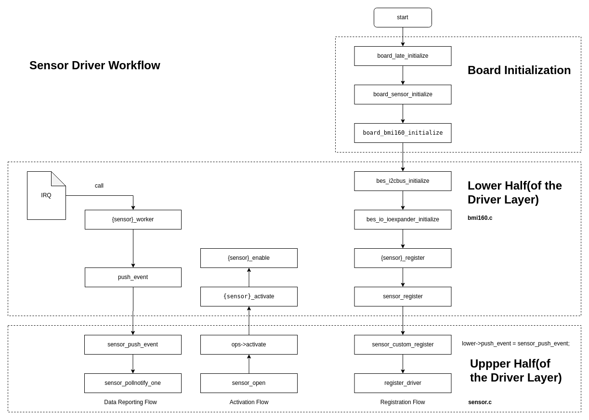

# Vendor Driver Adaptation Guide for the Sensor Framework

\[ English | [简体中文](../../../../../zh-cn/device_dev_guide/driver/peripheral_driver/sensor/sensor_framework_guide.md) \]

## I. Overview

This document provides a comprehensive guide for driver developers on how to adapt a Vendor-Specific Sensor to openvela's standardized Sensor driver framework. After reading this document, you will be able to write an openvela-compliant `lower-half` driver for a new sensor chip and successfully integrate it into the system.

Before you begin, we recommend that you familiarize yourself with openvela's Sensor driver framework and the uORB messaging mechanism. For background information, please refer to:

- **Sensor Driver Framework**: [Sensor Driver Development Guide](./sensor_driver_development_guide.md.md)
- **uORB Framework**: [uORB Framework Development Guide](../../../middleware/uorb_developer_guide.md)

### 1. Framework and Startup Flow

The openvela Sensor driver uses a layered design. The `upper half` provides a standardized character device interface, while the `vendor driver` you write acts as the `lower half`, responsible for interacting with specific hardware. The two halves are connected through the `sensor_lowerhalf_s` structure, and data is reported via the uORB mechanism.

The following diagram illustrates the position of the Sensor driver in the system and its core interaction flow.



### 2. Supported Sensor Types and Data Standards

openvela defines standard units and data structures for common sensors such as gravity, light, accelerometer, and gyroscope. To ensure data accuracy and the portability of upper-level applications, you **must** adhere to these standards when adapting your driver.

For detailed interface definitions and data structures, please refer to the following kernel header files:

- **Sensor Core Interface**: [nuttx/include/nuttx/sensors/sensor.h](https://github.com/apache/nuttx/blob/master/include/nuttx/sensors/sensor.h)
- **uORB Interface**: [nuttx/include/nuttx/uorb.h](https://github.com/apache/nuttx/blob/master/include/nuttx/uorb.h)

## II. Core Adaptation Steps

This chapter uses the BMI160 sensor (I2C interface) as an example to detail the four core steps of driver adaptation.

### Step 1: Enable Kernel Configuration (Kconfig)

First, you need to enable the Sensor framework, uORB, the relevant bus, and the target sensor driver in the system's Kconfig.

Taking the I2C-based BMI160 sensor as an example (source code reference: [nuttx/drivers/sensors/bmi160.c](https://github.com/apache/nuttx/blob/master/drivers/sensors/bmi160.c)), the required Kconfig options for adaptation are as follows:

<details>
<summary>Click to expand code</summary>

```Makefile
# Sensor module configuration
CONFIG_DEBUG_SENSORS=y
CONFIG_DEBUG_USENSORS=y
CONFIG_DEBUG_SENSORS_ERROR=y
CONFIG_DEBUG_SENSORS_INFO=y
CONFIG_DEBUG_SENSORS_WARN=y

# uorb module configuration
CONFIG_UORB=y
CONFIG_UORB_PRIORITY=100
CONFIG_UORB_STACKSIZE=2048
CONFIG_UORB_LISTENER=y

# i2c configuration
CONFIG_DEBUG_I2C=y
CONFIG_DEBUG_I2C_ERROR=y
CONFIG_DEBUG_I2C_INFO=y
CONFIG_DEBUG_I2C_WARN=y

# bmi160 sensor configuration
CONFIG_SENSORS_BMI160=y
CONFIG_SENSORS_BMI160_I2C=y
```

</details>

---

### Step 2: Implement the Sensor Lower-Half Driver

The `lower-half` driver acts as a bridge connecting the generic Sensor framework to specific hardware. You need to implement the driver's initialization, operation callbacks, and data acquisition logic.

#### 1. Implement the Driver Registration Entry Point

The `bmi160a_register` function is the driver's entry point. In this function, you need to complete the following key tasks:

1. Allocate a private data structure, `bmi160_dev_s`, for each sensor (e.g., accelerometer, gyroscope).
2. Initialize the `sensor_lowerhalf_s` structure, which is central to interacting with the upper-half driver.
3. Perform necessary hardware initialization, such as checking the device ID and setting the initial power mode.
4. Call `sensor_register()` to register the `lower-half` instance with the system.

<details>
<summary>Click to expand code</summary>

```C
// Driver registration entry point function
int bmi160a_register(int devno, FAR const struct bmi160_config_s *config)
{
  FAR struct bmi160_dev_s *accel_priv;
  FAR struct bmi160_dev_s *gyro_priv;
  int ret = 0;

  /* Sanity check */
  DEBUGASSERT(config != NULL);

  /* Initialize the BMI160 device structure */
  accel_priv = kmm_zalloc(sizeof(*accel_priv));
  if (accel_priv == NULL)
  {
    return -ENOMEM;
  }

  gyro_priv = kmm_zalloc(sizeof(*gyro_priv));
  if (gyro_priv == NULL)
  {
    return -ENOMEM;
  }

  // 1. Initialize the lower-half structure for the accelerometer
  accel_priv->config = config; // bus address information
  accel_priv->lower.ops = &g_bmi160_accel_ops; // Associate the set of operation functions
  accel_priv->lower.type = SENSOR_TYPE_ACCELEROMETER; // Set the sensor type
  accel_priv->lower.uncalibrated = true; // Whether it is calibrated
  accel_priv->interval = BMI160_DEFAULT_INTERVAL; // Set the default sampling interval
  accel_priv->lower.nbuffer = 1; // Set the event buffer size

  // 2. Initialize the lower-half structure for the gyroscope (similar)
  gyro_priv->config = config;
  gyro_priv->lower.ops = &g_bmi160_gyro_ops;
  gyro_priv->lower.type = SENSOR_TYPE_GYROSCOPE;
  gyro_priv->lower.uncalibrated = true;
  gyro_priv->interval = BMI160_DEFAULT_INTERVAL;
  gyro_priv->lower.nbuffer = 1;

  // 3. Hardware initialization: Check the device ID
  ret = bmi160_checkid(accel_priv);
  if (0 != ret)
  {
    kmm_free(accel_priv);
    kmm_free(gyro_priv);
    return ret;
  }
   
  // 4. Hardware initialization: Set the initial power mode
  bmi160_putreg8(accel_priv->config, BMI160_PMU_TRIGGER, 0);

  // 5. Call sensor_register to register the lower-half with the Sensor framework
  ret = sensor_register(&accel_priv->lower, devno);
  if (ret != 0)
  {
    sensor_unregister(&accel_priv->lower, devno);
    kmm_free(accel_priv);
    BMI160_ERR("register accel fail");
  }

  ret = sensor_register(&gyro_priv->lower, devno);
  if (ret != 0)
  {
    sensor_unregister(&gyro_priv->lower, devno);
    kmm_free(gyro_priv);
    BMI160_ERR("register gyro fail");
  }

  BMI160_INFO("register bmi160 done!", ret);

  return ret;
}
```

</details>

#### 2. Implement the `sensor_ops_s` Operation Set

You need to implement a `sensor_ops_s` structure for each sensor type. It defines the standard operations that the upper-half driver can call. For the BMI160, it looks like this:

```C
static const struct sensor_ops_s g_bmi160_accel_ops =
{
    .activate = bmi160_activate,
    .set_interval = bmi160_set_interval,
    .batch = NULL,
    .fetch = NULL,
    .selftest = NULL,
    .set_calibvalue = NULL,
    .calibrate = NULL,
    .control = NULL
};
```

- **`activate`**: The upper-half driver calls this function when an application starts or stops the sensor. In this function, you need to:

    - **Enable (`enable=true`)**: Start the hardware and schedule a periodic worker task using `work_queue` to collect data.
    - **Disable (`enable=false`)**: Stop the hardware and cancel the previously scheduled worker task using `work_cancel` to save power.

        <details>
        <summary>Click to expand code</summary>

        ```C
        // Implementation of the activate function
        static int bmi160_accel_activate(FAR struct sensor_lowerhalf_s *lower,
                                        FAR struct file *filep,
                                        bool enable)
        {
        BMI160_INFO("sensor call accel activate!");

        FAR struct bmi160_dev_s *priv = (FAR struct bmi160_dev_s *)lower;
        int ret;

        if (lower->type == SENSOR_TYPE_ACCELEROMETER)
        {
            if (priv->activated != enable)
            {
            // Call the internal enable/disable function based on the enable flag
            ret = bmi160_accel_enable(priv, enable);
            if (ret != 0)
            {
                return ret;
            }

            priv->activated = enable;
            }
        }
        else
        {
            return -EINVAL;
        }

        return OK;
        }

        // Internal enable/disable logic
        static int bmi160_accel_enable(FAR struct bmi160_dev_s *priv,
                                    bool enable)
        {
        int ret = 0;

        if (enable)
        {
            // Start the hardware, set the working mode and sampling rate
            bmi160_putreg8(priv->config, BMI160_CMD, ACCEL_PM_NORMAL);
            up_mdelay(30);

            float freq = (1 * 1000 * 1000) / priv->interval;

            int idx = bmi160_findodr(&freq, g_bmi160_accel_odr, sizeof(g_bmi160_accel_odr));
            bmi160_setodr(priv, g_bmi160_accel_odr[idx].regval);

            // Schedule a periodic worker task to collect data
            ret = work_queue(HPWORK, &priv->work,
                    bmi160_accel_worker, priv,
                    priv->interval / USEC_PER_TICK);

            BMI160_INFO("sensor call accel enable[%d],[%d],[%x]!", enable, ret, g_bmi160_accel_odr[idx].regval);
        }
        else
        {
            // Cancel the worker task
            work_cancel(HPWORK, &priv->work);
            
            // Put the hardware into a low-power mode
            bmi160_putreg8(priv->config, BMI160_CMD, ACCEL_PM_SUSPEND);
            BMI160_INFO("sensor call accel disable[%d],[%d]!", enable, ret );
        }

        return ret;
        }
        ```

        </details>

- **`set_interval`**: This function is called when an application sets a new sampling interval. You need to configure the hardware's sampling rate (ODR, Output Data Rate) based on the provided period value (in microseconds).

    <details>
    <summary>Click to expand code</summary>

    ```C
    // Implementation of the set_interval function
    static int bmi160_set_accel_interval(FAR struct sensor_lowerhalf_s *lower,
                                        FAR struct file *filep,
                                        FAR unsigned long *period_us)
    {
    FAR struct bmi160_dev_s *priv = (FAR struct bmi160_dev_s *)lower;
    float freq = 0.0f;
    int i = 0;

    /* Sanity check. */

    if (NULL == priv || NULL == period_us)
    {
        return -1;
    }

    // 1. Convert the period (us) to frequency (Hz)
    /* 1s => us / period us => HZ/s */
    freq = (1 * 1000 * 1000 * 1.0f) / *period_us;

    // 2. Find the best-matching hardware register configuration value based on the frequency
    /* bmi160_odr_s cnt */
    int num = sizeof(g_bmi160_accel_odr) / sizeof(struct bmi160_odr_s);

    for (i = 0; i < num; i++)
    {
        if (freq <= g_bmi160_accel_odr[i].odr)
        {
        freq = g_bmi160_accel_odr[i].odr;
        break;
        }
    }
    BMI160_INFO("sensor call accel interval[%ul][%x]!", period_us, g_bmi160_accel_odr[i].regval);

    // 3. Write the configuration to the hardware register
    bmi160_putreg8(priv->config, BMI160_ACCEL_CONFIG,
                    ACCEL_NORMAL_AVG4 | g_bmi160_accel_odr[i].regval);
    return 0;
    }
    ```

    </details>

#### 3. Implement Data Acquisition and Reporting (Worker Thread)

The `worker` function is the core data pump of the driver. It is triggered periodically by the `work_queue` and is responsible for the following tasks:

1. Read raw data from the sensor hardware.
2. Populate the raw data into an openvela standard Sensor data structure (e.g., `struct sensor_accel`).
3. Call the `lower->push_event()` function to publish the data to the uORB bus.
4. **Reschedule itself** to achieve the next periodic collection.

<details>
<summary>Click to expand code</summary>

```C
static void bmi160_accel_worker(FAR void *arg)
{
  FAR struct bmi160_dev_s *priv = arg;
  struct sensor_accel accel;

  DEBUGASSERT(priv != NULL);

  // 1. Reschedule the worker task to ensure periodic collection
  work_queue(HPWORK, &priv->work,
             bmi160_accel_worker, priv,
             priv->interval / USEC_PER_TICK);


  // 2. Read X, Y, Z axis data and timestamp from hardware registers
  FAR struct accel_t p;

  bmi160_getregs(priv->config, BMI160_DATA_14, (uint8_t *)&p, 6);
  
  // 3. Populate the standard data structure
  accel.x = p.x;
  accel.y = p.y;
  accel.z = p.z;

  uint32_t time = 0;
  bmi160_getregs(priv->config, BMI160_SENSORTIME_0, (uint8_t *)&time, 3);

  /* Adjust sensing time into 24 bit */

  time >>= 8;
  accel.timestamp = time;

  BMI160_INFO("sensor accel read: x:[%f],y:[%f]",accel.x, accel.y);
  BMI160_INFO("sensor accel read: z:[%f]time[%d]!", accel.z, time);

  // 4. Publish data to uORB via push_event
  priv->lower.push_event(priv->lower.priv, &accel, sizeof(accel));
  
}
```

</details>

### Step 3: Complete the Board-Level Initialization

The initialization code in the Board Support Package (BSP) is responsible for connecting the `lower-half` driver to the actual hardware bus. In the board-level initialization function (e.g., `board_sensor_initialize`), you need to:

1. Initialize the physical bus the sensor is connected to (e.g., I2C).
2. Configure the bus handle, device address, and other information for the sensor driver.
3. Call the driver's registration entry point function (e.g., `bmi160a_register`).

<details>
<summary>Click to expand code</summary>

```C
#define bmi160_I2C_ADDRESS 0x68
#define bmi160_I2C_FREQUENCY 4 * 100 * 1000

int board_bmi160_initialize(int devno, int busno)
{
  int ret;
  FAR struct i2c_master_s *i2cbus;

#ifdef CONFIG_I2C_DRIVER
  /* Initialize the i2c master bus device */

  syslog(LOG_INFO, "apollo4x_i2cbus_initialize CONFIG_I2C_DRIVER.\n");

  // 1. Initialize the I2C bus
  i2cbus = apollo4x_i2cbus_initialize(busno);
  if (i2cbus == NULL)
  {
    syslog(LOG_ERR, "apollo4x_i2cbus_initialize failed.\n");
    return -ENODEV;
  }
  else
  {
    ret = i2c_register(i2cbus, busno);
    if (ret < 0)
    {
      syslog(LOG_ERR, "Failed to register I2C%d driver: %d\n", 0, ret);
      return -ENODEV;
    }
#if defined(CONFIG_SENSORS_BMI160) && defined(CONFIG_SENSORS_BMI160_I2C)
    else
    {

      FAR struct bmi160_config_s *bmi160_config;

      // 2. Configure bus information for the BMI160
      bmi160_config = kmm_zalloc(sizeof(*bmi160_config));
      if (bmi160_config == NULL)
      {
        return -ENOMEM;
      }

      bmi160_config->i2c = i2cbus;
      // bmi160_config->ioedev = NULL;
      bmi160_config->addr = bmi160_I2C_ADDRESS;
      bmi160_config->freq = bmi160_I2C_FREQUENCY;

      /* Then register the barometer sensor */
      // 3. Call the driver registration function to complete the binding between the driver and the board
      ret = bmi160a_register(devno, bmi160_config);
      if (ret != 0)
      {

        BMI160_ERR("init fail! ret[%d]", ret);
        kmm_free(bmi160_config);
        return ret;
      }

      BMI160_INFO("init done");
    }
#endif
  }

#endif

  return 0;
}
```

</details>

### Step Four: Test and Verification

After completing the steps above, you can use the `uorb_listener` utility to verify that the driver is working correctly.

First, check the tool's help information:

```Bash
nsh> uorb_listener -h
Utility to listen on uORB topics and print the data to the console.
...
Commands:
    <topics_name> Topic name. Multi name are separated by ','
    [-n <val> ]  Number of messages, default: 0
    [-r <val> ]  Subscription rate (in Hz), default: 0
...
```

Then, subscribe to the uORB topic corresponding to your sensor. For the BMI160's uncalibrated accelerometer, the topic name is typically `sensor_accel_uncal0`. Execute the following command to subscribe to 20 messages at a rate of 25Hz:

```Bash
nsh> uorb_listener -n 20 -r 25 sensor_accel_uncal0
```

If you see log output similar to the following, it indicates that the driver is working successfully:

<details>
<summary>Click to expand code</summary>

```Bash
NuttShell (NSH) NuttX-12.0.0-vela                                                                                  
nsh> uorb_listener -n 20 -r 25 sensor_accel_uncal0   
# 1. The uorb_listener utility starts, opening and configuring the sensor device node                                                              
sensor_ioctl: cmd=a80 arg=100266bc    # IOCTL call to activate the sensor                                                                             
                                                                                                                   
Mointor objects num:1                                                                                              
object_name:sensor_accel_uncal, object_instance:0     

# 2. The driver's activate callback is triggered, starting the hardware and the worker                                                             
[BMI160]sensor call accel activate!                                                                                
[BMI160]sensor call accel enable,[1], ret[0] [8]!      

# 3. The driver's set_interval callback is triggered, setting the sampling rate                                                            
sensor_ioctl: cmd=a81 arg=00009c40        # IOCTL call to set the interval                                                                         
[B[BMI160]sensor accel be getreg: x:[0.000000],y:[0.000000],z:[0.000000]                                           
MI160]sen[BMI160]sensor accel af getreg: x:[0.000000],y:[0.000000],z:[0.000000]                                    
sor ca[BMI160]sensor accel read: x:[15065.000000],y:[5789.000000]                                                  
[BMI160]sensor accel read: z:[1300.000000]time[19335]!                                                             
ll accel interval[268592868l][6]!   

# 4. The worker thread starts periodically reading and reporting data
#    Each "read log" line indicates that the worker has successfully executed and reported data once                                                                               
[BMI160]sensor accel be getreg: x:[0.000000],y:[5789.000000],z:[0.0000                                             
[BMI160]sensor accel af getreg: x:[0.000000],y:[5789.000000],z:[0.0000                                             
[BMI160]sensor accel read: x:[15065.000000],y:[5789.000000]                                                        
[BMI160]sensor accel read: z:[1300.000000]time[19339]!                                                             
# ... (intermediate 18 data points omitted here) ...

# 5. After reaching the specified 20 messages, uorb_listener exits
#    The driver's activate callback is triggered again to disable the sensor and save power                                                          
call accel activate!                                                                                               
[BMI160]sensor call accel disable,[0],ret[0]!                                                                      
Object name:sensor_accel_uncal0, recieved:20                                                                       
Total number of received Message:20/20                                                                             
nsh>
```

</details>

---

This clear log flow indicates that the entire link, from application-layer configuration and driver response to data reporting, has been successfully established.

## III. Summary

Adapting a new sensor driver to openvela mainly involves the following four key aspects:

1. **Kconfig Configuration**: Ensure all relevant kernel components and drivers are compiled into the system.
2. **Implement the Lower-Half Driver**: Write the logic to interact with the hardware. The core tasks are to populate the `sensor_lowerhalf_s` struct, implement the `sensor_ops_s` operation set, and use the `work_queue` to report data periodically.
3. **Board-Level Initialization**: Bind and register the driver with the specific hardware bus in the BSP.
4. **Testing and Verification**: Use tools like `uorb_listener` to verify that the data on the uORB topic is correct.

Following this standardized process can significantly improve driver development efficiency and code maintainability.
