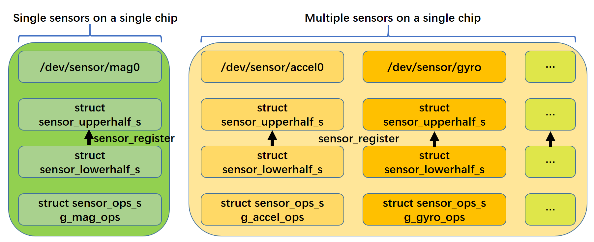
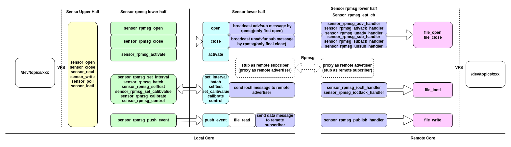
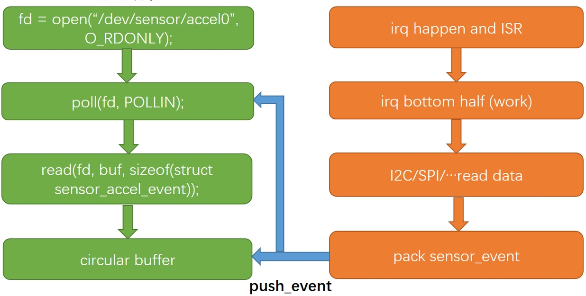
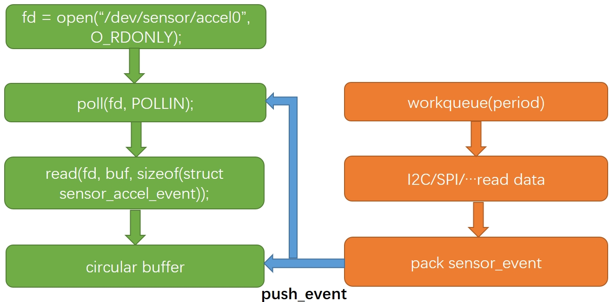
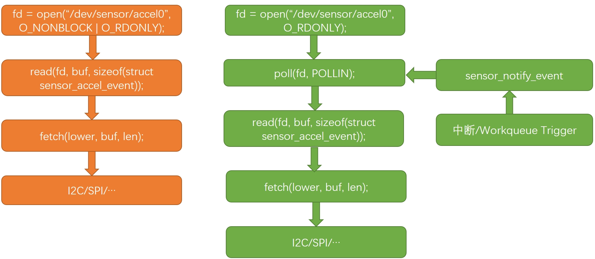

# Sensor Driver Development Guide

[ English | [简体中文](../../../../../zh-cn/device_dev_guide/driver/peripheral_driver/sensor/sensor_driver_development_guide.md.md) ]

This document aims to help you understand the openvela sensor framework and guide you through writing a standard sensor driver.

**Learning Objectives:**

- Understand the design principles and core features of the openvela sensor framework.
- Master the steps and methods for writing a sensor driver.

## I. Framework Overview

The openvela sensor framework draws inspiration from the design of the Linux `IIO (Industrial I/O)` subsystem, aiming to provide a unified and efficient sensor management platform. Its core is a **layered architecture** that abstracts common functionalities into an upper half, allowing driver developers to focus more on the interaction logic with physical hardware.

This design not only unifies the management of all sensors but also effectively reuses common code, reducing the final firmware size.

### 1. Driver Core Responsibilities: Focusing on Physical Sensors

The design philosophy of openvela clearly defines the core responsibilities of a driver developer:

- **Driver Layer Focuses on Physical Sensors**: The sensor driver in openvela is primarily responsible for direct hardware interaction with the **physical sensor**. The core task for developers is to write a lower-half driver to implement communication, data acquisition, and control with the sensor chip.
- **Application Layer Handles Virtual Sensors**: For **virtual sensors** generated through data fusion (e.g., "device attitude" calculated from accelerometer and gyroscope data), the framework is designed to implement them in the **application layer** through the `uORB` publish/subscribe mechanism. This is not the responsibility of a kernel driver.

For physical devices that integrate multiple functions (like an IMU), the driver developer needs to instantiate a separate `lowerhalf` structure in the lower half for **each physical function** (e.g., acceleration, gyration) and register them as independent device nodes via the `sensor_register` API.

### 2. Upper/Lower Half Driver Model

The openvela sensor framework explicitly divides driver logic into two layers:

- **Upper Half**

    - **Role**: Serves as the generic layer of the framework, handling all common logic that is not hardware-specific.
    - **Core Responsibilities**:

        - Create and manage device nodes (`/dev/sensor/*`).
        - Implement standard file operation interfaces (`file_operations`), such as `open`, `read`, and `ioctl`.
        - Manage concurrent access from multiple users.
        - Maintain a ring buffer for data exchange.
        - Perform data down-sampling and low-power management.

- **Lower Half**

    - **Role**: Serves as the hardware abstraction layer for a specific sensor, responsible for direct communication with the physical sensor.
    - **Core Responsibilities**:

        - Implement the `sensor_ops_s` operation set to define the specific behavior of the sensor (e.g., `activate`, `set_interval`).
        - Interact with sensor registers via buses like I2C/SPI.
        - Collect data in interrupt or polling mode and push sensor events to the upper half's ring buffer.
    - **Implementations**:

        - **Generic Lower Half**: A driver that interacts directly with physical hardware.
        - **RPMSG Lower Half**: A proxy driver responsible for cross-core data subscription and publication with remote CPU cores.

## II. Development Preparation: Code and Configuration

### 1. Key File Locations

- **Framework Core**:

    - `nuttx/driver/sensor/sensor.c`: Upper half implementation for sensors.
    - `nuttx/driver/sensor/sensor_rpmsg.c`: RPMSG lower half implementation.
    - `nuttx/driver/sensor/usensor.c`: User-space sensor registration implementation.

- **Header Files**:

    - `nuttx/include/nuttx/sensors/sensor.h`: Internal data type definitions for sensors.
    - `nuttx/include/nuttx/sensors/ioctl.h`: `ioctl` command definitions.
    - `nuttx/include/nuttx/uorb.h`: Unified message structure definitions for uORB.

### 2. Kernel Configuration (Kconfig)

You need to enable the following configurations in `menuconfig` to support the sensor framework:

- `CONFIG_SENSORS`: Enable the openvela sensor framework.
- `CONFIG_USENSORS`: Enable user-space sensor definition and registration features.
- `CONFIG_SENSORS_RPMSG`: Enable multi-core sensor communication capabilities.

## III. Key Data Structures

### 1. Sensor Types and Topics

`openvela` predefines 53 standard sensor types, covering most physical sensors. All types are defined in `include/nuttx/sensors/sensor.h`. These type definitions are also used as communication topics for `uORB (micro Object Request Broker)`.

If a new type needs to be added, its physical purpose and data unit specifications must be clearly defined.

**Example: Accelerometer (`SENSOR_TYPE_ACCELEROMETER`)**

Its event data structure is defined as follows:

```C
/*
 * Accelerometer
 * Measures the acceleration vector of the device along three orthogonal axes.
 */
struct sensor_event_accel   /* Type: Accelerometer */
{
  uint64_t timestamp;       /* Timestamp in microseconds (us) */
  float x;                  /* X-axis acceleration in m/s^2 */
  float y;                  /* Y-axis acceleration in m/s^2 */
  float z;                  /* Z-axis acceleration in m/s^2 */
  float temperature;        /* Device temperature in degrees Celsius (°C) */
};
```

### 2. Lower Half Interface Structure: `sensor_lowerhalf_s`

This structure is the core bridge connecting the upper and lower halves. When writing a driver, you need to instantiate and populate the specified fields in this structure.

<details>
<summary>Click to expand code</summary>

```C++
struct sensor_lowerhalf_s
{
  /* --- To be filled by the lower-half driver --- */
  int type;
  unsigned long nbuffer;
  bool uncalibrated;
  FAR const struct sensor_ops_s *ops;
  bool persist;

  /* --- To be filled by the upper half for the lower half to call --- */
  union
    {
      sensor_push_event_t push_event;
      sensor_notify_event_t notify_event;
    };

  CODE void (*sensor_lock)(FAR void *priv);
  CODE void (*sensor_unlock)(FAR void *priv);

  FAR void *priv;
};
```

</details>

---

**Field Descriptions**

| **Member**                      | **Filled By** | **Description**                                                                                                                                                                          |
| :------------------------------ | :------------ | :--------------------------------------------------------------------------------------------------------------------------------------------------------------------------------------- |
| `type`                          | Lower Half    | **Required**. Specifies the sensor type, such as `SENSOR_TYPE_ACCELEROMETER`.                                                                                                            |
| `nbuffer`                       | Lower Half    | **Required**. Sets the size of the upper-half ring buffer (in number of events).                                                                                                         |
| `uncalibrated`                  | Lower Half    | **Optional**. Indicates if the data reported by the lower-half driver is uncalibrated. If set to `true`, the registered device node will automatically have an `_uncal` suffix appended. |
| `ops`                           | Lower Half    | **Required**. A pointer to the driver's implementation of the `sensor_ops_s` operation set structure.                                                                                    |
| `persist`                       | Lower Half    | **Optional**. If set to `true`, it indicates that the topic is a notification-type topic.                                                                                                |
| `push_event`                    | Upper Half    | **Recommended**. The lower half calls this function to push collected data to the ring buffer.                                                                                           |
| `notify_event`                  | Upper Half    | Used only with `fetch` mode to notify the upper half that data is ready during a blocking read.                                                                                          |
| `sensor_lock` / `sensor_unlock` | Upper Half    | Exported locks for the lower half to use to prevent recursive deadlocks (currently only used by `sensor_rpmsg`).                                                                         |
| `priv`                          | Upper Half    | A private pointer to the upper-half context, used internally by functions like `push_event`.                                                                                             |

### 3. Driver Implementation Models

Depending on the hardware characteristics, your driver implementation may follow one of these models:

- **Single-Chip Single-Sensor**:

    - **Description**: A single chip provides only one sensor function (e.g., the IAM20381 with only a three-axis accelerometer).
    - **Implementation**: Instantiate one `sensor_lowerhalf_s` structure and register it once.

- **Single-Chip Multi-Sensor**:

    - **Description**: A single chip integrates multiple sensor functions (e.g., the ICM20948 IMU, which includes an accelerometer, gyroscope, and magnetometer).
    - **Implementation**: You need to instantiate a separate `sensor_lowerhalf_s` structure for each sensor function and call `sensor_register` multiple times to register them as independent device nodes (e.g., `/dev/sensor/accel0`, `/dev/sensor/gyro0`).



## IV. Core APIs and Driver Operation Set

This section introduces the core interfaces that the openvela sensor framework provides for lower-half drivers, including helper APIs and the mandatory driver operation set `sensor_ops_s`.

### 1. Upper Half Helper APIs

The upper half exports several helper functions for the lower-half driver to call during its implementation.

#### Device Registration and Unregistration

- `sensor_register` / `sensor_unregister`

    - **Purpose**: To register and unregister **standard-type** sensor devices.
    - **Description**: Upon successful registration, a corresponding device node, such as `accel0`, is created in the `/dev/sensor/` directory. The `devno` parameter is a device name index used to distinguish between multiple devices of the same type.

- `sensor_custom_register` / `sensor_custom_unregister`

    - **Purpose**: To register and unregister **custom-type** sensors. Successful registration creates a character device node.
    - **Description**: Allows the developer to specify a character device path (`path`) and event data size (`esize`), providing greater flexibility.

<details>
<summary>Click to expand code</summary>

```C
/* Register/unregister standard-type sensors */
int sensor_register(FAR struct sensor_lowerhalf_s *dev, int devno);
void sensor_unregister(FAR struct sensor_lowerhalf_s *dev, int devno);

/* Register/unregister custom-type sensors */
int sensor_custom_register(FAR struct sensor_lowerhalf_s *dev,
                           FAR const char *path, unsigned long esize);
void sensor_custom_unregister(FAR struct sensor_lowerhalf_s *dev,
                              FAR const char *path);
```

</details>

#### Getting a Timestamp

This function returns a system timestamp with microsecond (us) precision. The lower-half driver should call this interface to populate the `timestamp` field when packaging a sensor event.

```C
static inline uint64_t sensor_get_timestamp(void)；
```

### 2. Lower Half Operation Set: `sensor_ops_s`

The `sensor_ops_s` structure defines a set of function pointers (callbacks) and is the core of the lower-half driver. Developers must implement these interfaces to respond to control requests from the upper half. The design of this interface set is based on mainstream sensor frameworks, selecting the most critical operations. Other fixed configurations (like range and resolution) are recommended to be passed as parameters during driver initialization.

<details>
<summary>Click to expand code</summary>

```C
struct sensor_ops_s
{
  CODE int (*open)(FAR struct sensor_lowerhalf_s *lower, FAR struct file *filep);
  CODE int (*close)(FAR struct sensor_lowerhalf_s *lower, FAR struct file *filep);
  CODE int (*activate)(FAR struct sensor_lowerhalf_s *lower, FAR struct file *filep, bool enable);
  CODE int (*set_interval)(FAR struct sensor_lowerhalf_s *lower, FAR struct file *filep, FAR unsigned long *period_us);
  CODE int (*batch)(FAR struct sensor_lowerhalf_s *lower, FAR struct file *filep, FAR unsigned long *latency_us);
  CODE int (*fetch)(FAR struct sensor_lowerhalf_s *lower, FAR struct file *filep, FAR char *buffer, size_t buflen);
  CODE int (*selftest)(FAR struct sensor_lowerhalf_s *lower, FAR struct file *filep, unsigned long arg);
  CODE int (*calibrate)(FAR struct sensor_lowerhalf_s *lower, FAR struct file *filep, unsigned long arg);
  CODE int (*set_calibvalue)(FAR struct sensor_lowerhalf_s *lower, FAR struct file *filep, unsigned long arg);
  CODE int (*get_info)(FAR struct sensor_lowerhalf_s *lower, FAR struct file *filep, FAR struct sensor_device_info_s *info);
  CODE int (*flush)(FAR struct sensor_lowerhalf_s *lower, FAR struct file *filep);
  CODE int (*control)(FAR struct sensor_lowerhalf_s *lower, int cmd, unsigned long arg);
};
```

</details>

#### Operation Function Details

- `open` / `close`

    - **Purpose**: Open and close the device.
    - **Notes**: This interface is typically not implemented by physical sensor drivers and is mainly used by the `sensor_rpmsg` lower half.

- `activate`

    - **Purpose**: Activate (`enable = true`) or deactivate (`enable = false`) the sensor. This is the core control for starting and stopping data acquisition.
    - **Note**: `push_event` should not be called within the `activate` function.

- `set_interval`

    - **Purpose**: Set the sensor's sampling period (Output Data Rate, ODR).
    - **Parameters**: `period_us` is the desired sampling period in microseconds. The driver should set the period closest to what the hardware supports and **return the actually set value** through this pointer.

- `batch`

    - **Purpose**: Set the maximum reporting latency for batch mode.
    - **Parameters**: `latency_us` is the maximum latency in microseconds.
    - **Notes**: This feature is mainly for sensors with a hardware FIFO, allowing data to be buffered in the FIFO for a period before being reported, which can reduce power consumption.

- `fetch`

    - **Purpose**: Actively pull a single data sample from the sensor.
    - **Notes**: Suitable for non-event-driven scenarios (i.e., not interrupt or polling). For drivers that report data using the `push_event` method, this interface can be set to `NULL`.

- `selftest`

    - **Purpose**: Execute the sensor's self-test procedure.
    - **Notes**: Primarily used for production testing or device diagnostics.

- `calibrate` / `set_calibvalue`

    - **Purpose**: `calibrate` triggers the sensor calibration process and returns the calibration result via `arg`; `set_calibvalue` is used to write external calibration data to the sensor.

- `get_info`

    - **Purpose**: Get the sensor's device information.
    - **Notes**: The driver needs to populate the `sensor_device_info_s` structure, which includes the device name, version, range, etc.

- `flush`

    - **Purpose**: Request to clear all buffered data in the hardware FIFO and report it immediately.
    - **Notes**: Only applicable to sensors with a hardware FIFO. The completion of this operation is signaled by the driver calling `push_event(..., 0)` once, which pushes a zero-length event to notify the upper half that the flush is complete.

- `control`

    - **Purpose**: Provide a custom control channel.
    - **Notes**: When the standard interfaces above cannot meet specific control needs (such as setting range, filters, etc.), private `ioctl` commands can be implemented through this interface.

## V. Framework Features

### 1. Data Down-sampling

Data down-sampling is a core feature provided by the **sensor upper half**. It allows data subscribers to retrieve data at a frequency lower than the hardware sampling rate without requiring any intervention from the driver itself.

- **Mechanism**: The publisher (driver) writes data to the ring buffer at the rate set by the hardware. When a subscriber requests data, the upper half intelligently selects the most appropriate data points from the buffer based on the subscriber's set frequency (`interval`) and the publisher's frequency, skipping the intermediate redundant samples.
- **Advantages**:

    - **Decoupling**: The driver only needs to operate at a fixed frequency and does not need to dynamically adjust the hardware sampling rate for each subscriber.
    - **Efficiency**: Avoids unnecessary data copies and processing, reducing CPU load.
    - **Flexibility**: Supports both aligned and unaligned down-sampling to accommodate different data consumption scenarios.

### 2. Multi-Core Communication Mechanism

openvela implements cross-CPU core sensor data sharing through the **`sensor_rpmsg` lower-half driver**, the core of which is a `Proxy` and `Stub` model.

- **Core Principle**: `sensor_rpmsg` acts as a special lower-half driver. It does not interact with physical hardware itself but serves as a bridge for cross-core communication.
    - When an application on one core **subscribes** to a sensor on a remote core, a `Proxy` object is created locally. This `Proxy` **locally represents the remote publisher**.
    - Correspondingly, on the publisher's core, a `Stub` object is created for this remote subscription. This `Stub` **locally represents the remote subscriber**.
    - Subsequently, all data and control commands are exchanged between this `Proxy`-`Stub` pair via the `RPMSG` (Remote Processor Messaging) protocol.

- **Workflow**:

    - **Discovery and Binding**: When an application first subscribes to or publishes a topic, it performs cross-core discovery via an `RPMSG` broadcast. If a match is found, the two parties establish a binding relationship and create the corresponding `Proxy` and `Stub`.
    - **Control Flow (Subscriber -> Publisher)**: When a local subscriber modifies the sampling rate, the request is sent from the local `Proxy` to the remote `Stub`. The `Stub` then calls the `set_interval` interface of the actual physical driver on its core to configure the hardware.
    - **Data Flow (Publisher -> Subscriber)**: After the remote physical driver collects data, the `Stub` receives it and forwards it via `RPMSG` to all bound `Proxy` instances, which ultimately deliver it to the subscribers.

- **Performance Optimization**: To reduce the frequency and power consumption of inter-processor communication (IPC), `sensor_rpmsg` batches all messages collected over a period of time (typically half the sampling interval of the fastest topic) for **bulk transmission**.



## VI. Driver Implementation: Data Acquisition Modes

openvela sensor drivers support three main data acquisition and reporting modes. Developers should choose the most appropriate solution based on the sensor's hardware characteristics and application requirements.

### 1. Interrupt Mode (Recommended)

- **Description**: Most common sensors operate in an interrupt-driven manner. When an interrupt occurs, data is read in the bottom half of the interrupt handler (e.g., a worker thread). The sensor data is then obtained via I2C, SPI, or another bus, and the `push_event` function is called to push the data to the upper half's ring buffer.
- **Applicable Scenarios**:

    - Scenarios with high real-time data requirements.
    - It is recommended to configure an interrupt pin for sampling rates above **25Hz**.

- **Implementation Points**:

    - Data generated by the bottom half of each interrupt is pushed to the upper-half ring buffer. The upper-layer application reads directly from the buffer. If the buffer is empty, the process will wait or not based on the blocking flag in `f_oflags`.
    - Call `lower->push_event()` in the interrupt handler.



### 2. Polling Mode

- **Description**: For sensors that do not support hardware interrupts, data is collected by periodically polling the sensor. The data is then pushed to the ring buffer by calling `push_event`.
- **Applicable Scenarios**:

    - Low-cost sensors that do not support interrupts.
    - Applications with low power consumption and real-time requirements.

- **Implementation Points**:

    - The driver needs to manage a timer internally.
    - The timer's period should be dynamically adjusted based on the `set_interval` setting.
    - Similar to interrupt mode, use `push_event()` to report data.



### 3. Active Fetch Mode (`fetch`)

- **Description**: Each time the upper-layer application calls `read()`, if the character device node is opened in non-blocking mode, the `fetch` function will directly read the register via the I2C/SPI bus, and the `poll` operation will always succeed. If opened in blocking mode and no data is ready upon a `read` call, the `poll` function can be used to monitor it. If a `POLLIN` event occurs, `read` can be called immediately.
- **Applicable Scenarios**:

    - Sensors with a very low sampling rate and small data volume.
    - **Note: This mode is not officially recommended for general use cases.**

- **Implementation Points**:

    - The driver must implement the `fetch` function in `sensor_ops_s`.
    - The upper half automatically disables the ring buffer in this mode.

- **Pros and Cons**:

    - **Pros**: Data can be read directly into the user-provided buffer, reducing one memory copy.
    - **Cons**:

        - **Blocks Application**: Bus access is relatively slow and can block the upper-layer application.
        - **Stale Data**: The data obtained is from "this moment" but may not be the most recent, failing to accurately reflect changes in the sensor's state.



### 4. Buffer Size Recommendation (`nbuffer`)

When using interrupt or polling mode, you need to set the ring buffer size (in number of events) via the `nbuffer` field of `sensor_lowerhalf_s`.

- **High-sampling-rate sensors**: Recommended to be set to 2-3 to handle potential scheduling delays.
- **Low-sampling-rate sensors**: A setting of 1 is sufficient.

## VII. Test Tool: `sensortest`

`sensortest` is a command-line test tool used to interact with sensor drivers at runtime to verify the correctness of their control and data reading functions.

### 1. Functionality

Operates on a specified sensor device node using standard system calls (`open`, `ioctl`, `read`, `close`).

### 2. Usage

```C
sensortest <device_node> [options]
```

- `device_node`: Required. Specifies the device node to test, such as `accel0`.
- `options`: Optional. Used to specify test parameters.

### 3. Common Commands

- **Displaying Help**:

    ```Bash
    sensortest -h
    ```

- **Continuous Reading at Default Rate**: The default sampling interval is 1,000,000 microseconds (1 second).

    ```Bash
    sensortest accel0
    ```

- **Continuous Reading at a Specified Rate**: Use the `-i` parameter to set the sampling interval in microseconds.

    ```Bash
    # Read accelerometer data at 20Hz (50000 us)
    sensortest accel0 -i 50000
    ```

**Note**: The device node name must be a valid node in the `/dev/sensor/` directory.

## VIII. Further Reading

- For the design and detailed explanation of the Sensor framework, please refer to the [Sensor Framework Guide](./sensor_framework_guide.md).
