# Arch Alarm Framework Development Guide

\[ English | [简体中文](../../../../../zh-cn/device_dev_guide/driver/timer_driver/timer/Arch_Alarm.md) \]

## I. Objective of This Document

This document introduces the design and implementation of the **arch_alarm** driver framework based on the **oneshot** driver, along with interface usage and implementation details.

- Application developers/testers: Can refer to the [Testing Examples](#viii-testing-examples) section for development or testing purposes.
- Driver developers can refer to the [Driver Adaptation Example](#vi-driver-adaptation-example) section for driver development.

## II. Overview

### 1. Oneshot Driver Architecture

Openvela provides a generic **oneshot** driver, which is a one-time (non-periodic) timer. This driver follows the openvela driver framework and consists of two parts:

- **Upper Half**: Application-facing, provided by openvela, and does not require modification by chip vendors.
- **Lower Half**: Platform-specific hardware control driver, which chip vendors need to adapt and provide.

The **oneshot** driver-related interface information is in the [oneshot.h](../../../../../../../../nuttx/blob/dev-ai-contest-2026/include/nuttx/timers/oneshot.h) file, and is also divided into **Upper Half** and **Lower Half** interface layers.

### 2. Arch_alarm Timer Introduction

- The `arch_alarm` based on the **oneshot** driver provides timer functionality for the **sched** module.
- Supports two operating modes:
    - **Tickless** (Non-periodic Interrupt): Eliminates periodic interrupts to reduce power consumption, ideal for low-power applications.
    - **Tick** (Periodic interrupt ): Triggers timer interrupts at fixed intervals for precise timing control.
- System architecture position of `arch_alarm` :

    

### 3. Application Interface Invocation Method

#### 3.1 Invocation Method

- Standard POSIX API: Supports invocation through standard POSIX (Portable Operating System Interface for uniX) API, specifically the timer-related interfaces defined in the `<time.h>` header file.
- `ioctl` system call: Can interact with the Upper Half and Lower Half through the `ioctl` (input/output control) system call, suitable for custom control and device management scenarios.

#### 3.2 Precautions

The **`up_timer_initialize`** function in the Upper Half of openvela must be implemented by chip vendors (SoC or MCU suppliers). Without this implementation, the related timer functions will not work properly.

#### 3.3 Invocation Process



## III. Arch_alarm API

`arch_alarm` provides a series of interfaces to meet the timer requirements of the sched module. Interface information can be found in the [arch.h](../../../../../../../../nuttx/blob/dev-ai-contest-2026/include/nuttx/arch.h) header file.

### 1. Interface Classification

Under the **Tickless** mode, these interfaces are further divided into two groups based on different time units:

- Interfaces using the `struct timespec` structure
- Interfaces based on `tick` (system tick count)

### 2. Interface Description

- `up_alarm_set_lowerhalf`

    Initializes the alarm timer, with the parameter being an instance of oneshot_lowerhalf_s.

    ```C
    void up_alarm_set_lowerhalf(FAR struct oneshot_lowerhalf_s *lower)
    ```

- `up_alarm_tick_start`

    Starts the alarm timer, used only in Tickless mode, with the parameter being the alarm timeout time in ticks.

    ```C
    int weak_function up_alarm_tick_start(clock_t ticks)
    ```

- `up_alarm_tick_cancel`

    Stops the alarm timer, used only in Tickless mode, returns the remaining ticks of the current alarm.

    ```C
    int weak_function up_alarm_tick_cancel(FAR clock_t *ticks)
    ```

- `up_timer_getmask`

    Obtains the mask value of the alarm timer duration.

    ```C
    void weak_function up_timer_getmask(FAR clock_t *mask)
    ```

- `up_timer_gettick`

    Obtains the ticks already elapsed by the alarm timer.

    ```C
    int weak_function up_timer_gettick(FAR clock_t *ticks)
    ```

- `up_udelay`

    Implements microsecond-level delay operations.

    ```C
    void weak_function up_udelay(useconds_t microseconds)
    ```

- `up_mdelay`

    Implements millisecond-level delay operations.

    ```C
    void weak_function up_mdelay(unsigned int milliseconds)
    ```

## IV. Oneshot Driver

### 1. Configuration Description

#### 1.1 Core Configuration Items

During the openvela board adaptation process, the following key configuration items need to be set to enable system core functions and low-power features:

- Enable oneshot driver

    - Enable the oneshot driver by setting the `CONFIG_ONESHOT` configuration item.
    - This configuration is mandatory to ensure the normal operation of the oneshot driver, thereby supporting the system's timer-related functions.

- Enable arch_alarm

    - Enable the arch_alarm driver by configuring `CONFIG_ALARM_ARCH`.
    - This configuration is also mandatory, as arch_alarm plays a crucial role in the system's time management and task scheduling.

- Enable TICKLESS low-power mode

    - Enable TICKLESS low-power mode by configuring `CONFIG_SCHED_TICKLESS`.
    - Under this mode, the system will no longer generate periodic clock interrupts.
    - When there are no tasks to execute in the system, it will automatically enter idle mode until the next task execution or interrupt occurs.
    - Whether to configure this mode depends on the system's low-power support requirements.

#### 1.2 Configuration File Description

##### Configuration of `sched/Kconfig` File

The content related to the above configurations in the `sched/Kconfig` file is as follows:

```Shell
# sched/Kconfig
config SCHED_TICKLESS depends on ARCH_HAVE_TICKLESS # Hardware must support Tickless mode
if SCHED_TICKLESS
    config SCHED_TICKLESS_TICK_ARGUMENT
    config SCHED_TICKLESS_ALARM
    config SCHED_TICKLESS_LIMIT_MAX_SLEEP
#endif
```

The configuration of `SCHED_TICKLESS` depends on `ARCH_HAVE_TICKLESS`.

##### Configuration of `drivers/timers/Kconfig` File

The relevant configurations in the `drivers/timers/Kconfig` file are as follows:

```Shell
# drivers/timers/Kconfig
config ONESHOT
......
if ONESHOT
config ALARM_ARCH
    select ARCH_HAVE_TICKLESS
    select ARCH_HAVE_TIMEKEEPING
    select SCHED_TICKLESS_ALARM if SCHED_TICKLESS
    select SCHED_TICKLESS_LIMIT_MAX_SLEEP if SCHED_TICKLESS
    select SCHED_TICKLESS_TICK_ARGUMENT if SCHED_TICKLESS
#endif
```

#### 1.3 Configuration Verification

To ensure the above configurations take effect correctly, the following command can be used for verification:

```Shell
grep -rE "CONFIG_ONESHOT|CONFIG_ALARM_ARCH|CONFIG_ARCH_HAVE_TICKLESS|CONFIG_ARCH_HAVE_TIMEKEEPING|CONFIG_SCHED_TICKLESS|CONFIG_SCHED_TICKLESS_TICK_ARGUMENT|CONFIG_SCHED_TICKLESS_ALARM|CONFIG_SCHED_TICKLESS_LIMIT_MAX_SLEEP" nuttx/.config
```

This command recursively searches for related configuration items in the `nuttx/.config` file to confirm whether the configurations have been correctly set.

### 2. Oneshot Initialization

#### 2.1 Overview of Initialization Process

In the openvela board adaptation, the initialization of the Oneshot timer requires completing three core steps: **instance creation**, **device registration**, and **system binding**, ensuring the collaborative operation of the timer driver with the system low-power module (TICKLESS). The specific implementation process is as follows.

##### Instance Creation: Call `oneshot_initialize`

During the board initialization phase, it is necessary to invoke the **vendor-customized initialization function** to complete the allocation and initialization of the [struct oneshot_lowerhalf_s](../../../../../../../../nuttx/blob/dev-ai-contest-2026/include/nuttx/timers/oneshot.h#L226) structure. This function is provided by the openvela framework, with the prototype as follows:

```C
/****************************************************************************
 * Name: oneshot_initialize
 *
 * Description:
 *   Initialize the oneshot timer and return a oneshot lower half driver
 *   instance.
 *
 * Input Parameters:
 *   chan       Timer counter channel to be used.
 *   resolution The required resolution of the timer in units of
 *              microseconds. NOTE that the range is restricted to the
 *              range of uint16_t (excluding zero).
 *
 * Returned Value:
 *   On success, a non-NULL instance of the oneshot lower-half driver is
 *   returned. NULL is returned on any failure.
 *
 ****************************************************************************/
FAR struct oneshot_lowerhalf_s *oneshot_initialize(int chan, uint16_t resolution);
```

Operation Instructions:

- This function is responsible for initializing low-level hardware registers and interrupt configurations.
- The returned instance contains core data of the timer driver (such as interrupt handling functions and clock source configurations), which should be properly saved for subsequent registration.

##### Device Registration: Call `oneshot_register`

Bind the instance returned by `oneshot_initialize` to the system device model, register the character device node (e.g., `/dev/oneshot`), and associate it with the file operation interface `struct file_operations g_oneshot_ops`. The prototype of the function [oneshot_register](../../../../../../../../nuttx/blob/dev-ai-contest-2026/drivers/timers/oneshot.c#L291) is as follows:

```C
/****************************************************************************
 * Name: oneshot_register
 *
 * Description:
 *   Register the oneshot device as 'devpath'
 *
 * Input Parameters:
 *   devpath - The full path to the driver to register. E.g., "/dev/oneshot0"
 *   lower - An instance of the lower half interface
 *
 * Returned Value:
 *   Zero (OK) on success; a negated errno value on failure. The following
 *   possible error values may be returned (most are returned by
 *   register_driver()):
 *
 *   EINVAL - 'path' is invalid for this operation
 *   EEXIST - An inode already exists at 'path'
 *   ENOMEM - Failed to allocate in-memory resources for the operation
 *
 ****************************************************************************/
int oneshot_register(FAR const char *devname,
                     FAR struct oneshot_lowerhalf_s *lower)
```

Operation Instructions:

- After registration, upper-layer applications can access timer functions through standard POSIX interfaces (e.g., `open`/`ioctl`).
- Ensure that `g_oneshot_ops` implements necessary file operations such as `read`/`write`/`ioctl`.

##### System Binding: Implement `up_timer_initialize` Function

Platform-specific code needs to implement the `up_timer_initialize` function to bind the Oneshot instance with the system TICKLESS low-power module.

Specific Steps:

1. Allocate a driver instance by calling `oneshot_initialize`.
2. Register the instance as the system timer backend through the `up_alarm_set_lowerhalf` function.

Key Role:

- The `up_alarm_set_lowerhalf` function associates the interrupt handling of the Oneshot driver with the scheduler, enabling the TICKLESS mode of no periodic clock interrupts.
- When the system has no tasks running, it enters a low-power idle mode through this instance until the next task wake-up or interrupt trigger.

#### 2.2 Reference Implementation and Debugging

- Structure Definition: For details on the members of `struct oneshot_lowerhalf_s`, refer to [oneshot.h](../../../../../../../../nuttx/blob/dev-ai-contest-2026/include/nuttx/timers/oneshot.h#L226). Fill in function pointers such as interrupt triggering and timer startup according to hardware characteristics.
- Example Code: For specific driver adaptation examples, refer to the [Driver Adaptation Example - Initialization Section](#1-initialization-process), and adjust the hardware register operation logic according to the target platform (e.g., ARM Cortex-M/RISC-V).
- Debugging Suggestions: If initialization fails, check whether `CONFIG_ONESHOT`/`CONFIG_ALARM_ARCH` are correctly enabled, and use serial port logs to print the return value of `oneshot_initialize`.

### 3. Upper-Half Interfaces

In openvela, the Upper-Half interfaces provide unified timer services for kernel modules, compatible with both Tickless and Tick modes. The design goal is to abstract time management, reducing the coupling between the scheduler (Sched) and the hardware architecture layer (Arch).

#### 3.1 Interface Division Under Tickless Mode

The time unit type is selected via the configuration `CONFIG_SCHED_TICKLESS_TICK_ARGUMENT`:

| Mode               | Time Unit                             | Applicable Scenario                                  | Configuration Item                              |
| ------------------ | ------------------------------------- | ---------------------------------------------------- | ----------------------------------------------- |
| Tick Interface     | System Ticks                          | Scenes requiring alignment with hardware timer ticks | Enabled by default                              |
| Timespec Interface | High-Precision Time (struct timespec) | Real-time tasks requiring nanosecond-level precision | Configure CONFIG_SCHED_TICKLESS_TICK_ARGUMENT=n |

Design Principles:

- Reduce time conversion overhead: Default use of Tick interfaces avoids frequent conversion between `struct timespec` and Ticks.
- Flexibility: Developers can dynamically switch time units according to needs.

#### 3.2 Core Interface Description

Upper-Half interfaces are defined in [arch.h](../../../../../../../../nuttx/blob/dev-ai-contest-2026/include/nuttx/arch.h#L1460), primarily for use by the scheduler (Sched).

### 4. Lower-Half Interfaces

In the hardware abstraction layer (HAL) development of openvela, the Lower-Half interfaces define the operation logic of the underlying timer through `struct oneshot_operations_s`.

This interface supports two time units (`struct timespec` and `tick`). Developers can choose to implement one group based on hardware characteristics, with unimplemented interfaces provided with default conversion logic by openvela.

#### 4.1 Interface Classification and Implementation Strategy

##### Time Unit Selection

- `struct timespec`

    - Provides nanosecond-level time precision, suitable for high-precision timing scenarios.
    - Requires direct operation on hardware timer registers, with higher implementation complexity.

- `tick`

    - A time unit based on system ticks, aligned with the hardware timer period.
    - Simple to implement, suitable for resource-constrained embedded devices.

##### Implementation Strategy

- Vendor Selection

    - Choose to implement the `timespec` or `tick` interface group based on hardware capabilities.
    - Unimplemented interface groups can be automatically mapped via openvela's built-in [conversion functions](../../../../../../../../nuttx/blob/dev-ai-contest-2026/include/nuttx/timers/oneshot.h).

- Performance Optimization

    - Prioritize implementing the interface group natively supported by the hardware to reduce conversion overhead.

#### 4.2 Core Interface Description

`struct oneshot_operations_s` is defined in [oneshot.h](../../../../../../../../nuttx/blob/dev-ai-contest-2026/include/nuttx/timers/oneshot.h), with the following member functions.

##### Timer Control Interfaces

```C
struct oneshot_operations_s
{
  /* Start the timer (relative time) */  
  CODE int (*start)(FAR struct oneshot_lowerhalf_s *lower,
                    oneshot_callback_t callback, FAR void *arg,
                    FAR const struct timespec *ts);
  CODE int (*tick_start)(FAR struct oneshot_lowerhalf_s *lower,
                         oneshot_callback_t callback, FAR void *arg,
                         clock_t ticks);
  
  /* Cancel the timer and return the remaining time */    
  CODE int (*cancel)(FAR struct oneshot_lowerhalf_s *lower,
                     FAR struct timespec *ts);
  CODE int (*tick_cancel)(FAR struct oneshot_lowerhalf_s *lower,
                          FAR clock_t *ticks);
                      
  /* Get the current time (cumulative time since system power-on) */                        
  CODE int (*current)(FAR struct oneshot_lowerhalf_s *lower,
                      FAR struct timespec *ts);                         
  CODE int (*tick_current)(FAR struct oneshot_lowerhalf_s *lower,
                           FAR clock_t *ticks);
                       
  /* Get the maximum delay supported by the timer */                          
  CODE int (*max_delay)(FAR struct oneshot_lowerhalf_s *lower,
                        FAR struct timespec *ts);
  CODE int (*tick_max_delay)(FAR struct oneshot_lowerhalf_s *lower,
                             FAR clock_t *ticks);
};
```

##### Key Parameter Description

- `oneshot_callback_t`: Pointer to the callback function triggered upon timer expiration.
- `ts`/`ticks`: Input/output parameters representing high-precision time or tick count, respectively.

#### 4.3 Adaptation Example Reference

- Code Example: [Driver Adaptation Example Lower-Half Interface Section](#2-lower-half-interface-implementation)

## V. Process Description

In openvela, the calling logic of arch alarm in `Tickless` mode and `Tick` mode differs significantly, as detailed below.

### 1. Tickless Mode

#### 1.1 Core Logic

- Dynamic Scheduling Mechanism: The scheduler (sched) monitors registered watchdog timers (wdogs) in real-time, selecting the wdog with the **shortest timeout** as the trigger threshold for the next alarm. Thus, sched needs to start or stop the alarm timer based on the current state of the wdog.

- Resource Optimization:

    - Start/stop the timer only when necessary to avoid the overhead of periodic interrupts.
    - During idle periods, the system enters a low-power state, significantly reducing power consumption.

#### 1.2 Invocation Process


### 2. Tick Mode

#### 2.1 Core Logic

- Fixed Period Timer:

    - A timer with a period of `CONFIG_USEC_PER_TICK` microseconds is started during initialization.
    - The timer periodically triggers interrupts to drive task scheduling.

- Performance Trade-off:

    - Simplifies scheduling logic and reduces dynamic start/stop operations.

#### 2.2 Invocation Process


## VI. Driver Adaptation Example

Taking the BL602 chip of the RISC-V architecture as an example, the adaptation process of the oneshot driver in openvela is as follows.

### 1. Initialization Process

#### 1.1 Code Execution Path

```Shell
nx_start
-> clock_initialize
   -> up_timer_initialize # Implemented by developers
      ->up_alarm_set_lowerhalf # Invoke this interface, already implemented by openvela
board_late_initialize (or board_app_initialize) 
-> bl602_bringup # Implemented by developers
   -> oneshot_initialize # Implemented by developers
   -> oneshot_register
```

#### 1.2 Key Code Implementation

- Hardware (Arch Layer) Timer Initialization, refer to code [arch/risc-v/src/bl602/bl602_timerisr.c](../../../../../../../../nuttx/blob/dev-ai-contest-2026/arch/risc-v/src/bl602/bl602_timerisr.c#L57).

    ```C
    /****************************************************************************
     * Name: up_timer_initialize
     *
     * Description:
     *   This function is called during start-up to initialize
     *   the timer interrupt.
     *
     ****************************************************************************/
    
    void up_timer_initialize(void)
    {
      struct oneshot_lowerhalf_s *lower = riscv_mtimer_initialize(
        BL602_CLIC_MTIME, BL602_CLIC_MTIMECMP,
        RISCV_IRQ_MTIMER, MTIMER_FREQ);
    
      DEBUGASSERT(lower);
    
      up_alarm_set_lowerhalf(lower);
    }
    ```

- Oneshot Driver Instantiation, refer to code [arch/risc-v/src/bl602/bl602_oneshot_lowerhalf.c](../../../../../../../../nuttx/blob/dev-ai-contest-2026/arch/risc-v/src/bl602/bl602_oneshot_lowerhalf.c#L361).

    ```C
    struct oneshot_lowerhalf_s *oneshot_initialize(int      chan,
                                                   uint16_t resolution)
    {
      struct bl602_oneshot_lowerhalf_s *priv;
      struct timer_cfg_s                    timstr;
    
      /* Allocate an instance of the lower half driver */
      priv = (struct bl602_oneshot_lowerhalf_s *)kmm_zalloc(
        sizeof(struct bl602_oneshot_lowerhalf_s));
    
      if (priv == NULL)
        {
          tmrerr("ERROR: Failed to initialized state structure\n");
          return NULL;
        }
    
      /* Initialize the lower-half driver structure */
      priv->started = false;
      priv->lh.ops  = &g_oneshot_ops;
      priv->freq    = TIMER_CLK_FREQ / resolution;
      priv->tim     = chan;
      if (priv->tim == TIMER_CH0)
        {
          priv->irq = BL602_IRQ_TIMER_CH0;
        }
      else
        {
          priv->irq = BL602_IRQ_TIMER_CH1;
        }
    
      /* Initialize the contained BL602 oneshot timer */
      timstr.timer_ch = chan;              /* Timer channel */
      timstr.clk_src  = TIMER_CLKSRC_FCLK; /* Timer clock source */
      timstr.pl_trig_src =
        TIMER_PRELOAD_TRIG_COMP0; /* Timer count register preload trigger source
                                   * selection */
    
      timstr.count_mode = TIMER_COUNT_PRELOAD; /* Timer count mode */
      timstr.clock_division =
        (TIMER_CLK_DIV * resolution) - 1; /* Timer clock division value */
    
      timstr.match_val0 = TIMER_MAX_VALUE; /* Timer match 0 value 0 */
      timstr.match_val1 = TIMER_MAX_VALUE; /* Timer match 1 value 0 */
      timstr.match_val2 = TIMER_MAX_VALUE; /* Timer match 2 value 0 */
    
      timstr.pre_load_val = TIMER_MAX_VALUE; /* Timer preload value */
    
      bl602_timer_intmask(chan, TIMER_INT_ALL, 1);
    
      /* Disable timer */
    
      bl602_timer_disable(chan);
    
      bl602_timer_init(&timstr);
    
      return &priv->lh;
    }
    ```

### 2. Lower-Half Interface Implementation

The operation interface binding is as follows, and the detailed code can be referred to in [arch/risc-v/src/bl602/bl602_oneshot_lowerhalf.c](../../../../../../../../nuttx/blob/dev-ai-contest-2026/arch/risc-v/src/bl602/bl602_oneshot_lowerhalf.c#L96).

```C
/* "Lower half" driver methods */
static const struct oneshot_operations_s g_oneshot_ops =
{
  .max_delay = bl602_max_delay,
  .start     = bl602_start,
  .cancel    = bl602_cancel,
  .current   = bl602_current,
};
```

## VII. POSIX Timer API and IOCTL Control

Openvela provides standard timer interfaces supporting high-precision time management and device control.

### 1. POSIX Timer API

Below is a brief introduction to the timer API. For detailed information, refer to the man pages using the following command:

```Bash
man timer_create
```

Detailed code can be found in [include/time.h](../../../../../../../../nuttx/blob/dev-ai-contest-2026/include/time.h#L233).

```C
/*
* Function: timer_create
* Parameters: clockid, timer type; CLOCK_REALTIME for relative time, TIMER_ABSTIME for absolute time
*             evp, sigevent structure, specifying how to respond upon timer expiration
*             timerid, returns a timerid which can be used to delete the timer, etc.
* Return: 0 on success | -1 on error
* Description: Creates a timer
*/
int timer_create(clockid_t clockid, FAR struct sigevent *evp,
                FAR timer_t *timerid);

/*
* Function: timer_delete
* Parameters: timerid, the timerid returned by timer_create
* Return: 0 on success | -1 on error
* Description: Deletes a timer
*/
int timer_delete(timer_t timerid);

/* Set Timer
* Function: timer_settime
* Parameters: timerid: id
*             flags: relative or absolute time
*             value: timer duration and interval
*             ovalue: if not NULL, returns the remaining expiration time of the previous timer
* Return: 0 on success | -1 on error
* Description: Sets the timer
*/
int timer_settime(timer_t timerid, int flags,
                  FAR const struct itimerspec *value,
                  FAR struct itimerspec *ovalue);

/*
* Function: timer_gettime
* Parameters: timerid: id
*             value: pass in itimerspec
* Return: 0 on success | -1 on error
* Description: Retrieves the remaining expiration time of the current timer
* 
*/
int timer_gettime(timer_t timerid, FAR struct itimerspec *value);

/*
* Function: up_timer_gettime
* Parameters: timerid
* Return: Number of timer overruns
*/
int timer_getoverrun(timer_t timerid);
```

### 2. IOCTL API

Applications can directly operate the Oneshot timer through the `ioctl` function. Before using this feature, the `/dev/oneshot` device node must be registered during the system startup (bringup) process. Refer to the header file [include/nuttx/timers/oneshot.h](../../../../../../../../nuttx/blob/dev-ai-contest-2026/include/nuttx/timers/oneshot.h#L41) for the currently supported `ioctl` commands. Command descriptions are as follows:

- `OSIOC_START`

    - Function: Start the Oneshot timer.
    - Parameter Type: `struct oneshot_start_s*`
    - Parameter Description: Specifies the timer duration and the task ID and event information to notify upon expiration.

- `OSIOC_CANCEL`

    - Function: Stop the Oneshot timer.
    - Parameter Type: `struct timespec*`
    - Parameter Description: The input parameter ts returns the remaining time of the timer.

- `OSIOC_CURRENT`

    - Function: Retrieve the current time of the Oneshot timer.
    - Parameter Type: `struct timespec*`.
    - Parameter Description: Returns the current time of the timer.

- `OSIOC_MAXDELAY`

    - Function: Retrieve the maximum delay of the Oneshot timer.
    - Parameter Type: `struct timespec*`.
    - Parameter Description: Returns the maximum delay of the timer.

## VIII. Testing Examples

### 1. Code Path

- File Location: apps/testing/drivertest/drivertest_oneshot.c

### 2. Code Description

This file contains example code for testing the Oneshot timer functionality. The code is written in C and utilizes the **C Mocka** testing framework for unit testing. Its main functions include starting the Oneshot timer, retrieving the current time, and verifying the timer's operation.

### 3. Code Structure

```C
/****************************************************************************
 * Included Files
 ****************************************************************************/

#include <nuttx/config.h>
#include <stdio.h>
#include <signal.h>
#include <time.h>
#include <unistd.h>
#include <setjmp.h>
#include <cmocka.h>
#include <sys/ioctl.h>
#include <sys/types.h>
#include <sys/stat.h>
#include <fcntl.h>
#include <nuttx/timers/oneshot.h>

/****************************************************************************
 * Pre-processor Definitions
 ****************************************************************************/

#define DEFAULT_TIME_OUT 2
#define ONESHOT_DEFAULT_DEVPATH "/dev/oneshot"
#define ONESHOT_SIGNO 13
#define ONESHOT_DEFAULT_NSAMPLES 5

#define OPTARG_TO_VALUE(value, type, base)                            \
  do                                                                  \
    {                                                                 \
      FAR char *ptr;                                                  \
      value = (type)strtoul(optarg, &ptr, base);                      \
      if (*ptr != '\0')                                               \
        {                                                             \
          printf("Parameter error: -%c %s\n", ch, optarg);            \
          show_usage(argv[0], EXIT_FAILURE);                          \
        }                                                             \
    } while (0)

/****************************************************************************
 * Private Types
 ****************************************************************************/

struct oneshot_state_s
{
  char devpath[PATH_MAX];
  struct oneshot_start_s oneshot;
};

/****************************************************************************
 * Private Data
 ****************************************************************************/

/****************************************************************************
 * Private Functions
 ****************************************************************************/

/****************************************************************************
 * Name: show_usage
 ****************************************************************************/

static void show_usage(FAR const char *progname, int exitcode)
{
  printf("Usage: %s"
         " -s <seconds> -d <path>\n",
         progname);

  exit(exitcode);
}

/****************************************************************************
 * Name: parse_commandline
 ****************************************************************************/

static void parse_commandline(FAR struct oneshot_state_s *oneshot_state,
                              int argc, FAR char **argv)
{
  int ch;
  time_t converted;

  while ((ch = getopt(argc, argv, "s:d:")) != ERROR)
    {
      switch (ch)
        {
          case 's':
            OPTARG_TO_VALUE(converted, time_t, 10);
            if (converted < 1 || converted > INT_MAX)
              {
                printf("signal out of range: %lld\n", converted);
                show_usage(argv[0], EXIT_FAILURE);
              }

            oneshot_state->oneshot.ts.tv_sec = converted;
            break;

          case 'd':
            strlcpy(oneshot_state->devpath, optarg,
                                sizeof(oneshot_state->devpath));
            break;

          case '?':
            printf("Unsupported option: %s\n", optarg);
            show_usage(argv[0], EXIT_FAILURE);
            break;
        }
    }
}

/****************************************************************************
 * Name: test_case_oneshot
 ****************************************************************************/

static void test_case_oneshot(FAR void **state)
{
  int ret;
  int fd;
  int i;
  long int trigger_before;
  struct timespec ts;
  sigset_t set;
  FAR struct oneshot_state_s *oneshot_state =
    (FAR struct oneshot_state_s *)*state;

  oneshot_state->oneshot.pid = getpid();

  signal(ONESHOT_SIGNO, SIG_IGN);
  sigemptyset(&set);
  sigaddset(&set, ONESHOT_SIGNO);
  oneshot_state->oneshot.event.sigev_notify = SIGEV_SIGNAL;
  oneshot_state->oneshot.event.sigev_signo = ONESHOT_SIGNO;
  oneshot_state->oneshot.event.sigev_value.sival_ptr = NULL;

  fd = open(oneshot_state->devpath, O_RDONLY);
  assert_true(fd > 0);

  for (i = 0; i < ONESHOT_DEFAULT_NSAMPLES; i++)
    {
      /* Start the oneshot */

      ret = ioctl(fd, OSIOC_START, &oneshot_state->oneshot);
      assert_return_code(ret, OK);

      /* Get current ts */

      ret = ioctl(fd, OSIOC_CURRENT, &ts);
      assert_return_code(ret, OK);
      trigger_before = ts.tv_sec;

      ret = sigwaitinfo(&set, NULL);
      assert_return_code(ret, ONESHOT_SIGNO);

      ret = ioctl(fd, OSIOC_CURRENT, &ts);
      assert_return_code(ret, OK);

      assert_int_equal(oneshot_state->oneshot.ts.tv_sec, ts.tv_sec
                       - trigger_before);
    }
  ret = ioctl(fd,OSIOC_MAXDELAY,&ts);
  if(ret < 0) {
    
  }
  close(fd);
}

int main(int argc, FAR char *argv[])
{
  struct oneshot_state_s oneshot_state =
  {
    .devpath = ONESHOT_DEFAULT_DEVPATH,
    .oneshot.ts.tv_sec = DEFAULT_TIME_OUT,
    .oneshot.ts.tv_nsec = 0
  };

  const struct CMUnitTest tests[] =
  {
    cmocka_unit_test_prestate(test_case_oneshot, &oneshot_state)
  };

  parse_commandline(&oneshot_state, argc, argv);

  return cmocka_run_group_tests(tests, NULL, NULL);
}
```
