# Arch Timer Driver Framework Development Guide  

\[ English | [简体中文](../../../../../zh-cn/device_dev_guide/driver/timer_driver/timer/Arch_Timer.md) \]

## I. Overview  

This document introduces the implementation of the Arch Timer driver framework based on Timer Driver, as well as the usage and specific implementation instructions of related interfaces. This document applies to the following scenarios:  

- Application Developers or Testers: Can refer to the [Test Cases](#vii-test-cases) in this document for development or testing.  
- Driver Developers: Can refer to the [Driver Adaptation Example](#v-driver-adaptation-example) to complete driver development that meets requirements.  

### 1. What is Arch Timer  

The Arch Timer is an interval timer implemented based on Timer Driver. It provides a series of timer interfaces for the `sched` module in the operating system and supports the following two working modes:  

- Tickless Mode: Allows more flexible and efficient system scheduling.  
- Tick Mode: Provides a fixed-time interval scheduling mechanism.  

The position framework of Arch Timer in the system is as shown in the following figure:  

  

### 2. Driver Framework of Arch Timer  

The overall architecture and related interface design of Arch Timer are as shown in the following figure:  

- `Upper-half`: Provided by openvela, where the `up_timer_initialize` interface needs to be implemented by chip manufacturers.  
- `Lower-half`: Needs to be adapted by chip manufacturers.  
- Application programs can call upper-half or lower-half interfaces through standard POSIX API interfaces or `ioctl` interfaces to complete corresponding functions.  

  

## II. Arch Timer Interfaces  

The `sched` module relies on the timer interfaces provided by the `arch` module, which are all defined in the `/include/nuttx/arch.h` header file.  

In Tickless mode, these interfaces are divided into two groups based on different time units:  

- Interfaces based on microseconds (`us`).  
- Interfaces based on timing units (`tick`).  

Developers can select which interface to enable by configuring the option `CONFIG_SCHED_TICKLESS_TICK_ARGUMENT`. To reduce the time unit conversion between the `sched` and `arch` modules, the `arch timer` natively supports `tick` interfaces to ensure operational efficiency.  

The following is a brief description of the interface functions.  

### Arch Timer Interface Description  

1. `up_timer_set_lowerhalf`

    Initialize the Arch Timer, set a `timer_lowerhalf_s` instance, and start the timer.  

    ```c
    void up_timer_set_lowerhalf(FAR struct timer_lowerhalf_s *lower)
    ```  

2. `up_timer_tick_start`

    Start the timer, used only in Tickless mode. The function's parameter is the timer's timeout period in `tick`.  

    ```c
    int weak_function up_timer_tick_start(clock_t ticks)
    ```  

3. `up_timer_tick_cancel`

    Stop the Arch Timer, used only in Tickless mode. It returns the remaining `tick` count of the timer when executed.  

    ```c
    int weak_function up_timer_tick_cancel(FAR clock_t *ticks)
    ```  

4. `up_timer_getmask`

    Get the value of the timer-supported time mask (`mask`).  

    ```c
    void weak_function up_timer_getmask(FAR clock_t *mask)
    ```  

5. `up_timer_gettick`

    Get the current number of `tick` that have elapsed on the timer.  

    ```c
    int weak_function up_timer_gettick(FAR clock_t *ticks)
    ```  

6. `up_udelay`

    Implement delay operations in microseconds (`us`) for precise delays.  

    ```c
    void weak_function up_udelay(useconds_t microseconds)
    ```  

7. `up_mdelay`

    Implement delay operations in milliseconds (`ms`) for longer delay requirements.  

    ```c
    void weak_function up_mdelay(unsigned int milliseconds)
    ```  

## III. Introduction to Timer Driver  

openvela provides a generic timer (Timer) driver. According to openvela's driver framework, this driver is divided into two layers:  

- `Upper Half`: Provides generic `timer` interfaces for application-level programs. This layer is already provided by openvela, so application developers do not need to modify it.  
- `Lower Half`: Platform-specific driver programs for implementing hardware-level control and adaptation. This layer is the focus for driver developers.  

The definitions of Timer driver-related interfaces can be found in the `/include/nuttx/timers/timer.h` file, and the interfaces are also divided into two layers: `upper half` and `lower half`.  

### 1. Configuration Instructions  

When adapting the **board**, the following three key options need to be configured to enable and adjust Timer Driver functions.  

#### Configure the Driver  

1. Enable Timer Driver: Enable Timer Driver functionality by setting `CONFIG_TIMER`, making the timer driver available.  
2. Enable Arch Timer: Configure the `CONFIG_TIMER_ARCH` option to enable the `arch timer` module. This option allows architecture-level support for architecture-related timer functions.  
3. Enable Tickless Mode: Configure `CONFIG_SCHED_TICKLESS` to enable Tickless mode.

    - Characteristics of Tickless Mode: No periodic clock interrupts. When no tasks are executing, the system enters an idle (Idle) mode and resumes when the next task executes or an interrupt occurs.  

#### Configuration File Paths  

The following are the configuration file paths for Timer Driver in Tickless mode:  

1. File: `sched/Kconfig`  

    ```shell
    # sched/Kconfig
    config SCHED_TICKLESS
        depends on ARCH_HAVE_TICKLESS

    config SCHED_TICKLESS_TICK_ARGUMENT
    config SCHED_TICKLESS_LIMIT_MAX_SLEEP
    ```  

2. File: `drivers/timers/Kconfig`  

    ```shell
    # drivers/timers/Kconfig
    config TIMER
    ......
    if TIMER
    config TIMER_ARCH
            select ARCH_HAVE_TICKLESS
            select ARCH_HAVE_TIMEKEEPING
            select SCHED_TICKLESS_LIMIT_MAX_SLEEP  if SCHED_TICKLESS
            select SCHED_TICKLESS_TICK_ARGUMENT  if SCHED_TICKLESS
    #endif
    ```  

#### Configuration Check Command  

Check whether the relevant options are correctly configured using the following command, which searches for the following options in the `nuttx` configuration files and verifies if they are enabled:  

```shell
grep -rE "CONFIG_TIMER|CONFIG_TIMER_ARCH|CONFIG_ARCH_HAVE_TICKLESS|CONFIG_ARCH_HAVE_TIMEKEEPING|CONFIG_SCHED_TICKLESS_TICK_ARGUMENT|CONFIG_SCHED_TICKLESS_LIMIT_MAX_SLEEP" nuttx/.config
```  

### 2. Initialization  

During **board** initialization, the `***_timer_initialize` function implemented by the specific **Vendor** needs to be called to complete initialization. This function will perform the following operations:  

1. Allocate and initialize an instance of [struct timer_lowerhalf_s](../../../../../../../../nuttx/blob/dev-ai-contest-2026/include/nuttx/timers/timer.h).  
2. Register the `timer_lowerhalf_s` instance as a Timer driver using the [timer_register](../../../../../../../../nuttx/blob/dev-ai-contest-2026/drivers/timers/timer.c) function.  

    - The registration process generates the `/dev/timer` device node.  
    - Simultaneously binds the `struct file_operations` and `g_timerops` instances to the `timer_lowerhalf_s` instance.  

In the platform code, the `up_timer_initialize` function needs to be implemented to call the `up_timer_set_lowerhalf` function, binding the instance returned by `***_timer_initialize` to the system as the system timer.  

Related interface definitions are in: [/include/nuttx/timers/timer.h](../../../../../../../../nuttx/blob/dev-ai-contest-2026/include/nuttx/timers/timer.h).  

#### `timer_register` Function Description  

The following is a detailed description of the `timer_register` function, which binds the `lower-half` Timer driver instance with the `upper-half` Timer device and registers the device for use by application programs.  

```c
/****************************************************************************
 * Name: timer_register
 *
 * Description:
 *   This function binds an instance of a "lower half" timer driver with the
 *   "upper half" timer device and registers that device so that can be used
 *   by application code.
 *
 *   When this function is called, the "lower half" driver should be in the
 *   disabled state (as if the stop() method had already been called).
 *
 *   NOTE:  Normally, this function would not be called by application code.
 *   Rather it is called indirectly through the architecture-specific
 *   initialization.
 *
 * Input Parameters:
 *   dev path - The full path to the driver to be registered in the NuttX
 *     pseudo-filesystem.  The recommended convention is to name all timer
 *     drivers as "/dev/timer0", "/dev/timer1", etc.  where the driver
 *     path differs only in the "minor" number at the end of the device name.
 *   lower - A pointer to an instance of lower half timer driver.  This
 *     instance is bound to the timer driver and must persists as long as
 *     the driver persists.
 *
 * Returned Value:
 *   On success, a non-NULL handle is returned to the caller.  In the event
 *   of any failure, a NULL value is returned.
 *
 ****************************************************************************/

FAR void *timer_register(FAR const char *path,
                         FAR struct timer_lowerhalf_s *lower);
```  

### 3. `Upper-half` Interfaces  

`Upper-half`interfaces provide standardized Timer functions for various modules in the kernel and support the following modes:  

- Tickless Mode: Depending on the time unit, interfaces are divided into two groups: `struct timespec` and `tick` interfaces.  
- Tick Mode: Natively supports `tick` interfaces to reduce time conversion work between the `sched` and `arch` modules.  

Developers can select which interface to enable by configuring the option `CONFIG_SCHED_TICKLESS_TICK_ARGUMENT`.  

`Upper-half` interfaces are mainly called by `sched`. The Timer interfaces required by `sched` are defined in the `/include/nuttx/arch.h` file, and interface descriptions can be found in [Arch Timer Interfaces](#ii-arch-timer-interfaces).  

### 4. `Lower-half` Interfaces  

The `lower-half` driver provides standardized `struct timer_ops_s` interfaces for use by the following components:  

- `Upper-half`  
- `ioctl` system calls  
- Other driver programs  
- Kernel modules  

#### Interface Grouping  

- `lower-half` interfaces are divided into two groups based on time units:  

    - In units of `struct timespec`.  
    - In units of `tick`.  

- Developers choose to implement one of the interface groups based on required precision and performance needs. Unimplemented interfaces already have default implementations in the `timer.h` header file.  

#### Interface Definitions  

The following is the detailed definition of [struct timer_ops_s](../../../../../../../../nuttx/blob/dev-ai-contest-2026/include/nuttx/timers/timer.h):  

```c
struct timer_ops_s
{
  /* Required methods *******************************************************/
  CODE int (*start)(FAR struct timer_lowerhalf_s *lower);
  CODE int (*stop)(FAR struct timer_lowerhalf_s *lower);
  CODE int (*getstatus)(FAR struct timer_lowerhalf_s *lower,
                        FAR struct timer_status_s *status);
  CODE int (*settimeout)(FAR struct timer_lowerhalf_s *lower,
                         uint32_t timeout);
  CODE void (*setcallback)(FAR struct timer_lowerhalf_s *lower,
                           CODE tccb_t callback, FAR void *arg);
  CODE int (*maxtimeout)(FAR struct timer_lowerhalf_s *lower,
                         FAR uint32_t *maxtimeout);
  CODE int (*ioctl)(FAR struct timer_lowerhalf_s *lower, int cmd,
                  unsigned long arg);
  CODE int (*tick_getstatus)(FAR struct timer_lowerhalf_s *lower,
                             FAR struct timer_status_s *status);
  CODE int (*tick_setttimeout)(FAR struct timer_lowerhalf_s *lower,
                               uint32_t timeout);
  CODE int (*tick_maxtimeout)(FAR struct timer_lowerhalf_s *lower,
                              FAR uint32_t *maxtimeout);
};
```  

The following is a functional description of some interfaces.  

1. `TIMER_START`

    Start the Timer. The incoming start time is a relative time.  

    ```c
    /*
    * Function: start
    * Parameters: struct timer_lowerhalf_s *lower
    * Return:
    * Description: Start the alarm timer, only used in Tickless mode. The input parameter is the alarm timeout period in ticks,
    *              which is a relative time.
    */
    /* Interface in units of struct timespec */
    CODE int (*start)(FAR struct timer_lowerhalf_s *lower);
    ```  

2. `TIMER_STOP`

    Stop the Timer.  

    ```c
    /* Stop the timer */
    CODE int (*stop)(FAR struct timer_lowerhalf_s *lower);
    ```  

3. `TIMER_GETSTATUS/TIMER_TICK_GETSTATUS`

    Get the current status of the Timer. The interface is implemented in two units:  

    - Microseconds (us):  

        ```c
        /* Interface in microseconds (us) */
        CODE int (*getstatus)(FAR struct timer_lowerhalf_s *lower,
                               FAR struct timer_status_s *status);
        ```  

    - `tick`:  

        ```c
        /* Interface in ticks */
        CODE int (*tick_getstatus)(FAR struct timer_lowerhalf_s *lower,
                                   FAR struct timer_status_s *status);
        ```  

4. `TIMER_MAXTIMEOUT/TIMER_TICK_MAXTIMEOUT`

    Get the maximum timeout supported by the Timer.  

    - In microseconds (us):  

        ```c
        /* Interface in microseconds (us) */
        CODE int (*maxtimeout)(FAR struct timer_lowerhalf_s *lower,
                                FAR uint32_t *maxtimeout);
        ```  

    - In `tick`:  

        ```c
        /* Interface in ticks */
        CODE int (*tick_maxtimeout)(FAR struct timer_lowerhalf_s *lower,
                                    FAR uint32_t *maxtimeout);
        ```  

5. `TIMER_SETCALLBACK`

    Set the Timer's timeout callback function.  

    ```c
    CODE void (*setcallback)(FAR struct timer_lowerhalf_s *lower,
                            CODE tccb_t callback, FAR void *arg);
    ```  

6. `TIMER_IOCTL`  

    The `lower-half` `ioctl` interface for handling commands not recognized by the `upper-half` driver.  

    ```c
    CODE int (*ioctl)(FAR struct timer_lowerhalf_s *lower, int cmd,
                    unsigned long arg);
    ```  

For the implementation of `lower-half`interfaces, please refer to [Lower-half Interface Implementation](#2-implement-lower-half-interfaces).  

## IV. Call Flow Description  

The call relationships between Arch Timer and other modules differ between Tickless mode and Tick mode, as detailed below.  

### 1. Tickless Mode  

#### Mode Overview  

In Tickless mode:  

- The `sched` (scheduling module) dynamically manages software timers (`wd`), selecting the shortest duration `wd` as the next timeout period.  
- In specific implementations, `sched` dynamically calls the timer's start or stop functions based on the current state of `wd`.  

#### Call Flow Chart  

The following is the call flow chart in Tickless mode:  

  

1. Initialize the timer:  

    - During system initialization, `arch timer` completes initialization, and the `up_timer_set_lowerhalf` is called to bind the timer instance.  

2. Calculate timeout:  

    - `sched` queries all currently registered `wd` and selects the shortest timeout as the next execution time.  

3. Configure the timer:  

    - Call `TIMER_TICK_SETTIMEOUT` to set the new timer timeout period.  
    - Call `up_timer_tick_start` to start the timer.  

4. Trigger timeout callback:  

    - When the timer times out, trigger the `timer_callback` callback function to notify `sched` of the timeout event.  

5. Subsequent scheduling:  

    - `nxsched_resume_timer` reassigns the timeout period to the timer and starts the next timer or task as needed.  

### 2. Tick Mode  

#### Mode Overview

In Tick mode:  

- `sched` enables a periodic timer (`arch timer`) with a fixed time interval.  
- The timer's time interval is configured as `CONFIG_USEC_PER_TICK` microseconds and runs fixed with the system's work cycle.  
- The system starts the periodic timer upon initializing `arch timer`, eliminating the need for frequent calls to `start` and `stop` interfaces.  

#### Process Description  

1. Timer initialization:  

    - `arch timer` directly starts the periodic timer during the initialization phase, with an interval of `CONFIG_USEC_PER_TICK` microseconds.  

2. Periodic triggering:  

    - The timer triggers events at fixed intervals without dynamic timeout calculation.  
    - Reduces the frequency of `start` and `stop` interface calls.  

3. Realtime guarantee:  

    - Each timer timeout triggers the scheduler for scheduling to meet the execution requirements of periodic tasks.  

## V. Driver Adaptation Example  

Taking `nrf52` (based on the ARMv7-M architecture) as an example, the driver adaptation of `arch timer` mainly includes two parts:  

1. Implement the initialization interface `up_timer_initialize` and register `timer_register`.  
2. Implement `lower-half` interfaces to control hardware operation.  

The specific implementations of these two parts are introduced separately below.  

### 1. Implement the Interface `up_timer_initialize`  

During initialization, the `up_timer_initialize` and `timer_register` need to be called to complete timer registration. The `timer_register` interface is already implemented, and developers need to implement `up_timer_initialize` in platform-specific code.  

#### Initialization Call Flow  

The following is a reference for the timer initialization call relationship:  

```shell
nx_start
-> clock_initialize
   -> up_timer_initialize      # Implemented by the developer
      -> systick_initialize    # Implemented by the developer
         -> timer_register
      -> up_timer_set_lowerhalf
```  

Related code file path: `arch/arm/src/armv7-m/arm_systick.c`  

#### Example Code  

The following is a reference implementation of `systick_initialize`:  

```c
struct timer_lowerhalf_s *systick_initialize(bool coreclk,
                                             unsigned int freq, int minor)
{
  struct systick_lowerhalf_s *lower =
    (struct systick_lowerhalf_s *)&g_systick_lower;

  ...

  /* Register the timer driver if needed */

  if (minor >= 0)
    {
      char devname[32];

      sprintf(devname, "/dev/timer%d", minor);
      timer_register(devname, (struct timer_lowerhalf_s *)lower);
    }

  return (struct timer_lowerhalf_s *)lower;
}
```  

### 2. Implement `lower-half` Interfaces  

The lower-half is the driver interface part that implements hardware functions, and developers need to implement and define specific methods. The following are the contents that developers need to focus on:  

#### `lower-half` Methods  

In the ARMv7-M Arch Timer adaptation, the lower-half methods appear as follows:  

File path: [arch/arm/src/armv7-m/arm_systick.c](../../../../../../../../nuttx/blob/dev-ai-contest-2026/arch/arm/src/armv7-m/arm_systick.c)  

```c
/* "Lower half" driver methods */
static const struct timer_ops_s g_systick_ops =
{
  .start       = systick_start,
  .stop        = systick_stop,
  .getstatus   = systick_getstatus,
  .settimeout  = systick_settimeout,
  .setcallback = systick_setcallback,
  .maxtimeout  = systick_maxtimeout,
};
```  

## VI. Introduction to POSIX API  

This chapter briefly introduces POSIX API interfaces related to timers and clocks, which developers can refer to for timer operations. For detailed usage of the interfaces, please refer to [Test Cases](#vii-test-cases).  

### 1. TIMER API  

The following is a brief overview of timing-related POSIX APIs. For specific usage of these interfaces, please refer to the relevant `man` pages.  

Header file location: [include/time.h](../../../../../../../../nuttx/blob/dev-ai-contest-2026/include/time.h)  

1. `timer_create`

    ```c
    /*
    * Function: timer_create
    * Parameters: clockid, timing type; evp, sigevent structure to specify how to respond when the timer expires
    *             timerid, returns a timerid
    * Return: 0 for success | -1 for error
    * Description: Create a timer
    */
    int timer_create(clockid_t clockid, FAR struct sigevent *evp,
                    FAR timer_t *timerid);
    ```  

2. `timer_delete`  

    ```c
    /*
    * Function: timer_delete
    * Parameters: timerid, the timerid returned by timer_create
    * Return: 0 for success | -1 for error
    * Description: Delete a timer
    */
    int timer_delete(timer_t timerid);
    ```  

3. `timer_settime`  

    ```c
    /* Set the timer
    * Function: timer_settime
    * Parameters: timerid: id
    *             flags: relative time/absolute time
    *             value: timing and interval
    *             ovalue: if not NULL, returns the remaining expiration time of the last timing
    * Return: 0 for success | -1 for error
    * Description: Set the timer
    */
    int timer_settime(timer_t timerid, int flags,
                    FAR const struct itimerspec *value,
                    FAR struct itimerspec *ovalue);
    ```  

4. `timer_gettime`  

    ```c
    /*
    * Function: timer_gettime
    * Parameters: timerid: id
    *             value: input itimerspec
    * Return value: 0 for success | -1 for error
    * Description: Get the remaining expiration time of the current timer
    */
    int timer_gettime(timer_t timerid, FAR struct itimerspec *value);
    ```  

5. `timer_getoverrun`  

    ```c
    /*
    * Function: up_timer_gettime
    * Parameters: timerid
    * Return value: Number of timer timeouts
    */
    int timer_getoverrun(timer_t timerid);
    ```  

### 2. IOCTL Interfaces  

Application-level programs can directly operate the timer through the `ioctl` function (provided that the `/dev/timer` device node has been registered during the bringup process).  

#### Supported IOCTL Commands  

The following are currently supported IOCTL commands, with related interface definitions in [include/nuttx/timers/timer.h](../../../../../../../../nuttx/blob/dev-ai-contest-2026/include/nuttx/timers/timer.h):  

- `TCIOC_START`: Start the timer.  
- `TCIOC_STOP`: Stop the timer.  
- `TCIOC_GETSTATUS`: Get the current timer status, with the parameter type `struct timer_status_s*`.  
- `TCIOC_SETTIMEOUT`: Set the timer interval, with the parameter being a 32-bit timer duration in microseconds (us).  
- `TCIOC_NOTIFICATION`: Set the timer timeout message, with the parameter type `struct timer_notify_s*`.  
- `TCIOC_MAXTIMEOUT`: Get the maximum timer delay, with the parameter type `uint32_t *`, in microseconds (us).  

## VII. Test Cases  

This chapter describes how to test timer functions through IOCTL interfaces and POSIX APIs, using the open-source testing framework `cmocka`. The test cases include:  

- API testing  
- IOCTL interface testing  

The descriptions and code implementations are provided separately below.  

### 1. TIMER API Test Case  

This section describes how to test timer-related functions, verifying the entire process of POSIX API operations—including creating, configuring, and deleting timers—through the `cmocka` testing framework.  

- Code location: `apps/testing/drivertest/drivertest_posix_timer.c`  
- Testing framework: `cmocka`  
- Dependent configurations:  

    - `TESTING_CMOCKA`  
    - `TESTING_DRIVER_TEST`  
    - `CONFIG_SIG_EVTHREAD`  

- Running steps:  

    1. Enable the above configurations and build the firmware.  
    2. Run the following command in NuttShell (NSH):  

        ```bash
        nsh> cmocka_posix_timer
        ```  

#### Test Description  

This example tests the following functions through the timer's POSIX API:  

1. Timer creation: Tests the `timer_create` API to implement timer creation.  
2. Timer configuration: Tests the `timer_settime` and `timer_gettime` APIs to verify timer time setting and retrieval.  
3. Timer triggering: Tests the callback function during timer use.  
4. Timer deletion: Verifies whether timer resources are correctly released through `timer_delete`.  

The following is a detailed explanation of the code, with comments at each step for easy understanding.  

#### Code Implementation  

This example provides complete and practical reference code for embedded timer testing in openvela, suitable for actual scenarios of driver development and functional verification. The following is the complete test code:  

```c
/****************************************************************************
 * Included Files
 ****************************************************************************/

#include <nuttx/config.h>
#include <stdio.h>
#include <signal.h>
#include <time.h>
#include <string.h>
#include <unistd.h>
#include <setjmp.h>
#include <cmocka.h>
#include <syslog.h>
#include <nuttx/timers/timer.h>

/****************************************************************************
 * Pre-processor Definitions
 ****************************************************************************/

#define DEFAULT_TIME_OUT   2
#define DEFAULT_INTERVAL   1
#define SLEEPSECONDS       5
#define COMEINCALLBACK     0

#define OPTARG_TO_VALUE(value, type, base)                            \
  do                                                                  \
    {                                                                 \
      FAR char *ptr;                                                  \
      value = (type)strtoul(optarg, &ptr, base);                      \
      if (*ptr != '\0')                                               \
        {                                                             \
          printf("Parameter error: -%c %s\n", ch, optarg);            \
          show_usage(argv[0], EXIT_FAILURE);                          \
        }                                                             \
    } while (0)

/****************************************************************************
 * Private Types
 ****************************************************************************/

struct posix_timer_state_s
{
  struct itimerspec it;
};

/****************************************************************************
 * Private Data
 ****************************************************************************/

/****************************************************************************
 * Private Functions
 ****************************************************************************/

/****************************************************************************
 * Name: show_usage
 ****************************************************************************/

static void show_usage(FAR const char *progname, int exitcode)
{
  printf("Usage: %s"
         " -s <seconds> -i <interval>\n",
         progname);

  exit(exitcode);
}

/****************************************************************************
 * Name: parse_commandline
 ****************************************************************************/

static void parse_commandline(
  FAR struct posix_timer_state_s *posix_timer_state,
  int argc, FAR char **argv)
{
  int ch;
  int converted;

  while ((ch = getopt(argc, argv, "s:i:")) != ERROR)
    {
      switch (ch)
        {
          case 's':
            OPTARG_TO_VALUE(converted, uint32_t, 10);
            if (converted < 1 || converted > INT_MAX)
              {
                printf("signal out of range: %d\n", converted);
                show_usage(argv[0], EXIT_FAILURE);
              }

            posix_timer_state->it.it_value.tv_sec = (uint32_t)converted;
            break;

          case 'i':
            OPTARG_TO_VALUE(converted, uint32_t, 10);
            if (converted < 1 || converted > INT_MAX)
              {
                printf("signal out of range: %d\n", converted);
                show_usage(argv[0], EXIT_FAILURE);
              }

            posix_timer_state->it.it_interval.tv_sec = (uint32_t)converted;
            break;

          case '?':
            printf("Unsupported option: %s\n", optarg);
            show_usage(argv[0], EXIT_FAILURE);
            break;
        }
    }
}

/****************************************************************************
 * Name: posix_timer_callback
 ****************************************************************************/

static void posix_timer_callback(union sigval unused)
{
  syslog(LOG_DEBUG, "callback trigger!!!\n");
}

/****************************************************************************
 * Name: test_case_posix_timer
 ****************************************************************************/

static void test_case_posix_timer(FAR void **state)
{
  int ret;
  timer_t timerid;
  struct sigevent event;
  FAR struct posix_timer_state_s *posix_timer_state;
  struct itimerspec it;

  memset(&it, 0, sizeof(it));
  posix_timer_state = (FAR struct posix_timer_state_s *)*state;

  event.sigev_notify = SIGEV_THREAD;
  event.sigev_notify_function = posix_timer_callback;
  event.sigev_notify_attributes = NULL;

  /* Create the timer */

  ret = timer_create(CLOCK_MONOTONIC, &event, &timerid);
  assert_return_code(ret, OK);

  /* Start the timer */

  ret = timer_settime(timerid, 0, &(posix_timer_state->it), NULL);
  assert_return_code(ret, OK);

  /* Get the timer status */

  ret = timer_gettime(timerid, &it);
  assert_return_code(ret, OK);
  assert_in_range(it.it_value.tv_sec, 0,
                  posix_timer_state->it.it_value.tv_sec);
  assert_return_code(it.it_interval.tv_sec,
                     posix_timer_state->it.it_interval.tv_sec);

  sleep(SLEEPSECONDS);

  /* Delete the timer */

  ret = timer_delete(timerid);
  assert_return_code(ret, OK);
}

int main(int argc, FAR char *argv[])
{
  struct posix_timer_state_s posix_timer_state =
  {
    .it.it_value.tv_sec     = DEFAULT_TIME_OUT,
    .it.it_value.tv_nsec    = 0,
    .it.it_interval.tv_sec  = DEFAULT_INTERVAL,
    .it.it_interval.tv_nsec = 0
  };

  const struct CMUnitTest tests[] =
  {
    cmocka_unit_test_prestate(test_case_posix_timer, &posix_timer_state)
  };

  parse_commandline(&posix_timer_state, argc, argv);

  return cmocka_run_group_tests(tests, NULL, NULL);
}
```  

### 2. IOCTL Test Case  

This chapter describes how to test timer functions through IOCTL interfaces, with test code using the open-source framework `cmocka`.  

- Code path: `apps/testing/drivertest/drivertest_timer.c`  
- Testing framework: `cmocka`  
- Dependent configurations:  

    - `TESTING_CMOCKA`  
    - `TESTING_DRIVER_TEST`  

- Testing steps:  

    1. Enable dependent configurations and build a fully functional firmware.  
    2. Run the following command in NuttShell (NSH):  

        ```bash
        nsh> cmocka_driver_timer
        ```  

#### Test Description  

Control the timer device (e.g., `/dev/timerX`) through IOCTL interface commands to implement the following functions:  

1. Start the timer: Start the timer through the `TCIOC_START` control instruction.  
2. Stop the timer: Stop the timer through the `TCIOC_STOP` control instruction.  
3. Set the timer interval: Dynamically adjust the trigger interval using `TCIOC_SETTIMEOUT`.  
4. Register a callback: Register the SIG action after timer timeout through `TCIOC_NOTIFICATION`.  
5. Verify timing interval accuracy: Verify the timer's time precision by sampling and validating timestamps.  

#### Code Implementation  

The following is the core code implementing the above functions and their descriptions.  

```c
/****************************************************************************
 * Included Files
 ****************************************************************************/

#include <nuttx/config.h>

#include <sys/ioctl.h>
#include <stdio.h>
#include <stdlib.h>
#include <unistd.h>
#include <fcntl.h>
#include <signal.h>
#include <errno.h>
#include <string.h>

#include <stdarg.h>
#include <stddef.h>
#include <setjmp.h>
#include <stdint.h>
#include <cmocka.h>

#include <nuttx/timers/timer.h>

/****************************************************************************
 * Pre-processor Definitions
 ****************************************************************************/

#define TIMER_DEFAULT_DEVPATH "/dev/timer0"
#define TIMER_DEFAULT_INTERVAL 1000000
#define TIMER_DEFAULT_NSAMPLES 20
#define TIMER_DEFAULT_SIGNO 17
#define TIMER_DEFAULT_RANGE 1

#define OPTARG_TO_VALUE(value, type, base)                            \
  do                                                                  \
    {                                                                 \
      FAR char *ptr;                                                  \
      value = (type)strtoul(optarg, &ptr, base);                      \
      if (*ptr != '\0')                                               \
        {                                                             \
          printf("Parameter error: -%c %s\n", ch, optarg);            \
          show_usage(argv[0], timer_state, EXIT_FAILURE);             \
        }                                                             \
    } while (0)

/****************************************************************************
 * Private Types
 ****************************************************************************/

struct timer_state_s
{
  char devpath[PATH_MAX];
  uint32_t interval;
  uint32_t nsamples;
  uint32_t signo;
  uint32_t range;
};

/****************************************************************************
 * Private Data
 ****************************************************************************/

/****************************************************************************
 * Private Functions
 ****************************************************************************/

/****************************************************************************
 * Name: get_timestamp
 ****************************************************************************/

static uint32_t get_timestamp(void)
{
  struct timespec ts;
  uint32_t ms;
  clock_gettime(CLOCK_MONOTONIC, &ts);
  ms = ts.tv_sec * 1000 + ts.tv_nsec / 1000000;
  return ms;
}

/****************************************************************************
 * Name: show_usage
 ****************************************************************************/

static void show_usage(FAR const char *progname,
                       FAR struct timer_state_s *timer_state, int exitcode)
{
  printf("Usage: %s"
         " -d <devpath> -i <interval> -n <nsamples> -r <range> -s <signo>\n",
         progname);
  printf("  [-d devpath] selects the TIMER device.\n"
         "  Default: %s Current: %s\n",
         TIMER_DEFAULT_DEVPATH, timer_state->devpath);
  printf("  [-i interval] timer interval in microseconds.\n"
         "  Default: %d Current: %" PRIu32 "\n",
         TIMER_DEFAULT_INTERVAL, timer_state->interval);
  printf("  [-n nsamples] timer samples will be collected numbers.\n"
         "  Default: %d Current: %" PRIu32 "\n",
         TIMER_DEFAULT_NSAMPLES, timer_state->nsamples);
  printf("  [-r range] the max range of timer delay.\n"
         "  Default: %d Current: %" PRIu32 "\n",
         TIMER_DEFAULT_RANGE, timer_state->range);
  printf("  [-s signo] used to notify the test of timer expiration events.\n"
         "  Default: %d Current: %" PRIu32 "\n",
         TIMER_DEFAULT_SIGNO, timer_state->signo);
  printf("  [-h] = Shows this message and exits\n");

  exit(exitcode);
}

/****************************************************************************
 * Name: parse_commandline
 ****************************************************************************/

static void parse_commandline(FAR struct timer_state_s *timer_state,
                              int argc, FAR char **argv)
{
  int ch;
  int converted;

  while ((ch = getopt(argc, argv, "d:i:n:r:s:h")) != ERROR)
    {
      switch (ch)
        {
          case 'd':
            strncpy(timer_state->devpath, optarg,
                    sizeof(timer_state->devpath));
            timer_state->devpath[sizeof(timer_state->devpath) - 1] = '\0';
            break;

          case 'i':
            OPTARG_TO_VALUE(converted, uint32_t, 10);
            if (converted < 1 || converted > INT_MAX)
              {
                printf("signal out of range: %d\n", converted);
                show_usage(argv[0], timer_state, EXIT_FAILURE);
              }

            timer_state->interval = (uint32_t)converted;
            break;

          case 'n':
            OPTARG_TO_VALUE(converted, uint32_t, 10);
            if (converted < 1 || converted > INT_MAX)
              {
                printf("signal out of range: %d\n", converted);
                show_usage(argv[0], timer_state, EXIT_FAILURE);
              }

            timer_state->nsamples = (uint32_t)converted;
            break;

          case 'r':
            OPTARG_TO_VALUE(converted, uint32_t, 10);
            if (converted < 1 || converted > INT_MAX)
              {
                printf("signal out of range: %d\n", converted);
                show_usage(argv[0], timer_state, EXIT_FAILURE);
              }

            timer_state->range = (uint32_t)converted;
            break;

          case 's':
            OPTARG_TO_VALUE(converted, uint32_t, 10);
            if (converted < 1 || converted > INT_MAX)
              {
                printf("signal out of range: %d\n", converted);
                show_usage(argv[0], timer_state, EXIT_FAILURE);
              }

            timer_state->signo = (uint32_t)converted;
            break;

          case '?':
            printf("Unsupported option: %s\n", optarg);
            show_usage(argv[0], timer_state, EXIT_FAILURE);
            break;
        }
    }
}

/****************************************************************************
 * Name: test_case_timer
 ****************************************************************************/

static void test_case_timer(FAR void **state)
{
  int i;
  int fd;
  int ret;
  uint32_t range;
  uint32_t tim;
  struct sigaction act;
  struct timer_notify_s notify;
  FAR struct timer_state_s *timer_state;

  timer_state = (FAR struct timer_state_s *)*state;

  /* Open the timer device */

  fd = open(timer_state->devpath, O_RDONLY);
  assert_true(fd > 0);

  /* Show the timer status before setting the timer interval */

  ret = ioctl(fd, TCIOC_SETTIMEOUT, timer_state->interval);
  assert_return_code(ret, OK);

  act.sa_sigaction = NULL;
  act.sa_flags     = SA_SIGINFO;
  sigfillset(&act.sa_mask);
  sigdelset(&act.sa_mask, timer_state->signo);

  ret = sigaction(timer_state->signo, &act, NULL);
  assert_in_range(ret, 0, timer_state->signo);

  /* Register a callback for notifications using the configured signal.
   * NOTE: If no callback is attached, the timer stops at the first interrupt.
   */

  notify.pid      = getpid();
  notify.periodic = true;
  notify.event.sigev_notify = SIGEV_SIGNAL;
  notify.event.sigev_signo  = timer_state->signo;
  notify.event.sigev_value.sival_ptr = NULL;

  ret = ioctl(fd, TCIOC_NOTIFICATION, (unsigned long)((uintptr_t)&notify));
  assert_return_code(ret, OK);

  /* Start the timer */

  ret = ioctl(fd, TCIOC_START, 0);
  assert_return_code(ret, OK);

  /* Set the timer interval */

  for (i = 0; i < timer_state->nsamples; i++)
    {
      tim = get_timestamp();
      usleep(2 * timer_state->interval);
      tim = get_timestamp() - tim;
      range = abs(timer_state->interval / 1000 - tim);
      assert_in_range(range, 0, timer_state->range);
    }

  /* Stop the timer */

  ret = ioctl(fd, TCIOC_STOP, 0);
  assert_return_code(ret, OK);

  /* Detach the signal handler */

  act.sa_handler = SIG_DFL;
  sigaction(timer_state->signo, &act, NULL);

  /* Close the timer driver */

  close(fd);
}

/****************************************************************************
 * Public Functions
 ****************************************************************************/

/****************************************************************************
 * Name: drivertest_timer_main
 ****************************************************************************/

int main(int argc, FAR char *argv[])
{
  struct timer_state_s timer_state =
  {
    .devpath = TIMER_DEFAULT_DEVPATH,
    .interval = TIMER_DEFAULT_INTERVAL,
    .nsamples = TIMER_DEFAULT_NSAMPLES,
    .range = TIMER_DEFAULT_RANGE,
    .signo = TIMER_DEFAULT_SIGNO
  };

  parse_commandline(&timer_state, argc, argv);

  const struct CMUnitTest tests[] =
  {
    cmocka_unit_test_prestate(test_case_timer, &timer_state)
  };

  return cmocka_run_group_tests(tests, NULL, NULL);
}
```
