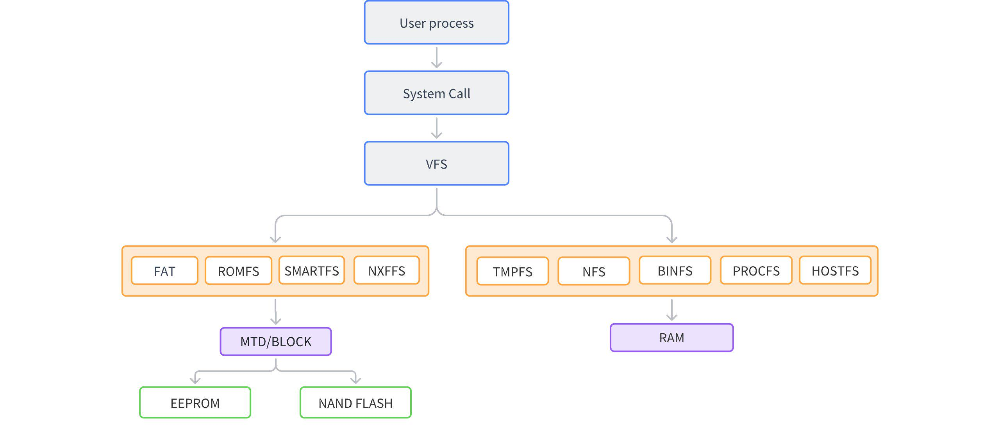

# File System

\[ English | [简体中文](../../../zh-cn/device_dev_guide/file_system/file_system.md) \]

## I. Overview

A file system is a mechanism for organizing data and metadata on storage devices. It is a core subsystem of the operating system for managing persistent data, providing data storage and access functions.

The process of associating a file system with a storage device is called mounting. When mounting, the file system is attached to the current file system hierarchy (usually the root directory). When performing a mount operation, the following need to be specified:

1. File system type
2. The file system itself
3. Mount point

### 1. Introduction to openvela File System

openvela provides an optional and extensible file system. It is worth noting that openvela does not depend on the existence of any file system, so this file system can be omitted entirely.

#### Pseudo Root File System

By setting `CONFIG_NFILE_DESCRIPTORS` to a non-zero value, an in-memory pseudo file system can be enabled.

A pseudo file system is an in-memory file system that does not require any storage medium or block driver support. Its content is generated in real-time through standard file system operations (such as `open`, `close`, `read`, `write`, etc.), hence it is called a pseudo file system (similar to Linux's `/proc` pseudo file system).

Features of the pseudo file system include:

- Supports accessing arbitrary data provided by users and executing related logic.
- Supports embedding character device driver and block device driver nodes into any directory of the pseudo file system. By convention, these nodes are usually placed in the `/dev` directory.

#### File System Mounting

The pseudo file system can be extended by mounting block devices to support mass storage devices and realize real file system access.

openvela supports the standard `mount()` command, which allows binding a block driver to a mount point in the pseudo file system. Currently, openvela mainly supports the following file systems:

- EXFAT
- ROMFS
- LITTLEFS
- TMPFS
- NXFFS

#### Comparison with Linux

From a programming perspective, openvela's file system is very similar to the Linux file system, but there is a fundamental difference:

- openvela's root file system is a pseudo file system, and real file systems can be mounted into the pseudo file system.
- Linux's root file system is usually a real file system, and pseudo file systems are mounted in the real root file system.

This design enables openvela to support from resource-constrained small embedded platforms to medium-sized device platforms with certain computing capabilities, providing better scalability.

### 2. Relationship between File Descriptor (fd) and Task Creation

In openvela, different task creation methods handle file descriptors (fd) as follows:

- `pthread_create`

    - New tasks do not create a new task group.
    - Do not copy file descriptors (fd), directly use the fd list of the parent task group.

- `kthread_create`

    - New tasks do not create a new task group.
    - Do not copy file descriptors (fd), use the kernel's public fd list, i.e., the fd list of `g_kthread_group`.

- `task_create`

    - New tasks will create a new task group.
    - Will copy the file descriptor (fd) list of the parent task.

## II. Data Structures

### 1. `struct inode`

`inode` is one of the most important data structures in the file system, used to store basic information about files. Its definition is as follows:

```C
struct inode
{
  FAR struct inode *i_peer;     /* Link to same level inode */
  FAR struct inode *i_child;    /* Link to lower level inode */
  int16_t           i_crefs;    /* References to inode */
  uint16_t          i_flags;    /* Flags for inode */
  union inode_ops_u u;          /* Inode operations */
#ifdef CONFIG_FILE_MODE
  mode_t            i_mode;     /* Access mode flags */
#endif
  FAR void         *i_private;  /* Per inode driver private data */
  char              i_name[1];  /* Name of inode (variable) */
};
```

Field Description

- `i_peer` and `i_child`

    These two fields organize `inode` into a tree structure for easy management and access.

- `i_flags`

    Contains flag bits to identify file types and other states. For example:

    - `Character driver`
    - `Block driver`
    - `Mount point`
    - `Special OS type`
    - `Named semaphore`
    - `Message Queue`
    - `Shared memory region`
    - `Soft link`

- `i_private`

    In the driver, it is usually used to store private data.

- `union inode_ops_u u`

    Stores a collection of operation functions for `inode`. For different types of `inode`, this field contains different operation functions.

#### `union inode_ops_u`

`union inode_ops_u` is a collection of operations for `inode`, used to provide a unified operation interface for different types of file systems and devices. It defines a set of operation functions through function pointers, supporting file operations, block device operations, mount point operations, and special resource management. Its definition is as follows:

```C
union inode_ops_u
{
  FAR const struct file_operations     *i_ops;    /* Driver operations for inode */
#ifndef CONFIG_DISABLE_MOUNTPOINT
  FAR const struct block_operations    *i_bops;   /* Block driver operations */
  FAR struct mtd_dev_s                 *i_mtd;    /* MTD device driver */
  FAR const struct mountpt_operations  *i_mops;   /* Operations on a mountpoint */
#endif
#ifdef CONFIG_FS_NAMED_SEMAPHORES
  FAR struct nsem_inode_s              *i_nsem;   /* Named semaphore */
#endif
#ifdef CONFIG_PSEUDOFS_SOFTLINKS
  FAR char                             *i_link;   /* Full path to link target */
#endif
};
```

There are mainly four sets of operation functions. In addition, VFS (Virtual File System) maintains special resources such as `Named semaphores`. These resources do not have corresponding function operation sets like other types of files and are special cases. Their related processing logic is also integrated into this structure.

`union inode_ops_u` mainly includes the following types of operation function sets:

##### `struct file_operations`

`struct file_operations` is a collection of operation functions for drivers. When implementing a driver, developers need to implement the functions in this structure according to specific requirements.

```C
struct file_operations
{
  /* The device driver open method differs from the mountpoint open method */

  int     (*open)(FAR struct file *filep);

  /* The following methods must be identical in signature and position because
   * the struct file_operations and struct mountp_operations are treated like
   * unions.
   */

  int     (*close)(FAR struct file *filep);
  ssize_t (*read)(FAR struct file *filep, FAR char *buffer, size_t buflen);
  ssize_t (*write)(FAR struct file *filep, FAR const char *buffer, size_t buflen);
  off_t   (*seek)(FAR struct file *filep, off_t offset, int whence);
  int     (*ioctl)(FAR struct file *filep, int cmd, unsigned long arg);

  /* The two structures need not be common after this point */

#ifndef CONFIG_DISABLE_POLL
  int     (*poll)(FAR struct file *filep, struct pollfd *fds, bool setup);
#endif
#ifndef CONFIG_DISABLE_PSEUDOFS_OPERATIONS
  int     (*unlink)(FAR struct inode *inode);
#endif
};
```

##### `struct block_operations`

`struct block_operations` is a collection of operations for block device drivers, providing a standardized interface for interaction between the file system and block devices. Through these interfaces, the file system can access block devices correctly.

`struct block_operations` provides the following common operations:

- Read operation: Read data from the block device.

- Write operation: Write data to the block device.

- Synchronization operation: Synchronize data in the cache to the block device to ensure data consistency.

The design of these operation interfaces enables the file system to collaborate with the underlying block devices efficiently and reliably.

```C
struct block_operations
{
  int     (*open)(FAR struct inode *inode);
  int     (*close)(FAR struct inode *inode);
  ssize_t (*read)(FAR struct inode *inode, FAR unsigned char *buffer,
            size_t start_sector, unsigned int nsectors);
  ssize_t (*write)(FAR struct inode *inode, FAR const unsigned char *buffer,
            size_t start_sector, unsigned int nsectors);
  int     (*geometry)(FAR struct inode *inode, FAR struct geometry *geometry);
  int     (*ioctl)(FAR struct inode *inode, int cmd, unsigned long arg);
#ifndef CONFIG_DISABLE_PSEUDOFS_OPERATIONS
  int     (*unlink)(FAR struct inode *inode);
#endif
};
```

##### `struct mountpt_operations`

`struct mountpt_operations` is a collection of operations for mount points, providing a standardized interface for interaction between the file system and mount points. Through this structure, the file system can implement normal file operations and management functions on the mount point.

```C
struct inode;
struct fs_dirent_s;
struct stat;
struct statfs;
struct mountpt_operations
{
  /* The mountpoint open method differs from the driver open method
   * because it receives (1) the inode that contains the mountpoint
   * private data, (2) the relative path into the mountpoint, and (3)
   * information to manage privileges.
   */

  int     (*open)(FAR struct file *filep, FAR const char *relpath,
            int oflags, mode_t mode);

  /* The following methods must be identical in signature and position
   * because the struct file_operations and struct mountp_operations are
   * treated like unions.
   */

  int     (*close)(FAR struct file *filep);
  ssize_t (*read)(FAR struct file *filep, FAR char *buffer, size_t buflen);
  ssize_t (*write)(FAR struct file *filep, FAR const char *buffer,
            size_t buflen);
  off_t   (*seek)(FAR struct file *filep, off_t offset, int whence);
  int     (*ioctl)(FAR struct file *filep, int cmd, unsigned long arg);

  /* The two structures need not be common after this point. The following
   * are extended methods needed to deal with the unique needs of mounted
   * file systems.
   *
   * Additional open-file-specific mountpoint operations:
   */

  int     (*sync)(FAR struct file *filep);
  int     (*dup)(FAR const struct file *oldp, FAR struct file *newp);
  int     (*fstat)(FAR const struct file *filep, FAR struct stat *buf);

  /* Directory operations */

  int     (*opendir)(FAR struct inode *mountpt, FAR const char *relpath,
            FAR struct fs_dirent_s *dir);
  int     (*closedir)(FAR struct inode *mountpt,
            FAR struct fs_dirent_s *dir);
  int     (*readdir)(FAR struct inode *mountpt,
            FAR struct fs_dirent_s *dir);
  int     (*rewinddir)(FAR struct inode *mountpt,
            FAR struct fs_dirent_s *dir);

  /* General volume-related mountpoint operations: */

  int     (*bind)(FAR struct inode *blkdriver, FAR const void *data,
            FAR void **handle);
  int     (*unbind)(FAR void *handle, FAR struct inode **blkdriver,
            unsigned int flags);
  int     (*statfs)(FAR struct inode *mountpt, FAR struct statfs *buf);

  /* Operations on paths */

  int     (*unlink)(FAR struct inode *mountpt, FAR const char *relpath);
  int     (*mkdir)(FAR struct inode *mountpt, FAR const char *relpath,
            mode_t mode);
  int     (*rmdir)(FAR struct inode *mountpt, FAR const char *relpath);
  int     (*rename)(FAR struct inode *mountpt, FAR const char *oldrelpath,
            FAR const char *newrelpath);
  int     (*stat)(FAR struct inode *mountpt, FAR const char *relpath,
            FAR struct stat *buf);

  /* NOTE:  More operations will be needed here to support:  disk usage
   * stats file stat(), file attributes, file truncation, etc.
   */
};
```

### 2. `struct file`

When a file is opened, the system allocates a `struct file` structure for it. This structure represents the file during the file opening period and is used to manage and track the current state of the file. `struct file` contains a pointer to the corresponding `inode` and other information related to file operations.

#### Structure Definition

```C
struct file
{
  int               f_oflags;   /* Open mode flags */
  off_t             f_pos;      /* File position */
  FAR struct inode *f_inode;    /* Driver or file system interface */
  void             *f_priv;     /* Per file driver private data */
};
```

#### File Management and `struct filelist`

In each process, the `struct tcb_s` structure contains a `struct filelist` structure, which is used to maintain the files opened by the process. The main function of `struct filelist` is to store information about the `struct file` structures corresponding to the files opened by the process through a file array.

```C
struct filelist
{
  sem_t   fl_sem;               /* Manage access to the file list */
  struct file fl_files[CONFIG_NFILE_DESCRIPTORS];
}
```

#### File Descriptors and File Operations

When a process calls the POSIX standard `open()` interface to open a file, the system allocates a unique file descriptor for the file. The file descriptor is the index value of the file array in `struct filelist`, used to identify the files opened by the process.

Through the file descriptor, the process can easily access and operate the corresponding file. The system will find the corresponding `struct file` structure according to the file descriptor to complete operations such as reading, writing, and closing the file.

## III. Principle Analysis

The architecture and mounting process of the file system are the core parts of file management in the operating system. The following content conducts a detailed analysis from two aspects: the architecture framework and the mounting process.

### 1. Framework Analysis

The architecture diagram is as follows:



#### User Layer

- Function: The user layer is the entrance of the file system, and applications interact with the file system through system calls.
- Characteristics: Users can initiate file operation requests at this layer, such as opening, reading, writing, and closing files.
- Role: By calling standard interfaces, the user layer passes operation requests to the lower VFS (Virtual File System).

#### VFS Layer

- Function: The VFS layer is the adaptation layer of the file system, shielding the differences of the underlying file systems and providing a unified file operation interface for the user layer.
- Characteristics:
    - User layer applications do not need to care about the specific type of the underlying file system.
    - VFS provides a general interface, making file operations consistent.
- Role: By adapting to different actual file systems, the VFS layer realizes the abstraction of the file system and simplifies the operation complexity of the user layer.

#### Actual File System Layer

- Function: The actual file system layer is responsible for implementing specific file system logic, including data storage and management.
- Characteristics:
    - File systems that require block device support:
        - Implement data storage and reading through block device drivers.
        - Examples: FAT, ROMFS, SMARTFS, NXFFS.
    - File systems that do not require block device support:
        - Manage data directly, suitable for special scenarios.
        - Examples: BINFS, PROCFS, NFS, TMPFS.
- Role: Manage and store data in different ways according to the characteristics of the file system.

#### MTD (Memory Technology Devices) Layer

- Function: The MTD layer is a bridge between the file system and the underlying storage hardware.
- Characteristics:
    - Provides a unified MTD interface upwards for the file system to access.
    - Connects to different hardware devices downwards, handling interactions with storage hardware.
- Role: By abstracting hardware differences, the MTD layer enables the file system to work normally on a variety of storage hardware.

### 2. Mounting Process

The `mount()` function is the core interface for file system mounting. Its main function is to associate the specified file system with the target path, enabling users to access files and directories in the file system through this path.

#### Function Definition

The `mount()` function is defined as follows:

```C
int mount(FAR const char *source, FAR const char *target,
          FAR const char *filesystemtype, unsigned long mountflags,
          FAR const void *data);
```

- `source`: Block device path (if needed).
- `target`: Mount point path.
- `filesystemtype`: File system type.
- `mountflags`: Mount flags.
- `data`: File system-specific mount parameters.

#### Related Data Structures

##### `struct fsmap_t`

`fsmap_t` is used to map file system names to their operation function sets. When the `mount()` function is executed, this structure finds the corresponding operation function set `struct mountpt_operations` according to the file system name.

```C
struct fsmap_t
{
  FAR const char                      *fs_filesystemtype;
  FAR const struct mountpt_operations *fs_mops;
};
```

- `fs_filesystemtype`: File system type name.
- `fs_mops`: A pointer to the file system mount point operation function set.

##### `struct mountpt_operations`

`mountpt_operations` is a set of operation functions for the file system, which has been introduced above. Among them, the `bind()` function is a key part of the mounting process.

```C
/**
 * bind - Bind the file system to a block device driver
 * @blkdriver: Pointer to the inode structure corresponding to the block device driver
 * @data: Pointer to data related to the binding operation
 * @handle: Pointer used to return the handle of the binding operation
 *
 * The function is used to bind the file system to the specified block device driver.
 * After successful binding, the file system can read and write data through the block device driver.
 *
 * Return value:
 * Returns 0 on success, and a negative error code on failure.
 */

int (*bind)(FAR struct inode *blkdriver, FAR const void *data, FAR void **handle);
```

#### Key Code

The key code of `mount()` is as follows:

```C
int nx_mount(FAR const char *source, FAR const char *target,
             FAR const char *filesystemtype, unsigned long mountflags,
             FAR const void *data)
{
  ...
  /* Find the specified filesystem.  Try the block driver file systems first */

#ifdef BDFS_SUPPORT
  if (source && (mops = mount_findfs(g_bdfsmap, filesystemtype)) != NULL)
    {
      /* Make sure that a block driver argument was provided */

      DEBUGASSERT(source);

      /* Find the block driver */

      ret = find_blockdriver(source, mountflags, &blkdrvr_inode);
      if (ret < 0)
        {
          ferr("ERROR: Failed to find block driver %s\n", source);
          errcode = -ret;
          goto errout;
        }
    }
  else
#endif /* BDFS_SUPPORT */
#ifdef NONBDFS_SUPPORT
  if ((mops = mount_findfs(g_nonbdfsmap, filesystemtype)) != NULL)
    {
    }
  else
#endif /* NONBDFS_SUPPORT */
    {
      ferr("ERROR: Failed to find file system %s\n", filesystemtype);
      errcode = ENODEV;
      goto errout;
    }

  inode_semtake();

#ifndef CONFIG_DISABLE_PSEUDOFS_OPERATIONS
  /* Check if the inode already exists */

  SETUP_SEARCH(&desc, target, false);

  ret = inode_find(&desc);
  if (ret >= 0)
    {
      /* Successfully found.  The reference count on the inode has been
       * incremented.
       */

      mountpt_inode = desc.node;
      DEBUGASSERT(mountpt_inode != NULL);

      /* But is it a directory node (i.e., not a driver or other special
       * node)?
       */

      if (INODE_IS_SPECIAL(mountpt_inode))
        {
          ferr("ERROR: target %s exists and is a special node\n", target);
          errcode = -ENOTDIR;
          inode_release(mountpt_inode);
          goto errout_with_semaphore;
        }
    }
  else
#endif

  /* Insert a dummy node -- we need to hold the inode semaphore
   * to do this because we will have a momentarily bad structure.
   * NOTE that the new inode will be created with an initial reference
   * count of zero.
   */

    {
      ret = inode_reserve(target, &mountpt_inode);
      if (ret < 0)
        {
          /* inode_reserve can fail for a couple of reasons, but the most likely
           * one is that the inode already exists. inode_reserve may return:
           *
           *  -EINVAL - 'path' is invalid for this operation
           *  -EEXIST - An inode already exists at 'path'
           *  -ENOMEM - Failed to allocate in-memory resources for the operation
           */

          ferr("ERROR: Failed to reserve inode for target %s\n", target);
          errcode = -ret;
          goto errout_with_semaphore;
        }
    }

  /* Bind the block driver to an instance of the file system.  The file
   * system returns a reference to some opaque, fs-dependent structure
   * that encapsulates this binding.
   */

  if (!mops->bind)
    {
      /* The filesystem does not support the bind operation ??? */

      ferr("ERROR: Filesystem does not support bind\n");
      errcode = EINVAL;
      goto errout_with_mountpt;
    }

  /* Increment reference count for the reference we pass to the file system */

#ifdef BDFS_SUPPORT
#ifdef NONBDFS_SUPPORT
  if (blkdrvr_inode)
#endif
    {
      blkdrvr_inode->i_crefs++;
    }
#endif

  /* On failure, the bind method returns -errorcode */

#ifdef BDFS_SUPPORT
  ret = mops->bind(blkdrvr_inode, data, &fshandle);
#else
  ret = mops->bind(NULL, data, &fshandle);
#endif
  if (ret != 0)
    {
      /* The inode is unhappy with the blkdrvr for some reason.  Back out
       * the count for the reference we failed to pass and exit with an
       * error.
       */

      ferr("ERROR: Bind method failed: %d\n", ret);
#ifdef BDFS_SUPPORT
#ifdef NONBDFS_SUPPORT
      if (blkdrvr_inode)
#endif
        {
          blkdrvr_inode->i_crefs--;
        }
#endif
      errcode = -ret;
      goto errout_with_mountpt;
    }

  /* We have it, now populate it with driver specific information. */

  INODE_SET_MOUNTPT(mountpt_inode);

  mountpt_inode->u.i_mops  = mops;
#ifdef CONFIG_FILE_MODE
  mountpt_inode->i_mode    = mode;
#endif
  mountpt_inode->i_private = fshandle;
  inode_semgive();

  /* We can release our reference to the blkdrver_inode, if the filesystem
   * wants to retain the blockdriver inode (which it should), then it must
   * have called inode_addref().  There is one reference on mountpt_inode
   * that will persist until umount2() is called.
   */
...
}
```

The file system mounting operation mainly completes the following key steps:

1. (Optional) Find the file system operation function set and block device driver.

    - Call the `mount_findfs()` function to find the corresponding file system operation function set `mops` according to the passed parameter `filesystemtype`.
    - If the file system requires block device support, call the `find_blockdriver()` function to find the corresponding block device driver according to the passed parameter `source`.

    Purpose: Determine the operation mode of the file system and associate the corresponding block device driver (if needed) to prepare for subsequent mounting operations.

    **Note**: If `mount_findfs()` fails to find, it may return an error message, causing the mounting operation to be unable to continue.

2. Find or create the `inode` node of the mount point.

    Find the `inode` node corresponding to the path to be mounted according to the passed parameter `target`:

    - If the corresponding `inode` is found, check whether it is a valid directory node.
    - If the corresponding `inode` is not found, call the `inode_reserve()` function to create a new `mountpt_inode` node.

    Purpose: Determine the position of the mount point in the file system to ensure that the file system can be mounted to the specified path subsequently.

    **Note**: The mount point must be a valid directory node, not a special node (such as a device node). If `inode_reserve()` fails, it may be due to an invalid path, an existing node, or insufficient memory.

3. (Optional) Bind the file system to the block device driver.

    Call the `mops->bind()` function to bind the file system to the block device driver:

    - For file systems that do not require block device support, the `bind()` function may not need special handling.
    - For file systems that require block device support, the `bind()` function will save the overall state of the file system in `fshandle`.

    Purpose: Realize the association between the file system and the block device driver (if needed), so that the file system can read and write data through the block device.

    **Note**: If the `bind()` function returns an error, the system will roll back the mounting operation and release related resources.

4. Update the content of the mount point `inode` node.

    Update the content of the mount point `mountpt_inode`, including:

    - Set the operation function set `mops`.
    - Store the overall state of the file system (`fshandle`) in the `i_private` field of `mountpt_inode`.

    Purpose: Complete the final setting of the mount point, so that the file system is successfully mounted to the specified path.

    Description: After the mounting is completed, users can access the files and directories in the file system through the mount point. When the mount point `mountpt_inode` is opened, the system will retrieve the corresponding file system information according to the `i_private` field.
